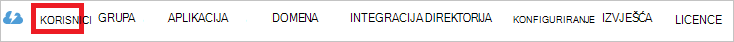

<properties
    pageTitle="Praktični vodič: Azure Active Directory Integracija s 360° mrežni | Microsoft Azure"
    description="Saznajte kako konfigurirati jedinstvenu prijavu između Azure Active Directory i 360° putem Interneta."
    services="active-directory"
    documentationCenter=""
    authors="jeevansd"
    manager="femila"
    editor=""/>

<tags
    ms.service="active-directory"
    ms.workload="identity"
    ms.tgt_pltfrm="na"
    ms.devlang="na"
    ms.topic="article"
    ms.date="09/01/2016"
    ms.author="jeedes"/>

# Praktični vodič: Azure Active Directory Integracija s 360° mrežni

Cilj ovog praktičnog vodiča je da bi se prikazala integraciji 360° mrežni s Azure Active Directory (Azure AD).

Integriranje 360° Online s Azure AD pruža sljedeće prednosti:

- Možete kontrolirati u Azure AD tko ima pristup 360° mrežni poslužitelja
- Možete omogućiti svojim korisnicima da automatski se prijavili u da biste 360° mrežni (jedinstvenu prijavu) s računa za Azure AD
- Možete upravljati svoje račune na jednom središnjem mjestu – Azure klasični portal

Ako želite saznati više pojedinosti o SaaS aplikacija Integracija s Azure AD potražite u članku [što je aplikacija programa access i jedinstvenu prijavu pomoću servisa Azure Active Directory](active-directory-appssoaccess-whatis.md).

## Preduvjeti

Da biste konfigurirali Azure AD Integracija 360° mrežni, potrebne su vam sljedeće stavke:

- Pretplatu na Azure AD
- 360° internetskog klijenta

> [AZURE.NOTE] Da biste testirali korake ovog praktičnog vodiča, ne preporučujemo korištenje radnog okruženja.

Da biste testirali korake ovog praktičnog vodiča, slijedite ove preporuke:

- Nemojte koristiti okruženja radnog osim ako je to potrebno.
- Ako nemate okruženju za Azure AD za probno razdoblje, možete preuzeti na jedan mjesec probne [ovdje](https://azure.microsoft.com/pricing/free-trial/).

## Scenarij opis
Cilj ovog praktičnog vodiča je omogućuju vam da biste testirali Azure AD jedinstvenu prijavu u okruženje za testiranje. 

Scenarij navedene u ovom ćete praktičnom vodiču sastoji se od dva glavna sastavni blokovi:

1. Dodavanje 360° mrežni iz galerije
2. Konfiguriranje i testiranje Azure AD jedan prijave

## Dodavanje 360° mrežni iz galerije
Da biste konfigurirali Integracija 360° mrežni u Azure AD, morate dodati 360° mrežni iz galerije na popis upravljani SaaS aplikacija.

**Da biste dodali 360° mrežni iz galerije, poduzmite sljedeće korake:**

1. **Azure klasični portal**u lijevom navigacijskom oknu kliknite **Servisa Active Directory**.

    ![Active Directory][1]

2. Popis **direktorija** odaberite direktorija za koji želite da biste omogućili integraciju direktorija.

3. Da biste otvorili prikaz aplikacija u prikazu direktorija, na gornjoj izborniku kliknite **aplikacije** .

    ![Aplikacija][2]

4. Kliknite **Dodaj** pri dnu stranice.

    ![Aplikacija][3]

5. U dijaloškom okviru **što želite učiniti** kliknite **Dodaj aplikaciju iz galerije**.

    ![Aplikacija][4]

6. U okvir za pretraživanje upišite **360 ° putem Interneta**.

    

7. U oknu s rezultatima odaberite **360 ° putem Interneta**, a zatim **Dovršeno** da biste dodali aplikaciju.
 
    

##  Konfiguriranje i testiranje Azure AD jedan prijave
Cilj ovaj odjeljak je da bi se prikazala konfiguriranje i testiranje Azure AD jedinstvenu prijavu s 360° Online utemeljeno na korisniku testa pod nazivom "Britta Dan Simona".

Za jedinstvenu prijavu raditi, Azure AD treba znati koje postoji zamjena u obliku korisnika u 360° Online korisniku u Azure AD je. Drugim riječima, veza odnos između programa Azure AD korisnik i povezane u 360° Online mora uspostaviti.

Konfiguriranje i testiranje Azure AD jedinstvenu prijavu s 360° mrežni, morate dovršiti sljedeće sastavni blokovi:

1. **[Konfiguriranje Azure AD jedinstvenu prijavu](#configuring-azure-ad-single-sign-on)** – da biste omogućili korisnicima da biste koristili ovu značajku.
2. **[Stvaranje Azure AD testiranje korisnika](#creating-an-azure-ad-test-user)** – da biste testirali Azure AD jedinstvenu prijavu s dan Britta Simona.
4. **[Stvaranje 360 ° mrežni testiranje korisnika](#creating-a-360-online-test-user)** – da bi se na postoji zamjena u obliku od dan Britta Simona u 360 ° Online koja je povezana s predstavljanje Azure AD njegove.
5. **[Dodjela Azure AD testiranje korisnika](#assigning-the-azure-ad-test-user)** – da biste omogućili Dan Simona Britta da biste koristili Azure AD jedinstvenu prijavu.
5. **[Testiranje jedinstvenu prijavu](#testing-single-sign-on)** – da biste provjerili funkcionira li konfiguracije.

### Konfiguriranje Azure AD jedinstvene prijave

Cilj ovaj odjeljak je omogućiti Azure AD jedinstvenu prijavu na portalu za Azure klasični i konfiguriranje jedinstvenu prijavu u 360° mrežni aplikacije.

**Da biste konfigurirali Azure AD jedinstvenu prijavu 360° mrežni, poduzmite sljedeće korake:**

1. U na Azure klasični portal, na stranici za integraciju aplikacije **360 ° mrežni** kliknite **Konfiguriraj jedinstvenu prijavu** da biste otvorili dijaloški okvir **Konfiguriranje jedinstvenu prijavu** .

    ![Konfiguriranje jedinstvenu prijavu][13] 

2. Na stranici **kako biste željeli korisnika da biste se prijavili na Internetu 360 °** odaberite **Azure AD jedinstvenu prijavu**, a zatim kliknite **Dalje**.

     

3. Na stranici dijaloški okvir **Konfiguriranje URL adresa Web App** poduzeti sljedeće korake, a zatim kliknite **Dalje**.

    

    na. U tekstni okvir **Prijavite se na URL** unesite URL koji se koristi korisnicima prijave za 360 ° mrežni aplikacije pomoću sljedećeg uzorka:`https://<company name>.public360online.com`

    b. Kliknite **Dalje**

4. Na stranici dijaloški okvir **Konfiguriranje URL adresa Web App** poduzeti sljedeće korake, a zatim kliknite **Dalje**.

     

    na. Kliknite **Preuzmi metapodataka**i spremite je na vašem računalu.

    b. Kliknite **Dalje**.

5. Da biste dobili SSO konfiguriran za aplikaciju, obratite se službi za mrežnu podršku 360° putem [360online@software-innovation.com](mailto:360online@software-innovation.com) i priložili datoteku preuzete metapodataka za poštu.

6. Azure klasični portalu odaberite potvrdu jedan konfiguracije za prijavu pa zatim kliknite **Dalje**.

    ![Azure AD jedinstvene prijave][10]

7. Na stranici za **potvrdu jedan prijave** kliknite **dovrši**.  

    ![Azure AD jedinstvene prijave][11]

### Stvaranje Azure AD korisnik test
Cilj ovaj odjeljak je da biste stvorili testnih korisnika u Azure klasični portalu naziva dan Britta Simona.

![Stvaranje Azure AD korisnika][20]

**Da biste stvorili testnih korisnika u Azure AD, poduzmite sljedeće korake:**

1. **Azure klasični portal**u lijevom navigacijskom oknu kliknite **Servisa Active Directory**.

     

2. Popis **direktorija** odaberite direktorija za koji želite da biste omogućili integraciju direktorija.

3. Da biste prikazali popis korisnika, na izborniku na vrhu, kliknite **korisnicima**.
 
     

4. Da biste otvorili dijaloški okvir **Dodavanje korisnika** na alatnoj traci na dnu, kliknite **Dodaj korisnika**.

    

5. Na stranici dijaloški okvir **Recite nam o korisniku** , učinite sljedeće:

     

    na. Kao **Korisnik vrste**, odaberite **novi korisnik u tvrtki ili ustanovi**.

    b. U tekstni okvir **Korisničko ime** upišite **BrittaSimon**.

    c. Kliknite **Dalje**.

6.  Na stranici dijaloški **Korisničkog profila** , učinite sljedeće:

     

    na. U tekstni okvir **ime** upišite **Britta**.  

    b. U zadnji tekstni okvir **Naziv** , vrstu **Dan Simona**.

    c. U tekstni okvir **Zaslonski naziv** upišite **Dan Britta Simona**.

    d. Na popisu **uloga** odaberite **korisnik**.

    e. Kliknite **Dalje**.

7. Na stranici dijaloški okvir **Dohvati privremenu lozinku** , kliknite **Stvori**.

     

8. Na stranici za **Početak privremenu lozinku** dijaloški poduzeti sljedeće korake:
 
     

    na. Zapišite vrijednost **Novu lozinku**.

    b. Kliknite **dovrši**.   

### Stvaranje korisnika 360° mrežni test

Cilj ovaj odjeljak je stvaranje naziva dan Britta Simona u 360° mrežni korisnika. 

Da biste dobili korisnika u 360° mrežni stvorili, morate obratite se službi za podršku za Online 360° putem [360online@software-innovation.com](mailto:360online@software-innovation.com).

### Dodjela korisnika test Azure AD

Cilj ovaj odjeljak je omogućavanja Dan Simona Britta da biste koristili Azure jedinstvenu prijavu dozvolite pristup Internetu 360°.

![Dodijeli korisniku][200] 

**Da biste dodijelili 360° mrežni dan Britta Simona, učinite sljedeće:**

1. Azure portala za klasični da biste otvorili prikaz aplikacija u prikazu direktorija, kliknite **aplikacije** u gornji izbornik.
 
    ![Dodijeli korisniku][201] 

2. Na popisu aplikacija odaberite **360 ° putem Interneta**.

     

1. Na izborniku na vrhu kliknite **korisnicima**.

    ![Dodijeli korisniku][203]

1. Na popisu korisnika odaberite **Dan Britta Simona**.

2. Na alatnoj traci na dnu kliknite **Dodijeli**.

    ![Dodijeli korisniku][205]

### Testiranje jedinstvenu prijavu

Cilj ovaj odjeljak je testiranju Azure AD jedan prijave konfiguracije pomoću ploče programa Access.

Kada kliknete 360° mrežni pločica na ploči za pristup, koje treba se automatski prijavljeni u da biste 360° mrežni aplikacija.

## Dodatni resursi

* [Popis vodiče za integrirane aplikacije SaaS Azure Active Directory](active-directory-saas-tutorial-list.md)
* [Što je aplikacija programa access i jedinstvenu prijavu pomoću servisa Azure Active Directory?](active-directory-appssoaccess-whatis.md)

<!--Image references-->

[1]: ./media/active-directory-saas-360online-tutorial/tutorial_general_01.png
[2]: ./media/active-directory-saas-360online-tutorial/tutorial_general_02.png
[3]: ./media/active-directory-saas-360online-tutorial/tutorial_general_03.png
[4]: ./media/active-directory-saas-360online-tutorial/tutorial_general_04.png

[10]: ./media/active-directory-saas-360online-tutorial/tutorial_general_06.png
[11]: ./media/active-directory-saas-360online-tutorial/tutorial_general_07.png
[12]: ./media/active-directory-saas-360online-tutorial/tutorial_general_08.png
[13]: ./media/active-directory-saas-360online-tutorial/tutorial_general_09.png
[20]: ./media/active-directory-saas-360online-tutorial/tutorial_general_100.png

[200]: ./media/active-directory-saas-360online-tutorial/tutorial_general_200.png
[201]: ./media/active-directory-saas-360online-tutorial/tutorial_general_201.png
[203]: ./media/active-directory-saas-360online-tutorial/tutorial_general_203.png
[205]: ./media/active-directory-saas-360online-tutorial/tutorial_general_205.png
