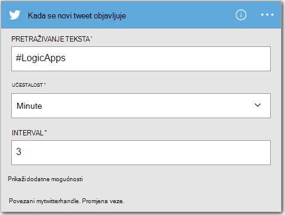
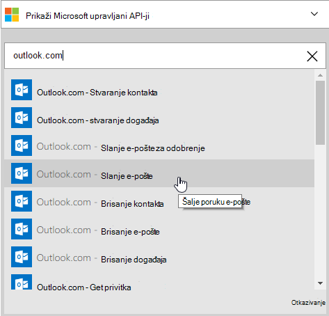
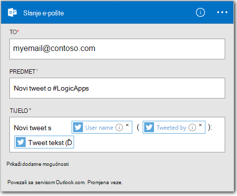

<properties
    pageTitle="Stvaranje aplikacije za logiku | Microsoft Azure"
    description="Saznajte kako stvoriti logike aplikacije povezivanje SaaS services"
    authors="jeffhollan"
    manager="dwrede"
    editor=""
    services="logic-apps"
    documentationCenter=""/>

<tags
    ms.service="logic-apps"
    ms.workload="na"
    ms.tgt_pltfrm="na"
    ms.devlang="na"
    ms.topic="get-started-article"
    ms.date="10/18/2016"
    ms.author="jehollan"/>

# Stvorite novu aplikaciju logike povezivanja SaaS services

U ovoj se temi objašnjava kako, u samo nekoliko minuta, početak rada s [Aplikacijama logike Azure](app-service-logic-what-are-logic-apps.md). Ćemo vas provesti kroz jednostavnog tijeka rada koji omogućuje slanje zanimljiv tweets s e-poštom.

Da biste koristili ovom scenariju, potrebno je:

- Azure pretplate
- Račun za Twitter
- Outlook.com ili hostiranu poštanski sandučić za Office 365

## Stvorite novu aplikaciju logike e-pošte koju tweets

1. Na [Azure portala nadzorne ploče](https://portal.azure.com), odaberite **Novo**. 
2. U trake za pretraživanje potražite "logike aplikacije", a zatim **Logike aplikacije**. Odaberite **Novo** **Web + Mobile**, i odaberite **Logike aplikacije**. 
3. Unesite naziv aplikacije logike, odaberite lokaciju, grupa resursa i odaberite **Stvori**.  Ako odaberete **Prikvači na nadzornoj ploči** logike aplikacija će automatski otvoriti jednom implementiran.  
4. Nakon otvaranja aplikacije logike prvi put možete odabrati iz predloška za pokretanje.  Sada klikom na **Prazan logike aplikacije** da biste sastavili to ispočetka. 
1. Prva stavka potrebnih za stvaranje je okidač.  Ovo je događaj koji će se pokrenuti aplikaciju logike.  Traženje u okvir za pretraživanje okidača na **twitteru** i odaberite ga.
7. Sada ćete upišite u pojam za pretraživanje da biste pokrenuli na.  **Učestalost** i **Interval** ćete odrediti koliko često aplikacijom logike će provjeravati nove tweets (i Vrati sve tweets tijekom koji vremenski raspon).
    

5. Odaberite gumb **Novi korak** , a zatim odaberite **Dodaj akciju** ili **Dodaj uvjet**
6. Kad odaberete **Dodaj akciju**, možete pretraživati [Dostupni poveznici](../connectors/apis-list.md) za željenu akciju. Na primjer, možete odabrati **Outlook.com - Pošalji e-poštu** slanja e-pošte s adrese outlook.com:  
    

7. Sada imate ispunjavanje parametara za e-pošte koji želite:  

8. Na kraju, odaberite **Spremi** da biste aplikaciju logike uživo.

## Upravljanje aplikacijom logike nakon stvaranja

Sada je aplikacija logike s radom. To će povremeno potražiti tweets s unijeli pojam za pretraživanje. Kad pronađe odgovarajući tweet, ga će poslati poruku e-pošte. Na kraju, ćete vidjeti kako onemogućiti aplikaciju ili potražite u članku način na koji je način.

1. Idite na [Portal za Azure](https://portal.azure.com)

1. Kliknite **Pregledaj** na lijevoj strani zaslona, a zatim odaberite **Logike aplikacije**.

2. Kliknite Nova aplikacija logike koji ste upravo stvorili da biste vidjeli trenutni status i opće informacije.

3. Da biste uredili novu aplikciju logike, kliknite **Uredi**.

5. Da biste isključili aplikaciju, kliknite **Onemogući** na naredbenoj traci.

1. Prikaz pokrenuti i pokretanje transparentnost praćenje kada je pokrenut logike aplikacije.  Kliknite **Osvježi** da biste vidjeli najnovije podatke.

Za manje od 5 minuta uspijete postavljanje jednostavne logike aplikacije izvodi u oblaku. Dodatne informacije o korištenju aplikacije logike značajki potražite u članku [Korištenje logike aplikacije]. Da biste saznali više o definicije logike aplikacije same, potražite u članku [Autor definicije logike aplikacije](app-service-logic-author-definitions.md).

<!-- Shared links -->
[Azure portal]: https://portal.azure.com
[Korištenje značajke aplikacije logike]: app-service-logic-create-a-logic-app.md
