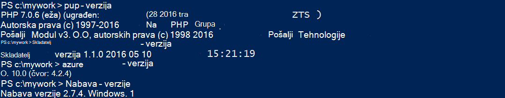
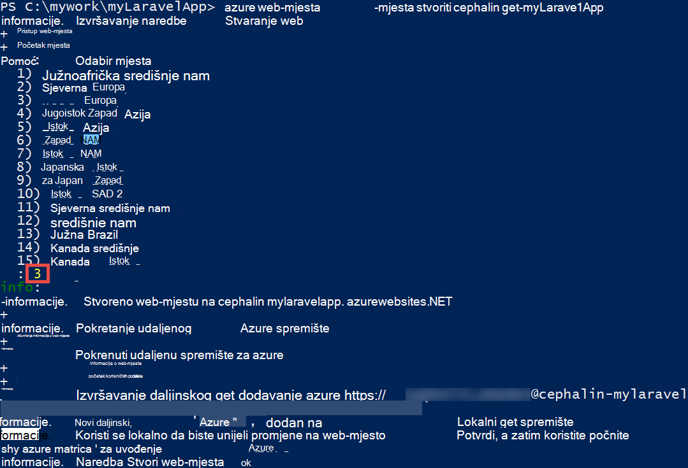
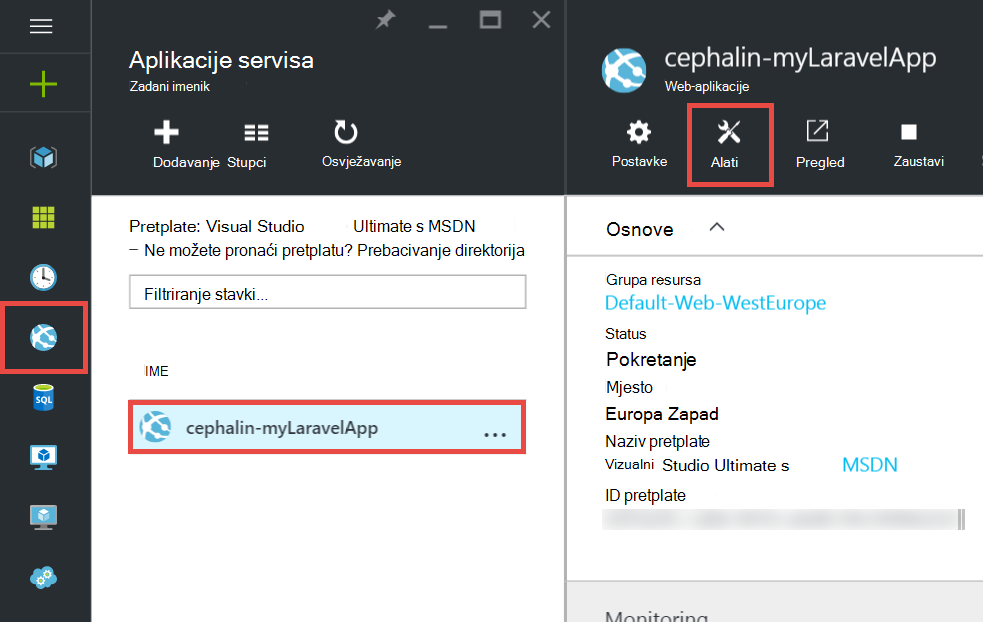
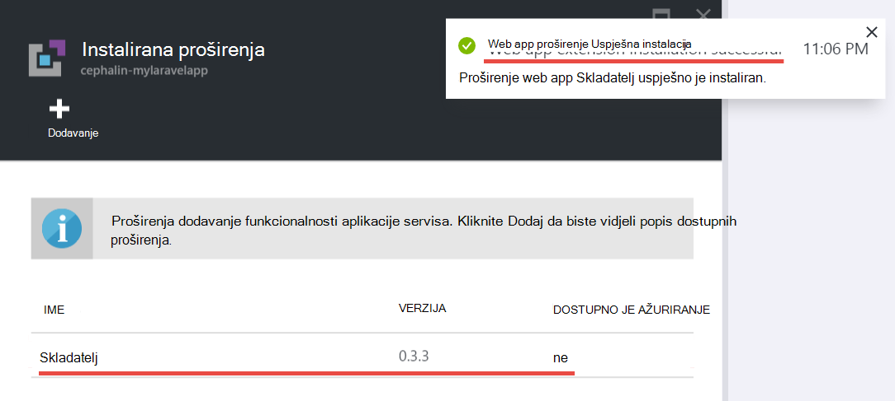
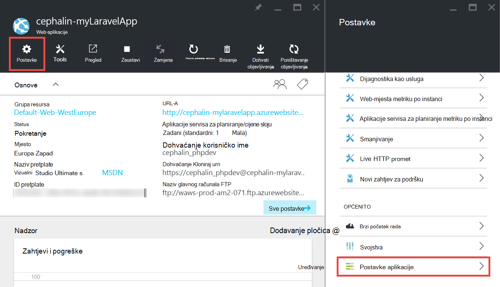
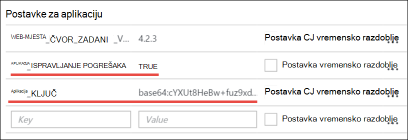
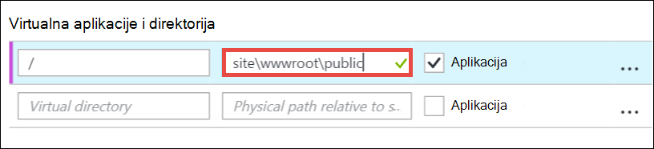
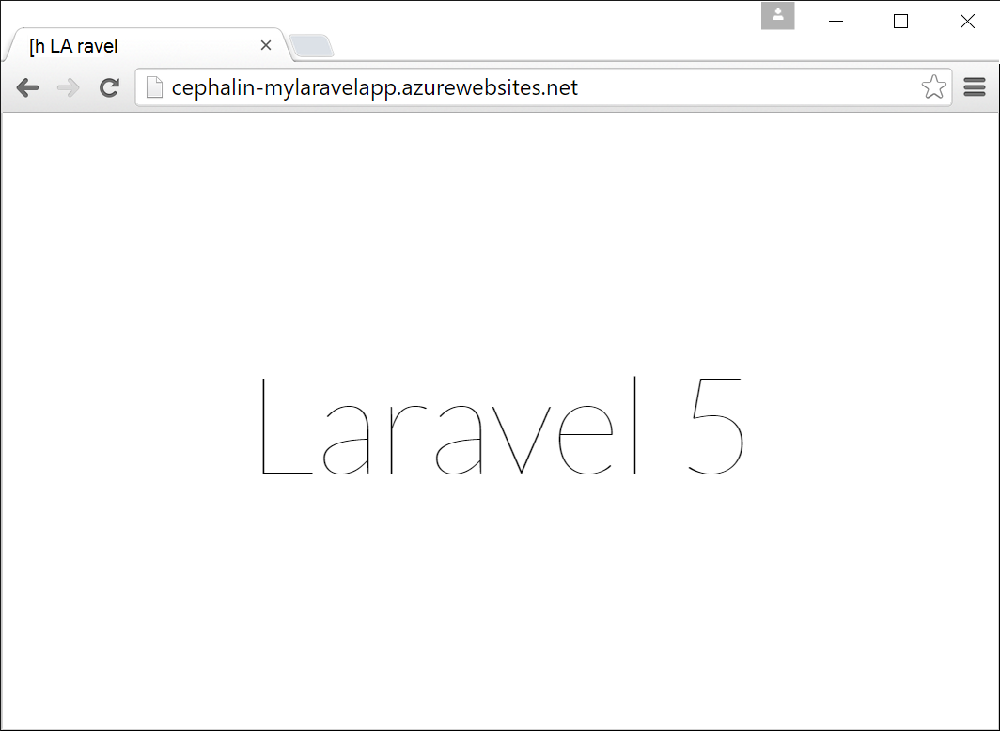
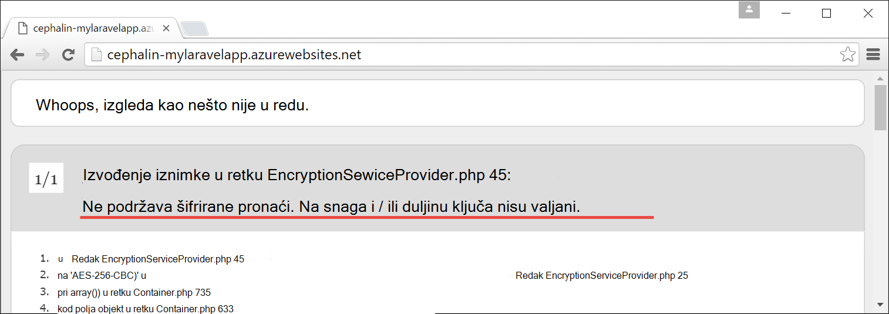

<properties
    pageTitle="Stvaranje, konfiguriranje i implementacija web-aplikacijama PHP Azure"
    description="Praktični vodič koji pokazuje kako web-aplikacijama i (Laravel) u aplikacije servisa za Azure. Saznajte kako konfigurirati Azure aplikacije servisa za zadovoljava preduvjete framework i odaberete."
    services="app-service\web"
    documentationCenter="php"
    authors="cephalin"
    manager="wpickett"
    editor=""
    tags="mysql"/>

<tags
    ms.service="app-service-web"
    ms.workload="web"
    ms.tgt_pltfrm="na"
    ms.devlang="PHP"
    ms.topic="article"
    ms.date="06/03/2016" 
    ms.author="cephalin"/>

# Stvaranje, konfiguriranje i implementacija web-aplikacijama i Azure

[AZURE.INCLUDE [tabs](../../includes/app-service-web-get-started-nav-tabs.md)]

Pomoću ovog praktičnog vodiča pokazuje kako stvoriti, konfiguriranje i implementacija web-aplikacijama i za Azure i upute za konfiguriranje aplikacije servisa za Azure da biste zadovoljava preduvjete i web-aplikacije. Do kraja vodič, imat ćete raditi [Laravel](https://www.laravel.com/) web-aplikacije radi uživo u [Servisu Azure aplikacije](../app-service/app-service-value-prop-what-is.md).

Kao i razvojni inženjer vaša omiljena framework i možete premjestiti i za Azure. Pomoću ovog praktičnog vodiča koristi Laravel jednostavno kao primjer s konkretni aplikacije. Saznat ćete: 

- Implementacija pomoću brojka
- Postavljanje i verzije
- Korištenje start datoteke koja nije u korijenskom direktoriju aplikacije
- Varijable specifične za okruženje programa Access
- Ažuriranje aplikacije u Azure

Možete primijeniti što ste saznali ovdje na drugi i web-aplikacije koje implementirati Azure.

>[AZURE.INCLUDE [app-service-linux](../../includes/app-service-linux.md)] 

## Preduvjeti

- Instalacija [PHP 5.6.x](http://php.net/downloads.php) (7 i podršku je beta)
- Instalacija [Skladatelj](https://getcomposer.org/download/)
- Instalacija [Azure EŽA](../xplat-cli-install.md)
- Instalacija [brojka](http://www.git-scm.com/downloads)
- Dobivanje korisničkog računa za Microsoft Azure. Ako nemate račun, možete ga [Registrirajte se za besplatnu probnu verziju](/pricing/free-trial/?WT.mc_id=A261C142F) ili [aktivirali svoje prednosti pretplatnika Visual Studio](/pricing/member-offers/msdn-benefits-details/?WT.mc_id=A261C142F).

>[AZURE.NOTE] U odjeljku web-aplikacijama na djelu. [Aplikacije servisa za isprobajte](http://go.microsoft.com/fwlink/?LinkId=523751) odmah i stvaranje short-lived starter aplikacije – bez kreditne kartice potrebna, bez preuzete obveze.

## Stvaranje aplikacije za PHP (Laravel) na računalu razvojni

1. Otvorite novi Windows naredbeni redak, u prozoru ljuske PowerShell, Linux ljuske ili terminal OS X. Pokrenite sljedeće naredbe da biste potvrdili da potrebni alati su pravilno instaliran na vašem računalu. 

        php --version
        composer --version
        azure --version
        git --version

    

    Ako još niste instalirali alate, potražite u članku [preduvjeti](#Prerequisites) za preuzimanje veze.
    
2. Instalacija Laravel ovako:

        composer global require "laravel/installer

3. `CD`u radni direktorij i stvorite novu aplikaciju Laravel ovako:

        cd <working_directory>
        laravel new <app_name>

4. `CD`u na novostvorenom `<app_name>` direktorija i testiranje aplikaciju ovako:

        cd <app_name>
        php artisan serve
        
    Trebali biste moći do http://localhost:8000 u pregledniku, a zatim potražite u članku Laravel pozdravnom zaslonu.
    
    
    
Pa daleko, jednostavno običan Laravel tijeka rada, a niste ovdje da biste <a href="https://laravel.com/docs/5.2" rel="nofollow">saznali Laravel</a>. Pogledajmo pa prijeđite na.

## Stvaranje aplikacije za Azure web i postavljanje brojka implementacije

>[AZURE.NOTE] "Pričekajte! Što ako želim implementacija s FTP?" Postoji [FTP vodič](web-sites-php-mysql-deploy-use-ftp.md) za vaše potrebe. 

EŽA Azure možete stvoriti aplikaciju za web u aplikacije servisa za Azure i postaviti za implementaciju brojka s s jednim retkom naredbe. Učinimo to.

1. Promjena u način ASM i prijavite se u sustav Azure:

        azure config mode asm
        azure login
    
    Praćenje poruka pomoći da biste nastavili postupak prijave.
    
    

4. Pokrenite naredbu da biste stvorili Azure web-aplikaciji brojka implementacije. Kada se to od vas zatraži, navedite broj željeno područje.

        azure site create --git <app_name>
    
    
    
    >[AZURE.NOTE] Ako nikada ne postavite vjerodajnice za implementaciju Azure pretplatu, morat ćete ih stvorite. Koristi te vjerodajnice, ne vjerodajnice račun za Azure, su aplikacije servisa samo za brojka implementacije i FTP prijave. 
    
    Ta naredba stvara novi brojka spremište na trenutnog direktorija (s `git init`), a povezuje s spremište u Azure kao brojka daljinskog (s `git remote add`).

<a name="configure"/>
## Konfiguriranje Azure web-aplikaciji

Za aplikaciju Laravel programa za rad u Azure, morate obratite pažnju na nekoliko stvari. Ovu slične vježbu podešava za vaše framework i po izboru.

- Konfiguriranje PHP 5.5.9 ili noviji. Cijeli popis poslužiteljski preduvjeti potražite u članku [Najnovije Laravel 5,2 poslužiteljski preduvjeti](https://laravel.com/docs/5.2#server-requirements) . Ostatak popis su proširenja koji su već omogućeni u sklopu Azure korisnika i instalacije. 
- Postavljanje varijable okruženja aplikacije potreban. Koristi Laravel na `.env` datoteka za jednostavno postavljanje varijable okruženja. Međutim, od ga ne bi trebao biti izvršene u kontrolu izvora (u odjeljku [Konfiguriranje okruženja Laravel](https://laravel.com/docs/5.2/configuration#environment-configuration)će umjesto toga postaviti postavki aplikacije Azure web-aplikacije.
- Provjerite je li da pokažete unosa za aplikaciju Laravel, `public/index.php`, najprije je učitana. Potražite u članku [Pregled Laravel životni ciklus](https://laravel.com/docs/5.2/lifecycle#lifecycle-overview). Drugim riječima, morate postaviti web-aplikaciji korijenski URL-a pokažite na `public` direktorija.
- Omogućivanje Skladatelj datotečni nastavak u Azure, budući da ste na composer.json. Na taj način, možete pustiti da Skladatelj brinuti o tome kako nabaviti paketi za potreban ako pokrenete s `git push`. Pitanje praktičnost je. Ako ne omogućite Skladatelj Automatizacija, samo želite ukloniti `/vendor` iz na `.gitignore` datoteke tako da obuhvaća brojka ("Poništi-zanemaruje") sve u na `vendor` direktorija prilikom prosljeđivanja i implementacija kod.

Recimo da sekvencijalno konfigurirati sljedeće zadatke.

4. Postavljanje verzije i koje je potrebno Laravel aplikacije.

        azure site set --php-version 5.6

    Završite postavljanje verzije i! 
    
4. Stvaranje novog `APP_KEY` vaše Azure web-aplikacije i postavite ga kao u aplikaciju postavke za Azure web-aplikaciju programa.

        php artisan key:generate --show
        azure site appsetting add APP_KEY="<output_of_php_artisan_key:generate_--show>"

4. Osim toga, uključite Laravel ispravljanje pogrešaka da bi se preempt sve prekomplicirano `Whoops, looks like something went wrong.` stranice.

        azure site appsetting add APP_DEBUG=true

    Završite postavljanje varijable okruženja!
    
    >[AZURE.NOTE] Pričekajte, recimo usporiti malo i objašnjavaju što označava Laravel i Azure funkcija ovdje. Koristi Laravel na `.env` datoteke u korijenskom direktoriju da varijable okruženja aplikaciju, gdje ćete pronaći u retku `APP_DEBUG=true` (i `APP_KEY=...`). Ova varijabla pristupa u `config/app.php` šifrom     `'debug' => env('APP_DEBUG', false),`. [env()](https://laravel.com/docs/5.2/helpers#method-env) je način za Laravel preglednika koji koristi i [getenv()](http://php.net/manual/en/function.getenv.php) u odjeljku s naslovnice.
    >
    >Međutim, `.env` brojka zanemariti jer je oblačićima tako da na `.gitignore` datoteke u korijenskom direktoriju. Jednostavno staviti `.env`  
 u vaše lokalne brojka spremište je ne završi Azure s ostatkom datoteke. Naravno, možete ukloniti samo taj redak iz `.gitignore`, ali ne možemo već uspostavite da potvrđivanja ove datoteke u kontrolu izvorišnog ne preporučuje se. Ipak, i dalje ćete odrediti ove varijable okruženja u Azure. 
    >
    >Dobra je vijest podržava li postavke za aplikaciju u aplikacije servisa za Azure [getenv()](http://php.net/manual/en/function.getenv.php)  
 u PHP. Tako FTP ili druge načine možete koristiti da biste ručno prenijeli na `.env` datoteke u Azure, jednostavno možete odrediti varijabli koje želite kao postavki Azure aplikacije bez na `.env` u Azure, kao što su samo niste. Osim toga, ako je varijabla u vašoj je `.env` datoteke, a zatim u odjeljku postavke aplikacije Azure wins postavku Azure aplikacije.     

4. Zadnja dva zadataka (Postavljanje virtualnog direktorija i omogućivanje skladatelja) zahtijeva [Azure portal](https://portal.azure.com), pa se prijavite na [portal](https://portal.azure.com) pomoću računa za Azure.

4. Pokretanje na lijevom izborniku kliknite **Aplikacije usluge** > **&lt;app_name >** > **Alati**.

    
    
    >[AZURE.TIP] Ako kliknete **Postavke** umjesto **Alati**, koju ćete moći pristupiti **Postavke aplikacije**  
 plohu, što vam omogućuje postavljanje verzije i postavki aplikacije i virtualne direktorije kao što ste upravo jeste li. 
    
4. Kliknite **proširenja** > **Dodaj** da biste dodali datotečni nastavak.

4. Odaberite **Skladatelj** **nastavak odaberite** [plohu](../azure-portal-overview.md) (*plohu*: stranici portala koji se otvara vodoravno).

4. Kliknite **u redu** u plohu **Prihvati pravne uvjete** . 

5. Kliknite **u redu** u plohu **Dodaj nastavak** .

    Kada se dovrši Azure dodate datotečni nastavak, trebali biste vidjeti neslužbeni poruka u skočnom prozoru u kutu, kao i  **Skladatelj** na popisu plohu **proširenja** .

    

    Završite omogućivanjem Skladatelj!
    
4. Vratite se u plohu web app kliknite **Postavke** > **Postavke aplikacije**.

    

    U plohu **Postavke aplikacije** Imajte na umu verziju PHP postavljeni ranije:

    

    i postavki aplikacije koje ste dodali:
    
    

4. Pomaknite se do dna u plohu i promijenite korijenski direktorij virtualne tako da pokazuje na **site\wwwroot\public** umjesto **site\wwwroot**.

    

4. Kliknite **Spremi** pri vrhu na plohu.

    Završite postavljanje virtualnog direktorija! 

## Implementacija web aplikacije s brojka (i postavljanje varijable okruženja)

Spremni ste za implementaciju kod sada. Podešava tom vratite se u naredbenom retku ili terminal.

4. Primijenite svoje promjene i njegova implementacija kod Azure web-aplikaciji kao i u bilo kojem spremištu brojka:

        git add .
        git commit -m "Hurray! My first commit for my Azure app!"
        git push azure master 

    Kada se pokrene `git push`, koji će se tražiti da navesti lozinku za implementaciju brojka. Ako se od vas zatražiti da biste stvorili implementacije vjerodajnice na `azure site create` ranije, upišite u okvir lozinka koje ste koristili.
    
5. Pogledajmo ga pokreću se u pregledniku tako da pokrenete sljedeću naredbu:

        azure site browse

    Vaš preglednik treba prikazati na pozdravnom zaslonu Laravel.
    
    
    
    Čestitamo, sada pokrećete Laravel web-aplikacijama u Azure.
             
## Otklanjanje uobičajenih pogrešaka

Evo nekoliko pogrešaka koje možete naići kada slijedite ovaj Praktični vodič:

- [Azure EŽA prikazuje "" web-mjesta"nije azure naredbu"](#clierror)
- [Web-aplikacije prikazuje pogrešku HTTP 403](#http403)
- [Web-aplikacije prikazuje "Whoops, izgleda kao da se dogodila se pogreška."](#whoops)
- [Web-aplikacije prikazuje "Nije podržana šifriranje pronađena."](#encryptor)

### Azure EŽA prikazuje "" web-mjesta"nije azure naredbu"

Kada se pokrene `azure site *` u naredbenog retka terminal se prikaže poruka`error:   'site' is not an azure command. See 'azure help'.` 

To je obično rezultat prijelaza u načinu rada "ARM" (Voditelj resursa za Azure). Da biste riješili taj problem, prijeđite natrag u načinu rada "ASM" (Upravljanje servisom Azure) tako da pokrenete `azure config mode asm`.

### Web-aplikacije prikazuje pogrešku HTTP 403

Ste uspješno implementiran web-aplikaciju programa za Azure, ali se prilikom pregledavanja na Azure web-aplikaciju programa `HTTP 403` ili`You do not have permission to view this directory or page.`

To je najvjerojatnije web-aplikaciji ne može pronaći točku unosa za aplikaciju Laravel. Provjerite je li se promijenile korijenski direktorij virtualne tako da pokazuje na `site\wwwroot\public`, pri čemu Laravel na `index.php` je (potražite u članku [Konfiguriranje Azure web-aplikaciji](#configure)).

### Web-aplikacije prikazuje "Whoops, izgleda kao da se dogodila se pogreška."

Imati uspješno implementiran web-aplikaciju programa za Azure, ali se tijekom pregledavanja Azure web-aplikaciju programa prekomplicirano poruka`Whoops, looks like something went wrong.`

Da biste dobili više opisne pogreške, omogućiti Laravel ispravljanje pogrešaka postavljanjem `APP_DEBUG` varijablu okruženja za `true` (potražite u članku [Konfiguriranje Azure web-aplikaciji](#configure)).

### Web-aplikacije prikazuje "Nije podržana šifriranje pronađena."

Imate uspješno implementiran web-aplikaciju programa za Azure, ali kada pregledavate Internet na Azure web-aplikaciju, dobijete poruku o pogrešci:

    
To je tijekom pogreške, ali najmanje nije prekomplicirano jer ste uključili Laravel ispravljanje pogrešaka. Cursory pretraživanje niza pogreške na forumima Laravel vidjet ćete da je zbog ne postavku u APP_KEY `.env`, ili u slučaju, ne morate `.env` u Azure uopće. To možete riješiti dodavanjem postavka `APP_KEY` kao Azure aplikacije postavka (potražite u članku [Konfiguriranje Azure web-aplikaciji](#configure)).
    
## Daljnji koraci

Saznajte kako dodati aplikacije stvaranjem [bazom podataka MySQL u Azure](../store-php-create-mysql-database.md). Osim toga, pogledajte više korisne veze za i servisu Azure ispod:

- [Razvojni centar za PHP](/develop/php/).
- [Stvaranje web-aplikacijama iz trgovine Windows Azure](app-service-web-create-web-app-from-marketplace.md)
- [Konfiguriranje i u web-aplikacijama aplikacije servisa za Azure](web-sites-php-configure.md)
- [Pretvaranje WordPress Multisite u aplikacije servisa za Azure](web-sites-php-convert-wordpress-multisite.md)
- [Enterprise predmete WordPress na aplikacije servisa za Azure](web-sites-php-enterprise-wordpress.md)
