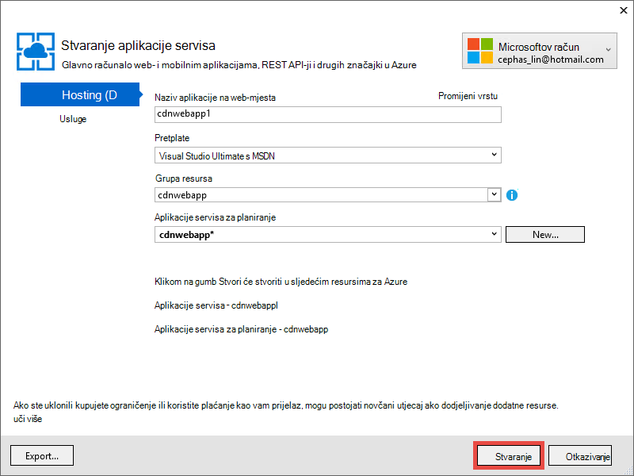

<properties 
    pageTitle="Korištenje Azure CDN u aplikacije servisa za Azure" 
    description="Praktični vodič ručica za implementaciju web-aplikacijama za aplikacije servisa za Azure koji služi sadržaj s krajnje integrirani Azure CDN" 
    services="app-service\web,cdn" 
    documentationCenter=".net" 
    authors="cephalin" 
    manager="wpickett" 
    editor="jimbe"/>

<tags 
    ms.service="app-service" 
    ms.workload="tbd" 
    ms.tgt_pltfrm="na" 
    ms.devlang="dotnet" 
    ms.topic="article" 
    ms.date="07/01/2016" 
    ms.author="cephalin"/>


# <a name="use-azure-cdn-in-azure-app-service"></a>Korištenje Azure CDN u aplikacije servisa za Azure

[Aplikacije servisa](http://go.microsoft.com/fwlink/?LinkId=529714) može se integrirati s [Azure CDN](/services/cdn/), dodate na globalni skaliranja mogućnosti ugrađeno u [Aplikaciju servisa web-aplikacijama](http://go.microsoft.com/fwlink/?LinkId=529714) posluživanje web-aplikacije sadržaja globalno iz čvorove poslužitelja pri klijentima (obnovljeni popis svih trenutnog mjesta čvor nalazi se [ovdje](http://msdn.microsoft.com/library/azure/gg680302.aspx)). U slučajevima kao što su posluživanje statične slike, ta Integracija možete znatno poboljšati performanse aplikacije s podrškom za Azure aplikacija servisa Web i znatno poboljšava web app korisnički doživljaj diljem svijeta. 

Integriranje web-aplikacije s Azure CDN pruža sljedeće prednosti:

- Integriranje implementacije sadržaja (slike, skripte i listovi stilova) tijekom procesa [Neprekinuti implementaciju](app-service-continuous-deployment.md) web app
- Jednostavno nadograditi NuGet paketa u web-aplikaciju programa u Azure aplikacije servisa, kao što su jQuery ili Samopokretanje verzije 
- Upravljanje web-aplikacije i sadržaju CDN poslužena iz istog sučelja Visual Studio
- Integriranje usnopljavanje ASP.NET i minification s Azure CDN

[AZURE.INCLUDE [app-service-web-to-api-and-mobile](../../includes/app-service-web-to-api-and-mobile.md)] 

## <a name="what-you-will-build"></a>Što će sastavljanje ##

Će implementacija web-aplikacijama Azure aplikacije servisa za korištenje zadani predložak ASP.NET MVC u Visual Studio, dodavanje koda za posluživanje sadržaja s Integriranom CDN Azure, kao što su slike, kontroler akcija rezultate i zadane JavaScript i CSS datoteka i i pisanje koda za konfiguriranje pričuvni mehanizam objedinjuje poslužena za slučaj da se CDN je izvan mreže.

## <a name="what-you-will-need"></a>Što ćete ##

Pomoću ovog praktičnog vodiča sadrži sljedeće preduvjete:

-   Aktivni [račun sustava Microsoft Azure](/account/)
-   Visual Studio 2015 s [Azure SDK za .NET](http://go.microsoft.com/fwlink/p/?linkid=323510&clcid=0x409). Ako koristite Visual Studio, koraci mogu se razlikovati.

> [AZURE.NOTE] Potreban vam je račun za Azure da biste dovršili ovaj Praktični vodič:
> + Možete je [besplatno otvorite račun za Azure](/pricing/free-trial/) - dobiti kredita možete koristiti da biste isprobali plaćenu servisa Azure, a čak i nakon što ste Iskorištena možete zadržati račun i korištenje slobodno Azure servisa, kao što su web-aplikacije.
> + Možete [aktivirati Visual Studio pretplatnika pogodnosti](/pricing/member-offers/msdn-benefits-details/) – vaše Visual Studio pretplata vam kredita svakog mjeseca, koje možete koristiti za plaćenu Azure servise.
>
> Ako želite započeti s aplikacije servisa za Azure prije registracije za račun za Azure, idite na [Pokušajte aplikacije servisa](http://go.microsoft.com/fwlink/?LinkId=523751), gdje možete odmah stvoriti web-aplikacijama short-lived starter u aplikacije servisa. Nema kreditne kartice potrebna; Nema preuzete obveze.

## <a name="deploy-a-web-app-to-azure-with-an-integrated-cdn-endpoint"></a>Implementacija web-aplikacijama Azure s Integriranom CDN krajnje točke ##

U ovom se odjeljku će implementacija zadani predložak aplikacije ASP.NET MVC u Visual Studio 2015 aplikacije servisa za, a zatim integrirati s krajnju točku CDN. Slijedite upute u nastavku:

1. U Visual Studio 2015, stvorite novu ASP.NET web-aplikaciju na traci izbornika tako da odaberete **Datoteka > novo > projekt > Web > ASP.NET web-aplikacije**. Dajte naziv, a zatim kliknite **u redu**.

    

3. Odaberite **MVC** , a zatim kliknite **u redu**.

    

4. Ako još niste prijavljeni u račun za Azure još, kliknite ikonu računa u gornjem desnom kutu, a zatim slijedite dijaloški okvir da biste se prijavili na račun za Azure. Kada završite, konfiguriranje aplikacije kao što je prikazano u nastavku, a zatim kliknite **Novo** da biste stvorili novi plan aplikacije servisa za aplikaciju.  

    

5. Konfiguriranje nove aplikacije servisa za planiranje u dijaloškom okviru kao što je prikazano u nastavku, a zatim kliknite **u redu**. 

    

8. Kliknite **Stvori** da biste stvorili web-aplikaciji.

    

9. Nakon stvaranja ASP.NET aplikacija objavljivanja Azure u oknu Azure aplikacije servisa aktivnosti tako da kliknete **Objavi `<app name>` sada ovo web-aplikaciju**. Kliknite **Objavi** da biste dovršili postupak.

    

    Vidjet ćete objavljenu web aplikacije u pregledniku nakon dovršetka objavljivanje. 

1. Da biste stvorili krajnju točku CDN, prijavite se na [portal za Azure](https://portal.azure.com). 
2. Kliknite **+ Novo** > **Media + CDN** > **CDN**.

    

3. Navedite **CDN**, **mjesto**, **grupa resursa**, **određivanje cijena sloju**, a zatim kliknite **Stvori**

       

4. U **Profilu CDN** plohu kliknite gumb **+ krajnjoj točki** . Dajte naziv, odaberite **Web-aplikacije** u web-mjesto na padajućem popisu **Vrsta izvora** i u okvir za vašeg web app na padajućem popisu **polazište naziv glavnog računala** , a zatim kliknite **Dodaj**.  

    


    > [AZURE.NOTE] Nakon stvaranja na krajnjoj točki CDN plohu **krajnjoj točki** vidjet ćete njezin URL CDN i domenu izvor koji je integriran s. Međutim, može potrajati neko vrijeme konfiguraciju novi CDN krajnju točku na potpuno proširiti sva mjesta čvor CDN. 

3. Vratite se u plohu **krajnjoj točki** kliknite naziv koji ste upravo stvorili CDN krajnje točke.

    

3. Kliknite gumb **Konfiguracija** . U plohu **Konfiguriraj** **niz predmemoriranje ponašanje u upitu** padajućem popisu odaberite **predmemoriju svaki jedinstveni URL** , a zatim kliknite gumb **Spremi** .


    

Kada to omogućili, isto veza pristupiti s različitim upita nizovima spremit će se kao zasebna stavke.

>[AZURE.NOTE] Prilikom omogućivanja nizu upita nije potreban za ovaj odjeljak vodiča, preporučujemo da to ranije moguće pogodnost nakon promjene Ovdje će potrajati zbog primjene na sve čvorove CDN, a ne želite da se sadržaj koji nisu upita-niz-omogućenim zagušuje gore predmemoriju CDN (ažuriranja CDN sadržaj će se spominju kasnije).

2. Sada, pomaknite se do adresu CDN krajnjoj točki. Ako je spreman krajnju točku, trebali biste vidjeti web-aplikaciju programa prikazuju. Ako nailazite na pogrešku **HTTP 404** , krajnju točku CDN nije spreman. Možda ćete morati pričekati prema gore za jedan sat za konfiguraciju CDN proširiti sve čvorove ruba. 

    

1. Nakon toga pokušajte pristupiti **~/Content/bootstrap.css** datoteku u ASP.NET projekta. U prozoru preglednika dođite do * *http://*&lt;cdnName >*.azureedge.net/Content/bootstrap.css**. U moje Postavi ovaj je URL:

        http://az673227.azureedge.net/Content/bootstrap.css

    Koji odgovara sljedeći URL polazište na krajnjoj točki CDN:

        http://cdnwebapp.azurewebsites.net/Content/bootstrap.css

    Kada dođete do * *http://*&lt;cdnName >*.azureedge.net/Content/bootstrap.css**, zatražit će se da biste preuzeli bootstrap.css koju ste dobili iz web-aplikacije u Azure. 

    

Na sličan način možete pristupiti bilo koji javno dostupnu URL pri * *http://*&lt;naziv servisa >*.cloudapp.net/** izravno iz vaše CDN krajnjoj točki. Ako, na primjer:

-   Datoteke .js put /Script
-   Bilo koji sadržaj datoteke iz sections put
-   Bilo kakva kontroler/akcija 
-   Ako je niz upita omogućena na krajnjoj točki CDN, bilo koji URL s nizovima upita
-   Cijeli Azure web-aplikaciji, ako je javna sav sadržaj

Imajte na umu da je možda neće biti uvijek dobro (ili obično dobro) da bi služio cijeli Azure web aplikacije kroz Azure CDN. Neke se upozorenja su:

-   Taj se način zahtijeva cijelog web-mjesta na javno, jer Azure CDN ne može vam poslužiti privatne sadržaj.
-   Ako krajnju točku CDN izvanmrežne dolazi iz bilo kojeg razloga, hoće li održavanje ili pogreška korisničkog cijelu web-aplikaciju programa dolazi izvanmrežne osim u slučaju da kupci biti preusmjereni URL polazište * *http://*&lt;NazivWebMjesta >*.azurewebsites.net/**. 
-   Čak i uz prilagođene predmemorijom postavke (pročitajte članak [Konfiguriranje predmemoriranja mogućnosti za statičke datoteke u Azure web-aplikaciju programa](#configure-caching-options-for-static-files-in-your-azure-web-app)), krajnjoj točki CDN poboljšati performanse visoko-dinamični sadržaj. Ako ste pokušali učitati na početnu stranicu iz na krajnjoj točki CDN kao što je prikazano gore, Uočite da se snimljene najmanje 5 sekundi da biste učitali zadanom početnom stranicom prvi put, koja je prilično jednostavan stranice. Zamislite što će se dogoditi sa sučelje klijenta ako ova stranica sadrži dinamičkog sadržaja koji morate ažurirati svake minute. Posluživanje dinamičkog sadržaja na krajnjoj točki CDN zahtijeva isteka kratki predmemorije koja se prevodi neuspjele akcije u predmemoriji Česti na krajnjoj točki CDN. Polarni performanse Azure web-aplikacije i defeats Svrha ustvari CDN.

Druga je da biste odredili koji sadržaj da bi služio iz Azure CDN na temelju slučaj velikim slovom u Azure web-aplikaciju programa. Na kraju, već ste vidjeti kako pristupati pojedinačne datoteke sadržaja iz krajnju točku CDN. Li će vam pokazati kako vam poslužiti određene kontroler akcija putem krajnju točku CDN u [posluživanje sadržaja iz kontroler akcije kroz Azure CDN](#serve-content-from-controller-actions-through-azure-cdn).

## <a name="configure-caching-options-for-static-files-in-your-azure-web-app"></a>Konfigurirajte predmemoriranja statičke datoteke u Azure web-aplikaciju programa ##

Pomoću Azure CDN integraciju u Azure web-aplikaciju programa, možete odrediti način na koji želite statički sadržaj predmemoriju u krajnju točku CDN. Da biste to učinili, otvorite *Web.config* iz ASP.NET projekta (npr. **cdnwebapp**) i dodajte je `<staticContent>` element `<system.webServer>`. XML ispod konfigurira predmemoriju istječe 3 dana.  

    <system.webServer>
      <staticContent>
        <clientCache cacheControlMode="UseMaxAge" cacheControlMaxAge="3.00:00:00"/>
      </staticContent>
      ...
    </system.webServer>

Kada to učinite, sve statičke datoteke u Azure web-aplikaciju programa Primijetit ćete na istom pravilo u predmemoriju CDN. Precizniji kontrolu nad postavke predmemorije dodavanje *Web.config* datoteke u mapu i dodavanje vaše postavke. Ako, na primjer, dodati *Web.config* datoteke u mapu *\Content* i zamijenite sadržaj s XML za sljedeće:

    <?xml version="1.0"?>
    <configuration>
      <system.webServer>
        <staticContent>
          <clientCache cacheControlMode="UseMaxAge" cacheControlMaxAge="15.00:00:00"/>
        </staticContent>
      </system.webServer>
    </configuration>

Ta postavka uzrokuje statičke datoteke iz mape *\Content* predmemoriju za petnaest dana.

Dodatne informacije o konfiguriranju na `<clientCache>` element, potražite u članku [klijent predmemorije &lt;clientCache >](http://www.iis.net/configreference/system.webserver/staticcontent/clientcache).

U sljedećem odjeljku li i vidjet ćete kako konfigurirati postavke predmemorije za kontroler akcija rezultate u predmemoriji CDN.

## <a name="serve-content-from-controller-actions-through-azure-cdn"></a>Posluživanje sadržaja iz kontroler akcije kroz Azure CDN ##

Kada web-aplikacije integrirati s Azure CDN, relativno jednostavno je posluživanje sadržaja iz kontroler akcije kroz Azure CDN. Ponovno, ako odlučite da bi služio cijelu Azure web-aplikaciji putem vaše CDN, ne morate to uopće Budući da se sve akcije kontroler dostupno putem na CDN se već nalaze. No razloga li već pokazali u [uvođenja Azure web aplikacije s krajnje integrirani CDN](#deploy-a-web-app-to-azure-with-an-integrated-cdn-endpoint)možda odlučite protiv to i odaberite umjesto toga odaberite željenu akciju kontroler da bi služio iz Azure CDN. [Maarten Balliauw](https://twitter.com/maartenballiauw) prikazuje kako to učiniti s posla MemeGenerator kontroler u [skraćivanje Latencija na webu s Azure CDN](http://channel9.msdn.com/events/TechDays/Techdays-2014-the-Netherlands/Reducing-latency-on-the-web-with-the-Windows-Azure-CDN). Koje će jednostavno ponoviti je ovdje.

Pretpostavimo da u web-aplikaciju programa želite generirati memes na osnovi malu slike Chuck Norris (fotografija po [Gordan svijetlo](http://www.flickr.com/photos/alan-light/218493788/)) ovako:


Imate jednostavan `Index` akcije koji omogućuju korisnicima da biste odredili na superlativa na slici, zatim generira na meme kada ih objavite na akciju. Budući da je Chuck Norris, što biste očekivali ove stranice da biste postaju wildly Popularni globalno. Ovo je dobar primjer posluživanje djelomično dinamičkog sadržaja s Azure CDN. 

Slijedite korake za postavljanje ovu akciju kontroler:

1. U mapi *\Controllers* stvoriti novu .cs datoteku pod nazivom *MemeGeneratorController.cs* i sadržaj zamijeniti sljedeći kod. Zamijenite put do datoteke za `~/Content/chuck.bmp` i naziva CDN za `yourCDNName`.


        using System;
        using System.Collections.Generic;
        using System.Diagnostics;
        using System.Drawing;
        using System.IO;
        using System.Net;
        using System.Web.Hosting;
        using System.Web.Mvc;
        using System.Web.UI;

        namespace cdnwebapp.Controllers
        {
          public class MemeGeneratorController : Controller
          {
            static readonly Dictionary<string, Tuple<string ,string>> Memes = new Dictionary<string, Tuple<string, string>>();

            public ActionResult Index()
            {
              return View();
            }

            [HttpPost, ActionName("Index")]
            public ActionResult Index_Post(string top, string bottom)
            {
              var identifier = Guid.NewGuid().ToString();
              if (!Memes.ContainsKey(identifier))
              {
                Memes.Add(identifier, new Tuple<string, string>(top, bottom));
              }

              return Content("<a href=\"" + Url.Action("Show", new {id = identifier}) + "\">here's your meme</a>");
            }

            [OutputCache(VaryByParam = "*", Duration = 1, Location = OutputCacheLocation.Downstream)]
            public ActionResult Show(string id)
            {
              Tuple<string, string> data = null;
              if (!Memes.TryGetValue(id, out data))
              {
                return new HttpStatusCodeResult(HttpStatusCode.NotFound);
              }

              if (Debugger.IsAttached) // Preserve the debug experience
              {
                return Redirect(string.Format("/MemeGenerator/Generate?top={0}&bottom={1}", data.Item1, data.Item2));
              }
              else // Get content from Azure CDN
              {
                return Redirect(string.Format("http://<yourCDNName>.azureedge.net/MemeGenerator/Generate?top={0}&bottom={1}", data.Item1, data.Item2));
              }
            }

            [OutputCache(VaryByParam = "*", Duration = 3600, Location = OutputCacheLocation.Downstream)]
            public ActionResult Generate(string top, string bottom)
            {
              string imageFilePath = HostingEnvironment.MapPath("~/Content/chuck.bmp");
              Bitmap bitmap = (Bitmap)Image.FromFile(imageFilePath);

              using (Graphics graphics = Graphics.FromImage(bitmap))
              {
                SizeF size = new SizeF();
                using (Font arialFont = FindBestFitFont(bitmap, graphics, top.ToUpperInvariant(), new Font("Arial Narrow", 100), out size))
                {
                    graphics.DrawString(top.ToUpperInvariant(), arialFont, Brushes.White, new PointF(((bitmap.Width - size.Width) / 2), 10f));
                }
                using (Font arialFont = FindBestFitFont(bitmap, graphics, bottom.ToUpperInvariant(), new Font("Arial Narrow", 100), out size))
                {
                    graphics.DrawString(bottom.ToUpperInvariant(), arialFont, Brushes.White, new PointF(((bitmap.Width - size.Width) / 2), bitmap.Height - 10f - arialFont.Height));
                }
              }
              MemoryStream ms = new MemoryStream();
              bitmap.Save(ms, System.Drawing.Imaging.ImageFormat.Png);
              return File(ms.ToArray(), "image/png");
            }

            private Font FindBestFitFont(Image i, Graphics g, String text, Font font, out SizeF size)
            {
              // Compute actual size, shrink if needed
              while (true)
              {
                size = g.MeasureString(text, font);

                // It fits, back out
                if (size.Height < i.Height &&
                     size.Width < i.Width) { return font; }

                // Try a smaller font (90% of old size)
                Font oldFont = font;
                font = new Font(font.Name, (float)(font.Size * .9), font.Style);
                oldFont.Dispose();
              }
            }
          }
        }

2. Desnom tipkom miša kliknite zadani `Index()` akcije i odaberite **Dodaj prikaz**.

    

3.  Prihvatite donje postavke, a zatim kliknite **Dodaj**.

    

4. Otvorite novi *Views\MemeGenerator\Index.cshtml* i sadržaj zamijenite sljedeće jednostavne HTML-a na superlativa predavanje:

        <h2>Meme Generator</h2>
        
        <form action="" method="post">
            <input type="text" name="top" placeholder="Enter top text here" />
            <br />
            <input type="text" name="bottom" placeholder="Enter bottom text here" />
            <br />
            <input class="btn" type="submit" value="Generate meme" />
        </form>

5. Ponovno objavite Azure web-aplikaciju, a zatim otvorite * *http://*&lt;naziv servisa >*.cloudapp.net/MemeGenerator/Index** u pregledniku. 

Kada pošaljete vrijednosti obrasca `/MemeGenerator/Index`, `Index_Post` akcije metoda vraća vezu na `Show` akcije metoda s odgovarajući identifikator za unos. Kada kliknete vezu, dođete do sljedeći kod:  

    [OutputCache(VaryByParam = "*", Duration = 1, Location = OutputCacheLocation.Downstream)]
    public ActionResult Show(string id)
    {
      Tuple<string, string> data = null;
      if (!Memes.TryGetValue(id, out data))
      {
        return new HttpStatusCodeResult(HttpStatusCode.NotFound);
      }

      if (Debugger.IsAttached) // Preserve the debug experience
      {
        return Redirect(string.Format("/MemeGenerator/Generate?top={0}&bottom={1}", data.Item1, data.Item2));
      }
      else // Get content from Azure CDN
      {
        return Redirect(string.Format("http://<yourCDNName>.azureedge.net/MemeGenerator/Generate?top={0}&bottom={1}", data.Item1, data.Item2));
      }
    }

Ako je vaše lokalne ispravljanje, će dobiti Obični prikaz pogrešaka doživljaj lokalne preusmjeravanje. Ako je pokrenut u Azure web-aplikaciju, on će preusmjeriti da biste:

    http://<yourCDNName>.azureedge.net/MemeGenerator/Generate?top=<formInput>&bottom=<formInput>

Koji odgovara sljedeći URL polazište na krajnjoj točki vaše CDN:

    http://<yourSiteName>.azurewebsites.net/cdn/MemeGenerator/Generate?top=<formInput>&bottom=<formInput>

Nakon URL dopune prethodno primijeniti pravilo, samu datoteku koja se dobiva predmemoriju na krajnjoj točki CDN je:

    http://<yourSiteName>.azurewebsites.net/MemeGenerator/Generate?top=<formInput>&bottom=<formInput>

Možete koristiti u `OutputCacheAttribute` atribut na na `Generate` način da biste odredili kako rezultat akcije treba predmemoriju, koji će poštovati Azure CDN. Kod u nastavku odredite predmemorije isteka od jednog sata (u sekundama 3,600).

    [OutputCache(VaryByParam = "*", Duration = 3600, Location = OutputCacheLocation.Downstream)]

Isto tako, koji vam može poslužiti se sadržaj iz ništa kontroler u Azure web-aplikaciju programa putem Azure CDN, s željenu mogućnost spremanja.

U sljedećem odjeljku, I vidjet ćete kako vam poslužiti paketu i minified skripte i CSS-a putem Azure CDN. 

## <a name="integrate-aspnet-bundling-and-minification-with-azure-cdn"></a>Integriranje usnopljavanje ASP.NET i minification s Azure CDN ##

Listovi stilova skripte i CSS-a promijenite diskovni te su značajke prime kandidata za Azure CDN predmemoriju. Posluživanje cijelu web-aplikaciju putem vaše CDN Azure je najlakše ćete usnopljavanje i minification integrirati Azure CDN. Međutim, kao što je možda odaberite protiv takvog razloga opisane u [Integrate krajnje Azure CDN s Azure web-aplikacije i posluženo statične sadržaja u web-stranica Azure CDN](#deploy-a-web-app-to-azure-with-an-integrated-cdn-endpoint), I vidjet ćete kako to učiniti uz čuvanje željeni develper sučelje platforme ASP.NET usnopljavanje i minification, kao što su:

-   Sučelje za način rada sjajno ispravljanje pogrešaka
-   Pojednostavnjeno implementacije
-   Odmah ažuriranja klijenata za skripte/CSS-a verziju nadogradnje
-   Pričuvni mehanizam kada na krajnjoj točki CDN ne uspije
-   Minimiziranje kod izmjene

U ASP.NET projekta koji ste stvorili u [Integrate krajnje Azure CDN s Azure web-aplikacije i posluženo statične sadržaja u web-stranica Azure CDN](#deploy-a-web-app-to-azure-with-an-integrated-cdn-endpoint)otvorite *App_Start\BundleConfig.cs* , a zatim pogledajte u `bundles.Add()` način pozive.

    public static void RegisterBundles(BundleCollection bundles)
    {
        bundles.Add(new ScriptBundle("~/bundles/jquery").Include(
                    "~/Scripts/jquery-{version}.js"));
        ...
    }

Prvi `bundles.Add()` izjava dodaje paket za skripte na virtualnog direktorija `~/bundles/jquery`. Zatim otvorite *Views\Shared\_Layout.cshtml* da biste vidjeli kako će se oznaka paket skripte prikazati. Trebali biste moći pronaći sljedeći redak koda platforma Razor:

    @Scripts.Render("~/bundles/jquery")

Kod platforma Razor izvršavanja u Azure web-aplikaciji će prikazati na `<script>` oznaka za paket skripte otprilike ovako: 

    <script src="/bundles/jquery?v=FVs3ACwOLIVInrAl5sdzR2jrCDmVOWFbZMY6g6Q0ulE1"></script>

Međutim, kad se izvršava u Visual Studio tako da upišete `F5`, on će prikazati svaki skriptna datoteka u na paket pojedinačno (u slučaju iznad, samo jedan skriptna datoteka se na paket):

    <script src="/Scripts/jquery-1.10.2.js"></script>

To vam omogućuje da ispravljanje pogrešaka JavaScript kod u okruženje za razvoj dok smanjivanje Istodobni klijentske veze (usnopljavanje) i poboljšanje datoteke Preuzmi performansi (minification) u radni. Sjajan značajka da biste sačuvali uz integraciju Azure CDN je. Osim toga, budući da prikazanih paket već sadrži niz za automatski generirani verziju, želite replicirati tu funkcionalnost tako da svaki put kada ažurirate verziji jQuery putem NuGet, se može ažurirati na strani klijenta čim.

Slijedite korake u nastavku usnopljavanje ASP.NET integracije i minification s vašeg CDN krajnjoj točki.

1. Vratite se u *App_Start\BundleConfig.cs*izmjena na `bundles.Add()` metode koje ćete koristiti u različitim [Graditelj paket](http://msdn.microsoft.com/library/jj646464.aspx), koji određuje CDN adresu. Da biste to učinili, zamijenite na `RegisterBundles` definiciju način s sljedeći kod:  
    
        public static void RegisterBundles(BundleCollection bundles)
        {
          bundles.UseCdn = true;
          var version = System.Reflection.Assembly.GetAssembly(typeof(Controllers.HomeController))
            .GetName().Version.ToString();
          var cdnUrl = "http://<yourCDNName>.azureedge.net/{0}?" + version;

          bundles.Add(new ScriptBundle("~/bundles/jquery", string.Format(cdnUrl, "bundles/jquery")).Include(
                "~/Scripts/jquery-{version}.js"));

          bundles.Add(new ScriptBundle("~/bundles/jqueryval", string.Format(cdnUrl, "bundles/jqueryval")).Include(
                "~/Scripts/jquery.validate*"));

          // Use the development version of Modernizr to develop with and learn from. Then, when you're
          // ready for production, use the build tool at http://modernizr.com to pick only the tests you need.
          bundles.Add(new ScriptBundle("~/bundles/modernizr", string.Format(cdnUrl, "bundles/modernizr")).Include(
                "~/Scripts/modernizr-*"));

          bundles.Add(new ScriptBundle("~/bundles/bootstrap", string.Format(cdnUrl, "bundles/bootstrap")).Include(
                "~/Scripts/bootstrap.js",
                "~/Scripts/respond.js"));

          bundles.Add(new StyleBundle("~/Content/css", string.Format(cdnUrl, "Content/css")).Include(
                "~/Content/bootstrap.css",
                "~/Content/site.css"));
        }


    Ne zaboravite da biste zamijenili `<yourCDNName>` s nazivom svoje CDN Azure.

    Običan riječima postavljate `bundles.UseCdn = true` i dodati pažljivo sastaviti CDN URL-a za svaki paket. Na primjer, prvi Graditelj kod:

        new ScriptBundle("~/bundles/jquery", string.Format(cdnUrl, "bundles/jquery"))

    Isto kao glasi: 

        new ScriptBundle("~/bundles/jquery", string.Format(cdnUrl, "http://<yourCDNName>.azureedge.net/bundles/jquery?<W.X.Y.Z>"))

    Ovaj Graditelj govore usnopljavanje ASP.NET i minification prikaz pojedinačnih skripte datotekama debugged lokalno, no navedena adresa CDN koristite za pristup skripte u pitanju. Međutim, imajte na umu dvije važne značajke ovaj pažljivo sastaviti CDN URL-om:
    
    - URL-a CDN potječe `http://<yourSiteName>.azurewebsites.net/bundles/jquery?<W.X.Y.Z>`, što je zapravo virtualnog direktorija paket skripte u web-aplikaciji.
    - Budući da koristite CDN Graditelj, Označi skripte CDN za na paket više ne sadrži niz automatski generirani verzije u prikazanih URL-u. Ručno morate Generiranje niza za jedinstveni verziju svaki put kada se izmjene paket skriptu da biste nametnuli je neuspješno pronalaženje u predmemoriji na vašem CDN Azure. U isto vrijeme jedinstveni verziju niz morate ostaju iste kroz vijek implementacije Maksimiziranje pronalaženje objekata u predmemoriji na vašem CDN Azure kada je implementiran u paket.

3. Niz upita `<W.X.Y.Z>` povlači iz *Properties\AssemblyInfo.cs* u ASP.NET projektu. Možete imati tijeka rada za implementaciju obuhvaća povećava skupa verziju svaki put kada objavljujete Azure. Ili *Properties\AssemblyInfo.cs* možete promijeniti samo u projektu da biste automatski povećali niz verzije prilikom svakog stvaranja, koristeći zamjenske znakove "*". Ako, na primjer, promijeniti `AssemblyVersion` kao što je prikazano u nastavku:
    
        [assembly: AssemblyVersion("1.0.0.*")]
    
    Ostale strategije kako biste pojednostavili generiranje jedinstveni niz život implementacije funkcionirat će u nastavku.

3. Ponovno objaviti ASP.NET aplikacija i pristup na početnu stranicu.
 
4. Prikaz HTML kod za stranicu. Trebali biste moći vidjeti URL CDN prikazivanju, s nizom jedinstveni verziju svaki put kada ponovno objaviti promjene na Azure web-aplikaciju. Ako, na primjer:  
    
        ...
        <link href="http://az673227.azureedge.net/Content/css?1.0.0.25449" rel="stylesheet"/>
        <script src="http://az673227.azureedge.net/bundles/modernizer?1.0.0.25449"></script>
        ...
        <script src="http://az673227.azureedge.net/bundles/jquery?1.0.0.25449"></script>
        <script src="http://az673227.azureedge.net/bundles/bootstrap?1.0.0.25449"></script>
        ...

5. U Visual Studio ispravljanje pogrešaka ASP.NET aplikacija u Visual Studio tako da upišete `F5`., 

6. Prikaz HTML kod za stranicu. Prikazat će se i dalje svaki skriptna datoteka pojedinačno prikazati tako da imate dosljedan ispravljanje pogrešaka iskustvo u Visual Studio.  
    
        ...
        <link href="/Content/bootstrap.css" rel="stylesheet"/>
        <link href="/Content/site.css" rel="stylesheet"/>
        <script src="/Scripts/modernizr-2.6.2.js"></script>
        ...
        <script src="/Scripts/jquery-1.10.2.js"></script>
        <script src="/Scripts/bootstrap.js"></script>
        <script src="/Scripts/respond.js"></script>
        ...    

## <a name="fallback-mechanism-for-cdn-urls"></a>Pričuvni mehanizam CDN URL-ova ##

Ako iz bilo kojeg razloga ne uspije na krajnjoj točki Azure CDN, želite web-stranici dovoljno pametno za pristup web-poslužitelju polazište kao pričuvni mogućnost za učitavanje JavaScript ili samopokretanja programa. Nije dovoljno ozbiljna izgubiti slike na web-aplikaciju u programa za potvrdu zbog nedostupnosti CDN, ali puno raznih gubitak funkcionalnosti presudne stranica nudi skripte i listovi stilova.

Klase [paket](http://msdn.microsoft.com/library/system.web.optimization.bundle.aspx) sadrži svojstvo naziva [CdnFallbackExpression](http://msdn.microsoft.com/library/system.web.optimization.bundle.cdnfallbackexpression.aspx) omogućuje vam da biste konfigurirali pričuvni mehanizam CDN pogreške. Da biste koristili to svojstvo, slijedite ove korake:

1. U projektu ASP.NET, otvorite *App_Start\BundleConfig.cs*, gdje ste dodali CDN URL-a u svakom [Graditelj paket](http://msdn.microsoft.com/library/jj646464.aspx), a dodajte `CdnFallbackExpression` kod u četiri mjesta kao što je prikazano da biste dodali pričuvni mehanizam objedinjuje zadani.  
    
        public static void RegisterBundles(BundleCollection bundles)
        {
          var version = System.Reflection.Assembly.GetAssembly(typeof(BundleConfig))
            .GetName().Version.ToString();
          var cdnUrl = "http://cdnurl.azureedge.net/.../{0}?" + version;
          bundles.UseCdn = true;

          bundles.Add(new ScriptBundle("~/bundles/jquery", string.Format(cdnUrl, "bundles/jquery")) 
                { CdnFallbackExpression = "window.jquery" }
                .Include("~/Scripts/jquery-{version}.js"));

          bundles.Add(new ScriptBundle("~/bundles/jqueryval", string.Format(cdnUrl, "bundles/jqueryval")) 
                { CdnFallbackExpression = "$.validator" }
                .Include("~/Scripts/jquery.validate*"));

          // Use the development version of Modernizr to develop with and learn from. Then, when you're
          // ready for production, use the build tool at http://modernizr.com to pick only the tests you need.
          bundles.Add(new ScriptBundle("~/bundles/modernizr", string.Format(cdnUrl, "bundles/modernizer")) 
                { CdnFallbackExpression = "window.Modernizr" }
                .Include("~/Scripts/modernizr-*"));

          bundles.Add(new ScriptBundle("~/bundles/bootstrap", string.Format(cdnUrl, "bundles/bootstrap"))     
                { CdnFallbackExpression = "$.fn.modal" }
                .Include(
                        "~/Scripts/bootstrap.js",
                        "~/Scripts/respond.js"));

          bundles.Add(new StyleBundle("~/Content/css", string.Format(cdnUrl, "Content/css")).Include(
                "~/Content/bootstrap.css",
                "~/Content/site.css"));
        }

    Kada `CdnFallbackExpression` je vrijednost nije null, skripte je umetnutog u HTML da biste testirali hoće li se na paket uspješno učitan i ako nije, u paket izravno pristupiti u web-poslužitelj polazište. Ovo svojstvo mora biti postavljena na JavaScript izraz koji provjerava je li odgovarajuća paket CDN pravilno učitati. Izraz koji je potrebno da biste testirali svaki paket razlikuje se prema sadržaju. Za na objedinjuje zadani iznad:
    
    - `window.jquery`je li u jquery-{verziju} .js definiran
    - `$.validator`je li u jquery.validate.js definiran
    - `window.Modernizr`je li u modernizer-{verzija} .js definiran
    - `$.fn.modal`je li u bootstrap.js definiran
    
    Možda ste primijetili da se nije postavljen CdnFallbackExpression za na `~/Cointent/css` paket. Razlog je tome što trenutno nema drugog [pogrešku u System.Web.Optimization](https://aspnetoptimization.codeplex.com/workitem/104) koji su umetati ga u `<script>` oznaka za pričuvni CSS umjesto na očekivani `<link>` oznaka.
    
    Postoji, međutim, dobro [Stil paket pričuvne](https://github.com/EmberConsultingGroup/StyleBundleFallback) nudi [Ember Savjetodavne grupe](https://github.com/EmberConsultingGroup). 

2. Da biste koristili rješenje CSS-a, stvorite novu datoteku .cs u mapu *App_Start* ASP.NET projekta s nazivom *StyleBundleExtensions.cs*i njezin sadržaj zamijenite [koda iz GitHub](https://github.com/EmberConsultingGroup/StyleBundleFallback/blob/master/Website/App_Start/StyleBundleExtensions.cs). 

4. U *App_Start\StyleFundleExtensions.cs*preimenujte naziva u ASP.NET aplikacija prostor za naziv (npr. **cdnwebapp**). 

3. Vratili u `App_Start\BundleConfig.cs` i zamijeni posljednji `bundles.Add` izvoda s sljedeći kod:  

        bundles.Add(new StyleBundle("~/Content/css", string.Format(cdnUrl, "Content/css"))
          .IncludeFallback("~/Content/css", "sr-only", "width", "1px")
          .Include(
            "~/Content/bootstrap.css",
            "~/Content/site.css"));

    Ovaj nov način kućni broj koristi isti ideja za ubaciti skripte u HTML-u da biste provjerili DOM za na odgovarajući naziv klase, naziv pravila i definirana u paket CSS-a i pada povratak na web-poslužitelj polazište ako ga ne uspije pronaći podudaranje vrijednost pravila.

4. Ponovno objavite na Azure web-aplikaciju i pristup na početnu stranicu. 
5. Prikaz HTML kod za stranicu. Trebali biste pronašli umetnutog skripte sličnu ovoj:    
    
    ```
    ...
    <link href="http://az673227.azureedge.net/Content/css?1.0.0.25474" rel="stylesheet"/>
<script>(function() {
                var loadFallback,
                    len = document.styleSheets.length;
                for (var i = 0; i < len; i++) {
                    var sheet = document.styleSheets[i];
                    if (sheet.href.indexOf('http://az673227.azureedge.net/Content/css?1.0.0.25474') !== -1) {
                        var meta = document.createElement('meta');
                        meta.className = 'sr-only';
                        document.head.appendChild(meta);
                        var value = window.getComputedStyle(meta).getPropertyValue('width');
                        document.head.removeChild(meta);
                        if (value !== '1px') {
                            document.write('<link href="/Content/css" rel="stylesheet" type="text/css" />');
                        }
                    }
                }
                return true;
            }())||document.write('<script src="/Content/css"><\/script>');</script>

    <script src="http://az673227.azureedge.net/bundles/modernizer?1.0.0.25474"></script>
    <script>(window.Modernizr)||document.write('<script src="/bundles/modernizr"><\/script>');</script>
    ... 
    <script src="http://az673227.azureedge.net/bundles/jquery?1.0.0.25474"></script>
    <script>(window.jquery)||document.write('<script src="/bundles/jquery"><\/script>');</script>

    <script src="http://az673227.azureedge.net/bundles/bootstrap?1.0.0.25474"></script>
    <script>($.fn.modal)||document.write('<script src="/bundles/bootstrap"><\/script>');</script>
    ...
    ```

    Imajte na umu da umetnutog skripte za paket CSS-a i dalje sadrži errant njezin blijedi iz na `CdnFallbackExpression` svojstvo u retku:

        }())||document.write('<script src="/Content/css"><\/script>');</script>

    No Budući prvi dio na || izraz uvijek vratiti true (u retku iznad koji), funkcija document.write() nikad će se pokrenuti.

6. Da biste provjerili hoće li radi pričuvni skripte, vratite se u na krajnjoj točki CDN plohu i kliknite **Zaustavi**.

    

7. Osvježite prozor preglednika za Azure web-aplikaciji. Sada trebali biste vidjeti da sve skripte i listovi stilova pravilno učitati.

## <a name="more-information"></a>Dodatne informacije 
- [Pregled mreže za Azure isporuku sadržaja (CDN)](../cdn/cdn-overview.md)
- [Korištenje Azure CDN](../cdn/cdn-create-new-endpoint.md)
- [Integriranje servis u oblaku s Azure CDN](../cdn/cdn-cloud-service-with-cdn.md)
- [ASP.NET usnopljavanje i Minification](http://www.asp.net/mvc/tutorials/mvc-4/bundling-and-minification)

