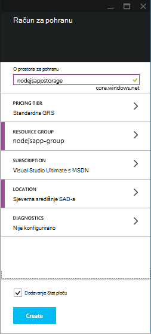
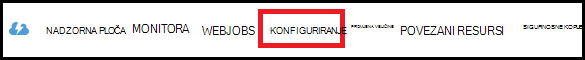
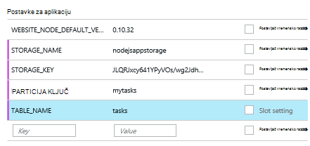

<properties
    pageTitle="Node.js web-aplikacije pomoću servisa Azure tablice"
    description="Pomoću ovog praktičnog vodiča prilike koji prikazuje kako pomoću servisa Azure tablice da biste pohranili podatke iz aplikacije Node.js koji se nalazi u Azure aplikacije servisa web-aplikacijama."
    tags="azure-portal"
    services="app-service\web, storage"
    documentationCenter="nodejs"
    authors="rmcmurray"
    manager="wpickett"
    editor=""/>

<tags
    ms.service="storage"
    ms.workload="storage"
    ms.tgt_pltfrm="na"
    ms.devlang="nodejs"
    ms.topic="article"
    ms.date="08/11/2016"
    ms.author="robmcm"/>

# Node.js web-aplikacije pomoću servisa Azure tablice

## Pregled

Pomoću ovog praktičnog vodiča pokazuje kako koristiti tablice servisa za upravljanje podacima Azure za pohranu i dohvaćanje podataka iz aplikacije [čvor] hostirane u [Aplikacije servisa za Azure](http://go.microsoft.com/fwlink/?LinkId=529714) web-aplikacijama. Pomoću ovog praktičnog vodiča podrazumijeva iskustva prethodnog pomoću čvor i [brojka].

Saznat ćete:

* Kako koristiti npm (čvor paket Upravitelj) da biste instalirali module čvor

* Upute za rad sa servisom Azure tablice

* Kako koristiti EŽA Azure da biste stvorili web-aplikacijama.

Slijedeći ovog praktičnog vodiča će stvoriti jednostavan koji se temelji na web aplikacije "popis obaveza" koji omogućuje stvaranje, preuzimanja i dovršavanje zadataka. Zadaci se pohranjuju u servis tablice.

Evo dovršene aplikacije:

![Prikaz prazan tasklist web-stranicu][node-table-finished]

>[AZURE.NOTE] Ako želite započeti s aplikacije servisa za Azure prije registracije za račun za Azure, idite na [Pokušajte aplikacije servisa](http://go.microsoft.com/fwlink/?LinkId=523751), gdje možete odmah stvoriti web-aplikacijama short-lived starter u aplikacije servisa. Nema kreditne kartice potrebna; Nema preuzete obveze.

## Preduvjeti

Prije nego što slijedeći upute u ovom članku, provjerite imate li instalirano sljedeće:

* verzija [čvor] 0.10.24 ili noviji

* [Brojka]

[AZURE.INCLUDE [create-account-and-websites-note](../../includes/create-account-and-websites-note.md)]

## Stvaranje računa za pohranu

Stvorite račun za Azure prostora za pohranu. Aplikacija će koristiti taj račun radi pohrane stavki obaveza.

1.  Prijava na [Portal za Azure](https://portal.azure.com/).

2. Klikom na u donjem lijevom kutu portalu ikonu **Novo** , a zatim kliknite **podataka + prostor za pohranu** > **prostora za pohranu**. Prostor za pohranu računu dajte jedinstveni naziv, a zatim stvorite novu [grupu resursa](../azure-resource-manager/resource-group-overview.md) za njega.

    

    Prilikom stvaranja računa za pohranu gumb **obavijesti** će flash zeleni **USPJEH** i račun za pohranu plohu otvoren da bi se prikazala pripada li u novu grupu resursa koji ste stvorili.

5. U plohu račun za pohranu, kliknite **Postavke** > **tipke**. Kopiranje pristupni primarni ključ u međuspremnik.

    ![Tipkovni prečac][portal-storage-access-keys]

##Instaliranje modula i generiranje scaffolding

U ovom odjeljku će stvoriti novu aplikaciju čvor i koristite npm da biste dodali modul paketa. Za ovu aplikaciju će koristiti [Express] i [Azure] module. Modul Express nudi Model prikaz kontroler framework za čvor, dok Azure module omogućuje povezivanje sa servisom tablice.

### Instalacija express i generiranje scaffolding

1. U naredbeni redak, stvorite novi direktorij pod nazivom **tasklist** i promjenu tom direktoriju.  

2. Unesite sljedeću naredbu da biste instalirali Express module.

        npm install express-generator@4.2.0 -g

    Ovisno o operacijskom sustavu, morate staviti sudo prije naredbu:

        sudo npm install express-generator@4.2.0 -g

    Rezultat izgleda slično kao u sljedećem primjeru:

        express-generator@4.2.0 /usr/local/lib/node_modules/express-generator
        ├── mkdirp@0.3.5
        └── commander@1.3.2 (keypress@0.1.0)

    > [AZURE.NOTE] Na '-g' parametara instalira modul globalno. Na taj način možete koristimo **eksplicitnih** da biste generirali web app scaffolding bez potrebe za upišite put dodatne podatke o.

4. Da biste stvorili scaffolding za aplikaciju, upišite **eksplicitnih** naredbu:

        express

    Izlaz iz ta naredba izgleda slično kao u sljedećem primjeru:

           create : .
           create : ./package.json
           create : ./app.js
           create : ./public
           create : ./public/images
           create : ./routes
           create : ./routes/index.js
           create : ./routes/users.js
           create : ./public/stylesheets
           create : ./public/stylesheets/style.css
           create : ./views
           create : ./views/index.jade
           create : ./views/layout.jade
           create : ./views/error.jade
           create : ./public/javascripts
           create : ./bin
           create : ./bin/www

           install dependencies:
             $ cd . && npm install

           run the app:
             $ DEBUG=my-application ./bin/www

    Sada imate nekoliko nove mape i datoteke u direktoriju **tasklist** .

### Instalacija dodatnih modula

Neke datoteke te **express** stvara se **package.json**. Datoteka sadrži popis ovisnosti modul. Kasnije, kada implementacija aplikacije na web-aplikacije servisa za aplikaciju, tu datoteku određuje koje moduli moraju biti instalirani na Azure.

Iz naredbenog retka, unesite sljedeću naredbu da biste instalirali module opisane u datoteci **package.json** . Možda ćete morati koristiti 'sudo'.

    npm install

Izlaz iz ta naredba izgleda slično kao u sljedećem primjeru:

    debug@0.7.4 node_modules\debug

    cookie-parser@1.0.1 node_modules\cookie-parser
    ├── cookie-signature@1.0.3
    └── cookie@0.1.0

    [...]

Nakon toga unesite sljedeću naredbu za instaliranje modula [azure], [čvor uuid], [nconf] i [asinkrone] :

    npm install azure-storage node-uuid async nconf --save

Na **– Spremanje** zastavice dodaje stavke za te module **package.json** datoteku.

Izlaz iz ta naredba izgleda slično kao u sljedećem primjeru:

    async@0.9.0 node_modules\async

    node-uuid@1.4.1 node_modules\node-uuid

    nconf@0.6.9 node_modules\nconf
    ├── ini@1.2.1
    ├── async@0.2.9
    └── optimist@0.6.0 (wordwrap@0.0.2, minimist@0.0.10)

    [...]

## Stvaranje aplikacije

Sada ćemo spremni ste za stvaranje aplikacija.

### Stvaranje modela

*Model* je objekt koji predstavlja podatke u aplikaciji. Za aplikaciju, samo modela je objekt zadatka koji predstavlja stavke na popisu zadataka. Zadaci će imati sljedeća polja:

- PartitionKey
- RowKey
- Naziv (niz)
- kategorija (niz)
- Dovršeno (Booleove vrijednosti)

**PartitionKey** i **RowKey** putem usluge tablice se koriste kao tipke tablice. Dodatne informacije potražite u članku [Osnove podatkovnog modela servisa za tablice](https://msdn.microsoft.com/library/azure/dd179338.aspx).

1. U imeniku **tasklist** stvorite novi direktorij pod nazivom **modela**.

2. U imeniku **modela** stvoriti novu datoteku pod nazivom **task.js**. Datoteka će sadržavati model za zadatke koji je stvorila vaša aplikacija.

3. Na početku **task.js** datoteku, dodajte sljedeći kod referentni potrebne biblioteke:

        var azure = require('azure-storage');
        var uuid = require('node-uuid');
        var entityGen = azure.TableUtilities.entityGenerator;

4. Dodajte sljedeći kod da biste definirali i izvoz objekt zadatka. Taj objekt je zadužen za povezivanje s tablicom.

        module.exports = Task;

        function Task(storageClient, tableName, partitionKey) {
          this.storageClient = storageClient;
          this.tableName = tableName;
          this.partitionKey = partitionKey;
          this.storageClient.createTableIfNotExists(tableName, function tableCreated(error) {
            if(error) {
              throw error;
            }
          });
        };

5. Dodajte sljedeći kod da biste definirali dodatne načine na objekt zadatka koje omogućuju interakcija s podacima koji se pohranjuju u tablicu:

        Task.prototype = {
          find: function(query, callback) {
            self = this;
            self.storageClient.queryEntities(this.tableName, query, null, function entitiesQueried(error, result) {
              if(error) {
                callback(error);
              } else {
                callback(null, result.entries);
              }
            });
          },

          addItem: function(item, callback) {
            self = this;
            // use entityGenerator to set types
            // NOTE: RowKey must be a string type, even though
            // it contains a GUID in this example.
            var itemDescriptor = {
              PartitionKey: entityGen.String(self.partitionKey),
              RowKey: entityGen.String(uuid()),
              name: entityGen.String(item.name),
              category: entityGen.String(item.category),
              completed: entityGen.Boolean(false)
            };
            self.storageClient.insertEntity(self.tableName, itemDescriptor, function entityInserted(error) {
              if(error){  
                callback(error);
              }
              callback(null);
            });
          },

          updateItem: function(rKey, callback) {
            self = this;
            self.storageClient.retrieveEntity(self.tableName, self.partitionKey, rKey, function entityQueried(error, entity) {
              if(error) {
                callback(error);
              }
              entity.completed._ = true;
              self.storageClient.updateEntity(self.tableName, entity, function entityUpdated(error) {
                if(error) {
                  callback(error);
                }
                callback(null);
              });
            });
          }
        }

6. Spremite i zatvorite datoteku **task.js** .

### Stvaranje kontroler

*Kontroler* rukuje HTTP zahtjevima i prikazuje HTML odgovor.

1. U imeniku **tasklist/usmjerava** stvorite novu datoteku pod nazivom **tasklist.js** i otvorite je u uređivaču teksta.

2. Dodajte sljedeći kod **tasklist.js**. Time se učitava modula azure i asinkrone, koji se koriste u **tasklist.js**. To definira i **TaskList** funkciju, koja se prenosi instancu objekta **zadatka** definirali ranije:

        var azure = require('azure-storage');
        var async = require('async');

        module.exports = TaskList;

3. Definiranje **TaskList** objekta.

        function TaskList(task) {
          this.task = task;
        }

4. **TaskList**dodati od sljedećih načina:

        TaskList.prototype = {
          showTasks: function(req, res) {
            self = this;
            var query = new azure.TableQuery()
              .where('completed eq ?', false);
            self.task.find(query, function itemsFound(error, items) {
              res.render('index',{title: 'My ToDo List ', tasks: items});
            });
          },

          addTask: function(req,res) {
            var self = this;
            var item = req.body.item;
            self.task.addItem(item, function itemAdded(error) {
              if(error) {
                throw error;
              }
              res.redirect('/');
            });
          },

          completeTask: function(req,res) {
            var self = this;
            var completedTasks = Object.keys(req.body);
            async.forEach(completedTasks, function taskIterator(completedTask, callback) {
              self.task.updateItem(completedTask, function itemsUpdated(error) {
                if(error){
                  callback(error);
                } else {
                  callback(null);
                }
              });
            }, function goHome(error){
              if(error) {
                throw error;
              } else {
               res.redirect('/');
              }
            });
          }
        }

### Izmjena app.js

1. Iz imenika **tasklist** otvorite datoteku **app.js** . U ovom je stvorena ranije tako da pokrenete naredbu **express** .

2. Na početku datoteku, dodajte sljedeće da biste učitali modul azure, postavite naziv tablice, ključ particija i postavljanje vjerodajnica za pohranu koji se koristi u ovom se primjeru:

        var azure = require('azure-storage');
        var nconf = require('nconf');
        nconf.env()
             .file({ file: 'config.json', search: true });
        var tableName = nconf.get("TABLE_NAME");
        var partitionKey = nconf.get("PARTITION_KEY");
        var accountName = nconf.get("STORAGE_NAME");
        var accountKey = nconf.get("STORAGE_KEY");

    > [AZURE.NOTE] nconf učitava konfiguracijskih vrijednosti s varijable okruženja ili iz datoteke **config.json** koje ćemo će stvoriti kasnije.

3. U datoteci app.js, pomaknite se do kojem ćete vidjeti sljedeći redak:

        app.use('/', routes);
        app.use('/users', users);

    Zamijenite iznad redaka kod prikazano u nastavku. To će pokrenuti instance komponente <strong>zadatka</strong> s vezom na račun servisa za pohranu. Time se prenosi u <strong>TaskList</strong>, koji će ga koristiti za komunikaciju sa servisom za tablicu:

        var TaskList = require('./routes/tasklist');
        var Task = require('./models/task');
        var task = new Task(azure.createTableService(accountName, accountKey), tableName, partitionKey);
        var taskList = new TaskList(task);

        app.get('/', taskList.showTasks.bind(taskList));
        app.post('/addtask', taskList.addTask.bind(taskList));
        app.post('/completetask', taskList.completeTask.bind(taskList));

4. Spremite datoteku **app.js** .

### Izmjena prikaza indeksa

1. Otvorite **tasklist/views/index.jade** datoteku u uređivaču teksta.

2. Sljedeći kod zamijenite cijeli sadržaj datoteke. Ovim se definira prikaza koji prikazuje postojeće zadatke i uključuje obrazac za dodavanje nove zadatke i označavanje postojeće kao dovršen.

        extends layout

        block content
          h1= title
          br

          form(action="/completetask", method="post")
            table.table.table-striped.table-bordered
              tr
                td Name
                td Category
                td Date
                td Complete
              if (typeof tasks === "undefined")
                tr
                  td
              else
                each task in tasks
                  tr
                    td #{task.name._}
                    td #{task.category._}
                    - var day   = task.Timestamp._.getDate();
                    - var month = task.Timestamp._.getMonth() + 1;
                    - var year  = task.Timestamp._.getFullYear();
                    td #{month + "/" + day + "/" + year}
                    td
                      input(type="checkbox", name="#{task.RowKey._}", value="#{!task.completed._}", checked=task.completed._)
            button.btn(type="submit") Update tasks
          hr
          form.well(action="/addtask", method="post")
            label Item Name:
            input(name="item[name]", type="textbox")
            label Item Category:
            input(name="item[category]", type="textbox")
            br
            button.btn(type="submit") Add item

3. Spremite i zatvorite datoteku **index.jade** .

### Izmjena globalni rasporeda

Datoteka **layout.jade** u direktoriju **prikaza** je globalni predložak za ostale datoteke **.jade** . U ovom ćete koraku će ga da biste koristili [Na Twitteru samopokretanja programa](https://github.com/twbs/bootstrap)koji je alata koji olakšava dizajniranje bolje izgleda web-aplikacijama mijenjati.

Preuzmite i izdvojiti datoteke za [Twitteru samopokretanja programa](http://getbootstrap.com/). Kopirajte datoteku **bootstrap.min.css** iz mape Samopokretanje **CSS-a** u direktoriju **javno/listovi stilova** aplikacije.

Iz mape **prikaza** otvorite **layout.jade** i zamijenite cjelokupnog sadržaja sljedeće:

    doctype html
    html
      head
        title= title
        link(rel='stylesheet', href='/stylesheets/bootstrap.min.css')
        link(rel='stylesheet', href='/stylesheets/style.css')
      body.app
        nav.navbar.navbar-default
          div.navbar-header
          a.navbar-brand(href='/') My Tasks
        block content

### Stvaranje konfiguracijska datoteka

Da biste pokrenuli aplikaciju lokalno, ne možemo ćete staviti Azure prostora za pohranu vjerodajnica u konfiguracijskoj datoteci. Stvorite datoteku pod nazivom * *config.json* *sa sljedećim JSON:

    {
        "STORAGE_NAME": "<storage account name>",
        "STORAGE_KEY": "<storage access key>",
        "PARTITION_KEY": "mytasks",
        "TABLE_NAME": "tasks"
    }

**Naziv računa spremišta** zamijenite naziv računa za pohranu koju ste ranije stvorili i **Tipkovni prečac za pohranu** zamijenite primarni pristupni ključ za račun za pohranu. Ako, na primjer:

    {
        "STORAGE_NAME": "nodejsappstorage",
        "STORAGE_KEY": "KG0oDd..."
        "PARTITION_KEY": "mytasks",
        "TABLE_NAME": "tasks"
    }

Spremi ovu datoteku *jedan direktorija višu razinu* od imenik **tasklist** , ovako:

    parent/
      |-- config.json
      |-- tasklist/

Razlog za to je da biste izbjegli Provjera konfiguracijska datoteka u kontrolu izvora, gdje ga može postati javno. Ako ne možemo aplikaciju u Azure, koristit ćemo varijable okruženja umjesto konfiguracijskoj datoteci.

## Pokrenite aplikaciju lokalno

Da biste testirali aplikacije na lokalnom računalu, učinite sljedeće:

1. Iz naredbenog retka, promijenite direktorija u direktoriju **tasklist** .

2. Da biste pokrenuli aplikaciju lokalno, koristite sljedeću naredbu:

        npm start

3. Otvorite web-preglednik i idite na http://127.0.0.1:3000.

    Pojavit će se na web-stranicu slično kao u sljedećem primjeru.

    ![Prikaz prazan tasklist web-stranice][node-table-finished]

4. Da biste stvorili novu stavku obvezama, unesite naziv i kategorija, a zatim kliknite **Dodaj stavku**. 

6. Da biste označili zadatak kao dovršen, potvrdite **dovrši** , a zatim kliknite **Ažuriraj zadatke**.

    ![Slika novu stavku na popisu zadataka][node-table-list-items]

Čak i ako se aplikacija se izvodi lokalno, on je spremanje podataka u servisu Azure tablice.

## Implementacija aplikacije da biste Azure

Koraci u ovom odjeljku da biste stvorili novu web-aplikaciju u aplikacije servisa za korištenje alata za Azure naredbenog retka, a zatim korištenje brojka za implementaciju aplikacije. Da biste izveli taj postupak morate imati pretplatu na Azure.

> [AZURE.NOTE] Sljedeće se mogu izvršavati i pomoću [Portala za Azure](https://portal.azure.com/). Potražite u članku [Stvaranje i implementaciju web-aplikacijama Node.js u servisu Azure aplikacije].
>
> Ako je ovo prvi web-aplikacije koje ste stvorili, morate koristiti Portal za Azure za implementaciju ove aplikacije.

Da bismo započeli, instalirajte [Azure EŽA] tako da upišete sljedeću naredbu iz naredbenog retka:

    npm install azure-cli -g

### Uvoz postavki za objavljivanje

U ovom ćete koraku će preuzimanje datoteke koja sadrži podatke o pretplati.

1. Unesite sljedeću naredbu:

        azure account download

    Ta naredba pokreće preglednik i vodi na stranici za preuzimanje. Ako se to od vas zatraži, prijavite se pomoću računa koji je povezan s pretplatom Azure.

    <!-- ![The download page][download-publishing-settings] -->

    Preuzimanje datoteke počinje automatski; Ako ne, možete kliknuti vezu na početku stranice da biste ručno preuzeli datoteku. Spremite datoteku i zabilježite put datoteke.

2. Unesite sljedeću naredbu da biste uvezli postavke:

        azure account import <path-to-file>

    Navedite put i naziv datoteke objavljivanje postavke ste preuzeli u prethodnom koraku.

3. Nakon uvoza postavke, izbrišite datoteku s postavkama Objavi. Više nije potrebna, a sadrži povjerljive podatke o pretplate Azure.

### Stvaranje web-aplikacije programa aplikacije servisa

1. Iz naredbenog retka, promijenite direktorija u direktoriju **tasklist** .

2. Koristite sljedeću naredbu da biste stvorili novu web-aplikaciju.

        azure site create --git

    Zatražit će se web-aplikacije naziv i mjesto. Navedite jedinstveni naziv, a zatim odaberite isti geografski kao račun za Azure prostora za pohranu.

    Na `--git` parametar stvara se spremište brojka Azure za ovo web-aplikacije. Također inicijalizira brojka spremište u trenutnom direktoriju ako ništa postoji i dodaje [brojka udaljene] pod nazivom "azure", koji se koristi za objavljivanje aplikacija za Azure. Na kraju, stvara **web.config** datoteku koja sadrži postavke koje Azure koristi za aplikacije čvor glavnog računala. Ako izostavite na `--git` parametar, ali imenika sadrži spremište brojka, naredba će i dalje stvaranje 'azure' udaljene.

    Kada je ta naredba dovrši, vidjet ćete izlaz otprilike ovako. Imajte na umu da na početak retka **stvaranja** web-mjesta sadrži URL-a za web-aplikacije.

        info:   Executing command site create
        help:   Need a site name
        Name: TableTasklist
        info:   Using location southcentraluswebspace
        info:   Executing `git init`
        info:   Creating default .gitignore file
        info:   Creating a new web site
        info:   Created web site at  tabletasklist.azurewebsites.net
        info:   Initializing repository
        info:   Repository initialized
        info:   Executing `git remote add azure https://username@tabletasklist.azurewebsites.net/TableTasklist.git`
        info:   site create command OK

    > [AZURE.NOTE] Ako je ovo prvi aplikacije servisa za web-aplikaciju za pretplatu, dobit ćete upute za korištenje portala za Azure za stvaranje web-aplikaciji. Dodatne informacije potražite u članku [Stvaranje i implementaciju web-aplikacijama Node.js u servisu Azure aplikacije].

### Postavljanje varijable okruženja

U ovom ćete koraku će dodati varijable okruženja web-aplikacije konfiguracija na Azure.
U naredbeni redak unesite sljedeće:

    azure site appsetting add
        STORAGE_NAME=<storage account name>;STORAGE_KEY=<storage access key>;PARTITION_KEY=mytasks;TABLE_NAME=tasks

Zamjena **<storage account name>** pod nazivom prostora za pohranu računa koji ste ranije stvorili i zamijeniti **<storage access key>** s primarni pristupni ključ za račun za pohranu. (Koristi iste vrijednosti kao config.json datoteku koju ste stvorili ranije.)

Osim toga, možete postaviti varijable okruženja [Azure Portal](https://portal.azure.com/):

1.  Otvorite web-aplikaciji plohu tako da kliknete **Pregled** > **Web-aplikacije** > naziva web app.

1.  U plohu web app, kliknite **Sve postavke** > **Postavke aplikacije**.

    <!--  -->

1.  Pomaknite se prema dolje do odjeljka **postavki aplikacije** i dodajte parove ključa vrijednosti.

    

1. Kliknite **SPREMI**.

### Objavljivanje aplikacija

Da biste objavili aplikaciju, primjenu datoteka kod brojka, a zatim automatske azure/matrice.

1. Postavljanje vjerodajnica za implementaciju.

        azure site deployment user set <name> <password>

2. Dodajte i primjenu datoteka aplikacije.

        git add .
        git commit -m "adding files"

3. Automatske izvršavanje web App aplikacije servisa:

        git push azure master

    Pomoću **matrice** kao cilj grani. Na kraju implementacijskih vidite naredbu slično kao u sljedećem primjeru:

        To https://username@tabletasklist.azurewebsites.net/TableTasklist.git
         * [new branch]      master -> master

4. Nakon dovršetka operacije automatske, Dođite na URL web app vratio prethodno u `azure create site` naredba za prikaz vaše aplikacije.

## Daljnji koraci

Dok se koraci u ovom se članku opisuju putem servisa za tablicu da biste pohranili podatke, možete koristiti i [MongoDB](https://mlab.com/azure/). 

## Dodatni resursi

[Azure EŽA]

## Što se promijenilo
* Vodič za promjenu iz aplikacije servisa za web-mjestima potražite u članku: [aplikacije servisa za Azure i Its utjecaj na postojećim Azure servisima](http://go.microsoft.com/fwlink/?LinkId=529714)

<!-- URLs -->

[Stvaranje i implementaciju web-aplikacijama Node.js u aplikacije servisa za Azure]: web-sites-nodejs-develop-deploy-mac.md
[Azure Developer Center]: /develop/nodejs/

[Čvor]: http://nodejs.org
[Brojka]: http://git-scm.com
[Express]: http://expressjs.com
[for free]: http://windowsazure.com
[Brojka remote]: http://git-scm.com/docs/git-remote

[Azure EŽA]: ../xplat-cli-install.md

[Azure]: https://github.com/Azure/azure-sdk-for-node
[Čvor uuid]: https://www.npmjs.com/package/node-uuid
[nconf]: https://www.npmjs.com/package/nconf
[asinkrone]: https://www.npmjs.com/package/async

[Azure Portal]: https://portal.azure.com

[Create and deploy a Node.js application to an Azure Web Site]: web-sites-nodejs-develop-deploy-mac.md
 
<!-- Image References -->

[node-table-finished]: ./media/storage-nodejs-use-table-storage-web-site/table_todo_empty.png
[node-table-list-items]: ./media/storage-nodejs-use-table-storage-web-site/table_todo_list.png
[download-publishing-settings]: ./media/storage-nodejs-use-table-storage-web-site/azure-account-download-cli.png
[portal-new]: ./media/storage-nodejs-use-table-storage-web-site/plus-new.png
[portal-storage-account]: ./media/storage-nodejs-use-table-storage-web-site/new-storage.png
[portal-quick-create-storage]: ./media/storage-nodejs-use-table-storage-web-site/quick-storage.png
[portal-storage-access-keys]: ./media/storage-nodejs-use-table-storage-web-site/manage-access-keys.png
[go-to-dashboard]: ./media/storage-nodejs-use-table-storage-web-site/go_to_dashboard.png
[web-configure]: ./media/storage-nodejs-use-table-storage-web-site/sql-task-configure.png
[app-settings-save]: ./media/storage-nodejs-use-table-storage-web-site/savebutton.png
[app-settings]: ./media/storage-nodejs-use-table-storage-web-site/storage-tasks-appsettings.png
