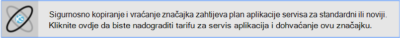
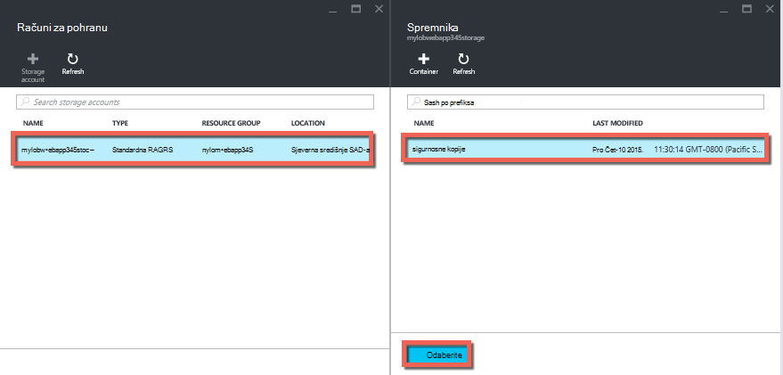
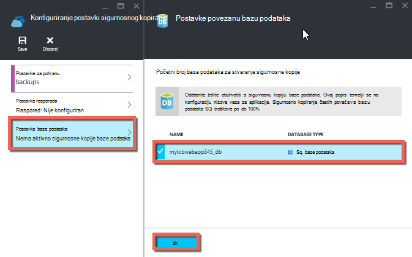
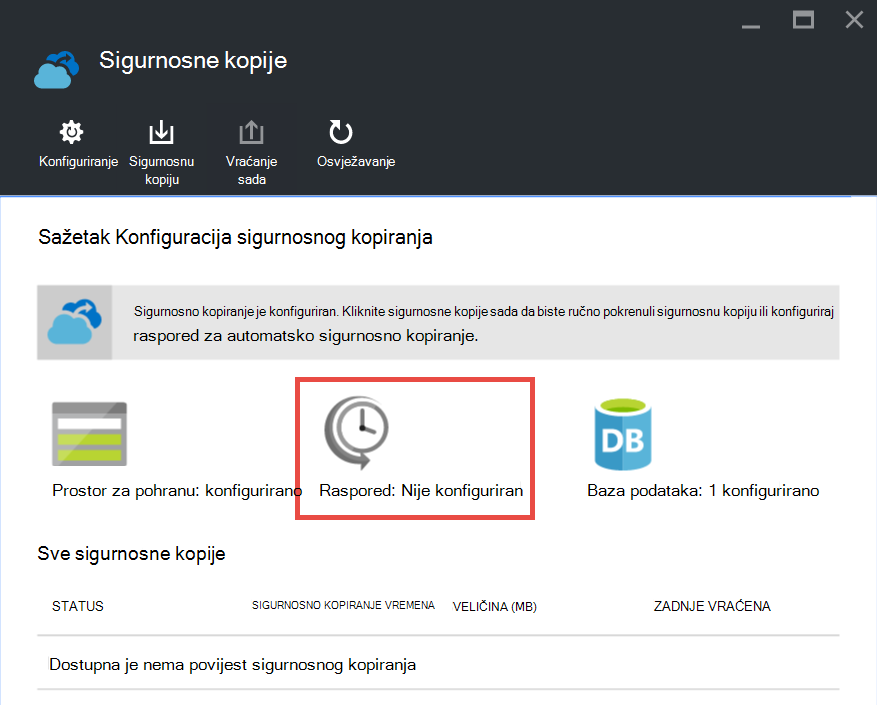

<properties 
    pageTitle="Stvaranje sigurnosne kopije vaše aplikacije u Azure" 
    description="Saznajte kako stvoriti sigurnosne kopije vaše aplikacije u aplikacije servisa za Azure." 
    services="app-service" 
    documentationCenter="" 
    authors="cephalin" 
    manager="wpickett" 
    editor="jimbe"/>

<tags 
    ms.service="app-service" 
    ms.workload="na" 
    ms.tgt_pltfrm="na" 
    ms.devlang="na" 
    ms.topic="article" 
    ms.date="07/06/2016" 
    ms.author="cephalin"/>

# Stvaranje sigurnosne kopije vaše aplikacije u Azure

Sigurnosno kopiranje i vraćanje značajci [Aplikacije servisa za Azure](../app-service/app-service-value-prop-what-is.md) omogućuje jednostavno stvaranje sigurnosne kopije aplikacije automatski ili ručno. Vraćanje aplikacije u prethodno stanje ili stvorite novu aplikaciju koja se temelji na jednom od izvorne aplikacije sigurnosne kopije. 

Informacije o vraćanju aplikacije iz sigurnosne kopije, potražite u članku [Vraćanje aplikacije u Azure](web-sites-restore.md).

## Što će sigurnosne kopije 
Aplikacije servisa može sigurnosno kopirati sljedeće informacije:

* Konfiguriranje aplikacije
* Sadržaj datoteke
* Sve baze podataka SQL Azure ili baze podataka MySQL Azure (ClearDB) s aplikacijom (možete odabrati koje korisnik će se uvrstiti u sigurnosne kopije)

Ove informacije sigurnosnu je na račun za Azure prostora za pohranu i spremniku koji navedete. 

> [AZURE.NOTE] Svaki sigurnosne kopije je cjelovit izvanmrežnu kopiju aplikacije, ne rastuće ažuriranje.

## Preduvjeti i ograničenja

* Značajka sigurnosnog kopiranja i vraćanja zahtijeva aplikacije servisa za planiranje u **standardni** sloju ili noviji. Dodatne informacije o skaliranje plan aplikacije servisa za korištenje veći sloju potražite u članku [proširenja aplikacije u Azure](web-sites-scale.md). Imajte na umu dopušta li **Premium** sloju veći broj dnevnih sigurnosne kopije od **standardne** sloju.
* Potreban je račun za Azure prostora za pohranu i spremnika u okviru iste pretplate kao aplikaciju koju želite sigurnosno kopirati. Dodatne informacije o računima Azure prostora za pohranu potražite u članku [veze](#moreaboutstorage) pri kraju ovog članka.
* Sigurnosno kopiranje može biti do 10GB aplikacije i baza podataka sadržaja. Će se pogreška ako veličinu sigurnosne kopije premašuje ograničenje. 

## Stvaranje ručno sigurnosno kopiranje

2. [Portal za Azure](https://portal.azure.com)dođite do plohu pokrenite aplikaciju, odaberite **Postavke**, a zatim **sigurnosno kopiranje**. Prikazat će se plohu **sigurnosne kopije** .
    
    ![Sigurnosno kopiranje stranice][ChooseBackupsPage]

    >[AZURE.NOTE]Ako se prikaže poruka u nastavku, kliknite je da biste nadograditi tarifu za aplikacije servisa za prije nego nastavite s sigurnosne kopije.
Dodatne informacije potražite [proširenja aplikacije u Azure](web-sites-scale.md) .  
    >

3. U plohu **sigurnosne kopije** kliknite **prostora za pohranu: nije konfiguriran** konfiguriranje računa za pohranu.

    ![Odaberite račun za pohranu][ChooseStorageAccount]
    
4. Odaberite odredište vaše sigurnosne kopije tako da odaberete **Račun za pohranu** i **kontejner**. Račun za pohranu mora pripadati iste pretplate kao aplikaciju koju želite sigurnosno kopirati. Ako želite, možete stvoriti novi račun za pohranu ili novi spremnik odgovarajući blades. Kada završite, kliknite **Odaberi**.
    
    
    
5. U **Konfiguriranje postavki sigurnosnog kopiranja** plohu koji ostaje još uvijek otvoren, kliknite **Postavke baze podataka**, zatim odaberite baze podataka koje želite uvrstiti u sigurnosne kopije (SQL baze podataka ili MySQL), a zatim kliknite **u redu**.  

    

    > [AZURE.NOTE]  Za bazu podataka da se pojavi na ovom popisu, njegov niz za povezivanje mora postojati u odjeljku **nizu za povezivanje** plohu **Postavke aplikacije** za aplikacije.

6. U plohu **Konfiguriranje postavki sigurnosnog kopiranja** , kliknite **Spremi**.  

7. Na naredbenoj traci plohu **sigurnosne kopije** kliknite **Odmah sigurnosnu kopiju**.
    
    ![Gumb BackUpNow][BackUpNow]
    
    Vidjet ćete poruku tijeku tijekom postupka sigurnosne kopije.

Nakon što ste konfigurirali račun za pohranu i spremnik za sigurnosne kopije, možete unijeti ručno sigurnosno kopiranje u bilo kojem trenutku.  

## Konfiguriranje automatskog sigurnosnog kopiranja

1. U plohu **sigurnosne kopije** kliknite **Raspored: nije konfiguriran**. 

    
    
1. Na plohu **Sigurnosne postavke rasporeda** postavite **Zakazano sigurnosne kopije** **na**, a zatim konfigurirajte raspored sigurnosnog kopiranja po želji, a zatim kliknite **u redu**.
    
    ![Omogućivanje automatskog sigurnosnog kopiranja][SetAutomatedBackupOn]
    
4. U plohu za **Konfiguriranje postavki za sigurnosno kopiranje** koji je i dalje ostane otvoren, kliknite **Postavke za pohranu**, a zatim odaberite na odredište sigurnosne kopije tako da odaberete **Račun za pohranu** i **kontejner**. Račun za pohranu mora pripadati iste pretplate kao aplikaciju koju želite sigurnosno kopirati. Ako želite, možete stvoriti novi račun za pohranu ili novi spremnik odgovarajući blades. Kada završite, kliknite **Odaberi**.
    
    
    
5. U plohu **Konfiguriranje postavki sigurnosnog kopiranja** , kliknite **Postavke baze podataka**, zatim odaberite baze podataka koje želite uvrstiti u sigurnosne kopije (SQL baze podataka ili MySQL), a zatim kliknite **u redu**.  

    

    > [AZURE.NOTE]  Za bazu podataka da se pojavi na ovom popisu, njegov niz za povezivanje mora postojati u odjeljku **nizove veze** plohu **Postavke aplikacije** za aplikacije.

6. U plohu **Konfiguriranje postavki sigurnosnog kopiranja** , kliknite **Spremi**.  

## Sigurnosno kopiranje samo dio aplikacije

Ponekad ne želite da sigurnosno kopirajte sve na aplikaciju. Evo nekoliko primjera:

-   Koje [postavite tjedni sigurnosne kopije](web-sites-backup.md#configure-automated-backups) aplikacije koja sadrži statički sadržaj koji nikad ne mijenja, kao što su stari članaka za blog ili slike.
-   Aplikacije sadrži više od 10GB sadržaja (koji je maksimalni iznos sigurnosno kopirajte odjednom).
-   Ne želite sigurnosno kopirati datoteke zapisnika.

Djelomično sigurnosne kopije poslat će vam odaberite točno datoteke koje želite sigurnosno kopirati.

### Izdvajanje datoteka iz sigurnosne kopije

Da biste isključili datoteke i mape iz sigurnosne kopije, stvorite je `_backup.filter` datoteka u mapi D:\home\site\wwwroot aplikacije i navedite popis datoteke i mape ne želite uključiti u njega. Jednostavan način pristupa na ovo se putem [Konzole za Kudu](https://github.com/projectkudu/kudu/wiki/Kudu-console). 

Ako imate aplikaciju koja sadrži datoteke zapisnika i statične slike iz prošle godine koje nikada neće biti da biste promijenili. Već ste potpuno sigurnosno kopiranje aplikacije koji sadrži stare slike. Sada želite napraviti sigurnosnu kopiju aplikacije svakodnevno, ali ne želite li platiti za spremanje datoteke zapisnika i datoteke statične slike koje se nikad ne mijenjaju.

![Zapisnici mapu][LogsFolder]
![slika mape][ImagesFolder]
    
U ispod korake Prikaži kako biste izuzeli te datoteke iz sigurnosne kopije.

1. Idite na `http://{yourapp}.scm.azurewebsites.net/DebugConsole` i definirati mape koje želite izuzeti iz sigurnosne kopije. U ovom primjeru želite želite uzeti u obzir sljedeće datoteke i mape koje su prikazane u tom korisničkog Sučelja:

        D:\home\site\wwwroot\Logs
        D:\home\LogFiles
        D:\home\site\wwwroot\Images\2013
        D:\home\site\wwwroot\Images\2014
        D:\home\site\wwwroot\Images\brand.png

    [AZURE.NOTE] Zadnji redak prikazuje da možete isključiti pojedinaca datoteke, kao i mape.

2. Stvoriti datoteku pod nazivom `_backup.filter` i staviti na gornjem popisu u datoteci, ali ukloniti `D:\home`. Popis neku direktorij ili datoteku po retku. Da bi se sadržaj datoteke mora biti:

    \site\wwwroot\Logs \LogFiles \site\wwwroot\Images\2013 \site\wwwroot\Images\2014 \site\wwwroot\Images\brand.png

3. Prijenos datoteka da biste u `D:\home\site\wwwroot\` imeničkog web-mjesta pomoću [ftp](web-sites-deploy.md#ftp) ili neki drugi način. Ako želite, možete stvoriti datoteku izravno u `http://{yourapp}.scm.azurewebsites.net/DebugConsole` i umetati sadržaja nema.

4. Na isti način kao i obično biste slijedili ga, [automatski](#configure-automated-backups)ili [ručno](#create-a-manual-backup) pokrenuti sigurnosno kopiranje.

Sada, datoteke i mape koje su navedene u `_backup.filter` će izuzeti iz sigurnosne kopije. U ovom primjeru datoteke zapisnika i slikovne datoteke 2013 i 2014 više sigurnosno će se, kao i brand.png.

>[AZURE.NOTE] Vraćanje djelomične sigurnosne kopije web-mjesta na isti način kao i [Vraćanje običnog sigurnosne kopije](web-sites-restore.md). Postupak vraćanja neće imati pravu.
>
>Kada je vraćen potpunu sigurnosnu kopiju, sav sadržaj na web-mjestu je zamijenjena funkcijom ono se sigurnosno kopiranje. Ako je datoteka na web-mjestu, ali ne u sigurnosnoj kopiji ona se briše. No kada vratit će se djelomično sigurnosnu kopiju, bilo koji sadržaj koji se nalazi u jednom blacklisted direktorija ili bilo koju datoteku blacklisted ostaje kao što je.

## Kako se spremaju sigurnosne kopije

Nakon što ste napravili jednu ili više kopija aplikacije, sigurnosnih kopija će biti vidljiv na plohu **spremnika** računa za pohranu, kao i aplikacije. Na računu za pohranu svaki sigurnosne kopije sastoji se od .zip datoteku koja sadrži sigurnosne kopije podataka i .xml datoteci koju izvesti sadržaja .zip datoteke. Možete raspakiraj i pregled te datoteke ako želite da biste pristupili sigurnosne kopije bez same provedbe programa Obnovi.

Sigurnosno kopiranje baze podataka za aplikaciju pohranjuju se u korijenskoj mapi .zip datoteke. SQL baze podataka, to je BACPAC datoteke (nema datotečni nastavak) i moguće je uvesti. Da biste stvorili novu SQL bazu podataka na temelju BACPAC izvoza, potražite u članku [Uvoz datoteke BACPAC da biste stvorili novu bazu podataka za korisnika](http://technet.microsoft.com/library/hh710052.aspx).

> [AZURE.WARNING] Mijenjanje bilo koju datoteku u spremniku vaše **websitebackups** mogu prouzročiti postaju koji nisu valjani i stoga nisu-restorable sigurnosnu kopiju.

## Daljnji koraci
Informacije o vraćanju aplikacije iz sigurnosne kopije, potražite u članku [Vraćanje aplikacije u Azure](web-sites-restore.md). Sigurnosno kopiranje i vraćanje aplikacije servisa za aplikacije pomoću REST API-JA (pogledajte [Korištenje OSTALE sigurnosne kopije i vraćanje aplikacije servisa za aplikacije](websites-csm-backup.md)).

>[AZURE.NOTE] Ako želite započeti s aplikacije servisa za Azure prije registracije za račun za Azure, idite na [Pokušajte aplikacije servisa](http://go.microsoft.com/fwlink/?LinkId=523751), gdje možete odmah stvoriti web-aplikacijama short-lived starter u aplikacije servisa. Nema kreditne kartice potrebna; Nema preuzete obveze.

<!-- IMAGES -->
[ChooseBackupsPage]: ./media/web-sites-backup/01ChooseBackupsPage.png
[ChooseStorageAccount]: ./media/web-sites-backup/02ChooseStorageAccount.png
[IncludedDatabases]: ./media/web-sites-backup/03IncludedDatabases.png
[BackUpNow]: ./media/web-sites-backup/04BackUpNow.png
[BackupProgress]: ./media/web-sites-backup/05BackupProgress.png
[SetAutomatedBackupOn]: ./media/web-sites-backup/06SetAutomatedBackupOn.png
[Frequency]: ./media/web-sites-backup/07Frequency.png
[StartDate]: ./media/web-sites-backup/08StartDate.png
[StartTime]: ./media/web-sites-backup/09StartTime.png
[SaveIcon]: ./media/web-sites-backup/10SaveIcon.png
[ImagesFolder]: ./media/web-sites-backup/11Images.png
[LogsFolder]: ./media/web-sites-backup/12Logs.png
[GhostUpgradeWarning]: ./media/web-sites-backup/13GhostUpgradeWarning.png
 
