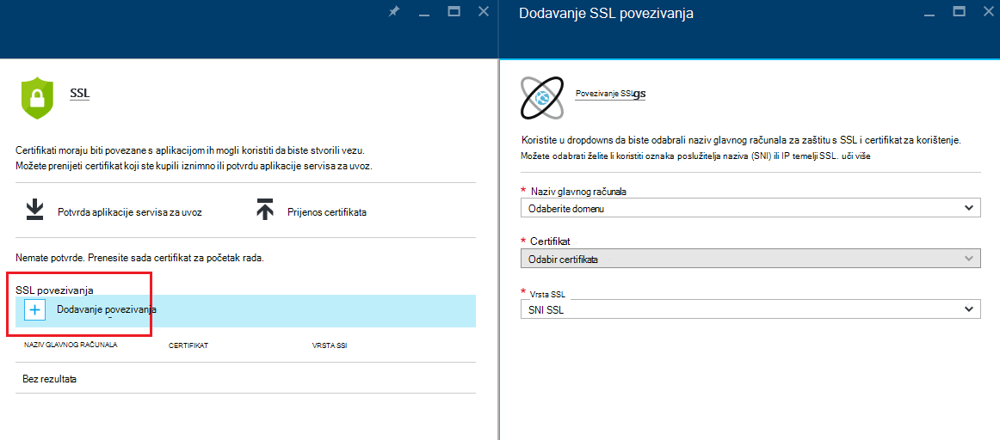
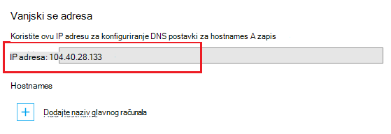
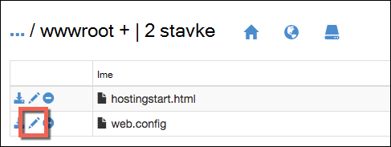

<properties
    pageTitle="Pokrenite aplikaciju prilagođenu domenu s HTTPS za sigurnu | Microsoft Azure"
    description="Saznajte koliko ćete sigurnim naziv prilagođene domene za aplikaciju u aplikacije servisa za Azure konfiguriranjem za povezivanje SSL certifikata. Ćete saznati i kako dobiti SSL certifikat od više alata."
    services="app-service"
    documentationCenter=".net"
    authors="cephalin"
    manager="wpickett"
    editor="jimbe"
    tags="top-support-issue"/>

<tags
    ms.service="app-service"
    ms.workload="na"
    ms.tgt_pltfrm="na"
    ms.devlang="na"
    ms.topic="article"
    ms.date="08/08/2016"
    ms.author="cephalin"/>

# Pokrenite aplikaciju prilagođenu domenu s HTTPS za sigurnu

> [AZURE.SELECTOR]
- [Kupnja SSL certifikata u Azure](web-sites-purchase-ssl-web-site.md)
- [Korištenje SSL certifikata s drugih mjesta](web-sites-configure-ssl-certificate.md)

U ovom se članku objašnjava da biste omogućili HTTPS web-aplikacijama, mobilne aplikacije pozadinskog ili aplikacije API [Servisa Azure aplikacije](../app-service/app-service-value-prop-what-is.md) koja koristi prilagođeni naziv domene. Pokriva samo za poslužitelj za provjeru autentičnosti. Ako vam je potrebna međusobna provjere autentičnosti (uključujući provjera autentičnosti klijenta), potražite u članku [Kako za konfiguriranje TLS međusobna provjere autentičnosti za aplikaciju servisa](app-service-web-configure-tls-mutual-auth.md).

Da biste s HTTPS sigurne aplikaciju koja sadrži prilagođeni naziv domene, dodajte certifikat za taj naziv domene. Prema zadanim postavkama Azure secures u ** \*. azurewebsites.net** zamjenskih domenu s jednom SSL certifikat, da klijentima već mogli pristupati aplikacije na * *https://*&lt;appname >*. azurewebsites.net**. No ako želite koristiti prilagođenu domenu, kao što su **www.contoso.com contoso.com**; ****, i ** \*. contoso.com**, zadanu potvrdu ne može osigurati koji. Osim toga, kao što su svi [Certifikati zamjenskih](https://casecurity.org/2014/02/26/pros-and-cons-of-single-domain-multi-domain-and-wildcard-certificates/)zadanu potvrdu nije sigurna, kao što su korištenje prilagođene domene i certifikat za tu prilagođenu domenu.   

>[AZURE.NOTE] Zatražite pomoć od stručnjaka za Azure bilo kojem trenutku na [forume za Azure](https://azure.microsoft.com/support/forums/). Za podršku za više personalizirane, idite na [Podržava Azure](https://azure.microsoft.com/support/options/) i kliknite **Dohvati podržava**.

## Što vam je potrebno
Sigurnost prilagođeni naziv domene s HTTPS povezati prilagođene SSL certifikat te prilagođene domene u Azure. Prije povezivanja prilagođene certifikat, morate učiniti sljedeće:

- **Konfiguriranje prilagođenu domenu** – aplikacije servisa za samo omogućuje dodavanje certifikat za naziv domene koji je već konfiguriran u svojoj aplikaciji. Upute potražite u odjeljku [Mapiranje prilagođenog naziva domene za Azure aplikacije](web-sites-custom-domain-name.md). 
- **Promjena veličine osnovne sloju ili noviji** Aplikacije servisa za tarife u donjem cijene razine ne podržavaju prilagođene SSL certifikata. Upute potražite u članku [proširenja aplikacije u Azure](web-sites-scale.md). 
- **Početak SSL certifikata** – ako nije već postoji, morate se jedna od pouzdana [ustanova za izdavanje certifikata](http://en.wikipedia.org/wiki/Certificate_authority) (CA). Certifikat mora zadovoljiti sljedeće preduvjete:

    - To je potpisao pouzdani CA (bez privatne CA poslužitelji).
    - Sadrži privatni ključ.
    - Ona se stvara za ključne exchange i izvesti na. Datoteka PFX.
    - Koristi najmanje 2048-bitni šifriranje.
    - Nazivu predmet odgovara prilagođene domene potrebne za zaštitu. Da biste sigurne više domena s jedan certifikat, morate koristiti naziv zamjenskih (npr. ** \*. contoso.com**) ili navedite subjectAltName vrijednosti.
    - Spajaju se s sve **[Srednja certifikati](http://en.wikipedia.org/wiki/Intermediate_certificate_authorities)** koristi vaš CA. U suprotnom, možda naiđete na probleme irreproducible interoperabilnost na neki klijenti.

        >[AZURE.NOTE] Najjednostavniji način da biste dobili SSL certifikat koji ispunjava sve uvjete je         [kupiti na portalu Azure izravno](web-sites-purchase-ssl-web-site.md). U ovom se članku objašnjava ručno, a zatim je povežite prilagođene domene u aplikacije servisa.
        >   
        > **Certifikati elipse krivulje šifriranja (ECC)** možete raditi sa servisom za aplikaciju, ali izvan raspona ovog članka. Rad s vašeg CA na točne korake da biste stvorili ECC certifikata.

## Korak 1. Početak SSL certifikata

Budući da CA sadrže različite vrste SSL certifikat na točke različitih cijena, trebala prema odabiru koju vrstu SSL certifikat za kupnju. Sigurnost naziv jednog domene (**www.contoso.com**), morate samo osnovni certifikata. Sigurnost više naziva domena (**contoso.com** *i* **www.contoso.com** 
*i* **mail.contoso.com**), vam je potrebna [Potvrda zamjenskih](http://en.wikipedia.org/wiki/Wildcard_certificate) ili certifikat s [Predmetom zamjensko ime](http://en.wikipedia.org/wiki/SubjectAltName) (`subjectAltName`).

Kada znate koje SSL certifikat za kupnju, pošaljite potvrda potpisa zahtjev (CSR) za izdavanje certifikata. Kada se vratite Traženi certifikat iz CA, .pfx datoteka pa generiranje iz certifikata. Možete izvršiti ove korake pomoću alata za po izboru. Evo uputa za uobičajenih alata:

- [Koraci Certreq.exe](#bkmk_certreq) – Windows utility za stvaranje zahtjeva za potvrdu. To je dio sustava Windows od Windows XP i Windows Server 2000.
- [Koraci upravitelja IIS](#bkmk_iismgr) - alat za odabir ako ste već upoznati s njim.
- [Koraci OpenSSL](#bkmk_openssl) – [Alat za web-mjesto Otvori izvor, u okvir za različite platforme](https://www.openssl.org). Koristi se za pomoć pri SSL certifikata na svim platformama.
- [subjectAltName korake pomoću OpenSSL](#bkmk_subjectaltname) – upute za početak `subjectAltName` certifikata.

Ako želite da biste testirali postavljanje u aplikacije servisa za prije kupnje certifikat, možete stvoriti [samopotpisani certifikat](https://en.wikipedia.org/wiki/Self-signed_certificate). Pomoću ovog praktičnog vodiča nudi dva načina da biste generirali je:

- [Samopotpisani certifikat, Certreq.exe koraka](#bkmk_sscertreq)
- [Samopotpisani certifikat, OpenSSL koraka](#bkmk_ssopenssl)

### Preuzmite certifikat pomoću Certreq.exe

1. Stvaranje datoteke (npr. **myrequest.txt**), kopirajte u nju sljedeći tekst i spremite ga u radni imenik. Zamjena na `<your-domain>` rezervirano mjesto s nazivom prilagođenu domenu aplikacije.

        [NewRequest]
        Subject = "CN=<your-domain>"  ; E.g. "CN=www.contoso.com", or "CN=*.contoso.com" for a wildcard certificate
        Exportable = TRUE
        KeyLength = 2048              ; Required minimum is 2048
        KeySpec = 1
        KeyUsage = 0xA0
        MachineKeySet = True
        ProviderName = "Microsoft RSA SChannel Cryptographic Provider"
        ProviderType = 12
        HashAlgorithm = SHA256

        [EnhancedKeyUsageExtension]
        OID=1.3.6.1.5.5.7.3.1         ; Server Authentication

    Dodatne informacije o mogućnostima u predstavniku službe za Korisnike i ostale mogućnosti dostupne potražite u [dokumentaciji Certreq referenca](https://technet.microsoft.com/library/dn296456.aspx).

4. U naredbeni redak `CD` u radni direktorij i pokrenite sljedeću naredbu da biste stvorili predstavniku službe za Korisnike:

        certreq -new myrequest.txt myrequest.csr

    **myrequest.CSR** sada je stvoren u trenutnom radnom direktoriju.

5. Slanje **myrequest.csr** za izdavanje certifikata za nabavite SSL certifikat. Koje prijenos datoteke ili kopirajte sadržaj iz programa za uređivanje teksta u web-obrasca.

    Popis CA vjerovati Microsoft, potražite u članku [Microsoft pouzdani korijenski certifikat Program: sudionici][cas].

6. Kada CA odgovorio na pomoću certifikata (. Datoteka CER), spremite ga u direktoriju rad. Zatim, pokrenite sljedeću naredbu da biste dovršili predstavniku službe za Korisnike na čekanju.

        certreq -accept -user <certificate-name>.cer

    Ta se naredba pohranjuje dovršeni certifikat u Windows spremište certifikata.

6. Ako vaš CA koristi Srednja potvrde, instalirajte ih prije nastavka. Obično se kao zasebna preuzimanje putem vaše CA i nekoliko oblici za vrste poslužitelja drugoj web. Odaberite verziju za Microsoft IIS.

    Nakon što preuzmete certifikate, desnom tipkom miša kliknite svaku od njih u programu Windows Explorer, a zatim odaberite  **Instalacija certifikata**. Koristite zadane vrijednosti u **Čarobnjaku za uvoz certifikata**i nastavite s odabirom **sljedeći** dok je uvoz dovršen.

7. Da biste izvezli SSL certifikat iz spremišta certifikata, pritisnite `Win` + `R` i pokretanje **certmgr.msc** pokrenuti upravitelj certifikata. Odaberite **osobne** > **certifikata**. U stupcu **Izdao** s prilagođeni naziv domene i CA koji ste koristili za stvaranje potvrde u stupcu **Izdao,** trebali biste vidjeti stavku.

    ![Umetanje slike u nastavku upravitelja certifikata][certmgr]

9. Desnom tipkom miša kliknite certifikat, a zatim odaberite **Svi zadaci** > **Izvoz**. U **Čarobnjaka za izvoz certifikata**kliknite **Dalje**, a zatim odaberite **Da, izvezi privatni ključ**pa zatim ponovno kliknite **Dalje** .

    ![Izvoz privatni ključ][certwiz1]

10. Odaberite **Razmjena osobnih podataka - PKCS #12**, **uključiti svi certifikati u putu certifikat ako je moguće**i **Izvezi sva proširena svojstva**. Zatim kliknite **Dalje**.

    ![sve certifikati o i proširena svojstva][certwiz2]

11. Odaberite **lozinku**i zatim unesite i potvrdite lozinku. Kliknite **Dalje**.

    ![Određivanje lozinke][certwiz3]

12. Navedite put i naziv datoteke za izvezene potvrde s nastavkom **.pfx**. Kliknite **Dalje** da biste završili.

    ![Navedite put datoteke][certwiz4]

Sada ste spremni za prijenos izvezenu datoteku PFX aplikacije servisa. Potražite u članku [Korak 2. Prijenos i povezati prilagođene SSL certifikat](#bkmk_configuressl).

### Preuzmite certifikat pomoću upravitelja IIS

1. Generiranje CSR s IIS Manager da biste poslali CA. Dodatne informacije o generiranje CSR potražite u odjeljku [zahtjev za potvrdom poslužitelja Internet (IIS 7)][iiscsr].

3. Slanje na predstavnika službe za Korisnike za izdavanje certifikata da biste dobili SSL certifikata. Popis CA vjerovati Microsoft, potražite u članku [Microsoft pouzdani korijenski certifikat Program: sudionici][cas].

3. Dovršite CSR pomoću certifikata koji CA šalje natrag. Dodatne informacije o dovršavanju predstavniku službe za Korisnike potražite u odjeljku [Instalacija certifikat poslužitelja Internet (IIS 7)][installcertiis].

4. Ako vaš CA koristi Srednja potvrde, instalirajte ih prije nastavka. Obično se kao zasebna preuzimanje putem vaše CA i nekoliko oblici za vrste poslužitelja drugoj web. Odaberite verziju za Microsoft IIS.

    Nakon što preuzmete certifikate, desnom tipkom miša kliknite svaku od njih u programu Windows Explorer, a zatim odaberite **Instalacija certifikata**. 
    Koristite zadane vrijednosti u **Čarobnjaku za uvoz certifikata**i nastavite s odabirom **sljedeći** dok je uvoz dovršen.

4. Izvezite SSL certifikat od upravitelja za IIS. Dodatne informacije o izvozu certifikata potražite u članku [Izvoz certifikat poslužitelja (IIS 7)][exportcertiis]. 

    >[AZURE.IMPORTANT] U **Čarobnjaka za izvoz certifikata**, provjerite jeste li odabrali **Da, izvezi privatni ključ**  
    >
    >![Izvoz privatni ključ][certwiz1]  
    >
    > i odaberite **Razmjena osobnih podataka - PKCS #12**, **uključiti svi certifikati u putu certifikat ako je moguće**i     **Izvezi sva proširena svojstva**.
    >
    >![sve certifikati o i proširena svojstva][certwiz2]

Sada ste spremni za prijenos izvezenu datoteku PFX aplikacije servisa. Potražite u članku [Korak 2. Prijenos i povezati prilagođene SSL certifikat](#bkmk_configuressl).

### Preuzmite certifikat pomoću OpenSSL

1. U naredbeni redak terminal `CD` u radni direktorij generiranje privatni ključ i CSR ponovnim pokretanjem sljedeće naredbe:

        openssl req -sha256 -new -nodes -keyout myserver.key -out server.csr -newkey rsa:2048

2. Kada se to od vas zatraži, unesite odgovarajuće podatke. Ako, na primjer:

        Country Name (2 letter code)
        State or Province Name (full name) []: Washington
        Locality Name (eg, city) []: Redmond
        Organization Name (eg, company) []: Microsoft
        Organizational Unit Name (eg, section) []: Azure
        Common Name (eg, YOUR name) []: www.microsoft.com
        Email Address []:

        Please enter the following 'extra' attributes to be sent with your certificate request

        A challenge password []:

    Kada završite, imat ćete dvije datoteke u direktoriju rad: **myserver.key** i **server.csr**. 
    **Server.csr** sadrži predstavniku službe za Korisnike te vam zatreba **myserver.key** .

3. Slanje na predstavnika službe za Korisnike za izdavanje certifikata da biste dobili SSL certifikata. Popis CA vjerovati Microsoft, potražite u članku [Microsoft pouzdani korijenski certifikat Program: sudionici][cas].

4. Kada CA šalje Traženi certifikat, spremite ga u datoteku pod nazivom **myserver.crt** u direktoriju rad. Ako vaš CA nudi je u tekstnom obliku, jednostavno kopirajte sadržaj u **myserver.crt** u uređivaču teksta i spremite ga. Vaše datoteke trebao bi izgledati ovako:

        -----BEGIN CERTIFICATE-----
        MIIDJDCCAgwCCQCpCY4o1LBQuzANBgkqhkiG9w0BAQUFADBUMQswCQYDVQQGEwJV
        UzELMAkGA1UECBMCV0ExEDAOBgNVBAcTB1JlZG1vbmQxEDAOBgNVBAsTB0NvbnRv
        c28xFDASBgNVBAMTC2NvbnRvc28uY29tMB4XDTE0MDExNjE1MzIyM1oXDTE1MDEx
        NjE1MzIyM1owVDELMAkGA1UEBhMCVVMxCzAJBgNVBAgTAldBMRAwDgYDVQQHEwdS
        ZWRtb25kMRAwDgYDVQQLEwdDb250b3NvMRQwEgYDVQQDEwtjb250b3NvLmNvbTCC
        ASIwDQYJKoZIhvcNAQEBBQADggEPADCCAQoCggEBAN96hBX5EDgULtWkCRK7DMM3
        enae1LT9fXqGlbA7ScFvFivGvOLEqEPD//eLGsf15OYHFOQHK1hwgyfXa9sEDPMT
        3AsF3iWyF7FiEoR/qV6LdKjeQicJ2cXjGwf3G5vPoIaYifI5r0lhgOUqBxzaBDZ4
        xMgCh2yv7NavI17BHlWyQo90gS2X5glYGRhzY/fGp10BeUEgIs3Se0kQfBQOFUYb
        ktA6802lod5K0OxlQy4Oc8kfxTDf8AF2SPQ6BL7xxWrNl/Q2DuEEemjuMnLNxmeA
        Ik2+6Z6+WdvJoRxqHhleoL8ftOpWR20ToiZXCPo+fcmLod4ejsG5qjBlztVY4qsC
        AwEAATANBgkqhkiG9w0BAQUFAAOCAQEAVcM9AeeNFv2li69qBZLGDuK0NDHD3zhK
        Y0nDkqucgjE2QKUuvVSPodz8qwHnKoPwnSrTn8CRjW1gFq5qWEO50dGWgyLR8Wy1
        F69DYsEzodG+shv/G+vHJZg9QzutsJTB/Q8OoUCSnQS1PSPZP7RbvDV9b7Gx+gtg
        7kQ55j3A5vOrpI8N9CwdPuimtu6X8Ylw9ejWZsnyy0FMeOPpK3WTkDMxwwGxkU3Y
        lCRTzkv6vnHrlYQxyBLOSafCB1RWinN/slcWSLHADB6R+HeMiVKkFpooT+ghtii1
        A9PdUQIhK9bdaFicXPBYZ6AgNVuGtfwyuS5V6ucm7RE6+qf+QjXNFg==
        -----END CERTIFICATE-----

5. U naredbeni redak terminal, pokrenite sljedeću naredbu da biste izvezli **myserver.pfx** **myserver.key** i **myserver.crt**:

        openssl pkcs12 -export -out myserver.pfx -inkey myserver.key -in myserver.crt

    Kada se to od vas zatraži, definirajte lozinku radi zaštite .pfx datoteka.

    > [AZURE.NOTE] Ako vaš CA koristi Srednja potvrde, morate uključiti ih na `-certfile` parametar. Obično se kao zasebna preuzimanje putem vaše CA i nekoliko oblici za vrste poslužitelja drugoj web. Odaberite verziju s na `.pem` nastavak.
    >
    > Vaše `openssl -export` naredba trebala bi izgledati kao u sljedećem primjeru, čime se .pfx datoteka koja sadrži Srednja certifikate iz datoteke **posrednik cets.pem** :
    >  
    > `openssl pkcs12 -chain -export -out myserver.pfx -inkey myserver.key -in myserver.crt -certfile intermediate-cets.pem`

Sada ste spremni za prijenos izvezenu datoteku PFX aplikacije servisa. Potražite u članku [Korak 2. Prijenos i povezati prilagođene SSL certifikat](#bkmk_configuressl).

### Preuzmite certifikat SubjectAltName pomoću OpenSSL

1. Stvaranje datoteku pod nazivom **sancert.cnf**, kopirajte sljedeći tekst u nju i spremite ga u radni imenik:

        # -------------- BEGIN custom sancert.cnf -----
        HOME = .
        oid_section = new_oids
        [ new_oids ]
        [ req ]
        default_days = 730
        distinguished_name = req_distinguished_name
        encrypt_key = no
        string_mask = nombstr
        req_extensions = v3_req # Extensions to add to certificate request
        [ req_distinguished_name ]
        countryName = Country Name (2 letter code)
        countryName_default =
        stateOrProvinceName = State or Province Name (full name)
        stateOrProvinceName_default =
        localityName = Locality Name (eg, city)
        localityName_default =
        organizationalUnitName  = Organizational Unit Name (eg, section)
        organizationalUnitName_default  =
        commonName              = Your common name (eg, domain name)
        commonName_default      = www.mydomain.com
        commonName_max = 64
        [ v3_req ]
        subjectAltName=DNS:ftp.mydomain.com,DNS:blog.mydomain.com,DNS:*.mydomain.com
        # -------------- END custom sancert.cnf -----

    U retku koji započinje `subjectAltName`, zamijenite vrijednost s svi nazivi domena koju želite sigurne (uz  `commonName`). Ako, na primjer:

        subjectAltName=DNS:sales.contoso.com,DNS:support.contoso.com,DNS:fabrikam.com

    Ne morate promijeniti bilo kojeg drugog polja, uključujući `commonName`. Zatražit će se da biste ih odrediti u sljedećih nekoliko koraka.

1. U naredbeni redak terminal `CD` u vaš radni direktorij i pokrenite sljedeću naredbu:

        openssl req -sha256 -new -nodes -keyout myserver.key -out server.csr -newkey rsa:2048 -config sancert.cnf

2. Kada se to od vas zatraži, unesite odgovarajuće podatke. Ako, na primjer:

        Country Name (2 letter code) []: US
        State or Province Name (full name) []: Washington
        Locality Name (eg, city) []: Redmond
        Organizational Unit Name (eg, section) []: Azure
        Your common name (eg, domain name) []: www.microsoft.com

    Kada završite, imat ćete dvije datoteke u direktoriju rad: **myserver.key** i **server.csr**. 
    **Server.csr** sadrži predstavniku službe za Korisnike te vam zatreba **myserver.key** .

3. Slanje na predstavnika službe za Korisnike za izdavanje certifikata da biste dobili SSL certifikata. Popis CA vjerovati Microsoft, potražite u članku [Microsoft pouzdani korijenski certifikat Program: sudionici][cas].

4. Kada CA šalje Traženi certifikat, spremite ga u datoteku pod nazivom **myserver.crt**. Ako vaš CA nudi je u tekstnom obliku, jednostavno kopirajte sadržaj u **myserver.crt** u uređivaču teksta i spremite ga. Datoteke trebao bi izgledati ovako:

        -----BEGIN CERTIFICATE-----
        MIIDJDCCAgwCCQCpCY4o1LBQuzANBgkqhkiG9w0BAQUFADBUMQswCQYDVQQGEwJV
        UzELMAkGA1UECBMCV0ExEDAOBgNVBAcTB1JlZG1vbmQxEDAOBgNVBAsTB0NvbnRv
        c28xFDASBgNVBAMTC2NvbnRvc28uY29tMB4XDTE0MDExNjE1MzIyM1oXDTE1MDEx
        NjE1MzIyM1owVDELMAkGA1UEBhMCVVMxCzAJBgNVBAgTAldBMRAwDgYDVQQHEwdS
        ZWRtb25kMRAwDgYDVQQLEwdDb250b3NvMRQwEgYDVQQDEwtjb250b3NvLmNvbTCC
        ASIwDQYJKoZIhvcNAQEBBQADggEPADCCAQoCggEBAN96hBX5EDgULtWkCRK7DMM3
        enae1LT9fXqGlbA7ScFvFivGvOLEqEPD//eLGsf15OYHFOQHK1hwgyfXa9sEDPMT
        3AsF3iWyF7FiEoR/qV6LdKjeQicJ2cXjGwf3G5vPoIaYifI5r0lhgOUqBxzaBDZ4
        xMgCh2yv7NavI17BHlWyQo90gS2X5glYGRhzY/fGp10BeUEgIs3Se0kQfBQOFUYb
        ktA6802lod5K0OxlQy4Oc8kfxTDf8AF2SPQ6BL7xxWrNl/Q2DuEEemjuMnLNxmeA
        Ik2+6Z6+WdvJoRxqHhleoL8ftOpWR20ToiZXCPo+fcmLod4ejsG5qjBlztVY4qsC
        AwEAATANBgkqhkiG9w0BAQUFAAOCAQEAVcM9AeeNFv2li69qBZLGDuK0NDHD3zhK
        Y0nDkqucgjE2QKUuvVSPodz8qwHnKoPwnSrTn8CRjW1gFq5qWEO50dGWgyLR8Wy1
        F69DYsEzodG+shv/G+vHJZg9QzutsJTB/Q8OoUCSnQS1PSPZP7RbvDV9b7Gx+gtg
        7kQ55j3A5vOrpI8N9CwdPuimtu6X8Ylw9ejWZsnyy0FMeOPpK3WTkDMxwwGxkU3Y
        lCRTzkv6vnHrlYQxyBLOSafCB1RWinN/slcWSLHADB6R+HeMiVKkFpooT+ghtii1
        A9PdUQIhK9bdaFicXPBYZ6AgNVuGtfwyuS5V6ucm7RE6+qf+QjXNFg==
        -----END CERTIFICATE-----

5. U naredbeni redak terminal, pokrenite sljedeću naredbu da biste izvezli **myserver.pfx** **myserver.key** i **myserver.crt**:

        openssl pkcs12 -export -out myserver.pfx -inkey myserver.key -in myserver.crt

    Kada se to od vas zatraži, definirajte lozinku radi zaštite .pfx datoteka.

    > [AZURE.NOTE] Ako vaš CA koristi Srednja potvrde, morate uključiti ih na `-certfile` parametar. Obično se kao zasebna preuzimanje putem vaše CA i nekoliko oblici za vrste poslužitelja drugoj web. Odaberite verziju s na `.pem` kućni broj).
    >
    > Vaše `openssl -export` naredba trebala bi izgledati kao u sljedećem primjeru, čime se .pfx datoteka koja sadrži Srednja certifikate iz datoteke **posrednik cets.pem** :
    >  
    > `openssl pkcs12 -chain -export -out myserver.pfx -inkey myserver.key -in myserver.crt -certfile intermediate-cets.pem`

Sada ste spremni za prijenos izvezenu datoteku PFX aplikacije servisa. Potražite u članku [Korak 2. Prijenos i povezati prilagođene SSL certifikat](#bkmk_configuressl).

### Stvaranje samopotpisanog certifikata pomoću Certreq.exe ###

>[AZURE.IMPORTANT] Samopotpisane potvrde su samo u svrhu testiranja. Većini preglednika vratite pogreške prilikom posjeta web-mjesto koje je osigurani po samopotpisanog certifikata. Nekim se preglednicima čak i uskratiti pronađite web-mjesto. 

1. Stvaranje tekstnu datoteku (primjerice **mycert.txt**), kopirajte u nju sljedeći tekst i spremite datoteku u radni imenik. Zamjena na `<your-domain>` rezervirano mjesto s nazivom prilagođenu domenu aplikacije.

        [NewRequest]
        Subject = "CN=<your-domain>"  ; E.g. "CN=www.contoso.com", or "CN=*.contoso.com" for a wildcard certificate
        Exportable = TRUE
        KeyLength = 2048              ; KeyLength can be 2048, 4096, 8192, or 16384 (required minimum is 2048)
        KeySpec = 1
        KeyUsage = 0xA0
        MachineKeySet = True
        ProviderName = "Microsoft RSA SChannel Cryptographic Provider"
        ProviderType = 12
        HashAlgorithm = SHA256
        RequestType = Cert            ; Self-signed certificate
        ValidityPeriod = Years
        ValidityPeriodUnits = 1

        [EnhancedKeyUsageExtension]
        OID=1.3.6.1.5.5.7.3.1         ; Server Authentication

    Važno parametar `RequestType = Cert`, koji određuje samopotpisanog certifikata. 
    Dodatne informacije o mogućnostima u predstavniku službe za Korisnike i ostale mogućnosti dostupne potražite u [dokumentaciji Certreq referenca](https://technet.microsoft.com/library/dn296456.aspx).

4. U naredbeni redak `CD` da biste na radni direktorij i pokrenite sljedeću naredbu:

        certreq -new mycert.txt mycert.crt
    
    Novi samopotpisani certifikat sada je instaliran u spremištu certifikata.

7. Da biste izvezli certifikat iz spremišta certifikata, pritisnite `Win` + `R` i pokretanje **certmgr.msc** pokrenuti upravitelj certifikata. Odaberite **osobne** > **certifikata**. U stupcu **Izdao** s prilagođeni naziv domene i CA koji ste koristili za stvaranje potvrde u stupcu **Izdao,** trebali biste vidjeti stavku.

    ![Umetanje slike u nastavku upravitelja certifikata][certmgr]

9. Desnom tipkom miša kliknite certifikat, a zatim odaberite **Svi zadaci** > **Izvoz**. U **Čarobnjaka za izvoz certifikata**kliknite **Dalje**, a zatim odaberite **Da, izvezi privatni ključ**pa zatim ponovno kliknite **Dalje** .

    ![Izvoz privatni ključ][certwiz1]

10. Odaberite **Razmjena osobnih podataka - PKCS #12**, **uključiti svi certifikati u putu certifikat ako je moguće**i **Izvezi sva proširena svojstva**. Zatim kliknite **Dalje**.

    ![sve certifikati o i proširena svojstva][certwiz2]

11. Odaberite **lozinku**i zatim unesite i potvrdite lozinku. Kliknite **Dalje**.

    ![Određivanje lozinke][certwiz3]

12. Navedite put i naziv datoteke za izvezene potvrde s nastavkom **.pfx**. Kliknite **Dalje** da biste završili.

    ![Navedite put datoteke][certwiz4]

Sada ste spremni za prijenos izvezenu datoteku PFX aplikacije servisa. Potražite u članku [Korak 2. Prijenos i povezati prilagođene SSL certifikat](#bkmk_configuressl).

###Stvaranje samopotpisanog certifikata pomoću OpenSSL ###

>[AZURE.IMPORTANT] Samopotpisane potvrde su samo u svrhu testiranja. Većini preglednika vratite pogreške prilikom posjeta web-mjesto koje je osigurani po samopotpisanog certifikata. Nekim se preglednicima čak i uskratiti pronađite web-mjesto. 

1. Stvoriti tekstnu datoteku pod nazivom **serverauth.cnf**, a zatim kopirajte sljedeći sadržaj u nju i spremite ga u radni imenik:

        [ req ]
        default_bits           = 2048
        default_keyfile        = privkey.pem
        distinguished_name     = req_distinguished_name
        attributes             = req_attributes
        x509_extensions        = v3_ca

        [ req_distinguished_name ]
        countryName         = Country Name (2 letter code)
        countryName_min         = 2
        countryName_max         = 2
        stateOrProvinceName     = State or Province Name (full name)
        localityName            = Locality Name (eg, city)
        0.organizationName      = Organization Name (eg, company)
        organizationalUnitName      = Organizational Unit Name (eg, section)
        commonName          = Common Name (eg, your app's domain name)
        commonName_max          = 64
        emailAddress            = Email Address
        emailAddress_max        = 40

        [ req_attributes ]
        challengePassword       = A challenge password
        challengePassword_min       = 4
        challengePassword_max       = 20

        [ v3_ca ]
         subjectKeyIdentifier=hash
         authorityKeyIdentifier=keyid:always,issuer:always
         basicConstraints = CA:false
         keyUsage=nonRepudiation, digitalSignature, keyEncipherment
         extendedKeyUsage = serverAuth

2. U naredbeni redak terminal `CD` u vaš radni direktorij i pokrenite sljedeću naredbu:

        openssl req -sha256 -x509 -nodes -days 365 -newkey rsa:2048 -keyout myserver.key -out myserver.crt -config serverauth.cnf

    Ta naredba stvara dvije datoteke: **myserver.crt** (samopotpisani certifikat) i **myserver.key** (privatni ključ), koji se temelji na stranici Postavke u **serverauth.cnf**.

3. Izvoz certifikata .pfx datoteka ponovnim pokretanjem sljedeće naredbe:

        openssl pkcs12 -export -out myserver.pfx -inkey myserver.key -in myserver.crt

    Kada se to od vas zatraži, definirajte lozinku radi zaštite .pfx datoteka.

Sada ste spremni za prijenos izvezenu datoteku PFX aplikacije servisa. Potražite u članku [Korak 2. Prijenos i povezati prilagođene SSL certifikat](#bkmk_configuressl).

## Korak 2. Prijenos i povezati prilagođene SSL certifikata

Prije nego što se premjestili, pročitajte odjeljak [što vam je potrebno](#bkmk_domainname) i provjerite:

- imate prilagođenu domenu koja mapira aplikaciju programa Azure
- aplikacija se izvodi u sloju **Osnovni** ili noviji, a
- imate SSL certifikata za prilagođenu domenu s izdavanje certifikata.

1. U pregledniku otvorite na ** [Azure Portal.](https://portal.azure.com/)**
2.  Kliknite mogućnost **Aplikacije servisa** na lijevoj strani stranice.
3.  Kliknite naziv aplikacije u koju želite dodijeliti ovog certifikata. 
4.  U odjeljku **Postavke**kliknite **SSL certifikata**
5.  Kliknite **Prenesi certifikata**
6.  Odaberite .pfx datoteka koje ste izvezli u [koraku 1](#bkmk_getcert) i odredite lozinke koje ste stvorili prije. Kliknite **Prijenos** da biste prenijeli certifikata. Prikazat će se sada prenesene potvrdu natrag u plohu **SSL certifikata** .
7. U **ssl povezivanja** sekcije klikom na **Dodaj povezivanja**
8. Na plohu **Dodavanje SSL povezivanje** pomoću na dropdowns odaberite naziv domene za zaštitu s SSL i certifikat za korištenje. Možete odabrati želite li koristiti **[Oznaka poslužitelja naziva (SNI)](http://en.wikipedia.org/wiki/Server_Name_Indication)** ili IP temelji SSL.

    

       •    IP based SSL associates a certificate with a domain name by mapping the dedicated public IP address of the server to the domain name. This requires each domain name (contoso.com, fabricam.com, etc.) associated with your service to have a dedicated IP address. This is the traditional          method of associating SSL certificates with a web server.
       •    SNI based SSL is an extension to SSL and **[Transport Layer Security](http://en.wikipedia.org/wiki/Transport_Layer_Security)** (TLS) that allows multiple domains to share the same IP address, with separate security certificates for each domain. Most modern browsers (including Internet Explorer, Chrome, Firefox and Opera) support SNI, however older browsers may not support SNI. For more information on SNI, see the **[Server Name Indication](http://en.wikipedia.org/wiki/Server_Name_Indication)** article on Wikipedia.
     
9. Kliknite **Dodavanje povezivanje** da biste spremili promjene i Omogući SSL.

## Korak 3. Promijenite mapiranje naziva domena (IP prema SSL samo)

Ako koristite samo povezivanja **SNI SSL** , preskočite ovaj odjeljak. Više **SNI SSL** povezivanja možete surađivati na postojeće zajedničke IP adresu dodijeljene aplikacije. Međutim, ako stvarate vezu za **IP temelji SSL** aplikacije servisa za stvara Rezervirana IP adresa za povezivanje jer je **IP temelji SSL** potrebna je jedna. Samo jedan namjenski IP adresa mogu stvoriti, stoga može dodati samo jednu **IP temelji SSL** povezivanja.

Zbog Rezervirana IP adresa morat ćete konfigurirati pokrenite aplikaciju ako:

- Upravo ste [koristili A zapis da biste mapirali prilagođenu domenu](web-sites-custom-domain-name.md#a) za Azure aplikacije, a dodali povezivanje za **IP temelji SSL** . U ovom slučaju morate ponovo preslikali postojeći zapis tako da pokazuje na Rezervirana IP adresa slijedeći ove korake:

    1. Nakon što ste konfigurirali IP temelji SSL uvez, rezervirana IP adresa vam je dodijeljen aplikacije. Na stranici **prilagođene domene** u odjeljku postavke aplikacije, izravno iznad **Hostnames** sekcije možete pronaći ovu IP adresu. On će biti naveden kao **Vanjski IP adresa**
    
        

    2. [Promijenite A zapisa za prilagođeni naziv domene za novu IP adresu](web-sites-custom-domain-name.md#a).

- Već imate jedne ili više veza **SNI SSL** u aplikaciji, a koji ste upravo dodali povezivanje za **IP temelji SSL** . Nakon dovršetka uvez, vaše * &lt;appname >*. azurewebsites.net domene naziv upućuje se s IP adresom. Stoga sve postojeće [CNAME preslikavanje iz prilagođene domene](web-sites-custom-domain-name.md#cname) za * &lt;appname >*. azurewebsites.net, uključujući one koji **SNI SSL** sigurnu, Prima i promet na novu adresu koji je stvorio za na **IP temelji SSL** samo. U ovom scenariju, morate poslati promet **SNI SSL** vratili izvorne zajedničke IP adresa slijedeći ove korake:

    1. Odredite sva [mapiranja CNAME prilagođenu domenu](web-sites-custom-domain-name.md#cname) za aplikaciju programa za povezivanje **SNI SSL** .

    2. Promijenite svaki CNAME zapis za **sni.** &lt;appname >. azurewebsites.net umjesto &lt;appname >. azurewebsites.net.

## Korak 4. Test HTTPS za prilagođene domene

Sve što je preostalo je sada da biste provjerili funkcionira li HTTPS za prilagođenu domenu. U različitim preglednicima potražite `https://<your.custom.domain>` da biste vidjeli služi li se aplikacija.

- Ako aplikacija omogućuje certifikata pogreške provjere valjanosti, vjerojatno koristite samopotpisanog certifikata.

- Ako to nije slučaj, koje možda imaju izostavljeni Srednja potvrde pri izvozu .pfx certifikata. Vratite se na provjerite ispunjava li vaše CSR preduvjeti prema aplikacije servisa za [što vam je potrebno](#bkmk_domainname) .

## Nametanje HTTPS na aplikaciju

Ako i dalje želite dopustiti pristup HTTP aplikacije, preskočite ovaj korak. Aplikacije servisa ne *ne* Nametni HTTPS, tako da posjetitelji i dalje možete pristupiti putem HTTP aplikacije. Ako želite da biste nametnuli HTTPS za aplikaciju, možete definirati pravila novog teksta u na `web.config` datoteke za aplikacije. Svaki aplikacije servisa za aplikacije sadrži ove datoteke, bez obzira na to framework jezik aplikacije.

> [AZURE.NOTE] Postoji jezično specifične preusmjeravanje zahtjeva. ASP.NET MVC umjesto dopuna pravilo možete koristiti filtar [RequireHttps](http://msdn.microsoft.com/library/system.web.mvc.requirehttpsattribute.aspx) `web.config` (pogledajte [uvođenja sigurne aplikacije ASP.NET MVC 5 web App](web-sites-dotnet-deploy-aspnet-mvc-app-membership-oauth-sql-database.md)).

Slijedite ove korake:

1. Dođite do Kudu konzole za ispravljanje pogrešaka aplikacije. Njegova adresa je `https://<appname>.scm.azurewebsites.net/DebugConsole`.

2. Na konzoli ispravljanje pogrešaka CD-a za `D:\home\site\wwwroot`.

3. Otvaranje `web.config` tako da kliknete gumb olovke.

    

    Ako pokrenete aplikaciju programa Visual Studio ili brojka, aplikacije servisa za automatski generira odgovarajuće `web.config` za .NET, PHP, Node.js ili Python aplikaciju u korijenskoj mapi aplikacije. 
    Ako `web.config` ne postoji, pokrenite `touch web.config` u naredbeni redak koji se temelji na web ga stvoriti. Ili možete stvoriti u lokalnom projektu, a zatim ponovno implementirate kod.

4. Ako ste stvorili u `web.config`, kopirajte sljedeći kod u nju i spremite je. Ako ste otvorili postojeći web.config, a zatim samo želite kopirati cijeli `<rule>` oznake u vašem `web.config`na `configuration/system.webServer/rewrite/rules` element.

        <?xml version="1.0" encoding="UTF-8"?>
        <configuration>
          <system.webServer>
            <rewrite>
              <rules>
                <!-- BEGIN rule TAG FOR HTTPS REDIRECT -->
                <rule name="Force HTTPS" enabled="true">
                  <match url="(.*)" ignoreCase="false" />
                  <conditions>
                    <add input="{HTTPS}" pattern="off" />
                  </conditions>
                  <action type="Redirect" url="https://{HTTP_HOST}/{R:1}" appendQueryString="true" redirectType="Permanent" />
                </rule>
                <!-- END rule TAG FOR HTTPS REDIRECT -->
              </rules>
            </rewrite>
          </system.webServer>
        </configuration>

    Svaki put kada korisnik zatraži web-stranicu pomoću HTTP ovo pravilo vraća HTTP 301 (trajna preusmjeravanje) HTTPS protokola. Se preusmjerava na http://contoso.com https://contoso.com.

    >[AZURE.IMPORTANT] Postoji li već druge `<rule>` oznake u svoje `web.config`, postavite na kopirane `<rule>` oznaka prije drugi `<rule>` oznake.

4. Spremite datoteku na konzoli za ispravljanje pogrešaka Kudu. Traje efekt odmah preusmjeravanje sve zahtjeve za HTTPS.

Dodatne informacije o modul dopune za IIS URL-a potražite u dokumentaciji [Dopune URL-a](http://www.iis.net/downloads/microsoft/url-rewrite) .

## Dodatni resursi ##
- [Centar za pouzdanost Microsoft Azure](/support/trust-center/security/)
- [Konfiguracija mogućnosti otključana u Azure web-mjesta](/blog/2014/01/28/more-to-explore-configuration-options-unlocked-in-windows-azure-web-sites/)
- [Uključite Zapisivanje dijagnostičkih podataka](web-sites-enable-diagnostic-log.md)
- [Konfiguriranje web-aplikacije u aplikacije servisa za Azure](web-sites-configure.md)
- [Portal za upravljanje Azure](https://manage.windowsazure.com)

>[AZURE.NOTE] Ako želite započeti s aplikacije servisa za Azure prije registracije za račun za Azure, idite na [Pokušajte aplikacije servisa](http://go.microsoft.com/fwlink/?LinkId=523751), gdje možete odmah stvorite short-lived starter aplikaciju u aplikacije servisa. Nema kreditne kartice potrebna; Nema preuzete obveze.

[customdomain]: web-sites-custom-domain-name.md
[iiscsr]: http://technet.microsoft.com/library/cc732906(WS.10).aspx
[cas]: http://social.technet.microsoft.com/wiki/contents/articles/31634.microsoft-trusted-root-certificate-program-participants-v-2016-april.aspx
[installcertiis]: http://technet.microsoft.com/library/cc771816(WS.10).aspx
[exportcertiis]: http://technet.microsoft.com/library/cc731386(WS.10).aspx
[openssl]: http://www.openssl.org/
[portal]: https://manage.windowsazure.com/
[tls]: http://en.wikipedia.org/wiki/Transport_Layer_Security
[staticip]: ./media/web-sites-configure-ssl-certificate/staticip.png
[website]: ./media/web-sites-configure-ssl-certificate/sslwebsite.png
[scale]: ./media/web-sites-configure-ssl-certificate/sslscale.png
[standard]: ./media/web-sites-configure-ssl-certificate/sslreserved.png
[pricing]: /pricing/details/
[configure]: ./media/web-sites-configure-ssl-certificate/sslconfig.png
[uploadcert]: ./media/web-sites-configure-ssl-certificate/ssluploadcert.png
[uploadcertdlg]: ./media/web-sites-configure-ssl-certificate/ssluploaddlg.png
[sslbindings]: ./media/web-sites-configure-ssl-certificate/sslbindings.png
[sni]: http://en.wikipedia.org/wiki/Server_Name_Indication
[certmgr]: ./media/web-sites-configure-ssl-certificate/waws-certmgr.png
[certwiz1]: ./media/web-sites-configure-ssl-certificate/waws-certwiz1.png
[certwiz2]: ./media/web-sites-configure-ssl-certificate/waws-certwiz2.png
[certwiz3]: ./media/web-sites-configure-ssl-certificate/waws-certwiz3.png
[certwiz4]: ./media/web-sites-configure-ssl-certificate/waws-certwiz4.png

