<properties
    pageTitle="Povezivanje web-aplikacijama u aplikacije servisa za Azure Redis predmemoriju putem protokola Memcache | Microsoft Azure"
    description="Povezivanje web-aplikacijama u servisu Azure aplikacije Redis predmemoriju pomoću protokola Memcache"
    services="app-service\web"
    documentationCenter="php"
    authors="SyntaxC4"
    manager="wpickett"
    editor="riande"/>

<tags
    ms.service="app-service-web"
    ms.devlang="php"
    ms.topic="get-started-article"
    ms.tgt_pltfrm="windows"
    ms.workload="na"
    ms.date="02/29/2016"
    ms.author="cfowler"/>

# <a name="connect-a-web-app-in-azure-app-service-to-redis-cache-via-the-memcache-protocol"></a>Povezivanje web-aplikacijama u aplikacije servisa za Azure Redis predmemoriju putem protokola Memcache

U ovom se članku ćete Saznajte kako se povezati WordPress web app u [Azure aplikacije servisa](http://go.microsoft.com/fwlink/?LinkId=529714) [Azure Redis] predmemoriju[ 12] pomoću [Memcache] [ 13] protokol. Ako imate postojeće web-aplikacije koje koristi Memcached poslužitelj za predmemoriranje u memoriji, možete migrirati aplikacije servisa za Azure i koristiti prve strane predmemoriranja rješenje u Microsoft Azure s malo ili nimalo izmjena kodu aplikacije. Osim toga, možete koristiti svoje postojeće Memcache stručna znanja da biste stvorili iznimno skalabilni raspodijeljenih aplikacije u aplikacije servisa za Azure s Azure Redis predmemoriju za predmemoriranje u memoriji, tijekom korištenja okviri popularne aplikacije kao što su .NET, PHP, Node.js, jezika Java i Python.  

Aplikacije servisa za Web Apps omogućuju ovaj scenarij aplikacije na Web Apps Memcache pretvornik API-ja, što je lokalni poslužitelj Memcached koji funkcionira kao Memcache proxy za predmemoriranje pozive Azure Redis predmemoriju. Time se omogućuje bilo koju aplikaciju koja vas obavještava pomoću protokola Memcache podatke u predmemoriju Redis predmemoriju. U ovom pretvornik API-ja Memcache funkcionira na razini protokol tako da ga može koristiti bilo koju aplikaciju ili aplikacije framework dok god interes pomoću protokola Memcache.

[AZURE.INCLUDE [app-service-web-to-api-and-mobile](../../includes/app-service-web-to-api-and-mobile.md)] 

## <a name="prerequisites"></a>Preduvjeti

Pretvornik API-ja za Web Apps Memcache može se koristiti s bilo kojom aplikacijom pod uvjetom da interes pomoću protokola Memcache. U ovom primjeru određene aplikacije referenca je skalabilni WordPress web-mjesta na koje možete dodjeli iz trgovine Azure Marketplace.

Slijedite korake navedene u sljedećim člancima:

* [Dodjela instanca servisa Azure Redis predmemorije][0]
* [Implementacija skalabilni WordPress web-mjesta u Azure][1]

Nakon što dodate skalabilni WordPress web-mjesta implementiran i Redis predmemorije instancu dodjeli bit će spremna da biste nastavili s Omogućivanje na pretvornik API-ja Memcache u Azure aplikacije servisa web-aplikacijama.

## <a name="enable-the-web-apps-memcache-shim"></a>Omogućivanje pretvornik API-ja za Web Apps Memcache

Da biste konfigurirali Memcache pretvornik API-ja, morate stvoriti tri postavki aplikacije. To možete učiniti pomoću na različite načine uključujući [Azure Portal](http://go.microsoft.com/fwlink/?LinkId=529715), [Klasični portal][3], [Cmdleta ljuske PowerShell Azure] [ 5] ili [sučelje naredbenog retka za Azure][5]. U svrhu oglas ću pomoću [Portala za Azure] [ 4] da biste podesili postavke aplikacije. Sljedeće vrijednosti može biti dohvaćeni iz **Postavke** plohu instance Redis predmemoriju.

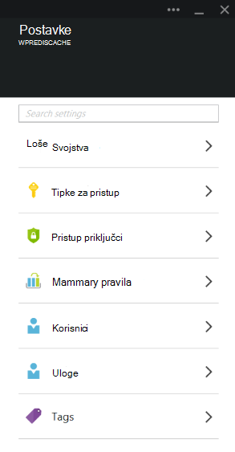

### <a name="add-redishost-app-setting"></a>Dodavanje postavka app REDIS_HOST

Prvi postavka aplikacija potrebnih za stvaranje na **REDIS\_glavno računalo** postavke aplikacije. Ta postavka postavlja odredište na koji se pretvornik API-ja prosljeđuje predmemorije informacije. Vrijednost potrebne za postavku REDIS_HOST aplikacije mogu biti dohvaćeni iz plohu **Svojstva** instance Redis predmemoriju.

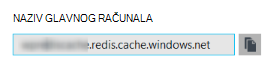

Postavljanje ključa postavku aplikacije **REDIS\_glavno računalo** i vrijednost postavku aplikacije **naziv glavnog računala** Redis predmemorije instance.

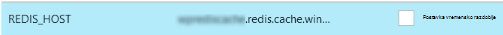

### <a name="add-rediskey-app-setting"></a>Dodavanje postavka app REDIS_KEY

Drugi postavka aplikacija potrebnih za stvaranje na **REDIS\_KLJUČ** postavke aplikacije. Ta postavka omogućuje token za provjeru autentičnosti potrebna za sigurno pristup instancu Redis predmemoriju. Možete dohvatiti potrebne za postavku aplikacije REDIS_KEY iz plohu **pristupnih tipki** instance Redis predmemorije vrijednost.

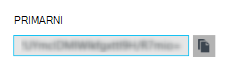

Postavljanje ključa postavku aplikacije **REDIS\_KLJUČ** i vrijednost postavka app **Primarni ključ** Redis predmemorije instance.

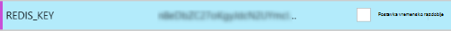

### <a name="add-memcacheshimredisenable-app-setting"></a>Dodavanje postavka app MEMCACHESHIM_REDIS_ENABLE

Zadnji postavka app koristi se za omogućivanje na pretvornik API-ja Memcache u web-aplikacijama, koji koristi REDIS_HOST i REDIS_KEY za povezivanje s predmemoriju Redis Azure i prosljeđivanje predmemoriju pozive. Postavljanje ključa postavku aplikacije **MEMCACHESHIM\_REDIS\_OMOGUĆITI** i vrijednost **True**.

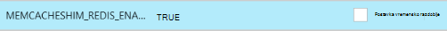

Kada završite s dodavanjem postavki tri (3) aplikacije kliknite **Spremi**.

## <a name="enable-memcache-extension-for-php"></a>Omogući Memcache proširenja za PHP

U redoslijedu za aplikaciju govoriti protokol Memcache je potrebno instalirati proširenje Memcache i – framework jezik WordPress web-mjesta.

### <a name="download-the-phpmemcache-extension"></a>Preuzmite php_memcache proširenja

Pronađite [PECL][6]. U kategoriji predmemoriranja kliknite [memcache][7]. U odjeljku stupac preuzimanja kliknite vezu DLL.

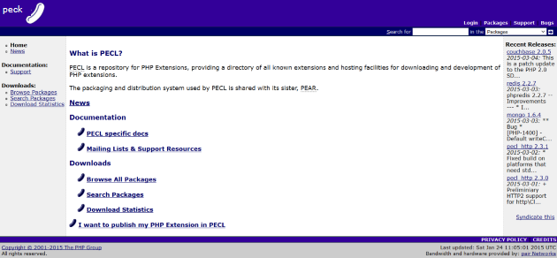

Osobe koje nisu niti sigurni (Jedinici) x86 veza za verziju i omogućen u web-aplikacijama za preuzimanje. (Zadana vrijednost je 5.4 i)

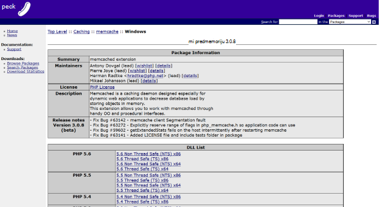

### <a name="enable-the-phpmemcache-extension"></a>Omogući php_memcache proširenja

Nakon preuzimanja datoteka raspakiraj i prenesite na **php\_memcache.dll** u na **d:\\kućni\\web-mjesta\\wwwroot\\smeće\\ŠIR\\ ** direktorija. Nakon prijenosa na php_memcache.dll u web-aplikaciji ćete morati omogućiti proširenja za vrijeme izvođenja i. Da biste omogućili proširenje Memcache na portalu za Azure, otvorite plohu **Postavke za aplikaciju** za web-aplikacije, a zatim dodavanje novih postavki aplikacije pomoću ključa od **i\_EXTENSIONS** i vrijednost **smeće\\ŠIR\\php_memcache.dll**.


> [AZURE.NOTE] Ako web-aplikaciji treba učitavanje više i extensions, vrijednost PHP_EXTENSIONS mora biti popis razgraničen zarezima relativni putovi do DLL datoteke.

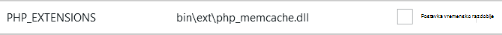

Kada završite, kliknite **Spremi**.

## <a name="install-memcache-wordpress-plugin"></a>Instalirajte dodatak za Memcache WordPress

> [AZURE.NOTE] [Dodatak za predmemorije objekta Memcached](https://wordpress.org/plugins/memcached/) možete preuzeti i iz WordPress.org.

Na stranici WordPress dodaci, kliknite **Dodaj novi**.

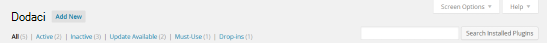

U okvir za pretraživanje upišite **memcached** i pritisnite **Enter**.

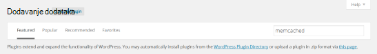

Na popisu pronađite **Memcached predmemorije objekta** , a zatim kliknite **Instaliraj sada**.

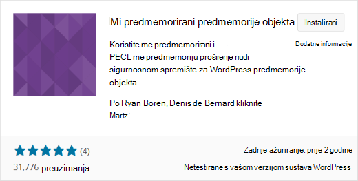

### <a name="enable-the-memcache-wordpress-plugin"></a>Omogućite dodatak za Memcache WordPress

>[AZURE.NOTE] Slijedite upute u ovom blogu o [omogućivanju nastavkom web-mjesta u web-aplikacijama] [ 8] da biste instalirali Visual Studio Team Services.

U na `wp-config.php` datoteka, dodajte sljedeći kôd iznad Prekid uređivanja komentar pri kraju datoteku.

```php
$memcached_servers = array(
    'default' => array('localhost:' . getenv("MEMCACHESHIM_PORT"))
);
```

Kada je je zalijepili kod, Monako će automatski spremiti dokument.

Sljedeći je korak da biste omogućili dodatak predmemorije objekta. To možete učiniti povlačenjem i ispuštanjem **objekt cache.php** iz **wp-sadržaj/dodaci/memcached** mape u mapu **wp sadržaja** da biste omogućili funkcije Memcache predmemorije objekta.

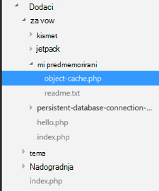

Sad kad se **objekt cache.php** datoteka se nalazi u mapi **wp sadržaj** , predmemorije objekta Memcached je onemogućen.

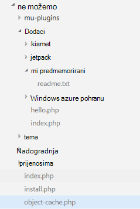

## <a name="verify-the-memcache-object-cache-plugin-is-functioning"></a>Provjerite je li radi dodatak Memcache predmemorije objekta

Sve korake da biste omogućili pretvornik API-ja za Web Apps Memcache dovršite sada. S lijeve strane samo stvar je da biste potvrdili da podatke puniti vašoj Redis predmemorije instanci.

### <a name="enable-the-non-ssl-port-support-in-azure-redis-cache"></a>Omogućite podršku za priključak koji nisu SSL u predmemoriji Redis Azure

>[AZURE.NOTE] Vrijeme pisanja u ovom se članku EŽA Redis ne podržava povezivanje SSL, stoga je potrebno sljedeće korake.

Na portalu za Azure pronađite Redis predmemorije instancu koju ste stvorili za ovo web-aplikacije. Kada u predmemoriji plohu otvoren, kliknite ikonu **Postavke** .

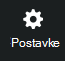

S popisa odaberite **Priključke za Access** .

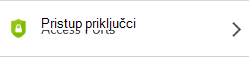

Kliknite **ne** za **Dopusti pristup samo putem SSL**.

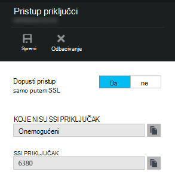

Prikazat će se korisnici koji nisu SSL priključak sada je definiran. Kliknite **Spremi**.

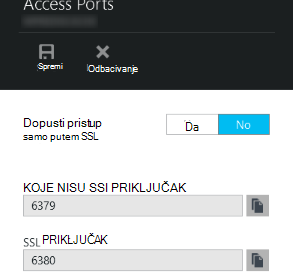

### <a name="connect-to-azure-redis-cache-from-redis-cli"></a>Povezivanje s predmemorije Redis Azure redis eža

>[AZURE.NOTE] Ovaj korak pretpostavlja taj redis lokalno je instaliran na vašem računalu razvoj. [Instalacija Redis lokalno pomoću ove upute][9].

Otvorite svoje naredbenog retka konzole za odabir i upišite sljedeću naredbu:

```shell
redis-cli –h <hostname-for-redis-cache> –a <primary-key-for-redis-cache> –p 6379
```

Zamjena na ** &lt;naziv glavnog računala-za-redis cache&gt; ** s xxxxx.redis.cache.windows.net stvarni naziv glavnog računala i ** &lt;primarni-ključ-za-redis-cache&gt; ** pomoću tipkovnog predmemoriju, zatim pritisnite tipku **Enter**. Kada u EŽA je povezano s instancu Redis predmemorije, problema bilo kojoj naredbi redis. U nastavku snimka koje ste odabrali na popisu tipki.

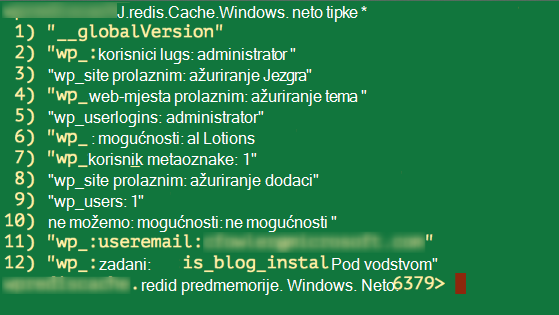

Poziv na popisu tipki treba vraćaju vrijednost. Ako nije, pokušajte navigaciju web-aplikacije i ponovnog pokušaja.

## <a name="conclusion"></a>Zaključak

Čestitamo! Aplikacija WordPress sada sadrži središnje predmemorije u memoriji da biste olakšali uzlaznim propusnost. Imajte na umu na Web Apps Memcache pretvornik API-ja može se koristiti s bilo kojeg klijenta Memcache neovisno o programskom jeziku ili framework aplikacije. Slanje povratnih informacija ili postavljanje pitanja o na Web Apps Memcache pretvornik API-ja, poštanski forume [MSDN] [ 10] ili [Stackoverflow][11].

>[AZURE.NOTE] Ako želite započeti s aplikacije servisa za Azure prije registracije za račun za Azure, idite na [Pokušajte aplikacije servisa](http://go.microsoft.com/fwlink/?LinkId=523751), gdje možete odmah stvoriti web-aplikacijama short-lived starter u aplikacije servisa. Nema kreditne kartice potrebna; Nema preuzete obveze.

## <a name="whats-changed"></a>Što se promijenilo
* Vodič za promjenu iz aplikacije servisa za web-mjestima potražite u članku: [aplikacije servisa za Azure i njegov utjecaj na postojećim Azure servisima](http://go.microsoft.com/fwlink/?LinkId=529714)


[0]: ../redis-cache/cache-dotnet-how-to-use-azure-redis-cache.md#create-a-cache
[1]: http://bit.ly/1t0KxBQ
[2]: http://manage.windowsazure.com
[3]: http://portal.azure.com
[4]: ../powershell-install-configure.md
[5]: /downloads
[6]: http://pecl.php.net
[7]: http://pecl.php.net/package/memcache
[8]: http://blog.syntaxc4.net/post/2015/02/05/how-to-enable-a-site-extension-in-azure-websites.aspx
[9]: http://redis.io/download#installation
[10]: https://social.msdn.microsoft.com/Forums/home?forum=windowsazurewebsitespreview
[11]: http://stackoverflow.com/questions/tagged/azure-web-sites
[12]: /services/cache/
[13]: http://memcached.org
