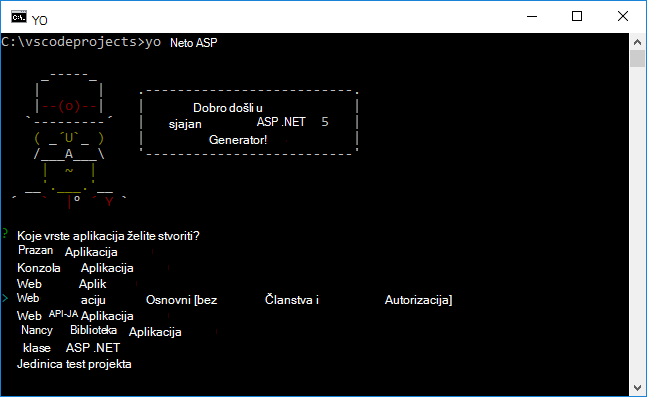

<properties
   pageTitle="Stvaranje web-aplikacije programa ASP.NET 5 u Visual Studio kod"
   description="Pomoću ovog praktičnog vodiča prikazuje kako stvoriti ASP.NET 5 web-aplikaciju programa pomoću koda za Visual Studio."
   services="app-service\web"
   documentationCenter=".net"
   authors="erikre"
   manager="wpickett"
   editor="jimbe"/>

<tags
    ms.service="app-service-web" 
    ms.workload="web" 
    ms.tgt_pltfrm="dotnet" 
    ms.devlang="na" 
    ms.topic="article" 
    ms.date="02/26/2016" 
    ms.author="cephalin"/>

# Stvaranje web-aplikacije programa ASP.NET 5 u Visual Studio kod

## Pregled

Pomoću ovog praktičnog vodiča prikazuje kako stvoriti ASP.NET 5 web-aplikaciju programa pomoću [Visual Studio šifru (šifru za dodavanje veze za VANJSKIH)](http://code.visualstudio.com//Docs/whyvscode) i implementacija [Aplikacije servisa za Azure](../app-service/app-service-value-prop-what-is.md). 

> [AZURE.NOTE] Iako u ovom se članku upućuje na web-aplikacije, ograničenje se primjenjuje API aplikacije i mobilne aplikacije. 

ASP.NET 5 je značajan promijeni dizajn programa ASP.NET. ASP.NET 5 je novi okvir Otvori izvor i različite platforme za izgradnju Moderna oblaku web apps pomoću .NET. Dodatne informacije potražite u članku [Uvod u ASP.NET 5](http://docs.asp.net/en/latest/conceptual-overview/aspnet.html). Informacije o aplikacije servisa za Azure web-aplikacije potražite u članku [Pregled Web Apps](app-service-web-overview.md).

[AZURE.INCLUDE [app-service-web-try-app-service.md](../../includes/app-service-web-try-app-service.md)]

## Preduvjeti  

* Instalirajte [Dodavanje veze za VANJSKIH kod](http://code.visualstudio.com/Docs/setup).
* Instalacija [Node.js](http://nodejs.org) - Node.js je za stvaranje aplikacija brz i skalabilni poslužitelja pomoću JavaScript. Čvor runtime (čvora), a [npm](http://www.npmjs.com/) Upravitelj paketa za čvor module. Npm će se koristiti za scaffold web-aplikaciju programa ASP.NET 5 ovog praktičnog vodiča.
* Instalacija brojka – možete ga instalirati s bilo kojeg od tih mjesta: [Chocolatey](https://chocolatey.org/packages/git) i [brojka scm.com](http://git-scm.com/downloads). Ako ste novi korisnik brojka, odaberite [brojka scm.com](http://git-scm.com/downloads) , a zatim mogućnost za **Korištenje brojka iz Windows naredbeni redak**. Kada instalirate brojka, i morat ćete postaviti brojka korisničko ime i e-pošte kao što je potrebno kasnije u ovom praktičnom vodiču (prilikom izvršavanja u potvrdi iz koda za dodavanje veze za VANJSKIH).  

## Instaliranje platforme ASP.NET 5 i DNX
ASP.NET 5/DNX (izvođenja okruženja .NET) je lean snop .NET za izgradnju Moderna oblaka i web-aplikacije koji se izvode na OS X, Linux i Windows. Li sadrži je utemeljena na nudi je optimizirana razvoj framework za aplikacije koje su implementiran u oblak ili pokrenuti lokalnog. Sastoji se od modularan komponenti s minimalnim pomoćni proces, kako zadržati fleksibilnost pri izgradnje vašeg rješenja.

Pomoću ovog praktičnog vodiča osmišljena je za početak rada u stvaranje aplikacija s najnovijim verzijama razvoj ASP.NET 5 i DNX. Sljedeće upute su specifične za Windows. Detaljnije upute za instalaciju za OS X, Linux i Windows, potražite u članku [Instaliranje platforme ASP.NET 5 i DNX](https://code.visualstudio.com/Docs/ASPnet5#_installing-aspnet-5-and-dnx). 

1. Da biste instalirali .NET verziju Manager (DNVM) u sustavu Windows, otvorite naredbeni redak, a zatim pokrenite sljedeću naredbu.

        @powershell -NoProfile -ExecutionPolicy unrestricted -Command "&{$Branch='dev';iex ((new-object net.webclient).DownloadString('https://raw.githubusercontent.com/aspnet/Home/dev/dnvminstall.ps1'))}"

    To će preuzimanje DNVM skripte i spremite ga u imeniku korisničkog profila. 

2. **Pokrenite Windows** da biste dovršili instalaciju DNVM. 

    Nakon ponovnog pokretanja sustava Windows, možete otvoriti naredbenog retka da biste provjerili lokaciju DNVM tako da unesete sljedeće:

        where dnvm

    U naredbeni redak prikazivat će se puta otprilike ovako.

    

3. Sad kad ste DNVM, morate koristiti da biste preuzeli DNX za pokretanje aplikacije. U naredbenom retku pokrenite na sljedeći način:

        dnvm upgrade

    Provjerite je li vaša DNVM i prikaz aktivan prilikom izvođenja tako da unesete na sljedeći naredbeni redak:

        dnvm list

    Naredbenog retka prikazat će pojedinosti aktivni runtime.

    

    Ako je naveden više DNX runtime, možete unijeti sljedeće (ili novija verzija) u naredbenom retku da biste postavili aktivni DNX runtime. Postavite na istu verziju koju koristi generator ASP.NET 5 prilikom stvaranja web-aplikaciju programa u nastavku ovog praktičnog vodiča. *Možda ne morate promijeniti aktivni runtime ako je postavljen na najnovije dostupne.*

        dnvm use 1.0.0-update1 –p

> [AZURE.NOTE] Detaljnije upute za instalaciju za OS X, Linux i Windows, potražite u članku [Instaliranje platforme ASP.NET 5 i DNX](https://code.visualstudio.com/Docs/ASPnet5#_installing-aspnet-5-and-dnx). 

## Stvaranje web-aplikaciji 

U ovom se odjeljku objašnjava scaffold web-aplikacijama ASP.NET nove aplikacije. Koristite Upravitelj paketa čvor (npm) da biste instalirali [Yeoman](http://yeoman.io/) (aplikaciju scaffolding alat - Dodavanje veze za VANJSKIH kod ekvivalent Visual Studio **datoteke > novi projekt** operacija), [Grunt](http://gruntjs.com/) (JavaScript zadatka runner) i [Bower](http://bower.io/) (Upravitelj paketa strani klijenta). 

1. Otvorite naredbeni redak s administratorskim pravima i prijeđite na mjesto gdje želite stvoriti ASP.NET projekta. Na primjer, stvorite direktorij *vscodeprojects* korijenu C:\.

2. Unesite sljedeće naredbeni redak za instalaciju Yeoman i alata za podršku.

        npm install -g yo grunt-cli generator-aspnet bower

    > [AZURE.NOTE] Možda ćete dobiti upozorenje koja predstavlja je li vaša verzija npm istekao rok. Ovo će se upozorenje ne bi trebali utjecati ovog praktičnog vodiča.

3. Unesite sljedeće u naredbenom retku da biste stvorili mapu projekta i scaffold aplikaciju.

        yo aspnet

4. Pomoću tipki sa strelicama da biste odabrali vrstu **Web aplikacije osnovni** s izbornika generator ASP.NET 5 i pritisnite ** &lt;Enter >**.

    

5. Postavite naziv novog web-aplikacije ASP.NET **SampleWebApp**. Kao što je ovaj naziv je koristiti u cijeloj vodič, ako odaberete neki drugi naziv, morat ćete zamjenu za svako pojavljivanje **SampleWebApp**. Kada pritisnete ** &lt;Enter >**, Yeoman će stvoriti novu mapu pod nazivom **SampleWebApp** i potrebne datoteke za nove aplikacije.

6. U naredbeni redak promijenite direktorija u novu mapu projekta:

        cd SampleWebApp

7. Također naredbeni redak da biste instalirali potrebne paketa NuGet li pokrenuti aplikaciju, unesite sljedeću naredbu:

        dnu restore

8. Otvorite Dodavanje veze za VANJSKIH kod tako da unesete na sljedeći naredbeni redak:

        code .

## Izvodi lokalno web-aplikaciji

Sad kad ste stvorili web-aplikacije i dohvaća sve pakete NuGet za aplikaciju, web-aplikaciju možete pokrenuti lokalno.

1. Iz **Palete naredbe** u kodu za dodavanje veze za VANJSKIH, unesite sljedeće da biste prikazali mogućnosti dostupna naredba Pokreni:

        dnx: Run Command

    > [AZURE.NOTE] Ako poslužitelj Omnisharp trenutno nije pokrenut, počet će prema gore. Ponovno unesite gornju naredbu.

    Zatim odaberite sljedeću naredbu da biste pokrenuli web app:
        
        dnx web - (SampleWebApp)

    Prozor naredba prikazat će je počeo aplikacije. Ako je naredba prozora ne prikaže ta poruka, potvrdite okvir u donjem lijevom corning koda za dodavanje veze za VANJSKIH pogrešaka u projektu.
    
    > [AZURE.NOTE]Izdavanje naredbe iz **Palete naredba** zahtijeva na **>** znak na početku naredbenog retka. Možete pogledati detalje koji se odnose na naredbu **web** u datoteci *project.json* .   
    > Ako je naredba ne pojavi ili nije dostupan, možda morate instalirati proširenje C#. Pokrenite `>Extensions: Install Extension` i `ext install c#` da biste instalirali extensions C#.

2. Otvorite preglednik i idite na sljedeći URL.

    **http://localhost:5000**

    Zadane stranice web-aplikacije pojavit će se na sljedeći način.

    

3. Zatvorite preglednik. U **Prozoru za naredbe**, pritisnite **Ctrl + C** da biste isključili aplikacije i zatvorili **Prozor naredbe**. 

## Stvaranje web-aplikacijama na portalu za Azure

Sljedeći koraci vodit će vas voditi kroz stvaranje web-aplikacijama na portalu za Azure.

1. Prijavite se na [Portal za Azure](https://portal.azure.com).

2. Kliknite **NOVO** u gornjem lijevom kutu portalu.

3. Kliknite **web-aplikacije > web-aplikacije**.

    

4. Unesite vrijednost za **naziv**, primjerice **SampleWebAppDemo**. Imajte na umu da se taj naziv mora biti jedinstven i portalu provodi koji kada pokušate unesite naziv. Dakle, ako odaberete unesite drugu vrijednost, morate zamijeniti tu vrijednost za svako pojavljivanje **SampleWebAppDemo** koja se prikazuju u ovom ćete praktičnom vodiču. 

5. Odaberite na postojeći **Plan za aplikaciju servisa** ili stvorite novi. Ako stvorite novu tarifu, odaberite cijene sloju, mjesto i druge mogućnosti. Dodatne informacije o aplikacije servisa za tarife potražite u članku u članku [aplikacije servisa za Azure tarife detaljnije pregled](../app-service/azure-web-sites-web-hosting-plans-in-depth-overview.md).

    

6. Kliknite **Stvori**.

    

## Omogućite objavljivanje brojka za nova web-aplikacije

Brojka je sustav raspodijeljeno verzije kontrole koje možete koristiti za implementaciju web-aplikaciju programa aplikacije servisa za Azure. Ćete spremiti kod u pišete za web-aplikacije u lokalnom spremištu brojka, a kod će uvesti Azure pritiskom na udaljenom spremište.   

1. Prijava na [Portal za Azure](https://portal.azure.com).

2. Kliknite **Pregledaj**.

3. Kliknite **Web-aplikacije** da biste vidjeli popis web-aplikacije povezanog s pretplatom na Azure.

4. Odaberite web-aplikaciju koju ste stvorili pomoću ovog praktičnog vodiča.

5. U aplikaciji plohu web kliknite **Postavke** > **Neprekinuti implementacije**. 

    

6. Kliknite **Odabir izvora > lokalnom spremištu brojka**.

7. Kliknite **u redu**.

    

8. Ako već niste postavili implementacije vjerodajnice za objavljivanje web-aplikacijama ili drugim aplikacije servisa za aplikaciju, postaviti ih sada:

    * Kliknite **Postavke** > **implementacije vjerodajnice**. **Postavljanje vjerodajnica za implementaciju** plohu će se prikazati.

    * Stvorite korisničko ime i lozinku.  Morat ćete ovu lozinku kasnije prilikom postavljanja brojka.

    * Kliknite **Spremi**.

9. U plohu web app, kliknite **Postavke > Svojstva**. U odjeljku **BROJKA URL**prikazan je URL udaljene brojka spremište koje ćete implementacije.

10. U ovom praktičnom vodiču, kopirajte **URL BROJKA** vrijednost za kasnije korištenje.

    

## Objavljivanje web-aplikaciju programa aplikacije servisa za Azure

U ovom ćete odjeljku će stvoriti lokalnom spremištu brojka i automatske te spremištu Azure za implementaciju web-aplikaciju programa za Azure.

1. Dodavanje veze za VANJSKIH kod, odaberite mogućnost **brojka** na lijevoj navigacijskoj traci.

    

2. Odaberite da biste bili sigurni da je radni prostor u odjeljku Upravljanje izvornim brojka **Inicijalizacija brojka spremište** . 

    

3. Otvorite prozor naredbenog i promijenite direktorija u imeniku web-aplikacije. Nakon toga unesite sljedeću naredbu:

        git config core.autocrlf false

    Ta se naredba sprječava problem o tekstu gdje uključeni završetaka riječ o CRLF i LF završetaka.

4. Dodavanje veze za VANJSKIH kod, unesite poruku potvrdi, a zatim kliknite ikonu **Potvrdi sve** potvrdne.

    

5. Dovršetku brojka obrada, vidjet ćete da nema datoteka naveden u prozoru brojka u odjeljku **promjene**. 

    

6. Promijenite naredbeni prozor gdje naredbenog retka pokazuje imeniku gdje se nalazi web-aplikaciju programa.

7. Stvaranje reference udaljene za margina ažuriranja na web-aplikaciju pomoću brojka URL-a (završni u ".git") koju ste ranije kopirali.

        git remote add azure [URL for remote repository]

8. Konfiguriranje brojka lokalno spremanje vjerodajnica tako da se oni će se automatski dodaju se naredbe automatske generirao Dodavanje veze za VANJSKIH kod.

        git config credential.helper store

9. Automatske promjene za Azure tako da upišete sljedeću naredbu. Kad ovaj početnog Gurni Azure će se moći učiniti sve naredbe automatske Dodavanje veze za VANJSKIH kod. 

        git push -u azure master

    Zatraži lozinku koju ste stvorili ranije u Azure. **Napomena: Lozinku neće biti vidljive.**

    Izlaz iz gornju naredbu završava s poruku da je uspješno uvođenje.

        remote: Deployment successful.
        To https://user@testsite.scm.azurewebsites.net/testsite.git
        [new branch]      master -> master

> [AZURE.NOTE] Ako promijenite aplikacije, možete ponovno objaviti izravno u kodu za dodavanje veze za VANJSKIH pomoću ugrađene funkcije brojka tako da odaberete mogućnost **Zapiši sve** slijedi mogućnost **automatske** . Tražit će **automatske** mogućnost dostupna u padajućeg izbornika pokraj gumbe **Provođenja svih** i **Osvježavanje** .

Ako vam je potrebna Suradnja na projektu, razmislite o margina za GitHub između margina Azure.

## Pokretanje aplikacije u Azure
Sad kad ste implementiran web-aplikaciju programa, recimo pokrenite aplikaciju dok smješten u Azure. 

To možete učiniti na dva načina:

* Otvorite preglednik i unesite naziv web-aplikacije na sljedeći način.   

        http://SampleWebAppDemo.azurewebsites.net
 
* Na portalu za Azure pronađite plohu aplikacije na webu za web-aplikacije, a zatim kliknite **Pregledaj** da biste pogledali aplikacije 
* u zadanom pregledniku.

## Sažetak
U ovom ćete praktičnom vodiču naučili kako stvoriti web-aplikacijama u kodu za dodavanje veze za VANJSKIH i implementacija Azure. Dodatne informacije o Dodavanje veze za VANJSKIH kod potražite u članku [Zašto Visual Studio kod?](https://code.visualstudio.com/Docs/) Informacije o aplikacije servisa za web-aplikacije potražite u članku [Pregled Web Apps](app-service-web-overview.md). 
