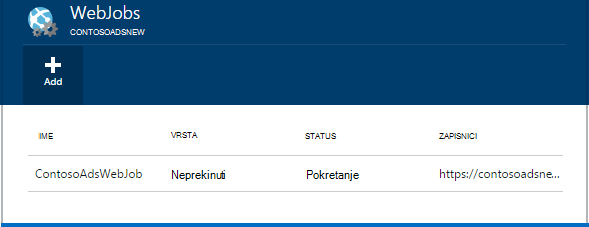
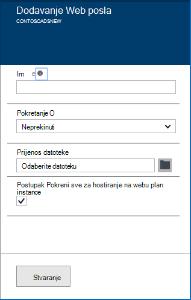
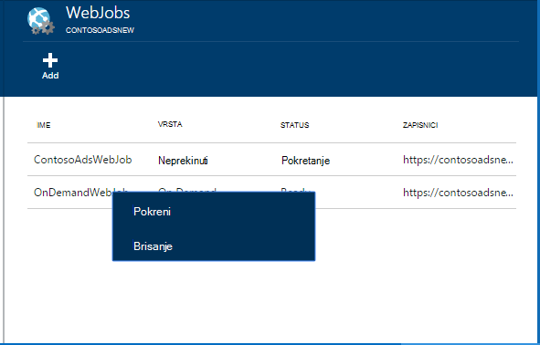
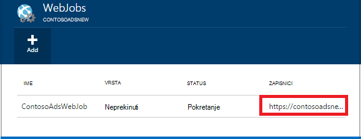

<properties 
    pageTitle="Pokrenite pozadinske zadatke s WebJobs" 
    description="Saznajte kako izvoditi pozadinske zadatke u Azure web-aplikacijama." 
    services="app-service" 
    documentationCenter="" 
    authors="tdykstra" 
    manager="wpickett" 
    editor="jimbe"/>

<tags 
    ms.service="app-service" 
    ms.workload="na" 
    ms.tgt_pltfrm="na" 
    ms.devlang="na" 
    ms.topic="article" 
    ms.date="04/27/2016" 
    ms.author="tdykstra"/>

# <a name="run-background-tasks-with-webjobs"></a>Pokrenite pozadinske zadatke s WebJobs

## <a name="overview"></a>Pregled

Možete pokrenuti programe ili skripte u WebJobs u web-aplikaciju programa [Aplikacije servisa](http://go.microsoft.com/fwlink/?LinkId=529714) na tri načina: na zahtjev, pokretom, ili raspored. Postoji bez dodatnih troškova da biste koristili WebJobs.

U ovom se članku prikazuje kako implementirati WebJobs pomoću [Portala za Azure](https://portal.azure.com). Informacije o kako implementirati pomoću Visual Studio ili isporuke neprekidnog procesa, potražite [u](websites-dotnet-deploy-webjobs.md)članku implementacija Azure WebJobs na web-aplikacije.

Azure WebJobs SDK olakšava mnoge WebJobs programiranje zadatke. Dodatne informacije potražite u članku [što je WebJobs SDK](websites-dotnet-webjobs-sdk.md).

 Azure funkcije (trenutno u pretpregledu) je drugi način za pokretanje programa i skripti u aplikacije servisa za Azure. Dodatne informacije potražite u članku [Pregled Azure funkcija](../azure-functions/functions-overview.md).

[AZURE.INCLUDE [app-service-web-to-api-and-mobile](../../includes/app-service-web-to-api-and-mobile.md)] 

## <a name="acceptablefiles"></a>Vrsta prihvatljiva datoteka za skripte ili programa

Prihvaćaju se sljedeće vrste datoteka:

* .cmd, .bat, .exe (pomoću naredbe za windows)
* .ps1 (pomoću komponente powershell)
* .SH (pomoću tulumu)
* .php (pomoću i)
* .PY (pomoću python)
* .js (pomoću čvora)
* .jar (pomoću java)

## <a name="CreateOnDemand"></a>Stvaranje na zahtjev WebJob na portalu

1. U **Web-aplikacije** plohu [Azure Portal](https://portal.azure.com), kliknite **sve postavke > WebJobs** da bi se prikazala plohu **WebJobs** .
    
    
    
5. Kliknite **Dodaj**. Pojavit će se dijaloški okvir **Dodavanje WebJob** .
    
    
    
2. U odjeljku **naziv**Navedite naziv u WebJob. Naziv morate pokrenuti slovom ili broja i ne smije sadržavati posebne znakove osim "-" i "_".
    
4. U okviru **način pokretanja** odaberite **Pokreni na zahtjev**.
    
3. U okvir za **Prijenos datoteka** kliknite ikonu mape, a zatim pronađite zip datoteku koja sadrži skriptu. Zip datoteke mora sadržavati izvršne datoteke (.exe .cmd .bat .sh .php .py .js) te pomoćne datoteke potrebne za pokretanje programa ni skriptu.
    
5. Potvrdite okvir **Stvori** da biste prenijeli skripte na web-aplikaciju. 
    
    Na popisu plohu **WebJobs** pojavit će se ime koje ste naveli za na WebJob.
    
6. Da biste pokrenuli u WebJob, desnom tipkom miša kliknite njezin naziv na popisu, a zatim kliknite **Pokreni**.
    
    
    
## <a name="CreateContinuous"></a>Stvaranje neprestano izvodi WebJob

1. Da biste stvorili neprekidno izvršni WebJob, poduzmite iste korake za stvaranje WebJob da se pokreće jedanput, ali u okvir **upute za izvođenje** odaberite **Neprekinuto**.

2. Da biste pokrenuli ili zaustavili neprekinuti WebJob, desnom tipkom miša kliknite WebJob na popisu, a zatim kliknite **pokretanje** ili **prekidanje**.
    
> [AZURE.NOTE] Ako web-aplikaciju programa izvodi na više instanci, neprestano izvodi WebJob će se izvoditi na sve svoje instanci. Na zahtjev i zakazani WebJobs se izvoditi na instancu za tako da Microsoft Azure za ujednačavanje opterećenja potvrđen.
    
> Neprekinuti WebJobs da biste pokrenuli pouzdano i na svim instancama omogućiti na uvijek na * postavke konfiguracije za web-aplikaciju u suprotnom možete prekinuti kada IO glavno računalo web-mjesta neaktivno predugo.

## <a name="CreateScheduledCRON"></a>Stvaranje zakazani WebJob pomoću CRON izraza

Ovaj postupak je dostupan na web-aplikacije koje su u načinu rada Basic, standardni prikaz ili Premium i zahtijeva **Uvijek na** postavku biti omogućena na aplikaciju.

Da biste pretvorili u na zahtjev WebJob u zakazano WebJob, jednostavno uključiti u `settings.job` datoteku u korijenu WebJob zip datoteku. Trebali biste uključiti JSON datoteku na `schedule` svojstvo na [CRON izraz](https://en.wikipedia.org/wiki/Cron), po primjeru u nastavku.

Izraz CRON sastoji se od 6 polja: `{second} {minute} {hour} {day} {month} {day of the week}`.

Na primjer, za pokretanje sustava WebJob svakih 15 minuta na `settings.job` promijenile:

```json
{
    "schedule": "0 */15 * * * *"
}
``` 

Još primjera CRON rasporeda:

- Svaki sat (odnosno kad god je broj minuta, 0):`0 0 * * * *` 
- Svaki sat od 9 AM za 5 Poslijepodne:`0 0 9-17 * * *` 
- Pri 9:30 se svakodnevno:`0 30 9 * * *`
- Pri 9:30 se svaki dan u tjednu:`0 30 9 * * 1-5`

**Napomena**: kada implementirate WebJob iz Visual Studio, provjerite je li da biste označili vaše `settings.job` svojstva datoteke kao 'Kopiju ako novija'.


## <a name="CreateScheduled"></a>Stvaranje zakazani WebJob koristiti Planer Azure

Sljedeći postupak zamjenski omogućuje korištenje Azure raspored. U ovom slučaju vaše WebJob ne sadrži sve Izravni znanja rasporeda. Umjesto toga, raspored Azure dobiva konfigurirano tako da pokretanje vaše WebJob prema rasporedu. 

Portal za Azure još nema mogućnost da biste stvorili zakazani WebJob, ali do koje značajka dodaje to možete učiniti pomoću [klasične portal](http://manage.windowsazure.com).

1. [Klasični portal](http://manage.windowsazure.com) idite na stranicu WebJob, a zatim kliknite **Dodaj**.

1. U okviru **način pokretanja** odaberite **Pokreni prema rasporedu**.
    
    ![Novi zakazani zadatak][NewScheduledJob]
    
2. Odaberite **Raspored područja** za svoj posao, a zatim strelicu u donjem desnom kutu dijaloški okvir da biste prešli na sljedećem zaslonu.

3. U dijaloškom okviru **Stvaranje posla** , odaberite vrstu željenog **ponavljanja** : **jednokratni zadatak** ili **Ponavljanje zadatka**.
    
    ![Ponavljanje rasporeda][SchdRecurrence]
    
4. I odaberite vrijeme **početka** : **sada** ili **u određeno vrijeme**.
    
    ![Zakazivanje vremena početka][SchdStart]
    
5. Ako želite pokrenuti u određenom trenutku, odaberite početni vremenske vrijednosti u odjeljku **Pokretanje na**.
    
    ![Raspored početak u određenom trenutku][SchdStartOn]
    
6. Ako ste odabrali ponavljajući zadatak, morate na **ponavljajućim svaku** mogućnost da biste naveli učestalost pojavljivanja i mogućnosti **Koje završavaju na** da biste odredili završno vrijeme.
    
    ![Ponavljanje rasporeda][SchdRecurEvery]
    
7. Ako odaberete **tjedna**, potvrdite okvir **Na na određeni raspored** , a određivanje dana u tjednu koji želite da izvođenje zadatka.
    
    ![Raspored dane u tjednu][SchdWeeksOnParticular]
    
8. Ako odaberete **mjeseca** i potvrdite okvir **Na na određeni raspored** , možete postaviti posao da biste pokrenuli na određeni numerirani **dana** u mjesecu. 
    
    ![Zakazivanje određenog datuma u mjesecu][SchdMonthsOnPartDays]
    
9. Ako odaberete **Tjedan dana**, možete odabrati koji dan ili dane u tjednu u mjesecu želite da se izvoditi na posao.
    
    ![Zakazivanje određeni tjedan dana u mjesecu][SchdMonthsOnPartWeekDays]
    
10. Na kraju, vam može poslužiti mogućnost **pojavljivanja** da biste odabrali koje dan u mjesecu (najprije drugoj treći itd.) želite posao pokrenuti tjedan dana koje ste naveli.
    
    ![Zakazivanje određeni tjedan dana na određeni tjedana u mjesecu][SchdMonthsOnPartWeekDaysOccurences]
    
11. Kada stvorite jedan ili više zadataka, njihova imena pojavit će se na kartici WebJobs s njihovo stanje, vrsta raspored i druge informacije. Povijesne informacije o zadnje 30 WebJobs se održava.
    
    ![Popis zadataka][WebJobsListWithSeveralJobs]
    
### <a name="Scheduler"></a>Zakazani zadaci i Azure planer

Zakazani zadaci možete dodatno konfiguriran u Azure rasporeda stranica [Klasični portal](http://manage.windowsazure.com).

1.  Na stranici WebJobs kliknuti posla **raspored** da biste došli do stranici portala za Azure raspored. 
    
    ![Veza na Azure rasporeda][LinkToScheduler]
    
2. Na stranici raspored, kliknite posao.
    
    ![Zadatak na stranici portala za raspored][SchedulerPortal]
    
3. Otvorit će se stranica za **posao akcije** na kojoj možete konfigurirati dodatne posao. 
    
    ![PageInScheduler akcija posla][JobActionPageInScheduler]
    
## <a name="ViewJobHistory"></a>Pregledavanje povijesti zadatka

1. Da biste prikazali povijest izvođenja posla, uključujući poslove koje su stvorene pomoću WebJobs SDK kliknite njegov odgovarajuću vezu u stupcu **zapisnika** plohu WebJobs. (Koristite ikonu međuspremnik da biste kopirali URL stranice datoteka zapisnika u međuspremnik ako želite da se.)
    
    
        
2. Klikom na vezu će otvoriti stranicu s detaljima za na WebJob. Ova stranica prikazuje naziv naredbu Pokreni posljednji puta pokrenuli, a uspjelo ili nije. U odjeljku **Nedavne posao pokreće**, kliknite vrijeme da biste vidjeli dodatne detalje.
    
    ![WebJobDetails][WebJobDetails]
    
3. Pojavljuje se stranica **Pojedinosti pokrenuti WebJob** . Kliknite **Uključivanje i isključivanje izlaz** da biste vidjeli tekstni sadržaj zapisnika. Izlazni zapisnik je u tekstnom obliku. 
    
    ![Izvođenja pojedinosti zadatka web][WebJobRunDetails]
    
4. Da biste vidjeli izlaznom tekstu u zasebnom prozoru preglednika, kliknite vezu za **Preuzimanje** . Da biste preuzeli sam tekst, desnom tipkom miša kliknite vezu, a zatim pomoću mogućnosti preglednika možete spremiti sadržaj datoteke.
    
    ![Preuzimanje zapisnika Izlaz][DownloadLogOutput]
    
5. Vezu **WebJobs** pri vrhu stranice omogućuje praktično da biste dobili popis WebJobs na nadzornoj ploči za povijest.
    
    ![Povezivanje s popisom WebJobs][WebJobsLinkToDashboardList]
    
    ![Popis WebJobs povijest nadzornoj ploči][WebJobsListInJobsDashboard]
    
    Klikom na jedan od sljedećih veza vodi vas na stranici Detalji WebJob za zadatak koji ste odabrali.


## <a name="WHPNotes"></a>Bilješke
    
- Web-aplikacije u načinu rada za besplatne možete istek vremena nakon 20 minuta ako postoje bez zahtjeva za IO (implementacija) web-mjesta i web-aplikaciji portal ne otvaraju u Azure. Zahtjevi za stvarnog web-mjesta će vratiti to.
- Kod za neprekinuti posao mora biti napisani da biste pokrenuli u neograničene petlje.
- Neprekinuti poslove neprestano samo kad je web-aplikaciji prema gore.
- Osnovne i standardne načini ponudu na uvijek na značajki koje kada je omogućen, onemogućuje web-aplikacije postaje neaktivan.
- Samo možete ispraviti pogreške neprestano radi WebJobs. Ispravljanje pogrešaka WebJobs planirani ili na zahtjev nisu podržani.

## <a name="NextSteps"></a>Daljnji koraci
 
Dodatne informacije potražite u članku [Preporučeni resursi WebJobs za Azure][WebJobsRecommendedResources].

[PSonWebJobs]:http://blogs.msdn.com/b/nicktrog/archive/2014/01/22/running-powershell-web-jobs-on-azure-websites.aspx
[WebJobsRecommendedResources]:http://go.microsoft.com/fwlink/?LinkId=390226

[OnDemandWebJob]: ./media/web-sites-create-web-jobs/01aOnDemandWebJob.png
[WebJobsList]: ./media/web-sites-create-web-jobs/02aWebJobsList.png
[NewContinuousJob]: ./media/web-sites-create-web-jobs/03aNewContinuousJob.png
[NewScheduledJob]: ./media/web-sites-create-web-jobs/04aNewScheduledJob.png
[SchdRecurrence]: ./media/web-sites-create-web-jobs/05SchdRecurrence.png
[SchdStart]: ./media/web-sites-create-web-jobs/06SchdStart.png
[SchdStartOn]: ./media/web-sites-create-web-jobs/07SchdStartOn.png
[SchdRecurEvery]: ./media/web-sites-create-web-jobs/08SchdRecurEvery.png
[SchdWeeksOnParticular]: ./media/web-sites-create-web-jobs/09SchdWeeksOnParticular.png
[SchdMonthsOnPartDays]: ./media/web-sites-create-web-jobs/10SchdMonthsOnPartDays.png
[SchdMonthsOnPartWeekDays]: ./media/web-sites-create-web-jobs/11SchdMonthsOnPartWeekDays.png
[SchdMonthsOnPartWeekDaysOccurences]: ./media/web-sites-create-web-jobs/12SchdMonthsOnPartWeekDaysOccurences.png
[RunOnce]: ./media/web-sites-create-web-jobs/13RunOnce.png
[WebJobsListWithSeveralJobs]: ./media/web-sites-create-web-jobs/13WebJobsListWithSeveralJobs.png
[WebJobLogs]: ./media/web-sites-create-web-jobs/14WebJobLogs.png
[WebJobDetails]: ./media/web-sites-create-web-jobs/15WebJobDetails.png
[WebJobRunDetails]: ./media/web-sites-create-web-jobs/16WebJobRunDetails.png
[DownloadLogOutput]: ./media/web-sites-create-web-jobs/17DownloadLogOutput.png
[WebJobsLinkToDashboardList]: ./media/web-sites-create-web-jobs/18WebJobsLinkToDashboardList.png
[WebJobsListInJobsDashboard]: ./media/web-sites-create-web-jobs/19WebJobsListInJobsDashboard.png
[LinkToScheduler]: ./media/web-sites-create-web-jobs/31LinkToScheduler.png
[SchedulerPortal]: ./media/web-sites-create-web-jobs/32SchedulerPortal.png
[JobActionPageInScheduler]: ./media/web-sites-create-web-jobs/33JobActionPageInScheduler.png
 
