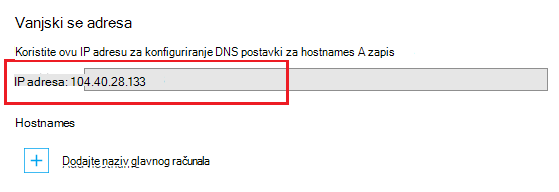

<properties
    pageTitle="Mapiranje prilagođenog naziva domene u aplikaciju programa Azure"
    description="Saznajte kako u aplikaciju u aplikacije servisa za Azure mapirati prilagođeni naziv domene (domenu)."
    services="app-service"
    documentationCenter=""
    authors="cephalin"
    manager="wpickett"
    editor="jimbe"
    tags="top-support-issue"/>

<tags
    ms.service="app-service"
    ms.workload="na"
    ms.tgt_pltfrm="na"
    ms.devlang="na"
    ms.topic="article"
    ms.date="07/27/2016"
    ms.author="cephalin"/>

# Mapiranje prilagođenog naziva domene u aplikaciju programa Azure

[AZURE.INCLUDE [web-selector](../../includes/websites-custom-domain-selector.md)]

U ovom se članku objašnjava da biste ručno mapirali prilagođenog naziva domene u web-aplikacije, pozadinskog mobilne aplikacije ili aplikaciji [Azure aplikacije servisa](../app-service/app-service-value-prop-what-is.md)za API-JA. 

Pokrenite aplikaciju već u sklopu jedinstveni poddomenu od azurewebsites.net. Ako, na primjer, ako je naziv aplikacije **contoso**, njegov naziv domene je **contoso.azurewebsites.net**. Međutim, možete mapirati prilagođenu domenu naziv aplikacije pa koji njezin URL, kao što su `www.contoso.com`, odražava proizvođača.

>[AZURE.NOTE] Zatražite pomoć od stručnjaka za Azure na [forume za Azure](https://azure.microsoft.com/support/forums/). Čak i više razine podrške Idi na [Azure podržava web-mjesta](https://azure.microsoft.com/support/options/) i kliknite **Dohvati podržava**.

[AZURE.INCLUDE [introfooter](../../includes/custom-dns-web-site-intro-notes.md)]

## Kupite novu prilagođenu domenu Azure portalu

Ako već niste kupili prilagođeni naziv domene, možete kupiti i upravljanje izravno u odjeljku postavke za aplikaciju programa [Azure portal](https://portal.azure.com). Tu mogućnost olakšava da biste mapirali prilagođene domene na aplikaciju, hoće li se aplikacija koristi [Azure promet Upravitelj](web-sites-traffic-manager-custom-domain-name.md) ili ne. 

Upute potražite u članku [kupiti naziv prilagođene domene za aplikacije servisa](custom-dns-web-site-buydomains-web-app.md).

## Mapiranje prilagođenu domenu kao vanjski kupili

Ako ste već kupili prilagođenu domenu s [Azure DNS-a](https://azure.microsoft.com/services/dns/) ili vanjskog davatelja usluga, postoje tri glavna koraka da biste mapirali prilagođene domene u aplikaciju:

1. [IP adresa za aplikaciju Get *(samo na zapis)* ](#vip).
2. [Stvaranje DNS zapisa koji mapiranje vlastite domene u aplikaciju](#createdns). 
    - **Gdje**: vaš registrara na vlastitu alata za upravljanje domenom (npr. Azure DNS GoDaddy, itd.).
    - **Zašto**: da bi registarskoj znali da biste razrješava željenu prilagođenu domenu za Azure aplikacije.
1. [Omogućivanje naziv prilagođene domene za Azure aplikacije](#enable).
    - **Gdje**: [Azure portal](https://portal.azure.com).
    - **Zašto**: da bi aplikacije znali odgovoriti na zahtjev za pokušaj naziv prilagođene domene.
3. [Provjerite je li DNS prijenos](#verify).

### Vrste domene možete mapirati

Aplikacije servisa za Azure možete mapirati sljedećih kategorija prilagođene domene u aplikaciju.

- **Korijensku domenu** - naziv domene koju rezervirane kod registrara domena (predstavljen brojem u `@` glavno računalo zapisa, obično). Primjerice, **contoso.com**.
- **Poddomenu** - bilo koje domene koji se nalazi ispod korijensku domenu. Ako je, primjerice, **www.contoso.com** (predstavljen brojem u `www` glavno računalo zapisa).  Možete mapirati različite poddomene isti korijensku domenu različitih aplikacija u Azure.
- **Zamjenski domene** - [sve poddomene čije krajnje lijeve DNS etiketa je `*` ](https://en.wikipedia.org/wiki/Wildcard_DNS_record) (npr glavno računalo zapisa `*` i `*.blogs`). Na primjer, ** \*. contoso.com**.

### Vrste DNS zapisa možete koristiti

Ovisno o vašim potrebama, možete koristiti dvije različite vrste standard DNS zapise da biste mapirali prilagođene domene: 

- [A](https://en.wikipedia.org/wiki/List_of_DNS_record_types#A) - karte prilagođeni naziv domene za Azure aplikacije virtualne IP adresa izravno. 
- [CNAME](https://en.wikipedia.org/wiki/CNAME_record) - karata prilagođeni naziv domene na naziv Azure domene pokrenite aplikaciju, * *&lt;*appname*>. azurewebsites.net**. 

Prednost CNAME jest da nastavi svim promjenama IP adrese. Ako izbrišete i ponovno stvorite aplikaciju ili pretvaranje veći cijene sloju natrag u sloju **zajednički se koristi** , pokrenite aplikaciju virtualna IP adresa mogu se promijeniti. Do takve promjene CNAME zapis koji je još uvijek valjan dok A zapis je potrebno ažuriranje. 

Vodič prikazuje korake za korištenje A zapis kao i za korištenje CNAME zapis.

>[AZURE.IMPORTANT] Stvorite CNAME zapis za korijensku domenu (odnosno "korijenske zapis"). Dodatne informacije potražite u članku [Zašto ne CNAME zapis može koristiti korijensku domenu](http://serverfault.com/questions/613829/why-cant-a-cname-record-be-used-at-the-apex-aka-root-of-a-domain).
Da biste mapirali korijensku domenu Azure aplikacije, umjesto toga koristite A zapis.

## Korak 1. *(Samo na zapis)* Dohvaćanje aplikacije IP adresa
Da biste mapirali prilagođenog naziva domene pomoću A zapis, morate Azure aplikacije IP adresa. Ako će mapirali umjesto toga koristite CNAME zapis, preskočite ovaj korak i pomaknuti na sljedeći odjeljak.

1.  Prijavite se na [portal za Azure](https://portal.azure.com).

2.  Na lijevom izborniku kliknite **Aplikaciju servisa** .

4.  Kliknite aplikacije, a zatim kliknite **prilagođenih domena**.

6.  Imajte na umu IP adrese iznad sekcije Hostnames...

    

7.  U ovom portala plohu ostati otvoren. Koje će vratite se na njega kada stvarate DNS zapise.

## Korak 2. Stvaranje DNS zapisa

Prijavite se na registarskoj i njihovih alat da biste dodali A zapis ili CNAME zapis. Korisničko Sučelje za svaku registrara je malo drugačiju pa treba pogledajte dokumentaciju za davatelja usluga. Međutim, Evo nekoliko smjernica Općenito.

1.  Pronađite stranicu za upravljanje DNS zapisima. Potražite veze ili područja web-mjesta s natpisom **Naziv domene**, **DNS-a**ili **Upravljanje naziv poslužitelja**. Često možete pronaći vezu pomoću prikaza podataka o računu i tražite veza kao što su **Moje domene**.
2.  Potražite vezu koja omogućuje dodavanje ili uređivanje DNS zapisa. To se može biti **datoteku Zone** , **DNS zapisi** vezu ili vezom za konfiguraciju **Dodatno** .
3.  Stvorite zapis i spremili promjene.
    - [Upute za A zapis su ovdje](#a).
    - [Upute za CNAME zapis koji su u nastavku](#cname).

### Stvorili A zapis

Da biste koristili A zapis za mapiranje IP adresa Azure aplikacije, zapravo morate da biste stvorili A zapis i TXT zapis. A zapis za razrješavanje DNS sam, a TXT zapis za Azure da biste potvrdili da ste vlasnik naziva prilagođene domene. 

Konfiguriranje A zapis na sljedeći način (@ obično predstavlja korijensku domenu):
 
<table cellspacing="0" border="1">
  <tr>
    <th>Primjer FQDN</th>
    <th>Glavno računalo</th>
    <th>Vrijednost</th>
  </tr>
  <tr>
    <td>contoso.com (korijenskog)</td>
    <td>@</td>
    <td>IP adrese iz <a href="#vip">korak 1</a></td>
  </tr>
  <tr>
    <td>www.contoso.com (sub)</td>
    <td>"www"</td>
    <td>IP adrese iz <a href="#vip">korak 1</a></td>
  </tr>
  <tr>
    <td>*. contoso.com (zamjenski)</td>
    <td>*</td>
    <td>IP adrese iz <a href="#vip">korak 1</a></td>
  </tr>
</table>

Dodatne kontrole vodi na konvencije karte iz &lt; *poddomene*>. &lt; *rootdomain*> da biste &lt; *appname*>. azurewebsites.net. Konfiguriranje TXT zapis na sljedeći način:

<table cellspacing="0" border="1">
  <tr>
    <th>Primjer FQDN</th>
    <th>Glavno računalo TXT</th>
    <th>TXT vrijednost</th>
  </tr>
  <tr>
    <td>contoso.com (korijenskog)</td>
    <td>@</td>
    <td>&lt;<i>appname</i>>. azurewebsites.net</td>
  </tr>
  <tr>
    <td>www.contoso.com (sub)</td>
    <td>"www"</td>
    <td>&lt;<i>appname</i>>. azurewebsites.net</td>
  </tr>
  <tr>
    <td>*. contoso.com (zamjenski)</td>
    <td>*</td>
    <td>&lt;<i>appname</i>>. azurewebsites.net</td>
  </tr>
</table>

###Stvorite CNAME zapis

Ako koristite CNAME zapis za mapiranje Azure aplikacije zadani naziv domene, ne morate dodatnog TXT zapisa kao i sa zapisom odgovora. 

>[AZURE.IMPORTANT] Stvorite CNAME zapis za korijensku domenu (odnosno "korijenske zapis"). Dodatne informacije potražite u članku [Zašto ne CNAME zapis može koristiti korijensku domenu](http://serverfault.com/questions/613829/why-cant-a-cname-record-be-used-at-the-apex-aka-root-of-a-domain).
Da biste mapirali korijensku domenu Azure aplikacije, umjesto toga koristite [A zapis](#a) .

Konfiguriranje CNAME zapis na sljedeći način (@ obično predstavlja korijensku domenu):

<table cellspacing="0" border="1">
  <tr>
    <th>Primjer FQDN</th>
    <th>Glavno računalo CNAME</th>
    <th>Vrijednost CNAME</th>
  </tr>
  <tr>
    <td>www.contoso.com (sub)</td>
    <td>"www"</td>
    <td>&lt;<i>appname</i>>. azurewebsites.net</td>
  </tr>
  <tr>
    <td>*. contoso.com (zamjenski)</td>
    <td>*</td>
    <td>&lt;<i>appname</i>>. azurewebsites.net</td>
  </tr>
</table>

##Korak 3. Omogućivanje naziv prilagođene domene za aplikaciju

Vratite se u plohu **Prilagođenih domena** na portalu za Azure (pročitajte članak [Korak 1](#vip)), morate dodati u potpunosti puni naziv domene (FQDN) prilagođene domene na popis.

1.  Ako niste učinili, prijavite se na [portal za Azure](https://portal.azure.com).

2.  Na portalu Azure na lijevom izborniku kliknite **Aplikaciju servisa** .

3.  Kliknite aplikacije, a zatim kliknite **prilagođenih domena** > **Dodaj naziv glavnog računala**.

4.  Dodavanje FQDN prilagođene domene na popis (primjerice **www.contoso.com**).

    

    >[AZURE.NOTE] Azure će pokušati potvrditi naziv domene koju koristite ovdje. Provjerite je li je naziv domene za koju ste stvorili DNS zapis u [koraku 2](#createdns). 

5.  Kliknite **Provjeri valjanost**.

6.  Nakon kliknete **Provjera** Azure će izbaciti domena uspješno tijeka rada. To će provjeru vlasništvo nad domenom kao i dostupnosti i izvješća uspjeh naziv glavnog računala ili detaljne pogreška s prescriptive vodženje kako ispraviti pogrešku.    

7.  Nakon uspješne provjere **Dodaj naziv glavnog računala** gumb postaje aktivna i moći ćete dodijelite naziv glavnog računala. 

8.  Kada Azure Dovrši konfiguriranje novi prilagođeni naziv domene, pomaknite se do prilagođeni naziv domene u pregledniku. Web-pregledniku otvarajte Azure aplikacije, što znači da je ispravno konfiguriran prilagođeni naziv domene.

> [AZURE.NOTE] Ako DNS zapisa koji se već koristi (active domain posluživanje promet scenarij) i morate povezati preemptively web-aplikaciju programa je radi provjere domene, zatim jednostavno stvaranje TXT zapisa kao primjeri prikazano u sljedećoj tablici. Dodatne kontrole vodi na konvencije karte iz &lt; *poddomene*>. &lt; *rootdomain*> da biste &lt; *appname*>. azurewebsites.net. 
> <table cellspacing="0" border="1">
  <tr>
    <th>Primjer FQDN</th>
    <th>Glavno računalo TXT</th>
    <th>TXT vrijednost</th>
  </tr>
  <tr>
    <td>contoso.com (korijenskog)</td>
    <td>awverify.contoso.com</td>
    <td>&lt;<i>appname</i>>. azurewebsites.net</td>
  </tr>
  <tr>
    <td>www.contoso.com (sub)</td>
    <td>awverify.www.contoso.com</td>
    <td>&lt;<i>appname</i>>. azurewebsites.net</td>
  </tr>
    <tr>
    <td>*. contoso.com (sub)</td>
    <td>awverify.*.contoso.com</td>
    <td>&lt;<i>appname</i>>. azurewebsites.net</td>
  </tr>
</table>
Nakon stvaranja DNS zapis, vratite se na Azure portal i dodajte prilagođeni naziv domene na web-aplikaciju.
 

##Provjerite je li prijenos DNS-a

Nakon što završite navedeni koraci za konfiguraciju, može potrajati neko vrijeme da prijenosa, ovisno o davatelja DNS promjene. Možete provjeriti funkcionira li prijenos DNS očekivani pomoću [http://digwebinterface.com/](http://digwebinterface.com/). Kada otvorite web-mjesto, odredite u hostnames u tekstni okvir i kliknite **istražujte**. Provjerite je li rezultata da biste potvrdili ako navedene su nedavne promjene stupila na snagu.  

> [AZURE.NOTE] Prijenos DNS stavke može potrajati i do 48 sati (ponekad više). Ako ste sve ispravno konfigurirano, i dalje ćete morati pričekati za prijenos da.

## Daljnji koraci
Saznajte kako sigurne prilagođeni naziv domene s HTTPS [kupnjom SSL certifikata u Azure](web-sites-purchase-ssl-web-site.md) ili [pomoću SSL certifikata s drugih mjesta](web-sites-configure-ssl-certificate.md).

>[AZURE.NOTE] Ako želite započeti s aplikacije servisa za Azure prije registracije za račun za Azure, idite na [Pokušajte aplikacije servisa](http://go.microsoft.com/fwlink/?LinkId=523751), gdje možete odmah stvoriti web-aplikacijama short-lived starter u aplikacije servisa. Nema kreditne kartice potrebna; Nema preuzete obveze.

[Početak rada s Azure DNS-a](../dns/dns-getstarted-create-dnszone.md)  
[Stvaranje DNS zapisa za web-aplikacije u prilagođenoj domeni](../dns/dns-web-sites-custom-domain.md)  
[Delegat domene za Azure DNS-a](../dns/dns-domain-delegation.md)

<!-- Images -->
[subdomain]: media/web-sites-custom-domain-name/azurewebsites-subdomain.png
