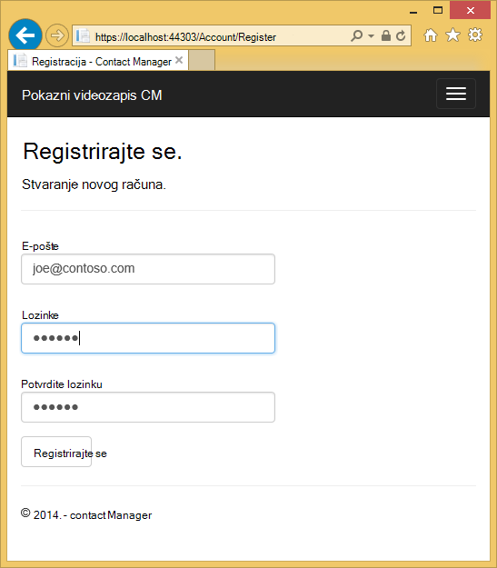

<properties 
    pageTitle="Stvaranje aplikacije ASP.NET MVC pomoću provjere autentičnosti i SQL DB i implementacija aplikacije servisa za Azure" 
    description="Saznajte kako razviti aplikaciju ASP.NET MVC 5 sa s bazom podataka SQL pozadinske, dodajte provjere autentičnosti i autorizacije i implementacija Azure." 
    services="app-service\web" 
    documentationCenter=".net" 
    authors="Rick-Anderson" 
    writer="Rick-Anderson" 
    manager="wpickett" 
    editor=""/>

<tags 
    ms.service="app-service-web" 
    ms.workload="web" 
    ms.tgt_pltfrm="na" 
    ms.devlang="dotnet" 
    ms.topic="article" 
    ms.date="03/21/2016" 
    ms.author="riande"/> 

# Stvaranje aplikacije ASP.NET MVC pomoću provjere autentičnosti i SQL DB i implementacija aplikacije servisa za Azure

Pomoću ovog praktičnog vodiča pokazuje kako izraditi sigurno web-aplikacijama ASP.NET MVC 5 koji omogućuje korisnicima zapisnika vjerodajnicama sa servisa Facebook i Google. Aplikacija je jednostavan popis kontakata koji koristi ADO.NET entitet Framework za pristup bazi podataka. Aplikacija će implementacija [Aplikacije servisa za Azure](http://go.microsoft.com/fwlink/?LinkId=529714). 

Na dovršavanja vodič, imat ćete sigurne utemeljenih na podacima zadržavanja gore poslužitelju u oblak i koristiti bazu podataka za oblaka. Sljedeća ilustracija prikazuje stranicu prijave za dovršene aplikaciju.

![stranica za prijavu][rxb]

Ćete saznati:

* Upute za stvaranje sigurne platforme ASP.NET MVC 5 web projekta u Visual Studio.
* Upute za provjeru autentičnosti i autorizirali korisnike prijavite se pomoću vjerodajnica s računa (pomoću [OAuth 2.0](http://oauth.net/2 "http://oauth.net/2")provjera autentičnosti društvenih davatelja) Google ili Facebook.
* Upute za provjeru autentičnosti i autorizirali korisnike registrirati u bazi podataka upravlja aplikacije (lokalni provjera autentičnosti pomoću [Identiteta ASP.NET](http://asp.net/identity/)).
* Upute za korištenje na ADO.NET entitet Framework 6 kod prvog za čitanje i pisanje podataka u bazi podataka za SQL.
* Kako koristiti entitet Framework kod prvog migracije za implementaciju baze podataka.
* Kako spremati relacijskih podataka u oblak pomoću baze podataka SQL Azure.
* Kako implementirati web projekta koji koristi baze podataka u [web-aplikacije](http://go.microsoft.com/fwlink/?LinkId=529714) u aplikacije servisa za Azure.

>[AZURE.NOTE] Ovo je dugo vodič. Ako želite kratko Upoznavanje s projektima web aplikacije servisa za Azure i Visual Studio, potražite u članku [Stvaranje ASP.NET web app u aplikacije servisa za Azure](web-sites-dotnet-get-started.md). Informacije o rješavanju problema potražite u odjeljku [Otklanjanje poteškoća](#troubleshooting) .
>
>Ili ako želite započeti s aplikacije servisa za Azure prije registracije za račun za Azure, idite na [Aplikacije servisa za pokušajte](http://go.microsoft.com/fwlink/?LinkId=523751), gdje možete odmah stvoriti web-aplikacijama short-lived starter u aplikacije servisa. Nema kreditne kartice potrebna; Nema preuzete obveze.

## Preduvjeti

Da biste dovršili ovaj Praktični vodič, morate račun sustava Microsoft Azure. Ako nemate račun, možete ga [aktivirati svoje prednosti pretplatnika Visual Studio](/pricing/member-offers/msdn-benefits-details/?WT.mc_id=A261C142F) ili [prijavite se za besplatnu probnu verziju](/pricing/free-trial/?WT.mc_id=A261C142F).

Da biste postavili okruženje za razvoj, morate instalirati [Visual Studio 2013 Update 5](http://go.microsoft.com/fwlink/?LinkId=390521) ili noviji, a na najnoviju verziju programa [Azure SDK za .NET](http://go.microsoft.com/fwlink/?linkid=324322&clcid=0x409). Ovaj članak za Visual Studio ažuriranje 4 i SDK 2.8.1. Radi iste upute za Visual Studio 2015 s najnovijim [Azure SDK za .NET](http://go.microsoft.com/fwlink/?linkid=518003&clcid=0x409) instaliran, ali neke zaslonima će izgledati razlikuje od ilustracije.

## Stvaranje aplikacije komponente ASP.NET MVC 5

### Stvaranje projekta

1. Na izborniku **datoteka** kliknite **Novi projekt**.

    

1. U dijaloškom okviru **Novi projekt** proširite **C#** odaberite **Web** u odjeljku **Instalirani predlošci**, i zatim odaberite **ASP.NET web-aplikacije**. Naziv aplikacije **ContactManager**, a zatim kliknite **u redu**.

    
 
    **Bilješke:** Provjerite je li unesite "ContactManager". Blokova Šifra koje koje ćete kopiranje kasnije pretpostavlja da je naziv projekta ContactManager. 

1. U dijaloškom okviru **Novi projekt ASP.NET** odaberite predložak **MVC** . Provjerite je li **provjere autentičnosti** postavljen na **Pojedinačne korisničke račune**, potvrđen **glavnog računala u oblaku** i **Aplikacije servisa za** odabran.

    

1. Kliknite **u redu**.

1. Pojavit će se dijaloški okvir **Konfiguriranje Microsoft Azure web-aplikacije postavke** . Možda ćete morati ako već niste učinili, prijavite ili ako je istekao vašu prijavu ponovno unesite vjerodajnice.

1. Neobavezni – promjena vrijednosti u **web-aplikacije naziv** okvir (pogledajte slici u nastavku).

    URL web-aplikaciji bit će .azurewebsites {name} .net, tako da se naziv mora biti jedinstven u azurewebsites.net domene. Čarobnjak za konfiguraciju predlaže jedinstveni naziv dodavanjem broj projekta naziv "ContactManager", a koji je u redu za ovog praktičnog vodiča.

5. U **grupi resursa** padajućeg popisa odaberite postojeću grupu ili **Stvori novu grupu resursa**(pogledajte slici u nastavku). 

    Ako želite, možete odabrati grupu resursa koje već imate. No ako stvorite novu grupu resursa, a samo je koristiti za ovog praktičnog vodiča, bit će jednostavno da biste izbrisali sve Azure resurse koji ste stvorili za vodič kada završite s njima. Informacije o grupama resursa potražite u članku [Pregled upravljanja resursima Azure](../azure-resource-manager/resource-group-overview.md). 

5. **Plan aplikacije servisa za** Odabir padajućeg popisa odaberite postojećeg plana ili **plana za stvaranje nove aplikacije servisa**(pogledajte slici u nastavku).

    Ako želite, možete odabrati tarifu aplikacije servisa za koja već imate. Informacije o tarifama za aplikacije servisa za potražite u članku [aplikacije servisa za Azure tarife detaljnije pregled](../app-service/azure-web-sites-web-hosting-plans-in-depth-overview.md). 

1. Dodirnite **Istraži dodatna Azure servisa** da biste dodali SQL baze podataka.

    

1. Dodirnite u **+** ikonu da biste dodali SQL baze podataka.

    

1. Dodirnite **Novo** u dijaloškom okviru **Konfiguriranje SQL baze podataka** :

    

1. Unesite naziv administrator i jaku lozinku.

    

    Naziv poslužitelja mora biti jedinstvena. Mogu sadržavati mala slova, znamenke i spojnice. Ne smije sadržavati završne crtica. Korisničko ime i lozinka su novu vjerodajnice stvarate novog poslužitelja. 

    Ako već imate poslužitelj baze podataka, možete odabrati koji umjesto stvaranja jedan. Bazu podataka poslužitelja su dragocjeno resursa, a obično želite stvoriti više baza podataka na istom poslužitelju za testiranje i razvoj umjesto stvaranja poslužitelj baze podataka po bazi podataka. No za ovog praktičnog vodiča potrebno je samo poslužitelj privremeno i stvaranjem poslužitelja u istoj grupi resursa kao web-mjesto koje olakšavaju da biste izbrisali oba web-aplikacije i baze podataka resursa tako da izbrišete grupu resursa kada završite s vodič. 

    Ako odaberete postojeći poslužitelj baze podataka, provjerite jesu li web-aplikacije i baze podataka u istom području.

    

4. Dodirnite **Stvaranje**.

    Visual Studio stvara ContactManager web project, stvara grupu resursa i aplikacije servisa za planiranje koje ste naveli, i stvara web-aplikacijama aplikacije servisa za Azure s nazivom koje ste naveli.

### Postavljanje zaglavlje i podnožje

1. U **Pregledniku rješenja** otvorite datoteku *Layout.cshtml* u mapi *Views\Shared* .

    ![_Layout.cshtml u pregledniku rješenja][newapp004]

1. Zamijenite ActionLink u datoteci *Layout.cshtml* sljedeći kod.

    @Html.ActionLink("CMPokazni videozapis","Indeks","Kontakti", novi {područje =" "}, novi { @class ="navigacijska traka marke"})
                   

    Provjerite je li promijeniti treći parametar "Kod kuće" za "Kontakti". Iznad oznake će stvoriti vezu "Kontakti" na svakoj stranici korakom indeks kontrolera kontakata. Promijenite naziv aplikacije u zaglavlje i podnožje od "Moje ASP.NET aplikacija" i "Naziv aplikacije" u "Contact Manager" i "CM pokazni videozapis". 
 
### Pokrenite aplikaciju lokalno

1. Pritisnite CTRL + F5 da biste pokrenuli aplikaciju.

    Početna stranica aplikacije pojavit će se u zadanom pregledniku.

    

To je sve što trebate učiniti za sada da biste stvorili aplikacije koje ćete implementirati Azure. 

## Implementacija aplikacije Azure

1. U Visual Studio, desnom tipkom miša kliknite projekt u **Pregledniku rješenja** , a zatim na kontekstnom izborniku odaberite **Objavi** .

    
    
    Otvorit će se čarobnjak za **Objavljivanje Web** -a.

1. U dijaloškom okviru **Objavljivanje Web** kliknite **Objavi**.

    

    Aplikaciju koju ste stvorili sada se izvodi u oblaku. Kada sljedeći put implementacija aplikacije, samo promijenjene (ili novi) datoteke će biti implementirano.

    

## Omogući SSL projekta ##

1. U **Pregledniku rješenja**kliknite projekt **ContactManager** , a zatim pritisnite F4 da biste otvorili prozor **Svojstva** .

3. Promijenite **SSL omogućen** na **True**. 

4. Kopirajte **SSL URL**.

    SSL URL bit će https://localhost:44300 / osim ako ste već stvorili SSL web-aplikacije.

    ![Omogući SSL][rxSSL]
 
1. U **Pregledniku rješenja**, desnom tipkom miša kliknite projekt **Contact Manager** , a zatim kliknite **Svojstva**.

1. Kliknite karticu **Web** .

1. Promjena **Url projekt** tako da koristi **SSL URL** , a zatim spremite stranicu (kontrola S).

    
 
1. Provjerite je li Internet Explorer preglednika koji se pokreće Visual Studio, kao što je prikazano na slici u nastavku:

    

    Birač preglednika omogućuje vam da odredite preglednika koji se pokreće Visual Studio. Možete odabrati više preglednika, a Visual Studio ažurirati svaki preglednika kada unesete promjene. Dodatne informacije potražite u članku [Korištenje preglednika vezu u Visual Studio 2013](http://www.asp.net/visual-studio/overview/2013/using-browser-link).

    

1. Pritisnite CTRL + F5 da biste pokrenuli aplikaciju. Kliknite **da** da biste pokrenuli postupak povjerenje samopotpisani certifikat koji je generirao IIS Express.

     

1. Dijaloški okvir **Sigurnosno upozorenje** za čitanje, a zatim kliknite **da** ako želite instalirati certifikat koji predstavlja **localhost**.

    

1. Preglednika Internet Explorer prikazuje stranicu *Polazno* , a postoje bez upozorenja SSL.

     

     Internet Explorer dobar je kada koristite SSL jer prihvaća certifikat i prikazuje se sadržaj HTTPS bez upozorenje. Microsoft Edge i Google Chrome prihvatiti certifikata. Firefox koristi spremište vlastiti certifikat tako da se prikazuje upozorenje.

     

## Dodavanje baze podataka aplikacije

Nakon toga će ažurirati aplikaciju da biste dodali mogućnost za prikaz i ažuriranje kontakata i spremanje podataka u bazi podataka. Aplikacija će koristiti Framework entitet (EF) da biste stvorili bazu podataka i za čitanje i ažuriranje podataka.

### Dodavanje klase model podataka za kontakte

Započnite tako da stvorite jednostavan podatkovnog modela u kodu.

1. U **Pregledniku rješenja**, desnom tipkom miša kliknite mapu modela, kliknite **Dodaj**, a zatim **predmete**.

    

2. U dijaloškom okviru **Dodaj novu stavku** naziv nove datoteke klase *Contact.cs*, a zatim **Dodaj**.

    ![Dodajte novu stavku dijaloški okvir][adddb002]

3. Sadržaj datoteke Contact.cs zamijenite sljedeći kod.

        using System.ComponentModel.DataAnnotations;
        using System.Globalization;
        namespace ContactManager.Models
        {
            public class Contact
            {
                public int ContactId { get; set; }
                public string Name { get; set; }
                public string Address { get; set; }
                public string City { get; set; }
                public string State { get; set; }
                public string Zip { get; set; }
                [DataType(DataType.EmailAddress)]
                public string Email { get; set; }
            }
        }
Klase **obratite se** definira podataka koja će sadržavati za svaki kontakt, uz primarni ključ *ContactID*, koji je potreban iz baze podataka.

### Stvaranje web-stranica koji omogućuju korisnicima aplikacije za rad s kontaktima

Značajka scaffolding ASP.NET MVC automatsko generiranje kod koji se izvodi stvaranje, čitanje, ažuriranje i brisanje Akcije (CRUD). 

1. Stvaranje projekta **(Ctrl + Shift + B)**. (Morate stvaranja projekt prije korištenja mehanizam scaffolding.)
 
1. U **Pregledniku rješenja**, desnom tipkom miša kliknite mapu kontrolera i kliknite **Dodaj**pa kliknite **kontroler**.

    ![Dodavanje kontroler u Kontekstni izbornik za mape kontrolera][addcode001]

5. U dijaloškom okviru **Dodavanje Scaffold** odaberite **MVC 5 kontroler s prikaza, putem EF** , a zatim kliknite **Dodaj**.
    
    

1. U okvir padajući popis **klasu modela** odaberite **kontakt (ContactManager.Models)**. (Pogledajte na slici u nastavku).

1. U **predmete kontekst podataka**odaberite **ApplicationDbContext (ContactManager.Models)**. **ApplicationDbContext** će se koristiti za članstvo DB i naše podatke o kontaktu.

    

1. Kliknite **Dodaj**.

   Visual Studio stvara kontroler pomoću metode i prikaza za CRUD postupaka baze podataka za **kontakt** objekte.

## Omogućivanje migracije, stvorite bazu podataka, dodajte oglednih podataka i podataka initializer ##

Sljedeći zadatak je da bi omogućio značajku [Prvi Migracija kod](http://msdn.microsoft.com/library/hh770484.aspx) za stvaranje tablica baze podataka koji se temelji na podatkovni model koji ste stvorili.

1. Na izborniku **Alati** odaberite **Upravitelj NuGet paketa** , a zatim **Konzole za Upravitelj paketa**.

    

2. U prozoru **Upravitelja paketima konzole** unesite sljedeću naredbu:

        enable-migrations

    Naredba **Omogući Migracija** stvara mapu *migracije* , a stavlja u toj mapi *Configuration.cs* datoteka koje se mogu uređivati seed baze podataka i konfiguriranje migracije. 

2. U prozoru **Upravitelja paketima konzole** unesite sljedeću naredbu:

        add-migration Initial

    Naredba **Dodaj migracije početni** stvara datoteku pod nazivom ** &lt;date_stamp&gt;Početna** u mapi *migracije* . Kod u ovoj datoteci stvara tablicama baze podataka. Prvi parametar ( **Početna** ) koristi se za stvaranje naziv datoteke. Vidjet ćete nove datoteke za predmete u **Programu Explorer rješenja**.

    U **Početni** predmete metodu **gore** stvara tablice kontakti, a način **dolje** (koristi se kada želite da biste se vratili u prethodno stanje) izostavlja ga.

3. Otvorite datoteku *Migrations\Configuration.cs* . 

4. Dodajte sljedeće `using` izjava. 

         using ContactManager.Models;

5. Zamijenite metodu *Početni broj* sljedeći kod:

        protected override void Seed(ContactManager.Models.ApplicationDbContext context)
        {
            context.Contacts.AddOrUpdate(p => p.Name,
               new Contact
               {
                   Name = "Debra Garcia",
                   Address = "1234 Main St",
                   City = "Redmond",
                   State = "WA",
                   Zip = "10999",
                   Email = "debra@example.com",
               },
                new Contact
                {
                    Name = "Thorsten Weinrich",
                    Address = "5678 1st Ave W",
                    City = "Redmond",
                    State = "WA",
                    Zip = "10999",
                    Email = "thorsten@example.com",
                },
                new Contact
                {
                    Name = "Yuhong Li",
                    Address = "9012 State st",
                    City = "Redmond",
                    State = "WA",
                    Zip = "10999",
                    Email = "yuhong@example.com",
                },
                new Contact
                {
                    Name = "Jon Orton",
                    Address = "3456 Maple St",
                    City = "Redmond",
                    State = "WA",
                    Zip = "10999",
                    Email = "jon@example.com",
                },
                new Contact
                {
                    Name = "Diliana Alexieva-Bosseva",
                    Address = "7890 2nd Ave E",
                    City = "Redmond",
                    State = "WA",
                    Zip = "10999",
                    Email = "diliana@example.com",
                }
                );
        }

    Kod inicijalizira (sjemenke) baze podataka pomoću podaci za kontakt. Dodatne informacije o seeding bazu podataka, potražite u članku [Seeding i DBs ispravljanje pogrešaka entitet Framework (EF)](http://blogs.msdn.com/b/rickandy/archive/2013/02/12/seeding-and-debugging-entity-framework-ef-dbs.aspx). Stvaranje projekta da biste provjerili postoje pogreške Kompiliranje.

6. Na **Konzoli upravitelja paketa** upišite naredbu:

        update-database

    ![Naredbe konzole za Upravitelj paketa][addcode009]

    **Ažuriranje bazu podataka** pokreće prvi migracije koji stvara bazu podataka. Prema zadanim postavkama, baza podataka stvorena je kao baze podataka SQL Server Express LocalDB. 

7. Pritisnite CTRL + F5 da biste pokrenuli aplikaciju, a zatim kliknite veza **Probna CM** ; ili dođite do https://localhost:(port#) Cm. 

    Aplikacija prikazuje podatke Početni broj i omogućuje uređivanje, Detalji i brisanje veza. Možete stvoriti, uređivanje, brisanje i prikaz podataka.

    ![MVC prikaz podataka][rx2]

## Dodavanje davatelja usluge razmjene OAuth2

>[AZURE.NOTE] Detaljne upute o tome kako koristiti Google i Facebook za razvojne inženjere web-mjesta portala, ovog vodiča veze na vodiče ASP.NET web-mjesta. Međutim, Google i Facebook promijeniti svoje web-mjesta češće od tih vodiči za koje će se ažurirati, a sada su ažurni. Ako imate poteškoća s slijedeći upute, potražite u članku istaknutog Disqus komentara na kraju ovog praktičnog vodiča popis što se promijenilo. 

[OAuth] (http://oauth.net/ "http://OAuth.NET/") je otvorena protokol koji omogućuje sigurnu provjeru autentičnosti u jednostavne i standardne metode iz web-mjesto prijenosnih i stolnih aplikacija. Predložak internet ASP.NET MVC koristi OAuth da biste Facebook, Twitter, Google i Microsoft kao davatelja usluge provjere autentičnosti. Iako ovaj Praktični vodič koristi samo Google kao davatelja usluge provjere autentičnosti, možete jednostavno izmijeniti kod koji će koristiti bilo koju od tih davatelja usluga. Koraci za implementaciju drugih davatelja usluge vrlo su slične korake koje vidite u ovom ćete praktičnom vodiču. Da biste koristili Facebook davatelj usluge provjere autentičnosti, potražite u članku [MVC 5 aplikacije sa servisa Facebook, Twitter, LinkedIn i Google OAuth2 prijave ](http://www.asp.net/mvc/tutorials/mvc-5/create-an-aspnet-mvc-5-app-with-facebook-and-google-oauth2-and-openid-sign-on).

Uz provjeru autentičnosti, ovog praktičnog vodiča za implementaciju autorizacije koristi uloge. Samo za korisnike koje dodate u ulogu *canEdit* se mogu mijenjati podatke (to jest, stvaranje, uređivanje i brisanje kontakata).

1. Slijedite upute u [MVC 5 aplikacije sa servisa Facebook, Twitter, LinkedIn i Google OAuth2 prijave](http://www.asp.net/mvc/tutorials/mvc-5/create-an-aspnet-mvc-5-app-with-facebook-and-google-oauth2-and-openid-sign-on#goog) u odjeljku **Stvaranje Google aplikaciju za OAuth 2 da biste postavili Google aplikacija za OAuth2**.

3. Pokretanje i testiranje aplikaciju da biste potvrdili da se možete prijaviti pomoću provjere autentičnosti za Google.

2. Ako želite stvoriti gumbe društvenih prijava s ikonama karakteristične za davatelja potražite u članku [vrlo društvenih prijava gumbe za ASP.NET MVC 5](http://www.jerriepelser.com/blog/pretty-social-login-buttons-for-asp-net-mvc-5)

## Pomoću članstva u API-JA

U ovom odjeljku ćete dodati lokalni korisnik i ulogu *canEdit* članstvo u bazi podataka. Samo korisnici u ulozi *canEdit* moći će urediti podatke. Preporučenim načinom rada je naziv ulogama akcijama koje možete izvršiti, pa *canEdit* Preferirani preko naziva *administratorske*uloge. Kada aplikacija nastaju, možete dodati nove uloge kao što su *canDeleteMembers* umjesto manje opisni *superAdmin*.

1. Otvorite datoteku *migrations\configuration.cs* i dodajte sljedeće `using` izvješća:

        using Microsoft.AspNet.Identity;
        using Microsoft.AspNet.Identity.EntityFramework;

1. Dodajte sljedeće metode **AddUserAndRole** klasa:

        bool AddUserAndRole(ContactManager.Models.ApplicationDbContext context)
        {
            IdentityResult ir;
            var rm = new RoleManager<IdentityRole>
                (new RoleStore<IdentityRole>(context));
            ir = rm.Create(new IdentityRole("canEdit"));
            var um = new UserManager<ApplicationUser>(
                new UserStore<ApplicationUser>(context));
            var user = new ApplicationUser()
            {
                UserName = "user1@contoso.com",
            };
            ir = um.Create(user, "P_assw0rd1");
            if (ir.Succeeded == false)
                return ir.Succeeded;
            ir = um.AddToRole(user.Id, "canEdit");
            return ir.Succeeded;
        }

1. Pozivanje nov način iz **Početni broj** metoda:

        protected override void Seed(ContactManager.Models.ApplicationDbContext context)
        {
            AddUserAndRole(context);
            context.Contacts.AddOrUpdate(p => p.Name,
                // Code removed for brevity
        }

    Sljedeća slika prikazuje promjene *Početni broj* metoda:

    

    Kod stvara novu ulogu naziva *canEdit*, stvara novi lokalni korisnik *user1@contoso.com*, te dodaje *user1@contoso.com* *canEdit* ulogu. Dodatne informacije potražite u članku [vodiči za identitet ASP.NET](http://www.asp.net/identity/overview/features-api) ASP.NET web-mjesta.

## Pomoću privremeni kod za dodavanje novih društvenih Prijava korisnika canEdit uloga  ##

U ovom odjeljku će privremeno promijeniti način **ExternalLoginConfirmation** u kontrolerom račun za dodavanje novih korisnika Registracija s davateljem OAuth *canEdit* ulogu. Nadamo omogućuje alat slično [WSAT](http://msdn.microsoft.com/library/ms228053.aspx) u budućnosti koji omogućuje stvaranje i uređivanje korisničkih računa i uloge. Tek onda, koje možete izvršiti istu funkciju pomoću privremeni kod.

1. Otvorite datoteku **Controllers\AccountController.cs** , a zatim otvorite **ExternalLoginConfirmation** korakom.

1. Dodajte sljedeće poziv **AddToRoleAsync** neposredno prije **SignInAsync** poziv.

        await UserManager.AddToRoleAsync(user.Id, "canEdit");

   Gore navedeni kod dodaje upravo registriranog korisnika ulozi "canEdit" koje im omogućuje pristup akcije metoda koje se mijenjaju podatke (Uredi). Sljedeći isječak prikazuje novi redak koda u kontekstu.

          // POST: /Account/ExternalLoginConfirmation
          [HttpPost]
          [AllowAnonymous]
          [ValidateAntiForgeryToken]
          public async Task ExternalLoginConfirmation(ExternalLoginConfirmationViewModel model, string returnUrl)
          {
             if (User.Identity.IsAuthenticated)
             {
                return RedirectToAction("Index", "Manage");
             }
             if (ModelState.IsValid)
             {
                // Get the information about the user from the external login provider
                var info = await AuthenticationManager.GetExternalLoginInfoAsync();
                if (info == null)
                {
                   return View("ExternalLoginFailure");
                }
                var user = new ApplicationUser { UserName = model.Email, Email = model.Email };
                var result = await UserManager.CreateAsync(user);
                if (result.Succeeded)
                {
                   result = await UserManager.AddLoginAsync(user.Id, info.Login);
                   if (result.Succeeded)
                   {
                      await UserManager.AddToRoleAsync(user.Id, "canEdit");
                      await SignInManager.SignInAsync(user, isPersistent: false, rememberBrowser: false);
                      return RedirectToLocal(returnUrl);
                   }
                }
                AddErrors(result);
             }
             ViewBag.ReturnUrl = returnUrl;
             return View(model);
          }

Kasnije u ovom praktičnom vodiču će implementirati aplikaciju Azure gdje ste će prijavu Google ili nekog drugog davatelja usluga za provjeru autentičnosti drugih proizvođača. To će dodavanje računa za upravo registrirani *canEdit* ulogu. Svi koji pronalazi URL adresa web app i ima Google ID možete registrirati i ažurirati bazu podataka. Da biste drugim osobama onemogućili tako, možete isključiti na web-mjesta. Ćete moći provjeriti tko je u ulozi *canEdit* tako da Provjera baze podataka.

Na **Konzoli upravitelja paketa** pritisnite tipke sa strelicom gore da bi se prikazala sljedeću naredbu:

        Update-Database

Pokreće se naredba **Update bazu podataka** metodu **Početni broj** , a koji će se pokrenuti način **AddUserAndRole** koju ste prethodno dodali. Način **AddUserAndRole** stvara korisnika *user1@contoso.com* i dodaje joj *canEdit* uloge.

## Zaštita aplikacijom SSL i atribut ovlasti ##

U ovom odjeljku primijenite atribut [ovlasti](http://msdn.microsoft.com/library/system.web.mvc.authorizeattribute.aspx) da biste ograničili pristup akcije metoda. Anonimni korisnici će moći vidjeti samo **indeks** akcije metoda kućni kontrolera. Registrirani korisnici moći će vidjeti podatke o kontaktu ( **indeks** i **detalje o** stranice s kontrolerom Cm), stranici o i stranici kontakta. Samo korisnici u ulozi *canEdit* će moći načini pristupa akcije koje se mijenjaju podatke.

1. Otvorite datoteku *App_Start\FilterConfig.cs* i zamijenite metodu *RegisterGlobalFilters* sljedeće (čime se dodaju dva filtra):

        public static void RegisterGlobalFilters(GlobalFilterCollection filters)
        {
            filters.Add(new HandleErrorAttribute());
            filters.Add(new System.Web.Mvc.AuthorizeAttribute());
            filters.Add(new RequireHttpsAttribute());
        }
        
    Kod dodaje filtar [autorizacija](http://msdn.microsoft.com/library/system.web.mvc.authorizeattribute.aspx) i filtar [RequireHttps](http://msdn.microsoft.com/library/system.web.mvc.requirehttpsattribute.aspx) aplikacije. Filtar [ovlasti](http://msdn.microsoft.com/library/system.web.mvc.authorizeattribute.aspx) onemogućuje pristup sve načine u aplikaciji anonimni korisnici. Atribut [AllowAnonymous](http://blogs.msdn.com/b/rickandy/archive/2012/03/23/securing-your-asp-net-mvc-4-app-and-the-new-allowanonymous-attribute.aspx) će koristiti budućih zahtjeva provjeru autentičnosti u nekoliko načina da anonimni korisnici mogu prijaviti i možete vidjeti na početnoj stranici. [RequireHttps](http://msdn.microsoft.com/library/system.web.mvc.requirehttpsattribute.aspx) zahtijeva da se svi pristup web-aplikaciji putem HTTP.

    Zamjenski pristup tako da dodate atribut [autorizacija](http://msdn.microsoft.com/library/system.web.mvc.authorizeattribute.aspx) i atribut [RequireHttps](http://msdn.microsoft.com/library/system.web.mvc.requirehttpsattribute.aspx) svaki kontrolerom, ali predstavljala sigurnost praksa ih primijeniti na cijelu aplikaciju. Tako da ih dodate globalno, svaki novi kontroler i akcije metoda dodate automatski zaštićeni--ne morate Imajte na umu da biste ih primijenili. Dodatne informacije potražite u članku [Zaštita MVC aplikacije ASP.NET i novi atribut AllowAnonymous](http://blogs.msdn.com/b/rickandy/archive/2012/03/23/securing-your-asp-net-mvc-4-app-and-the-new-allowanonymous-attribute.aspx). 

1. Dodavanje atributa [AllowAnonymous](http://blogs.msdn.com/b/rickandy/archive/2012/03/23/securing-your-asp-net-mvc-4-app-and-the-new-allowanonymous-attribute.aspx) korakom **indeks** kontrolera Polazno. Atribut [AllowAnonymous](http://blogs.msdn.com/b/rickandy/archive/2012/03/23/securing-your-asp-net-mvc-4-app-and-the-new-allowanonymous-attribute.aspx) omogućuje bijeli popis metode želite odustajanje od autorizacije. 

        public class HomeController : Controller
        {
          [AllowAnonymous]
          public ActionResult Index()
          {
             return View();
          }

    Ako ste tražili globalni *AllowAnonymous*, vidjet ćete da se koristi u načini prijave i registracije kontrolera računa.

1. U *CmController.cs*, dodajte `[Authorize(Roles = "canEdit")]` HttpGet i HttpPost metodama promjena podataka (Stvaranje, uređivanje, brisanje, svaki akcije metoda osim indeksa i detalje o) u kontrolerom *Cm* . Dio dovršene kod je prikazano u nastavku: 

        // GET: Cm/Create
        [Authorize(Roles = "canEdit")]
        public ActionResult Create()
        {
           return View(new Contact { Address = "123 N 456 W",
            City="Great Falls", Email = "ab@cd.com", Name="Joe Smith", State="MT",
           Zip = "59405"});
        }
        // POST: Cm/Create
        // To protect from overposting attacks, please enable the specific properties you want to bind to, for 
        // more details see http://go.microsoft.com/fwlink/?LinkId=317598.
        [HttpPost]
        [ValidateAntiForgeryToken]
         [Authorize(Roles = "canEdit")]
        public ActionResult Create([Bind(Include = "ContactId,Name,Address,City,State,Zip,Email")] Contact contact)
        {
            if (ModelState.IsValid)
            {
                db.Contacts.Add(contact);
                db.SaveChanges();
                return RedirectToAction("Index");
            }
            return View(contact);
        }
        // GET: Cm/Edit/5
        [Authorize(Roles = "canEdit")]
        public ActionResult Edit(int? id)
        {
            if (id == null)
            {
                return new HttpStatusCodeResult(HttpStatusCode.BadRequest);
            }
            Contact contact = db.Contacts.Find(id);
            if (contact == null)
            {
                return HttpNotFound();
            }
            return View(contact);
        }
        
1. Pritisnite CTRL + F5 da biste pokrenuli aplikaciju.

1. Ako i dalje prijavljeni iz prethodne sesije, kliknite vezu **Odjava** .

1. Kliknite **o** ili **kontakt** veze. Bit ćete preusmjereni na stranicu za prijavu jer anonimni korisnici ne možete prikazati te stranice.

1. Kliknite vezu **registrirati kao novog korisnika** i dodajte lokalni korisnik s e-poštom *joe@contoso.com*. Provjerite je li *Joe* možete oko prikaz karticu Polazno i obratite se stranica. 

    

1. Kliknite vezu *CM pokazni videozapis* i provjerite vidjeti podatke.

1. Kliknite vezu za uređivanje na stranici, bit ćete preusmjereni na stranicu za prijavu (jer je to uloga *canEdit* ne dodaje novi lokalni korisnik).

1. Prijavite se kao *user1@contoso.com* lozinkom "P_assw0rd1" (s "0" u "riječi" je nulu). Bit ćete preusmjereni na stranicu za uređivanje koji ste prethodno odabrali. 
2. 

    Ako se ne možete prijaviti pomoću tog računa i lozinke, pokušajte kopirati lozinku iz izvornog koda ga. Ako se i dalje ne možete prijaviti, informacije potražite u stupcu **korisničko ime** **AspNetUsers** tablice da biste provjerili *user1@contoso.com* dodan. 

1. Provjerite je li možete unijeti promjene podataka.

## Implementacija aplikacije Azure

1. U Visual Studio, desnom tipkom miša kliknite projekt u **Pregledniku rješenja** , a zatim na kontekstnom izborniku odaberite **Objavi** .

    ![Objavljivanje u projekt kontekstnog izbornika][firsdeploy003]

    Otvorit će se čarobnjak za **Objavljivanje Web** -a.

1. Kliknite karticu **Postavke** na lijevoj strani dijaloškog okvira **Objavite Web** . 

2. U odjeljku **ApplicationDbContext** odaberite bazu podataka koju ste stvorili stvaranja projekta.
   

1. U odjeljku **ContactManagerContext**, odaberite **Izvršavanje kod prvog migracije**.

    

1. Kliknite **Objavi**.

1. Prijavite se kao *user1@contoso.com* (s lozinka "P_assw0rd1") i provjerite je li možete uređivati podatke.

1. Odjava.

1. Idite na [Google konzole za razvojne inženjere](https://console.developers.google.com/) i **vjerodajnice** kartica ažuriranje preusmjeravanje JI i JavaScript Orgins da biste koristili Azure URL-a.

1. Prijavite se pomoću Google ili Facebook. Ulogu **canEdit** koji će dodati račun za Google ili Facebook. Ako se pojavi pogreška HTTP 400 s porukom *preusmjeravanje URI u zahtjevu za: https://contactmanager {Moje version}.azurewebsites.net/signin-google ne odgovaraju registrirani preusmjeravanje URI.*, morat ćete Pričekajte dok se ne prenose unesene promjene. Ako vam se ova pogreška nakon više od nekoliko minuta, provjerite je li u ji ispravne.

### Zaustavljanje web-aplikaciju da biste drugim osobama onemogućili Registracija  

1. U programu **Explorer poslužitelj**, dođite do **Azure > aplikacije servisa > {grupu resursa} > {web-aplikaciju programa}**.

4. Desnom tipkom miša kliknite web-aplikaciju, a zatim odaberite **Zaustavi**. 

    Umjesto toga, na [Portalu Azure](https://portal.azure.com/)možete idite na web-aplikaciji plohu, a zatim kliknite ikonu za **Prekid** pri vrhu na plohu.

    

### Uklanjanje AddToRoleAsync, objavljivanje i testiranje

1. Komentar izgleda ili uklonite sljedeći kod iz metoda **ExternalLoginConfirmation** u kontrolerom računa:

        await UserManager.AddToRoleAsync(user.Id, "canEdit");

1. Stvaranje projekta (koji sprema promjene datoteke i potvrđuje nemate sve pogreške Kompiliranje).

5. Desnom tipkom miša kliknite projekt u **Pregledniku rješenja** , a zatim odaberite **Objavi**.

       
    
4. Kliknite gumb **Start pretpregled** . Uvode se samo datoteke koje je potrebno ažurirati.

5. Pokrenite web-aplikaciju iz Visual Studio ili s portala sustava. **Nećete moći objaviti dok je zaustavljena web-aplikaciji**.

    

5. Vratite se u Visual Studio, a zatim kliknite **Objavi**.

3. Pokrenite aplikaciju Azure otvara u zadanom pregledniku. Ako ste prijavljeni, Odjava da biste mogli vidjeti na početnoj stranici kao anonimni korisnik.  

4. Kliknite vezu **o** . Bit ćete preusmjereni na prijava stranice.

5. Kliknite vezu **registrirati** na prijava stranice i stvorite lokalni račun. Koristit ćemo ovaj lokalni račun da biste provjerili možete pristupiti čitanje samo stranice, ali ne možete pristupiti stranice koje se mijenjaju podatke (koji su zaštićeni ulogom *canEdit* ). Kasnije u ovom praktičnom vodiču uklonit ćete pristup za lokalni račun. 

    

1. Provjerite možete li se kretati stranicama *o* i *kontaktu* .

    

1. Kliknite vezu **CM pokazni videozapis** da biste došli do kontrolerom **Cm** . Osim toga, možete dodati *Cm* URL-a. 

    
 
1. Kliknite vezu za uređivanje. 

    Bit ćete preusmjereni na stranicu za prijavu. 

2. U odjeljku drugi servis za prijavu, kliknite Google ili Facebook i **pomoću**zapisnika pomoću računa koji ste prethodno registriran. (Ako radite na brzo, a vaše kolačića sesije nije isteklo, koje zapisat će se automatski pomoću Google ili Facebook računa koji ste prethodno koristili.)

2. Provjerite da možete uređivati podatke dok se prijavili u taj račun.

    **Bilješke:** Iz Google ovu aplikaciju i zapisnika možete se prijaviti na različitim google račun s istom pregledniku. Ako koristite jednu preglednika, morat ćete dođite do Google i odjaviti se. Možete se prijaviti s drugim računom iz iste trećih strana autentikatora (kao što su Google) pomoću neki drugi preglednik.

    Ako ste ispunili imena i prezimena naziv Google podataka o računu, u NullReferenceException će se dogoditi.

## Pregledajte SQL Azure DB ##

1. U programu **Explorer poslužitelj**, dođite do **Azure > baze podataka SQL > {bazu podataka}**

2. Desnom tipkom miša kliknite bazu podataka, a zatim odaberite **Otvori u programu Explorer sustava SQL Server objekt**.
 
    
 
3. Ako još niste povezani s bazom podataka prethodno, sustav možda zatražiti dodajte pravilo vatrozid da biste omogućili pristup za trenutni IP adresa. IP adresa će biti unaprijed ispunjeni. Jednostavno kliknite **Dodaj pravilo vatrozid** da biste omogućili pristup.

    

3. Prijavite se u bazu podataka pomoću korisničkog imena i lozinke koje ste naveli prilikom stvaranja poslužitelj baze podataka. 
 
1. Desnom tipkom miša kliknite tablicu **AspNetUsers** i odaberite **Prikaz podataka**.

    
 
1. Imajte na umu Id iz Google račun registriranim u ulogu **canEdit** i Id *user1@contoso.com*. To mora biti samo korisnici u ulozi **canEdit** . (Ćete morati potvrditi koje u sljedećem koraku.)

    
 
2. U **SQL Server objekt Explorer**desnom tipkom miša kliknite **AspNetUserRoles** i odaberite **Prikaz podataka**.

    
 
3. Provjerite je li **korisnički ID** iz *user1@contoso.com* i Google račun koji ste registrirali. 

## Otklanjanje poteškoća

Ako naiđete na probleme, Slijedi nekoliko prijedloga za što možete pokušati.

* Pogreške prilikom dodjele resursa SQL baze podataka – provjerite je li u trenutnom SDK instaliran. Verzije prije 2.8.1 imaju problema koji se u nekim slučajevima uzrokuje pogreške kad Dodavanje veze za VANJSKIH pokuša da biste stvorili poslužitelj baze podataka ili baze podataka.
* Poruka o pogrešci "operacija nije podržana za ponudu vrsti pretplate" prilikom stvaranja Azure resursa - isto kao prethodna.
* Pogreške prilikom implementacije - razmislite o prolaze kroz u članku [Osnovni ASP.NET implementacije](web-sites-dotnet-get-started.md) . Scenarij implementacije je jednostavniji, a ako imate isti problem se može biti lakše izdvajanja. Na primjer, u nekim korporacijskom okruženju Korporacijski Vatrozid može spriječiti implementacija Web upućivanje vrste veza za Azure koje je potrebno.
* Nema mogućnost za odabir niz za povezivanje u čarobnjaku za objavljivanje Web ako pokrenete – ako ste koristili različite metode da biste stvorili Azure resursa (Ako, na primjer, pokušavate implementacija web App te SQL baze podataka stvorene na portalu) bazom podataka sustava SQL možda neće biti povezan s web-aplikaciji. Najjednostavnije je rješenje da biste stvorili novu web-aplikaciju i baze podataka pomoću Dodavanje veze za VANJSKIH kao što je prikazano u ovom praktičnom vodiču. Nemate da biste započeli vodič--u čarobnjaku za objavljivanje Web možete odabrati da biste stvorili novu web-aplikaciju i dobili isti Azure resursa stvaranja dijaloškom okviru koji se isporučuju prilikom stvaranja projekta.
* Upute za Google ili Facebook portala za razvojne inženjere zastarjeli - potražite u članku istaknutog Disqus komentara na kraju ovog praktičnog vodiča.

## Daljnji koraci

Stvorite osnovni web-aplikacije ASP.NET MVC koja potvrđuje korisnika. Dodatne informacije o uobičajene zadatke za provjeru autentičnosti i kako se zaštiti osjetljivih podataka potražite u članku sljedeći vodiči za.

- [Stvorite sigurno web-aplikaciju u ASP.NET MVC 5 s prijava, e-pošte potvrdu i ponovno postavljanje lozinke](http://www.asp.net/mvc/overview/getting-started/create-an-aspnet-mvc-5-web-app-with-email-confirmation-and-password-reset)
- [ASP.NET MVC 5 aplikacije s uslugom SMS i e-pošte dvostruka provjera autentičnosti](http://www.asp.net/mvc/overview/getting-started/aspnet-mvc-5-app-with-sms-and-email-two-factor-authentication)
- [Praktični savjeti za implementaciju lozinke i druge povjerljive podatke u ASP.NET i Azure](http://www.asp.net/identity/overview/features-api/best-practices-for-deploying-passwords-and-other-sensitive-data-to-aspnet-and-azure) 
- [Stvaranje aplikacije za ASP.NET MVC 5 sa servisa Facebook i Google OAuth2](http://www.asp.net/mvc/tutorials/mvc-5/create-an-aspnet-mvc-5-app-with-facebook-and-google-oauth2-and-openid-sign-on ) To obuhvaća upute za dodavanje podataka profila za registraciju korisnika DB i detaljne upute za korištenje servisa Facebook kao davatelj usluge provjere autentičnosti.
- [Uvod u ASP.NET MVC 5](http://www.asp.net/mvc/tutorials/mvc-5/introduction/getting-started)

Za naprednije vodič o tome kako koristiti Framework entitet, pročitajte članak [Prvi koraci s EF i MVC](http://www.asp.net/mvc/tutorials/getting-started-with-ef-using-mvc/creating-an-entity-framework-data-model-for-an-asp-net-mvc-application).

Pomoću ovog praktičnog vodiča koji je napisao [Anderson obogaćenog](http://blogs.msdn.com/b/rickandy/) (Twitteru [@RickAndMSFT](https://twitter.com/RickAndMSFT)) uz pomoć s prilagođena Darić i Barry Dorrans (Twitteru [@blowdart](https://twitter.com/blowdart)). 

***Rješenje ostavili povratne informacije*** na što vam se sviđa ili što želite da biste vidjeli poboljšane, ne samo o vodič sam već i o proizvodima koji pokazuje. Povratne informacije pridonijet ćete prioritet poboljšanja. Možete zatražiti i glasovati na nove teme na [Pokaži mi kako s kodom](http://aspnet.uservoice.com/forums/228522-show-me-how-with-code).

## Što se promijenilo

* Vodič za promjenu iz aplikacije servisa za web-mjestima potražite u članku: [aplikacije servisa za Azure i Its utjecaj na postojećim Azure servisima](http://go.microsoft.com/fwlink/?LinkId=529714)

<!-- bookmarks -->
[Add an OAuth Provider]: #addOauth
[Using the Membership API]:#mbrDB
[Create a Data Deployment Script]:#ppd
[Update the Membership Database]:#ppd2

[setupwindowsazureenv]: #bkmk_setupwindowsazure
[createapplication]: #bkmk_createmvc4app
[deployapp1]: #bkmk_deploytowindowsazure1
[deployapp11]: #bkmk_deploytowindowsazure11
[adddb]: #bkmk_addadatabase

<!-- images-->
[rx2]: ./media/web-sites-dotnet-deploy-aspnet-mvc-app-membership-oauth-sql-database/rx2.png

[rx5]: ./media/web-sites-dotnet-deploy-aspnet-mvc-app-membership-oauth-sql-database-vs2013/rx5.png
[rx6]: ./media/web-sites-dotnet-deploy-aspnet-mvc-app-membership-oauth-sql-database-vs2013/rx6.png
[rx7]: ./media/web-sites-dotnet-deploy-aspnet-mvc-app-membership-oauth-sql-database-vs2013/rx7.png
[rx8]: ./media/web-sites-dotnet-deploy-aspnet-mvc-app-membership-oauth-sql-database-vs2013/rx8.png
[rx9]: ./media/web-sites-dotnet-deploy-aspnet-mvc-app-membership-oauth-sql-database-vs2013/rx9.png

[rxb]: ./media/web-sites-dotnet-deploy-aspnet-mvc-app-membership-oauth-sql-database/rxb.png

[rxSSL]: ./media/web-sites-dotnet-deploy-aspnet-mvc-app-membership-oauth-sql-database/rxSSL.png

[rxNOT]: ./media/web-sites-dotnet-deploy-aspnet-mvc-app-membership-oauth-sql-database-vs2013/rxNOT.png
[rxNOT2]: ./media/web-sites-dotnet-deploy-aspnet-mvc-app-membership-oauth-sql-database-vs2013/rxNOT2.png

[rxNOT]: ./media/web-sites-dotnet-deploy-aspnet-mvc-app-membership-oauth-sql-database-vs2013/rxNOT.png
[rxNOT]: ./media/web-sites-dotnet-deploy-aspnet-mvc-app-membership-oauth-sql-database-vs2013/rxNOT.png
[rxNOT]: ./media/web-sites-dotnet-deploy-aspnet-mvc-app-membership-oauth-sql-database-vs2013/rxNOT.png
[rr1]: ./media/web-sites-dotnet-deploy-aspnet-mvc-app-membership-oauth-sql-database-vs2013/rr1.png

[rxPrevDB]: ./media/web-sites-dotnet-deploy-aspnet-mvc-app-membership-oauth-sql-database-vs2013/rxPrevDB.png

[rxWSnew]: ./media/web-sites-dotnet-deploy-aspnet-mvc-app-membership-oauth-sql-database-vs2013/rxWSnew2.png
[rxCreateWSwithDB]: ./media/web-sites-dotnet-deploy-aspnet-mvc-app-membership-oauth-sql-database-vs2013/rxCreateWSwithDB.png

[setup007]: ./media/web-sites-dotnet-deploy-aspnet-mvc-app-membership-oauth-sql-database-vs2013/dntutmobile-setup-azure-site-004.png

[newapp004]: ./media/web-sites-dotnet-deploy-aspnet-mvc-app-membership-oauth-sql-database/dntutmobile-createapp-004.png

[firsdeploy003]: ./media/web-sites-dotnet-deploy-aspnet-mvc-app-membership-oauth-sql-database/dntutmobile-deploy1-publish-001.png

[adddb002]: ./media/web-sites-dotnet-deploy-aspnet-mvc-app-membership-oauth-sql-database/dntutmobile-adddatabase-002.png
[addcode001]: ./media/web-sites-dotnet-deploy-aspnet-mvc-app-membership-oauth-sql-database/dntutmobile-controller-add-context-menu.png

[addcode008]: ./media/web-sites-dotnet-deploy-aspnet-mvc-app-membership-oauth-sql-database-vs2013/dntutmobile-migrations-package-manager-menu.png
[addcode009]: ./media/web-sites-dotnet-deploy-aspnet-mvc-app-membership-oauth-sql-database/dntutmobile-migrations-package-manager-console.png

[Important information about ASP.NET in Azure web apps]: #aspnetwindowsazureinfo
[Next steps]: #nextsteps

[ImportPublishSettings]: ./media/web-sites-dotnet-deploy-aspnet-mvc-app-membership-oauth-sql-database-vs2013/ImportPublishSettings.png
 
