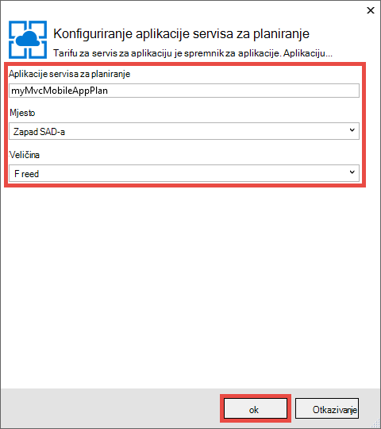
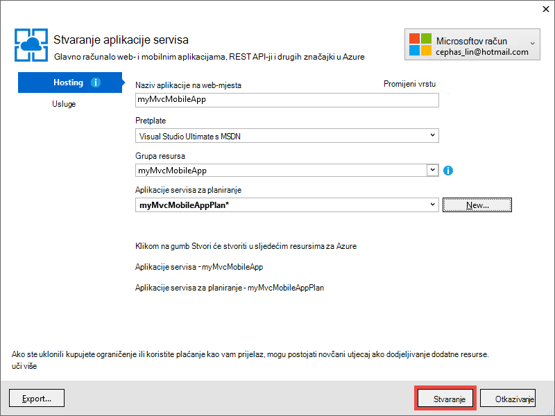

<properties 
    pageTitle="Implementacija u ASP.NET MVC 5 mobilnih web app u aplikacije servisa za Azure" 
    description="Praktični vodič ručica za implementaciju web-aplikacijama za aplikacije servisa za Azure pomoću značajki za mobilne uređaje u ASP.NET MVC 5 web-aplikaciji." 
    services="app-service" 
    documentationCenter=".net" 
    authors="cephalin" 
    manager="wpickett" 
    editor="jimbe"/>

<tags 
    ms.service="app-service" 
    ms.workload="na" 
    ms.tgt_pltfrm="na" 
    ms.devlang="dotnet" 
    ms.topic="article" 
    ms.date="01/12/2016" 
    ms.author="cephalin;riande"/>

# Implementacija u ASP.NET MVC 5 mobilnih web app u aplikacije servisa za Azure

Pomoću ovog praktičnog vodiča će usvojili osnove omogućuje stvaranje web-aplikacije programa ASP.NET MVC 5 koja je prikladna za mobile i implementacija aplikacije servisa za Azure. U ovom ćete praktičnom vodiču, potreban vam je [Visual Studio Express 2013 za web-mjesto] [ Visual Studio Express 2013] ili professional plus Visual Studio ako već imate koji. Koristite [Visual Studio 2015] , ali razlikovat će se snimke zaslona, a morate koristiti predloške 4.x ASP.NET.

[AZURE.INCLUDE [create-account-and-websites-note](../../includes/create-account-and-websites-note.md)]

## Što ćete sastavljanje

Za ovaj vodič ćete dodati značajki za mobilne uređaje jednostavan aplikacijom konferencijski stavku koja je u [projektu starter][StarterProject]. Sljedeće snimku zaslona prikazuje ASP.NET sesije u dovršenom računala, kao što se vidi u pregledniku emulator u alatima za razvojne inženjere za Internet Explorer 11 F12.

![][FixedSessionsByTag]

Možete koristiti [Alat za Fiddler] i Alati za razvojne inženjere za Internet Explorer 11 F12[ Fiddler] radi ispravljanja pogrešaka aplikacije. 

## Znanja i vještine ćete saznati

Evo saznat ćete:

-   Kako koristiti Visual Studio 2013 da biste objavili izravno na web-aplikacijama web-aplikaciju u aplikacije servisa za Azure.
-   Kako predložaka ASP.NET MVC 5 koristite framework samopokretanja programa CSS-a da biste poboljšali prikaz na mobilnim uređajima
-   Upute za stvaranje prikaza namijenjene mobilnoj ciljne određene mobilni preglednici, kao što su iPhone i Android
-   Kako stvoriti odredište prikaze (prikaze koji odgovaraju za različite preglednike putem uređaja)

## Postavljanje okruženja za razvoj

Postavite razvojno okruženje instalacijom Azure SDK za .NET 2.5.1 ili noviji. 

1. Da biste instalirali Azure SDK za .NET, kliknite vezu u nastavku. Ako nemate instaliran još Visual Studio 2013, instalirat će se veza. Pomoću ovog praktičnog vodiča zahtijeva Visual Studio 2013. [Azure SDK za Visual Studio 2013][AzureSDKVs2013]
1. U prozoru Web platformu Installer kliknite **Instaliraj** i nastaviti s instalacijom.

Već, morat ćete preglednika za mobilne uređaje emulator. Funkcioniraju nešto od sljedećeg:

-   Preglednik Emulator u [alatima za razvojne inženjere za Internet Explorer 11 F12] [ EmulatorIE11] (koja se koristi u svim snimke zaslona mobilnog preglednika). Sadrži unaprijed postavljeno niz za korisnički agent za Windows Phone 8, Windows Phone 7 i Apple iPad.
-   Preglednik Emulator u [Google Chrome DevTools][EmulatorChrome]. Sadrži unaprijed postavljeno za brojne uređaje sa sustavom Android, kao i Apple iPhone, Apple iPad i Amazon Kindle Fire. Također, oponaša dodirom događaja.
-   [Mobilni Emulator Opera][EmulatorOpera]

Visual Studio projekti s C\# izvornog koda dostupnih da bi se podudarala u ovoj se temi:

-   [Preuzimanje Starter projekta][StarterProject]
-   [Dovršeno preuzimanje projekta][CompletedProject]

##Implementacija starter projekta programa Azure web App

1.  Preuzimanje aplikacije konferencijski unos [starter projekta][StarterProject].

2.  U programu Windows Explorer desnom tipkom miša kliknite preuzetu datoteku ZIP pa odaberite *Svojstva*.

3.  U dijaloškom okviru **Svojstva** odaberite gumb **Unblock** . (Deblokiranja sprječava sigurnosno upozorenje koji se pojavljuje kada pokušate koristiti *.zip* datoteku koju ste preuzeli s weba.)

4.  Desnom tipkom miša kliknite ZIP datoteku, a zatim odaberite **Izdvoji sve** da biste raspakiraj datoteku. 

5.  U Visual Studio, otvorite datoteku *C#\Mvc5Mobile.sln* .

6.  U pregledniku rješenja, desnom tipkom miša kliknite projekt, a zatim kliknite **Objavi**.

    ![][DeployClickPublish]

7.  Objavljivanje web-mjesto kliknite **Servis za aplikaciju Microsoft Azure**.

    ![][DeployClickWebSites]

8.  Ako već niste prijavljeni u Azure, kliknite **Dodaj račun**.

    ![][DeploySignIn]

9.  Slijedite upute da biste se prijavili na račun za Azure.

11. Dijaloški okvir aplikacije servisa za treba sada prikazati kao prijavljeni. Kliknite **Novo**.

    ![][DeployNewWebsite]  

12. U polje **Naziv aplikacije na web-mjesta** Navedite naziv prefiks jedinstveni aplikacije. Bit će svoje ime u potpunosti kvalificirana web app * &lt;prefiks >*. azurewebsites.net. Osim toga, odaberite ili navedite novi naziv grupe resursa u **grupu resursa**. Nakon toga kliknite **Novo** da biste stvorili novu tarifu aplikacije servisa.

    ![][DeploySiteSettings]

13. Konfiguriranje nove aplikacije servisa za tarife, a zatim kliknite **u redu**. 

    

13. U dijaloškom okviru Stvaranje aplikacije servisa kliknite **Stvori**.

     

13. Nakon na Azure resursi stvaraju, objavljivanje Web s postavkama za novu aplikaciju ispunit će se dijaloški okvir. Kliknite **Objavi**.

    ![][DeployPublishSite]

    Kada Visual Studio dovrši objavljivanje projekta starter Azure web-aplikaciju, otvorit će se preglednik za stolna računala da biste prikazali uživo web-aplikaciji.

14. Pokretanje sustava emulator preglednika za mobilne uređaje, kopirajte URL za aplikaciju konferencijski (*<prefix>*. azurewebsites.net) u emulator, pa kliknite gumb u gornjem desnom kutu i odaberite **Pregledaj prema oznaci**. Ako koristite Internet Explorer 11 kao zadani preglednik, samo želite upišite `F12`, zatim `Ctrl+8`, a zatim promijenite preglednika profila u **Sustavu Windows Phone**. Na donjoj slici prikazano u prikazu *AllTags* u okomitom usmjerenju (iz odabira **Pregled prema oznaci**).

    ![][AllTags]

>[AZURE.TIP] Dok možete ispraviti pogreške MVC 5 aplikacije iz programa Visual Studio, možete objaviti web-aplikaciju programa Azure ponovno da biste provjerili uživo web-aplikaciji izravno iz mobilnog preglednika ili pregledniku emulator.

Prikaz je vrlo čitljiv na mobilnom uređaju. Već također možete vidjeti neke vizualne efekte primijenjene pomoću framework samopokretanja programa CSS-a.
Kliknite vezu **ASP.NET** .

![][SessionsByTagASP.NET]

Prikaz oznaka ASP.NET je već Zumiranje na zaslon samopokretanja programa radi za vas automatski. Međutim, možete poboljšati ovaj prikaz da biste bolje odgovara preglednika za mobilne uređaje. Na primjer, stupac **Datum** je teško čitati. Kasnije u ovom praktičnom vodiču ćete promijenite prikaz *AllTags* da biste ga prikladna za mobile.

##Framework Samopokretanje CSS-a

Novost u MVC 5 predložak je ugrađenu Samopokretanje podršku. Već ste vidjeti kako ga odmah poboljšava u različitim prikazima u aplikaciji. Ako, na primjer, na navigacijskoj traci pri vrhu je automatski koji je moguće sažeti kada manja širinu preglednika. Na preglednik za stolna računala, pokušajte promjene veličine prozora preglednika, a zatim potražite u članku kako promjene na navigacijskoj traci njegov izgled i dojam. Ovo je na odredište web-dizajna koja je ugrađena u samopokretanja programa.

Da biste vidjeli kako će izgledati web-aplikaciji bez samopokretanja programa, otvorite *aplikacije\_pokretanje\\BundleConfig.cs* i komentar izvan retke koji sadrže *bootstrap.js* i *bootstrap.css*. Sljedeći kod prikazuje zadnje dvije izjave u `RegisterBundles` način nakon promjene:

     bundles.Add(new ScriptBundle("~/bundles/bootstrap").Include(
              //"~/Scripts/bootstrap.js",
              "~/Scripts/respond.js"));

    bundles.Add(new StyleBundle("~/Content/css").Include(
              //"~/Content/bootstrap.css",
              "~/Content/site.css"));

Pritisnite `Ctrl+F5` li pokrenuti aplikaciju.

Pogledajte je li koji je moguće sažeti na navigacijskoj traci sada samo običan Neuređeni popis. Ponovno kliknite **Pregledaj prema oznaci** , a zatim kliknite **ASP.NET**.
U prikazu za mobilne emulator vidjet ćete nakon što više nije već Zumiranje na zaslon, a morate pomaknuti stranu da biste vidjeli s desne strane tablice.

![][SessionsByTagASP.NETNoBootstrap]

Poništavanje promjene i osvježite preglednika za mobilne uređaje da biste potvrdili da je vraćena prikladna za mobilni prikaz.

Samopokretanja programa nije specifična za ASP.NET MVC 5, a možete iskoristiti prednost te značajke u bilo kojem web-aplikaciji. No sada je ne ugrađena u projekt predložak ASP.NET MVC 5, tako da se web-5 MVC aplikaciju možete iskoristiti samopokretanja programa prema zadanim postavkama.

Dodatne informacije o samopokretanja programa, idite na [samopokretanja programa] [ BootstrapSite] web-mjesta.

U sljedećem odjeljku vidjet ćete kako unijeti određene prikazi mobilnog preglednika.

##Zanemarivanje prikazi, rasporedima i djelomično prikazi

Za mobilni preglednici u pravilu za pojedinačne preglednika za mobilne uređaje ili bilo kojeg preglednika određene možete nadjačati bilo kojeg prikaza (uključujući izglede i djelomično prikaze). Da biste prikazali specifične za mobilni prikaz, možete kopirati datoteka prikaza i dodavanje *. Mobilni* naziv datoteke. Na primjer, da biste stvorili mobilni prikaz *indeks* , možete kopirati *Prikazi\\Home\\Index.cshtml* da biste *Prikazi\\Home\\Index.Mobile.cshtml*.

U ovom ćete odjeljku stvorit ćete datoteke namijenjene mobilnoj raspored.

Da biste započeli, kopirajte *Prikazi\\zajednički se koristi\\\_Layout.cshtml* da biste *Prikazi\\zajednički se koristi\\\_Layout.Mobile.cshtml*. Otvaranje * \_Layout.Mobile.cshtml* i promijenite naslov iz **Aplikacije MVC5** **MVC5 aplikacije (mobitel)**.

U svakom `Html.ActionLink` poziv na navigacijskoj traci, uklonite "Pregled po" u svaku vezu *ActionLink*. Sljedeći kod prikazuje se u dovršenom `<ul class="nav navbar-nav">` oznaku datoteke izgled mobilnim uređajima.

    <ul class="nav navbar-nav">
        <li>@Html.ActionLink("Home", "Index", "Home")</li>
        <li>@Html.ActionLink("Date", "AllDates", "Home")</li>
        <li>@Html.ActionLink("Speaker", "AllSpeakers", "Home")</li>
        <li>@Html.ActionLink("Tag", "AllTags", "Home")</li>
    </ul>

Kopiraj na *Prikazi\\Home\\AllTags.cshtml* datoteke *Prikazi\\Home\\AllTags.Mobile.cshtml*. Otvorite novu datoteku i promijenite u `<h2>` element "Oznake" da "oznake (M)":

    <h2>Tags (M)</h2>

Dođite do stranice oznaka pomoću preglednik za stolna računala i pomoću mobilnog preglednika emulator. Dva promjene koje ste unijeli prikazuju se emulator preglednika za mobilne uređaje (naslov s * \_Layout.Mobile.cshtml* i naslov s *AllTags.Mobile.cshtml*).

![][AllTagsMobile_LayoutMobile]

Nasuprot tome, nije promijenio prikaza radne površine (s naslovima iz * \_Layout.cshtml* i *AllTags.cshtml*).

![][AllTagsMobile_LayoutMobileDesktop]

##Stvaranje prikaza specifičnih za preglednik

Osim prikazima namijenjene mobilnoj i specifične za stolna računala, možete stvoriti prikaza za pojedinačne preglednik. Na primjer, možete stvoriti prikaze koji su posebno za Iphoneu ili Androidov preglednik. U ovom ćete odjeljku stvorit ćete rasporeda za preglednik za iPhone i iPhone verziju *AllTags* prikaz.

Otvorite datoteku *Global.asax* i dodati sljedeći kod na dno na `Application_Start` način.

    DisplayModeProvider.Instance.Modes.Insert(0, new DefaultDisplayMode("iPhone")
    {
        ContextCondition = (context => context.GetOverriddenUserAgent().IndexOf
            ("iPhone", StringComparison.OrdinalIgnoreCase) >= 0)
    });

Kod definira novi način prikaza pod nazivom "iPhone", koji će se uparuje protiv svaki dolazni zahtjev. Ako zahtjev za dolazne udovoljava uvjeta koje ste definirali (to jest, ako je korisnički agent sadrži niz "iPhone"), ASP.NET MVC će izgledati za prikaze čiji naziv sadrži sufiks "iPhone".

>[AZURE.NOTE] Prilikom dodavanja načina prikaza za mobilni specifične za preglednik, primjerice za iPhone i Android, provjerite da biste postavili prvi argument na `0` (umetnuti pri vrhu popisa) da biste bili sigurni način specifične za preglednik ima prednost pred mobilne predložak (*. Mobile.cshtml). Ako je mobilni predložak pri vrhu popisa umjesto toga, označit će se preko svrhu prikaz način rada (prvi ima prednost za podudaranje i mobilne predložak odgovaraju sve mobilne preglednike). 

U kodu, desnom tipkom miša kliknite `DefaultDisplayMode`, odaberite **Razrješavanje**, a zatim `using System.Web.WebPages;`. Time se dodaje referenca na `System.Web.WebPages` prostor naziva, što je where na `DisplayModeProvider` i `DefaultDisplayMode` vrste definiraju.

![][ResolveDefaultDisplayMode]

Osim toga, možete samo ručno dodati u sljedeći redak da biste na `using` dio datoteke.

    using System.Web.WebPages;

Spremite promjene. Kopiraj na *Prikazi\\zajednički se koristi\\\_Layout.Mobile.cshtml* datoteke *Prikazi\\zajednički se koristi\\\_Layout.iPhone.cshtml*. Otvorite novu datoteku, a zatim promijenite naslov s `MVC5 Application (Mobile)` za `MVC5 Application (iPhone)`.

Kopiraj na *Prikazi\\Home\\AllTags.Mobile.cshtml* datoteke *Prikazi\\Home\\AllTags.iPhone.cshtml*. U nove datoteke, promijenite u `<h2>` element s "oznake (M)" u "Oznake (iPhone)".

Pokrenite aplikaciju. Pokretanje preglednika za mobilne uređaje emulator, provjerite je li njegov korisnički agent postavljeno na "iPhone" i pregled *AllTags* prikaz. Ako koristite na emulator u alatima za razvojne inženjere za Internet Explorer 11 F12 konfigurirati emulacija ovako:

-   Preglednik profila = **Windows Phone**
-   Niz agenta korisnika = **Prilagođeno**
-   Prilagođenog niza = **Apple-iPhone5C1/1001.525**

Sljedeće snimka zaslona prikazuje *AllTags* prikaz prikazati emulator u alate za razvojne inženjere Internet Explorer 11 F12 s nizom agent korisnička (to je niz iPhone 5 C korisničkog agenta).

![][AllTagsIPhone_LayoutIPhone]

U pregledniku mobitela, odaberite vezu za **zvučnike** . Jer nema mobilni prikaz (*AllSpeakers.Mobile.cshtml*), zadani prikaz zvučnika (*AllSpeakers.cshtml*) prikazivanju pomoću prikaza izgled mobilnim uređajima (*\_Layout.Mobile.cshtml*). Kao što je prikazano ispod naslova **MVC5 aplikacije (mobitel)** definirana je u * \_Layout.Mobile.cshtml*.

![][AllSpeakers_LayoutMobile]

Zadani prikaz (koji nisu mobitel) iz vizualizacije u raspored za mobilne globalno možete onemogućiti tako da postavite `RequireConsistentDisplayMode` da biste `true` u na *Prikazi\\\_ViewStart.cshtml* datoteku, ovako:

    @{
        Layout = "~/Views/Shared/_Layout.cshtml";
        DisplayModeProvider.Instance.RequireConsistentDisplayMode = true;
    }

Kada `RequireConsistentDisplayMode` postavljen na `true`, izgled na mobilnim uređajima (*\_Layout.Mobile.cshtml*) se koriste isključivo radi mobilnih prikaza (odnosno prilikom prikaza obrasca za * **ViewName**. Mobile.cshtml*). Možda ćete morati postaviti `RequireConsistentDisplayMode` da biste `true` Ako raspored za mobilne ne funkcionira s svoje prikaze koji nisu mobile. Snimka zaslona koja se nalazi ispod prikazuje način stranici *zvučnika* iscrtavanja kada `RequireConsistentDisplayMode` postavljen na `true` (bez niz "(mobitel)" u navigacijsku traku pri vrhu).

![][AllSpeakers_LayoutMobileOverridden]

Način ujednačenog prikaza u posebnom prikazu možete onemogućiti tako da postavite `RequireConsistentDisplayMode` da biste `false` u datoteci za prikaz. Sljedeće oznake u na *Prikazi\\Home\\AllSpeakers.cshtml* datoteke skupove `RequireConsistentDisplayMode` da biste `false`:

    @model IEnumerable<string>

    @{
        ViewBag.Title = "All speakers";
        DisplayModeProvider.Instance.RequireConsistentDisplayMode = false;
    }

U ovom odjeljku smo vidjeli kako stvoriti mobilne izglede i prikaze i stvaranju izgleda i prikaza za određene uređajima kao što su Iphoneu.
Glavni prednost framework samopokretanja programa CSS-a je odredište raspored, što znači da jedan list stilova mogu se primijeniti na radnu površinu, telefona i tableta preglednika da biste stvorili dosljedan izgled i dojam. U sljedećem odjeljku vidjet ćete kako odražava samopokretanja programa da biste stvorili mobile prilagođene prikaze.

##Poboljšanja popisa zvučnika

Kao što je koju ste upravo vidjeli prikaz *zvučnika* je čitati, ali veze su mali i teško dodirnite na mobilnom uređaju. U ovom odjeljku ćete unesete prikaz *AllSpeakers* mobile prikladnu koji prikazuje velikih, jednostavno dodirnite veze, a sadrži okvir za pretraživanje da biste brzo pronašli zvučnike.

Stila Samopokretanje [povezani popis grupe][] možete koristiti da biste poboljšali prikaz *zvučnika* . U *Prikazi\\Home\\AllSpeakers.cshtml*, zamijenite sadržaj datoteke Platforma Razor kod u nastavku.

     @model IEnumerable<string>

    @{
        ViewBag.Title = "All Speakers";
    }

    <h2>Speakers</h2>

    

        @foreach (var speaker in Model)
        {
            @Html.ActionLink(speaker, "SessionsBySpeaker", new { speaker }, new { @class = "list-group-item" })
        }
    

Na `class="list-group"` atribut u `
` oznaka primjenjuje stil Samopokretanje popisa i `class="input-group-item"` atribut Samopokretanje popisa stavku stil primjenjuje se na sve veze.

Osvježavanje preglednika za mobilne uređaje. Ažurirani prikaz izgleda ovako:

![][AllSpeakersFixed]

Stil Samopokretanje [povezani popis grupu][] čini cijeli okvir za svaku vezu koji je moguće kliknuti, što je mnogo boljeg korisnika. Prebacivanje na prikaz za stolna računala i pridržavajte se dosljedan izgled i dojam.

![][AllSpeakersFixedDesktop]

Iako je poboljšana prikaza mobilnog preglednika, teško je kretanje dugačak popis zvučnike. Samopokretanja programa ne nudi u pretraživanje filtar funkcionalnost Izlaz u-tvorničke, ali možete ga dodati pomoću nekoliko redaka koda. Najprije će dodati okvir za pretraživanje u prikazu zatim priključiti JavaScript koda za funkciju filtar. U *Prikazi\\Home\\AllSpeakers.cshtml*, dodavanje u \<obrasca\> označavanje tek nakon što instalirate na \<h2\> oznaku, kao što je prikazano u nastavku:

    @model IEnumerable<string>

    @{
        ViewBag.Title = "All Speakers";
    }

    <h2>Speakers</h2>

    <form class="input-group">
        
        <input type="text" class="form-control" placeholder="Search speaker">
    </form>
     
    

        @foreach (var speaker in Model)
        {
            @Html.ActionLink(speaker, 
                             "SessionsBySpeaker", 
                             new { speaker }, 
                             new { @class = "list-group-item" })
        }
    

Primijetit ćete da se `<form>` i `<input>` oznake obje sadrže Samopokretanje na njih primijeniti stilove. Na `` element dodaje Samopokretanje [glyphicon][] u okvir za pretraživanje.

U mapi *skripte* dodati JavaScript datoteku pod nazivom *filter.js*. Otvorite datoteku i zalijepiti ga sljedeći kod:

    $(function () {

        // reset the search form when the page loads
        $("form").each(function () {
            this.reset();
        });

        // wire up the events to the <input> element for search/filter
        $("input").bind("keyup change", function () {
            var searchtxt = this.value.toLowerCase();
            var items = $(".list-group-item");

            // show all speakers that begin with the typed text and hide others
            for (var i = 0; i < items.length; i++) {
                var val = items[i].text.toLowerCase();
                val = val.substring(0, searchtxt.length);
                if (val == searchtxt) {
                    $(items[i]).show();
                }
                else {
                    $(items[i]).hide();
                }
            }
        });
    });

Morate uključiti filter.js u vašem registrirani objedinjuje. Otvaranje *aplikacije\_pokretanje\\BundleConfig.cs* i promijenite prvi objedinjuje. Promjena prvog `bundles.Add` izjava (za paket **jquery** ) da biste uključili *skripte\\filter.js*, na sljedeći način:

     bundles.Add(new ScriptBundle("~/bundles/jquery").Include(
                "~/Scripts/jquery-{version}.js",
                "~/Scripts/filter.js"));

Paket **jquery** već prikazati pomoću zadanog * \_izgleda* prikaz. Noviju verziju, možete koristiti isti JavaScript kod da biste primijenili filtar funkcionalnost druge prikaze popisa.

Osvježavanje preglednika za mobilne uređaje i prijeđite na prikaz *AllSpeakers* . U okvir za pretraživanje upišite "sc". Na popisu zvučnika sada bi trebalo filtrirati prema niz za pretraživanje.

![][AllSpeakersFixedSearchBySC]

##Poboljšanja popisa oznaka

Kao što je prikaz *zvučnika* prikaz *oznaka* je čitati, ali veze su mali i teško dodirnite na mobilnom uređaju. Prikaz *oznaka* može riješiti na isti način kao i rješavanje prikaz *zvučnika* , ako koristite kod promjene ranije, ali sa sljedećim `Html.ActionLink` sintaksa način u *Prikazi\\Home\\AllTags.cshtml*:

    @Html.ActionLink(tag, 
                     "SessionsByTag", 
                     new { tag }, 
                     new { @class = "list-group-item" })

Osvježiti preglednik za stolna računala izgleda na sljedeći način:

![][AllTagsFixedDesktop]

I osvježiti mobilnog preglednika izgleda ovako: 

![][AllTagsFixed]

>[AZURE.NOTE] Ako primijetite da izvorno oblikovanje popisa je i dalje preglednika za mobilne uređaje i pitate što se dogodilo s vašeg bolje Samopokretanje stil, to je artefakt svoje ranije akcije da biste stvorili mobilnih određene prikaza. Međutim, sada kada koristite framework samopokretanja programa CSS-a da biste stvorili odredište web-dizajna, otvorite glave i uklanjanje tih namijenjene mobilnoj prikaza i prikaza izgleda specifične za mobilne. Nakon što ste to učinili, osvježene preglednika za mobilne uređaje prikazat će Samopokretanje stil.

##Poboljšanja popisa datuma

Prikaz *datuma* možete poboljšati kao poboljšani prikazi *zvučnika* i *oznake* ako koristite kod promjene ranije, ali sa sljedećim `Html.ActionLink` sintaksa način u *Prikazi\\Home\\AllDates.cshtml*:

    @Html.ActionLink(date.ToString("ddd, MMM dd, h:mm tt"), 
                     "SessionsByDate", 
                     new { date }, 
                     new { @class = "list-group-item" })

Dobit će prikaz osvježene preglednika za mobilne uređaje ovako:

![][AllDatesFixed]

Dodatno možete poboljšati prikaz *datuma* zakazivanjem vrijednosti datuma i vremena prema datumu. To se može učiniti s stil Samopokretanje [ploče][] . Zamjena sadržaj na *Prikazi\\Home\\AllDates.cshtml* datoteku s sljedeći kod:

    @model IEnumerable<DateTime>

    @{
        ViewBag.Title = "All Dates";
    }

    <h2>Dates</h2>

    @foreach (var dategroup in Model.GroupBy(x=>x.Date))
    {
        

            

                @dategroup.Key.ToString("ddd, MMM dd")
            

            

                @foreach (var date in dategroup)
                {
                    @Html.ActionLink(date.ToString("h:mm tt"), 
                                     "SessionsByDate", 
                                     new { date }, 
                                     new { @class = "list-group-item" })
                }
            

        

    }

Kod stvara posebnu `
` oznaka za svaki distinct datum na popisu, a kao prije koristi [povezani popis grupa][] za odgovarajući veze. Evo kako preglednika za mobilne uređaje izgleda kada se pokreće kod:

![][AllDatesFixed2]

Prijeđite u preglednik za stolna računala. Ponovno, imajte na umu dosljednog izgleda.

![][AllDatesFixed2Desktop]

##Poboljšanje prikaza SessionsTable

U ovom odjeljku ćete učiniti prikazom *SessionsTable* više mobile prikladna za. Ta promjena se širi prethodne promjene.

U pregledniku mobitela, dodirnite gumb **oznake** , a zatim unesite `asp` u okvir za pretraživanje.

![][AllTagsFixedSearchByASP]

Dodirnite **ASP.NET** vezu.

![][SessionsTableTagASP.NET]

Kao što vidite, prikaz se oblikuje kao tablica koju trenutno namijenjen je prikazati u preglednik za stolna računala. Međutim, nije malo je teško čitati na preglednika za mobilne uređaje. Da biste riješili taj problem, otvorite *Prikazi\\Home\\SessionsTable.cshtml* , a zatim Zamijeni sadržaj datoteke s sljedeći kod:

    @model IEnumerable<Mvc5Mobile.Models.Session>

    <h2>@ViewBag.Title</h2>

    

        

            @foreach (var session in Model)
            {
                

                    

                        @Html.ActionLink(session.Title, 
                                         "SessionByCode", 
                                         new { session.Code }, 
                                         new { @class="list-group-item active" })
                        

                            

                                @Html.Partial("_SpeakersLinks", session)
                            

                            

                                @session.DateText
                            

                            

                                @Html.Partial("_TagsLinks", session)
                            

                        

                    

                

            }
        

    

Kod ne 3 stvari:

-   Koristi Samopokretanje [prilagođenog popisa povezanih grupe][] da biste oblikovali podatke sesiju okomito da bi se u svim tim informacijama čitati mobilnog preglednika (pomoću klase kao što je popis grupa-stavke-teksta)
-   pripada [rešetku sustava][] raspored, tako da se stavke sesiju vodoravno tijek u preglednik za stolna računala i okomito preglednika za mobilne uređaje (pomoću klase širina-md-4)
-   koristi [odredište uslužni programi][] da biste sakrili oznake sesiju kada se prikazuje u mobilnom pregledniku (pomoću skrivene o. klase)

Možete i dodirnuti naslov vezu da biste prešli na odgovarajući sesiju. Na slici u nastavku odražava promjene kod.

![][FixedSessionsByTag]

Sustav Samopokretanje rešetke koje ste primijenili automatski slaže sesije okomito u pregledniku mobitela. Osim toga, imajte na umu da oznake nisu prikazani. Prijeđite u preglednik za stolna računala.

![][SessionsTableFixedTagASP.NETDesktop]

U preglednik za stolna računala, imajte na umu da oznake prikazat će se. Osim toga, vidjet ćete da sustav Samopokretanje rešetke koje ste primijenili slaže stavke sesije u dva stupca. Ako biste povećali web-pregledniku, vidjet ćete raspored mijenja se u tri stupca.

##Poboljšanje prikaza SessionByCode

Na kraju, samostalno rješavanje *SessionByCode* prikaz da biste ga prikladna za mobile.

U pregledniku mobitela, dodirnite gumb **oznake** , a zatim unesite `asp` u okvir za pretraživanje.

![][AllTagsFixedSearchByASP]

Dodirnite vezu **ASP.NET** . Prikazuju se sesije za oznaku ASP.NET.

![][FixedSessionsByTag]

Odaberite vezu za **izgradnju jednoj aplikaciji stranice s ASP.NET i AngularJS** .

![][SessionByCode3-644]

Zadani prikaz za stolna računala je u redu, ali možete poboljšati izgled jednostavno pomoću neke komponente GUI samopokretanja programa.

Otvaranje *Prikazi\\Home\\SessionByCode.cshtml* i zamijeniti sadržaj sljedeće oznake:

    @model Mvc5Mobile.Models.Session

    @{
        ViewBag.Title = "Session details";
    }
    <h3>@Model.Title (@Model.Code)</h3>
    

        <strong>@Model.DateText</strong> in <strong>@Model.Room</strong>
    

    

        

            Speakers
        

        @foreach (var speaker in Model.Speakers)
        {
            @Html.ActionLink(speaker, 
                             "SessionsBySpeaker", 
                             new { speaker }, 
                             new { @class="panel-body" })
        }
    

    
@Model.Abstract

    

        

            Tags
        

        @foreach (var tag in Model.Tags)
        {
            @Html.ActionLink(tag, 
                             "SessionsByTag", 
                             new { tag }, 
                             new { @class = "panel-body" })
        }
    

Novi oznake koristi Samopokretanje ploče stila da biste poboljšali mobilni prikaz. 

Osvježavanje preglednika za mobilne uređaje. Na sljedećoj slici odražava kod promjene koje ste upravo unijeli:

![][SessionByCodeFixed3-644]

## Prelamanje prema gore i pregled

Pomoću ovog praktičnog vodiča sadrži koje prikazuju kako koristiti ASP.NET MVC 5 za razvoj prikladna za mobilne web-aplikacije. To obuhvaća:

-   Implementacija aplikacije ASP.NET MVC 5 na web-aplikaciju programa aplikacije servisa
-   Korištenje samopokretanja programa da biste stvorili odredište web-izgled u aplikaciji MVC 5
-   Zanemarivanje raspored, prikazima i djelomično prikazi globalno i za pojedinačne prikaz
-   Izgled kontrola i djelomično nadjačati pomoću provođenja na `RequireConsistentDisplayMode` svojstvo
-   Stvaranje prikaza koji određenim preglednicima, kao što je preglednik za iPhone
-   Primjena Samopokretanje stil u kodu platforma Razor

## Vidi također

-   [9 osnovna načela odredište web-dizajna](http://blog.froont.com/9-basic-principles-of-responsive-web-design/)
-   [Samopokretanja programa][BootstrapSite]
-   [Službeni Samopokretanje bloga][]
-   [Twitter Samopokretanje vodič iz vodiča Republika][]
-   [Samopokretanje Playground][]
-   [W3C preporuke Web mobilne aplikacije najbolje prakse][]
-   [W3C kandidata preporuke za upite za medijske sadržaje][]

## Što se promijenilo
* Vodič za promjenu iz aplikacije servisa za web-mjestima potražite u članku: [aplikacije servisa za Azure i Its utjecaj na postojećim Azure servisima](http://go.microsoft.com/fwlink/?LinkId=529714)

<!-- Internal Links -->
[Deploy the starter project to an Azure web app]: #bkmk_DeployStarterProject
[Bootstrap CSS Framework]: #bkmk_bootstrap
[Override the Views, Layouts, and Partial Views]: #bkmk_overrideviews
[Create Browser-Specific Views]:#bkmk_browserviews
[Improve the Speakers List]: #bkmk_Improvespeakerslist
[Improve the Tags List]: #bkmk_improvetags
[Improve the Dates List]: #bkmk_improvedates
[Improve the SessionsTable View]: #bkmk_improvesessionstable
[Improve the SessionByCode View]: #bkmk_improvesessionbycode

<!-- External Links -->
[Visual Studio Express 2013]: http://www.visualstudio.com/downloads/download-visual-studio-vs#d-express-web
[Visual Studio 2015.]: https://www.visualstudio.com/downloads/download-visual-studio-vs
[AzureSDKVs2013]: http://go.microsoft.com/fwlink/p/?linkid=323510&clcid=0x409
[Fiddler]: http://www.fiddler2.com/fiddler2/
[EmulatorIE11]: http://msdn.microsoft.com/library/ie/dn255001.aspx
[EmulatorChrome]: https://developers.google.com/chrome-developer-tools/docs/mobile-emulation
[EmulatorOpera]: http://www.opera.com/developer/tools/mobile/
[StarterProject]: http://go.microsoft.com/fwlink/?LinkID=398780&clcid=0x409
[CompletedProject]: http://go.microsoft.com/fwlink/?LinkID=398781&clcid=0x409
[BootstrapSite]: http://getbootstrap.com/
[WebPIAzureSdk23NetVS13]: ./media/web-sites-dotnet-deploy-aspnet-mvc-mobile-app/WebPIAzureSdk23NetVS13.png
[povezani popis grupa]: http://getbootstrap.com/components/#list-group-linked
[glyphicon]: http://getbootstrap.com/components/#glyphicons
[ploče]: http://getbootstrap.com/components/#panels
[Prilagođeni popis povezanih grupe]: http://getbootstrap.com/components/#list-group-custom-content
[Rešetka sustava]: http://getbootstrap.com/css/#grid
[odredište uslužni programi]: http://getbootstrap.com/css/#responsive-utilities
[Službeni Samopokretanje bloga]: http://blog.getbootstrap.com/
[Twitter Samopokretanje vodič iz vodiča Republika]: http://www.tutorialrepublic.com/twitter-bootstrap-tutorial/
[Samopokretanje Playground]: http://www.bootply.com/
[W3C preporuke Web mobilne aplikacije najbolje prakse]: http://www.w3.org/TR/mwabp/
[W3C kandidata preporuke za upite za medijske sadržaje]: http://www.w3.org/TR/css3-mediaqueries/

<!-- Images -->
[DeployClickPublish]: ./media/web-sites-dotnet-deploy-aspnet-mvc-mobile-app/deploy-to-azure-website-1.png
[DeployClickWebSites]: ./media/web-sites-dotnet-deploy-aspnet-mvc-mobile-app/deploy-to-azure-website-2.png
[DeploySignIn]: ./media/web-sites-dotnet-deploy-aspnet-mvc-mobile-app/deploy-to-azure-website-3.png
[DeployUsername]: ./media/web-sites-dotnet-deploy-aspnet-mvc-mobile-app/deploy-to-azure-website-4.png
[DeployPassword]: ./media/web-sites-dotnet-deploy-aspnet-mvc-mobile-app/deploy-to-azure-website-5.png
[DeployNewWebsite]: ./media/web-sites-dotnet-deploy-aspnet-mvc-mobile-app/deploy-to-azure-website-6.png
[DeploySiteSettings]: ./media/web-sites-dotnet-deploy-aspnet-mvc-mobile-app/deploy-to-azure-website-7.png
[DeployPublishSite]: ./media/web-sites-dotnet-deploy-aspnet-mvc-mobile-app/deploy-to-azure-website-8.png
[MobileHomePage]: ./media/web-sites-dotnet-deploy-aspnet-mvc-mobile-app/mobile-home-page.png
[FixedSessionsByTag]: ./media/web-sites-dotnet-deploy-aspnet-mvc-mobile-app/SessionsByTag-ASP.NET-Fixed.png
[AllTags]: ./media/web-sites-dotnet-deploy-aspnet-mvc-mobile-app/AllTags.png
[SessionsByTagASP.NET]: ./media/web-sites-dotnet-deploy-aspnet-mvc-mobile-app/SessionsByTag-ASP.NET.png
[SessionsByTagASP.NETNoBootstrap]: ./media/web-sites-dotnet-deploy-aspnet-mvc-mobile-app/SessionsByTag-ASP.NET-NoBootstrap.png
[AllTagsMobile_LayoutMobile]: ./media/web-sites-dotnet-deploy-aspnet-mvc-mobile-app/AllTagsMobile-_LayoutMobile.png
[AllTagsMobile_LayoutMobileDesktop]: ./media/web-sites-dotnet-deploy-aspnet-mvc-mobile-app/AllTagsMobile-_LayoutMobile-Desktop.png
[ResolveDefaultDisplayMode]: ./media/web-sites-dotnet-deploy-aspnet-mvc-mobile-app/Resolve-DefaultDisplayMode.png
[AllTagsIPhone_LayoutIPhone]: ./media/web-sites-dotnet-deploy-aspnet-mvc-mobile-app/AllTagsIPhone-_LayoutIPhone.png
[AllSpeakers_LayoutMobile]: ./media/web-sites-dotnet-deploy-aspnet-mvc-mobile-app/AllSpeakers-_LayoutMobile.png
[AllSpeakers_LayoutMobileOverridden]: ./media/web-sites-dotnet-deploy-aspnet-mvc-mobile-app/AllSpeakers-_LayoutMobile-Overridden.png
[AllSpeakersFixed]: ./media/web-sites-dotnet-deploy-aspnet-mvc-mobile-app/AllSpeakers-Fixed.png
[AllSpeakersFixedDesktop]: ./media/web-sites-dotnet-deploy-aspnet-mvc-mobile-app/AllSpeakers-Fixed-Desktop.png
[AllSpeakersFixedSearchBySC]: ./media/web-sites-dotnet-deploy-aspnet-mvc-mobile-app/AllSpeakers-Fixed-SearchBySC.png
[AllTagsFixedDesktop]: ./media/web-sites-dotnet-deploy-aspnet-mvc-mobile-app/AllTags-Fixed-Desktop.png 
[AllTagsFixed]: ./media/web-sites-dotnet-deploy-aspnet-mvc-mobile-app/AllTags-Fixed.png
[AllDatesFixed]: ./media/web-sites-dotnet-deploy-aspnet-mvc-mobile-app/AllDates-Fixed.png
[AllDatesFixed2]: ./media/web-sites-dotnet-deploy-aspnet-mvc-mobile-app/AllDates-Fixed2.png
[AllDatesFixed2Desktop]: ./media/web-sites-dotnet-deploy-aspnet-mvc-mobile-app/AllDates-Fixed2-Desktop.png
[AllTagsFixedSearchByASP]: ./media/web-sites-dotnet-deploy-aspnet-mvc-mobile-app/AllTags-Fixed-SearchByASP.png
[SessionsTableTagASP.NET]: ./media/web-sites-dotnet-deploy-aspnet-mvc-mobile-app/SessionsTable-Tag-ASP.NET.png
[SessionsTableFixedTagASP.NETDesktop]: ./media/web-sites-dotnet-deploy-aspnet-mvc-mobile-app/SessionsTable-Fixed-Tag-ASP.NET-Desktop.png
[SessionByCode3-644]: ./media/web-sites-dotnet-deploy-aspnet-mvc-mobile-app/SessionByCode-3-644.png
[SessionByCodeFixed3-644]: ./media/web-sites-dotnet-deploy-aspnet-mvc-mobile-app/SessionByCode-Fixed-3-644.png
 
