<properties
    pageTitle="Implementacija aplikacije ASP.NET Azure aplikacije servisa za korištenje Visual Studio | Microsoft Azure"
    description="Saznajte kako implementirati programa project web ASP.NET web App na servisu Azure aplikacije pomoću Visual Studio."
    services="app-service\web"
    documentationCenter=".net"
    authors="tdykstra"
    manager="wpickett"
    editor=""/>

<tags
    ms.service="app-service-web"
    ms.workload="web"
    ms.tgt_pltfrm="na"
    ms.devlang="dotnet"
    ms.topic="get-started-article"
    ms.date="07/22/2016"
    ms.author="rachelap"/>

# Implementacija web-aplikaciju programa ASP.NET servisa Azure aplikacije pomoću Visual Studio

[AZURE.INCLUDE [tabs](../../includes/app-service-web-get-started-nav-tabs.md)]

## Pregled

Pomoću ovog praktičnog vodiča prikazuje kako implementirati ASP.NET web-aplikaciju za [web app u aplikacije servisa za Azure](app-service-web-overview.md) pomoću Visual Studio 2015.

Vodič pretpostavlja da ste u ASP.NET programer koji sadrži bez prethodne doživljaj Azure. Kada završite, imat ćete jednostavan web-aplikaciju prema gore i pokretanje u oblaku.

Ćete saznati:

* Upute za stvaranje nove aplikacije servisa za web-aplikacijama prilikom stvaranja novog projekta web u Visual Studio.
* Upute za implementaciju web projekta programa aplikacije servisa za web-aplikaciju pomoću Visual Studio.

Dijagram prikazuje radnje u ovom praktičnom vodiču.

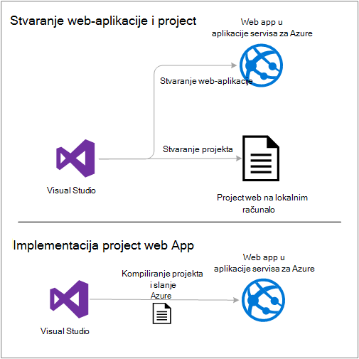

Na kraju vodič, u odjeljku [Otklanjanje poteškoća](#troubleshooting) daje ideja o tome što učiniti ako nešto ne funkcionira i odjeljak [daljnji koraci](#next-steps) nalaze veze na druge vodiče koji odlaze dubina više o korištenju aplikacije servisa za Azure.

Budući da je vodič za početak rada, project web koji se prikazuje kako implementirati je jednostavne one koje ne koristite bazu podataka i nema ugrađenu provjeru autentičnosti ili autorizacije. Veze na dodatne teme implementaciju, potražite u članku [Kako implementirati Azure web-aplikaciju programa](web-sites-deploy.md).

Osim vrijeme potrebno za instalaciju Azure SDK za .NET, pomoću ovog praktičnog vodiča se oko 10 do 15 minuta da biste dovršili.

## Preduvjeti

* Vodič pretpostavlja da ste radili s ASP.NET MVC i Visual Studio. Ako vam je potrebna Uvod, potražite u članku [Uvod u ASP.NET MVC 5](http://www.asp.net/mvc/overview/getting-started/introduction/getting-started).

* Potreban vam je račun za Azure. Možete [otvoriti besplatan račun za Azure](/pricing/free-trial/?WT.mc_id=A261C142F) ili [pogodnosti pretplatnika aktivirati Visual Studio](/pricing/member-offers/msdn-benefits-details/?WT.mc_id=A261C142F). 

    Ako želite započeti s aplikacije servisa za Azure prije registracije za račun za Azure, idite na [Pokušajte aplikacije servisa](http://go.microsoft.com/fwlink/?LinkId=523751). Postoji možete stvoriti aplikaciju za short-lived starter u aplikacije servisa za – bez kreditne kartice potrebna, a ne preuzete obveze.

## Postavljanje okruženja za razvoj

Vodič napisan za Visual Studio 2015 s [Azure SDK za .NET](../dotnet-sdk.md) 2.9 ili noviji. 

* [Preuzmite najnovije Azure SDK za Visual Studio 2015](http://go.microsoft.com/fwlink/?linkid=518003). SDK instalira Visual Studio 2015 ako već nemate.

    >[AZURE.NOTE] Ovisno o tome koliko ovisnosti SDK već imate na računalu, instalacije SDK može potrajati, od nekoliko minuta pola sata ili više.

Ako imate Visual Studio 2013 i radije koristite, možete ga [Preuzmite najnovije Azure SDK za Visual Studio 2013](http://go.microsoft.com/fwlink/?LinkID=324322). Neke zaslonima možda izgleda drugačije od ilustracije.

## Konfiguriranje novi projekt web

Sljedeći je korak da biste stvorili web projekta u Visual Studio i web-aplikacijama u servisu Azure aplikacije. U ovom odjeljku vodiča za konfiguriranje novi projekt web. 

1. Otvorite Visual Studio 2015.

2. Kliknite **Datoteka > novo > projekta**.

3. U dijaloškom okviru **Novi projekt** kliknite **Visual C# > Web > ASP.NET web-aplikacije**.

3. Provjerite je li **.NET Framework 4.5.2** kao framework cilj.

4.  [Azure aplikacije uvida](../application-insights/app-insights-overview.md) nadzire web aplikacije za dostupnost, performanse i korištenje. Prema vremenu zadani prve Stvaranje projekta web nakon instalacije Visual Studio je potvrđen okvir **Dodaj aplikaciju uvid u projekt** . Ako je odabran, ali ne želite da biste isprobali uvida aplikacije, poništite potvrdni okvir.

4. Naziv aplikacije **MyExample**, a zatim kliknite **u redu**.

    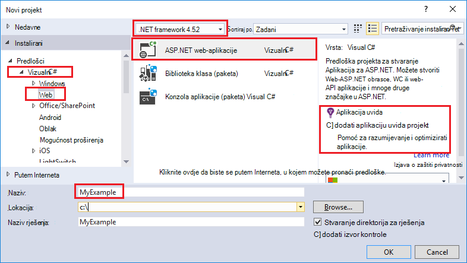

5. U dijaloškom okviru **Novi projekt ASP.NET** odaberite **MVC** predložak, a zatim **Promjena provjere autentičnosti**.

    Za ovaj vodič implementirati programa project web ASP.NET MVC. Ako želite da biste saznali kako uvesti projekt programa API servisa platforme ASP.NET Web, u odjeljku [sljedeće korake](#next-steps) . 

    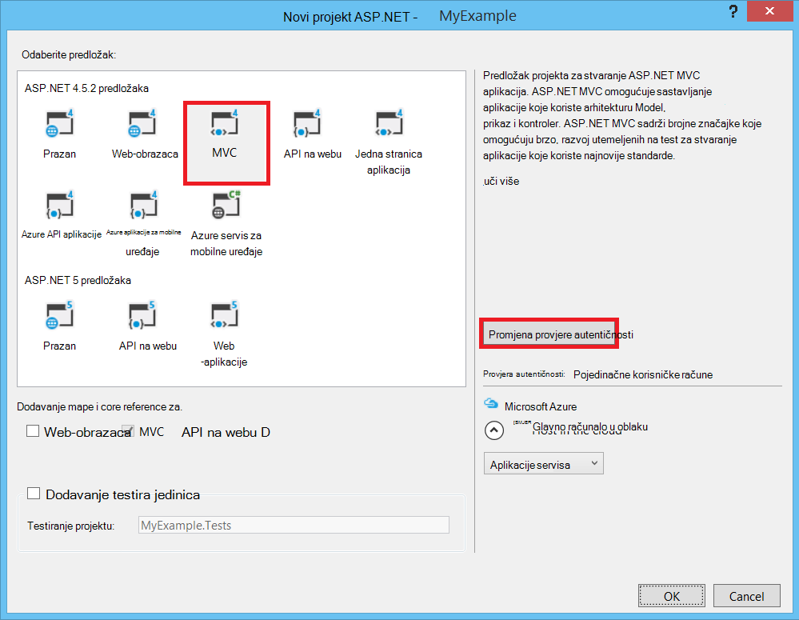

6. U dijaloškom okviru **Promjena provjere autentičnosti** kliknite **Bez provjere autentičnosti**, a zatim kliknite **u redu**.

    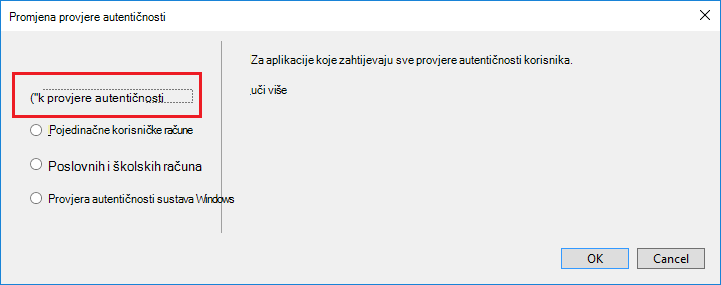

    Za ovaj Praktični vodič za početak rada koristite implementacija jednostavne aplikacije koja nema ugrađenu korisnika zapisnika u.

5. U odjeljku **Microsoft Azure** dijaloški okvir **Novi projekt ASP.NET** provjerite da **glavnog računala u oblaku** odabrana i **Aplikacije servisa za** odabran na padajućem popisu.

    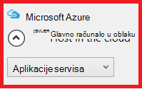

    Ove postavke izravno programa Visual Studio stvaranje aplikacije za Azure web web projekta.

6. Kliknite **u redu**

## Konfiguriranje Azure resursi za novu web-aplikaciju

Sada reći Visual Studio o Azure resursa koje želite stvoriti.

5. U dijaloškom okviru **Stvaranje aplikacije servisa** kliknite **Dodaj račun**, a zatim se prijavite da biste Azure s ID i lozinku za račun koji koristite da biste upravljali pretplatom Azure.

    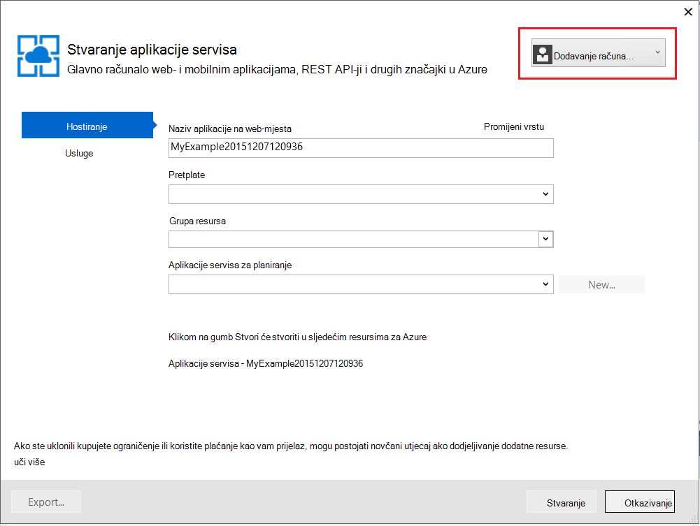

    Ako se već prijavili u prethodnom na istom računalu, možda nećete vidjeti gumb **Dodaj račun** . U tom slučaju možete preskočiti ovaj korak ili morat ćete ponovno unijeti vjerodajnice.
 
3. Unesite **Naziv aplikacije na web-mjesta** koja je jedinstvena *azurewebsites.net* domene. Na primjer, možete nazvati je MyExample s brojevima udesno da bude jedinstven, kao što su MyExample810. Ako se za vas stvara zadani naziv web će biti jedinstven i koji ćete koristiti.

    Ako je netko drugi već koristi naziv koji ste unijeli, pročitajte članak crveni uskličnik nadesno umjesto Zelena kvačica, a morate unijeti neki drugi naziv.

    URL-a za svoju aplikaciju je taj naziv plus *. azurewebsites.net*. Na primjer, ako je naziv `MyExample810`, URL `myexample810.azurewebsites.net`.

    Prilagođene domene možete koristiti i uz programa Azure web app. Dodatne informacije potražite u članku [Konfiguriranje prilagođenog naziva domene na servisu Azure aplikacije](web-sites-custom-domain-name.md).

6. Kliknite gumb **Novo** uz okvir **Grupe resursa** , a zatim unesite "MyExample" ili neki drugi naziv po želji. 

    

    Grupa resursa je zbirka Azure resursa kao što je web-aplikacije, baze podataka i VMs. Vodič, preporučuje se obično da biste stvorili novu grupu resursa jer je koji olakšava da biste izbrisali u jednom koraku Azure resursi za koje ste stvorili za vodič. Dodatne informacije potražite u članku [Pregled upravljanja resursima Azure](../azure-resource-manager/resource-group-overview.md).

4. Kliknite gumb **Novo** uz **Aplikaciju servisa planiranje** padajući popis.

    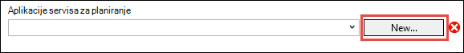

    Pojavit će se dijaloški okvir **Konfiguriranje planiranje usluga aplikacije** .

    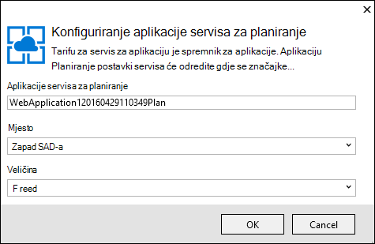

    U sljedećim koracima konfigurirati tarifu aplikacije servisa za novu grupu resursa. Tarifu aplikacije servisa za određuje računalnim resursi koji pokreće se web-aplikaciju programa. Na primjer, ako odaberete besplatne sloju, aplikacije API pokreće zajedničke VMs tijekom za neke plaćenu razine ga na Namjenska VMs. Dodatne informacije potražite u članku [Pregled aplikacije servisa za tarife](../app-service/azure-web-sites-web-hosting-plans-in-depth-overview.md).

5. U dijaloškom okviru **Konfiguriranje planiranje usluga aplikacije** unesite "MyExamplePlan" ili neki drugi naziv po želji.

5. Na padajućem popisu **mjesto** odaberite mjesto na koji je najsličniji vama.

    Tom se postavkom određuje koje Azure podatkovnog centra aplikacije funkcionirat će u. Za ovaj Praktični vodič možete odabrati bilo kojeg područja, a zatim ga neće učiniti uočljivijima razlika. Ali za aplikaciju za radni želite vaš poslužitelj najbliže moguće klijentima koji su mu, da biste minimizirali [Latencija](http://www.bing.com/search?q=web%20latency%20introduction&qs=n&form=QBRE&pq=web%20latency%20introduction&sc=1-24&sp=-1&sk=&cvid=eefff99dfc864d25a75a83740f1e0090)pristupa.

5. U **Veličina** padajući popis, kliknite **besplatno**.

    Za ovaj vodič besplatne cijene sloju dat će dobar dovoljno performansi.

6. U dijaloškom okviru **Konfiguriranje planiranje usluga aplikacije** kliknite **u redu**.

7. U dijaloškom okviru **Stvaranje aplikacije servisa** kliknite **Stvori**.

## Visual Studio stvara projekta i web-aplikacije

U kratko vrijeme, obično manje u minutu Visual Studio stvara web project i web-aplikaciji.  

Prozor **Programa Explorer rješenje** prikazuje datoteke i mape u novi projekt.

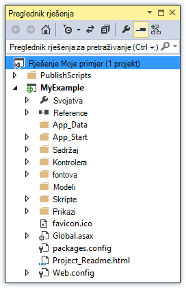

Prozor **Azure aplikacije servisa aktivnosti** prikazuje web-aplikaciji je stvorena.

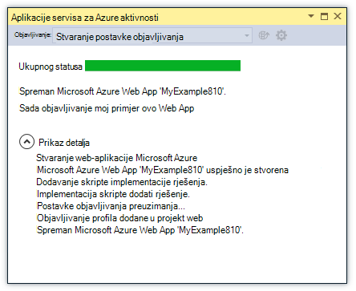

Prozor **Programa Explorer oblaka** omogućuje vam prikaz i upravljanje Azure resursa, uključujući nove web-aplikacije koje ste upravo stvorili.

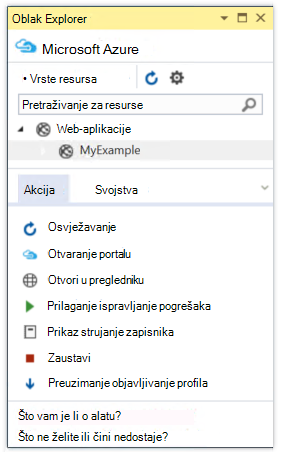
    
## Implementacija Azure web-aplikaciji web project

U ovom ćete odjeljku implementirati projekta web web App.

1. U **Pregledniku rješenja**, desnom tipkom miša kliknite projekt, a zatim odaberite **Objavi**.

    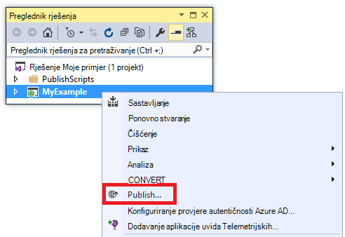

    U nekoliko sekundi, pojavit će se čarobnjak za **Objavljivanje Web** . Otvorit će se čarobnjak da biste na *Objavljivanje profila* koja sadrži postavke za implementaciju web projekta za novu web-aplikaciju.

    Objavljivanje profila sadrži korisničko ime i lozinku za implementaciju.  Generirao te vjerodajnice za vas, a ne morate ih unijeti. Lozinka je šifrirana u datoteku skrivenog specifične za korisnika u na `Properties\PublishProfiles` mapu.
 
8. Na kartici **veza** Čarobnjak za **Objavljivanje Web** kliknite **Dalje**.

    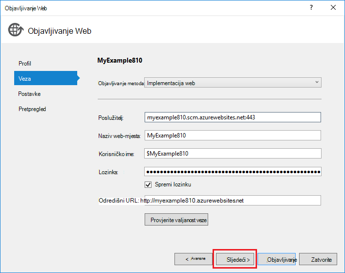

    Istaknuta je kartica **Postavke** . Ovdje možete promijeniti konfiguraciju Sastavi za implementaciju Sastavi ispravljanje pogrešaka za [daljinsko uklanjanje programskih pogrešaka](../app-service-web/web-sites-dotnet-troubleshoot-visual-studio.md#remotedebug). Na kartici nudi nekoliko [Mogućnosti objavljivanja datoteke](https://msdn.microsoft.com/library/dd465337.aspx#Anchor_2).

10. Na kartici **Postavke** kliknite **Dalje**.

    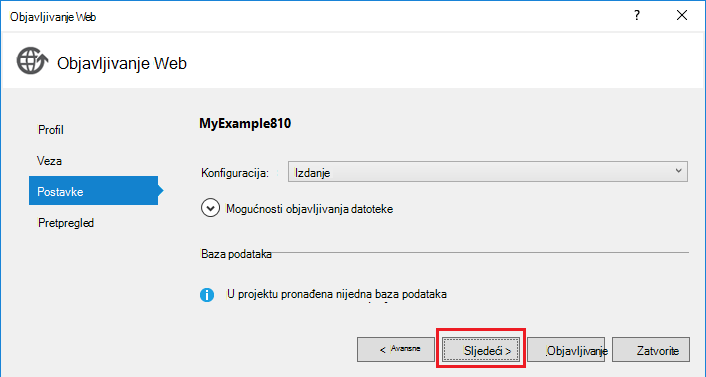

    Na kartici **Pregled** slijedi. Ovdje su priliku da biste vidjeli što datoteke namjeravate kopirat s projektom aplikaciju API-JA. Kada ste implementacije projekta za aplikaciju API koja ste već uvedena u prethodnom, kopiraju se samo promijenjene datoteke. Ako želite da biste vidjeli popis što će se kopirati, možete kliknuti gumb **Start pretpregled** .

11. Na kartici **Pregled** kliknite **Objavi**.

    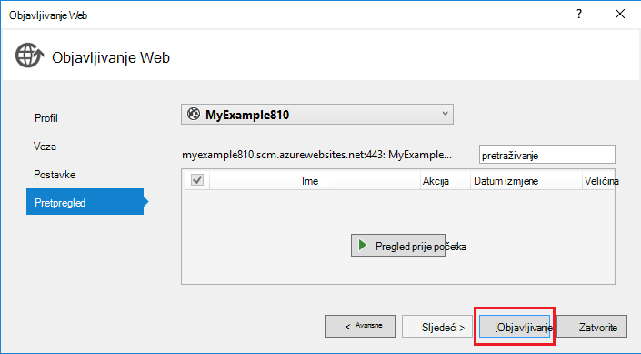

    Kada kliknete **Objavi**, Visual Studio započinje postupak kopiranja datoteke na poslužitelj za Azure. To može potrajati minutu ili dvije.

    Windows **izlazne** i **Azure aplikacije servisa aktivnosti** prikazuju akcije koje implementacije okrenutim i izvješća uspješan dovršetak implementacije.

    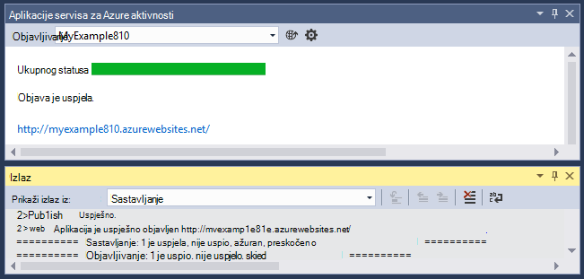

    Nakon uspješne implementaciju zadani preglednik automatski otvara URL distribuiranih web-aplikacije, a aplikacija koju ste stvorili sada izvodi u oblaku. URL u adresnoj traci preglednika prikazuje web-aplikaciji učita s Interneta.

    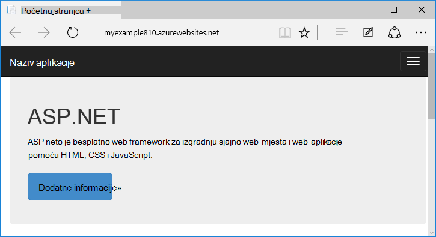

    > [AZURE.TIP]Možete omogućiti **Web jedan kliknite objavljivanje** alatnoj traci za brzu distribuciju. Kliknite **Prikaz > alatne trake**, a zatim odaberite **Web jedan kliknite Objavi**. Možete koristiti na alatnoj traci odaberite profil, kliknite gumb da biste objavili ili kliknite gumb da biste otvorili čarobnjak za **Objavljivanje Web** .
    > 

## Otklanjanje poteškoća

Ako naiđete na problem kao proći kroz ovaj Praktični vodič, provjerite koristite li najnoviju verziju programa Azure SDK za .NET. Najjednostavniji način za to je da biste [preuzeli Azure SDK za Visual Studio 2015](http://go.microsoft.com/fwlink/?linkid=518003). Ako imate instaliranu trenutnu verziju, instalacijski program platformu Web obavještava instalacija nije potreban.

Ako se na mreži tvrtke i pokušavate implementacija aplikacije servisa za Azure kroz vatrozid, provjerite je li priključke 443 i 8172 otvoreno za implementaciju Web. Ako ne možete otvoriti te priključke, u odjeljku sljedeće sljedeće korake za ostale mogućnosti implementacije.

Nakon što ste ASP.NET web-aplikaciju programa izvodi u aplikacije servisa za Azure, možda ćete dodatne informacije o značajkama programa Visual Studio koje Pojednostavnite otklanjanje poteškoća. Informacije o zapisivanje daljinsko uklanjanje programskih pogrešaka i drugo, potražite u članku [Otklanjanje poteškoća Azure web-aplikacije u Visual Studio](web-sites-dotnet-troubleshoot-visual-studio.md).

## Daljnji koraci

U ovom ćete praktičnom vodiču ste vidjeti kako stvoriti jednostavan web-aplikacije i implementacija Azure web-aplikaciju programa. Evo nekih povezane teme i resursi za učenje više o servisu Azure aplikacije:

* Nadzor i upravljanje web-aplikaciju u programa za potvrdu [Azure portal](https://portal.azure.com/). 

    Dodatne informacije potražite u članku [Pregled portala za Azure](/services/management-portal/) i [Konfiguriranje web-aplikacije u servisu Azure aplikacije](web-sites-configure.md).

* Implementacija postojeći projekt web novog web-aplikacijama, pomoću Visual Studio

    Desnom tipkom miša kliknite projekt u **Pregledniku rješenja**, a zatim kliknite **Objavi**. Odaberite **Servis za aplikaciju Microsoft Azure** kao cilj Objavi, a zatim kliknite **Novo**. U dijaloškim okvirima pa isti su kao što ste vidjeti ovog praktičnog vodiča.

* Implementacija web projekta iz izvora kontrole

    Informacije o [automatizaciji implementacije](http://www.asp.net/aspnet/overview/developing-apps-with-windows-azure/building-real-world-cloud-apps-with-windows-azure/continuous-integration-and-continuous-delivery) iz [izvora kontrole sustava](http://www.asp.net/aspnet/overview/developing-apps-with-windows-azure/building-real-world-cloud-apps-with-windows-azure/source-control)potražite u članku [Početak rada s web-aplikacije u aplikacije servisa za Azure](app-service-web-get-started.md) te o [tome kako implementirati Azure web-aplikaciju programa](web-sites-deploy.md).

* Implementacija ASP.NET Web API API aplikaciji aplikacije servisa za Azure

    Vidjeli kako stvoriti instancu aplikacije servisa Azure koji uglavnom predviđeno za hostiranje web-mjesto. Aplikacije servisa za nudi značajke za hostiranje Web API-ji, kao što su CORS podržava i API metapodataka podrška za generiranje koda klijenta. Možete koristiti značajke API-JA u web-aplikacijama, ali ako želite uglavnom hostira API-JA u instance komponente aplikacije servisa, **aplikacija API** bio bolji bi izbor. Dodatne informacije potražite u članku [Početak rada s aplikacijama API -JA i ASP.NET u servisu Azure aplikacije](../app-service-api/app-service-api-dotnet-get-started.md). 

* Dodavanje prilagođenog naziva domene i SSL

    Informacije o korištenju SSL i vlastite domene (primjerice, www.contoso.com umjesto contoso.azurewebsites.net) potražite u sljedećim resursima:

    * [Konfiguriranje prilagođenog naziva domene u aplikacije servisa za Azure](web-sites-custom-domain-name.md)
    * [Omogućivanje HTTPS za Azure web-mjesta](web-sites-configure-ssl-certificate.md)

* Brisanje grupe resursa koja sadrži web-aplikaciju programa i povezane Azure resurse kada završite s njima.

    Informacije o radu s grupama resursa na portalu za Azure potražite u članku [uvođenja resursa s resursima predložaka i Azure portal](../resource-group-template-deploy-portal.md).   

*   Još primjera stvaranja web-aplikacije programa ASP.NET u aplikacije servisa za potražite u članku [stvaranja i implementacija ASP.NET web app u aplikacije servisa za Azure](https://github.com/Microsoft/HealthClinic.biz/wiki/Create-and-deploy-an-ASP.NET-web-app-in-Azure-App-Service) i [Stvori i implementacija mobilne aplikacije u aplikacije servisa za Azure](https://github.com/Microsoft/HealthClinic.biz/wiki/Create-and-deploy-a-mobile-app-in-Azure-App-Service) iz povezivanje [HealthClinic.biz](https://github.com/Microsoft/HealthClinic.biz) 2015 [pokazni videozapis](https://blogs.msdn.microsoft.com/visualstudio/2015/12/08/connectdemos-2015-healthclinic-biz/). Dodatne početak rada s HealthClinic.biz videozapis, potražite u članku [Početak rada za alate za razvojne inženjere za Azure](https://github.com/Microsoft/HealthClinic.biz/wiki/Azure-Developer-Tools-Quickstarts).
