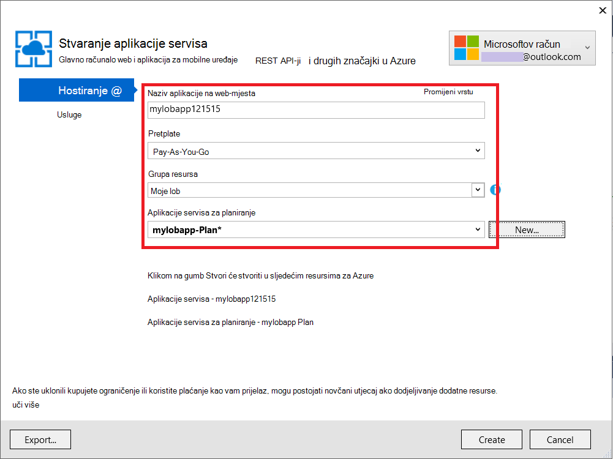

<properties 
    pageTitle="Stvaranje aplikacije za Azure redak tvrtke s provjerom autentičnosti AD FS | Microsoft Azure" 
    description="Saznajte kako stvoriti aplikaciju za redak tvrtke u Azure aplikacije servisa koja potvrđuje s STS na lokaciji. Pomoću ovog praktičnog vodiča pronalaze AD FS kao STS na lokaciji." 
    services="app-service\web" 
    documentationCenter=".net" 
    authors="cephalin" 
    manager="wpickett" 
    editor=""/>

<tags 
    ms.service="app-service-web" 
    ms.devlang="dotnet" 
    ms.topic="article" 
    ms.tgt_pltfrm="na" 
    ms.workload="web" 
    ms.date="08/31/2016" 
    ms.author="cephalin"/>

# Stvaranje aplikacije za Azure redak tvrtke s provjerom autentičnosti AD FS

U ovom se članku objašnjava da biste stvorili redak tvrtke aplikacije ASP.NET MVC u [Aplikacije servisa za Azure](../app-service/app-service-value-prop-what-is.md) koristeći lokalni [Active Directory Federation Services](http://technet.microsoft.com/library/hh831502.aspx) kao davatelja identiteta. U ovom scenariju možete raditi kada želite stvoriti redak poslovnih aplikacija na servisu Azure aplikacije, ali tvrtka ili ustanova zahtijeva direktorija podaci koji se spremaju on-site.

>[AZURE.NOTE] Pregled provjere autentičnosti i autorizacije mogućnosti različite enterprise aplikacije servisa za Azure, potražite u članku [provjere autentičnosti s lokalnim servisom Active Directory u aplikaciji programa Azure](web-sites-authentication-authorization.md).

## Što će sastavljanje ##

Će Sastavi na osnovni ASP.NET aplikacija u web-aplikacijama za Azure aplikacije servisa sljedeće značajke:

- Potvrđuje korisnici protiv AD FS
- Koristi `[Authorize]` da biste autorizirali korisnika za različite akcije
- Statički konfiguracije za ispravljanje pogrešaka u Visual Studio i objavljivanje na web-aplikacije servisa za aplikacije (Konfiguriranje jednom, ispravljanje pogrešaka i objaviti u bilo kojem trenutku)  

## Što vam je potrebno ##

[AZURE.INCLUDE [free-trial-note](../../includes/free-trial-note.md)]

Potrebne su vam sljedeće da biste dovršili ovaj Praktični vodič:

- Lokalnog implementacije AD FS (vodič završetka do kraja Laboratorija test koji se koristi u ovom ćete praktičnom vodiču, potražite u članku [testiranje Laboratorija: STS samostalne AD fs u Azure VM (za testiranje samo)](https://blogs.msdn.microsoft.com/cephalin/2014/12/21/test-lab-standalone-sts-with-ad-fs-in-azure-vm-for-test-only/))
- Dozvole za stvaranje potrebe za oslanjanjem strana trusts u upravljanju AD FS
- Ažuriranje Visual Studio 2013 4 ili noviji
- [Azure SDK 2.8.1](http://go.microsoft.com/fwlink/p/?linkid=323510&clcid=0x409) ili noviji

## Korištenje aplikacije uzorka za predložak retka tvrtke ##

Primjer aplikacije u ovom ćete praktičnom vodiču [WebApp WSFederation DotNet)](https://github.com/AzureADSamples/WebApp-WSFederation-DotNet), stvara se tim Azure Active Directory. Budući da AD FS podržava WS Federacija, možete je koristiti kao predložak da biste stvorili redak poslovnih aplikacija s lakoćom. Sastoji se od sljedećih značajki:

- Koristi [WS Federacija](http://msdn.microsoft.com/library/bb498017.aspx) za provjeru s lokalnog servisa AD FS implementacije
- Prijava i sign-out funkcija
- Koristi [Microsoft.Owin](http://www.asp.net/aspnet/overview/owin-and-katana/an-overview-of-project-katana) (umjesto Windows identiteta Foundation), koji je buduća programa ASP.NET i mnogo jednostavnijim da biste postavili za provjeru autentičnosti i ovlaštenja od WIF

## Postavljanje oglednih aplikacije ##

2.  Kloniraj ili preuzmite uzorak rješenja pri [WebApp WSFederation DotNet](https://github.com/AzureADSamples/WebApp-WSFederation-DotNet) lokalnog imenika.

    > [AZURE.NOTE] Upute u [README.md](https://github.com/AzureADSamples/WebApp-WSFederation-DotNet/blob/master/README.md) pokazati kako postaviti aplikacijom Azure Active Directory. No u ovom ćete praktičnom vodiču postavili ste ga pomoću servisa AD FS, umjesto toga slijedite korake u nastavku.

3.  Otvorite rješenje, a zatim otvorite Controllers\AccountController.cs u **Pregledniku rješenja**.

    Vidjet ćete kod jednostavno problemi provjere autentičnosti pitanja i odgovora za provjeru autentičnosti korisnika pomoću WS Federacija. Sve provjere autentičnosti je konfiguriran u App_Start\Startup.Auth.cs.

4.  Otvorite App_Start\Startup.Auth.cs. U na `ConfigureAuth` način, imajte na umu redak:

        app.UseWsFederationAuthentication(
            new WsFederationAuthenticationOptions
            {
                Wtrealm = realm,
                MetadataAddress = metadata                                      
            });

    U svijetu OWIN ovaj isječak ustvari Gola minimum morate konfigurirati WS Federacija provjere autentičnosti. Je mnogo jednostavnijim i više Elegantna od WIF, gdje Web.config je umetnutog s XML iz cijelog mjesto. Potrebne informacije samo je relying strana korisnika (to) identifikator i URL datoteku metapodataka servisa AD FS. Evo jednog primjera:

    -   Identifikator to:`https://contoso.com/MyLOBApp`
    -   Adresa metapodataka:`http://adfs.contoso.com/FederationMetadata/2007-06/FederationMetadata.xml`

5.  U App_Start\Startup.Auth.cs, promijenite sljedeće definicije statične niz:  
    <pre class="prettyprint">
    Lokalni privatne statične niza = ConfigurationManager.AppSettings["ida:<mark>RPIdentifier</mark>"]; <mark><del>aadInstance privatne statične niza = ConfigurationManager.AppSettings["ida:AADInstance"];</del></mark> 
     <mark><del>klijentu privatne statične niza = ConfigurationManager.AppSettings["ida:Tenant"];</del></mark> 
     <mark><del>privatne statične niz metapodataka = niz. Oblikovanje ("{0} / {1} /federationmetadata/2007-06/federationmetadata.xml", aadInstance, klijenta);</del></mark> 
     <mark>privatne statične niz metapodataka = niz. Oblikovanje ("/federationmetadata/2007-06/federationmetadata.xml https:// {0}", ConfigurationManager.AppSettings["ida:ADFS"]);</mark>

    <mark><del>niz za izdavanje certifikata = String.Format (CultureInfo.InvariantCulture, aadInstance, klijenta);</del></mark>
    </pre>

6.  Sada unesite odgovarajuće promjene u datoteci Web.config. Otvorite datoteka Web.config i Izmjena postavki za sljedeće aplikacije:  
    <pre class="prettyprint">
    &lt;appSettings&gt;
    &lt;add key="webpages:Version" value="3.0.0.0" /&gt;
    &lt;add key="webpages:Enabled" value="false" /&gt;
    &lt;add key="ClientValidationEnabled" value="true" /&gt;
    &lt;add key="UnobtrusiveJavaScriptEnabled" value="true" /&gt;
      <mark><del>&lt;add key="ida:Wtrealm" value="[Enter the App ID URI of WebApp-WSFederation-DotNet https://contoso.onmicrosoft.com/WebApp-WSFederation-DotNet]" /&gt;</del></mark>
      <mark><del>&lt;add key="ida:AADInstance" value="https://login.windows.net" /&gt;</del></mark>
      <mark><del>&lt;add key="ida:Tenant" value="[Enter tenant name, e.g. contoso.onmicrosoft.com]" /&gt;</del></mark>
      <mark>&lt;add key="ida:RPIdentifier" value="[Enter the relying party identifier kao što je konfiguriran u AD FS, npr. https://localhost:44320 /] "/&gt;</mark>
      <mark>&lt;dodavanje ključa = vrijednost"ida: ADFS"="[unesite FQDN servisa AD FS, primjerice adfs.contoso.com]"/&gt; </mark>        

    &lt;/appSettings&gt;
    </pre>

    Unesite ključne vrijednosti na temelju odgovarajući okruženju.

7.  Stvaranje aplikacije da biste provjerili postoje pogreške.

To je to. Primjer aplikacije je sada spremni za rad s AD FS. I dalje morate konfigurirati za to pouzdanost uz ovu aplikaciju u AD FS kasnije.

## Implementacija aplikacije uzorka na Azure aplikacije servisa web-aplikacije

Ovdje, objavljivanje aplikacije web-aplikaciju u aplikacije servisa web-aplikacijama uz čuvanje okruženje za ispravljanje pogrešaka. Imajte na umu da namjeravate objaviti aplikacije prije nego što je na to pouzdanost AD fs, pa provjeru autentičnosti i dalje ne funkcionira još. Međutim, ako to učinite sada možete imati URL web app koje možete koristiti da biste konfigurirali pouzdanost to kasnije.

1. Desnom tipkom miša kliknite projekt, a zatim odaberite **Objavi**.

    

2. Odaberite **Aplikacije servisa Microsoft Azure**.
3. Ako se još niste prijavili u Azure, kliknite **Prijava** , a koristite Microsoftov račun za Azure pretplatu za prijavu.
4. Kada se prijavite, kliknite **Novo** da biste stvorili web-aplikacijama.
5. Ispunite sva obavezna polja. Namjeravate povezati na lokaciji podataka kasnije, pa ne stvorite bazu podataka za ovo web-aplikacije.

    

6. Kliknite **Stvori**. Nakon stvaranja web-aplikaciji otvara se dijaloški okvir Objavi Web.
7. **Odredišni URL**, promijenite **http** **https**. Kopiranje cijeli URL-a u uređivaču teksta za kasnije korištenje. Zatim kliknite **Objavi**.

    

11. U Visual Studio, otvorite **Web.Release.config** u projektu. Umetanje sljedeće XML u na `<configuration>` oznaci i zamijenite vrijednost ključa URL vaše Objavi web app.  
    <pre class="prettyprint">
&lt;appSettings&gt;
   &lt;dodavanje ključa = vrijednost "ida: RPIdentifier" = "<mark>[– primjerice https://mylobapp.azurewebsites.net/]</mark>" xdt:Transform = xdt:Locator="Match(key)"SetAttributes"" /&gt;
&lt;/appSettings&gt;</pre>

Kada završite, imate dvije to identifikatora konfiguriran u projektu, jedan za okruženje za ispravljanje pogrešaka u Visual Studio i jedan za objavljenu web app u Azure. Pouzdanost za to će postaviti za svaki od ta dva okruženja u AD FS. Tijekom ispravljanje pogrešaka, postavki aplikacije u Web.config koriste se za rad s AD FS konfiguraciji **ispravljanje pogrešaka** . Kada se objavljuje (po zadanom konfiguracije **izdanje** objavljena), koji sadrži netom promjene postavki aplikacije u Web.Release.config transformiranih Web.config prijenosa.

Ako želite priložiti objavljenu web app u Azure u program za ispravljanje pogrešaka (odnosno morate je ponovno prenijeti simbola za ispravljanje pogrešaka koda u objavljenu web-aplikaciju), možete stvoriti Kloniraj konfiguracije ispravljanje pogrešaka za Azure pogrešaka, ali vlastitu prilagođenu Web.config pretvorbu (npr. Web.AzureDebug.config) koji koristi postavki aplikacije iz Web.Release.config. Time da biste zadržali statične konfiguraciju u različitim okruženjima.

## Konfiguriranje potrebe za oslanjanjem trusts zabavu u upravljanju AD FS ##

Sada morate konfigurirati za to pouzdanost u AD FS upravljanje prije nego što možete koristiti primjer aplikacije i zapravo autentičnost AD fs. Morat ćete postaviti dva zasebna to trusts, jedan za okruženje za ispravljanje pogrešaka i jedan za objavljenu web-aplikaciju programa.

> [AZURE.NOTE] Provjerite je li ponovite ove korake za oba vašeg okruženja.

4.  Na poslužitelj za AD FS, prijavite se pomoću vjerodajnica koje imaju upravljanja pravima za AD FS.
5.  Otvorite Upravljanje AD FS. Desnom tipkom miša kliknite **smatra pouzdanima AD FS\Trusted Relationships\Relying strana** , a zatim odaberite **Dodavanje potrebe za oslanjanjem strana pouzdanim**.

    

5.  Na stranici **Odabir izvora podataka** odaberite **Ručni unos podataka o relying proizvođača**. 

    

6.  Na stranici **Navedite naziv prikaza** Unesite zaslonsko ime za aplikaciju, a zatim kliknite **Dalje**.
7.  Na stranici **Odaberite protokol** kliknite **Dalje**.
8.  Na stranici **Konfiguriranje certifikata** , kliknite **Dalje**.

    > [AZURE.NOTE] Budući da, trebali biste koristiti HTTPS već, šifrirani tokena nije obavezno. Ako zapravo želite šifrirati tokena iz AD FS na ovoj stranici, morate dodati i token dešifriranja logike u kodu. Dodatne informacije potražite u članku [ručno konfiguriranje WS Federacija OWIN proizvod i prihvatiti šifrirani tokena](http://chris.59north.com/post/2014/08/21/Manually-configuring-OWIN-WS-Federation-middleware-and-accepting-encrypted-tokens.aspx).
  
5.  Premještanje na sljedeći korak, morate jednog dijela informacije iz projekta Visual Studio. U svojstvima projektnih Imajte na umu **SSL URL-a** aplikacije. 

    

6.  Vratite se u AD FS upravljanja, na stranici **Konfiguriranje URL** **Potrebe za oslanjanjem strana pouzdanost Čarobnjak za dodavanje**odaberite **Omogući podršku WS Federacija pasivni protokol za** pa upišite SSL URL Visual Studio projekta koji ste zabilježili u prethodnom koraku. Zatim kliknite **Dalje**.

    

    > [AZURE.NOTE] URL određuje gdje da biste poslali klijentu Nakon uspješnog provjere autentičnosti. Za ispravljanje pogrešaka okruženje mora biti <code>https://localhost:&lt;port&gt;/</code>. Za objavljenu web app mora biti URL adresa web app.

7.  Na stranici **Konfiguracija identifikatora** provjerite je li projekta SSL URL već popisa, a zatim kliknite **Dalje**. Kliknite **Dalje** do kraja do kraja čarobnjaka s zadane odabire.

    > [AZURE.NOTE] U App_Start\Startup.Auth.cs projekt za Visual Studio, ovaj identifikator se uparuje protiv vrijednost <code>WsFederationAuthenticationOptions.Wtrealm</code> tijekom pridruženim provjere autentičnosti. Prema zadanim postavkama, URL-a aplikacije u prethodnom koraku dodaje se kao identifikator to.

8.  Sada ste završili Konfiguriranje aplikacije to projekta u AD FS. Nakon toga konfigurirati ovu aplikaciju da biste poslali zahtjevima potrebne za aplikacije. Dijaloški okvir **Uređivanje pravila zahtjeva** otvara se po zadanom umjesto vas na kraju čarobnjak da bi se odmah pokrenuti. Pogledajmo konfigurirati barem sljedeće zahtjevima (s sheme u zagradama):

    -   Naziv (http://schemas.xmlsoap.org/ws/2005/05/identity/claims/name) – platforma ASP.NET za hydrate `User.Identity.Name`.
    -   Korisnikovo Glavno ime (http://schemas.xmlsoap.org/ws/2005/05/identity/claims/upn) – koriste za identificirati samo korisnici u tvrtki ili ustanovi.
    -   Članstva u grupi kao uloge (http://schemas.microsoft.com/ws/2008/06/identity/claims/role) – može se koristiti s `[Authorize(Roles="role1, role2,...")]` ukras da biste autorizirali kontrolera/akcije. U stvari, ovaj pristup možda neće biti Većina performant za autorizaciju uloge. Ako vaši korisnici AD pripadaju stotine sigurnosne grupe, postanu stotine zahtjevima uloga u SAML token. Zamjenski pristup je slanje zahtjeva za jednu ulogu uvjetno ovisno o korisnikovoj članstvo u određenoj grupi. Međutim, ne možemo ćete jednostavnost za ovog praktičnog vodiča.
    -   Naziv ID (http://schemas.xmlsoap.org/ws/2005/05/identity/claims/nameidentifier) – moguće je koristiti za provjeru valjanosti protiv krivotvorina. Dodatne informacije o tome kako rad s provjerom valjanosti protiv krivotvorina potražite u članku u odjeljku **Dodaj redak tvrtke funkcionalnost** [Stvori u retku specifični za poslovanje Azure aplikacije s provjerom autentičnosti Azure Active Directory](web-sites-dotnet-lob-application-azure-ad.md#bkmk_crud).

    > [AZURE.NOTE] Vrsta zahtjeva morate konfigurirati za svoju aplikaciju ovisi o potrebama vaše aplikacije. Na popisu zahtjevima podržava aplikacija Azure Active Directory (odnosno to trusts), na primjer, potražite u članku [podržane tokena i vrste zahtjeva](http://msdn.microsoft.com/library/azure/dn195587.aspx).

8.  U dijaloškom okviru Uređivanje pravila zahtjeva kliknite **Dodaj pravilo**.
9.  Konfiguriranje zahtjevima ime "," UPN "i" uloge, kao što je prikazano u snimku zaslona, a zatim kliknite **Završi**.

    

    Nakon toga stvoriti tranzitne naziv ID zahtjeva način planirati [Naziv identifikatora SAML assertions](http://blogs.msdn.com/b/card/archive/2010/02/17/name-identifiers-in-saml-assertions.aspx).

9.  Ponovno kliknite **Dodaj pravilo** .
10. Odaberite **Pošalji zahtjevima pomoću prilagođenih pravila** , a zatim kliknite **Dalje**.
11. Zalijepite sljedeće pravilo jezika u dijaloškom okviru **Prilagođeno pravilo** , naziv pravila **Po identifikator sesije** i kliknite **Završi**.  
    <pre class="prettyprint">
    C1: [Vrsta == "http://schemas.microsoft.com/ws/2008/06/identity/claims/windowsaccountname"] &amp; &amp; 
    c2: [Vrsta == "http://schemas.microsoft.com/ws/2008/06/identity/claims/authenticationinstant"] = > Dodavanje (spremanje = "_OpaqueIdStore", vrsta = ("<mark>http://contoso.com/internal/sessionid</mark>"), upit = "{0} { 1}; {2}; {3}; {4} ", parametarskog ="useEntropy", parametarskog = c1. Vrijednost, parametarskog = c1. OriginalIssuer, parametarskog = "", parametarskog = c2. Vrijednost).
    </pre>

    Snimka zaslona treba izgledati prilagođenog pravila:

    

9.  Ponovno kliknite **Dodaj pravilo** .
10. Odaberite **transformacija dolaznih zahtjeva** i kliknite **Dalje**.
11. Konfiguriranje pravila kao što je prikazano u snimku zaslona (pomoću Vrsta zahtjeva koji ste stvorili u pravilo za prilagođenu), a zatim kliknite **Završi**.

    

    Detaljne informacije o korake za tranzitne zahtjeva naziv ID-a potražite u članku [Naziv identifikatora SAML assertions](http://blogs.msdn.com/b/card/archive/2010/02/17/name-identifiers-in-saml-assertions.aspx).

12. U dijaloškom okviru **Pravila zahtjeva za uređivanje** , kliknite **Primijeni** . Sada će izgledati kao snimku zaslona sljedeće:

    

    > [AZURE.NOTE] Ponovno provjerite je li ponovite te korake za vaše okruženje za ispravljanje pogrešaka i objavljenu web-aplikacije.

## Testiranje pridruženim provjere autentičnosti za aplikaciju

Spremni ste za testiranje vaše aplikacije logike provjere autentičnosti na temelju AD FS. U Moje okruženje Laboratorija za AD FS imam testnih korisnika koji pripada grupi test u Active Directory (AD).

Da biste testirali provjere autentičnosti u program za ispravljanje pogrešaka, sve što trebate napraviti sada je vrsta `F5`. Ako želite da biste testirali provjere autentičnosti u objavljenu web-aplikacije, pomaknite se do URL-a.

Nakon učitavanja web-aplikaciju, kliknite **Prijava**. Sada trebali biste dobiti dijaloški okvir za prijavu ili stranicu prijave posluživanje sustavom AD FS, ovisno o načina provjere autentičnosti odabrao AD FS. Evo što se Internet Explorer 11.

Kada se prijavite pomoću korisnik iz domene AD implementacije AD FS, sada trebali biste vidjeti na početnu stranicu ponovno s **pozdrav, <User Name>!** u kutu. Evo što se.

Dosad ste uspješno na sljedeće načine:

- Aplikacija je uspješno Pristigla AD FS i odgovarajuće identifikator to nalazi se u bazi podataka za AD FS
- AD FS uspješno provjerio AD korisnik i preusmjeravanje povratak na početnu stranicu aplikacije
- AD FS kao uspješno poslana zahtjeva naziv (http://schemas.xmlsoap.org/ws/2005/05/identity/claims/name) u aplikaciji, kao što je označena činjenica da su korisničko ime prikazati u kutu. 

Ako nema zahtjeva naziv bi vidite **pozdrav,!**. Ako pogledate Views\Shared\_LoginPartial.cshtml, možete pronaći tako da koristi `User.Identity.Name` da biste prikazali korisničko ime. Kao što je već rečeno, ako je dostupan u SAML token zahtjeva ime korisnika čija je autentičnost provjerena, ASP.NET hydrates ovo svojstvo s njim. Da biste vidjeli sve zahtjevima koje je poslao AD FS, smjestite na točku prekida u Controllers\HomeController.cs, akcije metoda indeksa. Provjera nakon provjere autentičnosti korisnika u `System.Security.Claims.Current.Claims` zbirke.

 

## Autorizirajte korisnicima za određene kontrolera ili akcije

Budući da ste obuhvatili članstva u grupi kao uloga zahtjevima pouzdanost konfiguraciju to, sada možete koristiti ih izravno u programu u `[Authorize(Roles="...")]` ukras kontrolera te radnje. U retku tvrtke aplikacijom uzorak stvaranje čitanje – ažuriranje-brisanja (CRUD) možete Autorizirajte određene uloge za pristup svaku akciju. Zasad, samo će Isprobajte ova značajka na postojeće kontroleru Polazno.

1. Otvorite Controllers\HomeController.cs.
2. Ukrašavanje na `About` i `Contact` akcije metoda slično sljedeći kod pomoću sigurnosne grupe članstva koja sadrži korisnički čija je autentičnost provjerena.  
    <pre class="prettyprint">
    <mark>[Autorizirali (uloge = "Probno grupu")]</mark> 
    javno ActionResult About() {ViewBag.Message = "Aplikacije opis stranici.";

        return View();
    }

    <mark>[Autorizirali (uloge = "Domain Admins")]</mark> 
    javno ActionResult Contact() {ViewBag.Message = "Kontakta stranici.";

        return View();
    }  </pre>

    Budući da je dodao **Testiranje korisnika** u **Grupu Test** u Moje okruženje Laboratorija AD FS ćete koristiti Test grupe da biste testirali autorizacije na `About`. Za `Contact`, ćete testirati kutije negativan **Domain Admins**, koji ne pripadaju **Testiranje korisnika** .

3. Pokrenite program za ispravljanje pogrešaka tako da upišete `F5` i prijavite se u, a zatim kliknite **o**. Trebali biste sada se gledate u `~/About/Index` stranica uspješno, ako je prijavljenog korisnika ovlaštenog za tu akciju.
4. Sada kliknite **kontakt**koji u slučaju da moje trebali biste autorizirali **Testnih korisnika** za akciju. No u preglednik se preusmjerava na AD FS koji ipak prikazuje se sljedeća poruka:

    

    Ako istražili ovu pogrešku u preglednik događaja na poslužitelju za AD FS, vidjet ćete ovu poruku iznimke:  
    <pre class="prettyprint">
   Microsoft.IdentityServer.Web.InvalidRequestException: MSIS7042: <mark>na istom sesiju u pregledniku klijenta učinio 6' zahtjeve u zadnje "11" sekunde.</mark> Detalje zatražite od administratora.
   pri Microsoft.IdentityServer.Web.Protocols.PassiveProtocolHandler.UpdateLoopDetectionCookie (WrappedHttpListenerContext kontekst) pri Microsoft.IdentityServer.Web.Protocols.WSFederation.WSFederationProtocolHandler.SendSignInResponse (kontekst WSFederationContext, MSISSignInResponse odgovor) pri Microsoft.IdentityServer.Web.PassiveProtocolListener.ProcessProtocolRequest (ProtocolContext protocolContext, PassiveProtocolHandler protocolHandler) pri Microsoft.IdentityServer.Web.PassiveProtocolListener.OnGetContext (WrappedHttpListenerContext kontekst) </pre>

    Razlog za tu pogrešku je da po zadanom MVC vraća 401 Unauthorized kada korisničke uloge imaju dozvolu. Time se pokreće reauthentication zahtjev za davatelja identiteta (AD FS). Budući da već autentičnost korisnika, AD FS vraća na istoj stranici koji se zatim problemi s drugom 401 stvaranja petlje preusmjeravanje. Nadjačat će AuthorizeAttribute, `HandleUnauthorizedRequest` način s jednostavne za prikaz sadržaja koji vam odgovara umjesto nastavka petlje preusmjeravanje.

5. Stvaranje datoteke u projekt pod nazivom AuthorizeAttribute.cs i zalijepite sljedeći kod u nju.

        using System;
        using System.Web.Mvc;
        using System.Web.Routing;
        
        namespace WebApp_WSFederation_DotNet
        {
            [AttributeUsage(AttributeTargets.Class | AttributeTargets.Method, Inherited = true, AllowMultiple = true)]
            public class AuthorizeAttribute : System.Web.Mvc.AuthorizeAttribute
            {
                protected override void HandleUnauthorizedRequest(AuthorizationContext filterContext)
                {
                    if (filterContext.HttpContext.Request.IsAuthenticated)
                    {
                        filterContext.Result = new System.Web.Mvc.HttpStatusCodeResult((int)System.Net.HttpStatusCode.Forbidden);
                    }
                    else
                    {
                        base.HandleUnauthorizedRequest(filterContext);
                    }
                }
            }
        }

    Kod nadjačavanje šalje se 403 HTTP (zabranjeno) umjesto 401 HTTP (Unauthorized) u slučajevima čija je autentičnost provjerena, ali neovlašteno.

6. Pokrenite program za ispravljanje pogrešaka ponovo s `F5`. Sada kliknite **kontakt** prikazuje sadrži više detalja (koriste Premda je unattractive) poruka o pogrešci:

    

7. Objavljivanje aplikacija na web-aplikacije za Azure aplikacije servisa ponovno i testiranje ponašanja uživo aplikacije.

## Povezivanje s lokalnim podacima

Razlog biste htjeli implementirati redak poslovnoj aplikaciji AD fs umjesto Azure Active Directory je usklađenost probleme s čuvanja tvrtke ili ustanove podataka izvan lokaciji. To može također znači da aplikaciji Azure web morate hostira baze podataka programa access, jer nije vam dopušteno da biste upotrijebili podatke sloju [Baze podataka SQL](/services/sql-database/) web-aplikacijama.

Servis Web Azure aplikacija podržava pristupa baze podataka na lokaciji s dva pristupa: [Hibridnog veze](../biztalk-services/integration-hybrid-connection-overview.md) i [Virtualne mreže](web-sites-integrate-with-vnet.md). Dodatne informacije potražite u članku [Korištenje VNET integracije i hibridnog veze s Azure aplikacije servisa web-aplikacije](https://azure.microsoft.com/blog/2014/10/30/using-vnet-or-hybrid-conn-with-websites/).

## Dodatne resurse

- [Zaštita aplikacijom SSL i atribut ovlasti](web-sites-dotnet-deploy-aspnet-mvc-app-membership-oauth-sql-database.md#protect-the-application-with-ssl-and-the-authorize-attribute)
- [Autentičnost s lokalnim servisom Active Directory u aplikaciji programa Azure](web-sites-authentication-authorization.md)
- [Stvaranje aplikacije za Azure redak tvrtke s provjerom autentičnosti Azure Active Directory](web-sites-dotnet-lob-application-azure-ad.md)
- [Koristite mogućnost lokalni tvrtke ili ustanove provjere autentičnosti (ADFS) s ASP.NET u Visual Studio 2013](http://www.cloudidentity.com/blog/2014/02/12/use-the-on-premises-organizational-authentication-option-adfs-with-asp-net-in-visual-studio-2013/)
- [Migriranje Web projekta VS2013 iz WIF Katana](http://www.cloudidentity.com/blog/2014/09/15/MIGRATE-A-VS2013-WEB-PROJECT-FROM-WIF-TO-KATANA/)
- [Active Directory Federation Services pregled](http://technet.microsoft.com/library/hh831502.aspx)
- [Specifikacija WS Federacija 1.1](http://download.boulder.ibm.com/ibmdl/pub/software/dw/specs/ws-fed/WS-Federation-V1-1B.pdf?S_TACT=105AGX04&S_CMP=LP)

