<properties 
    pageTitle="Stvaranje aplikacije za Azure redak tvrtke s provjerom autentičnosti Azure Active Directory | Microsoft Azure" 
    description="Saznajte kako stvoriti aplikaciju redak tvrtke ASP.NET MVC u Azure aplikacije servisa koja potvrđuje s Azure Active Directory" 
    services="app-service\web, active-directory" 
    documentationCenter=".net" 
    authors="cephalin" 
    manager="wpickett" 
    editor=""/>

<tags 
    ms.service="app-service-web" 
    ms.devlang="dotnet" 
    ms.topic="article" 
    ms.tgt_pltfrm="na" 
    ms.workload="web" 
    ms.date="09/01/2016" 
    ms.author="cephalin"/>

# Stvaranje aplikacije za Azure redak tvrtke s provjerom autentičnosti Azure Active Directory #

U ovom se članku objašnjava radi stvaranja aplikacije redak tvrtke .NET [Azure aplikacije servisa web-aplikacije](http://go.microsoft.com/fwlink/?LinkId=529714) pomoću na [provjere autentičnosti / autorizacije](../app-service/app-service-authentication-overview.md) značajku. Također se prikazuje kako koristiti [Azure Active Directory grafikonu API](https://msdn.microsoft.com/Library/Azure/Ad/Graph/api/api-catalog) upita direktorija podataka u aplikaciji.

Azure Active Directory klijentu koji koristite može biti u imeniku samo za Azure. Ili, da biste stvorili na jednom za prijave za zaposlenici zaduženi za lokalni i alat za analizu daljinske može biti [sinkroniziran s Active Directory na lokaciji](../active-directory/active-directory-aadconnect.md) . U ovom se članku koristi zadani direktorij za vaš račun za Azure.

## Što će sastavljanje ##

Jednostavno stvaranje čitanje – ažuriranje-brisanja (CRUD) aplikacije redak tvrtke u aplikaciju servisa web-aplikacijama će Sastavi da prati funkcionirati stavke sljedeće značajke:

- Potvrđuje korisnici protiv Azure Active Directory
- Upiti direktorija korisnici i grupe koje se pomoću [Azure Active Directory grafikonu API -JA](http://msdn.microsoft.com/library/azure/hh974476.aspx)
- Korištenje predloška ASP.NET MVC *Bez provjere autentičnosti*

Ako vam je potrebna kontrola pristupa na temelju uloga (RBAC) za aplikaciji Azure redak tvrtke, pogledajte [Sljedeći korak](#next).

## Što vam je potrebno ##

[AZURE.INCLUDE [free-trial-note](../../includes/free-trial-note.md)]

Potrebne su vam sljedeće da biste dovršili ovaj Praktični vodič:

- Klijent za Azure Active Directory s korisnicima u različitim grupama
- Dozvole za stvaranje aplikacija na klijentu Azure Active Directory
- Ažuriranje Visual Studio 2013 4 ili noviji
- [Azure SDK 2.8.1 ili noviji](https://azure.microsoft.com/downloads/)

## Stvaranje i implementacija web-aplikacijama Azure ##

1. U Visual Studio, kliknite **datoteka** > **Novo** > **projekta**.

2. Odabir **ASP.NET web-aplikacije**, naziv projekta i kliknite **u redu**.

3. Odaberite predložak **MVC** , a zatim promijenite provjeru autentičnosti **Bez provjere autentičnosti**. Provjerite je li **glavnog računala u Oblaku** , a zatim kliknite **u redu**.

    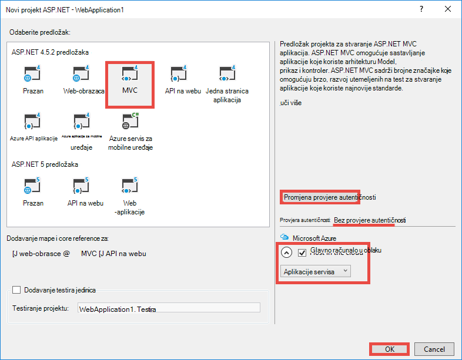

4. U dijaloškom okviru **Stvaranje aplikacije servisa** kliknite **Dodaj račun** (a zatim **Dodaj račun** na padajućem popisu) da biste se prijavili račun za Azure.

5. Kada prijavljeni konfigurirajte web-aplikaciju programa. Stvorite grupu resursa i novoj tarifi aplikacije servisa, kliknite odgovarajući gumb **Novo** . Kliknite **Istraži dodatna Azure servisa** da biste nastavili.

    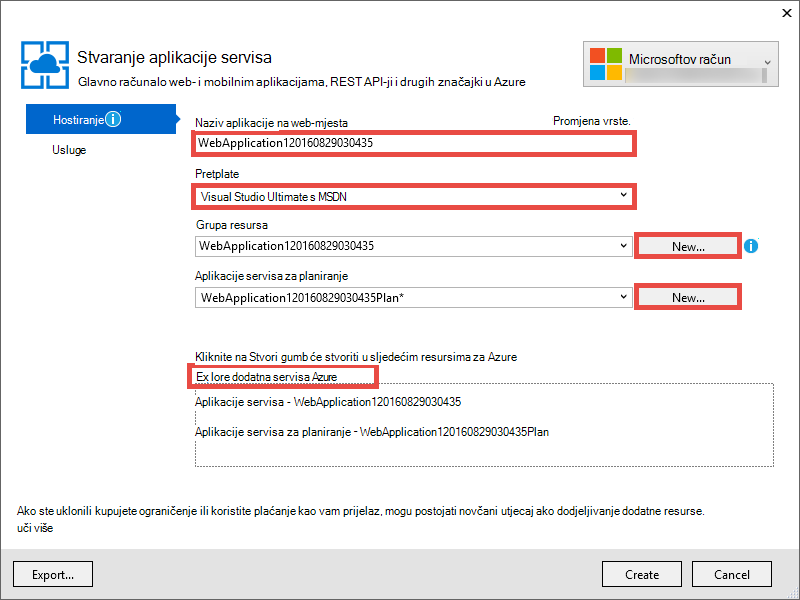

6. Na kartici **usluge** kliknite **+** da biste dodali SQL baze podataka za aplikaciju. 

    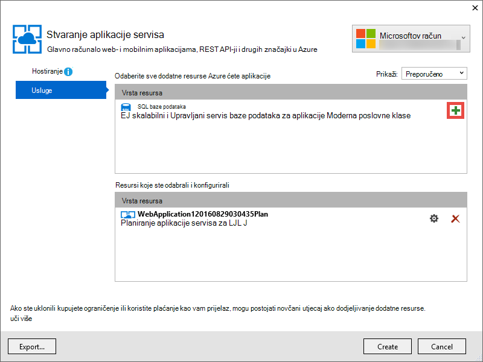

7. U **Konfigurirati SQL baze podataka**kliknite **Novo** da biste stvorili instancu komponente SQL Server.

8. **Konfiguriranje sustava SQL Server**konfiguracija instancu sustava SQL Server. Zatim kliknite **u redu**, **u redu**i **Stvaranje** izbaciti stvaranja aplikacije u Azure.

9. U **Azure aplikacije servisa aktivnosti**, možete vidjeti kada je završen stvaranja aplikacija. Kliknite * *Objavi &lt; *appname*> ovo web-aplikacije now**zatim kliknite **Objavi **. 

    Kada se dovrši Visual Studio, otvoriti aplikaciju Objavi u pregledniku. 

    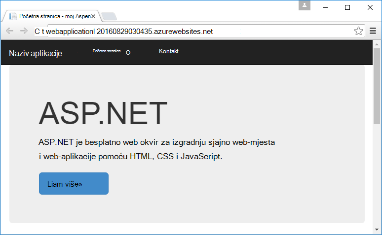

## Konfiguriranje provjere autentičnosti i imenik programa access

1. Prijavite se na [portal za Azure](https://portal.azure.com).

2. Na lijevom izborniku kliknite **Aplikacije usluge** > **&lt;*appname*>** > **provjere autentičnosti / autorizacije **.

    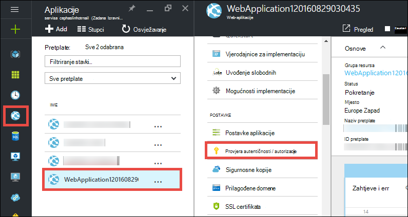

3. Uključivanje provjere autentičnosti Azure Active Directory tako da kliknete **na** > **Azure Active Directory** > **Express** > **u redu**.

    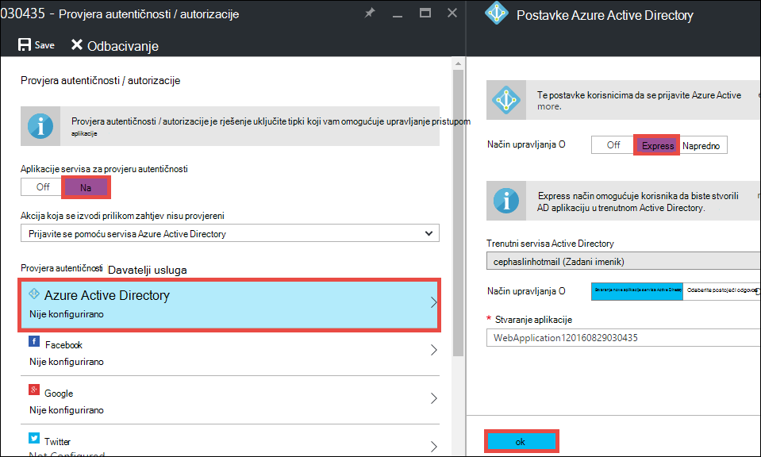

4. Na naredbenoj traci kliknite **Spremi** .

    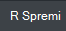

    Kada su postavke provjere autentičnosti uspješno spremljena, pokušajte Navigacija aplikacije u pregledniku. Zadane postavke nametnuti provjeru autentičnosti na cijelu aplikaciju. Ako već niste prijavljeni, bit ćete preusmjereni na zaslonu za prijavu. Kada prijavljeni, vidjet ćete aplikaciju osigurava HTTPS. Ćete morati omogućiti pristup podacima direktorija. 

5. Idite na [Klasični portal](https://manage.windowsazure.com).

6. Na lijevom izborniku kliknite **Servisa Active Directory** > **Zadani direktorija** > **aplikacije** > **&lt;*appname*> **.

    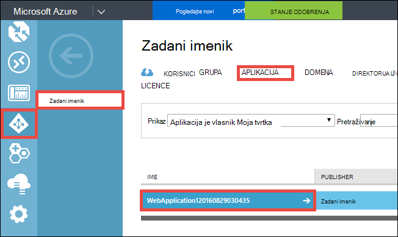

    Ovo je za vas stvara aplikacije servisa Azure Active Directory aplikacije da biste omogućili autorizacija / značajku provjere autentičnosti.

7. Kliknite **korisnici** i **grupe** da biste bili sigurni da imate nekim korisnicima i grupama u direktoriju. Ako nije, stvoriti nekoliko testnih korisnika i grupa.

    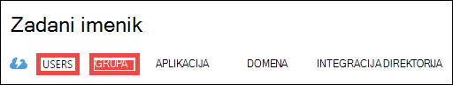

7. Kliknite **Konfiguriraj** da biste konfigurirali ovu aplikaciju.

8. Pomaknite se prema dolje do odjeljka **tipke** i dodajte ključ tako da odaberete trajanje. Nakon toga kliknite **Dodijeliti dozvole** i odaberite **čitanje direktorija podataka**. Kliknite **Spremi**.

    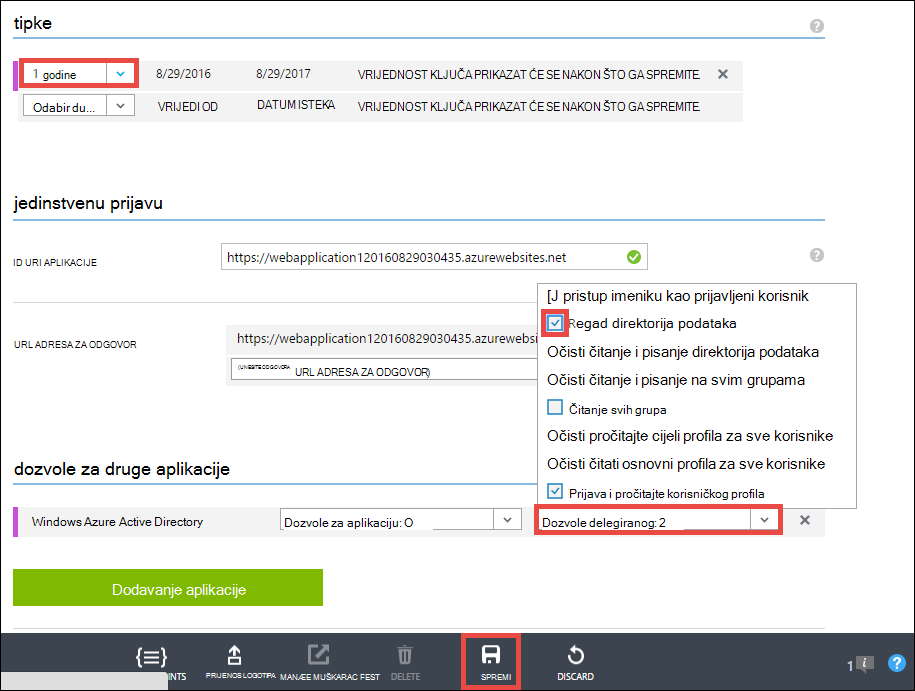

8. Nakon spremanja postavki pomaknite spremiti sigurnosnu kopiju u odjeljku **tipke** i kliknite gumb **Kopiraj** da biste kopirali tipku klijenta. 

    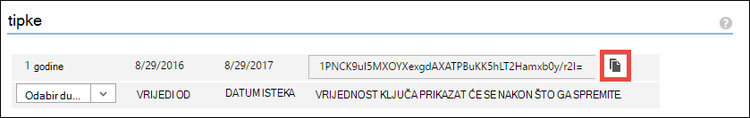

    >[AZURE.IMPORTANT] Ako napustite ovu stranicu sada, nećete moći ikad ponovno pristupili taj klijent ključ.

9. Nakon toga morate konfigurirati web-aplikaciju programa pomoću ovog ključa. Prijavite se u [Explorer resursa Azure](https://resources.azure.com) s računom za Azure.

10. Pri vrhu stranice kliknite **Čitanje/pisanje** da biste unijeli promjene u programu Explorer Azure resursa.

    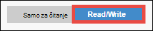

11. Pronalaženje postavke provjere autentičnosti za aplikaciju, koja se nalazi na pretplate > * *&lt;*subscriptionname*>** > **resourceGroups** > **&lt;*resourcegroupname*>** > **davatelji** > **Microsoft.Web** > **web-mjesta** > **&lt;*appname*>** > **config** > **authsettings **.

12. Kliknite **Uređivanje**.

    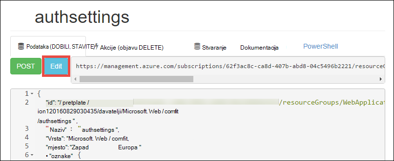

13. U oknu Uređivanje postavljena na `clientSecret` i `additionalLoginParams` svojstva na sljedeći način.

        ...
        "clientSecret": "<client key from the Azure Active Directory application>",
        ...
        "additionalLoginParams": ["response_type=code id_token", "resource=https://graph.windows.net"],
        ...

14. Kliknite **Stavi** pri vrhu da biste poslali promjene.

    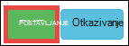

14. Sada da biste provjerili imate li ovlaštenja za pristup grafikonu API za Active Directory Azure, samo prijeđite * *https://&lt;*appname*>.azurewebsites.net/.auth/me** u pregledniku. Ako ste konfigurirali sve ispravno, trebali biste vidjeti na `access_token` svojstvo u odgovoru JSON.

    Na `~/.auth/me` put URL-a upravlja provjera autentičnosti za aplikaciju servisa / autorizacije da bi se dobilo sve informacije vezane uz sesiju čija je autentičnost provjerena. Dodatne informacije potražite u članku [provjere autentičnosti i autorizacije u servisu Azure aplikacije](../app-service/app-service-authentication-overview.md).

    >[AZURE.NOTE] U `access_token` sadrži razdoblje isteka. Međutim, provjera autentičnosti za aplikaciju servisa / autorizacije nudi funkcije tokena osvježavanja s `~/.auth/refresh`. Dodatne informacije o tome kako je koristiti potražite u članku     [Trgovine Token servisa](https://cgillum.tech/2016/03/07/app-service-token-store/).

Nakon toga će učinite nešto korisno podacima direktorija.

## Dodavanje retka tvrtke funkcionalnosti aplikacije

Sada stvorite jednostavan praćenje CRUD radnog stavke.  

5.  U mapi ~\Models stvoriti predmete datoteku pod nazivom WorkItem.cs i zamijeni `public class WorkItem {...}` s sljedeći kod:

        using System.ComponentModel.DataAnnotations;

        public class WorkItem
        {
            [Key]
            public int ItemID { get; set; }
            public string AssignedToID { get; set; }
            public string AssignedToName { get; set; }
            public string Description { get; set; }
            public WorkItemStatus Status { get; set; }
        }

        public enum WorkItemStatus
        {
            Open,
            Investigating,
            Resolved,
            Closed
        }

7.  Stvaranje projekta radi novog modela čine pristupačnim scaffolding logike u Visual Studio.

8.  Dodajte novu stavku scaffolded `WorkItemsController` u mapu ~\Controllers ( **kontrolera**desnom tipkom miša, pokažite na **Dodaj**i odabir **nove stavke scaffolded**). 

9.  Odaberite **MVC 5 kontroler s prikaza, putem Framework entitet** , a zatim kliknite **Dodaj**.

10. Odaberite model koji ste stvorili, a zatim kliknite **+** , a zatim **Dodaj** da biste dodali konteksta podataka, a zatim kliknite **Dodaj**.

    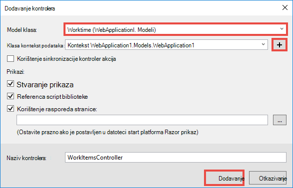

14. U ~\Views\WorkItems\Create.cshtml (automatski scaffolded stavke) pronađite u `Html.BeginForm` način preglednika i izvršite sljedeće promjene istaknuti:  
<pre class="prettyprint">
    @modelWebApplication1.Models.WorkItem

    @{ViewBag.Title = &quot;stvaranje&quot;; }

    &lt;H2&gt;stvaranje&lt;/h2&gt;

    @using(Html.BeginForm (<mark>&quot;stvaranje&quot;, &quot;WorkItems&quot;, FormMethod.Post, novi {id = &quot;glavni obrazac&quot; }</mark>)) {@Html.AntiForgeryToken()

        &lt;div class=&quot;form-horizontal&quot;&gt;
            &lt;h4&gt;WorkItem&lt;/h4&gt;
            &lt;hr /&gt;
            @Html.ValidationSummary(true, &quot;&quot;, new { @class = &quot;text-danger&quot; })
            &lt;div class=&quot;form-group&quot;&gt;
                @Html.LabelFor(model =&gt; model.AssignedToID, htmlAttributes: new { @class = &quot;control-label col-md-2&quot; })
                &lt;div class=&quot;col-md-10&quot;&gt;
                    @Html.EditorFor(model =&gt; model.AssignedToID, new { htmlAttributes = new { @class = &quot;form-control&quot;<mark>, @type = &quot;hidden&quot;</mark> } })
                    @Html.ValidationMessageFor(model =&gt; model.AssignedToID, &quot;&quot;, new { @class = &quot;text-danger&quot; })
                &lt;/div&gt;
            &lt;/div&gt;

            &lt;div class=&quot;form-group&quot;&gt;
                @Html.LabelFor(model =&gt; model.AssignedToName, htmlAttributes: new { @class = &quot;control-label col-md-2&quot; })
                &lt;div class=&quot;col-md-10&quot;&gt;
                    @Html.EditorFor(model =&gt; model.AssignedToName, new { htmlAttributes = new { @class = &quot;form-control&quot; } })
                    @Html.ValidationMessageFor(model =&gt; model.AssignedToName, &quot;&quot;, new { @class = &quot;text-danger&quot; })
                &lt;/div&gt;
            &lt;/div&gt;

            &lt;div class=&quot;form-group&quot;&gt;
                @Html.LabelFor(model =&gt; model.Description, htmlAttributes: new { @class = &quot;control-label col-md-2&quot; })
                &lt;div class=&quot;col-md-10&quot;&gt;
                    @Html.EditorFor(model =&gt; model.Description, new { htmlAttributes = new { @class = &quot;form-control&quot; } })
                    @Html.ValidationMessageFor(model =&gt; model.Description, &quot;&quot;, new { @class = &quot;text-danger&quot; })
                &lt;/div&gt;
            &lt;/div&gt;

            &lt;div class=&quot;form-group&quot;&gt;
                @Html.LabelFor(model =&gt; model.Status, htmlAttributes: new { @class = &quot;control-label col-md-2&quot; })
                &lt;div class=&quot;col-md-10&quot;&gt;
                    @Html.EnumDropDownListFor(model =&gt; model.Status, htmlAttributes: new { @class = &quot;form-control&quot; })
                    @Html.ValidationMessageFor(model =&gt; model.Status, &quot;&quot;, new { @class = &quot;text-danger&quot; })
                &lt;/div&gt;
            &lt;/div&gt;

            &lt;div class=&quot;form-group&quot;&gt;
                &lt;div class=&quot;col-md-offset-2 col-md-10&quot;&gt;
                    &lt;input type=&quot;submit&quot; value=&quot;Create&quot; class=&quot;btn btn-default&quot;<mark> id=&quot;submit-button&quot;</mark> /&gt;
                &lt;/div&gt;
            &lt;/div&gt;
        &lt;/div&gt;
    }

    &lt;DIV&gt;
    @Html.ActionLink(&quot;popis&quot;, &quot;indeks&quot;) &lt;/DIV    &gt;

    @sectionSkripte { @Scripts.Render( &quot;~/bundles/jqueryval&quot;)     <mark> &lt;skripte&gt; 
     / / kod alata za odabir osobe/grupa var maxResultsPerPage = 14;         unos VAR = document.getElementById (&quot;AssignedToName&quot;);

            // Access token from request header, and tenantID from claims identity
            var token = &quot;@Request.Headers[&quot;X-MS-TOKEN-AAD-ACCESS-TOKEN&quot;]&quot;;
            var tenant =&quot;@(System.Security.Claims.ClaimsPrincipal.Current.Claims
                            .Where(c => c.Type == &quot;http://schemas.microsoft.com/identity/claims/tenantid&quot;)
                            .Select(c => c.Value).SingleOrDefault())&quot;;

            var picker = new AadPicker(maxResultsPerPage, input, token, tenant);

            // Submit the selected user/group to be asssigned.
            $(&quot;#submit-button&quot;).click({ picker: picker }, function () {
                if (!picker.Selected())
                    return;
                $(&quot;#main-form&quot;).get()[0].elements[&quot;AssignedToID&quot;].value = picker.Selected().objectId;
            });
        &lt;/script&gt;</mark>
    }
    </pre>
    
    Imajte na umu da `token` i `tenant` koji se koristi u `AadPicker` objekt da biste pozive Azure Active Directory grafikonu API-JA. Ćete dodati `AadPicker` kasnije.   
    
    >[AZURE.NOTE] Baš kao i možete dobiti `token` i `tenant` na strani klijenta s `~/.auth/me`, ali da bi poziv dodatni poslužitelj. Ako, na primjer:
    >  
    >     $.ajax({
    >         dataType: "json",
    >         url: "/.auth/me",
    >         success: function (data) {
    >             var token = data[0].access_token;
    >             var tenant = data[0].user_claims
    >                             .find(c => c.typ === 'http://schemas.microsoft.com/identity/claims/tenantid')
    >                             .val;
    >         }
    >     });
    
15. Promjene u istu s ~ \Views\WorkItems\Edit.cshtml.

15. Na `AadPicker` objekt je definiran u skriptu koja najprije morate dodati u projekt. Desnom tipkom miša kliknite mapu ~\Scripts, pokažite na **Dodaj**pa kliknite **JavaScript datoteku**. Vrsta `AadPickerLibrary` za naziv datoteke i kliknite **u redu**.

16. Kopirajte sadržaj iz [ovdje](https://raw.githubusercontent.com/cephalin/active-directory-dotnet-webapp-roleclaims/master/WebApp-RoleClaims-DotNet/Scripts/AadPickerLibrary.js) u ~ \Scripts\AadPickerLibrary.js.

    U skripti na `AadPicker` objekt poziva [Azure Active Directory grafikonu API -JA](https://msdn.microsoft.com/Library/Azure/Ad/Graph/api/api-catalog) za pretraživanje za korisnike i grupe koje odgovaraju unos.  

17. ~\Scripts\AadPickerLibrary.js koristi i [jQuery miniaplikacije za Samodovršetak korisničkog Sučelja](https://jqueryui.com/autocomplete/). Tako ćete morati dodati jQuery korisničkog Sučelja u projekt. Desnom tipkom miša kliknite projekt, a zatim kliknite **Upravljanje NuGet paketa**.

18. U NuGet paket upravitelju, kliknite Pregledaj, **jquery sučelja** u upišite traka za pretraživanje pa kliknite **jQuery.UI.Combined**.

    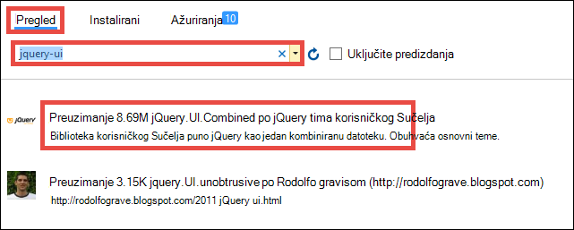

19. U desnom oknu kliknite **Instaliraj**, a zatim kliknite **u redu** da biste nastavili.

19. Otvorite ~\App_Start\BundleConfig.cs i izvršite sljedeće promjene istaknuti:  
    <pre class="prettyprint">
    javno statični Poništi RegisterBundles(BundleCollection bundles) {objedinjuje. Dodavanje (novi ScriptBundle (&quot;~/bundles/jquery&quot;). Uključite ( &quot;~/Scripts/jquery-{version}.js&quot;<mark>, &quot;~/Scripts/jquery-ui-{version}.js&quot;, &quot;~/Scripts/AadPickerLibrary.js&quot;</mark>));

        bundles.Add(new ScriptBundle(&quot;~/bundles/jqueryval&quot;).Include(
                    &quot;~/Scripts/jquery.validate*&quot;));

        // Use the development version of Modernizr to develop with and learn from. Then, when you&#39;re
        // ready for production, use the build tool at http://modernizr.com to pick only the tests you need.
        bundles.Add(new ScriptBundle(&quot;~/bundles/modernizr&quot;).Include(
                    &quot;~/Scripts/modernizr-*&quot;));

        bundles.Add(new ScriptBundle(&quot;~/bundles/bootstrap&quot;).Include(
                    &quot;~/Scripts/bootstrap.js&quot;,
                    &quot;~/Scripts/respond.js&quot;));

        bundles.Add(new StyleBundle(&quot;~/Content/css&quot;).Include(
                    &quot;~/Content/bootstrap.css&quot;,
                    &quot;~/Content/site.css&quot;<mark>,
                    &quot;~/Content/themes/base/jquery-ui.css&quot;</mark>));
    }
    </pre>

    Načina više performant upravljanje JavaScript i CSS datotekama u svojoj aplikaciji. Međutim, zbog jednostavnosti samo namjeravate piggyback na objedinjuje učitane s svaki prikaz.

12. Naposljetku, u ~ \Global.asax, dodajte sljedeći redak koda u na `Application_Start()` način. `Ctrl`+`.`na svaku imenovanja razlučivost pogrešku njegovog rješavanja.

        AntiForgeryConfig.UniqueClaimTypeIdentifier = ClaimTypes.NameIdentifier;
    
    > [AZURE.NOTE] Potrebno je taj redak kod jer koristi zadani predložak MVC <code>[ValidateAntiForgeryToken]</code> ukras na neke od akcija. Zbog ponašanje opisan [Anić Brock](https://twitter.com/BrockLAllen) pri     [MVC 4 AntiForgeryToken i zahtjevima](http://brockallen.com/2012/07/08/mvc-4-antiforgerytoken-and-claims/) HTTP POST možda neće uspjeti protiv krivotvorina tokena provjere valjanosti jer:

    > - Azure Active Directory pošaljite http://schemas.microsoft.com/accesscontrolservice/2010/07/claims/identityprovider koji je potreban po zadanom token protiv krivotvorina.
    > - Ako je Azure Active Directory direktorija sinkroniziran s AD FS, pouzdanost AD FS po zadanom ne šalje zahtjeva http://schemas.microsoft.com/accesscontrolservice/2010/07/claims/identityprovider ili, iako možete ručno konfigurirati AD FS da biste poslali ovaj zahtjev.

    > `ClaimTypes.NameIdentifies`Određuje zahtjeva `http://schemas.xmlsoap.org/ws/2005/05/identity/claims/nameidentifier`, koji se dohvaćati Azure Active Directory.  

20. Sada možete objaviti promjene. Desnom tipkom miša kliknite projekt, a zatim kliknite **Objavi**.

21. Kliknite **Postavke**, provjerite je li niza za povezivanje s bazom podataka sustava SQL, odaberite **Ažuriranje baze podataka** da biste promjene sheme za model, a zatim kliknite **Objavi**.

    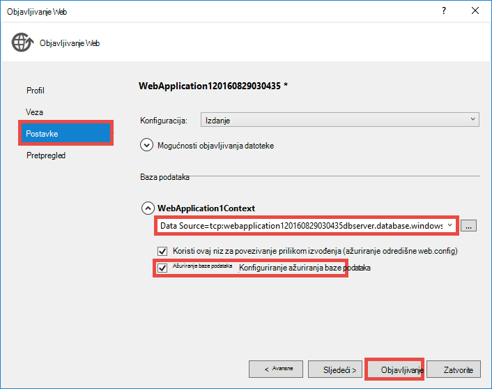

22. U pregledniku dođite do https://&lt;*appname*>.azurewebsites.net/workitems i kliknite **Stvori novu**.

23. Kliknite u okvir **AssignedToName** . Sada trebali biste vidjeti korisnici i grupe s klijentom Azure Active Directory na padajućem popisu. Upišite da biste filtrirali ili koristite na `Up` ili `Down` ključ ili kliknite da biste odabrali korisnika ili grupu. 

    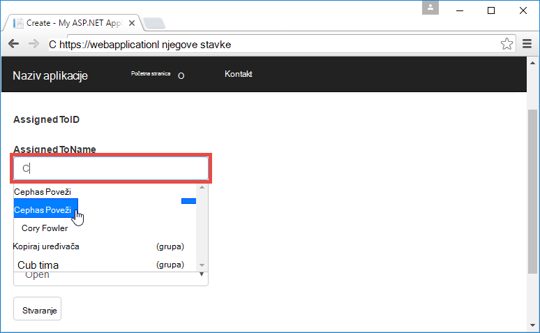

24. Kliknite **Stvori** da biste spremili promjene. Zatim kliknite **Uređivanje** na stvorili radnu stavku da biste pridržavajte istog ponašanja.

Congrats, sada pokrećete aplikaciju za redak tvrtke u Azure s pristupom direktorija! Postoji mnogo više pruža API grafikonu. Potražite u članku [Referenca za Azure AD grafikonu API-JA](https://msdn.microsoft.com/library/azure/ad/graph/api/api-catalog).

## Sljedeći korak

Ako vam je potrebna kontrola pristupa na temelju uloga (RBAC) za aplikaciji azure redak tvrtke, pročitajte članak [WebApp RoleClaims DotNet](https://github.com/Azure-Samples/active-directory-dotnet-webapp-roleclaims) za uzorka tima za Azure Active Directory. Pokazuje kako omogućiti uloge za svoju aplikaciju za Azure Active Directory i autorizirali korisnika završavaju na `[Authorize]` ukras.

Ako redak tvrtke aplikacije potreban pristup lokalnih podataka, potražite u članku [pristup lokalnog resursa pomoću hibridnog veze u aplikacije servisa za Azure](web-sites-hybrid-connection-get-started.md).

## Dodatne resurse

- [Provjere autentičnosti i autorizacije u aplikacije servisa za Azure](../app-service/app-service-authentication-overview.md)
- [Autentičnost s lokalnim servisom Active Directory u aplikaciji programa Azure](web-sites-authentication-authorization.md)
- [Stvaranje retka tvrtke aplikacije u Azure s provjerom autentičnosti AD FS](web-sites-dotnet-lob-application-adfs.md)
- [Aplikacije servisa za provjeru autentičnosti i Azure AD grafikonu API-JA](https://cgillum.tech/2016/03/25/app-service-auth-aad-graph-api/)
- [Uzorci Microsoft Azure Active Directory i u dokumentaciji o](https://github.com/AzureADSamples)
- [Azure Active Directory podržane vrste zahtjeva i tokena](http://msdn.microsoft.com/library/azure/dn195587.aspx)

[Protect the Application with SSL and the Authorize Attribute]: web-sites-dotnet-deploy-aspnet-mvc-app-membership-oauth-sql-database.md#protect-the-application-with-ssl-and-the-authorize-attribute
