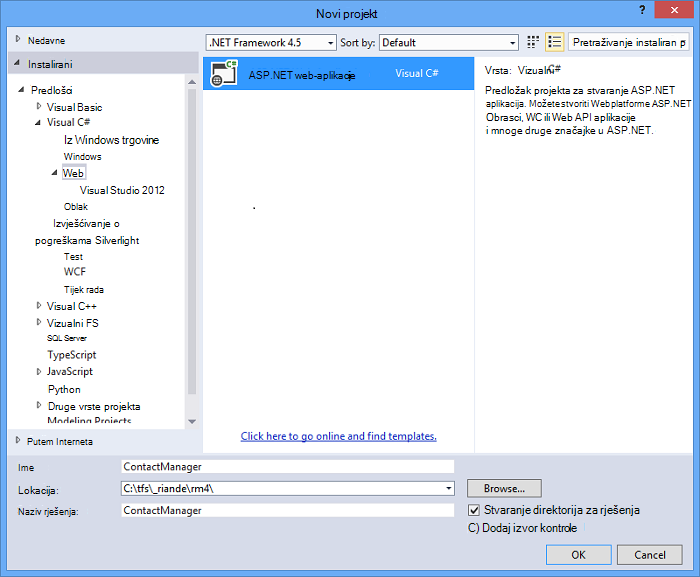
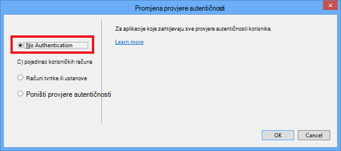
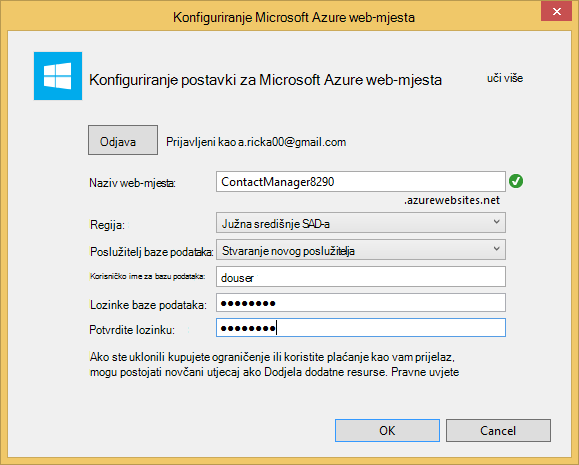
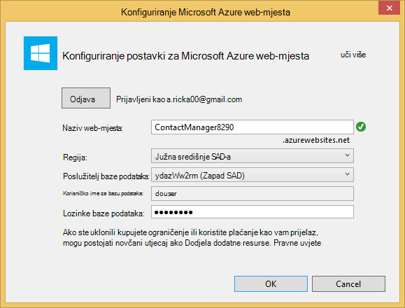
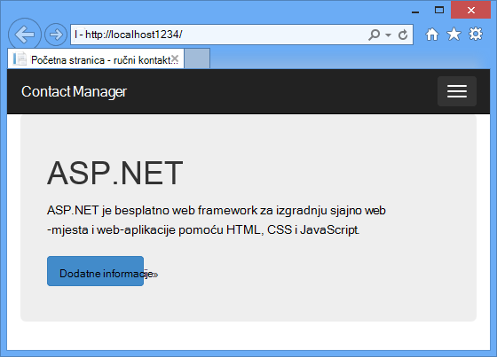
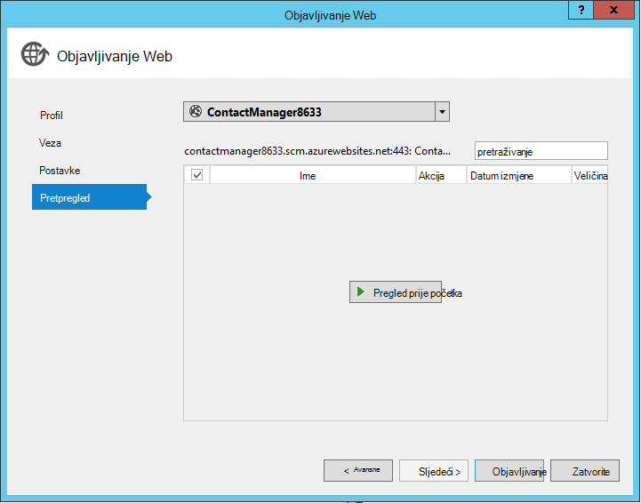
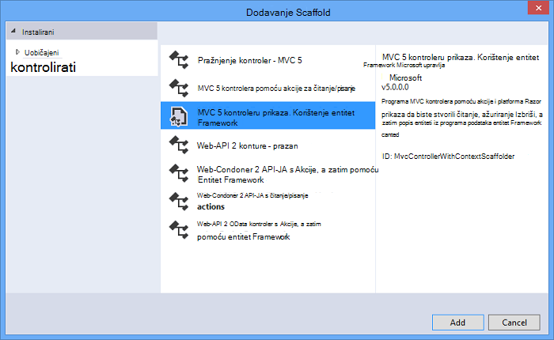
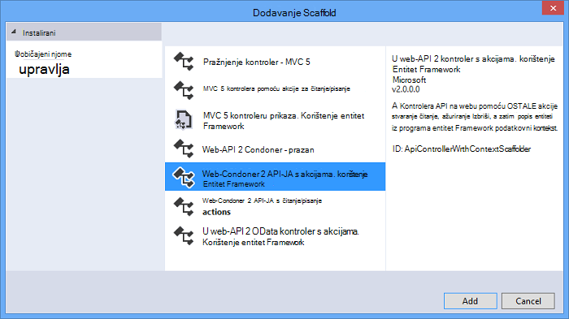
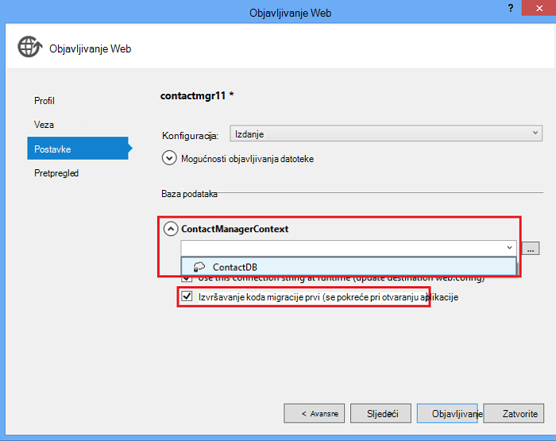

<properties 
    pageTitle="Stvaranje OSTALE servisa pomoću API servisa platforme ASP.NET Web i SQL baze podataka u aplikacije servisa za Azure" 
    description="Praktični vodič ručica za implementaciju aplikacije koja koristi API Web ASP.NET programa Azure web App pomoću programa Visual Studio." 
    services="app-service\web" 
    documentationCenter=".net" 
    authors="Rick-Anderson" 
    writer="Rick-Anderson" 
    manager="wpickett" 
    editor=""/>

<tags 
    ms.service="app-service-web" 
    ms.workload="web" 
    ms.tgt_pltfrm="na" 
    ms.devlang="dotnet" 
    ms.topic="article" 
    ms.date="02/29/2016" 
    ms.author="riande"/>

# Stvaranje OSTALE servisa pomoću API servisa platforme ASP.NET Web i SQL baze podataka u aplikacije servisa za Azure

Pomoću ovog praktičnog vodiča prikazuje kako implementirati web-aplikaciju programa ASP.NET [Aplikacije servisa za Azure](http://go.microsoft.com/fwlink/?LinkId=529714) pomoću čarobnjaka za objavljivanje Web u Visual Studio 2013 ili Visual Studio 2013 zajednice Edition. 

Račun za Azure možete otvoriti besplatno, a ako još nemate Visual Studio 2013 SDK automatski instalira Visual Studio 2013 Web Express. Tako da pokrenete besplatno razvoj za Azure potpuno za.

Pomoću ovog praktičnog vodiča podrazumijeva bez rad Azure prethodnog sa. Na dovršetak ovog praktičnog vodiča, imat ćete jednostavan web-aplikacijama prema gore i pokretanje u oblaku.
 
Ćete saznati:

* Upute za omogućivanje računalu za Azure razvoj instalacijom Azure SDK.
* Upute za stvaranje projekta za Visual Studio ASP.NET MVC 5 i objavljivanje u aplikaciju Azure.
* Kako koristiti ASP.NET Web API da biste omogućili Restful API poziva.
* Kako koristiti SQL baze podataka da biste pohranili podatke servisu Azure.
* Kako objaviti ažuriranja aplikacije Azure.

Ćete stvaranja web-aplikacije jednostavan popis kontakata koji se temelji na ASP.NET MVC 5, a koristi entitet Framework ADO.NET za pristup bazi podataka. Sljedeća ilustracija prikazuje dovršene aplikacije:

![snimka zaslona s web-mjesta][intro001]

<!-- the next line produces the "Set up the development environment" section as see at http://azure.microsoft.com/documentation/articles/web-sites-dotnet-get-started/ -->
[AZURE.INCLUDE [create-account-and-websites-note](../../includes/create-account-and-websites-note.md)]

### Stvaranje projekta

1. Pokrenite Visual Studio 2013.
1. Na izborniku **datoteka** kliknite **Novi projekt**.
3. U dijaloškom okviru **Novi projekt** proširite **Visual C#** i odaberite **Web** , a zatim odaberite **ASP.NET web-aplikacije**. Dodijelite naziv aplikacije **ContactManager** i kliknite **u redu**.

    

1. U dijaloškom okviru **Novi projekt ASP.NET** odaberite predložak **MVC** , potvrdite **Web API -JA** , a zatim kliknite **Promjena provjere autentičnosti**.

1. U dijaloškom okviru **Promjena provjere autentičnosti** kliknite **Bez provjere autentičnosti**, a zatim kliknite **u redu**.

    

    Primjer aplikacije koji stvarate ne biste morali značajki koje zahtijevaju korisnika da se prijavite. Informacije o implementaciji provjere autentičnosti i autorizacije značajki potražite u odjeljku [Sljedeće korake](#nextsteps) na kraju ovog praktičnog vodiča. 

1. U dijaloškom okviru **Novi projekt ASP.NET** provjerite je li potvrđen okvir **glavnog računala u Oblaku** , a zatim kliknite **u redu**.

Ako koju ste već prijavljeni u Azure, zatražit će se za prijavu.

1. Čarobnjak za konfiguraciju predložiti jedinstveni naziv koji se temelji na *ContactManager* (pogledajte na slici u nastavku). Odaberite područje vašoj blizini. [Azurespeed.com](http://www.azurespeed.com/ "AzureSpeed.com") možete koristiti da biste pronašli najniže Latencija podatkovnog centra. 
2. Ako niste stvorili poslužitelj baze podataka prije, odaberite **Stvori novi poslužitelj**, unesite baze podataka korisničko ime i lozinku.

    

Ako poslužitelj baze podataka, koji koristite da biste stvorili novu bazu podataka. Bazu podataka poslužitelja su dragocjeno resursa, a obično želite stvoriti više baza podataka na istom poslužitelju za testiranje i razvoj umjesto stvaranja poslužitelj baze podataka po bazi podataka. Provjerite jesu li web-mjesta i baze podataka u istom području.

### Postavljanje zaglavlje i podnožje

1. U **Pregledniku rješenja**, proširite mapu *Views\Shared* i otvorite datoteku *_Layout.cshtml* .

    ![_Layout.cshtml u pregledniku rješenja][newapp004]

1. Zamijenite sadržaj datoteke *Views\Shared_Layout.cshtml* sljedeći kod:

        <!DOCTYPE html>
        <html lang="en">
        <head>
            <meta charset="utf-8" />
            <title>@ViewBag.Title - Contact Manager</title>
            <link href="~/favicon.ico" rel="shortcut icon" type="image/x-icon" />
            <meta name="viewport" content="width=device-width" />
            @Styles.Render("~/Content/css")
            @Scripts.Render("~/bundles/modernizr")
        </head>
        <body>
            <header>
                

                    

                        
@Html.ActionLink("Contact Manager", "Index", "Home")

                    

                

            </header>
            

                @RenderSection("featured", required: false)
                <section class="content-wrapper main-content clear-fix">
                    @RenderBody()
                </section>
            

            <footer>
                

                    

                        
&copy; @DateTime.Now.Year - Contact Manager

                    

                

            </footer>
            @Scripts.Render("~/bundles/jquery")
            @RenderSection("scripts", required: false)
        </body>
        </html>
            
Oznake iznad promijeniti naziv aplikacije iz "Moje aplikacije ASP.NET" da "Contact Manager" te ga uklanjaju se veze **Početna stranica**, **o** i **kontakt**.

### Pokrenite aplikaciju lokalno

1. Pritisnite CTRL + F5 da biste pokrenuli aplikaciju.
Početna stranica aplikacije pojavit će se u zadanom pregledniku.
    

To je sve što trebate učiniti za sada da biste stvorili aplikacije koje ćete implementirati Azure. Kasnije ćete dodati funkcionalnost baze podataka.

## Implementacija aplikacije Azure

1. U Visual Studio, desnom tipkom miša kliknite projekt u **Pregledniku rješenja** , a zatim na kontekstnom izborniku odaberite **Objavi** .

    ![Objavljivanje u projekt kontekstnog izbornika][PublishVSSolution]

    Otvorit će se čarobnjak za **Objavljivanje Web** -a.

12. Kliknite **Objavi**.

Visual Studio započinje postupak kopiranja datoteke na poslužitelj za Azure. U **izlaznom** prozoru prikazuje akcije koje implementacije okrenutim izvješćima i uspješan dovršetak implementacije.

14. Zadani preglednik otvorit će se automatski URL distribuiranih web-mjesta.

    Aplikaciju koju ste stvorili sada se izvodi u oblaku.
    
    ![Popis učinite početnu stranicu izvodi u Azure][rxz2]

## Dodavanje baze podataka aplikacije

Nakon toga će ažurirati aplikaciju MVC da biste dodali mogućnost za prikaz i ažuriranje kontakata i spremanje podataka u bazi podataka. Aplikacija će koristiti Framework entitet za stvaranje baze podataka i za čitanje i ažuriranje podataka u bazi podataka.

### Dodavanje klase model podataka za kontakte

Započnite tako da stvorite jednostavan podatkovnog modela u kodu.

1. U **Pregledniku rješenja**, desnom tipkom miša kliknite mapu modela, kliknite **Dodaj**, a zatim **predmete**.

    ![Dodajte predmet u Kontekstni izbornik za mape modela][adddb001]

2. U dijaloškom okviru **Dodaj novu stavku** naziv nove datoteke klase *Contact.cs*, a zatim **Dodaj**.

    ![Dodajte novu stavku dijaloški okvir][adddb002]

3. Sadržaj datoteke Contacts.cs zamijenite sljedeći kod.

        using System.Globalization;
        namespace ContactManager.Models
        {
            public class Contact
            {
                public int ContactId { get; set; }
                public string Name { get; set; }
                public string Address { get; set; }
                public string City { get; set; }
                public string State { get; set; }
                public string Zip { get; set; }
                public string Email { get; set; }
                public string Twitter { get; set; }
                public string Self
                {
                    get { return string.Format(CultureInfo.CurrentCulture,
                         "api/contacts/{0}", this.ContactId); }
                    set { }
                }
            }
        }

Klase **obratite se** definira podataka koja će sadržavati za svaki kontakt, uz primarni ključ ContactID koje je potrebno iz baze podataka. Dodatne informacije o podatkovnim modelima u odjeljku [Sljedeće korake](#nextsteps) možete dobiti na kraju ovog praktičnog vodiča.

### Stvaranje web-stranica koji omogućuju korisnicima aplikacije za rad s kontaktima

ASP.NET MVC značajku scaffolding možete automatski generiraj kod koji se izvodi stvaranje, čitanje, ažuriranje i brisanje Akcije (CRUD).

## Dodavanje kontroler i prikaza podataka

1. U **Pregledniku rješenja**, proširite mapu kontrolera.

3. Stvaranje projekta **(Ctrl + Shift + B)**. (Morate stvaranja projekt prije korištenja mehanizam scaffolding.) 

4. Desnom tipkom miša kliknite mapu kontrolera i kliknite **Dodaj**, a zatim kliknite **kontroler**.

    ![Dodavanje kontroler u Kontekstni izbornik za mape kontrolera][addcode001]

1. U dijaloškom okviru **Dodavanje Scaffold** odaberite **MVC kontroler s prikaza, putem Framework entitet** , a zatim kliknite **Dodaj**.

 

6. Postavite naziv kontrolera **HomeController**. Odaberite **kontakt** kao svojoj učionici modela. Kliknite gumb **Novi kontekst za podatke** i prihvatite zadani "ContactManager.Models.ContactManagerContext" za **novu vrstu podataka kontekst**. Kliknite **Dodaj**.

    Dijaloški okvir će vas: "datoteka s nazivom HomeController već zatvara. Želite li ga zamijeniti? ". Kliknite **da**. Ne možemo su prebrisivanje Home kontrolerom koji je stvoren novi projekt. Koristit ćemo novi Home kontrolerom za naše popis kontakata.

    Visual Studio stvara kontroler metode i prikaza za CRUD postupaka baze podataka za **kontakt** objekte.

## Omogućivanje migracije, stvorite bazu podataka, dodajte oglednih podataka i podataka initializer ##

Sljedeći zadatak je da bi omogućio značajku [Prvi Migracija kod](http://curah.microsoft.com/55220) za stvaranje baze podataka na temelju podatkovnog modela koji ste stvorili.

1. Na izborniku **Alati** odaberite **Upravitelj paketa biblioteke** , a zatim **Konzole za Upravitelj paketa**.

    ![Konzola za Upravitelj paketa u izborniku Alati][addcode008]

2. U prozoru **Upravitelja paketima konzole** unesite sljedeću naredbu:

        enable-migrations 
  
    Naredba **Omogući Migracija** stvara mapu *migracije* i stavlja u toj mapi *Configuration.cs* datoteka koje možete urediti da biste konfigurirali migracije. 

2. U prozoru **Upravitelja paketima konzole** unesite sljedeću naredbu:

        add-migration Initial

    Naredba **Dodaj migracije početni** generira klase pod nazivom ** &lt;date_stamp&gt;Početna** koji stvara bazu podataka. Prvi parametar ( *Početna* ) je proizvoljne i koristiti da biste stvorili naziv datoteke. Vidjet ćete nove datoteke za predmete u **Programu Explorer rješenja**.

    U **Početni** predmete metodu **gore** stvara tablice kontakti, a način **dolje** (koristi se kada želite da biste se vratili u prethodno stanje) izostavlja ga.

3. Otvorite datoteku *Migrations\Configuration.cs* . 

4. Dodajte sljedeće prostori. 

         using ContactManager.Models;

5. Zamijenite metodu *Početni broj* sljedeći kod:
        
        protected override void Seed(ContactManager.Models.ContactManagerContext context)
        {
            context.Contacts.AddOrUpdate(p => p.Name,
               new Contact
               {
                   Name = "Debra Garcia",
                   Address = "1234 Main St",
                   City = "Redmond",
                   State = "WA",
                   Zip = "10999",
                   Email = "debra@example.com",
                   Twitter = "debra_example"
               },
                new Contact
                {
                    Name = "Thorsten Weinrich",
                    Address = "5678 1st Ave W",
                    City = "Redmond",
                    State = "WA",
                    Zip = "10999",
                    Email = "thorsten@example.com",
                    Twitter = "thorsten_example"
                },
                new Contact
                {
                    Name = "Yuhong Li",
                    Address = "9012 State st",
                    City = "Redmond",
                    State = "WA",
                    Zip = "10999",
                    Email = "yuhong@example.com",
                    Twitter = "yuhong_example"
                },
                new Contact
                {
                    Name = "Jon Orton",
                    Address = "3456 Maple St",
                    City = "Redmond",
                    State = "WA",
                    Zip = "10999",
                    Email = "jon@example.com",
                    Twitter = "jon_example"
                },
                new Contact
                {
                    Name = "Diliana Alexieva-Bosseva",
                    Address = "7890 2nd Ave E",
                    City = "Redmond",
                    State = "WA",
                    Zip = "10999",
                    Email = "diliana@example.com",
                    Twitter = "diliana_example"
                }
                );
        }

    Kod iznad će pokrenuti bazu podataka s podacima o kontaktu. Dodatne informacije o seeding bazu podataka, potražite u članku [DBs ispravljanje pogrešaka entitet Framework (EF)](http://blogs.msdn.com/b/rickandy/archive/2013/02/12/seeding-and-debugging-entity-framework-ef-dbs.aspx).

1. Na **Konzoli upravitelja paketa** upišite naredbu:

        update-database

    ![Naredbe konzole za Upravitelj paketa][addcode009]

    **Ažuriranje bazu podataka** pokreće prvi migracije koji stvara bazu podataka. Prema zadanim postavkama, baza podataka stvorena je kao baze podataka SQL Server Express LocalDB.

1. Pritisnite CTRL + F5 da biste pokrenuli aplikaciju. 

Aplikacija prikazuje podatke Početni broj i omogućuje uređivanje, Detalji i brisanje veza.

![MVC prikaz podataka][rxz3]

## Uređivanje prikaza

1. Otvorite datoteku *Views\Home\Index.cshtml* . U sljedećem koraku smo će zamijeniti generirane oznake kod koji se koristi [jQuery](http://jquery.com/) i [Knockout.js](http://knockoutjs.com/). Novi kod dohvaća na popisu kontakata iz korištenja web API i JSON i povezuje podatke o kontaktu pomoću knockout.js korisničkog Sučelja. Dodatne informacije potražite u odjeljku [Sljedeće korake](#nextsteps) na kraju ovog praktičnog vodiča. 

2. Sadržaj datoteke zamijeniti sljedeći kod.

        @model IEnumerable<ContactManager.Models.Contact>
        @{
            ViewBag.Title = "Home";
        }
        @section Scripts {
            @Scripts.Render("~/bundles/knockout")
            
        }
        <ul id="contacts" data-bind="foreach: contacts">
            <li class="ui-widget-content ui-corner-all">
                <h1 data-bind="text: Name" class="ui-widget-header"></h1>
                

                

                    ,
                    
                    
                

                

                
Email?

                

                
Twitter?

                
<a data-bind="attr: { href: Self }, click: $root.removeContact" class="removeContact ui-state-default ui-corner-all">Remove</a>

            </li>
        </ul>
        <form id="addContact" data-bind="submit: addContact">
            <fieldset>
                <legend>Add New Contact</legend>
                <ol>
                    <li>
                        <label for="Name">Name</label>
                        <input type="text" name="Name" />
                    </li>
                    <li>
                        <label for="Address">Address</label>
                        <input type="text" name="Address" >
                    </li>
                    <li>
                        <label for="City">City</label>
                        <input type="text" name="City" />
                    </li>
                    <li>
                        <label for="State">State</label>
                        <input type="text" name="State" />
                    </li>
                    <li>
                        <label for="Zip">Zip</label>
                        <input type="text" name="Zip" />
                    </li>
                    <li>
                        <label for="Email">E-mail</label>
                        <input type="text" name="Email" />
                    </li>
                    <li>
                        <label for="Twitter">Twitter</label>
                        <input type="text" name="Twitter" />
                    </li>
                </ol>
                <input type="submit" value="Add" />
            </fieldset>
        </form>

3. Desnom tipkom miša kliknite mapu sadržaja i kliknite **Dodaj**, a zatim kliknite **Nova stavka...**.

    ![Dodavanje listova stila u Kontekstni izbornik sadržaja mape][addcode005]

4. U dijaloškom okviru **Dodaj novu stavku** unesite **stila** u okvir gornji desni pretraživanje, a zatim odaberite **List stilova**.
    ![Dodajte novu stavku dijaloški okvir][rxStyle]

5. Dajte naziv datoteci *Contacts.css* , a zatim kliknite **Dodaj**. Sadržaj datoteke zamijenite sljedeći kod.
    
        .column {
            float: left;
            width: 50%;
            padding: 0;
            margin: 5px 0;
        }
        form ol {
            list-style-type: none;
            padding: 0;
            margin: 0;
        }
        form li {
            padding: 1px;
            margin: 3px;
        }
        form input[type="text"] {
            width: 100%;
        }
        #addContact {
            width: 300px;
            float: left;
            width:30%;
        }
        #contacts {
            list-style-type: none;
            margin: 0;
            padding: 0;
            float:left;
            width: 70%;
        }
        #contacts li {
            margin: 3px 3px 3px 0;
            padding: 1px;
            float: left;
            width: 300px;
            text-align: center;
            background-image: none;
            background-color: #F5F5F5;
        }
        #contacts li h1
        {
            padding: 0;
            margin: 0;
            background-image: none;
            background-color: Orange;
            color: White;
            font-family: Trebuchet MS, Tahoma, Verdana, Arial, sans-serif;
        }
        .removeContact, .viewImage
        {
            padding: 3px;
            text-decoration: none;
        }

    Koristit ćemo list stilova za raspored, boje i stilove koji se koriste u aplikaciji Upravitelj kontakata.

6. Otvorite datoteku *App_Start\BundleConfig.cs* .

7. Dodajte sljedeći kod da biste registrirali [prekrivanja](http://knockoutjs.com/index.html "KO") dodatak.

        bundles.Add(new ScriptBundle("~/bundles/knockout").Include(
                    "~/Scripts/knockout-{version}.js"));
    Ovaj primjer pomoću prekrivanja da biste pojednostavnili dinamički JavaScript kod koji se rukuje predložaka zaslona.

8. Izmjena unos sadržaja/CSS-a da biste registrirali *contacts.css* lista stilova. Promijenite sljedeći redak:

                 bundles.Add(new StyleBundle("~/Content/css").Include(
                   "~/Content/bootstrap.css",
                   "~/Content/site.css"));
Da biste:

        bundles.Add(new StyleBundle("~/Content/css").Include(
                   "~/Content/bootstrap.css",
                   "~/Content/contacts.css",
                   "~/Content/site.css"));

1. Na konzoli za Upravitelj paketa, pokrenite sljedeću naredbu da biste instalirali prekrivanja.

        Install-Package knockoutjs

## Dodavanje kontrolera Web API Restful sučelja

1. U **Pregledniku rješenja**, desnom tipkom miša kliknite kontrolera i kliknite **Dodaj** , a zatim **kontroler...** 

1. U dijaloškom okviru **Dodavanje Scaffold** unesite **Web API 2 kontroler s Akcije, a zatim pomoću Framework entitet** , a zatim kliknite **Dodaj**.

    

4. U dijaloškom okviru **Dodavanje kontroler** unesite "ContactsController" kao naziv kontrolera. Odaberite "Kontakt (ContactManager.Models)" za **predmete modela**.  Zadrži zadane vrijednosti za **predmete kontekst za podatke**. 

6. Kliknite **Dodaj**.

### Pokrenite aplikaciju lokalno

1. Pritisnite CTRL + F5 da biste pokrenuli aplikaciju.

    ![Indeks stranice][intro001]

2. Unesite neki kontakt, a zatim kliknite **Dodaj**. Aplikaciju vraća na početnu stranicu i prikazuje kontakt koji ste unijeli.

    ![Indeks stranica s popisa obaveza][addwebapi004]

3. U pregledniku, dodati **/api/contacts** URL-a.

    Dobiveni URL izgledat će otprilike api/http://localhost:1234/kontakata. Na RESTful API na Webu koji ste dodali vraća pohranjene kontakata. Firefox i Chrome će prikazati podatke u XML formatu.

    ![Indeks stranica s popisa obaveza][rxFFchrome]
    

    IE pita želite li otvoriti ili spremiti kontakte.

    ![Dijaloški okvir Spremi za API na webu][addwebapi006]
    
    
    Vraćeni kontakata možete otvoriti u blok za pisanje ili u pregledniku.
    
    Ovaj izlaz se može trošiti neki drugi program kao što su mobilne web-stranicu ili aplikacije.

    ![Dijaloški okvir Spremi za API na webu][addwebapi007]

    **Sigurnosno upozorenje**: U ovoj fazi aplikacija je nepouzdanog te podložno CSRF napada. Kasnije u ovom praktičnom vodiču uklonit ćemo ovaj slabe. Dodatne informacije potražite u članku [napadima sprječava web-mjesta zatražite krivotvorina (CSRF)][prevent-csrf-attacks].
## Dodavanje zaštite XSRF

Zahtjev za web-mjesta krivotvorina (poznat i kao XSRF ili CSRF) je u slučaju napada protiv hostira na web aplikacije što zlonamjernih web-mjesta možete utjecati interakciju između preglednik klijenta i web-mjesto pouzdanim taj preglednik. Tih napada vrše moguća jer je web-preglednici poslat će tokeni za provjeru autentičnosti automatski sa zahtjevom za svaku na web-mjesto. Primjer kanonskog je provjera autentičnosti kolačića, kao što su ASP. Neto-karata provjere autentičnosti obrazaca. Međutim, web-mjesta pomoću bilo kojeg mehanizam stalni provjere autentičnosti (kao što je provjera autentičnosti sustava Windows, Basic i tako dalje) koje može biti namijenjena po tih napada.

U slučaju napada XSRF se razlikuju od onih krađe identiteta. Napadima krađe identiteta zahtijevaju interakcije s ju. U krađe identiteta zlonamjernih web-mjesta će oponašanje ciljnog web-mjesta i ju je fooled u pruža povjerljive podatke za napadača. U u slučaju napada XSRF postoji često bez interakcije s ju je potrebno. Umjesto toga napadač je potrebe za oslanjanjem na web-pregledniku automatski slatiza sve relevantne kolačiće odredište web-mjesto.

Dodatne informacije potražite u članku [Otvori projekt sigurnost aplikaciju za Web](https://www.owasp.org/index.php/Main_Page) (OWASP) [XSRF](https://www.owasp.org/index.php/Cross-Site_Request_Forgery_(CSRF)).

1. U **Pregledniku rješenja**, desnom tipkom miša **ContactManager** projekta i kliknite **Dodaj** , a zatim kliknite **Predmet**.

2. Dajte naziv datoteci *ValidateHttpAntiForgeryTokenAttribute.cs* i dodati sljedeći kod:

        using System;
        using System.Collections.Generic;
        using System.Linq;
        using System.Net;
        using System.Net.Http;
        using System.Web.Helpers;
        using System.Web.Http.Controllers;
        using System.Web.Http.Filters;
        using System.Web.Mvc;
        namespace ContactManager.Filters
        {
            public class ValidateHttpAntiForgeryTokenAttribute : AuthorizationFilterAttribute
            {
                public override void OnAuthorization(HttpActionContext actionContext)
                {
                    HttpRequestMessage request = actionContext.ControllerContext.Request;
                    try
                    {
                        if (IsAjaxRequest(request))
                        {
                            ValidateRequestHeader(request);
                        }
                        else
                        {
                            AntiForgery.Validate();
                        }
                    }
                    catch (HttpAntiForgeryException e)
                    {
                        actionContext.Response = request.CreateErrorResponse(HttpStatusCode.Forbidden, e);
                    }
                }
                private bool IsAjaxRequest(HttpRequestMessage request)
                {
                    IEnumerable<string> xRequestedWithHeaders;
                    if (request.Headers.TryGetValues("X-Requested-With", out xRequestedWithHeaders))
                    {
                        string headerValue = xRequestedWithHeaders.FirstOrDefault();
                        if (!String.IsNullOrEmpty(headerValue))
                        {
                            return String.Equals(headerValue, "XMLHttpRequest", StringComparison.OrdinalIgnoreCase);
                        }
                    }
                    return false;
                }
                private void ValidateRequestHeader(HttpRequestMessage request)
                {
                    string cookieToken = String.Empty;
                    string formToken = String.Empty;
                    IEnumerable<string> tokenHeaders;
                    if (request.Headers.TryGetValues("RequestVerificationToken", out tokenHeaders))
                    {
                        string tokenValue = tokenHeaders.FirstOrDefault();
                        if (!String.IsNullOrEmpty(tokenValue))
                        {
                            string[] tokens = tokenValue.Split(':');
                            if (tokens.Length == 2)
                            {
                                cookieToken = tokens[0].Trim();
                                formToken = tokens[1].Trim();
                            }
                        }
                    }
                    AntiForgery.Validate(cookieToken, formToken);
                }
            }
        }

1. Dodajte sljedeća naredba za *Korištenje* s kontrolerom ugovore da biste imali pristup atribut **[ValidateHttpAntiForgeryToken]** .

        using ContactManager.Filters;

1. Dodajte atribut **[ValidateHttpAntiForgeryToken]** objavu metode **ContactsController** za zaštitu od prijetnji XSRF. To ćete dodati akcije metoda "PutContact", "PostContact" i **DeleteContact** .

        [ValidateHttpAntiForgeryToken]
            public IHttpActionResult PutContact(int id, Contact contact)
            {

1. Ažurirajte *skripte* dio datoteke *Views\Home\Index.cshtml* da biste dodali kod da biste nabavili tokeni XSRF.

         @section Scripts {
            @Scripts.Render("~/bundles/knockout")
            
         }

## Objavljivanje ažuriranje aplikacije za Azure i SQL baze podataka

Da biste objavili aplikaciju, ponovite postupak iza neke starije verzije.

1. U **Pregledniku rješenja**, desnom tipkom miša kliknite projekt, a zatim odaberite **Objavi**.

    ![Objavljivanje][rxP]

5. Kliknite karticu **Postavke** .
    

1. U odjeljku **ContactsManagerContext(ContactsManagerContext)**, kliknite ikonu **v** da biste promijenili *niz za povezivanje s udaljenom* u nizu za povezivanje za bazu podataka za kontakt. Kliknite **ContactDB**.

    

7. Potvrdite okvir za **Izvršavanje kod prvog migracije (se pokreće pri otvaranju aplikacije)**.

1. Kliknite **Dalje** , a zatim kliknite **Pretpregled**. Visual Studio prikazuje se popis datoteka koje će se dodati ili ažurirati.

8. Kliknite **Objavi**.
Po završetku implementaciju web-pregledniku otvorit će se na početnu stranicu aplikacije.

    ![Indeks stranica s kontakata][intro001]

    Visual Studio objavljivanje postupak automatski konfiguriran niz za povezivanje u distribuiranih *Web.config* datoteke tako da pokazuje na SQL baze podataka. Također, konfigurirati koda migracije prvi automatski nadogradnju baze podataka na najnoviju verziju prvi put aplikacije pristupa bazi podataka nakon implementacije.

    Uslijed tu konfiguraciju kod prvog stvorila bazu podataka tako da pokrenete kod u **početne** predmete koje ste prethodno stvorili. Onako ovo prvi put aplikacija pokušala pristup bazi podataka nakon implementacije.

9. Unesite kontakta kao kada ste pokrenuli aplikaciju lokalno, da biste potvrdili uspješno uvođenje baze podataka.

Kada se prikaže stavku koju unesete je spremljena, a pojavljuje se na stranici Upravitelj kontakata, znate da ga je spremljeno u bazi podataka.

![Indeks stranice s kontaktima][addwebapi004]

Aplikacija je sada izvodi u oblaku, pomoću SQL baze podataka radi pohrane podataka. Kada završite s testiranjem aplikacije u Azure, izbrišite ga. Aplikacija je javan i nema mehanizam ograničiti pristup.

>[AZURE.NOTE] Ako želite započeti s aplikacije servisa za Azure prije registracije za račun za Azure, idite na [Pokušajte aplikacije servisa](http://go.microsoft.com/fwlink/?LinkId=523751), gdje možete odmah stvoriti web-aplikacijama short-lived starter u aplikacije servisa. Nema kreditne kartice potrebna; Nema preuzete obveze.

## Daljnji koraci

Realni aplikacije zahtijeva provjeru autentičnosti i ovlaštenja, a to koristite bazu podataka za članstvo u tu svrhu. Praktični vodič [Implementacija aplikacije sigurne platforme ASP.NET MVC OAuth, članstva i baze podataka SQL](web-sites-dotnet-deploy-aspnet-mvc-app-membership-oauth-sql-database.md) temelje se na ovaj Praktični vodič, a prikazuje kako implementirati web-aplikacije s bazom podataka za članstvo.

Da biste pohranili podatke u aplikaciji za Azure tako da koristite Azure prostor za pohranu, koji omogućuje pohranu koje nisu relacijskih podataka u obliku blob-ova i tablice. Sljedećim vezama navedene dodatne informacije o Web API, ASP.NET MVC i Azure prozora.
 

* [Uvod u entitet Framework pomoću MVC][EFCodeFirstMVCTutorial]
* [Uvod u ASP.NET MVC 5](http://www.asp.net/mvc/tutorials/mvc-5/introduction/getting-started)
* [Na prvom ASP.NET API na webu](http://www.asp.net/web-api/overview/getting-started-with-aspnet-web-api/tutorial-your-first-web-api)
* [Ispravljanje pogrešaka WAWS](web-sites-dotnet-troubleshoot-visual-studio.md)

Pomoću ovog praktičnog vodiča i primjer aplikacije je napisao [Obogaćenog Anderson](http://blogs.msdn.com/b/rickandy/) (na Twitteru [@RickAndMSFT](https://twitter.com/RickAndMSFT)) uz pomoć s prilagođena Darić i Barry Dorrans (Twitteru [@blowdart](https://twitter.com/blowdart)). 

Provjerite ostavite povratne informacije o što vam se sviđa ili što želite da biste vidjeli poboljšane, ne samo o vodič sam već i o proizvodima koji pokazuje. Povratne informacije pridonijet ćete prioritet poboljšanja. Ne možemo zanima osobito doznati koliko kamata postoji više automatizacije za proces konfiguriranja i implementacija članstvo u bazi podataka. 

## Što se promijenilo
* Vodič za promjenu iz aplikacije servisa za web-mjestima potražite u članku: [aplikacije servisa za Azure i Its utjecaj na postojećim Azure servisima](http://go.microsoft.com/fwlink/?LinkId=529714)

<!-- bookmarks -->
[Add an OAuth Provider]: #addOauth
[Add Roles to the Membership Database]:#mbrDB
[Create a Data Deployment Script]:#ppd
[Update the Membership Database]:#ppd2
[setupdbenv]: #bkmk_setupdevenv
[setupwindowsazureenv]: #bkmk_setupwindowsazure
[createapplication]: #bkmk_createmvc4app
[deployapp1]: #bkmk_deploytowindowsazure1
[adddb]: #bkmk_addadatabase
[addcontroller]: #bkmk_addcontroller
[addwebapi]: #bkmk_addwebapi
[deploy2]: #bkmk_deploydatabaseupdate

<!-- links -->
[EFCodeFirstMVCTutorial]: http://www.asp.net/mvc/tutorials/getting-started-with-ef-using-mvc/creating-an-entity-framework-data-model-for-an-asp-net-mvc-application
[dbcontext-link]: http://msdn.microsoft.com/library/system.data.entity.dbcontext(v=VS.103).aspx

<!-- images-->
[rxE]: ./media/web-sites-dotnet-rest-service-aspnet-api-sql-database/rxE.png
[rxP]: ./media/web-sites-dotnet-rest-service-aspnet-api-sql-database/rxP.png
[rx22]: ./media/web-sites-dotnet-rest-service-aspnet-api-sql-database/
[rxb2]: ./media/web-sites-dotnet-rest-service-aspnet-api-sql-database/rxb2.png
[rxz]: ./media/web-sites-dotnet-rest-service-aspnet-api-sql-database/rxz.png
[rxzz]: ./media/web-sites-dotnet-rest-service-aspnet-api-sql-database/rxzz.png
[rxz2]: ./media/web-sites-dotnet-rest-service-aspnet-api-sql-database/rxz2.png
[rxz3]: ./media/web-sites-dotnet-rest-service-aspnet-api-sql-database/rxz3.png
[rxStyle]: ./media/web-sites-dotnet-rest-service-aspnet-api-sql-database/rxStyle.png
[rxz4]: ./media/web-sites-dotnet-rest-service-aspnet-api-sql-database/rxz4.png
[rxz44]: ./media/web-sites-dotnet-rest-service-aspnet-api-sql-database/rxz44.png
[rxNewCtx]: ./media/web-sites-dotnet-rest-service-aspnet-api-sql-database/rxNewCtx.png
[rxPrevDB]: ./media/web-sites-dotnet-rest-service-aspnet-api-sql-database/rxPrevDB.png
[rxOverwrite]: ./media/web-sites-dotnet-rest-service-aspnet-api-sql-database/rxOverwrite.png
[rxPWS]: ./media/web-sites-dotnet-rest-service-aspnet-api-sql-database/rxPWS.png
[rxNewCtx]: ./media/web-sites-dotnet-rest-service-aspnet-api-sql-database/rxNewCtx.png
[rxAddApiController]: ./media/web-sites-dotnet-rest-service-aspnet-api-sql-database/rxAddApiController.png
[rxFFchrome]: ./media/web-sites-dotnet-rest-service-aspnet-api-sql-database/rxFFchrome.png
[intro001]: ./media/web-sites-dotnet-rest-service-aspnet-api-sql-database/dntutmobil-intro-finished-web-app.png
[rxCreateWSwithDB]: ./media/web-sites-dotnet-rest-service-aspnet-api-sql-database/rxCreateWSwithDB.png
[setup007]: ./media/web-sites-dotnet-rest-service-aspnet-api-sql-database/dntutmobile-setup-azure-site-004.png
[setup009]: ../Media/dntutmobile-setup-azure-site-006.png
[newapp002]: ./media/web-sites-dotnet-rest-service-aspnet-api-sql-database/dntutmobile-createapp-002.png
[newapp004]: ./media/web-sites-dotnet-rest-service-aspnet-api-sql-database/dntutmobile-createapp-004.png
[firsdeploy007]: ./media/web-sites-dotnet-rest-service-aspnet-api-sql-database/dntutmobile-deploy1-publish-005.png
[firsdeploy009]: ./media/web-sites-dotnet-rest-service-aspnet-api-sql-database/dntutmobile-deploy1-publish-007.png
[adddb001]: ./media/web-sites-dotnet-rest-service-aspnet-api-sql-database/dntutmobile-adddatabase-001.png
[adddb002]: ./media/web-sites-dotnet-rest-service-aspnet-api-sql-database/dntutmobile-adddatabase-002.png
[addcode001]: ./media/web-sites-dotnet-rest-service-aspnet-api-sql-database/dntutmobile-controller-add-context-menu.png
[addcode002]: ./media/web-sites-dotnet-rest-service-aspnet-api-sql-database/dntutmobile-controller-add-controller-dialog.png
[addcode004]: ./media/web-sites-dotnet-rest-service-aspnet-api-sql-database/dntutmobile-controller-modify-index-context.png
[addcode005]: ./media/web-sites-dotnet-rest-service-aspnet-api-sql-database/dntutmobile-controller-add-contents-context-menu.png
[addcode007]: ./media/web-sites-dotnet-rest-service-aspnet-api-sql-database/dntutmobile-controller-modify-bundleconfig-context.png
[addcode008]: ./media/web-sites-dotnet-rest-service-aspnet-api-sql-database/dntutmobile-migrations-package-manager-menu.png
[addcode009]: ./media/web-sites-dotnet-rest-service-aspnet-api-sql-database/dntutmobile-migrations-package-manager-console.png
[addwebapi004]: ./media/web-sites-dotnet-rest-service-aspnet-api-sql-database/dntutmobile-webapi-added-contact.png
[addwebapi006]: ./media/web-sites-dotnet-rest-service-aspnet-api-sql-database/dntutmobile-webapi-save-returned-contacts.png
[addwebapi007]: ./media/web-sites-dotnet-rest-service-aspnet-api-sql-database/dntutmobile-webapi-contacts-in-notepad.png
[Add XSRF Protection]: #xsrf
[WebPIAzureSdk20NetVS12]: ./media/web-sites-dotnet-rest-service-aspnet-api-sql-database/WebPIAzureSdk20NetVS12.png
[Add XSRF Protection]: #xsrf
[ImportPublishSettings]: ./media/web-sites-dotnet-rest-service-aspnet-api-sql-database/ImportPublishSettings.png
[ImportPublishProfile]: ./media/web-sites-dotnet-rest-service-aspnet-api-sql-database/ImportPublishProfile.png
[PublishVSSolution]: ./media/web-sites-dotnet-rest-service-aspnet-api-sql-database/PublishVSSolution.png
[ValidateConnection]: ./media/web-sites-dotnet-rest-service-aspnet-api-sql-database/ValidateConnection.png
[WebPIAzureSdk20NetVS12]: ./media/web-sites-dotnet-rest-service-aspnet-api-sql-database/WebPIAzureSdk20NetVS12.png
[prevent-csrf-attacks]: http://www.asp.net/web-api/overview/security/preventing-cross-site-request-forgery-(csrf)-attacks
 
