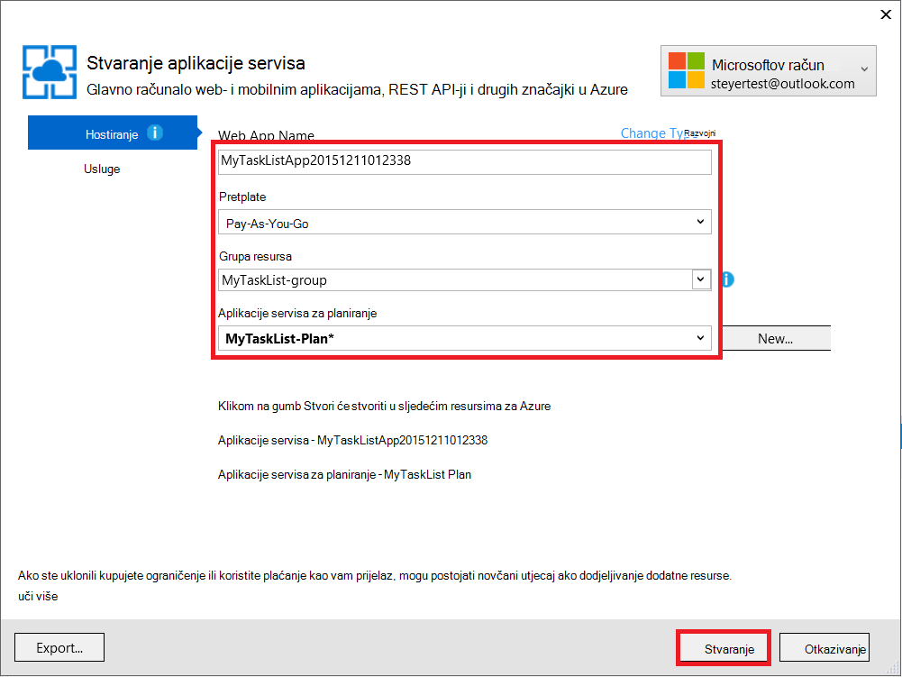
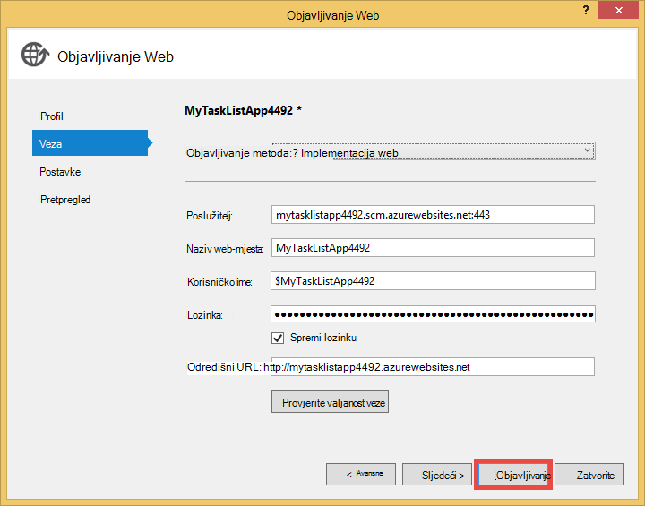

<properties 
    pageTitle="Stvaranje web-aplikacijama u Azure koja se povezuje s MongoDB sustavom virtualnog računala" 
    description="Praktični vodič ručica za korištenje brojka za implementaciju aplikacije ASP.NET aplikacija usluzi Azure povezani MongoDB na programa Azure virtualnog računala."
    tags="azure-portal" 
    services="app-service\web, virtual-machines" 
    documentationCenter=".net" 
    authors="cephalin" 
    manager="wpickett" 
    editor=""/>

<tags 
    ms.service="app-service-web" 
    ms.workload="web" 
    ms.tgt_pltfrm="na" 
    ms.devlang="dotnet" 
    ms.topic="article" 
    ms.date="02/29/2016" 
    ms.author="cephalin"/>

# Stvaranje web-aplikacijama u Azure koja se povezuje s MongoDB sustavom virtualnog računala

Korištenje brojka, možete implementirati ASP.NET aplikacija na web-aplikacije za Azure aplikacije servisa. U ovom ćete praktičnom vodiču će izraditi jednostavne sučelja ASP.NET MVC aplikacije popis zadataka koji se povezuje s bazom podataka MongoDB sustavom virtualnog računala u Azure.  [MongoDB] [ MongoDB] je popularne Otvori izvor, baze podataka NoSQL visoke performanse. Nakon pokretanja i testiranje ASP.NET aplikacija na vašem računalu razvoj, će prijenos aplikacije na aplikaciju servisa web-aplikacije pomoću brojka.

>[AZURE.NOTE] Ako želite započeti s aplikacije servisa za Azure prije registracije za račun za Azure, idite na [Pokušajte aplikacije servisa](http://go.microsoft.com/fwlink/?LinkId=523751), gdje možete odmah stvoriti web-aplikacijama short-lived starter u aplikacije servisa. Nema kreditne kartice potrebna; Nema preuzete obveze.

## Znanja pozadine ##

Za ovaj vodič kroz nije potrebno je korisno znanja od sljedećeg:

* C# upravljački program za MongoDB. Dodatne informacije o razvoju aplikacija C# protiv MongoDB, potražite u članku MongoDB [Centar za jezik CSharp][MongoC#LangCenter]. 
* U okvir ASP .NET web aplikacije. Sve o na sustava [ASP.net web-mjesto]možete saznati[ASP.NET].
* U okvir ASP .NET MVC web aplikacije. Sve o na sustava [ASP.NET MVC web-mjesto]možete saznati[MVCWebSite].
* Azure. Početak rada za čitanje na [Azure][WindowsAzure].

## Preduvjeti ##

- [Visual Studio Express 2013 za web-mjesto]  [ VSEWeb] ili [Visual Studio 2013] [VSUlt]
- [Azure SDK za .NET](http://go.microsoft.com/fwlink/p/?linkid=323510&clcid=0x409)
- Aktivna pretplata na Microsoft Azure

[AZURE.INCLUDE [create-account-and-websites-note](../../includes/create-account-and-websites-note.md)]

 
## Stvaranje virtualnog računala i instalirajte MongoDB ##

Pomoću ovog praktičnog vodiča pretpostavlja da ste stvorili virtualnog računala u Azure. Nakon stvaranja virtualnog računala morate instalirati MongoDB na virtualnog računala:

* Stvaranje virtualnog računala za Windows i instalirati MongoDB potražite u članku [Instalacija MongoDB na virtualnog računala sa sustavom Windows Server u Azure][InstallMongoOnWindowsVM].

Nakon što ste stvorili virtualnog računala u Azure i instalirali MongoDB, obavezno Zapamti DNS naziva virtualnog računala ("testlinuxvm.cloudapp.net", na primjer) i vanjskog priključka za MongoDB koje ste naveli u krajnju točku.  Trebat će vam ove informacije kasnije u ovom praktičnom vodiču.

## Stvaranje aplikacije ##

U ovom odjeljku će stvoriti aplikaciju ASP.NET pod nazivom "Moj popis zadataka" pomoću Visual Studio i izvođenje početnog uvođenja na Azure aplikacije servisa web-aplikacije. Lokalno će pokrenuti aplikaciju, ali ćete povezati virtualnog računala na Azure i tamo koristite MongoDB instancu koju ste stvorili.

1. U Visual Studio, kliknite **Novi projekt**.

    ![Započinjanje novog projekta na stranicu][StartPageNewProject]

1. U prozoru **Novi projekt** , u lijevom oknu odaberite **Visual C#**, a zatim **Web**. U srednjem oknu odaberite **ASP.NET web-aplikacije**. Pri dnu naziv projekta "MyTaskListApp", a zatim kliknite **u redu**.

    ![Novi dijaloški okvir projekta][NewProjectMyTaskListApp]

1. U dijaloškom okviru **Novi projekt ASP.NET** odaberite **MVC**, a zatim kliknite **u redu**.

    ![Odaberite predložak MVC][VS2013SelectMVCTemplate]

1. Ako već niste prijavljeni u Microsoft Azure, zatražit će se za prijavu. Slijedite upute da biste se prijavili u Azure.
2. Kada ste prijavljeni, možete započeti konfiguriranje web-aplikaciju programa aplikacije servisa. Navedite **Naziv Web App**, **aplikacije servisa za planiranje**, **grupa resursa**i **regija**, a zatim kliknite **Stvori**.

    

1. Nakon projekta stvaranje dovrši, pričekajte za web-aplikacija će biti stvoren u aplikacije servisa za Azure, kao što je naznačeno u prozoru **Azure aplikacije servisa aktivnosti** . Kliknite **Objavi MyTaskListApp sada ovo web-aplikaciju**.

1. Kliknite **Objavi**.

    

    Kada zadanu aplikaciju za ASP.NET je objavljen na Azure aplikacije servisa web-aplikacije, pokrenut će se u pregledniku.

## Instalirajte MongoDB C# upravljački program

MongoDB nudi klijentsko podrške za C# aplikacije kroz upravljački program koji morate instalirati na računalu lokalne razvoj. C# upravljački program je dostupan putem NuGet.

Da biste instalirali MongoDB C# upravljački program:

1. U **Pregledniku rješenja**, desnom tipkom miša kliknite projekt **MyTaskListApp** i odaberite **Upravljanje NuGetPackages**.

    ![Upravljanje NuGet paketa][VS2013ManageNuGetPackages]

2. U prozoru **Upravljanje NuGet paketa** u lijevom oknu kliknite na **mreži**. U okvir **Pretraži Online** s desne strane upišite "mongodb.driver".  Kliknite da biste instalirali upravljački program **instalirati** .

    ![Traženje MongoDB C# upravljački program][SearchforMongoDBCSharpDriver]

3. Kliknite **prihvaćam** da biste prihvatili 10gen, Inc. licencne odredbe.

4. Kada je instaliran upravljački program, kliknite **Zatvori** .
    ![Instaliran MongoDB C# upravljački program][MongoDBCsharpDriverInstalled]

Sada je instaliran MongoDB C# upravljački program.  Reference na biblioteke **MongoDB.Bson**, **MongoDB.Driver**i **MongoDB.Driver.Core** su dodani u projekt.

![Reference MongoDB C# upravljački program][MongoDBCSharpDriverReferences]

## Dodavanje modela ##
U **Pregledniku rješenja**, desnom tipkom miša kliknite mape *modela* i **Dodaj** novi **Predmet** i nazovite ih *TaskModel.cs*.  U *TaskModel.cs*zamijenite postojeću Šifra sljedeći kod:

    using System;
    using System.Collections.Generic;
    using System.Linq;
    using System.Web;
    using MongoDB.Bson.Serialization.Attributes;
    using MongoDB.Bson.Serialization.IdGenerators;
    using MongoDB.Bson;
    
    namespace MyTaskListApp.Models
    {
        public class MyTask
        {
            [BsonId(IdGenerator = typeof(CombGuidGenerator))]
            public Guid Id { get; set; }
    
            [BsonElement("Name")]
            public string Name { get; set; }
    
            [BsonElement("Category")]
            public string Category { get; set; }
    
            [BsonElement("Date")]
            public DateTime Date { get; set; }
    
            [BsonElement("CreatedDate")]
            public DateTime CreatedDate { get; set; }
    
        }
    }

## Dodavanje sloj pristupa podacima ##
U **Pregledniku rješenja**, desnom tipkom miša kliknite projekt *MyTaskListApp* pa **Dodaj** **Novu mapu** pod nazivom *DAL*.  Desnom tipkom miša kliknite *DAL* mape i **Dodaj** novi **Predmet**. Datoteka klase *Dal.cs*naziv.  U *Dal.cs*zamijenite postojeću Šifra sljedeći kod:

    using System;
    using System.Collections.Generic;
    using System.Linq;
    using System.Web;
    using MyTaskListApp.Models;
    using MongoDB.Driver;
    using MongoDB.Bson;
    using System.Configuration;
    
    
    namespace MyTaskListApp
    {
        public class Dal : IDisposable
        {
            private MongoServer mongoServer = null;
            private bool disposed = false;
    
            // To do: update the connection string with the DNS name
            // or IP address of your server. 
            //For example, "mongodb://testlinux.cloudapp.net"
            private string connectionString = "mongodb://mongodbsrv20151211.cloudapp.net";
    
            // This sample uses a database named "Tasks" and a 
            //collection named "TasksList".  The database and collection 
            //will be automatically created if they don't already exist.
            private string dbName = "Tasks";
            private string collectionName = "TasksList";
    
            // Default constructor.        
            public Dal()
            {
            }
    
            // Gets all Task items from the MongoDB server.        
            public List<MyTask> GetAllTasks()
            {
                try
                {
                    var collection = GetTasksCollection();
                    return collection.Find(new BsonDocument()).ToList();
                }
                catch (MongoConnectionException)
                {
                    return new List<MyTask>();
                }
            }
    
            // Creates a Task and inserts it into the collection in MongoDB.
            public void CreateTask(MyTask task)
            {
                var collection = GetTasksCollectionForEdit();
                try
                {
                    collection.InsertOne(task);
                }
                catch (MongoCommandException ex)
                {
                    string msg = ex.Message;
                }
            }
    
            private IMongoCollection<MyTask> GetTasksCollection()
            {
                MongoClient client = new MongoClient(connectionString);
                var database = client.GetDatabase(dbName);
                var todoTaskCollection = database.GetCollection<MyTask>(collectionName);
                return todoTaskCollection;
            }
    
            private IMongoCollection<MyTask> GetTasksCollectionForEdit()
            {
                MongoClient client = new MongoClient(connectionString);
                var database = client.GetDatabase(dbName);
                var todoTaskCollection = database.GetCollection<MyTask>(collectionName);
                return todoTaskCollection;
            }
    
            # region IDisposable
    
            public void Dispose()
            {
                this.Dispose(true);
                GC.SuppressFinalize(this);
            }
    
            protected virtual void Dispose(bool disposing)
            {
                if (!this.disposed)
                {
                    if (disposing)
                    {
                        if (mongoServer != null)
                        {
                            this.mongoServer.Disconnect();
                        }
                    }
                }
    
                this.disposed = true;
            }
    
            # endregion
        }
    }

## Dodavanje kontroler ##
Otvorite datoteku *Controllers\HomeController.cs* u **Pregledniku rješenja** i zamijeniti postojeći kod sljedeće:

    using System;
    using System.Collections.Generic;
    using System.Linq;
    using System.Web;
    using System.Web.Mvc;
    using MyTaskListApp.Models;
    using System.Configuration;
    
    namespace MyTaskListApp.Controllers
    {
        public class HomeController : Controller, IDisposable
        {
            private Dal dal = new Dal();
            private bool disposed = false;
            //
            // GET: /MyTask/
    
            public ActionResult Index()
            {
                return View(dal.GetAllTasks());
            }
    
            //
            // GET: /MyTask/Create
    
            public ActionResult Create()
            {
                return View();
            }
    
            //
            // POST: /MyTask/Create
    
            [HttpPost]
            public ActionResult Create(MyTask task)
            {
                try
                {
                    dal.CreateTask(task);
                    return RedirectToAction("Index");
                }
                catch
                {
                    return View();
                }
            }
    
            public ActionResult About()
            {
                return View();
            }
    
            # region IDisposable
    
            new protected void Dispose()
            {
                this.Dispose(true);
                GC.SuppressFinalize(this);
            }
    
            new protected virtual void Dispose(bool disposing)
            {
                if (!this.disposed)
                {
                    if (disposing)
                    {
                        this.dal.Dispose();
                    }
                }
    
                this.disposed = true;
            }
    
            # endregion
    
        }
    }

## Postavljanje stilova ##
Da biste promijenili naslov pri vrhu stranice, otvorite u *Views\Shared\\_Layout.cshtml* datoteka u **Pregledniku rješenja** i zamijeniti "Naziv aplikacije" u zaglavlju navigacijska traka "Moje zadatka popis aplikacija" tako da izgleda ovako:

    @Html.ActionLink("My Task List Application", "Index", "Home", null, new { @class = "navbar-brand" })

Da biste postavili na izborniku popisa zadataka, otvorite datoteku *\Views\Home\Index.cshtml* i zamijeniti postojeći sljedeći kod:
    
    @model IEnumerable<MyTaskListApp.Models.MyTask>
    
    @{
        ViewBag.Title = "My Task List";
    }
    
    <h2>My Task List</h2>
    
    <table border="1">
        <tr>
            <th>Task</th>
            <th>Category</th>
            <th>Date</th>
            
        </tr>
    
    @foreach (var item in Model) {
        <tr>
            <td>
                @Html.DisplayFor(modelItem => item.Name)
            </td>
            <td>
                @Html.DisplayFor(modelItem => item.Category)
            </td>
            <td>
                @Html.DisplayFor(modelItem => item.Date)
            </td>
            
        </tr>
    }
    
    </table>
    
  @Html.Partial("Create", new MyTaskListApp.Models.MyTask())

Da biste dodali mogućnost da biste stvorili novi zadatak, desnom tipkom miša kliknite na *Views\Home\\ * mapu i **Dodavanje** **Prikaz**.  Naziv *Stvori*prikaz. Zamijenite kod sljedeće:

    @model MyTaskListApp.Models.MyTask
    
    
    
    
    
    @using (Html.BeginForm("Create", "Home")) {
        @Html.ValidationSummary(true)
        <fieldset>
            <legend>New Task</legend>
    
            

                @Html.LabelFor(model => model.Name)
            

            

                @Html.EditorFor(model => model.Name)
                @Html.ValidationMessageFor(model => model.Name)
            

    
            

                @Html.LabelFor(model => model.Category)
            

            

                @Html.EditorFor(model => model.Category)
                @Html.ValidationMessageFor(model => model.Category)
            

    
            

                @Html.LabelFor(model => model.Date)
            

            

                @Html.EditorFor(model => model.Date)
                @Html.ValidationMessageFor(model => model.Date)
            

    
            

                <input type="submit" value="Create" />
            

        </fieldset>
    }

**Preglednik rješenja** trebao bi izgledati ovako:

![Preglednik rješenja][SolutionExplorerMyTaskListApp]

## Postavljanje MongoDB niz za povezivanje ##
U **Pregledniku rješenja**, otvorite datoteku *DAL/Dal.cs* . Pronađite sljedeći redak koda:

    private string connectionString = "mongodb://<vm-dns-name>";

Zamjena `<vm-dns-name>` s nazivom DNS virtualnog računala radi MongoDB koji ste stvorili u koraku [stvoriti virtualnog računala i instalirajte MongoDB][] ovog praktičnog vodiča.  Da biste pronašli DNS naziva virtualnog računala, otvorite Azure Portal, odaberite **virtualnim računalima sustava**i pronaći **Naziv DNS-a**.

Ako naziv DNS virtualnog računala je "testlinuxvm.cloudapp.net", a MongoDB priključuje na zadani je priključak 27017, redak niz veze koda će izgledati:

    private string connectionString = "mongodb://testlinuxvm.cloudapp.net";

Ako krajnju točku virtualnog računala određuje drugi vanjski priključak za MongoDB, možete ga Navedite priključak u nizu za povezivanje:

    private string connectionString = "mongodb://testlinuxvm.cloudapp.net:12345";

Dodatne informacije o MongoDB nizu za povezivanje potražite u članku [veze][MongoConnectionStrings].

## Testiranje lokalnu implementaciju ##

Da biste pokrenuli program na računalu razvoj, odaberite **Start ispravljanje pogrešaka** na izborniku **za ispravljanje pogrešaka** ili pritisnite **F5**. IIS Express pokreće i pregledniku otvorit će se i pokreće Početna stranica aplikacije.  Možete dodati novi zadatak koji će biti dodano u bazu podataka MongoDB sustavom virtualnog računala u Azure.

![Moje aplikacije za popis zadataka][TaskListAppBlank]

## Objavljivanje na web-aplikacije aplikacije servisa za Azure

U ovom odjeljku ćete objaviti promjene na Azure aplikacije servisa web-aplikacije.

1. U pregledniku rješenja, ponovno kliknite **MyTaskListApp** desnom tipkom miša, a zatim kliknite **Objavi**.
2. Kliknite **Objavi**.

    Prikazat će se sada web-aplikaciju programa izvodi u aplikacije servisa za Azure i pristupanje MongoDB baze podataka u Azure virtualnih računala.

## Sažetak ##

Uspješno sada implementiran ASP.NET aplikacija na web-aplikacije za Azure aplikacije servisa. Da biste pogledali web-aplikacije:

1. Prijava na Portal za Azure.
2. Kliknite **web-aplikacije**. 
3. Odaberite web-aplikaciju programa na popisu **Web-aplikacije** .

Dodatne informacije o razvoju aplikacija C# protiv MongoDB, potražite u članku [Centar za jezik CSharp][MongoC#LangCenter]. 

[AZURE.INCLUDE [app-service-web-whats-changed](../../includes/app-service-web-whats-changed.md)]
 

<!-- HYPERLINKS -->

[AzurePortal]: http://manage.windowsazure.com
[WindowsAzure]: http://www.windowsazure.com
[MongoC#LangCenter]: http://docs.mongodb.org/ecosystem/drivers/csharp/
[MVCWebSite]: http://www.asp.net/mvc
[ASP.NET]: http://www.asp.net/
[MongoConnectionStrings]: http://www.mongodb.org/display/DOCS/Connections
[MongoDB]: http://www.mongodb.org
[InstallMongoOnWindowsVM]: ../virtual-machines/virtual-machines-windows-classic-install-mongodb.md
[VSEWeb]: http://www.microsoft.com/visualstudio/eng/2013-downloads#d-2013-express
[VSUlt]: http://www.microsoft.com/visualstudio/eng/2013-downloads

<!-- IMAGES -->

[StartPageNewProject]: ./media/web-sites-dotnet-store-data-mongodb-vm/NewProject.png
[NewProjectMyTaskListApp]: ./media/web-sites-dotnet-store-data-mongodb-vm/NewProjectMyTaskListApp.png
[VS2013SelectMVCTemplate]: ./media/web-sites-dotnet-store-data-mongodb-vm/VS2013SelectMVCTemplate.png
[VS2013DefaultMVCApplication]: ./media/web-sites-dotnet-store-data-mongodb-vm/VS2013DefaultMVCApplication.png
[VS2013ManageNuGetPackages]: ./media/web-sites-dotnet-store-data-mongodb-vm/VS2013ManageNuGetPackages.png
[SearchforMongoDBCSharpDriver]: ./media/web-sites-dotnet-store-data-mongodb-vm/SearchforMongoDBCSharpDriver.png
[MongoDBCsharpDriverInstalled]: ./media/web-sites-dotnet-store-data-mongodb-vm/MongoDBCsharpDriverInstalled.png
[MongoDBCSharpDriverReferences]: ./media/web-sites-dotnet-store-data-mongodb-vm/MongoDBCSharpDriverReferences.png
[SolutionExplorerMyTaskListApp]: ./media/web-sites-dotnet-store-data-mongodb-vm/SolutionExplorerMyTaskListApp.png
[TaskListAppBlank]: ./media/web-sites-dotnet-store-data-mongodb-vm/TaskListAppBlank.png
[WAWSCreateWebSite]: ./media/web-sites-dotnet-store-data-mongodb-vm/WAWSCreateWebSite.png
[WAWSDashboardMyTaskListApp]: ./media/web-sites-dotnet-store-data-mongodb-vm/WAWSDashboardMyTaskListApp.png
[Image9]: ./media/web-sites-dotnet-store-data-mongodb-vm/RepoReady.png
[Image10]: ./media/web-sites-dotnet-store-data-mongodb-vm/GitInstructions.png
[Image11]: ./media/web-sites-dotnet-store-data-mongodb-vm/GitDeploymentComplete.png

<!-- TOC BOOKMARKS -->
[Stvaranje virtualnog računala i instalirajte MongoDB]: #virtualmachine
[Create and run the My Task List ASP.NET application on your development computer]: #createapp
[Create an Azure web site]: #createwebsite
[Deploy the ASP.NET application to the web site using Git]: #deployapp
 