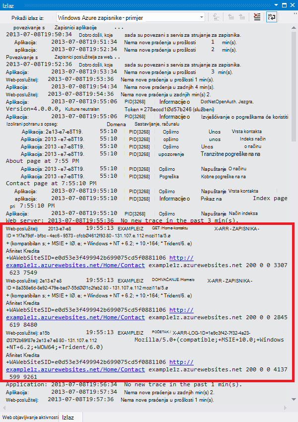

<properties 
    pageTitle="Otklanjanje poteškoća s web-aplikacijama u Azure aplikacije servisa za korištenje Visual Studio" 
    description="Saznajte kako otkloniti poteškoće Azure web-aplikaciju programa pomoću daljinsko uklanjanje programskih pogrešaka, praćenje i zapisivanje alate koji su ugrađeni u Visual Studio 2013." 
    services="app-service" 
    documentationCenter=".net" 
    authors="tdykstra" 
    manager="wpickett" 
    editor=""/>

<tags 
    ms.service="app-service" 
    ms.workload="na" 
    ms.tgt_pltfrm="na" 
    ms.devlang="dotnet" 
    ms.topic="article" 
    ms.date="08/29/2016" 
    ms.author="rachelap"/>

# Otklanjanje poteškoća s web-aplikacijama u Azure aplikacije servisa za korištenje Visual Studio

## Pregled

U ovom ćete praktičnom vodiču saznati kako koristiti Visual Studio tools pomoći za ispravljanje pogrešaka web-aplikacijama [Aplikacije servisa za](http://go.microsoft.com/fwlink/?LinkId=529714)daljinski izvodi u [načinu rada za ispravljanje pogrešaka](http://www.visualstudio.com/get-started/debug-your-app-vs.aspx) ili prikaz zapisnika aplikacije i zapisnici poslužitelja web.

[AZURE.INCLUDE [app-service-web-to-api-and-mobile](../../includes/app-service-web-to-api-and-mobile.md)]

Ćete saznati:

* Koje Azure web-aplikacije upravljanje funkcije dostupne su u Visual Studio.
* Kako koristiti Visual Studio udaljene prikaz da biste brzo promjene na udaljenom web-aplikacijama.
* Upute za ispravljanje pogrešaka način daljinski tijekom projekta izvođenja se izvodi u Azure, za web-aplikacije i za na WebJob.
* Kako stvoriti zapisnika praćenja aplikacije i njihov prikaz dok je aplikacija stvara ih.
* Da biste pogledali zapisnike poslužitelja web, uključujući detaljne poruke o pogreškama i nije uspjela zahtjev za praćenje.
* Upute za slanje dijagnostičkih zapisnika programa Azure za pohranu računa i njihov prikaz postoji.

Ako imate Visual Studio Ultimate, možete koristiti i [IntelliTrace](http://msdn.microsoft.com/library/vstudio/dd264915.aspx) za ispravljanje pogrešaka. Pomoću ovog praktičnog vodiča nije obuhvaćeno IntelliTrace.

## Preduvjeti

Pomoću ovog praktičnog vodiča surađuje razvojno okruženje, web project i Azure web-aplikacije koje ste postavili u [Početak rada s Azure i ASP.NET][GetStarted]. Za sekcije WebJobs, morat ćete aplikacije koje ste stvorili u [Početak rada s Azure WebJobs SDK][GetStartedWJ].

Primjere koda prikazane u ovom ćete praktičnom vodiču su za web-aplikaciju C# MVC, ali postupaka otklanjanja poteškoća jednaki za aplikacije Visual Basic i web-obrasce.

Vodič pretpostavlja da koristite Visual Studio 2015 ili 2013. Ako koristite Visual Studio 2013, značajke WebJobs zahtijevaju [ažuriranje 4](http://go.microsoft.com/fwlink/?LinkID=510314) ili noviji. 

Strujanje zapisnika značajka funkcionira samo za aplikacije koji .NET Framework 4 ili noviji.

## Upravljanje i konfiguracija web app

Visual Studio omogućuje pristup podskup web-aplikacije upravljanje funkcije i konfiguracijske postavke dostupan [Portal za Azure](http://go.microsoft.com/fwlink/?LinkId=529715). U ovom odjeljku vidjet ćete što dostupna pomoću **Programa Explorer poslužitelja**. Da biste vidjeli najnovije značajke Azure integracije i isprobajte **Explorer oblaka** . Na izborniku **Prikaz** možete otvoriti i windows. 

1. Ako niste već prijavljeni na Azure u Visual Studio, kliknite gumb **za povezivanje s Azure** u **Programu Explorer poslužitelja**.

    Zamjena je da biste instalirali upravljanje certifikat koji omogućuje pristup računu. Ako odaberete da biste instalirali certifikat, desnom tipkom miša kliknite čvor **Azure** u **Programu Explorer poslužitelja**, a zatim **Upravljanje i filtar pretplate** na kontekstnom izborniku. U dijaloškom okviru **Upravljanje pretplatama Azure** kliknite karticu **potvrde** , a zatim **uvoza**. Slijedite upute za preuzimanje, a zatim uvezete datoteku pretplate (naziva se i *.publishsettings* datoteke) za vaš račun za Azure.

    > [AZURE.NOTE]
    > Ako preuzimate datoteku pretplatu, spremite ga u mapu izvan vaše izvorni kod direktorija (na primjer, u mapi preuzimanja), a zatim ga izbrišite u kada se uvoz dovrši. Zlonamjeran korisnik koji poboljšava pristup datoteci pretplate možete uređivati, stvaranje i brisanje servisa Azure.

    Dodatne informacije o povezivanju s resursima za Azure s Visual Studio potražite u članku [Upravljanje korisničkim računima, pretplate i administratorske uloge](http://go.microsoft.com/fwlink/?LinkId=324796#BKMK_AccountVCert).

2. U **Programu Explorer poslužitelja**proširite **Azure** a **Aplikacije servisa**.

3. Proširivanje grupa resursa koji obuhvaća web-aplikacije koje ste stvorili u [Uvod u rad s Azure i ASP.NET][GetStarted], a zatim desnom tipkom miša kliknite čvor web app i kliknite **Postavke prikaza**.

    

    Pojavit će se kartica **Azure web-aplikacije** pa možete vidjeti ima web app upravljanje i konfiguriranje zadatke koji su dostupni u Visual Studio.

    

    U ovom ćete praktičnom vodiču hoćete li koristiti zapisnika i padajuće izbornike za praćenje. Ćete koristiti i daljinsko uklanjanje programskih pogrešaka, ali koristit ćete različite metode da biste omogućili.
   
    Informacije o okvirima postavki aplikacije i nizove veze u tom prozoru, potražite u članku [Azure web-aplikacije: kako nizovi aplikacije i rad niza veze](http://blogs.msdn.com/b/windowsazure/archive/2013/07/17/windows-azure-web-sites-how-application-strings-and-connection-strings-work.aspx).

    Ako želite izvesti zadatak upravljanja web aplikacije koji ne može izvesti u tom prozoru kliknite **Otvori u Portal za upravljanje** da biste otvorili prozor preglednika Azure portal.

## Pristup web-aplikacije datoteke u programu Explorer poslužitelja

Obično implementacija web projekta s na `customErrors` zastavice u datoteci Web.config postavljena na `On` ili `RemoteOnly`, što znači da ne se poruka o pogrešci korisna kad nešto dolazi pogrešne. Za mnoge pogreške sve se stranica je kao što je jedan od sljedećih one.

**Pogreška poslužitelja '/' aplikacije:**

**Pojavila se pogreška:**

**Na web-mjesto ne može prikazati na stranicu**

Često najlakše ćete pronaći uzrok pogreške jest omogućivanje detaljne porukama o pogreškama koje prvo prethodne snimke zaslona objašnjava kako. Koji zahtijeva promjene u distribuiranih Web.config datoteke. Nije moguće uređivanje *Web.config* datoteke u projekt i ponovno implementirate projekta, ili stvorite na [Web.config pretvaranje](http://www.asp.net/mvc/tutorials/deployment/visual-studio-web-deployment/web-config-transformations) i implementacija Sastavi za ispravljanje pogrešaka, ali postoji i brži način: u **Pregledniku rješenja** koje možete izravno prikaz i uređivanje datoteka u aplikaciji web udaljene pomoću značajke *udaljene prikaz* .

1. U **Programu Explorer poslužitelja**proširite **Azure**, proširite **Aplikacije servisa**, proširivanje grupa resursa web-aplikaciju programa smješten u, a Proširite čvor za web-aplikacije.

    Vidjet ćete čvorove koje dati pristup web-aplikaciji sadržaja datoteke i datoteke zapisnika.

2. Proširite čvor **datoteke** , a zatim dvokliknite datoteku *Web.config* .

    

    Visual Studio otvara Web.config datoteke s udaljenog web-aplikacije i prikazuje [alat za analizu daljinske] pokraj naziva datoteke na naslovnoj traci.

3. Dodajte na sljedeći redak u `system.web` elementa:

    `<customErrors mode="Off"></customErrors>`

    

4. Osvježite preglednik koji se prikazuje na beskorisno poruka o pogrešci, a sada dobivate poruku detaljne pogreške, kao što su u sljedećem primjeru:

    

    (Pogreška prikazano stvorena dodavanjem redaka prikazuju crvenom crtom *Views\Home\Index.cshtml*.)

Uređivanje datoteke Web.config je samo jedan primjer slučajevi u kojima mogućnost za čitanje i uređivanje datoteka na Azure web-aplikaciju programa provjerite olakšavaju otklanjanje poteškoća s.

## Udaljena pogrešaka web-aplikacije

Ako na detaljne poruka o pogrešci ne sadrži dovoljno informacija, a ne možete ponovno stvoriti lokalno pogreške, drugi način za rješavanje problema s je daljinski Pokreni u načinu rada za ispravljanje pogrešaka. Možete postaviti prekidne točke, izravno rukovati memorije, Prođite kod i čak i promijeniti put kod. 

Daljinsko uklanjanje programskih pogrešaka ne funkcionira u izdanjima sustava Express programa Visual Studio.

U ovom se odjeljku objašnjava za ispravljanje pogrešaka daljinski pomoću projekta koje stvorite u [Uvod u rad s Azure i ASP.NET][GetStarted].

1. Otvaranje projekta web koju ste stvorili u [Uvod u rad s Azure i ASP.NET][GetStarted].

1. Otvorite *Controllers\HomeController.cs*.

2. Brisanje na `About()` način i umetanje sljedeći kod umjesto nje.

        public ActionResult About()
        {
            string currentTime = DateTime.Now.ToLongTimeString();
            ViewBag.Message = "The current time is " + currentTime;
            return View();
        }

2. [Postavljanje programa točku prekida](http://www.visualstudio.com/get-started/debug-your-app-vs.aspx) u `ViewBag.Message` redak.

1. U **Pregledniku rješenja**, desnom tipkom miša kliknite projekt, a zatim kliknite **Objavi**.

2. Na padajućem popisu **profil** odaberite jednak profilu koji ste koristili u [Uvod u rad s Azure i ASP.NET][GetStarted].

3. Kliknite karticu **Postavke** i promjenu **konfiguracije** za **ispravljanje pogrešaka**, a zatim **Objavi**.

    

4. Nakon implementacije Završi i pregledniku otvorit će se URL Azure web-aplikacije, zatvorite preglednik.

5. U programu **Explorer poslužitelj**, desnom tipkom miša kliknite web-aplikaciju programa, a zatim **Priložite alat za ispravljanje pogrešaka**. 

    

    Web-pregledniku otvorit će se automatski izvodi u Azure početnu stranicu. Možda ćete morati pričekati 20 sekundi, odnosno tako da tijekom Azure postavlja poslužitelj za ispravljanje pogrešaka. Odgode pojavljuje se samo prvi put pokrenete u načinu rada za ispravljanje pogrešaka na web-aplikacijama. Sljedeći puta unutar pri pokretanju ispravljanje pogrešaka ponovno ima sljedeći 48 sati neće biti odgodu.

    **Bilješke:** Ako imate neki imate li problema prilikom pokretanja program za ispravljanje pogrešaka, pokušajte učiniti pomoću **Programa Explorer oblaka** umjesto **Explorer poslužitelja**.

6. Na izborniku kliknite **o** .

    Visual Studio prestaje na na točku prekida i kod izvodi u Azure, ne i na lokalnom računalu.

7. Postavite pokazivač miša na `currentTime` varijabla da biste vidjeli vremensku vrijednost.

    

    Vrijeme vidite je vrijeme Azure poslužitelja koja može biti u drugu vremensku zonu od lokalnog računala.

8. Unesite novu vrijednost za na `currentTime` varijable, kao što su "Sada radi u Azure".

5. Pritisnite F5 da biste nastavili pokrenut.

    Na stranici o izvodi u Azure prikazuju novu vrijednost koju ste unijeli u varijablu currentTime.

    

## Udaljena WebJobs za ispravljanje pogrešaka

U ovom se odjeljku objašnjava ispravljanje pogrešaka daljinski pomoću projekta i web-aplikacije koje stvorite u [Početak rada s Azure WebJobs SDK](websites-dotnet-webjobs-sdk.md). 

Značajke prikazane u ovom odjeljku su dostupne samo u Visual Studio 2013 s ažuriranjem 4 ili noviji. 

Daljinsko uklanjanje programskih pogrešaka funkcionira samo s neprekinutim WebJobs. Planirani i na zahtjev WebJobs ne podržavaju ispravljanje pogrešaka.

1. Otvaranje projekta web koju ste stvorili u [Početak rada s Azure WebJobs SDK][GetStartedWJ].

1. U programu project ContosoAdsWebJob otvorite *Functions.cs*.

2. [Postavljanje programa točku prekida](http://www.visualstudio.com/get-started/debug-your-app-vs.aspx) na prvu naredbu u na `GnerateThumbnail` način.

    

1. U **Pregledniku rješenja**, desnom tipkom miša kliknite project web (ne projekt WebJob), a zatim kliknite **Objavi**.

2. Na padajućem popisu **profil** odaberite jednak profilu koji ste koristili u [Početak rada s Azure WebJobs SDK](websites-dotnet-webjobs-sdk.md).

3. Kliknite karticu **Postavke** i promjenu **konfiguracije** za **ispravljanje pogrešaka**, a zatim **Objavi**.

    Visual Studio uvodi web i WebJob projektima, a vaš preglednik otvara Azure URL web-aplikacije.

5. U **Programu Explorer poslužitelja** proširite **Azure > aplikacije servisa > grupu resursa > web-aplikaciju programa > WebJobs > neprekinuto**, a zatim desnom tipkom miša kliknite **ContosoAdsWebJob**.

7. Kliknite **Priloži ispravljanje pogrešaka**. 

    

    Web-pregledniku otvorit će se automatski izvodi u Azure početnu stranicu. Možda ćete morati pričekati 20 sekundi, odnosno tako da tijekom Azure postavlja poslužitelj za ispravljanje pogrešaka. Odgode pojavljuje se samo prvi put pokrenete u načinu rada za ispravljanje pogrešaka na web-aplikacijama. Kada sljedeći put priložiti u ispravljanje neće biti kašnjenje u ako radite u roku od 48 sati.

6. U web-pregledniku koja je otvorena na početnu stranicu Contoso reklame stvorite novu ad. 

    Stvaranje programa ad uzrokuje reda čekanja poruka će biti stvoren, koji će se izdvojiti tako da na WebJob i obrađuju. Kada WebJobs SDK poziva funkciju za obradu reda čekanja poruka, kod će kliknete na točku prekida.

7. Kada program za ispravljanje pogrešaka prekidi na vašem točku prekida, možete pregledati i promijeniti vrijednostima varijable dok je pokrenut program u oblak. Na sljedećoj slici program za ispravljanje pogrešaka prikazuje sadržaj blobInfo objekt koji je proslijeđen metodu GenerateThumbnail.

    
 
5. Pritisnite F5 da biste nastavili pokrenut.

    Način GenerateThumbnail Završi stvaranje minijaturu.

6. U pregledniku, osvježite stranicu indeksa i potražite minijaturu.

6. U Visual Studio, pritisnite SHIFT + F5 da biste prestali ispravljanje pogrešaka.

7. U programu **Explorer poslužitelj**, desnom tipkom miša kliknite čvor ContosoAdsWebJob, a zatim kliknite **Prikaz nadzorne ploče**.

8. Prijavite se pomoću vjerodajnica za Azure, a zatim kliknite naziv WebJob da biste prešli na stranicu za vaše WebJob. 

    

    Na nadzornoj ploči koji prikazuje funkciju GenerateThumbnail izvršava nedavno.

    (Sljedeći put kliknete **Prikaz nadzorne ploče**, ne morate prijaviti i pregledniku prelazi izravno na stranicu za vaše WebJob.)

9. Kliknite naziv funkcije da biste vidjeli detalje o izvođenja funkcija.

    

Ako vaš funkcija [napisali zapisnika](websites-dotnet-webjobs-sdk-storage-queues-how-to.md#logs), možete pritisnuti **ToggleOutput** da biste ih vidjeli.

## Napomene vezane uz daljinsko uklanjanje programskih pogrešaka

* Ne preporučuje se u načinu rada za ispravljanje pogrešaka u proizvodnje. Ako web-aplikaciju programa radnog nisu umjerene odgovor na više instanci poslužitelja, ispravljanje pogrešaka onemogućuje web-poslužitelj odgovara na zahtjeve. Ako imate više instanci poslužitelja web kada u program za ispravljanje pogrešaka dobit ćete slučajni instance, a ne postoji drugi način da biste bili sigurni zahtjeva za kasnije preglednika će na tu instancu. Osim toga, obično ne implementacije ispravljanje pogrešaka Sastavi radnog i alata za Kompiliranje optimizacije za izdanje izgradi možda onemogućuju da biste prikazali što se događa redak po redak u izvornog koda. Za otklanjanje poteškoća proizvodnje, vaše najbolje resurs je aplikacija zapisnici poslužitelja za praćenje i na webu.

* Izbjegavanje dugo tabulatora pri prekidne točke kad je Udaljena ispravljanje pogrešaka. Azure tretira postupak koji je zaustavljena dulje od nekoliko minuta kao proces ne reagira, a zatvara se.

* Dok ste pogrešaka poslužitelj šalje podataka za Visual Studio, koji može utjecati na prikaz za troškove propusnosti. Informacije o propusnosti stope potražite u članku [Azure cijene](/pricing/calculator/).

* Provjerite je li u `debug` atribut u `compilation` element u datoteci *Web.config* postavljen na true. Je postavljen na true po zadanom kada objavljujete konfiguraciju Sastavi ispravljanje pogrešaka.

        <system.web>
          <compilation debug="true" targetFramework="4.5" />
          <httpRuntime targetFramework="4.5" />
        </system.web>

* Utvrdite li da program za ispravljanje pogrešaka neće korak u kod koji želite ispraviti pogreške, možda ćete morati promijeniti postavke samo moje kodom.  Dodatne informacije potražite u članku [ograničiti korak samo moje kodom](http://msdn.microsoft.com/library/vstudio/y740d9d3.aspx#BKMK_Restrict_stepping_to_Just_My_Code).

* Kada omogućite značajku udaljene pogrešaka i nakon 48 sati značajku automatski se isključuje, vremena se pokreće na poslužitelju. To ograničenje 48 sat obavlja sigurnosti i performansi razloga. Možete jednostavno uključite značajku neograničen proizvoljan broj puta. Preporučujemo da ostavite je onemogućena kada se ne aktivno pogrešaka.

* Program za ispravljanje pogrešaka možete ručno priložiti izvođenja procesa, ne samo web app postupka (w3wp.exe). Dodatne informacije o tome kako koristiti način rada za ispravljanje pogrešaka u Visual Studio potražite u članku [značajka ispravljanja pogrešaka u Visual Studio](http://msdn.microsoft.com/library/vstudio/sc65sadd.aspx).

## Pregled dijagnostičkih zapisnika

ASP.NET aplikacija koji se izvodi u Azure web-aplikaciju programa možete stvoriti sljedeće vrste zapisnika:

* **Zapisnici praćenje aplikacije** 
  Aplikacija stvara ti zapisnici tako da nazovete metode klase [System.Diagnostics.Trace](http://msdn.microsoft.com/library/system.diagnostics.trace.aspx) .
* **Zapisnici poslužitelja za web** 
  Web-poslužitelj stvara stavku zapisnika za svaki zahtjev HTTP web App.
* **Detaljne zapisivanje poruke** 
  Web-poslužitelj stvara HTML stranicu s nekih dodatnih informacija za neuspjelih zahtjeva HTTP (one koje rezultiraju Šifra stanja 400 ili noviji). 
* **Nije uspjelo zahtjev za praćenje zapisnika** 
  Web-poslužitelj stvara XML datoteku s detaljne praćenje podataka nije uspjelo HTTP zahtjeva za. Web-poslužitelj nudi XSL datoteku da biste oblikovali XML u pregledniku.
  
Zapisivanje utječe na performanse web app da Azure vam omogućuje radi omogućivanja i onemogućivanja svaku vrstu zapisnika prema potrebi. Za aplikacije zapisnike, možete odrediti moraju biti napisani zapisnika iznad određenu razinu težinu. Kad stvorite novu web-aplikaciju po zadanom sve zapisivanje je onemogućen.

Zapisnici zapisuju se datoteka u *LogFiles* mapi u datotečnom sustavu web-aplikacije koje su dostupne putem FTP. Zapisnici aplikacije i zapisnici poslužitelja web možete također biti napisani poslovnim subjektom Azure prostora za pohranu. Možete zadržati veće količine zapisnika u račun za pohranu nego što je moguće u datotečnom sustavu. Ste ograničeni na najviše 100 MB zapisnika kada koristite datotečnom sustavu. (Datoteka sustava zapisnika su samo za kratkotrajni zadržavanja. Azure briše stare datoteke zapisnika da biste oslobodili prostor za nove kada se dostigne ograničenje.)  

## Stvaranje i prikaz zapisnika praćenja aplikacije

U ovom odjeljku ćete učiniti sljedeće zadatke:

* Dodavanje naredbi za praćenje projekt web koju ste stvorili u [Početak rada s Azure i ASP.NET][GetStarted].
* U zapisnicima kada pokrenete projekt lokalno.
* U zapisnicima kao što su generira aplikacije koje se izvode u Azure. 

Informacije o stvaranju aplikacije zapisnike u WebJobs, u odjeljku [kako raditi s Azure reda čekanja za pohranu pomoću SDK WebJobs – kako napisati zapisnika](websites-dotnet-webjobs-sdk-storage-queues-how-to.md#logs). Sljedeće upute za prikaz zapisnika i kontrola kako su pohranjene u Azure također primjenjuju se na zapisnika aplikacija stvorila WebJobs. 

### Dodavanje naredbi za praćenje aplikacije

1. Otvorite *Controllers\HomeController.cs*, a zatim Zamijeni na `Index`, `About`, i `Contact` metode s sljedeći kod da biste dodali `Trace` izvješća, a `using` izjava za `System.Diagnostics`:

        public ActionResult Index()
        {
            Trace.WriteLine("Entering Index method");
            ViewBag.Message = "Modify this template to jump-start your ASP.NET MVC application.";
            Trace.TraceInformation("Displaying the Index page at " + DateTime.Now.ToLongTimeString());
            Trace.WriteLine("Leaving Index method");
            return View();
        }
        
        public ActionResult About()
        {
            Trace.WriteLine("Entering About method");
            ViewBag.Message = "Your app description page.";
            Trace.TraceWarning("Transient error on the About page at " + DateTime.Now.ToShortTimeString());
            Trace.WriteLine("Leaving About method");
            return View();
        }
        
        public ActionResult Contact()
        {
            Trace.WriteLine("Entering Contact method");
            ViewBag.Message = "Your contact page.";
            Trace.TraceError("Fatal error on the Contact page at " + DateTime.Now.ToLongTimeString());
            Trace.WriteLine("Leaving Contact method");
            return View();
        }       

2. Dodavanje u `using System.Diagnostics;` izjava na vrhu datoteke.
                
### Prikaz praćenje izlaz lokalno

3. Pritisnite F5 da biste pokrenuli program u načinu rada za ispravljanje pogrešaka.

    Praćenje ga slušatelj zadani zapisuje sve izlazne praćenja u **izlaznom** prozoru zajedno s drugim izlaz ispravljanje pogrešaka. Sljedeća ilustracija prikazuje Izlaz iz izjave o praćenju koje ste dodali u `Index` način.

    

    Sljedeći koraci pokazati kako pogledati praćenjem izlaza u web-stranicu bez Kompiliranje u načinu rada za ispravljanje pogrešaka.

2. Otvorite datoteku Web.config aplikacije (onoga koji se nalazi u mapi projekt) i dodajte je `<system.diagnostics>` elemenata na kraju ona neposredno prije zatvaranje `</configuration>` elementa:

        <system.diagnostics>
            <trace>
              <listeners>
                <add name="WebPageTraceListener"
                    type="System.Web.WebPageTraceListener, 
                    System.Web, 
                    Version=4.0.0.0, 
                    Culture=neutral,
                    PublicKeyToken=b03f5f7f11d50a3a" />
              </listeners>
            </trace>
          </system.diagnostics>

    Na `WebPageTraceListener` omogućuje vam prikaz praćenje izlaz pregledavanjem `/trace.axd`.

3. Dodavanje <a href="http://msdn.microsoft.com/library/vstudio/6915t83k(v=vs.100).aspx">praćenja element</a> u odjeljku `<system.web>` u datoteci Web.config, kao što su u sljedećem primjeru:

        <trace enabled="true" writeToDiagnosticsTrace="true" mostRecent="true" pageOutput="false" />

3. Pritisnite CTRL + F5 da biste pokrenuli aplikaciju.

4. U adresnu traku prozora preglednika, dodajte *trace.axd* URL, a zatim pritisnite tipku Enter (URL će biti sličan http://localhost:53370/trace.axd).

5. Na stranici **Aplikacije praćenje** kliknite **Prikaz detalja** u prvom retku (ne BrowserLink crtu).

    

    Pojavit će se stranica **Pojedinosti zahtjev** pa u odjeljku **Podaci o praćenju** vidjeti Izlaz iz izjave o praćenju koje ste dodali u `Index` način.

    

    Prema zadanim postavkama `trace.axd` dostupna je samo lokalno. Ako ste željeli ga učiniti dostupnim s udaljenog web-aplikacijama, možete dodati `localOnly="false"` da biste na `trace` element u datoteci *Web.config* , kao što je prikazano u sljedećem primjeru:

        <trace enabled="true" writeToDiagnosticsTrace="true" localOnly="false" mostRecent="true" pageOutput="false" />

    Međutim, omogućivanje `trace.axd` u proizvodnje web-aplikacije se obično ne preporučuje sigurnosnih vam razloga i u sljedećim odjeljcima vidjet ćete jednostavniji način za čitanje praćenje zapisnika u aplikaciji programa Azure web.

### Prikaz praćenje izlazni servisu Azure

1. U **Pregledniku rješenja**, desnom tipkom miša kliknite web project, a zatim kliknite **Objavi**.

2. U dijaloškom okviru **Objavljivanje Web** kliknite **Objavi**.

    Nakon Visual Studio objavljuje ažuriranje, otvara se prozor preglednika na početnu stranicu (Ako niste poništite **Odredišni URL** na kartici **veza** ).

3. U programu **Explorer poslužitelj**, desnom tipkom miša kliknite web-aplikaciju programa, a zatim odaberite **Prikaz zapisnika strujanje**. 

    

    U **izlaznom** prozoru prikazuje povezani s servis za strujanje za zapisnika i dodaje redak obavijesti Svaka minuta koja se proteže bez zapisnika da bi se prikazao.

    

4. U prozoru preglednika koji pokazuje početnu stranicu aplikacije, kliknite **kontakt**.

    Nekoliko sekundi Izlaz iz razinu pogrešaka praćenje ste dodali u `Contact` pojavit će se način u **izlaznom** prozoru.

    

    Visual Studio pokazuje samo kašnjenja razinu pogrešaka jer je zadana postavka Kada omogućite zapisnika nadzora servisa. Prilikom stvaranja nove aplikacije Azure web sve je onemogućeno zapisivanje prema zadanim postavkama, kao što se prikazivalo kada ste je otvorili na stranici Postavke ranije:

    

    No, odabrani **Prikaz zapisnika strujanje**Visual Studio promijeniti automatski **Logging(File System) aplikacije** **pogreške**, što znači biti objavljeni zapisnika razinu pogrešaka. Da biste vidjeli sve svoje praćenje zapisnika, možete promijeniti ovu postavku u **tekstni**. Kad odaberete razinu težinu koja je manja od pogreške, sve zapisnicima više razine težinu i prijavio. Tako da odaberete opširno, vidjet i informacije, upozorenja i zapisnika pogrešaka.  

4. U programu **Explorer poslužitelj**, desnom tipkom miša kliknite web-aplikaciju, a zatim **Postavke prikaza** kao koje ste prethodno poduzeli.

5. Promjena **Aplikacije zapisivanje (datotečni sustav)** u **tekstni**, a zatim kliknite **Spremi**.
 
    

6. U prozoru preglednika koji se sada prikazuje vašu stranicu **kontakt** , kliknite **Polazno**, a zatim kliknite **o**pa kliknite **kontakt**.

    Nekoliko sekundi u **izlaznom** prozoru prikazuje sve praćenje izlaz.

    

    U ovom odjeljku omogućuje i onemogućuje zapisivanje pomoću postavki Azure web app. Omogućivanje i onemogućivanje praćenje slušače izmjenom Web.config datoteke. Međutim, izmjena Web.config datoteke uzrokuje domene aplikacije u koš za, prilikom omogućivanja zapisivanja putem web-aplikacije konfiguracija ne učiniti. Ako se problem traje predugo reproduciranje, ili Povremeni, recikliranje aplikacije domene možda "popravite" i za Pričekajte da se to događa ponovno. Omogućivanje Dijagnostika u Azure ne to učinili, da biste počeli odmah Dohvaćanje informacija o pogrešci.

### Izlaz značajke prozora

Kartici **Zapisnici Azure** u **izlaznom** prozoru sadrži nekoliko gumba i tekstni okvir:

To učinite sljedeće funkcije:

* Poništite u **izlaznom** prozoru.
* Omogućivanje i onemogućivanje prelamanje riječi.
* Pokrenite ili zaustavite zapisnika nadzora.
* Odredite koji zapisuje praćenje.
* Preuzmite zapisnika.
* Filtriranje zapisnika na temelju niz za pretraživanje ili uobičajenog izraza.
* Zatvorite prozor **Izlaz** .

Ako unesete niz za pretraživanje ili Uobičajeni izraz, Visual Studio filtrira se podaci zapisnika na klijentskom računalu. To znači da unesete kriterij nakon zapisnici prikazuju se u **izlaznom** prozoru i kriterije filtriranja možete promijeniti bez potrebe za Obnovi zapisnike.

## Prikaz zapisnika poslužitelja za web

Zapisnici poslužitelja web snimite sve aktivnosti HTTP-a za web-aplikacije. Da biste ih vidjeli u **izlaznom** prozoru morate omogućiti ih za web-aplikacije i recite Visual Studio koje želite nadzirati ih. 

1. Na kartici **Azure web-aplikacije konfiguracija** koju ste otvorili iz **Programa Explorer poslužitelj**, promijenite Web Server zapisivanje **na**, a zatim **Spremi**.

    

2. U **izlaznom** prozoru, kliknite gumb za **Određivanje Azure zapisnike praćenje** .
    
    

3. U dijaloškom okviru **Mogućnosti zapisivanja Azure** odaberite **Zapisnici poslužitelja Web**, a zatim kliknite **u redu**.

    

4. U prozoru preglednika koji prikazuje web-aplikaciji kliknite **Polazno**, a zatim kliknite **o**pa kliknite **kontakt**.

    Zapisnike aplikacije obično se nalaze, nakon čega slijedi zapisnici poslužitelja web. Možda ćete morati pričekati neko vrijeme da se zapisnici da se pojavi. 

    

Prema zadanim postavkama, kada prvi put omogućite zapisnici poslužitelja web pomoću Visual Studio Azure piše zapisnike u datotečni sustav. Može pomoću portala za Azure da biste odredili tom web-poslužitelju zapisnika moraju biti napisani spremniku blob u račun za pohranu.

Ako koristite portalu da biste omogućili web-poslužitelj prijave na račun za Azure prostora za pohranu, a zatim Onemogući zapisivanje u Visual Studio kada ponovno omogućite zapisivanje u Visual Studio postavki računa za pohranu se vraćaju. 

## Prikaz detaljnih zapisivanje poruke

Detaljne zapisivanje sadrže neke dodatne informacije o HTTP zahtjeva koji kao rezultat šifre pogrešaka odgovor (400 ili noviji). Da biste ih vidjeli u **izlaznom** prozoru, morate ih omogućiti za web-aplikacije i recite Visual Studio koje želite nadzirati ih.

1. Na kartici **Azure web-aplikacije konfiguracija** koju ste otvorili iz **Programa Explorer poslužitelja**promijeniti **Detaljne poruke o pogreškama** **na**, a zatim **Spremi**.

    

2. U **izlaznom** prozoru, kliknite gumb za **Određivanje Azure zapisnike praćenje** .

3. U dijaloškom okviru **Mogućnosti zapisivanja Azure** kliknite **Zapisnici o sve**, a zatim kliknite **u redu**.

    

4. U adresnu traku prozora preglednika, dodajte znak dodatni URL uzrokuju o pogrešci 404 (na primjer, `http://localhost:53370/Home/Contactx`), a zatim pritisnite Enter.

    Nakon nekoliko sekundi zapisnika detaljne pogreška se pojavljuje u prozoru Visual Studio **Izlaz** .

    

    Control + kliknite vezu da biste vidjeli izlaz zapisnika oblikovan u pregledniku:

    

## Preuzimanje datoteka sustava zapisnika

Bilo koji zapisnika koji možete pratiti u **izlaznom** prozoru je moguće preuzeti i kao *.zip* datoteku. 

1. U **izlaznom** prozoru kliknite **Preuzimanje strujanje zapisnika**.

    

    S odabranom preuzetu datoteku, otvorit će se Eksplorer za datoteke u mapi *preuzimanja* .

    

2. Izdvajanje *.zip* datoteku, a vidite struktura mapa za sljedeće:

    

    * Aplikacija praćenje zapisnika nalaze se *.txt* datoteke u mapi *LogFiles\Application* .
    * Zapisnici poslužitelja web su *.log* datoteke u mapi *LogFiles\http\RawLogs* . Da biste pogledali i upravljati tim datotekama možete koristiti alata kao što su [Analizator zapisnika](http://www.microsoft.com/download/details.aspx?displaylang=en&id=24659) .
    * Detaljne zapisivanje poruke su *.html* datoteke u mapi *LogFiles\DetailedErrors* .

    (Je *implementacijama* mapa za datoteke stvorene u izvora kontrole za objavljivanje; ne sadrži ništa vezane uz Visual Studio objavljivanje. *Brojka* mapa namijenjena kašnjenja vezane uz upravljanje izvornim objavljivanje i prijava datoteka strujanje.)  

## Prikaz zapisnika prostora za pohranu

Aplikacije praćenje zapisnici mogu poslati i račun za Azure prostora za pohranu i njihov prikaz u Visual Studio. Da biste to učinili ćete stvorite račun za pohranu, Omogućivanje zapisnika prostora za pohranu na portalu klasični i njihov prikaz na kartici **Zapisnici** prozora **Azure web-aplikacije** .

Možete poslati zapisnike nešto ili sve od tri odredišta:

* Datotečni sustav.
* Tablica račun za pohranu.
* Prostor za pohranu blob-ova računa.

Možete navesti razinu različite težinu za svaki odredište. 

Tablice pojednostavljuju prikaz detalja o zapisnika putem Interneta, a oni podržavaju strujanje; možete upit zapisnike u tablicama i pogledajte novu zapisnike dok ih se stvarate. Blob-ova olakšavaju za preuzimanje zapisnike u datotekama i analizirati ih pomoću HDInsight, jer HDInsight ne zna da biste radili s spremište blobova platforme. Dodatne informacije potražite u članku **Hadoop i MapReduce** [Mogućnosti pohrane podataka (sastavni stvarnog života oblaka web -aplikacije s Azure)](http://www.asp.net/aspnet/overview/developing-apps-with-windows-azure/building-real-world-cloud-apps-with-windows-azure/data-storage-options).

Koju trenutno imate datoteke sustava zapisnika postavite na opširno razinu; Sljedeći koraci će vas voditi kroz postavljanje razine zapisnika informacije da biste prešli na tablice račun za pohranu. Informacije o razini znači sve zapisnike stvoriti tako da nazovete `Trace.TraceInformation`, `Trace.TraceWarning`, a `Trace.TraceError` će se prikazati, ali ne zapisnici stvoreni tako da nazovete `Trace.WriteLine`.

Računi za pohranu nude više prostora za pohranu i dulje traju zadržavanja za zapisnike u usporedbi s datotečnom sustavu. Drugi prednost slanje zapisnika praćenje aplikaciju za pohranu jest da ćete dobiti nekih dodatnih informacija s svaki zapisnik koji ne dobijete iz zapisnika za datoteke sustava.

5. Desnom tipkom miša kliknite **prostora za pohranu** u odjeljku čvor Azure, a zatim kliknite **Stvori račun za pohranu**.

3. U dijaloškom okviru **Stvaranje računa za pohranu** unesite naziv računa za pohranu. 

    Naziv mora biti mora biti jedinstvena (bez nekim drugim računom Azure prostora za pohranu mogu imati isti naziv). Ako unesete naziv već se koristi dobit ćete moći promijeniti.

    URL za izravan pristup računu za pohranu bit će *{name}*. core.windows.net. 

5. Padajućeg popisa **regija ili grupe afinitet** regija postavljeno na na najbliži vama.

    Tom se postavkom određuje koje Azure podatkovnog centra će hostira vaš račun za pohranu. Pomoću ovog praktičnog vodiča izboru neće provjerite uočljivijih razlika, ali za proizvodnju web-aplikaciji želite web-poslužitelj i račun za pohranu u istom području da biste minimizirali izlazne troškove Latencija i podataka. Web-aplikaciju (koje ćete stvarati kasnije) trebale bi funkcionirati u regiji što bliže moguće preglednici pristupa web-aplikaciju programa da biste minimizirali Latencija.

6. Postavite **replikacije** padajućeg popisa na **lokalno suvišnih**. 

    Kada zemlj replikacijom je omogućen za račun za pohranu, pohranjeni sadržaj je replicirati na sekundarnom podatkovnog centra da biste omogućili prebacivanje na to mjesto u slučaju glavne Izrada u primarnom mjestu. Zemlj replikacije može uzrokovati dodatne troškove. Za testiranje i razvoj račune, obično ne želite li platiti zemlj replikacije. Dodatne informacije potražite u članku [Stvaranje, upravljanje, i brisanje računa za pohranu](../storage-create-storage-account/#replication-options).

5. Kliknite **Stvori**. 

      

1. U prozoru za Visual Studio **Azure Web App** , kliknite karticu **zapisnike** , a zatim **Konfiguriranje prijaviti na Portal za upravljanje**.

    <!-- todo:screenshot of new portal if the VS page link goes to new portal -->
    

    Otvoriti karticu **Konfiguracija** klasični portalu za web-aplikacije.

2. Na kartici **Konfiguriraj** klasični portal, pomaknite se prema dolje do odjeljka aplikacije dijagnostici, a zatim promijenite **Aplikacije zapisivanje (spremište tablica)** da biste **na**.

3. Promijenite **razinu zapisivanja** **informacija**.

4. Kliknite **Upravljanje spremištem tablica**.

    

    Ako imate više od jedne, u okvir za **Upravljanje spremištem tablica za aplikacije dijagnostici** odaberite računa za pohranu. Možete stvoriti novu tablicu ili postojećeg.

    

6. U okvir za **Upravljanje spremištem tablica za aplikacije dijagnostici** kliknite kvačicu da biste zatvorili okvir.

6. Na kartici **Konfiguriraj** klasični portal, kliknite **Spremi**.

7. U prozoru preglednika koji se prikazuje aplikacija web-aplikaciji kliknite **Polazno**, a zatim kliknite **o**pa kliknite **kontakt**.

    Račun za pohranu će biti zapisane Zapisnički podaci za koje je stvorio pregledavanja ove web-stranice.

8. Na kartici **Zapisnici** u prozoru **Azure web-aplikacije** u Visual Studio, u odjeljku **Dijagnostičkih sažetak**kliknite **Osvježi** .

    

    U odjeljku **Dijagnostičkih sažetak** po zadanom prikazuje zapisnika tijekom posljednjeg 15 minuta. Možete promijeniti razdoblje da biste vidjeli dodatne zapisnike. 

    (Ako nailazite na pogrešku "tablica nije pronađen", provjerite klikanju na stranice koje se praćenje kada ste omogućili **Aplikacije zapisivanje (Spremanje)** , a nakon klika na **Spremi**.)

    

    Imajte na umu da u tom prikazu vidite **ID procesa** i **Niti ID** za svaki zapisnik koji ne primite u zapisnicima sistemske datoteke. Dodatna polja možete vidjeti tako izravno prikaz tablice Azure prostora za pohranu.

8. Kliknite **zapisnicima na sve aplikacije**.

    Tablica zapisnika praćenje pojavljuje se u pregledniku tablice Azure prostora za pohranu.
   
    (Ako nailazite na pogrešku "nema elemenata sadrži niz", otvorite **Eksplorer za poslužitelj**, proširite čvor za vaš račun za pohranu u odjeljku čvor **Azure** , a zatim desnom tipkom miša kliknite **tablica** i kliknite **Osvježi**.)

    

    Ova prikaz prikazuje dodatna polja ne vidite sve prikaze. Prikaz omogućuje vam da biste filtrirali zapisnike pomoću posebnih korisničkog Sučelja Sastavljač upita za izgradnje upita. Dodatne informacije potražite u članku Rad s resursima za tablice – filtriranje entiteti [Pregledavanje](http://msdn.microsoft.com/library/ff683677.aspx)resursa za pohranu pomoću programa Explorer poslužitelja.

7. Da biste vidjeli detalje o jednom retku, dvokliknite jedan ili više redaka.

    

## U zapisnicima zahtjeva praćenje

Potrebno je razumjeti detalje o kako IIS obrađuje HTTP zahtjev, u slučajevima kao što je URL upisivanjem ili provjere autentičnosti problema su korisne zahtjeva praćenje zapisnika. 

Azure web-aplikacije koristiti isti zahtjeva praćenje funkciju koja nije dostupno u sklopu IIS 7.0 ili novijim. Nemate pristup postavke za IIS konfiguriranje pogrešaka koje se prijavili, no. Kada omogućite Praćenje neuspjelih zahtjeva, sve pogreške snimaju. 

Možete omogućiti praćenje neuspjelih zahtjeva pomoću Visual Studio, ali ih nije moguće prikazati u Visual Studio. Ti zapisnici su XML datoteke. Servis za strujanje zapisnika nadzire samo datoteke koje se smatra čitljiv u načinu običnog teksta: *.txt*, *.html*i *.log* datoteke.

Zapisnici praćenje zahtjeva možete pogledati u pregledniku izravno putem FTP ili lokalno nakon korištenja alata za FTP da biste ih preuzeli s vašim lokalnim računalom. U ovom odjeljku koje ćete njihov prikaz u pregledniku izravno.

1. Na kartici **konfiguracije** prozoru **Azure web-aplikacije** koje ste otvorili iz **Programa Explorer Server**promijenite **Nije uspjela zahtjev za praćenje** **na**, a zatim **Spremi**.

    

4. U adresnu traku prozora preglednika koji prikazuje web-aplikaciji dodajte znak dodatni URL, a zatim pritisnite Enter da biste uzrokovati o pogrešci 404.

    Zbog toga zapisnik praćenje zahtjeva za stvaranje i na sljedeći način prikažite kako pogledati ili preuzimanje u zapisnik.

2. U Visual Studio, na kartici **konfiguracije** prozora **Azure Web App** , kliknite **Otvori u Portal za upravljanje**.

3. U plohu **Postavke** [Azure Portal](https://portal.azure.com) za web-aplikaciju, kliknite **implementacije vjerodajnice**, a zatim unesite novo korisničko ime i lozinku.

    

    ** Prilikom prijave, morate koristiti cijeli korisničko ime s nazivom web app mjestu da biste ga. Ako, na primjer, ako kao korisničko ime unesite "myid" i "myexample" je na web-mjesto, prijave u obliku "myexample\myid".

5. U novom prozoru preglednika, idite na URL koji se prikazuje u odjeljku **FTP naziv glavnog računala** ili **naziv glavnog računala FTPS** plohu **Web-aplikacije** za web-aplikacije. 

6. Prijavite se pomoću vjerodajnica FTP koju ste stvorili ranije (uključujući web app prefiksa naziva za korisničko ime).

    Web-pregledniku prikazuje se u korijenskoj mapi web-aplikaciji.

6. Otvorite mapu *LogFiles* .

    

7. Otvorite mapu pod nazivom W3SVC plus numeričku vrijednost.

    

    Mapa sadrži XML datoteke za sve pogreške koje nisu zabilježene kada je omogućen Praćenje neuspjelih zahtjeva i XSL datoteka koje se u pregledniku možete koristiti da biste oblikovali XML.

    

8. Kliknite XML datoteku za nije uspjelo zahtjev za koje želite da biste vidjeli informacije o praćenju za.

    Sljedeća ilustracija prikazuje dio praćenje informacija za otklanjanje pogrešaka uzorka.

    

## Daljnji koraci

Ste vidjeti kako Visual Studio olakšava zapisnicima koji je stvorio Azure web-aplikaciju programa. Sljedeći odjeljci sadrže veze na dodatne resurse na povezane teme:

* Otklanjanje poteškoća s Azure web app
* Ispravljanje pogrešaka u Visual Studio 
* Alat za analizu daljinske ispravljanje pogrešaka u Azure
* Praćenje u aplikacijama platforme ASP.NET
* Analiziranje zapisnici poslužitelja za web
* Analiza nije uspjela zahtjev za praćenje zapisnika
* Ispravljanje pogrešaka servise u Oblaku

### Otklanjanje poteškoća s Azure web app

Dodatne informacije o otklanjanju poteškoća s web-aplikacije u aplikacije servisa za Azure potražite u sljedećim resursima:

* [Upute za praćenje web-aplikacije](/manage/services/web-sites/how-to-monitor-websites/)
* [Istražuje osipanjem memorije u Azure web-aplikacijama s Visual Studio 2013](http://blogs.msdn.com/b/visualstudioalm/archive/2013/12/20/investigating-memory-leaks-in-azure-web-sites-with-visual-studio-2013.aspx). Microsoft ALM članak na blogu o značajkama za Visual Studio za analizu upravlja memorije problema.
* [Azure web-aplikacije online Alati trebate znati o](/blog/2014/03/28/windows-azure-websites-online-tools-you-should-know-about-2/). Objava na blogu Amit Apple.

Pomoć za određeno pitanje za otklanjanje poteškoća, pokrenite niti na jedan od forumima za sljedeće:

* [U Azure forum na web-mjestu ASP.NET](http://forums.asp.net/1247.aspx/1?Azure+and+ASP+NET).
* [Forum na Azure na MSDN-u](http://social.msdn.microsoft.com/Forums/windowsazure/).
* [StackOverflow.com](http://www.stackoverflow.com).

### Ispravljanje pogrešaka u Visual Studio 

Dodatne informacije o tome kako koristiti način rada za ispravljanje pogrešaka u Visual Studio potražite u temi MSDN [značajka ispravljanja pogrešaka u Visual Studio](http://msdn.microsoft.com/library/vstudio/sc65sadd.aspx) i [Savjeti za ispravljanje pogrešaka s Visual Studio 2010](http://weblogs.asp.net/scottgu/archive/2010/08/18/debugging-tips-with-visual-studio-2010.aspx).

### Alat za analizu daljinske ispravljanje pogrešaka u Azure

Dodatne informacije o daljinsko uklanjanje programskih pogrešaka za Azure web-aplikacije i WebJobs potražite u sljedećim resursima:

* [Uvod u udaljene pogrešaka aplikacije servisa za Azure web-aplikacije](/blog/2014/05/06/introduction-to-remote-debugging-on-azure-web-sites/).
* [Uvod u udaljene ispravljanje pogrešaka Azure aplikacije servisa web-aplikacije dio 2 - unutar daljinsko uklanjanje programskih pogrešaka](/blog/2014/05/07/introduction-to-remote-debugging-azure-web-sites-part-2-inside-remote-debugging/)
* [Uvod u daljinsko uklanjanje programskih pogrešaka Azure servisa Web aplikacija dio 3 – više instanci okruženje i BROJKA](/blog/2014/05/08/introduction-to-remote-debugging-on-azure-web-sites-part-3-multi-instance-environment-and-git/)
* [WebJobs pogrešaka (videozapis)](https://www.youtube.com/watch?v=ncQm9q5ZFZs&list=UU_SjTh-ZltPmTYzAybypB-g&index=1)

Web-aplikaciju programa koristi se API servisa Azure Web ili mobilne usluge pozadinske i morate za ispravljanje pogrešaka koje potražite u članku [Pozadinskog .NET ispravljanje pogrešaka u Visual Studio](http://blogs.msdn.com/b/azuremobile/archive/2014/03/14/debugging-net-backend-in-visual-studio.aspx).

### Praćenje u aplikacijama platforme ASP.NET

Na raspolaganju su bez temeljito i ažurirane Uvod u ASP.NET praćenje na Internetu. Najbolje možete učiniti je početak rada s stare uvodni materijale sastavljene za web-obrasce jer MVC niste postoji još i dodatku izjavi koji se noviji bloga objava koji su usmjereni na određene probleme. Neke dobar mjesta da biste pokrenuli su u sljedećim resursima:

* [Nadzor i Telemetriju (sastavni stvarnog života oblaka web-aplikacije s Azure)](http://www.asp.net/aspnet/overview/developing-apps-with-windows-azure/building-real-world-cloud-apps-with-windows-azure/monitoring-and-telemetry).  Poglavlja E knjiga s preporuke za praćenje u aplikacijama za Azure oblaka.
* [Praćenje platforme ASP.NET](http://msdn.microsoft.com/library/ms972204.aspx) 
  Stari, ali i dalje dobar izbor za osnovni Uvod u predmetu.
* [Praćenje slušače](http://msdn.microsoft.com/library/4y5y10s7.aspx) 
  Informacije o praćenju slušače, ali ne spominje [WebPageTraceListener](http://msdn.microsoft.com/library/system.web.webpagetracelistener.aspx).
* [Vodič: Integriranje ASP.NET praćenje s System.Diagnostics praćenje](http://msdn.microsoft.com/library/b0ectfxd.aspx) 
  To je stari, ali sadrži dodatne informacije o uvodni članak ne obuhvaća.
* [Praćenje u prikazima platforma Razor MVC platforme ASP.NET](http://blogs.msdn.com/b/webdev/archive/2013/07/16/tracing-in-asp-net-mvc-razor-views.aspx) 
  Osim praćenje u prikazima platforma Razor objave objašnjava kako stvoriti filtar za pogreške da bi se sve neobrađenu iznimke prijava u aplikaciju MVC. Informacije o prijavi sve neobrađenu iznimke u aplikaciju za web-obrasce, pogledajte primjer Global.asax u [Dovršeno primjer rukovatelja pogreške](http://msdn.microsoft.com/library/bb397417.aspx) na MSDN-u. MVC ili u web-obrasce, ako želite prijaviti neke iznimke, ali omogućuju framework zadani rukovanje preuzimanje efekt, možete Uhvatite i rethrow kao u sljedećem primjeru:

        try
        {
           // Your code that might cause an exception to be thrown.
        }
        catch (Exception ex)
        {
            Trace.TraceError("Exception: " + ex.ToString());
            throw;
        } 

* [Strujanje Dijagnostika praćenje prijave s Azure naredbenog retka (plus predstavili!)](http://www.hanselman.com/blog/StreamingDiagnosticsTraceLoggingFromTheAzureCommandLinePlusGlimpse.aspx) 
  Upute za korištenje naredbenog retka da biste učinili koje ovog praktičnog vodiča pokazuje kako raditi u Visual Studio. [Bacite brzi pogled](http://www.hanselman.com/blog/IfYoureNotUsingGlimpseWithASPNETForDebuggingAndProfilingYoureMissingOut.aspx) je alat za ispravljanje pogrešaka aplikacije ASP.NET. 
* [Pomoću web-aplikacije zapisivanje i Dijagnostika - Nevena Ebbo](/documentation/videos/azure-web-site-logging-and-diagnostics/) i [strujanje zapisnike iz aplikacija za Web - s Nevena Ebbo](/documentation/videos/log-streaming-with-azure-web-sites/) 
  Videozapisi luka Hanselman i Nevena Ebbo.

Zapisivanje pogrešaka prilikom pisanja koda praćenje alternative je za korištenje programa framework zapisivanje Otvori izvor kao što su [ELMAH](http://nuget.org/packages/elmah/). Dodatne informacije potražite u članku [luka Hanselman bloga o ELMAH](http://www.hanselman.com/blog/NuGetPackageOfTheWeek7ELMAHErrorLoggingModulesAndHandlersWithSQLServerCompact.aspx).

Osim toga, imajte na umu da ne morate koristiti ASP.NET ili System.Diagnostics praćenje ako želite da se strujanje zapisnika iz Azure. Azure web-aplikacije strujanje zapisnika servisa će strujanje *.txt*, *.html*ili *.log* datoteku koja se nalazi u mapi *LogFiles* . Dakle, mogli biste stvoriti vlastiti zapisivanje sustav koji zapisuje u datotečnom sustavu web-aplikaciji, a datoteke bit će automatski strujanjem i preuzeti. Sve što trebate učiniti kod pisanja aplikacije koje se stvara datoteka u mapi *d:\home\logfiles* . 

### Analiziranje zapisnici poslužitelja za web

Dodatne informacije o analiza zapisnici poslužitelja web potražite u sljedećim resursima:

* [LogParser](http://www.microsoft.com/download/details.aspx?id=24659) 
  Alat za prikaz podataka u web-poslužitelj log (*.log* datoteke).
* [Otklanjanje poteškoća s probleme s performansama IIS ili pogreške aplikacije pomoću LogParser](http://www.iis.net/learn/troubleshoot/performance-issues/troubleshooting-iis-performance-issues-or-application-errors-using-logparser) 
  Uvod u alat za analizator zapisnika koje možete koristiti da biste analizirali zapisnici poslužitelja web.
* [Bloga po Robert McMurray o korištenju LogParser](http://blogs.msdn.com/b/robert_mcmurray/archive/tags/logparser/) 
* [Šifra stanja HTTP-a u IIS 7.0, IIS 7.5 i IIS 8.0](http://support.microsoft.com/kb/943891)

### Analiza nije uspjela zahtjev za praćenje zapisnika

Na web-mjestu Microsoft TechNet sadrži [Pomoću nije uspjela zahtjev za praćenje](http://www.iis.net/learn/troubleshoot/using-failed-request-tracing) sekcije koje mogu biti korisne za objašnjenje kako koristiti te zapisnika. Međutim, ove dokumentacije usredotočuje ponajviše o konfiguriranju Praćenje neuspjelih zahtjeva u IIS, ne možete raditi u Azure web-aplikacijama.

[GetStarted]: web-sites-dotnet-get-started.md
[GetStartedWJ]: websites-dotnet-webjobs-sdk.md
 
