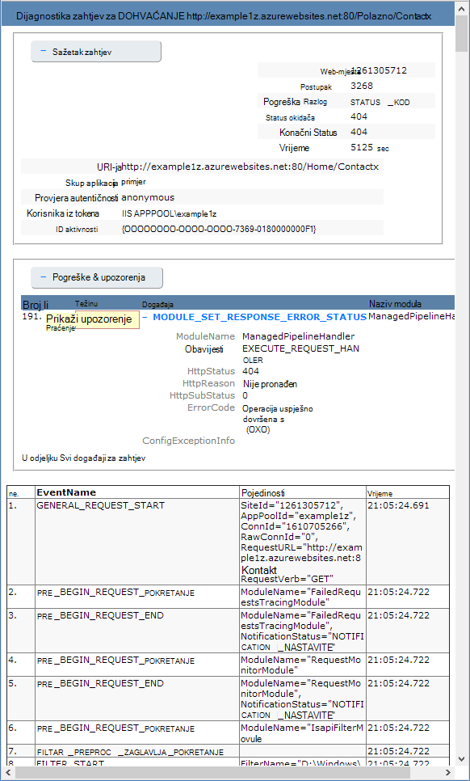

<properties
    pageTitle="Omogućite zapisivanje Dijagnostika za web-aplikacije u aplikacije servisa za Azure"
    description="Saznajte kako uključite Zapisivanje dijagnostičkih podataka i dodati instrumentation u aplikaciji, kao i upute za pristup podacima zapisuje Azure."
    services="app-service"
    documentationCenter=".net"
    authors="cephalin"
    manager="wpickett"
    editor="jimbe"/>

<tags
    ms.service="app-service"
    ms.workload="na"
    ms.tgt_pltfrm="na"
    ms.devlang="na"
    ms.topic="article"
    ms.date="06/06/2016"
    ms.author="cephalin"/>

# Omogućite zapisivanje Dijagnostika za web-aplikacije u aplikacije servisa za Azure

## Pregled

Azure nudi ugrađene Dijagnostika radi jednostavnijeg ispravljanje pogrešaka [aplikacije usluge web-aplikacije](http://go.microsoft.com/fwlink/?LinkId=529714). U ovom članku ćete saznati kako uključite Zapisivanje dijagnostičkih podataka i dodati instrumentation u aplikaciji, kao i upute za pristup podacima zapisuje Azure.

U ovom se članku koristi [Azure Portal](https://portal.azure.com), Azure PowerShell i Azure sučelja naredbenog retka (Azure EŽA) da biste radili s dijagnostičke zapisnike. Informacije o radu sa zapisnicima dijagnostičkih podataka pomoću Visual Studio, potražite u članku [Otklanjanje poteškoća Azure u Visual Studio](web-sites-dotnet-troubleshoot-visual-studio.md).

[AZURE.INCLUDE [app-service-web-to-api-and-mobile](../../includes/app-service-web-to-api-and-mobile.md)]

## Dijagnostika poslužitelja web i aplikacije dijagnostici

Aplikacije servisa za web-aplikacije funkcionalnosti Dijagnostika za Zapisnički podaci za web-poslužitelj i web-aplikacije. Te su logički razdvojeni u **Dijagnostika poslužitelja web** i **aplikacije dijagnostici**.

### Dijagnostika poslužitelja za web

Možete omogućiti ili onemogućiti sljedeće vrste zapisnika:

- **Detaljne zapisivanje pogreške** – detaljne informacije o pogrešci za HTTP kodovima stanja koje označavaju pogreške (kod stanja 400 ili noviji). To može sadržavati informacije koje možete utvrditi Zašto poslužitelj je vratio kod pogreške.
- **Nije uspjelo zahtjev za praćenje** - detaljne informacije o neuspjelih zahtjeva, uključujući za praćenje IIS komponente koje se koriste za obradu zahtjeva i u vrijeme u svaku od njih. To može biti korisno ako pokušavate poboljšati performanse web-mjesta ili izdvajanja što uzrokuje konkretne HTTP pogreške koja se vraća.
- **Zapisivanje poslužitelja u web** - informacija o HTTP transakcija u [obliku datoteke zapisnika prošireni W3C](http://msdn.microsoft.com/library/windows/desktop/aa814385.aspx). To je korisno kada određivanje ukupnog metriku web-mjesta kao što su broj zahtjeva rukuje ili zahtjeva za koliko su iz određene IP adrese.

### Aplikacije dijagnostici

Aplikacije dijagnostici omogućuje snimanje informacija koje je stvorio web-aplikacije. ASP.NET aplikacije mogu koristiti klase [System.Diagnostics.Trace](http://msdn.microsoft.com/library/36hhw2t6.aspx) da biste se prijavili informacije dijagnostičkog zapisnika aplikacije. Ako, na primjer:

    System.Diagnostics.Trace.TraceError("If you're seeing this, something bad happened");

Prilikom izvođenja možete dohvatiti te zapisnike da biste olakšali rješavanje problema. Dodatne informacije potražite u članku [Otklanjanje poteškoća Azure web-aplikacije u Visual Studio](web-sites-dotnet-troubleshoot-visual-studio.md).

Aplikacije servisa za web-aplikacije i prijaviti informacije o implementaciji Kad objavite sadržaj web-aplikaciju. To se događa automatski, a nema konfiguracija postavki za implementaciju zapisivanje. Zapisivanje implementacije vam omogućuje da utvrdite Zašto nije uspjela implementacije. Ako, na primjer, ako koristite prilagođeni implementacijsku skriptu, možete koristiti implementacije zapisivanje da biste odredili Zašto se ne uspijeva skriptu.

## Kako omogućiti i dijagnostiku

Da biste omogućili dijagnostika [Azure Portal](https://portal.azure.com), idite na plohu za web-aplikaciju i kliknite **Postavke > dijagnostički zapisnici**.

<!-- todo:cleanup dogfood addresses in screenshot -->

Kada omogućite **aplikacije dijagnostici** i odaberite željenu **razinu**. Ta postavka omogućuje vam da biste filtrirali podatke zabilježene **Informativna**, **upozorenja** ili **pogreške** informacije. Postavljanje na **opširno** prijavite se sve podatke koje je stvorio program.

> [AZURE.NOTE] Za razliku od promjene web.config datoteke, omogućivanje aplikacije dijagnostici ili promjenom razine dijagnostičkog zapisnika nije koša za domenu aplikacije koja se pokreće program unutar.

U **Konfiguriraj** kartica [Klasični portal](https://manage.windowsazure.com) Web app možete odabrati **prostora za pohranu** ili **datotečnog sustava** za **bilježenje u zapisnik web-poslužitelj**. Odabir **prostora za pohranu** omogućuje odaberite račun za pohranu, a zatim spremnik blob koji će biti zapisane zapisnike. Sve zapisnika za **dijagnostiku web-mjesta** zapisuju se samo u datotečni sustav.

Kartica za **Konfiguriranje** aplikacije [Klasični portal](https://manage.windowsazure.com) Web sadrži i dodatne postavke za aplikacije dijagnostici:

* **Datotečni sustav** - pohranjuje Dijagnostika informacije o aplikaciji web app datotečni sustav. Te datoteke možete pristupiti FTP ili preuzeli kao Zip arhive pomoću Azure PowerShell ili Azure sučelje naredbenog retka (Azure EŽA).
* **Spremište tablica** - pohranjuje informacije Dijagnostika aplikacije navedeni naziv računa spremišta Azure i tablice.
* **Spremište blobova platforme** - pohranjuje informacije Dijagnostika aplikacije navedeni račun za Azure prostora za pohranu i blob spremnik.
* **Razdoblje zadržavanja** – po zadanom zapisnika se neće automatski brišu iz **spremišta blobova**. Odaberite **Postavljanje pravilnika za zadržavanje** i unesite broj dana čuvati zapisnike ako želite automatski izbrisati zapisnike.

>[AZURE.NOTE] Ako [Obnovi tipke za pristup računu za pohranu](storage-create-storage-account.md#view-copy-and-regenerate-storage-access-keys), morate ponovno pokrenuti konfiguracija odgovarajući zapisivanje da koristite tipke ažurirani. Da biste to učinili:
>
> 1. Na kartici **Konfiguriraj** postavite značajku odgovarajući zapisivanje na **Isključeno**. Spremanje postavki.
> 2. Omogućite zapisivanje blob račun za pohranu ili tablicu ponovno. Spremanje postavki.

Bilo koju kombinaciju datotečnog sustava, spremište tablica ili blobova mogu biti omogućene u isto vrijeme, a imaju pojedinačne zapisnika razine konfiguracije. Ako, na primjer, možda želite da biste se prijavili pogrešaka i upozorenja za bloba prostora za pohranu kao dugoročno rješenje zapisivanje, tijekom omogućivanja zapisivanja sustava datoteka s razinom opširno.

Dok sve tri mjesta za pohranu dobiti isti osnovne informacije za prijavljenih događaje, **tablice prostora za pohranu** i **spremište blobova platforme** prijaviti dodatne informacije, kao što je instance ID, niti ID i precizniji vremenske oznake (crtičnih format) od zapisivanje **datotečnom sustavu**.

> [AZURE.NOTE] Podatke pohranjene u **spremište tablica** ili **blobova** može pristupiti samo pomoću web-mjesto za pohranu klijenta ili u okvir za aplikaciju koja možete raditi izravno s te sustavima prostora za pohranu. Ako, na primjer, Visual Studio 2013 sadrži Explorer prostora za pohranu koji se mogu koristiti da biste istražili tablice ili blob prostora za pohranu i HDInsight možete pristupiti podataka pohranjenih u spremište blobova platforme. Možete upisati i aplikacije koji pristupa za pohranu Azure pomoću neke od [SDK-ovi Azure](/downloads/#).

> [AZURE.NOTE] Dijagnostika može se omogućiti i iz PowerShell Azure pomoću cmdleta **Skup AzureWebsite** . Ako ste instalirali Azure PowerShell ili ste konfigurirali je da biste koristili pretplatu Azure, Saznajte [kako koristiti Azure PowerShell](/develop/nodejs/how-to-guides/powershell-cmdlets/).

##Kako: preuzimanje zapisnika

Dijagnostičke informacije koje se pohranjuju u datotečni sustav web app možete pristupiti izravno FTP. Mogu se preuzeti i kao Zip arhive pomoću Azure PowerShell ili Azure sučelja naredbenog retka.

Strukturu direktorija zapisnike pohranjene u je na sljedeći način:

* **Zapisnici aplikacije** - /LogFiles/aplikacije /. Ova mapa sadrži jednu ili više tekstnih datoteka koja sadrži podatke koje je stvorio zapisivanje aplikacije.

* **Nije uspjelo zahtjev kašnjenja** - / LogFiles/W3SVC ### /. Ova mapa sadrži XSL datoteka i XML datoteke. Provjerite je li preuzeti XSL datoteka u direktoriju isti kao XML datoteke jer XSL datoteka nudi funkcije za oblikovanje i filtriranje sadržaja XML datoteke kada se prikazuje u pregledniku Internet Explorer.

* **Detaljne zapisivanje** - /LogFiles/DetailedErrors /. Ova mapa sadrži jednu ili više datoteka .htm kojima ćete pronaći opsežan informacije za HTTP pogreške koje su se pojavile.

* **Zapisnici poslužitelja web** - /LogFiles/http/RawLogs. Ova mapa sadrži jednu ili više datoteka tekst oblikovan u [oblik datoteke zapisnika prošireni W3C](http://msdn.microsoft.com/library/windows/desktop/aa814385.aspx).

* **Uvođenje zapisnika** - / LogFiles/brojka. Ova mapa sadrži zapisnika generiranih Interna implementacije procesa koji se koriste Azure web-aplikacije, kao i prijavljuje za brojka implementacije.

### FTP

Da biste pristupili dijagnostičke informacije pomoću FTP, posjetite **nadzorne ploče** web-aplikacije [Klasični portal](https://manage.windowsazure.com). U odjeljku **brzi pogled** pomoću **FTP dijagnostičke zapisnike** vezu da biste pristupili koristite FTP datoteka zapisnika. **Korisnički implementaciju/FTP** unos navodi korisničko ime koje želite koristiti da biste pristupili FTP mjesto.

> [AZURE.NOTE] Ako stavku **Implementaciju/FTP korisnika** nije postavljen ili ste zaboravili lozinku za ovog korisnika, možete stvoriti novi korisnik i lozinka pomoću veze za **ponovno postavljanje vjerodajnica za implementaciju** u odjeljku **brzi pogled** **nadzorne ploče**.

### Preuzimanje s Azure PowerShell

Da biste preuzeli datoteke zapisnika, pokreće novu instancu Azure PowerShell i koristite sljedeću naredbu:

    Save-AzureWebSiteLog -Name webappname

To će spremanje zapisnika za web-aplikaciji određen u **-naziv** parametar u datoteku pod nazivom **logs.zip** u trenutnom direktoriju.

> [AZURE.NOTE] Ako ste instalirali Azure PowerShell ili ste konfigurirali je da biste koristili pretplatu Azure, Saznajte [kako koristiti Azure PowerShell](/develop/nodejs/how-to-guides/powershell-cmdlets/).

### Preuzimanje s Azure sučelje naredbenog retka

Da biste preuzeli datoteke zapisnika pomoću sučelja Azure naredbeni redak, otvorite novi naredbeni redak, PowerShell, tulumu ili sesije Terminal i unesite sljedeću naredbu:

    azure site log download webappname

To će se spremiti u zapisnicima pod nazivom webappname u datoteku pod nazivom **diagnostics.zip** u trenutnom imeniku web-aplikaciji.

> [AZURE.NOTE] Ako ste instalirali Azure sučelja naredbenog retka (Azure EŽA) ili ste konfigurirali je da biste koristili pretplatu Azure, Saznajte [kako koristiti EŽA Azure](../xplat-cli-install.md).

## Kako: prikaz zapisnika u aplikaciji uvida

Uvid aplikacije za Visual Studio nudi alate za filtriranje i pretraživanje zapisnika i correlating zapisnike sa zahtjevima i druge događaje.

1. Dodavanje uvida SDK aplikacije u projekt u Visual Studio.
 * U pregledniku rješenja, desnom tipkom miša kliknite projekt i odaberite dodavanje aplikacije uvida. Vodit se kroz korake koji obuhvaćaju stvaranje do uvida aplikacije resursa. [uči više](../application-insights/app-insights-asp-net.md)
2. Dodajte ga Slušatelj praćenje paketa u projekt.
 * Desnom tipkom miša kliknite projekt i odaberite upravljanje NuGet paketa. Odaberite `Microsoft.ApplicationInsights.TraceListener` [Dodatne informacije](../application-insights/app-insights-asp-net-trace-logs.md)
3. Prijenos projekta i pokrenite je da biste generirali podaci iz zapisnika.
4. [Portal za Azure](https://portal.azure.com/)idite na novi resurs uvida aplikacije pa otvorite **pretraživanja**. Vidjet ćete podatke iz zapisnika, zajedno s zahtjev, korištenje i drugih telemetrijskih. Neke telemetrijskih može potrajati nekoliko minuta da stigne: kliknite Osvježi. [uči više](../application-insights/app-insights-diagnostic-search.md)

[Dodatne informacije o performansama praćenje sa uvida aplikacije](../application-insights/app-insights-azure-web-apps.md)

##Kako: strujanje zapisnika

Pri razvoju aplikacija, često je korisno u odjeljku zapisivanje informacija u blizini stvarnom vremenu. To je moguće napraviti tako da strujanje zapisivanje informacije pomoću Azure PowerShell ili sučelja naredbenog retka Azure okruženje za razvoj.

> [AZURE.NOTE] Neke vrste međuspremnika zapisivanje pisati datoteka zapisnika, koja može uzrokovati izvan redoslijeda događaja u toka. Ako, na primjer, stavku evidencije aplikacije koji se pojavljuje kad korisnik posjeti stranicu može se prikazivati u tok prije odgovarajuću stavku zapisnika HTTP za zahtjev za stranicu.

> [AZURE.NOTE] Zapisnik strujanje i strujanje informacije zapisuju sve tekstne datoteke spremljene u na **D:\\kućni\\LogFiles\\ ** mapu.

### Strujanje Azure PowerShell

Da biste strujanje Zapisnički podaci, pokreće novu instancu Azure PowerShell i koristite sljedeću naredbu:

    Get-AzureWebSiteLog -Name webappname -Tail

To će se povezati s web-aplikaciji određen u **-naziv** parametar i počnite strujanje informacije u prozor PowerShell kao zapisnika događaja pojaviti na web-aplikaciji. Sve informacije zapisuju datoteke u .txt, .log ili .htm, a koji su pohranjenu u direktoriju /LogFiles (Polazno/d:/logfiles) će biti strujanjem konzoli za lokalni.

Da biste filtrirali određene događaje, kao što su pogreške, koristite na **-poruka** parametar. Ako, na primjer:

    Get-AzureWebSiteLog -Name webappname -Tail -Message Error

Da biste filtrirali zapisnika određene vrste, kao što su HTTP, koristite na **-put** parametar. Ako, na primjer:

    Get-AzureWebSiteLog -Name webappname -Tail -Path http

Da biste vidjeli popis dostupnih putova, koristite parametar - ListPath.

> [AZURE.NOTE] Ako ste instalirali Azure PowerShell ili ste konfigurirali je da biste koristili pretplatu Azure, Saznajte [kako koristiti Azure PowerShell](/develop/nodejs/how-to-guides/powershell-cmdlets/).

### Strujanje Azure sučelje naredbenog retka

Da biste strujanje zapisivanje podataka, otvorite novi naredbeni redak, PowerShell, tulumu ili Terminal sesije i unesite sljedeću naredbu:

    azure site log tail webappname

To će povezivanje s web-aplikaciji pod nazivom "webappname" i počnite strujanje informacije u prozor kao zapisnika događaja pojaviti na web-aplikaciji. Sve informacije zapisuju datoteke u .txt, .log ili .htm, a koji su pohranjenu u direktoriju /LogFiles (Polazno/d:/logfiles) će biti strujanjem konzoli za lokalni.

Da biste filtrirali određene događaje, kao što su pogreške, koristite na **– Filtar** parametar. Ako, na primjer:

    azure site log tail webappname --filter Error

Da biste filtrirali zapisnika određene vrste, kao što su HTTP, koristite na **– put** parametar. Ako, na primjer:

    azure site log tail webappname --path http

> [AZURE.NOTE] Ako ste instalirali Azure sučelja naredbenog retka ili ste konfigurirali je da biste koristili pretplatu Azure, pogledajte [upute za korištenje Azure sučelje naredbenog retka](../xplat-cli-install.md).

##Kako: brzo razumijevanje dijagnostički zapisnici

### Aplikacije dijagnostici zapisnika

Aplikacije dijagnostici pohranjuje informacije u određenom obliku za .NET aplikacije, ovisno o tome je li spremiti zapisnika datotečnog sustava, spremište tablica ili spremište blobova platforme. Skup baza podataka pohranjenih jednak je preko svih tri prostora za pohranu vrste: datum i vrijeme događaja pojavila, ID procesa koje proizvesti događaj, vrsta događaja (podaci upozorenje, pogreška) i poruka o događaju.

__Datotečnom sustavu__

Svaki redak prijavljen datotečnom sustavu ili primaju putem strujanja bit će u sljedećem obliku:

    {Date}  PID[{process id}] {event type/level} {message}

Na primjer, događaj pogreške će izgledati otprilike ovako:

    2014-01-30T16:36:59  PID[3096] Error       Fatal error on the page!

Zapisivanje u datotečni sustav navedeni osnovni podaci o od tri dostupne metode, koja omogućuje samo vrijeme, id procesa, razina događaja i poruku.

__Spremište tablica__

Kada je bilježenje u zapisnik sa spremištem tablica, dodatna svojstva koriste se da biste olakšali traženje podataka pohranjenih u tablici, kao i precizniji informacije o događaju. Sljedeća svojstva (stupce) koriste se za svaki entitet (redak) spremaju u tablicu.

Naziv svojstva|Vrijednosti i oblikovanje
---|---
PartitionKey|Datum i vrijeme događaja u obliku yyyyMMddHH
RowKey|GUID vrijednost koja služi kao jedinstvena identifikacija entitet
Vremenska oznaka|Datum i vrijeme do kojih je došlo događaja
EventTickCount|Datum i vrijeme događaja pojavila u obliku crtičnih (veća preciznost)
ApplicationName|Naziv aplikacije za web
Razina|Razina događaja (npr. pogreška, upozorenje informacije)
Iddogađaja|ID događaja ovog događaja

Po zadanom je 0 Ako nijedan naveden
ID instance|Pojava do kojih je došlo u čak i na web-aplikaciji
PID|ID procesa
Tid|ID niti niti koje proizvesti događaja
Poruka|Poruka o detaljima o događaju

__Spremište blobova platforme__

Prilikom prijave bloba prostora za pohranu, podaci se pohranjuju u obliku vrijednosti odvojenih zarezom (CSV). Slične sa spremištem tablica dodatna polja prijavljeni omogućuje precizniji informacije o događaju. Sljedeća svojstva koriste se za svaki redak u CSV:

Naziv svojstva|Vrijednosti i oblikovanje
---|---
Datum|Datum i vrijeme do kojih je došlo događaja
Razina|Razina događaja (npr. pogreška, upozorenje informacije)
ApplicationName|Naziv aplikacije za web
ID instance|Instance web-aplikacije koje se na došlo je do događaja
EventTickCount|Datum i vrijeme događaja pojavila u obliku crtičnih (veća preciznost)
Iddogađaja|ID događaja ovog događaja

Po zadanom je 0 Ako nijedan naveden
PID|ID procesa
Tid|ID niti niti koje proizvesti događaja
Poruka|Poruka o detaljima o događaju

Podaci spremljeni u blob izgleda otprilike ovako:

    date,level,applicationName,instanceId,eventTickCount,eventId,pid,tid,message
    2014-01-30T16:36:52,Error,mywebapp,6ee38a,635266966128818593,0,3096,9,An error occurred

> [AZURE.NOTE] U prvom retku zapisnika će sadržavati zaglavlja stupaca kao što je prikazano u ovom primjeru.

### Nije uspjelo kašnjenja zahtjev

Nije uspjelo zahtjev kašnjenja spremaju se u XML datoteke pod nazivom __fr ### .xml__. Da biste lakše prikaz zabilježeni podaci XSL list stila pod nazivom __freb.xsl__ navedeni su u direktoriju isti kao XML datoteke. Otvaranje XML datoteke u programu Internet Explorer, koristit će XSL list stila možete unijeti oblikovani prikaz podataka za praćenje. To izgledat će otprilike ovako:

### Detaljne zapisivanje

Detaljne zapisivanje su HTML dokumenata koja pružaju detaljne informacije o HTTP pogreške koje su se pojavile. Budući da su jednostavno HTML dokumenata, oni moguće je prikazati u web-pregledniku.

### Zapisnici poslužitelja za web

Zapisnici poslužitelja web su oblikovane pomoću [oblik datoteke zapisnika prošireni W3C](http://msdn.microsoft.com/library/windows/desktop/aa814385.aspx). Ove informacije možete čitati u uređivaču teksta ili raščlaniti pomoću uslužni programi kao što su [Analizator zapisnika](http://go.microsoft.com/fwlink/?LinkId=246619).

> [AZURE.NOTE] U zapisnicima osnovu Azure web-aplikacije ne podržavaju polja __s computername__, __s ip__ili __cs verziju__ .

##Daljnji koraci

- [Upute za praćenje web-aplikacije](/manage/services/web-sites/how-to-monitor-websites/)
- [Otklanjanje poteškoća Azure web-aplikacije u Visual Studio](web-sites-dotnet-troubleshoot-visual-studio.md)
- [Analiza web-aplikacije zapisnike u HDInsight](http://gallery.technet.microsoft.com/scriptcenter/Analyses-Windows-Azure-web-0b27d413)

> [AZURE.NOTE] Ako želite započeti s aplikacije servisa za Azure prije registracije za račun za Azure, idite na [Pokušajte aplikacije servisa](http://go.microsoft.com/fwlink/?LinkId=523751), gdje možete odmah stvoriti web-aplikacijama short-lived starter u aplikacije servisa. Nema kreditne kartice potrebna; Nema preuzete obveze.

## Što se promijenilo
* Vodič za promjenu iz aplikacije servisa za web-mjestima potražite u članku: [aplikacije servisa za Azure i Its utjecaj na postojećim Azure servisima](http://go.microsoft.com/fwlink/?LinkId=529714)
* Vodič za promjenu stare portal da biste na novom portalu potražite u članku: [Vodič za navigaciju portala za Azure](http://go.microsoft.com/fwlink/?LinkId=529715)
 
