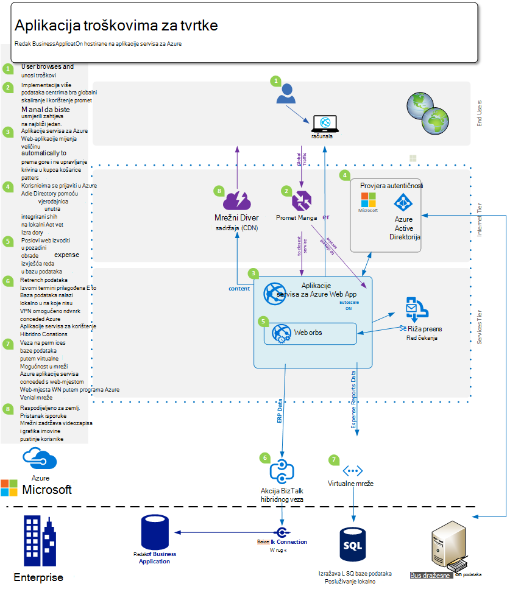
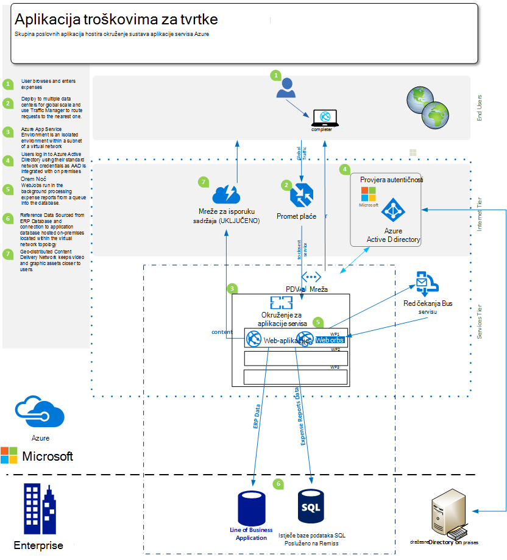
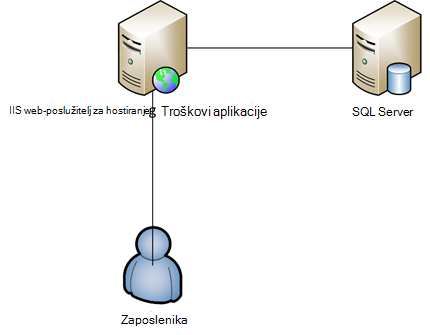

<properties 
    pageTitle="Aplikacije servisa za Azure Web Apps ponude za Enterprise" 
    description="Prikazuje kako koristiti Azure aplikacije servisa web-aplikacije s kompatibilnošću enterprise web-mjesta za svoju tvrtku" 
    services="app-service\web" 
    documentationCenter="" 
    authors="apwestgarth" 
    manager="wpickett" 
    editor=""/>

<tags 
    ms.service="app-service-web" 
    ms.workload="web" 
    ms.tgt_pltfrm="na" 
    ms.devlang="na" 
    ms.topic="article" 
    ms.date="07/29/2016" 
    ms.author="anwestg"/>

# Aplikacije servisa za Azure Web Apps ponuda za koje Enterprise #

Morate smanjiti troškove i izlaganje IT rješenja brže u okruženju hitro rastuće stvara novi izazove za razvojne inženjere, Informatičari i upravitelji. Sve je da korisnici traže njihove crte od tvrtke (LOB) web-aplikacije da biste se brzo, odredište i dostupne s bilo kojeg uređaja. U isto vrijeme tvrtke pokušavate iskoristite povećana produktivnost i učinkovitosti koja dolazi iz Integracija sa oblaka i mobilne usluge, to može biti nešto jednostavan jedinstvenu prijavu na uređajima pomoću servisa Active Directory suradnja u sustavu Office 365 pomoću podataka koji se povlače iz internog LOB aplikacije koja shodno povlači u podatke iz tvrtke implementacije Salesforce. [Azure servisa Web aplikacija](http://go.microsoft.com/fwlink/?LinkId=529714) je enterprise klase oblaku za razvoj i testiranje radi web i mobilnim aplikacijama, API-ji Web i Generički web-mjesta. Mogu se pokrenuti tvrtke web-mjesta, mjesta na intranetu, poslovnih aplikacija i digitalni marketinške kampanje globalna mreža podatkovnim centrima optimizirana promjenom veličine i dostupnost, uz podršku za integraciju neprekinuti i moderan DevOps postupke.  

U ovom koje ističe mogućnosti [Web-aplikacije](/services/app-service/web/) servisa posebno filtriran na pokrenut LOB web-aplikacije, koji prekriva Migracija postojeće web-aplikacije i implementaciju nove LOB web-aplikacije na platformi. 

## Ciljne skupine ##

Informatičari, projektantima i upravitelje koji tražite za migraciju u oblak web radnih opterećenja koji su trenutno pokrenuti na lokalni. Radnih opterećenja web mogu obuhvaćati ili tvrtke zaposleniku ili poslovni partneri web-aplikacije.

## Uvod ##

Web-aplikacije servisa za aplikaciju je idealna platformu na kojem će biti vanjskih i internih web-aplikacije i servise kao što je pruža učinkovit, Visoko prilagodljivi, upravljanih rješenja vam omogućuje usmjeriti na izlaganja poslovne vrijednosti za korisnike umjesto trošite značajan količine vremena i održavanje novac i podršku odvojite okruženja. Web Apps nudi fleksibilne platformu na koju želite uvesti enterprise web-aplikacija koja nudi mogućnost da biste nastavili za provjeru autentičnosti lokalnog servisa Active Directory putem integracije s Microsoft Azure Active Directory, podržava od lako i brzo implementacijama upućivanje korištenje vaše interne neprekinuti integracije i implementacija prakse, tijekom automatski skaliranje radi povećanja s poslovnim potrebama – sve na upravljanih platformu koja omogućuje aplikacije i neće preduvjete infrastrukture. 

## Definicija problema ##

Vodoravno IT hitro promjena, s Premjesti izvan nalaze na poslužiteljima tradicionalni s njihove visoke veliko slovo troškove na vrijeme dugo potencijalnog klijenta koji koristi osvježavati koristiti usluga koje se automatski skaliranja učiniti Učitaj. Odjelima su se teško pokretnim da biste smanjili trošak, a ostavlja manji trag pri Infrastruktura i održavanja provedu s naglaskom na smanjivanju CAPEX tijekom i povećanje agility. Na kraj život starije platforme infrastrukture, kao što su Windows Server 2003 je početnih odjelima da biste pregledali oblaka migracije kao potencijalne način da biste izbjegli novi dugoročnu veliko slovo troškove. U prošlosti, CIOs bi nabavljanja odluke vezane uz druge odjele; Međutim, sve CMOs i druge tvrtke jedinica zaglavlja izvodite više aktivni uloga u način njihova proračun utrošiti i što je povrat njihove ulaganja. Sve, tvrtke moraju njihove snage biti puno više mobilne nego ikad prije sa zaposlenicima radili s udaljenog mjesta, troškovi još jedanput s klijentima potrebe pristup sustavima smetnja besplatne.

Promijene poslovne potrebe mjesečnih, tjednih, svaki dan. Tvrtke tražite trenutno globalni Skaliranje s pravilnim ažurirane usluge cijelog novih značajki dobili od treće strane ili interno.  U nekim slučajevima tvrtke i tražite mogućnosti izdvajanja svoje aplikacije i pristup resursima whilst i upućivanje korištenje funkcije javno oblaka. Korisnici koji imaju veći očekivanja, s mnogo za korištenje servisa u vlastite privatne životima kao što je Office 365. Kakvu očekuju da biste imali pristup slične, u tijeku, značajka obogaćenog services u životu njihov rad. Da biste cope s zahtjev, IT morate izgleda da biste lakše tvrtke da biste omogućili tu putem odabira i integracija s drugih proizvođača servisi, oprezni dio platforme koje možete prilagoditi potrebama tvrtke whilst također se pouzdano sa ukupni trošak smanjene vlasništva.

Razvojnim timovima traženi izlaganje pogodnost odmah tvrtke izlaganja nove značajke često. Traže troškova učinkovite, pouzdanog platformu koja integrira svoje postojeće alata i postupci – razvoj test, otpustite; i radu s odjelima automatizira implementaciju, upravljanje i upozorenjem sve s ciljem nula isključiti.

<a href="highlevel" />
## Visoke razine rješenja ##

Platforme web i okviri sve koriste za razvoj, testiranje i hostira poslovnim aplikacijama.  Uobičajeni crtom poslovnoj aplikaciji, kao što je sustav troškovima Interna zaposlenika, često brojki isključivo web app s sigurnosnom baze podataka za pohranu podataka povezanih s aplikacijom.

Aplikacije servisa za Web Apps je dobar izbor za hostiranje takve aplikacije koja nudi infrastrukturu skalabilni i pouzdane koji upravlja i patched s blizu nula ručno intervencije i isključiti. Platforme Microsoft Azure nudi brojne mogućnosti pohrane podataka za podršku web-aplikacije koje se nalaze na web-aplikacije Microsoft Azure SQL baze podataka, upravljanih skalabilni relacijske baze podataka – kao-na-uslugu, popularne servisi našim partnerima kao što su baze podataka MySQL ClearDB i MongoDB.

Zamjenski pristup je koristiti svoje postojeće ulaganja lokalno. U primjeru scenariju sustav o troškovima zaposlenika, želite održavati spremište podataka unutar Interna sustavu. To može biti za integraciju s unutarnje sustave (izvješćivanja, podatkovne veze, naplata itd.) ili zadovoljili sustava upravljanja zahtjeva za IT.  Web Apps nudi nekoliko načina omogućujući vam da biste se povezali na lokalni infrastrukture:

- [Aplikacije servisa okruženja](app-service-app-service-environment-intro.md) - okruženja servisa aplikacija elika (i mala slova) su nove značajke Premium koji nedavno dodati nuditi aplikacije servisa za Microsoft Azure.  ASEs pružaju u potpunosti Izolirani i namjenski okruženje za sigurno pokretanje aplikacije servisa za Azure aplikacije na visok skaliranje nudi odvajanja i sigurne mrežni pristup   
- [Hibridno veze](../biztalk-services/integration-hybrid-connection-overview.md) – hibridnog veze su značajka servisa Microsoft Azure BizTalk Services i Omogući Web aplikacije za povezivanje s lokalnom resursi sigurno, primjerice SQL Server, MySQL, API-ji Web i prilagođene web-servisi. 
- [Integracija virtualne mreže](https://azure.microsoft.com/blog/2014/09/15/azure-websites-virtual-network-integration/) – web-aplikacije za integraciju s Azure virtualne mreže radite dopušta povezivanje web-aplikaciju programa s mrežom virtualne Azure koji shodno mogu povezati na lokalni infrastrukture putem web-mjesto VPN-a. 

Sljedeći dijagrami opisuju primjer više razine rješenja s mogućnosti povezivanja na lokalni resursi.  Prvi primjer pokazuje kako to se može postići pomoću standardnih značajki aplikacije servisa za Azure i drugi pokazuje kako to može biti postići pomoću premium koja nudi okruženja aplikacije servisa.

Korištenje aplikacije servisa za standardne značajke:

Korištenje okruženja aplikacije servisa:

## Prednosti tvrtke ##

Aplikacije servisa za Web Apps nudi mnoštvom poslovnih pogodnosti koje omogućiti funkcija znatno učinkovit i agilno u izlaganja za poslovne potrebe. 

### PaaS Model ###

Aplikacije servisa za Web Apps se temelji na platforma kao model servis koji omogućuje brojne trošak i učinkovitosti računanje.  Više ne morate provesti sati upravljanje VMs, zakrpa operacijski sustavi i okviri. Web-aplikacije mjesto okruženju automatski sa zakrpom koji omogućuje fokusiranje na upravljanje web-aplikacije i neće VMs, ostavite timovima besplatne dodatni poslovni vrijednost.

PaaS Model underpinning web-aplikacijama omogućuje practitioners DevOps methodology za ispunjavanje njihove ciljevima. Kao tvrtka to znači da cijelog upravljanja i integracija cijeloj aplikacije cijelu životni ciklus, uključujući razvoj, testiranje, izdanje, nadzor i upravljanje i podrška. 

Za razvojnim timovima neprekinuti tijekovi rada integracije i implementaciju moguće konfigurirati Team Services za Visual Studio, GitHub, TeamCity, Hudson ili BitBucket, omogućivanje automatskog Sastavi, testiranje i implementaciju Omogućivanje brže izdanje ciklusa whilst smanjiti na friction uključen u izdavanja u postojeću infrastrukturu. Web aplikacija podržava i stvaranje više testiranje i pripremna okruženja za izdanje tijekova rada, više ne trebate rezerviranje ili dodijeliti hardvera te svrhe, možete stvoriti proizvoljan broj okruženja u kojima želite da se i definirati vlastite promotivne ponude da biste predali tijeka rada. Kao tvrtke može odlučite pustite za probno razdoblje iz izvora kontrole, izvršavanje testova i nakon uspješan dovršetak niza Promicanje vremensko razdoblje fazu, a na kraju zamjena za proizvodnju pomoću bez nedostupnost s dodanim prednosti koje web-aplikacije koje se nalaze na web-aplikacije su unaprijed učitani i tipkovne pružanje najbolje moguće korisnička sučelja.  Uz to tvrtke možete koristio testiranje u radnog mogućnosti aplikacije servisa web-aplikacije da biste izravno dio promet na različitim vremensko razdoblje, provjera valjanosti promjena, prije prijelaz sav promet na novu implementaciju ili vraćanje svih promet na prethodni implementacije. 

Operacije timovima možete biti sigurni da su najbolje moguće položaju da biste brzo za probleme s bilo kojom svoje web-aplikacije hostirane na web-aplikacije s ugrađenoj u značajke za nadzor i upozorenja. Trebali biste timovima operacije ste već uložiti u analize i nadzor rješenja takve iz aplikacije uvida Microsoft Visual Studio, novi Relic i AppDynamics. Te su i u potpunosti podržane na web-aplikacije omogućivanja continuity i poznatih okruženja iz koje želite nadzirati web-aplikacije.

Na kraju Web Apps nudi funkcije automatski sigurnosnu kopiju vašeg app(s) i glavnom računalu podataka izravno u spremniku spremište blobova platforme Azure. Što vam omogućuje jednostavno način i vrlo troškova učinkovit način s kojim se može oporaviti iz Izrada, smanjite potrebe za kompleksnog na lokalni hardverski i softverski.

### Jednostavnost migracije ###

Održavanje hardver i zakretanje je problema s ključem za tvrtke kao ubrzavanje ciklusa izdanje za hardver i operacijski sustavi. Možda imaju broj Windows Server 2003 R2 poslužitelje koji dolaze na kraju podršku 2015, ali se i dalje hostira ključa web-aplikacije za svoju tvrtku? Aplikacije servisa za Web Apps je sjajno kandidata na kojem će biti te web-aplikacije i za rationalize hardver agencija za tvrtke. Web Apps omogućuje pristup rasponu specifikacije hardver koji upravlja i održava kao dio servisa, bez potrebe za faktor u zamjenski trošak i upravljanja kao dio proračunom infrastrukture.  Migracija možete biti jednostavno kao kopiju i zalijepiti operacije implementaciju sustava postojeće web-aplikacije ili složenija migracije gdje pomoću pomoćnika za Web Apps migracije dodat će vrijednost. Migriranim web-aplikacije Uživajte cijelog razni načini Azure usluga, Integracija dodatne usluge na web-aplikacije. Na primjer, razmotrite dodavanje Azure Active Directory za kontrolu pristupa aplikacija na temelju korisnika Pridruživanje sigurnosne grupe. Drugi primjer možete dodati predmemorije Services da biste poboljšali performanse i smanjili Latencija, pod uvjetom ukupni bolje korisničkog sučelja. 

### Hostiranje predmete Enterprise ###

Aplikacije servisa za Web Apps nudi stabilan, pouzdan platformi koje je Forumska da biste mogli učiniti razna tvrtke potrebno iz small Interna razvoj i testiranje radnih opterećenja, vrlo skaliranu velikog prometa web-mjesta. Pomoću web-aplikacije stvarate koristi iste tvrtke predmete hostinga platforme kojima Microsoft kao tvrtka koristi za radnih opterećenja web visoke vrijednosti. Web-aplikacijama zajedno sa svim servisima na platformi Azure ugrađenih uz sigurnost i usklađenost s pravnih, kao što su ISO (ISO IEC 27001:2005); SOC1 i Attestations SOC2 SSAE 3402 16-ISAE, HIPAA BAA, PCI i Fedramp pri samom pozivanje svaki element i značajku, dodatne informacije potražite u [http://aka.ms/azurecompliance](/support/trust-center/compliance/). 

Platforme Microsoft Azure omogućuje ulozi temelji autorizacije kontrole Omogućivanje enterprise razine kontrole resursima unutar web-aplikacije. RBAC daje korporacije power možete implementirati vlastitih pravilnika o upravljanju za pristup za sve svoje imovine u okruženju Azure korisnicima dodijelite grupe i shodno dodjeljivanja potrebne dozvole te grupama protiv resursa kao što je web-aplikacijama. Dodatne informacije o RBAC u Azure potražite u članku [http://aka.ms/azurerbac](../active-directory/role-based-access-control-configure.md). Pomoću web-aplikacije možete biti sigurni da su u okruženju siguran i implementirana web-aplikacije i imaju potpunu kontrolu u koju područja vaše imovine uvode se. 

Azure okruženja aplikacije servisa [http://aka.ms/aseintro](http://aka.ms/aseintro) su nove premium servis plan mogućnosti za kupce enterprise želimo da biste pomoću servisa Azure aplikacije i te navedite u potpunosti Izolirani i namjenski okruženje.  To omogućuje enterprise klijentima za implementaciju aplikacije koje možete iskoristiti vrlo visoka skaliranje whilst i pritom potpunu kontrolu nad ulazni i izlazni mrežni promet i ASEs omogućite aplikacije da bi velika brzina sigurnu vezu putem virtualne mreže na lokalni resurse.

Aplikacije servisa za web-aplikacije mogu i da bi služiti vaše na lokalni ulaganja pomoću omogućuje povezivanje interne resurse, kao što su skladištu podataka ili okruženje sustava SharePoint. Kako je opisano u [rješenje visoku razinu](#highlevel) možete učiniti pomoću hibridnog veze i virtualne veza s mrežom uspostavljanje veze na lokalni Infrastruktura i usluge.

### Globalni skala ###

Aplikacije servisa za Web Apps je globalne i skalabilni, omogućivanje web-aplikacije Povećaj i prilagoditi potrebama sve veći tvrtke brzo i s minimalnim dugoročnu planiranje i cijene. U standardne na lokalni infrastrukture scenarije, proširenja i povećava zahtjev lokalno i geografski bi zahtijevaju veliku količinu upravljanja, Planiranje i expenditure za dodjelu resursa i upravljanje dodatna Infrastruktura. Web Apps nudi mogućnost skaliranja web-aplikacije s ebb i protok svojim potrebama. Primjerice putem aplikacije troškove kao primjer Većina mjeseca korisnici su osnovna korisnici aplikacije, ali kao rok svakog mjeseca za troškovima poslanih stavki morate unijeti i korištenje povećava na aplikaciju, web-aplikacije ima mogućnost automatski Dodjela više infrastrukture za svoju aplikaciju i zatim kada je subsided korištenje ponovno ga možete skaliranja natrag na infrastrukture osnovne definirate.

Globalno u 24 podatkovnim centrima diljem svijeta i sve veći dostupna Web Apps. Većina ažurirani popis regija i mjesto potražite u članku [http://aka.ms/azlocations](http://aka.ms/azlocations). S web-aplikacijama poslovanja jednostavno možete postići globalni razgovor i Skaliraj. Kao što je vaša tvrtka rastom u nova područja izvješćivanja nadzornih ploča aplikacije koju koristite i glavnog računala na web-aplikacije jednostavno može uvesti u dodatne podatkovnim centrima i posluživanje lokalne korisnike daleko brže pomoću kombinacije web-aplikacije i Azure promet za upravljanje sve s dodanim prednost skalabilni infrastrukture ispod moći ugovor, a zatim proširite kao potrebama Promjena regionalnih ureda.
 
## Detalji rješenja ##

Pogledajmo primjer scenarij za migraciju programa aplikacije. Time se navode pojedinosti kako značajke aplikacije servisa web-aplikacije zajedno pružanje sjajno rješenja i poslovne vrijednosti.
 
U ovom primjeru je redak poslovnoj aplikaciji smo će biti razgovarate o o troškovima izvješćivanja aplikacije koja omogućuje zaposlenicima poslati svoje troškove za isplate troškova. Aplikacija se hostira na u sustavu Windows Server 2003 R2 izvodi sustavu IIS6, a baza podataka baze podataka SQL Server 2005. Razlog smo odaberite stariji je poslužitelj s vraćaju završetka od servisa za Windows Server 2003 R2 i SQL Server 2005, a imamo [alata](http://aka.ms/websitesmigration) i [upute](http://aka.ms/websitesmigrationresources) da biste automatski migrirati radnih opterećenja u Azure. Uz to na umu uzorak u ovom primjeru koriste primjenjuju se na širok verity slučajevi migracije. 

### Migracija postojeće aplikacije ###

Prvog koraka cjelokupan rješenja za premještanje redak poslovnih aplikacija na web-aplikacije je prepoznavanje postojeće sredstva aplikacije i arhitekturu. Primjer u ovom dokumentu je ASP.NET web-aplikacije hostirane na jednom IIS poslužitelj s bazom podataka koja se nalazi na zasebnom sustava SQL Server, kao što je prikazano na slici u nastavku. Prijava za zaposlenike sustav kombinacijom korisničko ime i lozinku, oni unesite detalje o troškovima i prijenos skenirane kopije potvrde, u bazu podataka, za svaku stavku o troškovima. 
 

#### Stavke koje treba uzeti u obzir ####

Prilikom premještanja aplikacije iz lokalnog okruženja, možda ćete morati Imajte na umu nekoliko ograničenja web-aplikacije. Evo nekih ključa tema morate imati na umu prilikom migracije web-aplikacije na web-aplikacije ([http://aka.ms/websitesmigrationresources](http://aka.ms/websitesmigrationresources)):

-   Priključak povezivanja – Web aplikacija podržava samo priključak 80 za HTTP te priključak 443 HTTPS promet. Ako aplikacija koristi drugi priključak, a zatim jednom migrirati aplikacija će postati koristite priključka 80 za HTTP i priključak 443 za HTTPS promet. To je često bezopasno problem kao što je zajednička na lokalnim implementacijama da biste iskoristili različite priključke da bi se bi se prevladala pomoću naziva domena, posebice u okruženju za razvoj i testiranje
-   Provjera autentičnosti – Web Apps podržava anonimna provjera autentičnosti po zadanome te provjeru autentičnosti obrazaca otkrije aplikacije. Kada aplikacija integriran s Azure Active Directory i ADFS samo Web Apps može ponuditi provjeru autentičnosti sustava Windows. To je značajka koja govori detaljno [ovdje](http://aka.ms/azurebizapp) 
-   GAC temelji sklopova – web-aplikacijama omogućuju implementaciju sklopova da biste u globalnu predmemoriju sklopova (GAC). Dakle, ako aplikacija migrira čini pomoću ove značajke lokalnog, razmislite o premještanju s sklopova mapu smeće aplikacije.
-   Sustavu IIS5 Način kompatibilnosti – web-mjesto aplikacija podržava sustavu IIS5 način kompatibilnosti, a kao svaku instancu web-aplikacije i sve web-aplikacije u odjeljku nadređena web-aplikacije instanca pokreću se u istom procesu unutar jedne aplikacija.
-   Korištenje biblioteka COM – Web Apps omogućuju Registracija COM komponente na platformi. Stoga Ako aplikaciju želite je koristiti sve komponente COM, te morat ćete biti potrebno ponovno napisati u upravljani kod i implementirati pomoću aplikacije.
-   Na web-aplikacije mogu podržavati ISAPI filtara – ISAPI filtara. Morate biti implementirano kao dio aplikacije i registrira u datoteci web.config web-aplikacije. Dodatne informacije potražite u članku [http://aka.ms/azurewebsitesxdt](web-sites-transform-extend.md). 

Nakon što ste je smatra ove teme, web-aplikacije mora biti jeste li spremni za oblaka. Ne brinite, a ako neke teme potpuno nije zadovoljen, alata za migraciju dat će najbolje truda za migraciju. 

Da biste stvorili web-aplikaciju programa aplikacije servisa i baze podataka SQL Azure su se na sljedeće korake postupka migracije. Nema više veličina instance web-aplikacije različit broj jezgri procesora i iznosi RAM-a za odabir na temelju svojim potrebama web aplikacije. Za dodatne informacije i cijene, potražite u članku [http://aka.ms/azurewebsitesskus](/pricing/details/websites/). Isto tako, baza podataka Microsoft Azure SQL caters sve na poslovne potrebe s različite razine usluge i razine performansi za ispunjavanje preduvjeti. Dodatne informacije možete pronaći na [http://aka.ms/azuresqldbskus](/pricing/details/sql-database/). Nakon stvaranja, aplikacija se prenosi aplikacije servisa web-aplikacijama ili putem FTP ili WebDeploy i zatim pomaknuti na bazu podataka.

U ovom migracije rješenje koristi baze podataka SQL Azure ali to ne samo bazu podataka koja je podržana za Azure. Tvrtke možete učiniti i korištenje DocumentDB Azure MySQL, MongoDB, i mnogo više putem dodaci koji mogu se kupiti u [Iz trgovine Azure](/marketplace/partner-program/). 

Prilikom stvaranja baze podataka SQL Azure brojne mogućnosti dostupni su za uvoz postojeću bazu podataka iz lokalnog poslužitelja iz Generiranje skripte postojeće baze podataka za korištenje [podataka sloja aplikacije izvoz i uvoz](http://aka.ms/dacpac). 

Troškovi aplikacije baza podataka stvorena je tako da stvorite novu bazu podataka SQL Azure, povezivanje s bazom podataka pomoću SQL Server Management Studio i pokrenuti skriptu za sastavljanje shemu baze podataka i popunjavanje s podacima iz lokalne baze podataka.

U posljednjem koraku u prve faze migracije potreban je ažuriranje nizu za povezivanje s bazom podataka za aplikaciju. To se može postići putem portala za Azure. Za svaku web-aplikacije možete izmijeniti postavke određene aplikacije, uključujući sve nizove veze koja se koristi aplikacija za povezivanje s bilo kojeg baze podataka koja se koristi.

### Alternative za korištenje baze podataka SQL Azure ###

Azure platforme nudi brojne alternative za korištenje baze podataka SQL Azure kao aplikacije primarnog bazu podataka na webu, to je da biste omogućili odnosno različitih radnih opterećenja Koristite NoSQL rješenja ili da biste omogućili platformu prema potrebama iz poslovnih podataka. Na primjer, tvrtka možda sadrže podatke koji se mora nalaziti službenoj ili u okruženje oblaka javno i stoga izgledati da biste zadržali iskoristili svoje lokalne baze podataka.

#### Veza s lokalnom resursa ####
Aplikacije servisa za Web Apps nudi više mogućnosti za povezivanje s lokalnom resursa, kao što su baze podataka, omogućivanje ponovno korištenje postojeću infrastrukturu visoke vrijednosti. Mogućnosti su navedene u nastavku:

- Aplikacije servisa za okruženja su Izolirani i stvorene podmreži virtualne mreže, stoga Omogućivanje okruženje za komunikaciju koja se nalazi u istom virtualne mreže - [http://aka.ms/appserviceasenetworking](http://aka.ms/appserviceasenetworking) privatne krajnje točke
- Integracija virtualne mreže za web aplikacije podržava Integracija između web-aplikacije i programa Azure virtualne mreže, dopuštanja pristupa resursima koji se izvodi u virtualne mreže koju Ako povezani s mrežom na lokalni s VPN web-mjesto omogućuje povezivanje na vašem na lokalni sustavi.
- Hibridno veze su značajka servisa Azure BizTalk i navedite jednostavan je način za povezivanje s pojedinačne lokalnog resursa kao što su SQL Server, MySQL, HTTP Web API-ji i najčešće prilagođene web-servisa.

#### Promjena veličine i otpornost ####

Kao što je tvrtka rastom njegov snage putem nabavi ili prirodnim prirodno rasta, tako da to morate web-aplikacije mjerilo da bi odgovarao te nove zahtjeve. Uistinu danas uobičajeno je da biste vidjeli čak i veće širenja Suradnja nalazi timovima i Udaljena zaposlenika, na primjer poduzeća s ureda u Sjedinjenim Američkim Državama, Europe i Azija, s mobilnog prodaju prisilno u mnogim više područja. Web Apps ima mogućnost za rukovanje elastic promjene u skaliranje vam i automatski.

Aplikacije servisa za Web Apps omogućuje web-aplikacije mora biti konfigurirana tako da biste skalirali automatski putem portala Azure, ovisno o dva vektori – zakazanog vremena ili procesora. Web Apps automatsko skaliranje omogućuje troškova učinkovitih i iznimno fleksibilne cater za veće promjene u korištenje za sve aplikacije za tvrtke, iz web-aplikacija kao što je naš troškovima izvješćivanja sustava za marketing web-mjesta, koja se pojave visoke neprekidnog rada prometa kratki trajanja promotivne ponude. Dodatne informacije i smjernice o skaliranja web-aplikacija pomoću web-aplikacije potražite [u](web-sites-scale.md)članku promjena veličine web-mjesta.

Osim skaliranja fleksibilnost web-aplikacije cjelokupan platformu omogućuje poslovanje i otpornost putem moguće distribucija web-aplikacije i njihove imovine preko više podatkovnim centrima i zemljopisnim regijama.

## Sažetak ##
Aplikacije servisa za Web Apps nudi rješenje fleksibilne troškova učinkovite, odredište dinamički potrebama tvrtke u okruženju hitro rastuće. Web aplikacije pomaže tvrtke povećajte produktivnost i učinkovitosti po unošenju korištenje upravljanih platformu s modernim DevOps mogućnosti i smanjenom ruke na upravljanje tijekom pruža mogućnosti enterprise u mjerilo, resilience, sigurnost i integracija s lokalnim resursi.

## Pozivanje akcija ##
Dodatne informacije o servisa Azure aplikacije servisa Web aplikacije, posjetite stranicu [http://aka.ms/enterprisewebsites](/services/websites/enterprise/) gdje dodatne informacije mogu biti izvorni termini i prijaviti se za probnu verziju danas u [http://aka.ms/azuretrial](/pricing/free-trial/) da biste procijeniti usluge i ustanovili pogodnosti za svoju tvrtku.

[AZURE.INCLUDE [app-service-web-whats-changed](../../includes/app-service-web-whats-changed.md)]

[AZURE.INCLUDE [app-service-web-try-app-service](../../includes/app-service-web-try-app-service.md)]
 
 
