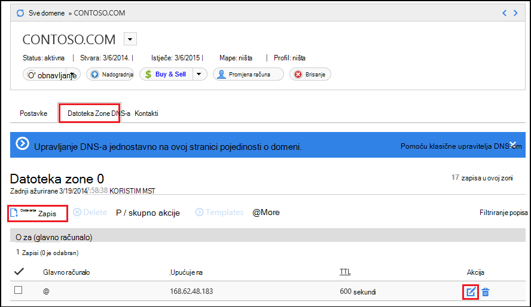

<properties
    pageTitle="Konfiguriranje prilagođenog naziva domene na servisu Azure aplikacije (GoDaddy)"
    description="Saznajte kako koristiti naziv domene sa servisa GoDaddy u Azure Web Apps"
    services="app-service"
    documentationCenter=""
    authors="erikre"
    manager="wpickett"
    editor="jimbe"/>

<tags
    ms.service="app-service"
    ms.workload="na"
    ms.tgt_pltfrm="na"
    ms.devlang="na"
    ms.topic="article"
    ms.date="01/12/2016"
    ms.author="cephalin"/>

# Konfiguriranje prilagođenog naziva domene na servisu Azure aplikacije (Purchased izravno sa servisa GoDaddy)

[AZURE.INCLUDE [web-selector](../../includes/websites-custom-domain-selector.md)]

[AZURE.INCLUDE [intro](../../includes/custom-dns-web-site-intro.md)]

Ako ste kupili domenu kroz Azure aplikacije servisa web-aplikacije pa pogledajte završnom koraku [Kupiti domenu za web-aplikacije](custom-dns-web-site-buydomains-web-app.md).

Ovaj članak sadrži upute za korištenje prilagođenog naziva domene koja je kupljena izravno na [servisu GoDaddy](https://godaddy.com) u [Aplikaciju servisa Web Apps](http://go.microsoft.com/fwlink/?LinkId=529714).

[AZURE.INCLUDE [introfooter](../../includes/custom-dns-web-site-intro-notes.md)]

##Objašnjenje DNS zapisa

[AZURE.INCLUDE [understandingdns](../../includes/custom-dns-web-site-understanding-dns-raw.md)]

## Dodavanje DNS zapisa za prilagođenu domenu

Želite pridružiti web app u aplikacije servisa za prilagođenu domenu, morate dodati novu stavku u tablici DNS za svoju prilagođenu domenu pomoću alata za koje ste dobili od GoDaddy. Slijedite ove korake da biste pronašli DNS alate za servisu GoDaddy.com

1. Prijavite se na svoj račun sa servisu GoDaddy.com i odaberite **Moj račun** , a zatim **Upravljanje Moje domene**. Na kraju, odaberite padajući izbornik za naziv domene koju želite koristiti Azure web-aplikaciju programa, a zatim odaberite **Upravljanje DNS-om**.

    

2. Na stranici **pojedinosti o domeni** pomaknite se na karticu **Datoteka Zone DNS-a** . To je u odjeljku koristi za dodavanje i izmjena DNS zapise za naziv vaše domene.

    

    Odaberite **Dodaj zapis** da biste dodali postojeći zapis.

    Da biste **Uređivanje** postojećeg zapisa, odaberite ikonu olovke i papira pokraj zapisa.

    > [AZURE.NOTE] Prije nego što dodate nove zapise, imajte na umu da GoDaddy ustanova već stvorila DNS zapise za popularne poddomene (pod nazivom **glavnog računala** u uređivaču) kao što su **e-pošte**, **datoteke**, **pošta**i drugim korisnicima. Ako je naziv koji želite koristiti već postoji, izmijeniti postojeći zapis umjesto stvaranja novog.

4. Prilikom dodavanja zapisa, najprije morate odabrati vrstu zapisa.

    

    Nakon toga navedite **glavnog računala** (prilagođenu domenu i poddomenu) i koje it **upućuje na**.

    

    * Prilikom dodavanja **zapisa (glavni)** – morate postaviti polje **glavno računalo** ili **@** (predstavlja korijenski naziv domene, primjerice **contoso.com**) *(zamjenski znak za podudaranje većeg broja poddomene) ili podmjesta domenu koju želite koristiti (Ako, na primjer, * *"www"**.) Morate postaviti na * *upućuje na** polje se s IP adresom Azure web-aplikacije.

    * Prilikom dodavanja **zapisa CNAME (pseudonim)** – polje **glavno računalo** morate postaviti na podređene domenu koju želite koristiti. Na primjer, **"www"**. Polje **upućuje na** morate postaviti da biste na **. azurewebsites.net** naziv domene Azure web-aplikacije. Na primjer, **contoso.azurewebsites.net**.

5. Kliknite **Dodaj druge**.
6. Vrsta zapisa odaberite **TXT** , a zatim odredite vrijednost **glavno računalo** **@** i vrijednost **upućuje na** ** &lt;yourwebappname&gt;. azurewebsites.net**.

    > [AZURE.NOTE] TXT zapis koristi Azure da biste provjerili valjanost da ste vlasnik domene opisan A zapis ili prvog zapisa TXT. Kada je domena preslikana na web-aplikaciju na portalu za Azure, stavka TXT zapisa mogu se ukloniti.

5. Kada završite s Dodavanje ili mijenjanje zapisa, kliknite **Završi** da biste spremili promjene.

## Omogućivanje naziv domene na web-aplikaciju programa

[AZURE.INCLUDE [modes](../../includes/custom-dns-web-site-enable-on-web-site.md)]

>[AZURE.NOTE] Ako želite započeti s aplikacije servisa za Azure prije registracije za račun za Azure, idite na [Pokušajte aplikacije servisa](http://go.microsoft.com/fwlink/?LinkId=523751), gdje možete odmah stvoriti web-aplikacijama short-lived starter u aplikacije servisa. Nema kreditne kartice potrebna; Nema preuzete obveze.

## Što se promijenilo
* Vodič za promjenu iz aplikacije servisa za web-mjestima potražite u članku: [aplikacije servisa za Azure i Its utjecaj na postojećim Azure servisima](http://go.microsoft.com/fwlink/?LinkId=529714)
