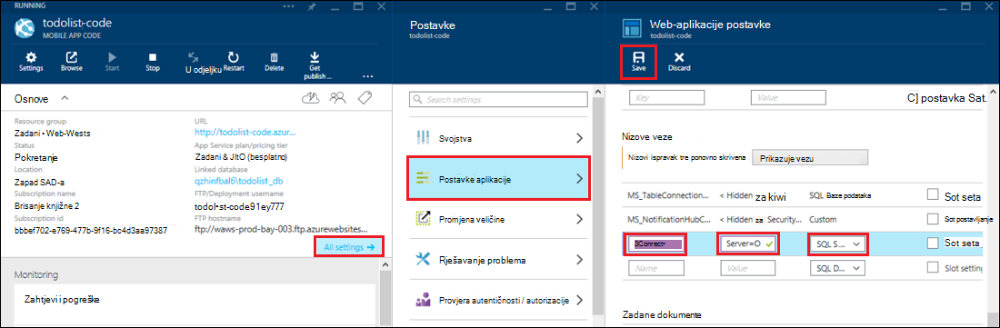

<properties 
    pageTitle="Pristup lokalnim resursima pomoću hibridnog veza u aplikacije servisa za Azure" 
    description="Stvaranje veze između web-aplikacijama u Azure aplikacije servisa i programa lokalnog resursa koji koristi statički TCP priključak" 
    services="app-service" 
    documentationCenter="" 
    authors="cephalin" 
    manager="wpickett" 
    editor="mollybos"/>

<tags 
    ms.service="app-service" 
    ms.workload="na" 
    ms.tgt_pltfrm="na" 
    ms.devlang="na" 
    ms.topic="article" 
    ms.date="02/03/2016" 
    ms.author="cephalin"/>

#Pristup lokalnim resursima pomoću hibridnog veza u aplikacije servisa za Azure

Aplikacije servisa za Azure aplikacije možete povezati s bilo kojeg lokalnog resursa koji koristi statički TCP priključak, kao što su SQL Server, MySQL, HTTP Web API-ji i većina prilagođene web-servisa. U ovom se članku objašnjava da biste stvorili vezu hibridnog između aplikacije servisa i baze podataka sustava SQL Server na lokalni.

> [AZURE.NOTE] Dio web-aplikacije značajku hibridnog veze dostupna je samo u [Azure Portal](https://portal.azure.com). Da biste stvorili vezu BizTalk Services, potražite u članku [Hibridno veze](http://go.microsoft.com/fwlink/p/?LinkID=397274). 
> 
> Ovaj sadržaj odnosi i na mobilne aplikacije u servisu Azure aplikacije. 

## Preduvjeti
- Azure pretplate. Besplatna pretplata potražite u članku [Azure besplatnu probnu verziju](https://azure.microsoft.com/pricing/free-trial/). 
 
    Ako želite započeti s aplikacije servisa za Azure prije registracije za račun za Azure, idite na [Pokušajte aplikacije servisa](http://go.microsoft.com/fwlink/?LinkId=523751), gdje možete odmah stvoriti web-aplikacijama short-lived starter u aplikacije servisa. Nema kreditne kartice potrebna; Nema preuzete obveze.

- Da biste koristili lokalnog sustava SQL Server ili SQL Server Express bazu podataka s vezom za hibridno, TCP/IP mora biti omogućeno na statički priključak. Pomoću zadane instance sustava SQL Server preporučuje se jer koristi statički priključak 1433. Informacije o instaliranju i konfiguriranju programa SQL Server Express za uporabu hibridnog veze, potražite u članku [Povezivanje s lokalnog poslužitelja SQL Azure web-mjestu pomoću hibridnog veza](http://go.microsoft.com/fwlink/?LinkID=397979).

- Računalo na koje ste instalirali agent za lokalnog hibridnog Upravitelja veze što je opisano u nastavku ovog članka:

    - Moraju moći povezati s Azure putem priključak 5671
    - Moraju imati mogućnost dosegne *naziv glavnog računala*:*portnumber* vaše lokalne resursa. 

> [AZURE.NOTE] U ovom članku pretpostavlja da koristite web-pregledniku s računala na kojem će biti smješteno agent za povezivanje lokalnog hibridnog.

## Stvaranje web-aplikacijama na portalu za Azure ##

> [AZURE.NOTE] Ako već ste stvorili web-aplikacijama ili mobilnu aplikaciju pozadinskog na portalu Azure koji želite koristiti za ovaj vodič, možete je prijeđite da biste [stvorili vezu hibridnog i BizTalk servisa](#CreateHC) i počnite iz nje.

1. U gornjem lijevom kutu [Azure Portal](https://portal.azure.com)kliknite **Novo** > **Web + Mobile** > **Web App**.
    
    ![Novu web-aplikaciju][NewWebsite]
    
2. Na plohu **Web app** unijeti njezin URL, a zatim kliknite **Stvori**. 
    
    ![Naziv web-mjesta][WebsiteCreationBlade]
    
3. Nakon nekoliko sekundi dok je stvorena aplikacija za web i pojavit će se njegove plohu web app. Na plohu je okomito pomicati nadzorne ploče koje možete upravljati web-mjestom.
    
    ![Pokretanje web-mjesta][WebSiteRunningBlade]
    
4. Da biste provjerili web-mjesta uživo, možete kliknuti ikonu **Pregledaj** da biste prikazali zadane stranice.
    
    ![Kliknite Pregledaj da biste vidjeli web-aplikaciju programa][Browse]
    
    ![Zadano web-aplikacije stranice][DefaultWebSitePage]
    
Nakon toga će stvoriti hibridnog veze i BizTalk servis za web-aplikacije.

## Stvaranje veze za hibridno i BizTalk servisa ##

1. U vašem plohu web app kliknite **sve postavke** > **umrežavanje** > **konfigurirati svoje krajnje točke za hibridno veze**.
    
    ![Hibridno veze][CreateHCHCIcon]
    
2. Na veze plohu hibridnog kliknite **Dodaj**.
    
    <!-- ![Add a hybrid connnection][CreateHCAddHC]
-->
    
3. **Dodavanje veze hibridnog** plohu otvara.  Budući da je to prvi hibridnog vezu, unaprijed je odabrana mogućnost **Nova veza hibridnog** i plohu **Stvaranje hibridnog veza** otvara umjesto vas.
    
    ![Stvaranje veze za hibridno][TwinCreateHCBlades]
    
    Na **Stvaranje hibridnog veze plohu**:
    - U odjeljku **naziv**Navedite naziv veze.
    - Za **naziv glavnog računala**unesite naziv lokalnog računala koje hostira vaš resursa.
    - Za **priključak**unesite broj priključka koji koristi vaše lokalne resursa (1433 u slučaju zadane instance sustava SQL Server).
    - Kliknite **tome objasniti servisa**

4. Otvorit će se plohu **Stvaranje BizTalk servisa** . Unesite naziv za servis BizTalk, a zatim kliknite **u redu**.
    
    ![Stvaranje BizTalk servisa][CreateHCCreateBTS]
    
    **Stvaranje servisa BizTalk** plohu zatvara i se vraćate plohu **Stvaranje hibridnog veze** .
    
5. Na veze plohu hibridnog stvaranje kliknite **u redu**. 
    
    ![Kliknite u redu][CreateBTScomplete]
    
6. Nakon dovršetka postupka, području obavijesti na portalu za vas obavještava da se veza uspješno je stvorena.
    <!---obveze

    Sve ne uspijeva u ovom koraku. Nije moguće stvoriti BizTalk servisa na portalu dogfood. Prijeđite na klasični portal (Potpuna portala) i stvoren je servis BizTalk, ali ga ne čini se da biste omogućili Sastavljač poveznog ih – kada završite stvaranje hibridnog veza korak, dolazi do sljedeće pogreške stvaranje veze za hibridno RelecIoudHC nije uspjelo. Vrsta resursa nije pronađen u naziva "Microsoft.BizTaIkServices za verzije 2014.-06-01 API-ja".
    
    Ta pogreška znači da ga ne može pronaći vrsti, ne instance.
    ![Obavijest o uspješnoj][CreateHCSuccessNotification]
    -->
7. Na plohu web-aplikaciji ikonu **veze hibridnog** sada prikazuje 1 hibridnog veze je stvorena.
    
    ![Jedan hibridnog veze stvorili][CreateHCOneConnectionCreated]
    
Sada ste dovršili važan dio infrastrukture veze hibridnog u oblaku. Nakon toga će stvoriti odgovarajući lokalnog informaciju.

## Instalacija lokalnog hibridnog veze Manager da biste dovršili veze ##

1. Na web-aplikaciji plohu, kliknite **sve postavke** > **umrežavanje** > **konfigurirati svoje krajnje točke za hibridno veze**. 
    
    ![Ikona hibridnog veze][HCIcon]
    
2. Na plohu **hibridnog veze** stupcu **Stanje** za krajnju točku dodani prikazuje **povezani s Internetom**. Kliknite vezu da biste ga konfigurirati.
    
    ![Povezani s Internetom][NotConnected]
    
    Otvorit će se veze plohu hibridnog.
    
    ![NotConnectedBlade][NotConnectedBlade]
    
3. Na plohu, kliknite **Ga Slušatelj postavljanje**.
    
    ![Kliknite Postavljanje ga Slušatelj][ClickListenerSetup]
    
4. Otvorit će se plohu **hibridnog svojstva veze** . U odjeljku **Upravitelj veze s lokalnog hibridnog**odaberite **kliknite ovdje da biste instalirali**.
    
    ![Kliknite ovdje da biste instalirali][ClickToInstallHCM]
    
5. Za pokretanje aplikacije dijaloški okvir s upozorenjem, odaberite **Pokreni** da biste nastavili.
    
    ![Odaberite Pokreni da biste nastavili][ApplicationRunWarning]
    
6.  U dijaloškom okviru **Kontrola korisničkih računa** odaberite **da**.
    
    ![Odaberite da][UAC]
    
7. Upravitelj veze hibridnog je preuzeli i instalirali umjesto vas. 
    
    ![Instaliranje][HCMInstalling]
    
8. Kada se instalacija završi, kliknite **Zatvori**.
    
    ![Kliknite Zatvori][HCMInstallComplete]
    
    Stupac **Stanje** na plohu **hibridnog veze** sada prikazuje **povezan**. 
    
    ![Povezani stanja][HCStatusConnected]

Nakon što dovršetka infrastruktura za hibridno veze, možete stvoriti aplikaciju za hibridno koji se koristi. 

>[AZURE.NOTE]U sljedećim se odjeljcima pokazati kako koristiti hibridno vezu s projektom pozadinskog .NET mobilne aplikacije.

## Konfiguriranje projekta pozadinskog .NET mobilne aplikacije za povezivanje s bazom podataka SQL Server

U aplikacije servisa mobilne aplikacije .NET pozadinskog projekta je samo u ASP.NET web app s programa dodatne mobilne aplikacije SDK-a instalirati i pokrenuti. Da biste koristili web-aplikaciju programa mobilne aplikacije pozadinskog, morate [preuzeti i pokrenuti pozadinskog mobilne aplikacije .NET SDK](../app-service-mobile/app-service-mobile-dotnet-backend-how-to-use-server-sdk.md#install-sdk).  

Za mobilne aplikacije koje se morate definirati niza za povezivanje za lokalne baze podataka i izmjena pozadinskog za korištenje ove veze. 

1. U Eksploreru za rješenja u Visual Studio, otvorite datoteku Web.config za svoje mobilne aplikacije .NET pozadinskog, pronađite odjeljak **connectionStrings** , dodajte novi unos SqlClient ovako, koji upućuje na baze podataka SQL Server lokalnog:

        <add name="OnPremisesDBConnection"
         connectionString="Data Source=OnPremisesServer,1433;
         Initial Catalog=OnPremisesDB;
         User ID=HybridConnectionLogin;
         Password=<**secure_password**>;
         MultipleActiveResultSets=True"
         providerName="System.Data.SqlClient" />

    Imajte na umu da biste zamijenili `<**secure_password**>` u ovom nizu pomoću lozinke koju ste stvorili za *HybridConnectionLogin*.

3. Kliknite **Spremi** u Visual Studio da biste spremili datoteku Web.config.

    > [AZURE.NOTE]Ta postavka veze koristi se kada se pokrene na lokalnom računalu. Kada se pokrene u Azure, ta je postavka nadjačati postavljanjem veza definiran na portalu.

4. Proširite mapu **modela** i otvorite datoteku modela podataka koji završava *Context.cs*.

6. Izmjena Graditelj instancu **DbContext** za prosljeđivanje vrijednost `OnPremisesDBConnection` za osnovnu Graditelj **DbContext** , slično kao sljedeći isječak:

        public class hybridService1Context : DbContext
        {
            public hybridService1Context()
                : base("OnPremisesDBConnection")
            {
            }
        }

    Servis sada će koristiti novu vezu s bazom podataka sustava SQL Server.

## Ažuriranje pozadinskog mobilnu aplikaciju za korištenje lokalne niz za povezivanje

Ćete morati dodati u aplikaciju postavke za novi niz veze tako da se može se koristiti s Azure.  

1. Vratite se u [Azure portal](https://portal.azure.com) u kodu pozadinskog web app za mobilnu aplikaciju, kliknite **sve postavke**, a zatim **Postavke aplikacije**.

3. U plohu **web-aplikacije postavke** pomaknite do **nizove veze** i dodajte je novi **SQL Server** niz za povezivanje s nazivom `OnPremisesDBConnection` vrijednošću kao što su `Server=OnPremisesServer,1433;Database=OnPremisesDB;User ID=HybridConnectionsLogin;Password=<**secure_password**>`.

    Zamjena `<**secure_password**>` lozinkom sigurne za lokalne baze podataka.

    

2. Pritisnite **Spremi** da biste spremili hibridnog veze i niz za povezivanje koji ste upravo stvorili.

Sada možete objaviti server project i testirajte novu vezu s klijentima postojeće mobilne aplikacije. Podaci će čitanje iz i zapisivanje lokalne baze podataka pomoću veze hibridnog.

## Daljnji koraci ##

- Informacije o stvaranju ASP.NET web-aplikacije koje koristi hibridnog vezu, potražite u članku [Povezivanje s lokalnog poslužitelja SQL Azure web-mjestu pomoću hibridnog veza](http://go.microsoft.com/fwlink/?LinkID=397979). 

### Dodatni resursi

[Pregled hibridnog veza](http://go.microsoft.com/fwlink/p/?LinkID=397274)

[Josh Twist predstavlja hibridnog veze (9 kanala videozapis)](http://channel9.msdn.com/Shows/Azure-Friday/Josh-Twist-introduces-hybrid-connections)

[Hibridno veze web-mjesta](https://azure.microsoft.com/services/biztalk-services/)

[BizTalk servisa: Kartica nadzorne ploče, Monitor, mjerilo, konfiguriranje i hibridnog veze](../biztalk-services/biztalk-dashboard-monitor-scale-tabs.md)

[Stvaranje oblaka za hibridno stvarnog života s objedinjenog prenosivost aplikacije (9 kanala videozapisa)](http://channel9.msdn.com/events/TechEd/NorthAmerica/2014/DCIM-B323#fbid=)

[Povežite se s poslužiteljem SQL lokalnog servisa Mobile Azure pomoću hibridnog veza (9 kanala videozapis)](http://channel9.msdn.com/Series/Windows-Azure-Mobile-Services/Connect-to-an-on-premises-SQL-Server-from-Azure-Mobile-Services-using-Hybrid-Connections)

## Što se promijenilo
* Vodič za promjenu iz aplikacije servisa za web-mjestima potražite u članku: [aplikacije servisa za Azure i Its utjecaj na postojećim Azure servisima](http://go.microsoft.com/fwlink/?LinkId=529714)

<!-- IMAGES -->
[New]:./media/web-sites-hybrid-connection-get-started/B01New.png
[NewWebsite]:./media/web-sites-hybrid-connection-get-started/B02NewWebsite.png
[WebsiteCreationBlade]:./media/web-sites-hybrid-connection-get-started/B03WebsiteCreationBlade.png
[WebSiteRunningBlade]:./media/web-sites-hybrid-connection-get-started/B04WebSiteRunningBlade.png
[Browse]:./media/web-sites-hybrid-connection-get-started/B05Browse.png
[DefaultWebSitePage]:./media/web-sites-hybrid-connection-get-started/B06DefaultWebSitePage.png
[CreateHCHCIcon]:./media/web-sites-hybrid-connection-get-started/C01CreateHCHCIcon.png
[CreateHCAddHC]:./media/web-sites-hybrid-connection-get-started/C02CreateHCAddHC.png
[TwinCreateHCBlades]:./media/web-sites-hybrid-connection-get-started/C03TwinCreateHCBlades.png
[CreateHCCreateBTS]:./media/web-sites-hybrid-connection-get-started/C04CreateHCCreateBTS.png
[CreateBTScomplete]:./media/web-sites-hybrid-connection-get-started/C05CreateBTScomplete.png
[CreateHCSuccessNotification]:./media/web-sites-hybrid-connection-get-started/C06CreateHCSuccessNotification.png
[CreateHCOneConnectionCreated]:./media/web-sites-hybrid-connection-get-started/C07CreateHCOneConnectionCreated.png
[HCIcon]:./media/web-sites-hybrid-connection-get-started/D01HCIcon.png
[NotConnected]:./media/web-sites-hybrid-connection-get-started/D02NotConnected.png
[NotConnectedBlade]:./media/web-sites-hybrid-connection-get-started/D03NotConnectedBlade.png
[ClickListenerSetup]:./media/web-sites-hybrid-connection-get-started/D04ClickListenerSetup.png
[ClickToInstallHCM]:./media/web-sites-hybrid-connection-get-started/D05ClickToInstallHCM.png
[ApplicationRunWarning]:./media/web-sites-hybrid-connection-get-started/D06ApplicationRunWarning.png
[UAC]:./media/web-sites-hybrid-connection-get-started/D07UAC.png
[HCMInstalling]:./media/web-sites-hybrid-connection-get-started/D08HCMInstalling.png
[HCMInstallComplete]:./media/web-sites-hybrid-connection-get-started/D09HCMInstallComplete.png
[HCStatusConnected]:./media/web-sites-hybrid-connection-get-started/D10HCStatusConnected.png
 