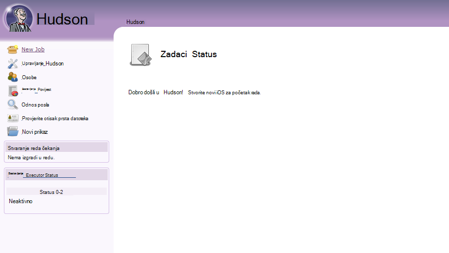
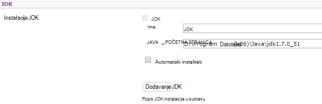
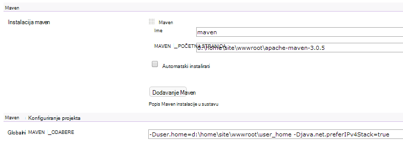

<properties 
    pageTitle="Prijenos prilagođenu web-aplikaciju Java Azure" 
    description="Pomoću ovog praktičnog vodiča pokazuje kako prenijeti prilagođenu Java web-aplikaciju na Azure aplikacije servisa web-aplikacije." 
    services="app-service\web" 
    documentationCenter="java" 
    authors="rmcmurray" 
    manager="wpickett" 
    editor=""/>

<tags 
    ms.service="app-service-web" 
    ms.workload="web" 
    ms.tgt_pltfrm="na" 
    ms.devlang="Java" 
    ms.topic="article" 
    ms.date="08/11/2016" 
    ms.author="robmcm"/>

# Prijenos prilagođenu web-aplikaciju Java Azure

U ovoj se temi objašnjava kako prenijeti prilagođenu Java web-aplikaciju na [Aplikacije servisa za Azure] web-aplikacije. Uključiti se informacije koje se odnose na bilo koju Java web-mjesta ili web-aplikaciju, a i nekoliko primjera za određene aplikacije.

Imajte na umu da Azure nudi sredstvo za stvaranje Java web-aplikacije pomoću portala za Azure konfiguriranje korisničkog Sučelja i trgovine Windows Azure, kao što je navedenih pri [stvorite Java web-aplikaciju u aplikacije servisa za Azure](web-sites-java-get-started.md). Pomoću ovog praktičnog vodiča namijenjen scenariji u kojima ne želite konfiguracija Azure Portal korisničkog Sučelja ili trgovine Windows Azure.  

## Smjernice za konfiguraciju

Postavke očekivanjima prilagođene Java web-aplikacijama na Azure opisuju.

- HTTP priključak koji se koristi proces Java dinamički dodijeljeni.  Postupak morate koristiti priključak iz varijablu okruženja `HTTP_PLATFORM_PORT`.
- Svi priključci preslušavanja osim jednog HTTP ga slušatelj mora biti onemogućene.  U Tomcat, koji obuhvaća isključivanja, HTTPS i AJP priključci.
- Spremnik nije potrebno je konfigurirati za IPv4 promet samo.
- Naredbom za **pokretanje** aplikacije mora biti postavljena u konfiguraciji.
- Aplikacijama koje je potrebno direktorija s pisanje dozvola treba nalaziti u Azure web app imenik sa sadržajem, što je **D:\home**.  Okolini varijabla `HOME` se odnosi na D:\home.  

Varijable okruženja po potrebi možete postaviti u datoteci web.config.

## Konfiguriranje httpPlatform web.config

Informacije u nastavku opisuju oblik **httpPlatform** unutar web.config.
                                 
**Argumenti** (Zadana = ""). Argumenti izvršnu datoteku ili skriptu naveden u postavci **processPath** .

Primjeri (prikazanom **processPath** uključena):

    processPath="%HOME%\site\wwwroot\bin\tomcat\bin\catalina.bat"
    arguments="start"
    
    processPath="%JAVA_HOME\bin\java.exe"
    arguments="-Djava.net.preferIPv4Stack=true -Djetty.port=%HTTP\_PLATFORM\_PORT% -Djetty.base=&quot;%HOME%\site\wwwroot\bin\jetty-distribution-9.1.0.v20131115&quot; -jar &quot;%HOME%\site\wwwroot\bin\jetty-distribution-9.1.0.v20131115\start.jar&quot;"

**processPath** - put do izvršne datoteke ili skriptu koja će se pokrenuti slušanje HTTP zahtjeva za proces.

Primjeri:

    processPath="%JAVA_HOME%\bin\java.exe"

    processPath="%HOME%\site\wwwroot\bin\tomcat\bin\startup.bat"

    processPath="%HOME%\site\wwwroot\bin\tomcat\bin\catalina.bat"
                                                                                       
**rapidFailsPerMinute** (Zadana = 10.) Broj postupak naveden u **processPath** je dopušteno pad minuti. Ako je to ograničenje premaši, **HttpPlatformHandler** će prestati pokretanje postupka za ostatak od minute.
                                    
**requestTimeout** (Zadana = "00: 02:00".) Trajanje čijim **HttpPlatformHandler** čekati na odgovor od procesa koji se priključuje na `%HTTP_PLATFORM_PORT%`.

**startupRetryCount** (Zadana = 10.) Broj **HttpPlatformHandler** će pokušati da biste pokrenuli postupak naveden u **processPath**. **StartupTimeLimit** dodatne pojedinosti potražite u članku.

**startupTimeLimit** (Zadana = 10 sekundi.) Trajanje čijim **HttpPlatformHandler** čekati na izvršna datoteka/skriptu da biste pokrenuli postupak slušanje na priključak.  Ako u ovom iskoristi vrijeme, **HttpPlatformHandler** će Ukloni postupak i pokušajte pokrenuti ponovno **startupRetryCount** vremena.
                                                                                      
**stdoutLogEnabled** (Zadana = "true".) Ako je istinito, **stdout** i **stderr** za postupak naveden u postavci **processPath** bit ćete preusmjereni otvorenu datoteku navedenu u **stdoutLogFile** (pogledajte odjeljak **stdoutLogFile** ).
                                    
**stdoutLogFile** (Default="d:\home\LogFiles\httpPlatformStdout.log".) Apsolutni put do datoteke za koje **stdout** i **stderr** iz postupak naveden u **processPath** zapisat će se.
                                    
> [AZURE.NOTE] `%HTTP_PLATFORM_PORT%`je rezervirano mjesto za posebne koje treba naveden kao dio **argumente** ili kao dio popisa **environmentVariables** **httpPlatform** . To će se zamijeniti interno generirani priključak po **HttpPlatformHandler** tako da možete postupka određen **processPath** osluškuju priključak.

## Uvođenje

Java na temelju web-aplikacije mogu biti implementirano jednostavno kroz najčešće znači isti koji se koriste s na Internet Information Services (IIS) temelje web-aplikacije.  FTP, brojka i Kudu sve podržane su kao mehanizme za implementaciju, kao što je integrirani IO mogućnost za web-aplikacije. WebDeploy funkcionira kao protokol, međutim, kao što je Java je razvijena u Visual Studio WebDeploy ne stane sa Java web app implementacije korištenje slučajevima.

## Konfiguracija aplikacije Primjeri

Za sljedeće aplikacije, web.config datoteke i aplikacije konfiguracije prikazuje se kao primjeri da biste prikazali kako omogućiti Java aplikacija na web-aplikacije servisa za aplikacije.

### Tomcat
Iako postoje dvije varijacije na Tomcat koji su navedeni u aplikaciju servisa Web Apps, i dalje prilično moguće je da biste prenijeli određene instance klijenta. Slijedi primjer instalaciju sustava Tomcat s na različitim Java virtualnog računala (JVM).

    <?xml version="1.0" encoding="UTF-8"?>
    <configuration>
      <system.webServer>
        <handlers>
          <add name="httpPlatformHandler" path="*" verb="*" modules="httpPlatformHandler" resourceType="Unspecified" />
        </handlers>
        <httpPlatform processPath="%HOME%\site\wwwroot\bin\tomcat\bin\startup.bat" 
            arguments="">
          <environmentVariables>
            <environmentVariable name="CATALINA_OPTS" value="-Dport.http=%HTTP_PLATFORM_PORT%" />
            <environmentVariable name="CATALINA_HOME" value="%HOME%\site\wwwroot\bin\tomcat" />
            <environmentVariable name="JRE_HOME" value="%HOME%\site\wwwroot\bin\java" /> <!-- optional, if not specified, this will default to %programfiles%\Java -->
            <environmentVariable name="JAVA_OPTS" value="-Djava.net.preferIPv4Stack=true" />
          </environmentVariables>
        </httpPlatform>
      </system.webServer>
    </configuration>

Na strani Tomcat postoji nekoliko promjene konfiguracije koje morate izvršiti. Na server.xml mora se urediti da biste postavili:

-   Isključivanje priključak = -1
-   HTTP poveznik priključak = ${port.http}
-   HTTP poveznik adresa = "127.0.0.1"
-   Komentar izvan HTTPS i AJP poveznika
-   Postavka IPv4 možete postaviti i u datoteci catalina.properties gdje možete dodati`java.net.preferIPv4Stack=true`
    
Direct3d poziva nisu podržane na web-aplikacije servisa za aplikacije. Da biste onemogućili one, dodajte sljedeću mogućnost Java aplikacije provjerite takve pozive:`-Dsun.java2d.d3d=false`

### Jetty

Kao što je to slučaj za Tomcat, korisnici možete prenijeti vlastite instanci za Jetty. U slučaju izvodi puna instalacija Jetty konfiguraciju izgleda ovako:

    <?xml version="1.0" encoding="UTF-8"?>
    <configuration>
      <system.webServer>
        <handlers>
          <add name="httppPlatformHandler" path="*" verb="*" modules="httpPlatformHandler" resourceType="Unspecified" />
        </handlers>
        <httpPlatform processPath="%JAVA_HOME%\bin\java.exe" 
             arguments="-Djava.net.preferIPv4Stack=true -Djetty.port=%HTTP_PLATFORM_PORT% -Djetty.base=&quot;%HOME%\site\wwwroot\bin\jetty-distribution-9.1.0.v20131115&quot; -jar &quot;%HOME%\site\wwwroot\bin\jetty-distribution-9.1.0.v20131115\start.jar&quot;"
            startupTimeLimit="20"
          startupRetryCount="10"
          stdoutLogEnabled="true">
        </httpPlatform>
      </system.webServer>
    </configuration>

Konfiguriranje Jetty potrebno promijeniti u start.ini da biste postavili `java.net.preferIPv4Stack=true`.

### Springboot
Da biste dobili na Springboot aplikacije koje se izvode koji moraju Prenesite datoteku POSUDU ili WAR i dodajte sljedeće web.config datoteke. Ulazi web.config datoteke u mapu wwwroot. U datoteka web.config prilagodite argumenata pokažite na datoteku POSUDU u sljedećem primjeru POSUDU datoteka se nalazi u mapi wwwroot.  

    <?xml version="1.0" encoding="UTF-8"?>
    <configuration>
      <system.webServer>
        <handlers>
          <add name="httpPlatformHandler" path="*" verb="*" modules="httpPlatformHandler" resourceType="Unspecified" />
        </handlers>
        <httpPlatform processPath="%JAVA_HOME%\bin\java.exe"
            arguments="-Djava.net.preferIPv4Stack=true -Dserver.port=%HTTP_PLATFORM_PORT% -jar &quot;%HOME%\site\wwwroot\my-web-project.jar&quot;">
        </httpPlatform>
      </system.webServer>
    </configuration>

### Hudson

Naš probno koristi war Hudson 3.1.2 i zadane instance Tomcat 7.0.50, ali bez korištenja korisničkog Sučelja za postavljanje značajki.  Budući da Hudson alat za sastavljanje softverski, svakako se da biste ga instalirali na namjenski slučajeve u kojima se zastavica **AlwaysOn** biti postavljena na web-aplikaciji.

1. U korijenskom direktoriju web app, odnosno **d:\home\site\wwwroot**, stvorite direktorij **webapps** (Ako je već ne postoje), a zatim potvrdite Hudson.war **d:\home\site\wwwroot\webapps**.
2. Preuzimanje apache maven 3.0.5 (kompatibilan s Hudson) i njegovo stavljanje u **d:\home\site\wwwroot**.
3. Stvaranje web.config u **d:\home\site\wwwroot** i zalijepite sljedeće sadržaje:
    
        <?xml version="1.0" encoding="UTF-8"?>
        <configuration>
          <system.webServer>
            <handlers>
              <add name="httppPlatformHandler" path="*" verb="*" 
        modules="httpPlatformHandler" resourceType="Unspecified" />
            </handlers>
            <httpPlatform processPath="%AZURE_TOMCAT7_HOME%\bin\startup.bat"
        startupTimeLimit="20"
        startupRetryCount="10">
        <environmentVariables>
          <environmentVariable name="HUDSON_HOME" 
        value="%HOME%\site\wwwroot\hudson_home" />
          <environmentVariable name="JAVA_OPTS" 
        value="-Djava.net.preferIPv4Stack=true -Duser.home=%HOME%/site/wwwroot/user_home -Dhudson.DNSMultiCast.disabled=true" />
        </environmentVariables>            
            </httpPlatform>
          </system.webServer>
        </configuration>

    U ovom trenutku web-aplikaciju možete ponovno pokrenuti da bi promjene.  Povezivanje s http://yourwebapp/hudson da biste pokrenuli Hudson.

4. Nakon Hudson konfigurira sam, trebali biste vidjeti na sljedećim je zaslonima:

    
    
5. Pristup stranici za konfiguraciju Hudson: kliknite **Upravljanje Hudson**, a zatim kliknite **Konfiguriranje sustava**.
6. Konfiguriranje u JDK kao što je prikazano u nastavku:

    

7. Konfiguriranje Maven kao što je prikazano u nastavku:

    

8. Spremanje postavki. Hudson sada bi trebala biti konfiguriran i možete koristiti.

Dodatne informacije o Hudson potražite u članku [http://hudson-ci.org](http://hudson-ci.org).

### Liferay

Liferay podržana za aplikaciju servisa web-aplikacije. Budući da Liferay možete zatražiti značajan memorije, web-aplikaciji treba pokrenuti na srednje i velike namjenski tempiranja, koje možete unijeti dovoljno memorije. Liferay traje i nekoliko minuta da biste pokrenuli zajedno. Zbog toga, preporučuje se da biste **Uvijek na**postavljanje web-aplikaciji.  

Pomoću Tomcat Liferay 6.1.2 GA3 Edition zajednice vezanoj instalaciji, sljedeće datoteke uredite nakon preuzimanja Liferay:

**Server.XML**

- Promjena priključka zatvaranja-1.
- Promjena HTTP poveznika      `<Connector port="${port.http}" protocol="HTTP/1.1" connectionTimeout="600000" address="127.0.0.1" URIEncoding="UTF-8" />`
- Komentar izvan AJP poveznik.

U mapi **liferay\tomcat-7.0.40\webapps\ROOT\WEB-INF\classes** stvoriti datoteku pod nazivom **portal ext.properties**. Datoteka mora sadržavati jedan redak, kao što je prikazano ovdje:

    liferay.home=%HOME%/site/wwwroot/liferay

Na istoj razini directory kao što je mapa tomcat 7.0.40, stvorite datoteku pod nazivom **web.config** pomoću sljedećeg sadržaja:

    <?xml version="1.0" encoding="UTF-8"?>
    <configuration>
      <system.webServer>
        <handlers>
    <add name="httpPlatformHandler" path="*" verb="*"
         modules="httpPlatformHandler" resourceType="Unspecified" />
        </handlers>
        <httpPlatform processPath="%HOME%\site\wwwroot\tomcat-7.0.40\bin\catalina.bat" 
                      arguments="run" 
                      startupTimeLimit="10" 
                      requestTimeout="00:10:00" 
                      stdoutLogEnabled="true">
          <environmentVariables>
      <environmentVariable name="CATALINA_OPTS" value="-Dport.http=%HTTP_PLATFORM_PORT%" />
      <environmentVariable name="CATALINA_HOME" value="%HOME%\site\wwwroot\tomcat-7.0.40" />
            <environmentVariable name="JRE_HOME" value="D:\Program Files\Java\jdk1.7.0_51" /> 
            <environmentVariable name="JAVA_OPTS" value="-Djava.net.preferIPv4Stack=true" />
          </environmentVariables>
        </httpPlatform>
      </system.webServer>
    </configuration>

U odjeljku blokiranje **httpPlatform** **requestTimeout** je postavljeno na "00: 10:00".  Mogu se smanjiti, ali pa ćete vidjeti neke pogreške vremenskog ograničenja dok je pokretački Liferay.  Ako se promijeni tu vrijednost, zatim **connectionTimeout** u tomcat server.xml moraju se može mijenjati.  

To vrijedi sudjelovanje je li navedena JRE_HOME environnment varariable u iznad web.config na 64-bitni JDK. Zadana vrijednost je 32-bitni, ali jer Liferay može zahtijevati visoke razine memorije, preporučuje se da biste koristili JDK 64-bitni.

Kada unesete promjene, ponovno pokrenite aplikaciju web pokrenut Liferay, zatim otvorite http://yourwebapp. Portal za Liferay dostupna iz korijena web app. 

## Daljnji koraci

Dodatne informacije o Liferay potražite u članku [http://www.liferay.com](http://www.liferay.com).

Dodatne informacije o Java potražite u članku [Razvojni centar za Java](/develop/java/).

[AZURE.INCLUDE [app-service-web-whats-changed](../../includes/app-service-web-whats-changed.md)]

[AZURE.INCLUDE [app-service-web-try-app-service](../../includes/app-service-web-try-app-service.md)]
 
 
<!-- External Links -->
[Aplikacije servisa za Azure]: http://go.microsoft.com/fwlink/?LinkId=529714
