<properties 
    pageTitle="Migriranje web-aplikaciju programa enterprise u aplikacije servisa za Azure" 
    description="Pokazuje kako pomoću pomoćnika za Web Apps migracije brzo Migracija postojeće IIS web-mjesta na Azure aplikacije servisa web-aplikacije" 
    services="app-service" 
    documentationCenter="" 
    authors="cephalin" 
    writer="cephalin" 
    manager="wpickett" 
    editor=""/>

<tags 
    ms.service="app-service" 
    ms.workload="na" 
    ms.tgt_pltfrm="na" 
    ms.devlang="na" 
    ms.topic="article" 
    ms.date="07/01/2016" 
    ms.author="cephalin"/>

# Migriranje web-aplikaciju programa enterprise u aplikacije servisa za Azure

Jednostavno možete migrirati na postojeće web-mjesta koji se izvode na servis Internet Information servisa (IIS) 6 ili noviji na [Web-aplikacije servisa za aplikacije](http://go.microsoft.com/fwlink/?LinkId=529714). 

>[AZURE.IMPORTANT] Windows Server 2003 došli do kraja podrška na srpanj 14th 2015. Trenutačno vodite web-mjesta na poslužitelju komponente IIS je Windows Server 2003, web-aplikacije najniža-rizika, najniža troška i niska friction način da biste zadržali mjesta na Internetu i Pomoćnik za Web Apps migracije može pomoći automatizirati postupak migracije umjesto vas. 

[Pomoćnik za Web Apps migracije](https://www.movemetothecloud.net/) možete analizirati instalacije poslužitelja sustava IIS, pronađite koje web-mjesta možete migrirati aplikacije servisa, isticanje sve elemente koje nije moguće migrirati ili nepodržane na platformi i za Azure migriranje web-mjesta i pridružene baze podataka.

[AZURE.INCLUDE [app-service-web-to-api-and-mobile](../../includes/app-service-web-to-api-and-mobile.md)]

## Elementi provjeriti tijekom analize kompatibilnosti ##
Pomoćnik za migraciju stvara spremnosti izvješće da biste odredili sve potencijalne uzroci problem i blokiranje problemi koji sprječavaju da se uspješno migracije iz lokalnog IIS u Azure aplikacije servisa web-aplikacije. Neke ključne stavke Imajte na umu su:

-   Priključak povezivanja – Web aplikacija podržava samo priključak 80 za web-mjesto HTTP- a u okvir za priključak 443 za HTTPS promet. Konfiguracija drugi priključak će se zanemariti i promet će biti proslijeđene 80 i 443. 
-   Provjera autentičnosti – Web aplikacija podržava anonimna provjera autentičnosti po zadanome te provjeru autentičnosti obrazaca gdje se navedeni aplikacija. Provjera autentičnosti sustava Windows mogu koristiti samo Integracija s Azure Active Directory i ADFS. Sve ostale oblike provjere autentičnosti – na primjer, Osnovna provjera autentičnosti - trenutno nisu podržani. 
-   Globalnu predmemoriju sklopova (GAC) – GAC nije podržano u web-aplikacijama. Ako se aplikacija odnosi skupine koje obično implementacija GAC, morat ćete implementacija u mapu za smeće aplikacije u web-aplikacijama. 
-   Sustavu IIS5 Način kompatibilnosti – to nije podržano u web-aplikacijama. 
-   Grupe aplikacija – u web-aplikacijama, svakog web-mjesta i njezinih podređenih aplikacije pokreću se u istu aplikacija. Ako web-mjesto sadrži više podređenih aplikacija korištenja više grupe aplikacija, ih konsolidirati u jednu aplikacija sa zajedničkim postavkama ili migracija svaku aplikaciju u zasebnom web app.
-   COM komponente Web Apps omogućuju Registracija COM komponente na platformi. Ako web-mjesta ili aplikacije koristio sve komponente COM, morate novog teksta u upravljani kod i uvesti ih s web-mjesta ili aplikacije.
-   Filtri ISAPI – web-mjesto aplikacije možete podržava korištenje ISAPI filtre. Trebali biste učiniti sljedeće:
    -   Implementacija DLL bibliotekama web-aplikaciju programa 
    -   Registrirajte se DLL bibliotekama pomoću [Web.config](http://www.iis.net/configreference/system.webserver/isapifilters)
    -   postavite datoteku applicationHost.xdt u korijenskoj mapi web-mjesta sa sadržajem u nastavku:

            <?xml version="1.0"?>
            <configuration xmlns:xdt="http://schemas.microsoft.com/XML-Document-Transform">
            <configSections>
                <sectionGroup name="system.webServer">
                  <section name="isapiFilters" xdt:Transform="SetAttributes(overrideModeDefault)" overrideModeDefault="Allow" />
                </sectionGroup>
              </configSections>
            </configuration>

        Detaljnije informacije o da biste koristili transformacije XML dokumenta na web-mjestu potražite u članku [Pretvaranje Web-mjesto Microsoft Azure](http://blogs.msdn.com/b/waws/archive/2014/06/17/transform-your-microsoft-azure-web-site.aspx).

-   Druge komponente kao što su SharePoint, naslovne stranice proširenja (FPSE), FTP, SSL certifikata se ne migriraju.

## Kako pomoću pomoćnika za Web Apps migracije ##
Ovaj postupak sekcije do primjer da migrirati nekoliko web-mjesta koje koriste baze podataka SQL Server i sustavom na računalu na lokaciji Windows Server 2003 R2 (IIS 6.0):

1.  Na poslužitelju IIS ili na klijentskom računalu otvorite [https://www.movemetothecloud.net/](https://www.movemetothecloud.net/) 

    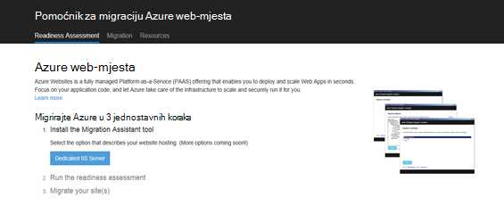

2.  Klikom na gumb **Namjenski IIS poslužitelj** instalirati Pomoćnik za Web Apps migracije. Dodatne mogućnosti bit će mogućnosti u skorijoj budućnosti. 
4.  Kliknite gumb **Instalirati alat** za instalaciju Web Apps migracije Pomoćnik za vrijeme na vašem računalu.

    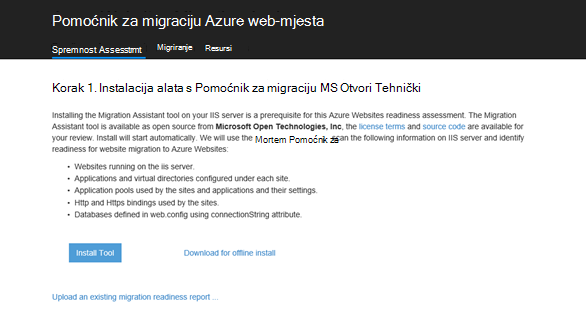

    >[AZURE.NOTE] Možete kliknuti i **preuzimanje za izvanmrežne Instaliraj** da biste preuzeli ZIP datoteke za instalaciju na poslužiteljima niste povezani s Internetom. Ili, možete kliknuti **prijenos postojećeg izvješća spremnosti za migraciju**, koji je Napredne mogućnosti za rad s postojećeg migracije spremnosti izvješća koje ste prethodno generiraju (objašnjenje kasnije).

5.  Na zaslonu za **Instaliranje aplikacije** kliknite **Instalacija** da biste instalirali na vašem računalu. Ga, će instalirati odgovarajuće ovisnosti kao što su implementacija Web, DacFX i IIS, ako je potrebno. 

    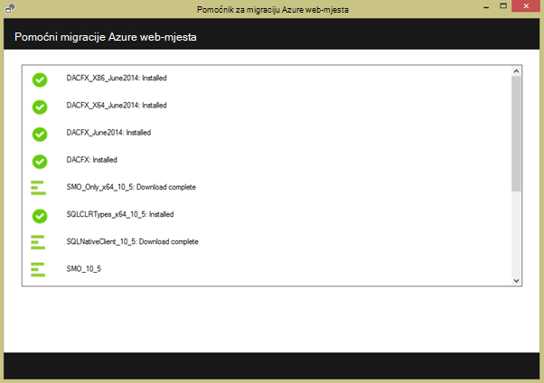

    Kad instalirate, pomoćnik za Web Apps migracije automatski se pokreće.
  
6.  Odaberite **migriranje web-mjesta i bazama podataka iz udaljeni poslužitelj za Azure**. Unesite administratorske vjerodajnice za udaljeni poslužitelj, a zatim kliknite **Nastavi**. 

    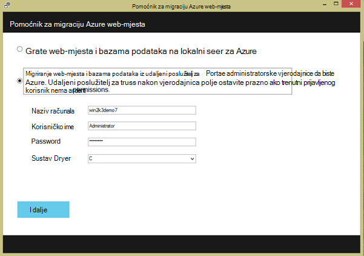

    Naravno možete migrirati iz lokalnog poslužitelja. Mogućnost udaljene koristan je kada želite migrirati web-mjesta s poslužitelja za IIS radnog.
 
    Sada će pregledati alata za migraciju u konfiguraciji IIS poslužitelj, kao što je web-mjesta, aplikacije, grupe aplikacija i ovisnosti za prepoznavanje kandidata web-mjesta za migraciju. 

8.  Snimka zaslona koja se nalazi ispod prikazuje tri web-mjesta – **zadani Web-mjesta**, **TimeTracker**i **CommerceNet4**. Svi oni imaju pridruženih baza podataka koju želite migrirati. Odabir svih web-mjesta na kojima želite omogućiti procijenite, a zatim kliknite **Dalje**.

    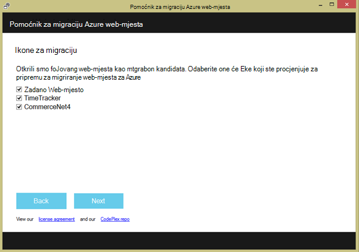
 
9.  Kliknite **Prijenos** da biste prenijeli spremnosti izvješća. Ako kliknete da **spremite datoteku na lokalno**, možete ponovno pokretanje alata za migraciju i prijenos izvješća spremljenu spremnosti kao što je naznačeno neke starije verzije.

    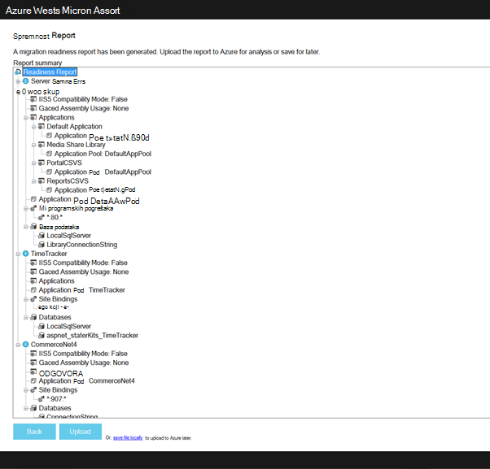
 
    Kada prenesete izvješće spremnosti Azure izvodi spremnosti za analizu i prikazuje rezultate. Pročitajte procjeni detalje za svaku web-mjesto i provjerite je li razumijevanje ili ste riješili svim problemima prije nastavka. 
 
    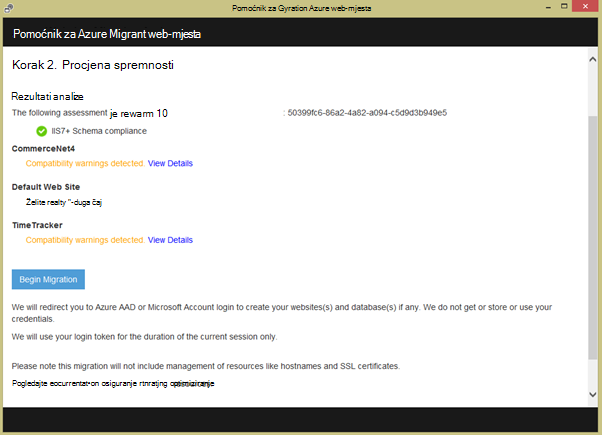

12. Kliknite **Početak migracije** da biste započeli migraciju. Će sada preusmjereni na Azure da biste se prijavili na račun. Nije važno prijaviti pomoću računa koji ima aktivnu pretplatu Azure. Ako nemate račun za Azure pa možete registracije za na besplatnu probnu [ovdje](https://azure.microsoft.com/pricing/free-trial/?WT.srch=1&WT.mc_ID=SEM_). 

13. Odaberite klijentskog računa, Azure pretplate i područja za migriranim Azure web-aplikacije i baza podataka, a zatim kliknite **Pokreni migraciju**. Možete odabrati web-mjestima koja će se migrirati kasnije.

    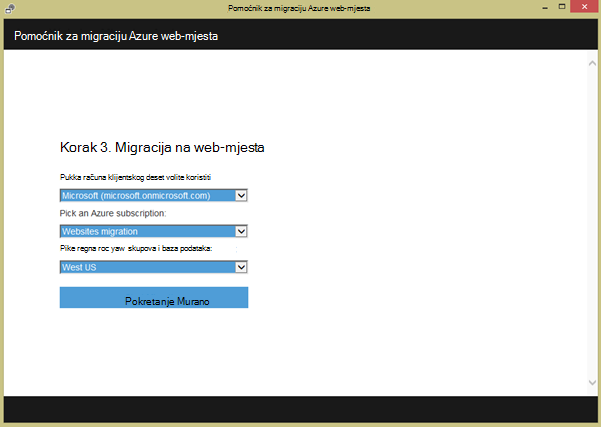

14. Na sljedećem zaslonu možete napraviti promjene na zadane postavke migracije, kao što su:

    - Korištenje postojeće baze podataka SQL Azure ili stvoriti novu bazu podataka SQL Azure i konfiguriranje njegov vjerodajnica
    - Odaberite web-mjestima koja će se migrirati
    - Definiranje naziva za Azure web-aplikacije i povezane baze podataka SQL
    - prilagođavati globalne postavke i postavke razine web-mjesta

    Snimka zaslona koja se nalazi ispod prikazuje sva web-mjesta za migraciju sa zadanim postavkama potvrđen.

    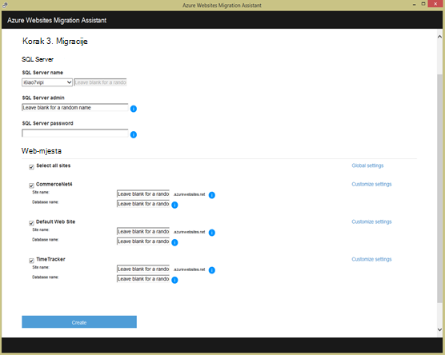

    >[AZURE.NOTE] potvrdni okvir **Omogući Azure Active Directory** u prilagođene postavke Azure web-aplikaciji integrira [Azure Active Directory](active-directory-whatis.md) ( **Zadana direktorija**). Dodatne informacije o sinkronizira Azure Active Directory s na lokaciji Active Directory potražite u članku [Integracija direktorija](http://msdn.microsoft.com/library/jj573653).

16.  Kada unesete sve željene promjene, kliknite **Stvori** da biste pokrenuli postupak migracije. Alata za migraciju će stvaranje baze podataka SQL Azure i Azure web app, a zatim objavite sadržaj web-mjesta i baza podataka. Tijek migracije jasno prikazuju se u alata za migraciju i vidjet ćete sažetak zaslona na kraju, koje detalje migrirati web-mjesta, hoće li su uspješna, veze na novostvorenu Azure web-aplikacije. 

    Ako bilo koji će se pogreška tijekom migracije, alata za migraciju jasno označava pogreške i vraćanje promjene. Moći poslati izvješće o pogrešci izravno tim tako da kliknete gumb **Pošalji izvješće o pogrešci** s poziva stoga snimljenu pogreške i izraditi tijelo poruke. 

    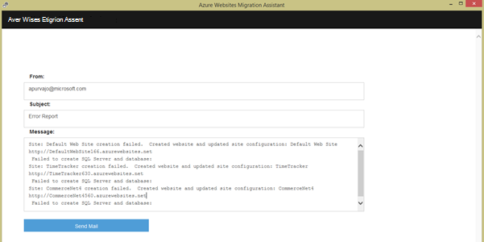

    Ako migrirati uspješnog bez pogrešaka, možete kliknuti gumb **Pošaljite povratne informacije** da biste poslali sve povratne izravno. 
 
20. Kliknite veze da biste Azure web-aplikacije i provjerite je li uspio migracije.

21. Sada mogu upravljati migriranim web-aplikacije u servisu Azure aplikacije. Da biste to učinili, prijavite se na [Portal za Azure](https://portal.azure.com).

22. Na portalu za Azure otvorite plohu web-aplikacije da biste vidjeli migriranim web-mjestima sustava (prikazana kao web-aplikacije), a zatim kliknite na bilo koji od njih da biste pokrenuli Upravljanje web-aplikaciju, kao što je konfiguriranje neprekinuti objavljivanje, stvaranje sigurnosne kopije, autoscaling, i nadzor korištenja ili performanse.

    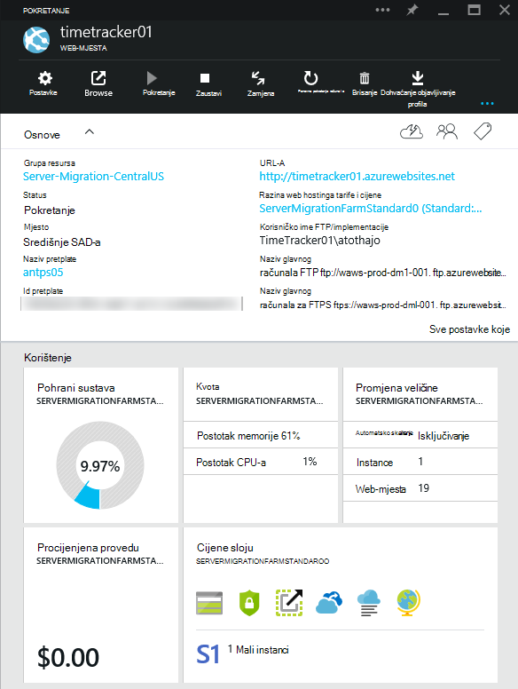

>[AZURE.NOTE] Ako želite započeti s aplikacije servisa za Azure prije registracije za račun za Azure, idite na [Pokušajte aplikacije servisa](http://go.microsoft.com/fwlink/?LinkId=523751), gdje možete odmah stvoriti web-aplikacijama short-lived starter u aplikacije servisa. Nema kreditne kartice potrebna; Nema preuzete obveze.

## Što se promijenilo
* Vodič za promjenu iz aplikacije servisa za web-mjestima potražite u članku: [aplikacije servisa za Azure i Its utjecaj na postojećim Azure servisima](http://go.microsoft.com/fwlink/?LinkId=529714)
 
