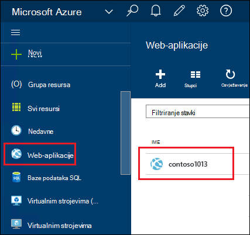
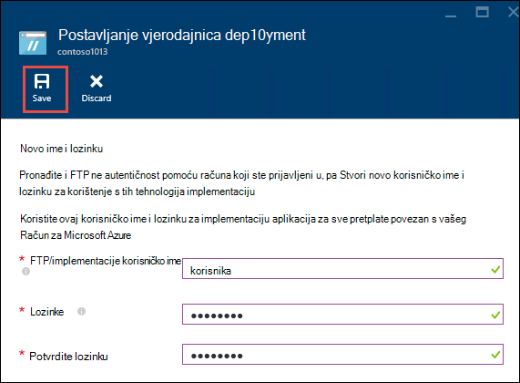
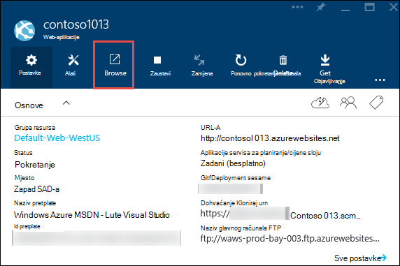
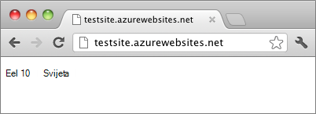

<properties
    pageTitle="Stvaranje web-aplikacijama Node.js u aplikacije servisa za Azure | Microsoft Azure"
    description="Saznajte kako implementirati Node.js aplikacije web-aplikaciju u aplikacije servisa za Azure."
    services="app-service\web"
    documentationCenter="nodejs"
    authors="rmcmurray"
    manager="wpickett"
    editor=""/>

<tags
    ms.service="app-service-web"
    ms.workload="web"
    ms.tgt_pltfrm="na"
    ms.devlang="nodejs"
    ms.topic="hero-article"
    ms.date="08/11/2016"
    ms.author="robmcm"/>

# Stvaranje web-aplikacijama Node.js u aplikacije servisa za Azure

> [AZURE.SELECTOR]
- [.NET](web-sites-dotnet-get-started.md)
- [Node.js](web-sites-nodejs-develop-deploy-mac.md)
- [Java](web-sites-java-get-started.md)
- [PHP - brojka](web-sites-php-mysql-deploy-use-git.md)
- [I - FTP](web-sites-php-mysql-deploy-use-ftp.md)
- [Python](web-sites-python-ptvs-django-mysql.md)

Pomoću ovog praktičnog vodiča pokazuje kako stvoriti jednostavan [Node.js](http://nodejs.org) aplikaciju i implementacija [web-aplikacije](app-service-web-overview.md) u [Aplikacije servisa za Azure](../app-service/app-service-value-prop-what-is.md) pomoću [brojka](http://git-scm.com). U operacijskom sustavu koji se može pokrenuti Node.js mogu slijediti upute u ovom ćete praktičnom vodiču.

Ćete saznati:

* Upute za stvaranje web-aplikacijama u aplikacije servisa za Azure pomoću portala za Azure.
* Kako implementirati Node.js aplikaciju za web-aplikaciji pritiskom na web-aplikaciji brojka spremište.

Dovršeni aplikacije piše niz "Pozdrav svijeta" kratki u preglednik.

![U pregledniku s porukom "Pozdrav svijeta".][helloworld-completed]

Za vodiče i uzorak koda s aplikacijama složenije Node.js ili druge teme o tome kako koristiti Node.js u Azure, potražite u članku [Razvojni centar za Node.js](/develop/nodejs/).

> [AZURE.NOTE]
> Da biste dovršili ovaj Praktični vodič, morate račun sustava Microsoft Azure. Ako nemate račun, možete ga [aktivirati svoje prednosti pretplatnika Visual Studio](/en-us/pricing/member-offers/msdn-benefits-details/?WT.mc_id=A261C142F) ili [prijavite se za besplatnu probnu verziju](/en-us/pricing/free-trial/?WT.mc_id=A261C142F).
>
> Ako želite započeti s aplikacije servisa za Azure prije registracije za račun za Azure, idite na [Pokušajte aplikacije servisa](http://go.microsoft.com/fwlink/?LinkId=523751). Postoji, možete odmah stvoriti web-aplikacijama short-lived starter u aplikacije servisa za – bez kreditne kartice potrebna i bez preuzete obveze.

## Stvaranje web-aplikacijama i omogućite brojka objavljivanje

Slijedite ove korake da biste stvorili web-aplikacijama u aplikacije servisa za Azure i omogućite brojka objavljivanje. 

[Brojka](http://git-scm.com/) je sustav raspodijeljeno verzije kontrole koje možete koristiti za implementaciju Azure web-mjesta. Ćete spremiti kod u pišete za web-aplikacije u lokalnom spremištu brojka, a kod će uvesti Azure pritiskom na udaljenom spremište. Ova metoda uvođenja je značajka aplikacije servisa za web-aplikacije.  

1. Prijava na [Portal za Azure](https://portal.azure.com).

2. Kliknite ikonu **+ NOVO** u gornjem lijevom kutu Portal za Azure.

3. Kliknite **Web + Mobile**, a zatim kliknite **web-aplikacija**.

    ![][portal-quick-create]

4. Unesite naziv za web-aplikacije u okvir **Web app** .

    Taj naziv mora biti jedinstvena u domeni azurewebsites.net jer URL web-aplikaciji bit će {name}. azurewebsites.net. Ako ne naziv unesite jedinstveni, pojavljuje se crveni uskličnik u tekstni okvir.

5. Odaberite **pretplatu**.

6. Odaberite **Grupu resursa** ili stvorite novi.

    Dodatne informacije o grupama resursa potražite u članku [Pregled upravljanja resursima Azure](../azure-resource-manager/resource-group-overview.md).

7. Odaberite **Plan mjesto aplikacije servisa** ili stvorite novi.

    Dodatne informacije o tarifama za aplikacije servisa za potražite u članku [Pregled tarife aplikacije servisa za Azure](../azure-web-sites-web-hosting-plans-in-depth-overview.md)

8. Kliknite **Stvori**.
   
    ![][portal-quick-create2]

    U kratko vrijeme, obično manje u minutu Azure Završi stvaranje novog web-aplikaciji.

9. Kliknite **web-aplikacije > {novog web-aplikaciju programa}**.

    

10. U plohu **Web app** kliknite dio **implementacije** .

    ![][deployment-part]

11. U plohu **Neprekinuti implementacije** kliknite **Odabir izvora**

12. Kliknite **Lokalnom spremištu brojka**, a zatim kliknite **u redu**.

    ![][setup-git-publishing]

13. Postavljanje vjerodajnica za implementaciju ako to još niste učinili.

    na. U aplikaciji plohu Web kliknite **Postavke > vjerodajnice za implementaciju**.

    ![][deployment-credentials]
 
    b. Stvorite korisničko ime i lozinku. 
    
    

14. U aplikaciji plohu Web kliknite **Postavke**, a zatim kliknite **Svojstva**.
 
    Da biste objavili, ćete automatske udaljene brojka spremište. URL za spremište nalazi se u odjeljku **BROJKA URL-a**. Koristit ćete ovaj URL kasnije u ovom praktičnom vodiču.

    ![][git-url]

## Stvaranje i lokalno aplikacija za testiranje

U ovom ćete odjeljku stvorit ćete **server.js** datoteku koja sadrži malo izmijenjene verzije primjer 'Pozdrav svijeta' iz [nodejs.org]. Kod dodaje process.env.PORT kao priključak osluškuju kada se pokrene u aplikaciji programa Azure web.

1. Stvorite direktorij pod nazivom *helloworld*.

2. Da biste stvorili novu datoteku pod nazivom **server.js** u direktoriju *helloworld* koristite uređivač teksta.

2. Kopirajte sljedeći kod u **server.js** datoteku, a zatim spremite datoteku:

        var http = require('http')
        var port = process.env.PORT || 1337;
        http.createServer(function(req, res) {
          res.writeHead(200, { 'Content-Type': 'text/plain' });
          res.end('Hello World\n');
        }).listen(port);

3. Otvorite naredbeni redak, a koristite sljedeću naredbu da biste pokrenuli web-aplikaciji lokalno.

        node server.js

4. Otvorite web-preglednik i idite na http://localhost:1337. 

    Web-stranicu koja se prikazuje "Pozdrav svijeta" prikazuje se kao što je prikazano u sljedećim snimku zaslona.

    ![U pregledniku s porukom "Pozdrav svijeta".][helloworld-localhost]

## Objavljivanje aplikacija

1. Ako to još niste učinili, instalirajte brojka.

    Upute za instalaciju za svoju platformu, potražite u članku [brojka na stranici za preuzimanje](http://git-scm.com/download).

1. Iz naredbenog retka promjena direktorija u direktoriju **helloworld** i unesite sljedeću naredbu za inicijalizaciju lokalnom spremištu brojka.

        git init

2. Dodavanje datoteka u spremištu pomoću sljedeće naredbe:

        git add .
        git commit -m "initial commit"

3. Dodajte brojka koji je udaljene za margina ažuriranja za web-aplikacije koje ste prethodno, stvorili pomoću sljedeće naredbe:

        git remote add azure [URL for remote repository]

4. Automatske promjene za Azure pomoću sljedeće naredbe:

        git push azure master

    Zatraži lozinku koji ste stvorili ranije. Rezultat je slično kao u sljedećem primjeru.

        Counting objects: 3, done.
        Delta compression using up to 8 threads.
        Compressing objects: 100% (2/2), done.
        Writing objects: 100% (3/3), 374 bytes, done.
        Total 3 (delta 0), reused 0 (delta 0)
        remote: New deployment received.
        remote: Updating branch 'master'.
        remote: Preparing deployment for commit id '5ebbe250c9'.
        remote: Preparing files for deployment.
        remote: Deploying Web.config to enable Node.js activation.
        remote: Deployment successful.
        To https://user@testsite.scm.azurewebsites.net/testsite.git
         * [new branch]      master -> master

5. Da biste vidjeli aplikaciju, kliknite gumb **Pregledaj** dio **Web-aplikacije** na portalu za Azure.

    

    

## Objavite promjene u aplikaciji

1. Otvorite **server.js** datoteku u uređivaču teksta, a zatim promijenite "Pozdrav World\n" u "Pozdrav Azure\n". 

2. Spremite datoteku.

2. Iz naredbenog retka promjena direktorija u direktoriju **helloworld** i izvršite sljedeće naredbe:

        git add .
        git commit -m "changing to hello azure"
        git push azure master

    Zatraži lozinku ponovno.

3. Osvježite prozor preglednika koji preusmjereni na URL web-aplikaciji.

    ![Prikaz 'Pozdrav Azure' web-stranice][helloworld-completed]

## Vratiti implementacije

Iz plohu **Web app** možete pritisnuti **Postavke > neprekinuti implementaciju** da biste pogledali povijest implementacije u plohu **implementacije** . Ako morate vratiti starije implementacije, odaberite ga, a zatim **ponovno implementirate** u plohu **Implementacije pojedinosti** .

## Daljnji koraci

Ste implementiran Node.js aplikacije web-aplikaciju u aplikacije servisa za Azure. Da biste saznali više o način pokretanja aplikacije servisa za web-aplikacije Node.js aplikacije, potražite u članku [Azure aplikacije servisa web-aplikacije: Node.js](http://blogs.msdn.com/b/silverlining/archive/2012/06/14/windows-azure-websites-node-js.aspx) i [Određivanje verzija Node.js u aplikaciji za Azure](../nodejs-specify-node-version-azure-apps.md).

Node.js nudi obogaćenog zajednici module koje je moguće koristiti aplikacije. Da biste saznali kako web-aplikacije surađuje module, potražite u članku [Node.js pomoću modula s Azure aplikacijama](../nodejs-use-node-modules-azure-apps.md).

Ako naiđete na probleme s aplikacijom nakon uveden Azure, pogledajte [upute za ispravljanje pogrešaka Node.js aplikaciju u aplikacije servisa za Azure](web-sites-nodejs-debug.md) informacije o dijagnosticiranje problema.

U ovom se članku koristi Azure Portal za stvaranje web-aplikacijama. Možete koristiti i [sučelje naredbenog retka za Azure](../xplat-cli-install.md) ili [Azure PowerShell](../powershell-install-configure.md) za izvođenje iste operacija.

Dodatne informacije o razvoju aplikacija Node.js na Azure potražite u članku [Razvojni centar za Node.js](/develop/nodejs/).

[helloworld-completed]: ./media/web-sites-nodejs-develop-deploy-mac/helloazure.png
[helloworld-localhost]: ./media/web-sites-nodejs-develop-deploy-mac/helloworldlocal.png
[portal-quick-create]: ./media/web-sites-nodejs-develop-deploy-mac/create-quick-website.png
[portal-quick-create2]: ./media/web-sites-nodejs-develop-deploy-mac/create-quick-website2.png
[setup-git-publishing]: ./media/web-sites-nodejs-develop-deploy-mac/setup_git_publishing.png
[go-to-dashboard]: ./media/web-sites-nodejs-develop-deploy-mac/go_to_dashboard.png
[deployment-part]: ./media/web-sites-nodejs-develop-deploy-mac/deployment-part.png
[deployment-credentials]: ./media/web-sites-nodejs-develop-deploy-mac/deployment-credentials.png
[git-url]: ./media/web-sites-nodejs-develop-deploy-mac/git-url.png
