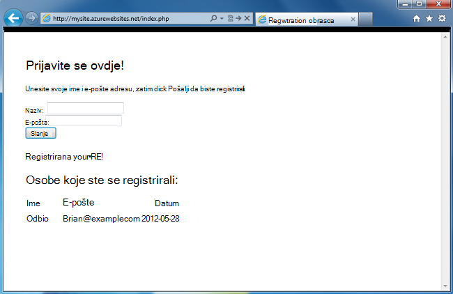
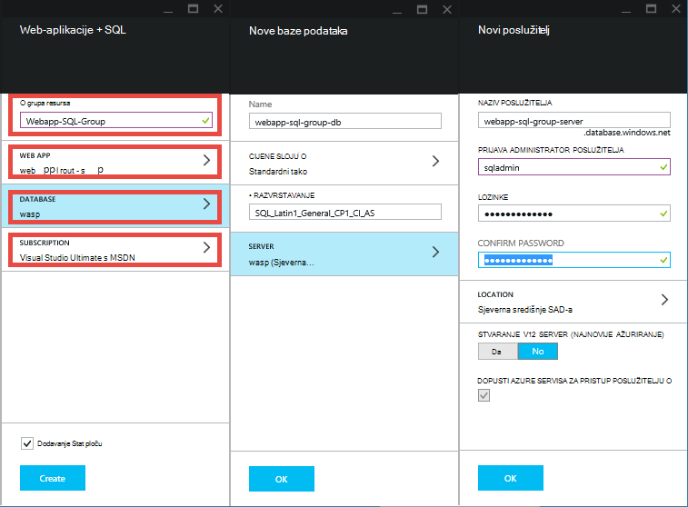
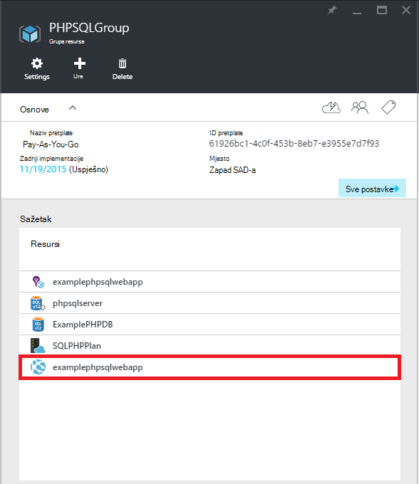
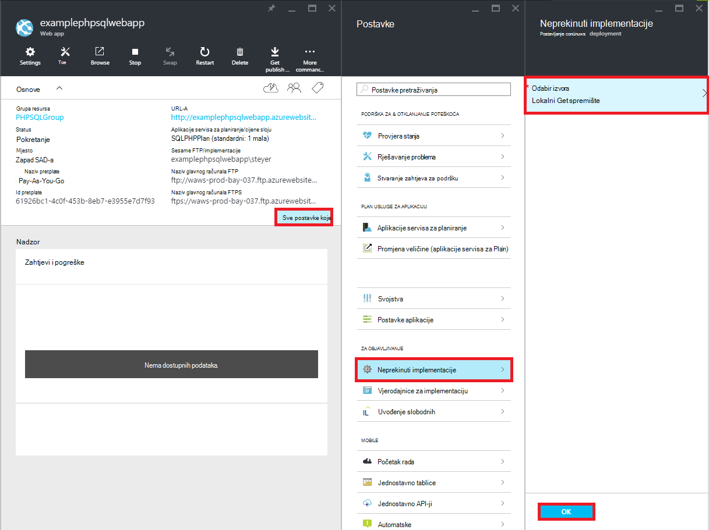
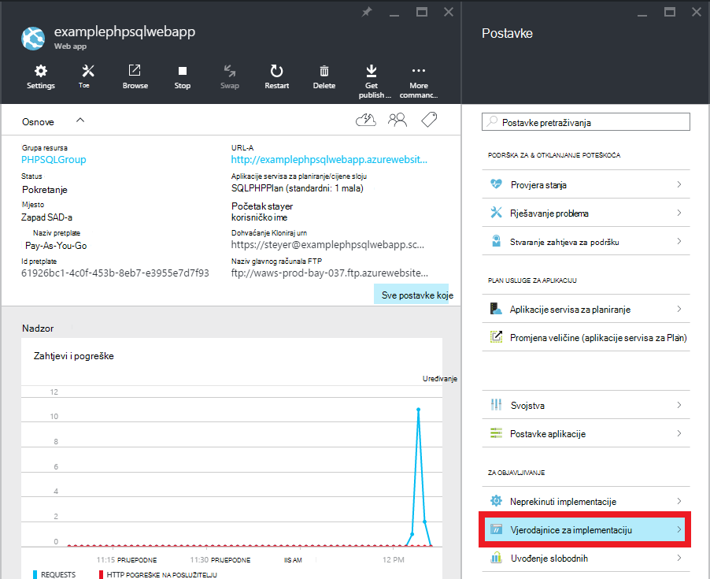
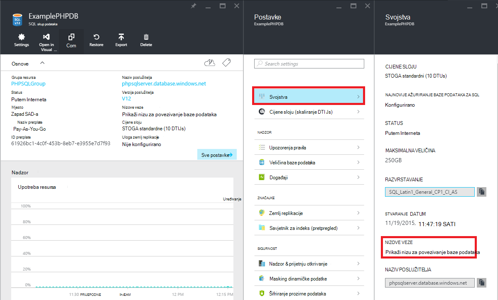

<properties 
    pageTitle="Stvaranje web-aplikacijama PHP SQL i implementacija Azure aplikacije servisa za korištenje brojka" 
    description="Praktični vodič koji pokazuje kako stvoriti i web-aplikacije koje se pohranjuju podaci u bazi podataka SQL Azure i koristiti brojka implementacije aplikacije servisa za Azure." 
    services="app-service\web, sql-database" 
    documentationCenter="php" 
    authors="rmcmurray" 
    manager="wpickett" 
    editor=""/>

<tags 
    ms.service="app-service-web" 
    ms.workload="web" 
    ms.tgt_pltfrm="na" 
    ms.devlang="PHP" 
    ms.topic="article" 
    ms.date="08/11/2016" 
    ms.author="robmcm"/>

# Stvaranje web-aplikacijama i SQL i implementacija Azure aplikacije servisa za korištenje brojka

Pomoću ovog praktičnog vodiča prikazuje kako stvoriti web-aplikacijama PHP [Aplikacije servisa za Azure](http://go.microsoft.com/fwlink/?LinkId=529714) koja se povezuje s bazom podataka SQL Azure i kako implementirati pomoću brojka. Pomoću ovog praktičnog vodiča pretpostavlja da imate [i][install-php], [SQL Server Express][install-SQLExpress], [Microsoft upravljačke programe za SQL Server za PHP](http://www.microsoft.com/download/en/details.aspx?id=20098)i [brojka] [ install-git] instaliran na vašem računalu. Nakon dovršetka ovaj vodič, imat ćete web-aplikacijama i SQL izvodi u Azure.

> [AZURE.NOTE]
> Možete instalirate i konfigurirate PHP, SQL Server Express i Microsoft Drivers za SQL Server za i pomoću [Instalacijskog programa sustava Microsoft Web platforme](http://www.microsoft.com/web/downloads/platform.aspx).

Saznat ćete:

* Upute za stvaranje Azure web-aplikaciju programa i SQL baze podataka pomoću [Portala za Azure](http://go.microsoft.com/fwlink/?LinkId=529715). Budući da i se po zadanom je omogućena u aplikaciju servisa web-aplikacijama, ništa posebno je potreban za pokretanje i kod.
* Upute za objavljivanje i ponovno objaviti aplikaciju Azure pomoću brojka.
 
Slijedeći ovog praktičnog vodiča će sastaviti jednostavne Registracija web-aplikaciju u PHP. Aplikacija će se nalaziti na web-mjestu servisa Azure. Snimka zaslona dovršene aplikacija je ispod:

[AZURE.INCLUDE [create-account-and-websites-note](../../includes/create-account-and-websites-note.md)]

>[AZURE.NOTE] Ako želite započeti s aplikacije servisa za Azure prije registracije za račun za Azure, idite na [Pokušajte aplikacije servisa](http://go.microsoft.com/fwlink/?LinkId=523751), gdje možete odmah stvoriti web-aplikacijama short-lived starter u aplikacije servisa. Nema kreditne kartice potrebna; Nema preuzete obveze.

##Stvaranje aplikacije za Azure web i postavljanje brojka objavljivanja

Slijedite ove korake da biste stvorili Azure web-aplikaciju programa i SQL baze podataka:

1. Prijavite se na [Portal za Azure](https://portal.azure.com/).

2. Otvori trgovine Windows Azure klikom na ikonu **Nova** u gornjem lijevom kutu nadzorne ploče, kliknite **Odaberi sve** pokraj Marketplace, a zatim odaberete **Web + Mobile**.
    
3. Na tržištu odaberite **Web + Mobile**.

4. Kliknite ikonu **Web app + SQL** .

5. Kad pročitate opis web-aplikacije + SQL aplikacije, odaberite **Stvori**.

6. Kliknite svaki dio (**Grupa resursa**, **Web-aplikacije**, **baze podataka**i **pretplate**) i unesite ili odaberite vrijednosti za obavezna polja:
    
    - Unesite naziv URL-a po izboru   
    - Konfiguriranje vjerodajnice za poslužitelj baze podataka
    - Odabir najbliže vam područja

    

7. Kada završite definiranje web-aplikaciju, kliknite **Stvori**.

    Prilikom stvaranja web-aplikaciji gumb **obavijesti** će flash zeleni **USPJEH** i otvaranje plohu grupu resursa da bi se prikazala web-aplikacije i SQL baze podataka u grupi.

4. Kliknite ikonu web-aplikaciju u grupi plohu resursa da biste otvorili plohu web-aplikaciji.

    

5. U odjeljku **Postavke** kliknite **Neprekinuto implementacija** > **Konfiguriraj potrebne postavke**. Odaberite **Lokalnom spremištu brojka** i kliknite **u redu**.

    

    Ako ste postavili spremište brojka prije, navedite korisničko ime i lozinku. Da biste to učinili, kliknite **Postavke** > **vjerodajnice za implementaciju** u web-aplikaciji plohu.

    

6. U odjeljku **Postavke** kliknite **Svojstva** da biste vidjeli URL daljinskog brojka trebate koristiti za implementaciju aplikacije i kasnije.

##Dohvati podatke o vezi SQL baze podataka

Da biste se povezali s instancom SQL baze podataka koja je povezana s web-aplikaciju programa, vaše će potrebne informacije veze koje ste naveli prilikom stvaranja baze podataka. Da biste dobili informacije o vezi SQL baze podataka, slijedite ove korake:

1. U grupi resursa plohu, kliknite ikonu baze podataka SQL.

2. U plohu SQL baze podataka, kliknite **Postavke** > **Svojstva**, zatim kliknite **Pokaži nizu za povezivanje baze podataka**. 

    
    
3. Iz odjeljka **i** dijaloški okvir dobivene zabilježite vrijednosti za `Server`, `SQL Database`, i `User Name`. Koristite ove vrijednosti kasnije Kada objavljujete web-aplikaciju programa i aplikacije servisa za Azure.

##Stvaranje i lokalno aplikacija za testiranje

Registracija aplikacije je jednostavno aplikacija i koja omogućuje vam da biste registrirali za događaj unosom adrese ime i e-pošte. Informacije o prethodno registrants prikazuju se u tablici. Informacije o registraciji pohranjuju u bazi podataka SQL instanci. Aplikacija sastoji se od dvije datoteke (kopirajte i zalijepite kod dostupna ispod):

* **index.php**: prikazuje obrazac za registraciju i tablice s podacima za registrant.
* **createtable.php**: Stvaranje tablice SQL baze podataka za aplikaciju. Datoteka će se koristiti samo jedanput.

Da biste pokrenuli aplikaciju lokalno, slijedite korake u nastavku. Imajte na umu sljedeće korake pretpostavlja PHP i SQL Server Express postavljanje na lokalno računalo, a koje ste omogućili [Ako je PDO proširenja za SQL Server][pdo-sqlsrv].

1. Stvaranje baze podataka SQL Server pod nazivom `registration`. To možete učiniti s na `sqlcmd` naredbeni redak s te naredbe:

        >sqlcmd -S localhost\sqlexpress -U <local user name> -P <local password>
        1> create database registration
        2> GO   

2. U korijenskom direktoriju aplikacije, stvaranje dva datotekama u njoj – jedan pod nazivom `createtable.php` i pod nazivom `index.php`.

3. Otvaranje u `createtable.php` datoteku u uređivaču teksta ili IDE i dodavanje koda u nastavku. Kod će se koristiti za stvaranje na `registration_tbl` tablice u na `registration` baze podataka.

        <?php
        // DB connection info
        $host = "localhost\sqlexpress";
        $user = "user name";
        $pwd = "password";
        $db = "registration";
        try{
            $conn = new PDO( "sqlsrv:Server= $host ; Database = $db ", $user, $pwd);
            $conn->setAttribute( PDO::ATTR_ERRMODE, PDO::ERRMODE_EXCEPTION );
            $sql = "CREATE TABLE registration_tbl(
            id INT NOT NULL IDENTITY(1,1) 
            PRIMARY KEY(id),
            name VARCHAR(30),
            email VARCHAR(30),
            date DATE)";
            $conn->query($sql);
        }
        catch(Exception $e){
            die(print_r($e));
        }
        echo "<h3>Table created.</h3>";
        ?>

    Imajte na umu da ćete morati ažurirati vrijednosti za <code>$user</code> i <code>$pwd</code> s lokalnom sustavu SQL Server korisničko ime i lozinku.

4. U terminal korijenskom direktoriju aplikacije upišite sljedeću naredbu:

        php -S localhost:8000

4. Otvorite web-preglednik i pronađite **http://localhost:8000/createtable.php**. Time ćete stvoriti na `registration_tbl` tablice u bazi podataka.

5. Otvorite **index.php** datoteku u uređivaču teksta ili IDE i dodajte osnovni HTML i CSS kod za stranicu (i kod dodat će se u koracima od noviji).

        <html>
        <head>
        <Title>Registration Form</Title>
        
        </head>
        <body>
        <h1>Register here!</h1>
        
Fill in your name and email address, then click <strong>Submit</strong> to register.

        <form method="post" action="index.php" enctype="multipart/form-data" >
              Name  <input type="text" name="name" id="name"/> 
              Email <input type="text" name="email" id="email"/> 
              <input type="submit" name="submit" value="Submit" />
        </form>
        <?php

        ?>
        </body>
        </html>

6. Unutar oznaka i dodavanje koda za PHP za povezivanje s bazom podataka.

        // DB connection info
        $host = "localhost\sqlexpress";
        $user = "user name";
        $pwd = "password";
        $db = "registration";
        // Connect to database.
        try {
            $conn = new PDO( "sqlsrv:Server= $host ; Database = $db ", $user, $pwd);
            $conn->setAttribute( PDO::ATTR_ERRMODE, PDO::ERRMODE_EXCEPTION );
        }
        catch(Exception $e){
            die(var_dump($e));
        }

    Ponovno će morati ažurirati vrijednosti za <code>$user</code> i <code>$pwd</code> s lokalnom MySQL korisničko ime i lozinku.

7. Sljedeći kod vezu baze podataka, dodavanje koda za umetanje informacije o registraciji u bazu podataka.

        if(!empty($_POST)) {
        try {
            $name = $_POST['name'];
            $email = $_POST['email'];
            $date = date("Y-m-d");
            // Insert data
            $sql_insert = "INSERT INTO registration_tbl (name, email, date) 
                           VALUES (?,?,?)";
            $stmt = $conn->prepare($sql_insert);
            $stmt->bindValue(1, $name);
            $stmt->bindValue(2, $email);
            $stmt->bindValue(3, $date);
            $stmt->execute();
        }
        catch(Exception $e) {
            die(var_dump($e));
        }
        echo "<h3>Your're registered!</h3>";
        }

8. Na kraju, slijedeći gore navedeni kod dodavanje koda za dohvaćanje podataka iz baze podataka.

        $sql_select = "SELECT * FROM registration_tbl";
        $stmt = $conn->query($sql_select);
        $registrants = $stmt->fetchAll(); 
        if(count($registrants) > 0) {
            echo "<h2>People who are registered:</h2>";
            echo "<table>";
            echo "<tr><th>Name</th>";
            echo "<th>Email</th>";
            echo "<th>Date</th></tr>";
            foreach($registrants as $registrant) {
                echo "<tr><td>".$registrant['name']."</td>";
                echo "<td>".$registrant['email']."</td>";
                echo "<td>".$registrant['date']."</td></tr>";
            }
            echo "</table>";
        } else {
            echo "<h3>No one is currently registered.</h3>";
        }

Sada možete pregledavati **http://localhost:8000/index.php** da biste testirali aplikacije.

##Objavljivanje aplikacija

Nakon što testirate aplikacije na lokalno, možete je objaviti na aplikaciju servisa web-aplikacije pomoću brojka. Međutim, najprije morate ažurirati podatke o vezi baze podataka u aplikaciji. Korištenje baze podataka podatke o vezi ste nabavili ranije (u odjeljku **informacije o vezi za dohvaćanje baze podataka SQL** ), ažurirajte sljedeće podatke u **i** na `createdatabase.php` i `index.php` datoteke s odgovarajuće vrijednosti:

    // DB connection info
    $host = "tcp:<value of Server>";
    $user = "<value of User Name>";
    $pwd = "<your password>";
    $db = "<value of SQL Database>";

> [AZURE.NOTE]
> U na <code>$host</code>, vrijednost poslužitelja mora prefiksom <code>tcp:</code>.

Sada ste spremni za postavljanje brojka objavljivanja i objavljivanje aplikacija.

> [AZURE.NOTE]
> To su iste korake navedene na kraju **Stvaranje Azure web-aplikaciju programa i postavljanje objavljivanja brojka** gornjem dijelu.

1. Otvorite GitBash (ili terminal, ako je brojka u vašem `PATH`), promijenite direktorija u korijenskom direktoriju aplikacije (imenik **Registracija** ) i izvršite sljedeće naredbe:

        git init
        git add .
        git commit -m "initial commit"
        git remote add azure [URL for remote repository]
        git push azure master

    Će se tražiti lozinku koju ste ranije stvorili.

2. Pronađite **name].azurewebsites.net/createtable.php http://[web aplikacije** da biste stvorili tablicu baze podataka SQL za aplikaciju.
3. Pronađite **name].azurewebsites.net/index.php http://[web aplikacije** da biste počeli koristiti aplikaciju.

Nakon što ste objavili aplikacije, možete započeti s promjenama i brojka koristite da biste objavili ih. 

##Objavite promjene u aplikaciji

Da biste objavili promjene aplikaciju, slijedite ove korake:

1. Unesite promjene u aplikaciji lokalno.
2. Otvorite GitBash (ili je terminal it brojka je u vašem `PATH`), promijenite direktorija u korijenskom direktoriju aplikacije i izvršite sljedeće naredbe:

        git add .
        git commit -m "comment describing changes"
        git push azure master

    Će se tražiti lozinku koju ste ranije stvorili.

3. Pronađite **name].azurewebsites.net/index.php http://[web aplikacije** da biste vidjeli promjene.

## Što se promijenilo
* Vodič za promjenu iz aplikacije servisa za web-mjestima potražite u članku: [aplikacije servisa za Azure i Its utjecaj na postojećim Azure servisima](http://go.microsoft.com/fwlink/?LinkId=529714)

[install-php]: http://www.php.net/manual/en/install.php
[install-SQLExpress]: http://www.microsoft.com/download/details.aspx?id=29062
[install-Drivers]: http://www.microsoft.com/download/details.aspx?id=20098
[install-git]: http://git-scm.com/
[pdo-sqlsrv]: http://php.net/pdo_sqlsrv
 
