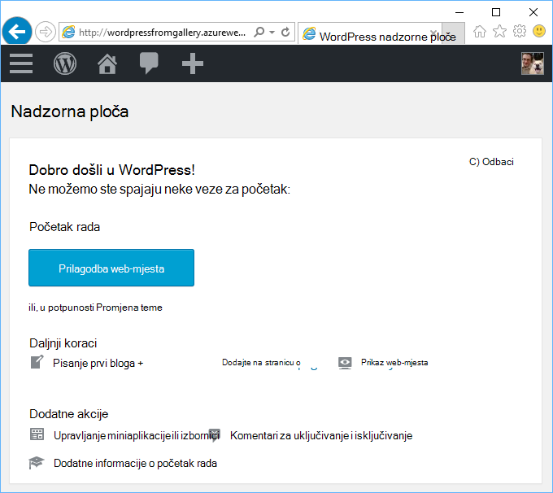
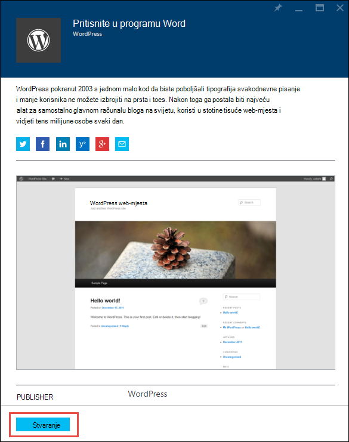
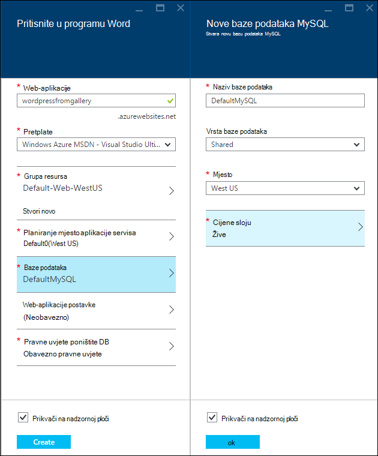
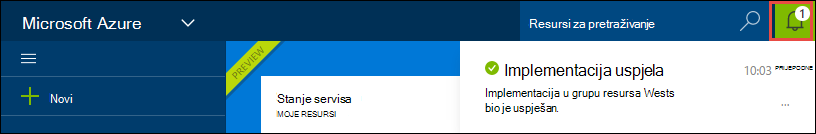
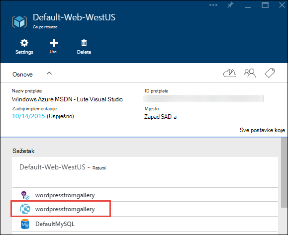
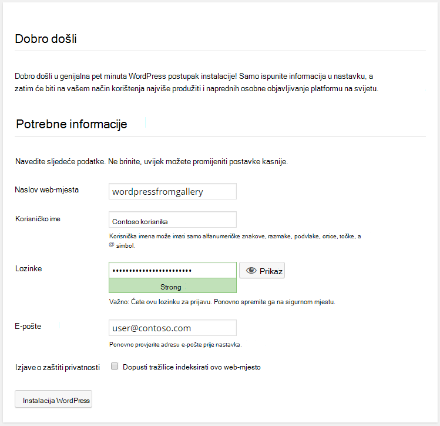

<properties
    pageTitle="Stvaranje web-aplikacijama WordPress u aplikacije servisa za Azure | Microsoft Azure"
    description="Saznajte kako stvoriti novi Azure web-aplikacijama za blog WordPress pomoću portala za Azure."
    services="app-service\web"
    documentationCenter="php"
    authors="rmcmurray"
    manager="wpickett"
    editor=""/>

<tags
    ms.service="app-service-web"
    ms.workload="na"
    ms.tgt_pltfrm="na"
    ms.devlang="PHP"
    ms.topic="hero-article"
    ms.date="08/11/2016"
    ms.author="robmcm"/>

# Stvaranje web-aplikacijama WordPress u aplikacije servisa za Azure

[AZURE.INCLUDE [tabs](../../includes/app-service-web-get-started-nav-tabs.md)]

Pomoću ovog praktičnog vodiča prikazuje kako implementirati na WordPress blog web-mjesto iz trgovine Azure Marketplace.

Kada završite s vodič imat ćete sami WordPress blog web-mjesto prema gore i pokretanje u oblaku.

Ćete saznati:

* Kako pronaći predložak za aplikacije u trgovine Windows Azure.
* Upute za stvaranje web-aplikacijama u aplikacije servisa Azure koji se temelji na predlošku.
* Upute za konfiguriranje postavki aplikacije servisa za Azure za novu web-aplikaciju i baza podataka.

Trgovina Azure postaje dostupan širok raspon popularnih web-aplikacije razvio Microsoft, tvrtke trećih strana, a zatim Otvori izvor softver inicijative. Web-aplikacije su programirane na brojne popularne okviri, kao što je [i](/develop/nodejs/) u ovom WordPress primjer, [.NET](/develop/net/), [Node.js](/develop/nodejs/), [jezika Java](/develop/java/)i [Python](/develop/python/), nekoliko. Da biste stvorili web-aplikacijama iz trgovine Azure samo softver potreban je web-pregledniku koji koristite za [Azure Portal](https://portal.azure.com/). 

Web-mjesto WordPress koje implementacije u ovom ćete praktičnom vodiču koristi MySQL za bazu podataka. Želite li umjesto toga koristite SQL baze podataka za bazu podataka, potražite u članku [Nami projekta](http://projectnami.org/). **Project Nami** je dostupan putem trgovine.

> [AZURE.NOTE]
> Da biste dovršili ovaj Praktični vodič, morate račun sustava Microsoft Azure. Ako nemate račun, možete ga [aktivirati svoje prednosti pretplatnika Visual Studio](/pricing/member-offers/msdn-benefits-details/?WT.mc_id=A261C142F) ili [prijavite se za besplatnu probnu verziju](/en-us/pricing/free-trial/?WT.mc_id=A261C142F).
>
> Ako želite započeti s aplikacije servisa za Azure prije registracije za račun za Azure, idite na [Pokušajte aplikacije servisa](http://go.microsoft.com/fwlink/?LinkId=523751). Postoji, možete odmah stvoriti web-aplikacijama short-lived starter u aplikacije servisa za – bez kreditne kartice potrebna i bez preuzete obveze.

## Odaberite WordPress i konfigurirati za aplikacije servisa za Azure

1. Prijavite se na [Portal za Azure](https://portal.azure.com/).

2. Kliknite **Novo**.
    
    ![Stvori novo][5]
    
3. Traženje **WordPress**, a zatim kliknite **WordPress**. Ako želite koristiti SQL baze podataka umjesto MySQL potražiti **Nami projekta**.

    ![WordPress s popisa][7]
    
5. Kad pročitate opis WordPress aplikaciju, kliknite **Stvori**.

    

4. Unesite naziv za web-aplikacije u okvir **Web app** .

    Taj naziv mora biti jedinstvena u domeni azurewebsites.net jer URL web-aplikaciji bit će {name}. azurewebsites.net. Ako ne naziv unesite jedinstveni, pojavljuje se crveni uskličnik u tekstni okvir.

8. Ako imate više pretplata, odaberite onaj koji želite koristiti. 

5. Odaberite **Grupu resursa** ili stvorite novi.

    Dodatne informacije o grupama resursa potražite u članku [Pregled upravljanja resursima Azure](../azure-resource-manager/resource-group-overview.md).

5. Odaberite **Plan mjesto aplikacije servisa** ili stvorite novi.

    Dodatne informacije o tarifama za aplikacije servisa za potražite u članku [Pregled tarife aplikacije servisa za Azure](../azure-web-sites-web-hosting-plans-in-depth-overview.md) 

7. Kliknite **bazu podataka**, a zatim u **Nove baze podataka MySQL** plohu unesite tražene vrijednosti za konfiguriranje baze podataka MySQL.

    na. Unesite novi naziv ili ostavite zadani naziv.

    b. Ostavite **Vrsta baze podataka** postavljena na **zajedničko korištenje**.

    c. Odaberite na isto mjesto u onu koju odaberete za web-aplikacije.

    d. Odaberite sloj cijene. Žive (besplatno s minimalnim dopuštene veze i prostor na disku) je u redu za ovog praktičnog vodiča.

8. U plohu **Nove baze podataka MySQL** kliknite **u redu**. 

8. U plohu **WordPress** prihvatili uvjete za pravne, a zatim kliknite **Stvori**. 

    

    Aplikacije servisa za Azure stvara web-aplikaciji obično manje od minute. U tijeku možete pogledati tako da kliknete ikonu zvona pri vrhu stranice portala.

    

## Pokretanje i upravljanje web-aplikaciju programa WordPress
    
7. Po završetku web app stvaranje idite na portalu Azure grupi resursa u kojem je stvorena aplikacija, a vidjet ćete web-aplikacije i baze podataka.

    Dodatni resurs ikonom pronađen je [Uvida aplikacije](/services/application-insights/), koji omogućuje nadzor servise za web-aplikacije.

1. U plohu **grupa resursa** kliknite redak web app.

    

2. U aplikaciji plohu Web kliknite **Pregledaj**.

    ![URL web-mjesta][browse]

3. Na stranici WordPress **dobrodošlice** unesite podatke o konfiguraciji potrebnih WordPress, a zatim **Instalirati WordPress**.

    

4. Prijavite se pomoću vjerodajnica koje ste stvorili na stranici **dobrodošlice** .  

5. Otvorit će se stranica nadzorne ploče na web-mjesta.    

    

## Daljnji koraci

Ste vidjeti kako stvoriti i implementirati PHP web-aplikacijama iz galerije. Dodatne informacije o korištenju PHP u Azure potražite u članku [Razvojni centar za PHP](/develop/php/).

Dodatne informacije o radu s web-aplikacije servisa za aplikacije potražite putem veza na lijevoj strani stranice (za široki preglednika windows) ili pri vrhu stranice (za windows usko preglednika). 

## Što se promijenilo
* Vodič za promjenu iz aplikacije servisa za web-mjestima, potražite u članku [aplikacije servisa za Azure i njegov utjecaj na postojećim Azure servisima](http://go.microsoft.com/fwlink/?LinkId=529714).

[5]: ./media/web-sites-php-web-site-gallery/startmarketplace.png
[7]: ./media/web-sites-php-web-site-gallery/search-web-app.png
[browse]: ./media/web-sites-php-web-site-gallery/browse-web.png
