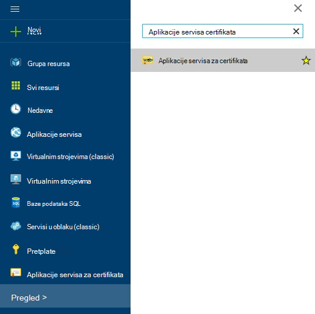
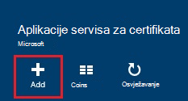
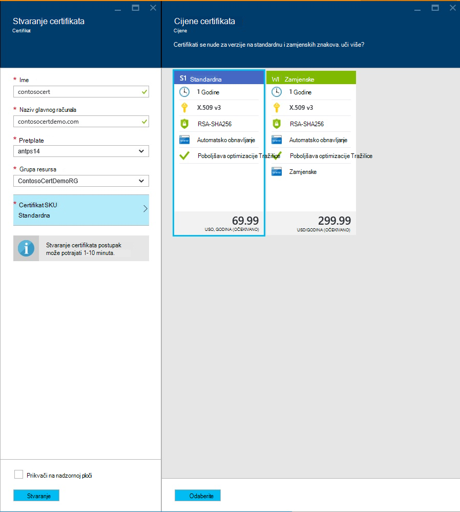
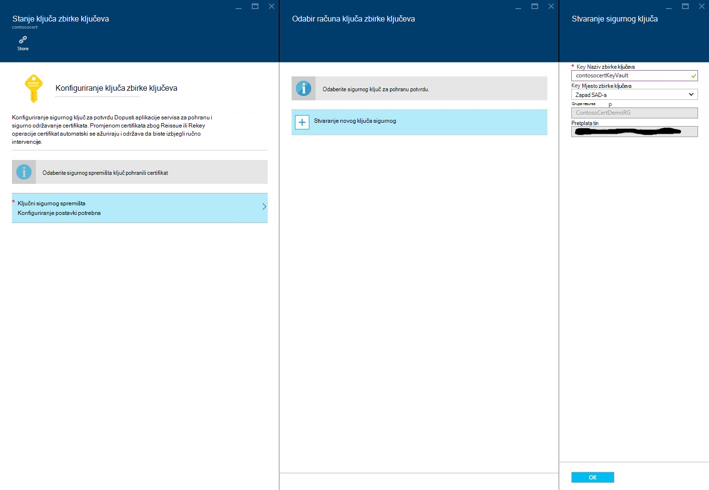
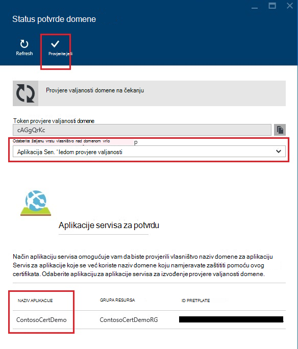
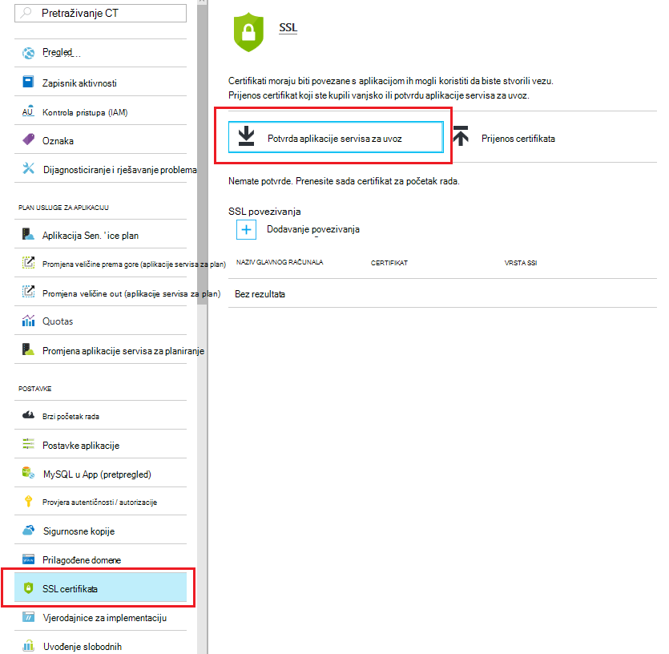
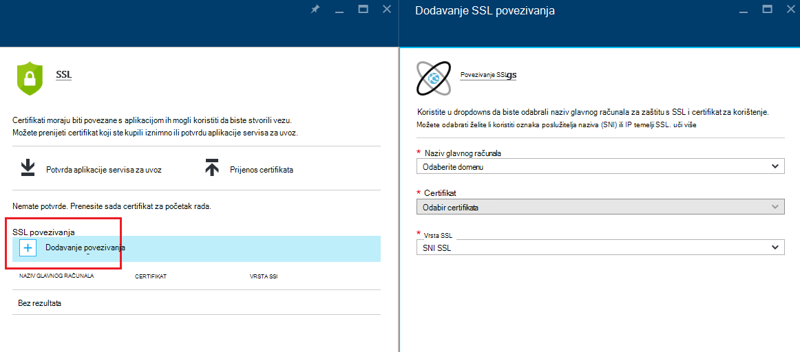
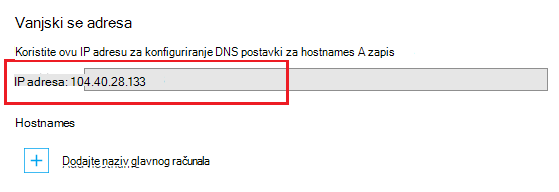
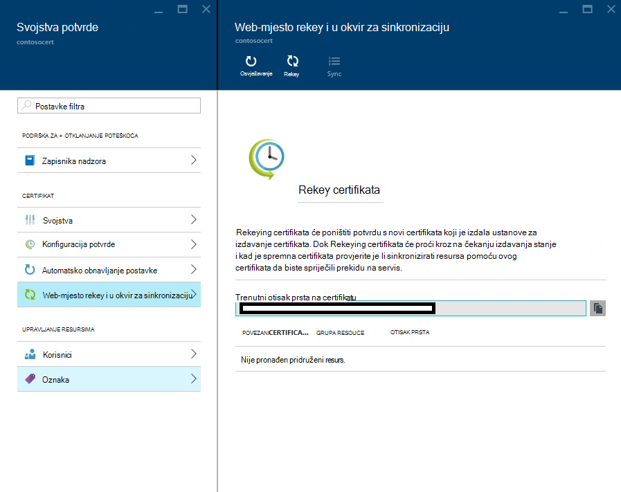

<properties
    pageTitle="Kupite i konfiguriranje SSL certifikata aplikacije servisa za Azure"
    description="Saznajte kako kupiti i konfiguriranje SSL certifikata za Azure aplikacije servisa."
    services="app-service"
    documentationCenter=".net"
    authors="apurvajo"
    manager="stefsch"
    editor="cephalin"
    tags="buy-ssl-certificates"/>

<tags
    ms.service="app-service"
    ms.workload="na"
    ms.tgt_pltfrm="na"
    ms.devlang="na"
    ms.topic="article"
    ms.date="09/19/2016"
    ms.author="apurvajo"/>

#Kupite i konfiguriranje SSL certifikata aplikacije servisa za Azure

> [AZURE.SELECTOR]
- [Kupnja SSL certifikata u Azure](web-sites-purchase-ssl-web-site.md)
- [Korištenje SSL certifikata s drugih mjesta](web-sites-configure-ssl-certificate.md)

Prema zadanim postavkama **[Aplikacije servisa za Azure](http://go.microsoft.com/fwlink/?LinkId=529714)** već omogućuje HTTPS za web-aplikacije pomoću zamjenskih certifikata za na *. azurewebsites.net domene. Ako ne namjeravate konfiguriranje prilagođene domene, možete pogodnost zadanu HTTPS potvrdu. Međutim, kao što su sve * [zamjenskih domena](https://casecurity.org/2014/02/26/pros-and-cons-of-single-domain-multi-domain-and-wildcard-certificates)nije kao pomoću prilagođene domene na vlastiti certifikat. Aplikacije servisa za Azure sada omogućuje zaista pojednostavljeni način za kupnju i upravljanje SSL certifikata izravno iz Azure Portal ne napuštajući portalu.  
U ovom se članku objašnjava kako kupiti i konfiguriranje SSL certifikata za **[Aplikacije servisa za Azure](http://go.microsoft.com/fwlink/?LinkId=529714)** 3 jednostavnih koraka. 

> [AZURE.NOTE]
> SSL certifikata za prilagođeni nazivi domena nije moguće koristiti uz slobodno i zajednički se koristi web app. Morate konfigurirati web aplikacije za Basic, standardni prikaz ili Premium načinu rada, što može promijeniti koliko se naplatiti za vašu pretplatu. Dodatne informacije potražite u članku **[Pojedinosti cijene za Web Apps](https://azure.microsoft.com/pricing/details/web-sites/)** .

##Pregled
> [AZURE.NOTE]
> Ne pokušajte kupiti SSL certifikata koristite pretplatu na koji imaju aktivni kreditnoj kartici pridružen. To može rezultirati pretplate onemogućenom. 

##<a>Kupiti, spremanje i dodjeljivanje SSL certifikata za prilagođenu domenu</a>
Da biste omogućili HTTPS za prilagođenu domenu, kao što je contoso.com, prvo morate ** [Konfiguriranje prilagođenog naziva domene u aplikacije servisa za Azure.](web-sites-custom-domain-name.md)**

Prije nego što traži SSL certifikata, prvo morate odrediti koji nazivi domena će biti osigurava certifikata. Time ćete odrediti vrstu certifikata morate nabaviti. Ako samo želite sigurne naziv jednog domene kao što je contoso.com ili www.contoso.com Standardno (osnovni) certifikat nije dovoljno. Ako vam je potrebna sigurne više naziva domene, primjerice www.contoso.com, contoso.com a mail.contoso.com pa možete dobiti ** [zamjenskih certifikata](http://en.wikipedia.org/wiki/Wildcard_certificate)**

##Korak 0: Narudžbu SSL certifikata

U ovom ćete koraku će Saznajte kako naručiti SSL certifikata po izboru.

1.  **[Portal za Azure](https://portal.azure.com/)**kliknite pregledajte i traka za pretraživanje upišite "Aplikacije servisa certifikati" i odaberite "Aplikacije servisa certifikati" rezultat i kliknite Dodaj. 

    

    

2.  Unesite **neslužbeni naziv** SSL certifikata.

3.  Unesite **naziv glavnog računala**
> [AZURE.NOTE]
    To je jedan od najvažnija dijelova postupka kupnje. Provjerite jeste li unijeli točan naziv glavnog računala (prilagođenu domenu) koji želite zaštititi pomoću ovog certifikata. **Ne** možete dodati naziv glavnog računala s "www". Ako, na primjer, ako prilagođeni naziv domene je www.contoso.com, zatim samo u polje Naziv glavnog računala unesite contoso.com, certifikat u pitanju ćete zaštititi "www" i korijenske domene. 
    
4.  Odaberite **pretplatu**. 

    Ako imate više pretplata, zatim pripazite da biste stvorili SSL certifikata u okviru iste pretplate koji ste koristili za svoju prilagođenu domenu ili web-aplikacije u pitanju.
       
5.  Odaberite ili stvorite **grupu resursa**.

    Grupa resursa omogućuju upravljanje povezane Azure resurse kao jedinica i su korisne prilikom uspostave na temelju uloga pristup pravilima kontrole (RBAC) za aplikacije. Dodatne informacije potražite u članku Upravljanje Azure resurse.
     
6.  Odaberite **certifikat SKU** 

    Na kraju, odaberite certifikat SKU koji odgovara vašim potrebama i kliknite Stvori. Danas, aplikacije servisa za Azure omogućuje dvije različite SKU-ove • S1 – standardni certifikat s valjanost 1 godina i automatsko obnavljanje za kupnju  
           • W1 – zamjenske certifikat 1 godina valjanost i automatsko obnavljanje      
    Dodatne informacije potražite u članku **[Pojedinosti cijene za Web Apps](https://azure.microsoft.com/pricing/details/web-sites/)** .

> [AZURE.NOTE]
> Stvaranje SSL certifikat bilo gdje će potrajati od 1 – 10 minuta. Ovaj postupak izvodi više koraka u pozadini koje su u suprotnom vrlo naporan za izvođenje ručno.  

##Korak 1: Pohranjuje certifikat u sigurnog ključ Azure

U ovom ćete koraku će Saznajte kako postaviti u spremištu SSL certifikat koji ste kupili Azure ključ sigurnog po izboru.

1.  Kada dovršite kupnju SSL certifikat morat ćete otvoriti ručno **Aplikacije servisa certifikati** resursa plohu pregledavanjem da biste ga ponovno (pročitajte članak korak 1 iznad)   

    

    Uočit ćete stanje potvrde da je **"na čekanju izdavanja"** kao što su nekoliko dodatni koraci koje morate poduzeti prije no što počnete pomoću ovog certifikata.
 
2. Kliknite na **"konfiguracija potvrde"** unutar plohu svojstva certifikat, a zatim kliknite **"korak 1: pohrana"** za pohranu ovog certifikata u sigurnog ključ Azure.

3.  Kliknite plohu **"ključ sigurnog Status"** na **"ključ sigurnog spremišta"** da biste odabrali postojeći sigurnog ključ za pohranu ovog certifikata **ili "Stvaranje novog ključa sigurnog"** da biste stvorili novi ključ sigurnog unutar iste grupe pretplatu i resursa.
 
    
 
    > [AZURE.NOTE]
    Azure sigurnog ključ ima vrlo minimalne troškove za pohranu ovog certifikata. Dodatne informacije potražite u članku **[Azure ključ sigurnog cijene pojedinosti](https://azure.microsoft.com/pricing/details/key-vault/)** .

4. Kada odaberete sigurnog spremišta ključ za pohranu ovog certifikata u, nastaviti i spremite ga klikom na gumb **"Spremanje"** pri vrhu plohu **"ključ sigurnog Status"** .  

    To potrebno dovršiti korak za pohranu certifikata koje ste kupili s Azure ključ sigurnog po izboru. Nakon osvježavanja u plohu, trebali biste vidjeti zeleno provjerite označavanje u odnosu na ovaj korak.
    
##Korak 2: Provjerite vlasništvo nad domenom

U ovom ćete koraku ćete naučiti za potvrdu vlasništva domene SSL certifikat koji se nalazi samo reda za. 

1.  Kliknite na **"korak 2: Provjerite je li"** koraka iz plohu **"Konfiguracija potvrde"** . Postoje 4 vrste domene potvrdu podržava aplikacije servisa certifikata.

    * **Aplikacije servisa za potvrdu** 
    
        * Ovo je postupak najpraktičnija ako već imate **prilagođenu domenu dodijeljene servisa aplikacija.** Ta metoda prikazat će se popis out sve u servisa aplikacija koje zadovoljavaju ovaj kriterij. 
           Ako, na primjer, u tom slučaju **contosocertdemo.com** je prilagođenu domenu dodijeljene aplikacije servisa aplikacija pod nazivom **"ContosoCertDemo"** i zato koji je nalaziti samo aplikacija za aplikaciju servisa. Ako nema više područja implementaciju, a zatim ga želite popis svih preko područja.
        
           Način provjere je samo za nabavu standardni certifikat (osnovni). Za certifikate zamjenske preskočiti i postavite mogućnost B, C i D u nastavku.
        * Kliknite gumb **"Provjeri"** da biste dovršili ovaj korak.
        * Kliknite **"Osvježi"** da biste ažurirali stanje potvrde po dovršetku provjere valjanosti. Može potrajati nekoliko minuta za potvrdu da biste dovršili.
        
             

    * **Provjera domene** 

        * Ovo je postupak najpraktičnija **samo ako** imate **[kupili prilagođenu domenu iz aplikacije servisa za Azure.](custom-dns-web-site-buydomains-web-app.md)**
        
        * Kliknite gumb **"Provjeri"** da biste dovršili ovaj korak.
        
        * Kliknite **"Osvježi"** da biste ažurirali stanje potvrde po dovršetku provjere valjanosti. Može potrajati nekoliko minuta za potvrdu da biste dovršili.

    * **Provjera pošte**
        
        * Provjere e-pošte već je poslana na adrese poruke e-pošte povezane s ovom prilagođenu domenu.
         
        * Otvorite e-pošte i kliknite na vezu za potvrdu da biste dovršili korak provjere e-pošte. 
        
        * Ako je potrebno ponovno provjere e-pošte, kliknite gumb **"ponovno slanje e-pošte"** .
         
    * **Ručna provjera**    
                 
        1. **Provjera HTML web-stranice**
        
            * Stvaranje HTML datoteku pod nazivom **{Domene potvrdu tokena}**.html (možete kopirati tokena iz on domene Provjera stanja plohu)
            
            * Sadržaj datoteke mora biti točan isti naziv **Domene potvrdu tokena**.
            
            * Prenesite datoteku u korijenu web-poslužitelj hostiranje vaše domene.
            
            * Kliknite **"Osvježi"** da biste ažurirali stanje potvrde po dovršetku provjere valjanosti. Može potrajati nekoliko minuta za potvrdu da biste dovršili.
            
            Ako, na primjer, ako su kupnjom standardni certifikat za contosocertdemo.com s domene potvrdu tokena **'cAGgQrKc'** web-zahtjeva pokušaj **'http://contosocertdemo.com/cAGgQrKc.html'** treba vratite **cAGgQrKc.**
        2. **Provjera DNS TXT zapisa**

            * Korištenje upravitelju DNS-a stvorite TXT zapis na **'DZC'** poddomenu s vrijednošću jednako na **domene potvrdu tokena.**
            
            * Kliknite **"Osvježi"** da biste ažurirali stanje potvrde po dovršetku provjere valjanosti. Može potrajati nekoliko minuta za potvrdu da biste dovršili.
                              
            Na primjer, da bi se izvođenje provjere valjanosti za potvrdu zamjenskih znakova s naziv glavnog računala ** \*. contosocertdemo.com** ili ** \*. subdomain.contosocertdemo.com** i **cAGgQrKc**tokena provjere domene, morate stvoriti TXT zapis na dzc.contosocertdemo.com vrijednošću **cAGgQrKc.**     

##Korak 3: Dodijeliti certifikat aplikacije servisa za aplikaciju

U ovom ćete koraku će Saznajte kako dodijeliti upravo kupili certifikata radi vaše aplikacije servisa aplikacija. 

> [AZURE.NOTE]
> Prije izvođenja korake u ovom odjeljku, morate imate pridružene prilagođenog naziva domene s aplikacijom. Dodatne informacije potražite u članku ** [Konfiguriranje prilagođenog naziva domene za web app.](web-sites-custom-domain-name.md)**

1.  U pregledniku otvorite na ** [Azure Portal.](https://portal.azure.com/)**
2.  Kliknite mogućnost **Aplikacije servisa** na lijevoj strani stranice.
3.  Kliknite naziv aplikacije u koju želite dodijeliti ovog certifikata. 
4.  U odjeljku **Postavke**kliknite **SSL certifikata**
5.  Kliknite **Uvoz aplikacije servisa certifikat** , a zatim odaberite certifikat koji ste upravo kupili

    

6. U **ssl povezivanja** sekcije klikom na **Dodaj povezivanja**
7. Na plohu **Dodavanje SSL povezivanje** pomoću na dropdowns odaberite naziv domene za zaštitu s SSL i certifikat za korištenje. Možete odabrati želite li koristiti **[Oznaka poslužitelja naziva (SNI)](http://en.wikipedia.org/wiki/Server_Name_Indication)** ili IP temelji SSL.

    

       •    IP based SSL associates a certificate with a domain name by mapping the dedicated public IP address of the server to the domain name. This requires each domain name (contoso.com, fabricam.com, etc.) associated with your service to have a dedicated IP address. This is the traditional          method of associating SSL certificates with a web server.
       •    SNI based SSL is an extension to SSL and **[Transport Layer Security](http://en.wikipedia.org/wiki/Transport_Layer_Security)** (TLS) that allows multiple domains to share the same IP address, with separate security certificates for each domain. Most modern browsers (including Internet Explorer, Chrome, Firefox and Opera) support SNI, however older browsers may not support SNI. For more information on SNI, see the **[Server Name Indication](http://en.wikipedia.org/wiki/Server_Name_Indication)** article on Wikipedia.
       
7. Kliknite **Dodavanje povezivanje** da biste spremili promjene i Omogući SSL.

Ako ste odabrali **IP temelji SSL** i prilagođene domene je konfiguriran pomoću A zapis, morate izvršiti sljedeće dodatne korake:

* Nakon što ste konfigurirali IP temelji SSL uvez, rezervirana IP adresa vam je dodijeljen aplikacije. Na stranici **prilagođene domene** u odjeljku postavke aplikacije, izravno iznad **Hostnames** sekcije možete pronaći ovu IP adresu. On će biti naveden kao **Vanjski IP adresa**
    
    

    Imajte na umu da ova IP adresa biti razlikuje se od virtualna IP adresa koristili da biste konfigurirali A zapis za svoju domenu. Ako su konfigurirana za korištenje SNI temelji SSL ili nije konfiguriran za korištenje SSL, adrese će se prikazati za tu stavku.
    
2. Pomoću alata za koje ste dobili od registrara naziva domene, izmijenite A zapisa za prilagođeni naziv domene da upućuje se s IP adresom u prethodnom koraku.
U ovom trenutku trebali posjetite aplikacije pomoću HTTPS:// umjesto HTTP:// da biste potvrdili da potvrda pravilno konfigurirana.

##Rekey i sinkronizirati certifikata

1. Ako je to potrebno Rekey certifikata pa jednostavno sigurnosnih vam razloga odaberite mogućnost **"Rekey i Sinkroniziraj"** s **"Svojstva potvrde"** plohu. 

2. Kliknite gumb **"Rekey"** da biste započeli postupak. Taj postupak može potrajati 1-10 minuta. 

    

3. Rekeying certifikata će poništiti potvrdu s novi certifikata koji je izdala ustanove za izdavanje certifikata.
4. Će ne naplaćuje za Rekeying za vrijeme trajanja certifikata. 
5. Rekeying certifikata će proći kroz stanje izdavanja na čekanju. 
6. Kad je spremna certifikata provjerite je li sinkronizirati resursa pomoću ovog certifikata da biste spriječili prekidu servis.
7. Mogućnost sinkronizacije nije dostupna za certifikate koji još nisu dodijeljeni Web App. 

## Dodatni resursi ##
- [Omogućivanje HTTPS za aplikaciju u aplikacije servisa za Azure](web-sites-configure-ssl-certificate.md)
- [Kupite i konfiguriranje prilagođenog naziva domene u aplikacije servisa za Azure](custom-dns-web-site-buydomains-web-app.md)
- [Centar za pouzdanost Microsoft Azure](/support/trust-center/security/)
- [Konfiguracija mogućnosti otključana u Azure web-mjesta](http://azure.microsoft.com/blog/2014/01/28/more-to-explore-configuration-options-unlocked-in-windows-azure-web-sites/)
- [Portal za upravljanje Azure](https://manage.windowsazure.com)

>[AZURE.NOTE] Ako želite započeti s aplikacije servisa za Azure prije registracije za račun za Azure, idite na [Pokušajte aplikacije servisa](http://go.microsoft.com/fwlink/?LinkId=523751), gdje možete odmah stvoriti web-aplikacijama short-lived starter u aplikacije servisa. Nema kreditne kartice potrebna; Nema preuzete obveze.

