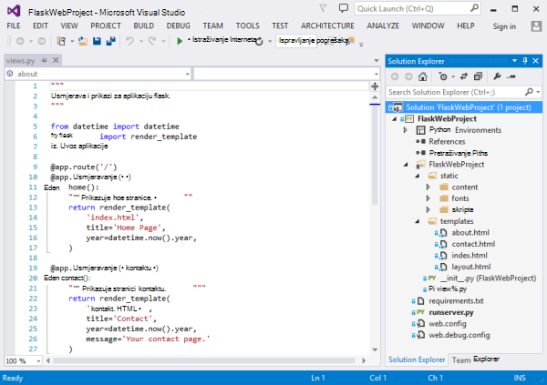
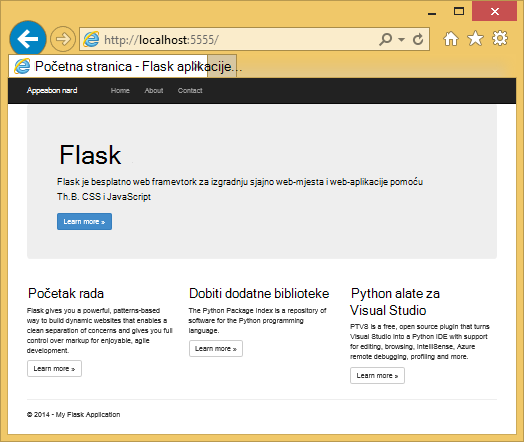
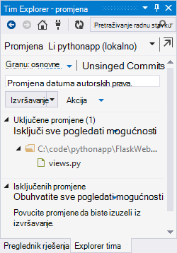
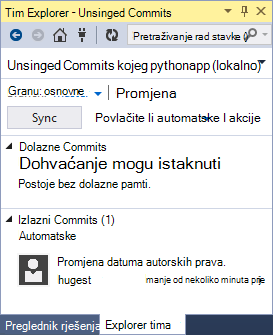
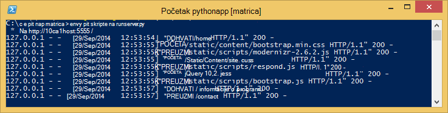
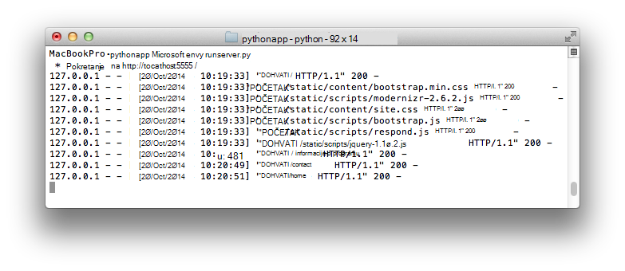
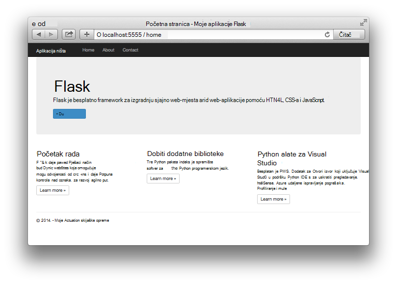

<properties 
    pageTitle="Stvaranje web-aplikacije pomoću Flask servisu Azure" 
    description="Praktični vodič koji predstavljaju web-aplikacijama Python sustavom Azure." 
    services="app-service\web" 
    documentationCenter="python"
    tags="python"
    authors="huguesv" 
    manager="wpickett" 
    editor=""/>

<tags 
    ms.service="app-service-web" 
    ms.workload="web" 
    ms.tgt_pltfrm="na" 
    ms.devlang="python" 
    ms.topic="article" 
    ms.date="02/20/2016"
    ms.author="huvalo"/>

# Stvaranje web-aplikacije pomoću Flask servisu Azure

Pomoću ovog praktičnog vodiča opisuje način za početak rada pokrenut Python u [Azure aplikacije servisa web-aplikacijama](http://go.microsoft.com/fwlink/?LinkId=529714).  Web Apps nudi ograničeni besplatan hosting i brzog uvođenja i koristite Python!  Kao što je rastom aplikacije koje možete prijeći u plaćenu hosting, a možete integrirati i sa svim ostalim servisima Azure.

Stvorite aplikacije korištenjem Flask web framework (pogledajte zamjenske verzije ovog praktičnog vodiča za [Django](web-sites-python-create-deploy-django-app.md) i [boca](web-sites-python-create-deploy-bottle-app.md)).  Će stvoriti web-mjesta iz galerije Azure, postavite brojka implementacije i Kloniraj lokalno spremište.  Zatim će pokrenuti aplikaciju lokalno, unesite promjene, izvršavanje i automatske ih Azure.  Vodič prikazuje kako to učiniti sa sustavom Windows ili Mac i Linux.

[AZURE.INCLUDE [create-account-and-websites-note](../../includes/create-account-and-websites-note.md)]

>[AZURE.NOTE] Ako želite započeti s aplikacije servisa za Azure prije registracije za račun za Azure, idite na [Pokušajte aplikacije servisa](http://go.microsoft.com/fwlink/?LinkId=523751), gdje možete odmah stvoriti web-aplikacijama short-lived starter u aplikacije servisa. Nema kreditne kartice potrebna; Nema preuzete obveze.

## Preduvjeti

- Windows, Mac i Linux
- Python 2.7 ili 3.4
- setuptools točaka, virtualenv (samo za Python 2.7)
- Brojka
- [Python alate za Visual Studio][] (PTVS) - Imajte na umu: Ovo nije obavezno

**Napomena**: objavljivanje TFS trenutno nije podržano za projekte Python.

### Windows

Ako već nemate Python 2.7 ili 3.4 instaliranih (32-bitni), preporučujemo da instalirate [Azure SDK Python 2.7] ili [Azure SDK Python 3.4] pomoću Installer platformu za Web.  Time se instalira 32-bitnu verziju sustava Python, setuptools, točaka, virtualenv itd (32-bitni Python je što je instalirano na Azure glavnog računala).  Osim toga, možete dobiti Python od [python.org].

Brojka, preporučujemo [Brojka za Windows] ili [GitHub za Windows].  Ako koristite Visual Studio, možete koristiti integrirani brojka podrška.

Preporučujemo i instalacije [Python 2.2 Alati za Visual Studio].  Ovo nije obavezno, ali ako imate [Visual Studio], uključujući besplatne Visual Studio zajednice 2013 ili Visual Studio Express 2013 za web-mjesto, zatim imat ćete sjajno Python IDE.

### Mac i Linux

Trebali biste imati Python i brojka već instaliran, no pripazite da imate Python 2.7 ili 3.4.

## Stvaranje web-aplikacije na portalu za Azure

Prvi korak pri stvaranju aplikacije je da biste stvorili web-aplikaciju putem [Portala za Azure](https://portal.azure.com). 

1. Prijavite se na Azure Portal, a zatim kliknite gumb **NOVO** u donjem lijevom kutu. 
2. Kliknite **Web + Mobile**.
3. U okvir za pretraživanje upišite "python".
4. U rezultatima pretraživanja odaberite **Flask**, a zatim kliknite **Stvori**.
5. Konfiguriranje nove aplikacije Flask, kao što su stvaranje nove aplikacije servisa za planiranje i novu grupu resursa za njega. Nakon toga kliknite **Stvori**.
6. Konfiguriranje brojka objavljivanjem za novostvorenom web-aplikaciju programa slijedeći upute u [Lokalnoj implementaciji brojka za aplikacije servisa za Azure](app-service-deploy-local-git.md).

## Pregled aplikacija

### Brojka spremište sadržaja

Slijedi pregled datoteka pronaći ćete u spremištu za početne brojka koje ćemo ćete Kloniraj u sljedećem odjeljku.

    \FlaskWebProject\__init__.py
    \FlaskWebProject\views.py
    \FlaskWebProject\static\content\
    \FlaskWebProject\static\fonts\
    \FlaskWebProject\static\scripts\
    \FlaskWebProject\templates\about.html
    \FlaskWebProject\templates\contact.html
    \FlaskWebProject\templates\index.html
    \FlaskWebProject\templates\layout.html

Glavni izvori za aplikaciju.  Sastoji se od 3 stranice (indeks o kontaktu) s izgled matrice.  Statički sadržaj i skripte obuhvaćaju samopokretanja programa, jquery, modernizr i odgovor.

    \runserver.py

Podrška za razvoj lokalnog poslužitelja. Ta postavka omogućuje lokalno pokrenite aplikaciju.

    \FlaskWebProject.pyproj
    \FlaskWebProject.sln

Datoteke projekta za korištenje alata za [Python za Visual Studio].

    \ptvs_virtualenv_proxy.py

Proxy IIS virtualne okruženjima i PTVS udaljene podrška za ispravljanje pogrešaka.

    \requirements.txt

Vanjski paketa potrebne za ovu aplikaciju. Implementacijsku skriptu će pip instalacija pakete na popisu u ovoj datoteci.
 
    \web.2.7.config
    \web.3.4.config

IIS konfiguracijske datoteke.  Implementacijsku skriptu će koristiti odgovarajući web.x.y.config i kopirati kao web.config.

### Neobavezni datoteke - prilagodbu implementacije

[AZURE.INCLUDE [web-sites-python-customizing-deployment](../../includes/web-sites-python-customizing-deployment.md)]

### Neobavezni datoteke - Python izvođenja

[AZURE.INCLUDE [web-sites-python-customizing-runtime](../../includes/web-sites-python-customizing-runtime.md)]

### Dodatne datoteke na poslužitelju

Neke datoteke postoji na poslužitelju, ali se dodaju u spremište brojka.  Ovo je stvorio implementacijsku skriptu.

    \web.config

Konfiguracijska datoteka IIS.  Stvorene iz web.x.y.config u svakoj implementaciji.

    \env\

Python okruženje virtualne.  Ako kompatibilne okruženje virtualne još ne postoji na aplikaciju, stvara tijekom implementacije.  Paketi naveden u requirements.txt su točaka instaliran, ali točaka preskočiti instalacije ako već su instalirane pakete.

Sljedeća 3 odjeljcima objašnjeno kako nastaviti s web-aplikacije razvoju pod različitim okruženjima 3:

- Windows, pomoću alata za Python za Visual Studio
- Windows i naredbenog retka
- Mac i Linux s naredbenog retka

## Razvoj aplikacija za web - Windows – Python Tools za Visual Studio

### Kloniraj spremište

Najprije Kloniraj spremište pomoću portala za Azure navedeni URL. Dodatne informacije potražite u članku [Lokalne implementacije brojka aplikacije servisa za Azure](app-service-deploy-local-git.md).

Otvorite datoteku rješenja (.sln) koji se isporučuje u korijenskom direktoriju spremište.

### Stvaranje virtualne okruženje

Sada ćemo stvoriti okruženje virtualne za lokalni razvoj.  Desnom tipkom miša kliknite **Python okruženja** odaberite **Dodavanje virtualne okruženje...**.

- Provjerite je li naziv okruženje `env`.

- Odaberite osnovni tumačenja.  Provjerite je li koristiti istu verziju Python koji je odabran za web-aplikacije (u runtime.txt ili plohu **Postavke aplikacije** web-aplikacije na portalu za Azure).

- Provjerite je li uključena mogućnost da biste preuzeli i instalirali paketa.

Kliknite **Stvori**.  To će stvoriti okruženje virtualne i instalirajte ovisnosti requirements.txt na popisu.

### Pokretanje pomoću poslužitelja za razvoj

Pritisnite F5 da biste pokrenuli ispravljanje pogrešaka i web-pregledniku otvorit će automatski stranice koji se izvodi lokalno.

Možete postaviti prekidne točke u izvora, koristite nadzorni windows itd.  [Python alate za Visual Studio dokumentaciju] za dodatne informacije potražite na razne značajke.

### Unesite promjene

Sada možete isprobati promjenom aplikacije izvora i/ili predlošci.

Nakon što ste testirali promjene, izvršavanje ih u spremište brojka:

### Instaliranje više paketa

Program možda ovisnosti izvan Python i Flask.

Možete instalirati dodatne paketa pomoću točaka.  Da biste instalirali paket, desnom tipkom miša kliknite okruženje virtualne i odaberite **Instalacija Python paketa**.

Na primjer, da biste instalirali Azure SDK za Python, koji omogućuje pristup Azure prostora za pohranu, bus servisa i drugih servisa za Azure, unesite `azure`:

Desnom tipkom miša kliknite virtualne okruženja, a zatim odaberite **Generiraj requirements.txt** da biste ažurirali requirements.txt.

Nakon toga pohranite promjene requirements.txt brojka spremištu.

### Implementacija Azure

Da biste pokrenuli implementacije, kliknite **Sinkroniziraj** ili **Proslijedi**.  Sinkroniziranje ne na automatske i na povlačite.

Prve implementacije će potrajati neko vrijeme, kao što je stvorit će okruženje virtualne, instalaciju paketa itd.

Visual Studio ne prikazuje napredak implementacije.  Ako želite da pregledate rezultat, u odjeljku [Otklanjanje poteškoća – implementacije](#troubleshooting-deployment).

Pronađite Azure URL-a da biste vidjeli promjene.

## Web-aplikacije razvoj – Windows – naredbenog retka

### Kloniraj spremište

Najprije Kloniraj spremište pomoću URL-a na portalu Azure i dodajte Azure spremište kao u alat za analizu daljinske. Dodatne informacije potražite u članku [Lokalne implementacije brojka aplikacije servisa za Azure](app-service-deploy-local-git.md).

    git clone <repo-url>
    cd <repo-folder>
    git remote add azure <repo-url> 

### Stvaranje virtualne okruženje

Ne možemo ćete stvoriti novo okruženje virtualne svrhe razvoj (ne ga dodati u spremištu).  Virtualna okruženja u Python nisu relocatable, tako da svaki za razvojne inženjere radi na aplikaciju će stvoriti vlastite lokalno.

Provjerite je li koristiti istu verziju Python koji je odabran za web-aplikacije (u runtime.txt ili plohu **Postavke aplikacije** web-aplikacije na portalu za Azure).

Za Python 2.7:

    c:\python27\python.exe -m virtualenv env

Za Python 3.4:

    c:\python34\python.exe -m venv env

Instalacija svih vanjskih paketa potrebnih aplikacije. Datoteka requirements.txt korijenu spremište možete koristiti da biste instalirali pakete u okruženju sustava virtualne:

    env\scripts\pip install -r requirements.txt

### Pokretanje pomoću poslužitelja za razvoj

Možete pokrenuti aplikaciju u odjeljku poslužitelj za razvoj pomoću sljedeće naredbe:

    env\scripts\python runserver.py

Na konzoli prikazat će se URL-a i priključak poslužitelja očekuje podatke za:

Zatim otvorite web-preglednik te URL-a.

### Unesite promjene

Sada možete isprobati promjenom aplikacije izvora i/ili predlošci.

Nakon što ste testirali promjene, izvršavanje ih u spremište brojka:

    git add <modified-file>
    git commit -m "<commit-comment>"

### Instaliranje više paketa

Program možda ovisnosti izvan Python i Flask.

Možete instalirati dodatne paketa pomoću točaka.  Na primjer, da biste instalirali Azure SDK za Python, koji omogućuje pristup Azure prostora za pohranu, bus servisa i drugih servisa za Azure, upišite:

    env\scripts\pip install azure

Provjerite je li ažurirati requirements.txt:

    env\scripts\pip freeze > requirements.txt

Zapiši promjene:

    git add requirements.txt
    git commit -m "Added azure package"

### Implementacija Azure

Da biste pokrenuli implementacije, automatske promjene za Azure:

    git push azure master

Prikazat će se rezultat implementacijsku skriptu, uključujući okruženje virtualne stvaranja, instalaciju paketa, stvaranje web.config.

Pronađite Azure URL-a da biste vidjeli promjene.

## Web-aplikacije razvoj – Mac i Linux - naredbenog retka

### Kloniraj spremište

Najprije Kloniraj spremište pomoću URL-a na portalu Azure i dodajte Azure spremište kao u alat za analizu daljinske. Dodatne informacije potražite u članku [Lokalne implementacije brojka aplikacije servisa za Azure](app-service-deploy-local-git.md).

    git clone <repo-url>
    cd <repo-folder>
    git remote add azure <repo-url> 

### Stvaranje virtualne okruženje

Ne možemo ćete stvoriti novo okruženje virtualne svrhe razvoj (ne ga dodati u spremištu).  Virtualna okruženja u Python nisu relocatable, tako da svaki za razvojne inženjere radi na aplikaciju će stvoriti vlastite lokalno.

Provjerite je li koristiti istu verziju Python koji je odabran za web-aplikacije (u runtime.txt ili plohu **Postavke aplikacije** web-aplikacije na portalu za Azure).

Za Python 2.7:

    python -m virtualenv env

Za Python 3.4:

    python -m venv env
ili pyvenv env

Instalacija svih vanjskih paketa potrebnih aplikacije. Datoteka requirements.txt korijenu spremište možete koristiti da biste instalirali pakete u okruženju sustava virtualne:

    env/bin/pip install -r requirements.txt

### Pokretanje pomoću poslužitelja za razvoj

Možete pokrenuti aplikaciju u odjeljku poslužitelj za razvoj pomoću sljedeće naredbe:

    env/bin/python runserver.py

Na konzoli prikazat će se URL-a i priključak poslužitelja očekuje podatke za:

Zatim otvorite web-preglednik te URL-a.

### Unesite promjene

Sada možete isprobati promjenom aplikacije izvora i/ili predlošci.

Nakon što ste testirali promjene, izvršavanje ih u spremište brojka:

    git add <modified-file>
    git commit -m "<commit-comment>"

### Instaliranje više paketa

Program možda ovisnosti izvan Python i Flask.

Možete instalirati dodatne paketa pomoću točaka.  Na primjer, da biste instalirali Azure SDK za Python, koji omogućuje pristup Azure prostora za pohranu, bus servisa i drugih servisa za Azure, upišite:

    env/bin/pip install azure

Provjerite je li ažurirati requirements.txt:

    env/bin/pip freeze > requirements.txt

Zapiši promjene:

    git add requirements.txt
    git commit -m "Added azure package"

### Implementacija Azure

Da biste pokrenuli implementacije, automatske promjene za Azure:

    git push azure master

Prikazat će se rezultat implementacijsku skriptu, uključujući okruženje virtualne stvaranja, instalaciju paketa, stvaranje web.config.

Pronađite Azure URL-a da biste vidjeli promjene.

## Otklanjanje poteškoća – instalaciju paketa

[AZURE.INCLUDE [web-sites-python-troubleshooting-package-installation](../../includes/web-sites-python-troubleshooting-package-installation.md)]

## Otklanjanje poteškoća – virtualne okruženje

[AZURE.INCLUDE [web-sites-python-troubleshooting-virtual-environment](../../includes/web-sites-python-troubleshooting-virtual-environment.md)]

## Daljnji koraci

Slijedite ove veze da biste saznali više o Flask i Python Alati za Visual Studio: 
 
- [Dokumentacija flask]
- [Alati za Python dokumentacije Visual Studio]

Informacije o korištenju spremište tablica Azure i MongoDB:

- [Flask i MongoDB na Azure pomoću alata za Python za Visual Studio]
- [Flask i spremište tablica platforme Azure na Azure pomoću alata za Python za Visual Studio]

Dodatne informacije potražite u odjeljku [Razvojni centar za Python](/develop/python/).

## Što se promijenilo
* Vodič za promjenu iz aplikacije servisa za web-mjestima potražite u članku: [aplikacije servisa za Azure i Its utjecaj na postojećim Azure servisima](http://go.microsoft.com/fwlink/?LinkId=529714)

<!--Link references-->
[Flask i MongoDB na Azure pomoću alata za Python za Visual Studio]: https://github.com/microsoft/ptvs/wiki/Flask-and-MongoDB-on-Azure
[Flask i spremište tablica platforme Azure na Azure pomoću alata za Python za Visual Studio]: web-sites-python-ptvs-flask-table-storage.md

<!--External Link references-->
[Azure SDK Python 2.7]: http://go.microsoft.com/fwlink/?linkid=254281
[Azure SDK Python 3.4]: http://go.microsoft.com/fwlink/?linkid=516990
[Python.org]: http://www.python.org/
[Brojka za Windows]: http://msysgit.github.io/
[GitHub za Windows]: https://windows.github.com/
[Python alate za Visual Studio]: http://aka.ms/ptvs
[Python 2.2 Tools za Visual Studio]: http://go.microsoft.com/fwlink/?LinkID=624025
[Visual Studio]: http://www.visualstudio.com/
[Alati za Python dokumentacije Visual Studio]: http://aka.ms/ptvsdocs
[Dokumentacija flask]: http://flask.pocoo.org/ 
 
