<properties 
    pageTitle="Boca i spremište tablica platforme Azure na Azure pomoću alata za Python 2.2 za Visual Studio" 
    description="Saznajte kako pomoću alata Python za Visual Studio stvaranje boca aplikacije koje se sprema podatke u spremište tablica Azure i implementacija web-aplikaciju na Azure aplikacije servisa web-aplikacije." 
    services="app-service\web" 
    documentationCenter="python" 
    authors="huguesv" 
    manager="wpickett" 
    editor=""/>

<tags 
    ms.service="app-service-web" 
    ms.workload="web" 
    ms.tgt_pltfrm="na" 
    ms.devlang="python" 
    ms.topic="article" 
    ms.date="07/07/2016"
    ms.author="huvalo"/>

# Boca i spremište tablica platforme Azure na Azure pomoću alata za Python 2.2 za Visual Studio 

U ovom ćete praktičnom vodiču ćemo pomoću [Python alate za Visual Studio] Stvaranje jednostavne ankete web-aplikacijama pomoću jednog od PTVS Ogledni predlošci. Pomoću ovog praktičnog vodiča i nije dostupan kao [videozapisa](https://www.youtube.com/watch?v=GJXDGaEPy94).

Web-aplikaciji ankete definira programa apstrakcije za njegov spremište tako da se jednostavno možete se prebacivati između različitih vrsta spremišta (u memoriji, Azure spremište tablica, MongoDB).

Ne možemo ćete saznati kako stvoriti račun za Azure prostora za pohranu, kako konfigurirati web-aplikaciju za korištenje spremišta tablica Azure i kako objaviti web-aplikaciju na [Azure aplikacije servisa web-aplikacije](http://go.microsoft.com/fwlink/?LinkId=529714).

Potražite [Python Razvojni centar] za dodatnih članaka koji pokrivaju razvoja Azure aplikacije servisa web-aplikacije s PTVS web okviri boce, Flask i Django pomoću MongoDB, Azure spremište tablica, MySQL i SQL baze podataka usluge. Dok je u ovom članku fokus je na aplikacije servisa, koraci su slične prilikom razvoja [Azure servise u Oblaku].

## Preduvjeti

 - Visual Studio 2015.
 - [Python 2.2 Tools za Visual Studio]
 - [Python 2.2 Tools za Visual Studio uzoraka VSIX]
 - [Alati za Azure SDK za dodavanje veze za VANJSKIH 2015.]
 - [Python 2.7 32-bitnu] ili [Python 3.4 32-bitne]

[AZURE.INCLUDE [create-account-and-websites-note](../../includes/create-account-and-websites-note.md)]

>[AZURE.NOTE] Ako želite započeti s aplikacije servisa za Azure prije registracije za račun za Azure, idite na [Pokušajte aplikacije servisa](http://go.microsoft.com/fwlink/?LinkId=523751), gdje možete odmah stvoriti web-aplikacijama short-lived starter u aplikacije servisa. Nema kreditne kartice potrebna; Nema preuzete obveze.

## Stvaranje projekta

U ovom ćete odjeljku smo stvorit ćete Visual Studio projektu pomoću predloška uzorka. Ne možemo ćete stvoriti okruženje virtualne i instalirajte potrebne paketa. Zatim možemo pokrenuti aplikaciju koja lokalno koristi spremište u memoriji zadani.

1.  U Visual Studio, odaberite **datoteku**, **Novi projekt**.

1.  Predlošci projekta iz [Python 2.2 Alati za Visual Studio uzoraka VSIX] su odjeljcima **Python**, **uzorka**. Odaberite **Ankete boce Web projekta** , a zatim kliknite u redu da biste stvorili projekta.

    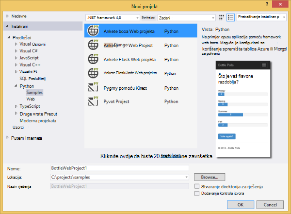

1.  Zatražit će se za instaliranje vanjskih paketa. Odaberite **Instalacija u okruženje virtualne**.

    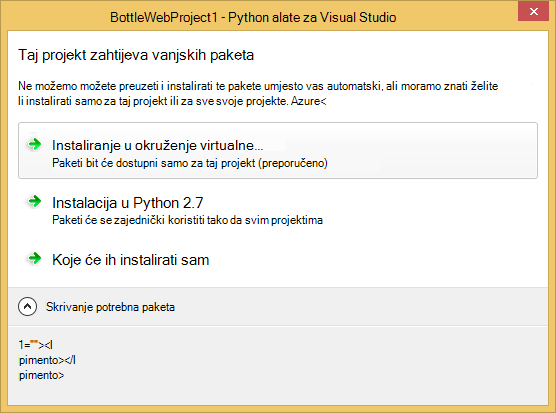

1.  Odaberite **Python 2.7** ili **Python 3.4** kao osnovni tumačenja.

    

1.  Provjerite funkcionira li se aplikacija pritiskom na tipku `F5`. Prema zadanim postavkama, aplikacija koristi se u memoriji spremište koja ne zahtijeva sve konfiguracije. Web-poslužitelj je zaustavljena se gube sve podatke.

1.  Kliknite **Stvaranje ankete uzorka**, a zatim kliknite na ankete i glasovanja.

    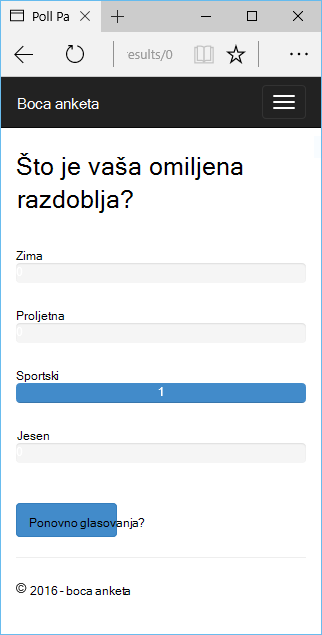

## Stvorite račun za Azure prostora za pohranu

Da biste koristili operacije prostora za pohranu, potreban vam je račun za Azure prostora za pohranu. Možete stvoriti račun za pohranu slijedeći ove korake.

1.  Prijava na [Portal za Azure](https://portal.azure.com/).

1. Kliknite ikonu **Novo** u gornjem lijevom kutu portalu zatim **podataka + prostor za pohranu** > **Računa za pohranu**.  Kliknite gumb **Stvori** , dajte jedinstven naziv računa za pohranu i stvorite novu [grupu resursa](../azure-resource-manager/resource-group-overview.md) za njega.

    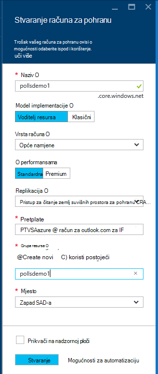

    Prilikom stvaranja računa za pohranu gumb **obavijesti** će flash zeleni **USPJEH** i račun za pohranu plohu otvoren da bi se prikazala pripada li u novu grupu resursa koji ste stvorili.

1. Kliknite dio **pristupnih tipki** u račun za pohranu plohu. Uzeti u obzir naziv računa i ključ1.

    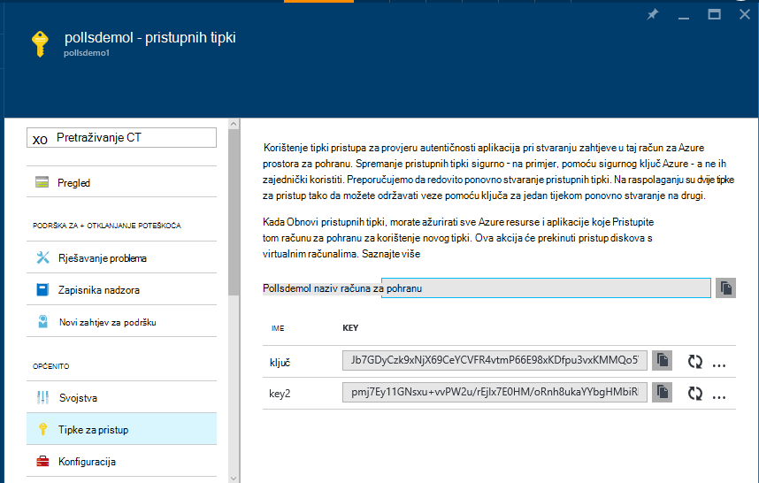

    Ne možemo će vam informacije biti potrebne da biste konfigurirali projekta u sljedećem odjeljku.

## Konfiguriranje projekta

U ovom ćete odjeljku smo ćete konfigurirati naš aplikaciju koju želite koristiti za pohranu računa smo upravo stvorili. Zatim ćemo ćete pokrenuti aplikaciju lokalno.

1.  U Visual Studio, desnom tipkom miša kliknite na vaše čvor projekta u programu Explorer rješenja, a zatim odaberite **Svojstva**. Kliknite karticu **za ispravljanje pogrešaka** .

    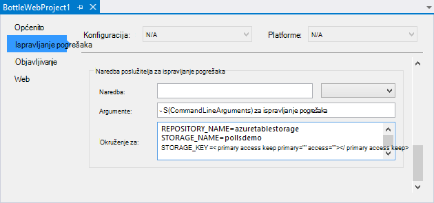

1.  Postavite vrijednosti varijable okruženja potrebnih aplikacije u **Naredba poslužitelja za ispravljanje pogrešaka u** **okruženju**.

        REPOSITORY_NAME=azuretablestorage
        STORAGE_NAME=<storage account name>
        STORAGE_KEY=<primary access key>

    Time ćete postaviti varijable okruženja kada ste **Pokrenuli ispravljanje pogrešaka**. Ako želite da se varijable da biste postavili kada **Pokrenuti bez pogrešaka**, postavite iste vrijednosti u odjeljku **Pokretanje naredba poslužitelja** kao i.

    Osim toga, možete definirati varijable okruženja pomoću upravljačke ploče sustava Windows. Ovo je bolje mogućnost ako želite da biste izbjegli pohrana vjerodajnica u izvorni kod / datoteke projekta. Imajte na umu da ćete morati ponovno pokrenuti Visual Studio za nove vrijednosti okruženje da bi bio dostupan za aplikaciju.

1.  Kod koji implementira spremište Azure spremište tablica se **models/azuretablestorage.py**. Potražite u [dokumentaciji] za dodatne informacije o korištenju servisa Python tablice.

1.  Pokrenite aplikaciju s `F5`. Ankete koje su stvorene pomoću **Stvaranje ankete uzorak** i podataka poslao glasovanje će se serijalizirati u spremište tablica Azure.

    > [AZURE.NOTE] Python okruženje virtualne 2.7 može uzrokovati do iznimke prekida u Visual Studio.  Pritisnite `F5` da biste nastavili učitavanje projekta web. 

1.  Dođite na stranicu **o** da biste potvrdili da aplikacija koristi spremište **Azure spremište tablica** .

    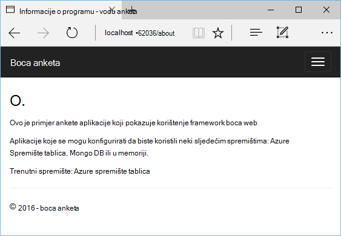

## Istražite spremište tablica platforme Azure

Prikaz i uređivanje prostora za pohranu tablica pomoću programa Explorer oblak u Visual Studio jednostavno je. U ovom odjeljku ćemo koristiti Server Explorer da biste pogledali sadržaj tablice aplikacije ankete.

> [AZURE.NOTE] To potreban je Microsoft Azure Alati za instalaciju, koje su dostupne u sklopu [Azure SDK za .NET].

1.  Otvorite **Eksplorer za oblaka**. Proširite **Račune za pohranu**, s računom za pohranu, zatim **tablica**.

    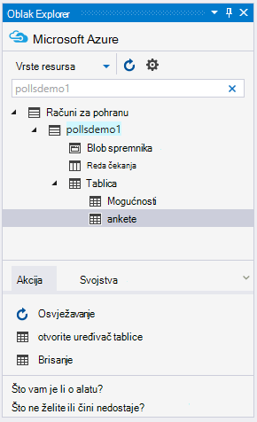

1.  Dvokliknite tablicu **ankete** ili **Mogućnosti** da biste pogledali sadržaj tablice u prozoru dokumenta, kao i entiteti Dodaj/Ukloni/uređivanje.

    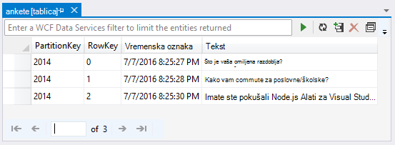

## Objavljivanje web-aplikaciju u aplikacije servisa za Azure

Azure .NET SDK omogućuje jednostavnu implementacija web-aplikaciju programa aplikacije servisa za Azure.

1.  U **Pregledniku rješenja**, desnom tipkom miša kliknite čvor projekta i odaberite **Objavi**.

    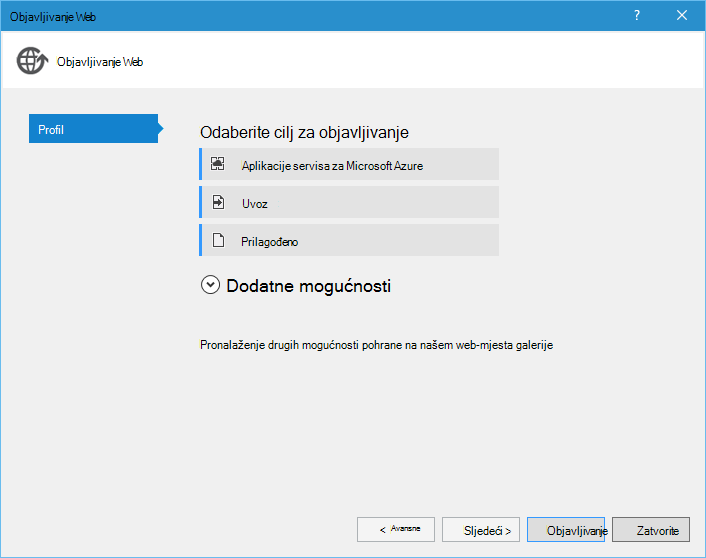

1.  Kliknite **web-aplikacije Microsoft Azure**.

1.  Kliknite **Novo** da biste stvorili novu web-aplikaciju.

1.  Popunite sljedeća polja pa kliknite **Stvori**.
    -   **Naziv aplikacije na web-mjesta**
    -   **Aplikacije servisa za planiranje**
    -   **Grupa resursa**
    -   **Regija**
    -   Ostavite **poslužitelj baze podataka** **nijedna baza podataka**

1.  Prihvati sve druge zadane vrijednosti, a zatim kliknite **Objavi**.

1.  Web-pregledniku otvorit će automatski objavljenu web-aplikaciji. Ako dođete na o stranica, prikazat će se tako da koristi spremište **U memoriji** , ne spremište **Azure spremište tablica** .

    To je zato varijable okruženja nisu postavljena na instancu web-aplikacije u Azure aplikacije servisa tako da koristi zadane vrijednosti navedene u **settings.py**.

## Konfiguracija instancu web-aplikacije

U ovom ćete odjeljku smo ćete konfigurirati varijable okruženja za instancu web-aplikacije.

1.  [Portal za Azure]plohu web-aplikaciju da biste otvorili, **Pronađite** > **Aplikacije servisa** > naziva web app.

1.  U plohu web app, kliknite **Sve postavke**, a zatim kliknite **Postavke aplikacije**.

1.  Pomaknite se prema dolje do odjeljka **postavki aplikacije** i postavljanje vrijednosti za **spremište\_naziv**, **prostora za POHRANU\_naziv** i **prostora za POHRANU\_KLJUČ** opisan u prethodnom odjeljku **Konfiguriranje projekta** .

    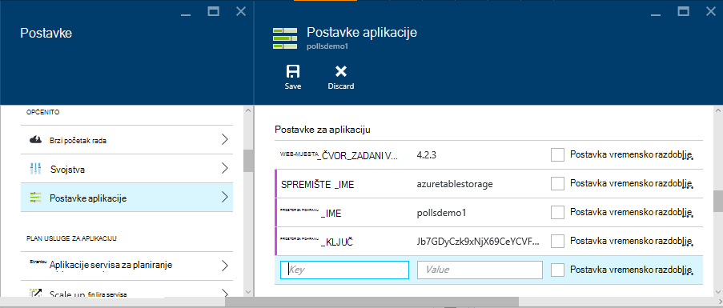

1.  Kliknite **Spremi**. Kada primite obavijesti o promjenama zatvorena, kliknite **Pregledaj** iz glavnog plohu za Web app.

1.  Trebali biste vidjeti web-aplikaciji funkcioniraju kako želite, pomoću spremište **Azure spremište tablica** .

    Čestitamo!

    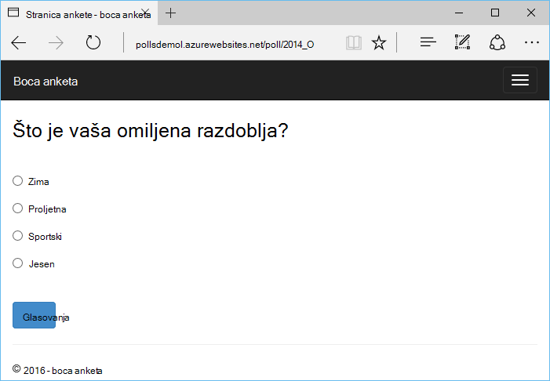

## Daljnji koraci

Slijedite ove veze da biste saznali više o alatima Python za Visual Studio, boca i Azure spremište tablica.

- [Alati za Python dokumentacije Visual Studio]
  - [Projekti web]
  - [Oblak servisa projekata]
  - [Daljinsko uklanjanje programskih pogrešaka na Microsoft Azure]
- [Dokumentacija boce]
- [Azure prostora za pohranu]
- [Azure SDK Python]
- [Kako koristiti za pohranu servisa tablice Python]

## Što se promijenilo
* Vodič za promjenu iz aplikacije servisa za web-mjestima potražite u članku: [aplikacije servisa za Azure i Its utjecaj na postojećim Azure servisima](http://go.microsoft.com/fwlink/?LinkId=529714)

<!--Link references-->
[Razvojni centar za Python]: /develop/python/
[Servisi u Oblaku za Azure]: ../cloud-services-python-ptvs.md
[Dokumentacija]: ../storage-python-how-to-use-table-storage.md
[Kako koristiti za pohranu servisa tablice Python]: ../storage-python-how-to-use-table-storage.md

<!--External Link references-->
[Portal za Azure]: https://portal.azure.com
[Azure SDK za .NET]: http://azure.microsoft.com/downloads/
[Python alate za Visual Studio]: http://aka.ms/ptvs
[Python 2.2 Tools za Visual Studio]: http://go.microsoft.com/fwlink/?LinkId=624025
[Python 2.2 Tools za Visual Studio uzoraka VSIX]: http://go.microsoft.com/fwlink/?LinkId=624025
[Alati za Azure SDK za dodavanje veze za VANJSKIH 2015.]: http://go.microsoft.com/fwlink/?LinkId=518003
[Python 2.7 32-bitne]: http://go.microsoft.com/fwlink/?LinkId=517190 
[Python 3.4 32-bitne]: http://go.microsoft.com/fwlink/?LinkId=517191
[Alati za Python dokumentacije Visual Studio]: http://aka.ms/ptvsdocs
[Dokumentacija boce]: http://bottlepy.org/docs/dev/index.html
[Daljinsko uklanjanje programskih pogrešaka na Microsoft Azure]: http://go.microsoft.com/fwlink/?LinkId=624026
[Web projektima]: http://go.microsoft.com/fwlink/?LinkId=624027
[Oblak servisa projektima]: http://go.microsoft.com/fwlink/?LinkId=624028
[Azure prostora za pohranu]: http://azure.microsoft.com/documentation/services/storage/
[Azure SDK Python]: https://github.com/Azure/azure-sdk-for-python
 
