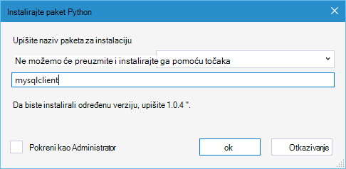

<properties 
    pageTitle="Django i MySQL na Azure pomoću alata za Python 2.2 za Visual Studio" 
    description="Saznajte kako pomoću alata za Python za Visual Studio da biste stvorili Django web-aplikacije koje se pohranjuju podaci u instanci baze podataka MySQL i implementirati na Azure aplikacije servisa web-aplikacije." 
    services="app-service\web" 
    documentationCenter="python" 
    authors="huguesv" 
    manager="wpickett" 
    editor=""/>

<tags 
    ms.service="app-service-web" 
    ms.workload="web" 
    ms.tgt_pltfrm="na" 
    ms.devlang="python"
    ms.topic="get-started-article" 
    ms.date="07/07/2016"
    ms.author="huvalo"/>

# Django i MySQL na Azure pomoću alata za Python 2.2 za Visual Studio 

[AZURE.INCLUDE [tabs](../../includes/app-service-web-get-started-nav-tabs.md)]

U ovom ćete praktičnom vodiču, koristit ćete [Python alate za Visual Studio] (PTVS) da biste stvorili web-aplikacijama jednostavne ankete pomoću jednog od PTVS Ogledni predlošci. Ćete saznati kako pomoću servisa MySQL hostirane na Azure, kako konfigurirati web-aplikaciju da biste koristili MySQL i kako objaviti web-aplikaciju na [Azure aplikacije servisa web-aplikacije](http://go.microsoft.com/fwlink/?LinkId=529714).

> [AZURE.NOTE] Informacije koje se nalaze u ovom ćete praktičnom vodiču dostupan je i u ovom videozapisu:
> 
> [PTVS 2.1: Django aplikacije s MySQL][video]

Potražite [Python Razvojni centar] za dodatnih članaka koji pokrivaju razvoja Azure aplikacije servisa web-aplikacije s PTVS web okviri boca, Flask i Django pomoću servisa Azure spremište tablica, MySQL i baze podataka SQL. Dok je u ovom članku fokus je na aplikacije servisa, koraci su slične prilikom razvoja [Azure servise u Oblaku].

## Preduvjeti

 - Visual Studio 2015.
 - [Python 2.7 32-bitnu] ili [Python 3.4 32-bitne]
 - [Python 2.2 Tools za Visual Studio]
 - [Python 2.2 Tools za Visual Studio uzoraka VSIX]
 - [Alati za Azure SDK za dodavanje veze za VANJSKIH 2015.]
 - Django 1.9 ili noviji

[AZURE.INCLUDE [create-account-and-websites-note](../../includes/create-account-and-websites-note.md)]

<!-- This note should not render as part of the the previous include. -->

> [AZURE.NOTE] Ako želite započeti s aplikacije servisa za Azure prije registracije za račun za Azure, idite na [Pokušajte aplikacije servisa](http://go.microsoft.com/fwlink/?LinkId=523751), gdje možete odmah stvoriti web-aplikacijama short-lived starter u aplikacije servisa. Potreban je bez kreditne kartice, a ne p su potrebne.

## Stvaranje projekta

U ovom ćete odjeljku stvorit ćete Visual Studio projektu pomoću predloška uzorka. Ćete stvoriti okruženje virtualne i instalirajte potrebne paketa. Stvorit ćete lokalne baze podataka pomoću sqlite. Zatim će pokrenuti aplikaciju lokalno.

1. U Visual Studio, odaberite **datoteku**, **Novi projekt**.

1. Predlošci projekta iz [Python 2.2 Alati za Visual Studio uzoraka VSIX] su odjeljcima **Python**, **uzorka**. Odaberite **Ankete Django Web projekta** , a zatim kliknite u redu da biste stvorili projekta.

    

1. Zatražit će se za instaliranje vanjskih paketa. Odaberite **Instalacija u okruženje virtualne**.

    

1. Odaberite **Python 2.7** ili **Python 3.4** kao osnovni tumačenja.

    

1. U **Pregledniku rješenja**, desnom tipkom miša kliknite čvor projekta i odaberite **Python**pa odaberite **Django migrirati**.  Zatim odaberite **Stvori superkorisnik Django**.

1. To će se otvorite konzolu za upravljanje Django i stvaranje sqlite baze podataka u mapu projekta. Slijedite upute za stvaranje korisnika.

1. Provjerite funkcionira li se aplikacija pritiskom na tipku `F5`.

1. Kliknite **prijavite se** na navigacijskoj traci na vrhu.

    

1. Unesite vjerodajnice za korisnika koji ste stvorili kada sinkronizirati bazu podataka.

    

1. Kliknite **Stvaranje anketa uzorka**.

    

1. Kliknite ankete i glasovati.

    

## Stvaranje baze podataka MySQL

Za bazu podataka, na Azure stvorit ćete baze podataka ClearDB MySQL glavnom računalu.

Umjesto toga, možete stvoriti vlastite virtualnog računala koji se izvodi u Azure, a zatim instalirati i upravljati MySQL.

Možete stvoriti bazu podataka s besplatne plan slijedeći ove korake.

1. Prijavite se na [Portal za Azure].

1. Pri vrhu navigacijskog okna, kliknite **NOVO**, a zatim kliknite **podataka + prostor za pohranu**pa kliknite **Baze podataka MySQL**. 

1. Konfiguriranje nove baze podataka MySQL tako da stvorite novu grupu resursa, a zatim odaberite odgovarajuće mjesto za njega.

1. Nakon stvaranja baze podataka MySQL u plohu baze podataka kliknite **Svojstva** .

1. Pomoću gumba Kopiraj vratite vrijednost **NIZA za POVEZIVANJE** u međuspremnik.

## Konfiguriranje projekta

U ovom odjeljku ćete konfigurirati naša aplikacija za web, korištenje baze podataka MySQL koji ste upravo stvorili. Ćete instalirati i dodatne Python paketa obvezni za korištenje baze podataka MySQL s Django. Zatim web-aplikaciji ćete pokrenuti lokalno.

1. U Visual Studio, otvorite **settings.py**iz mape *nazivprojekta* . Privremeno zalijepite niz za povezivanje u uređivaču. Niz za povezivanje je u ovom obliku:

        Database=<NAME>;Data Source=<HOST>;User Id=<USER>;Password=<PASSWORD>

    Promijenite zadanu bazu podataka **MODUL** da biste koristili MySQL, a postavljanje vrijednosti za **naziv**, **korisnika**, **lozinku** i **glavno računalo** s **CONNECTIONSTRING**.

        DATABASES = {
            'default': {
                'ENGINE': 'django.db.backends.mysql',
                'NAME': '<Database>',
                'USER': '<User Id>',
                'PASSWORD': '<Password>',
                'HOST': '<Data Source>',
                'PORT': '',
            }
        }

1. U pregledniku rješenja, u odjeljku **Python okruženja**, desnom tipkom miša kliknite okruženje virtualne i odaberite **Instalirali paket Python**.

1. Instalirajte paket `mysqlclient` pomoću **točaka**.

    

1. U **Pregledniku rješenja**, desnom tipkom miša kliknite čvor projekta i odaberite **Python**pa odaberite **Django migrirati**.  Zatim odaberite **Stvori superkorisnik Django**.

    To će stvoriti tablica za bazu podataka MySQL koji ste stvorili u prethodnom odjeljku. Slijedite upute za stvaranje korisnika koji ne odgovaraju korisnika u sqlite baze podataka stvorene u prvi dio ovog članka.

1. Pokrenite aplikaciju s `F5`. Ankete koje su stvorene pomoću **Stvaranje ankete uzorak** i podataka poslao glasovanje će se serijalizirati u bazi podataka MySQL.

## Objavljivanje web-aplikaciju u aplikacije servisa za Azure

Azure .NET SDK omogućuje jednostavnu implementacija web-aplikaciju programa aplikacije servisa za Azure.

1. U **Pregledniku rješenja**, desnom tipkom miša kliknite čvor projekta i odaberite **Objavi**.

    

1. Kliknite servis za **aplikaciju Microsoft Azure**.

1. Kliknite **Novo** da biste stvorili novu web-aplikaciju.

1. Popunite sljedeća polja pa kliknite **Stvori**:
    - **Naziv aplikacije na web-mjesta**
    - **Aplikacije servisa za planiranje**
    - **Grupa resursa**
    - **Regija**
    - Ostavite **poslužitelj baze podataka** **nijedna baza podataka**

1. Prihvati sve druge zadane vrijednosti, a zatim kliknite **Objavi**.

1. Web-pregledniku otvorit će automatski objavljenu web-aplikaciji. Trebali biste vidjeti web-aplikaciji funkcioniraju kako želite, pomoću baze podataka **MySQL** hostirane na Azure.

    

    Čestitamo! Uspješno objaviti utemeljen na MySQL web-aplikaciju programa Azure.

## Daljnji koraci

Slijedite ove veze da biste saznali više o alatima Python za Visual Studio, Django i MySQL.

- [Alati za Python dokumentacije Visual Studio]
  - [Projekti web]
  - [Oblak servisa projekata]
  - [Daljinsko uklanjanje programskih pogrešaka na Microsoft Azure]
- [Dokumentacija Django]
- [MySQL]

Dodatne informacije potražite u [Centru za razvojne inženjere Python](/develop/python/).

<!--Link references-->

[Razvojni centar za Python]: /develop/python/
[Servisi u Oblaku za Azure]: ../cloud-services-python-ptvs.md

<!--External Link references-->

[Portal za Azure]: https://portal.azure.com
[Python alate za Visual Studio]: http://aka.ms/ptvs
[Python 2.2 Tools za Visual Studio]: http://go.microsoft.com/fwlink/?LinkID=624025
[Python 2.2 Tools za Visual Studio uzoraka VSIX]: http://go.microsoft.com/fwlink/?LinkID=624025
[Alati za Azure SDK za dodavanje veze za VANJSKIH 2015.]: http://go.microsoft.com/fwlink/?LinkId=518003
[Python 2.7 32-bitne]: http://go.microsoft.com/fwlink/?LinkId=517190 
[Python 3.4 32-bitne]: http://go.microsoft.com/fwlink/?LinkId=517191
[Alati za Python dokumentacije Visual Studio]: http://aka.ms/ptvsdocs
[Daljinsko uklanjanje programskih pogrešaka na Microsoft Azure]: http://go.microsoft.com/fwlink/?LinkId=624026
[Projekti web]: http://go.microsoft.com/fwlink/?LinkId=624027
[Oblak servisa projekata]: http://go.microsoft.com/fwlink/?LinkId=624028
[Dokumentacija Django]: https://www.djangoproject.com/
[MySQL]: http://www.mysql.com/
[video]: http://youtu.be/oKCApIrS0Lo
