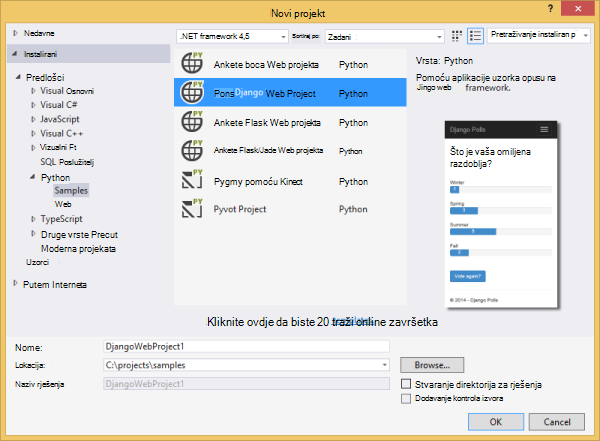
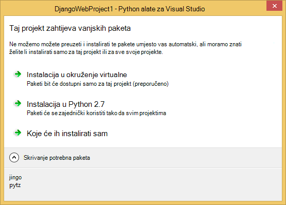
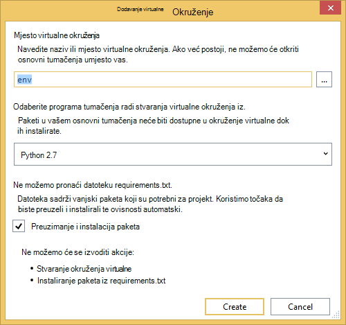
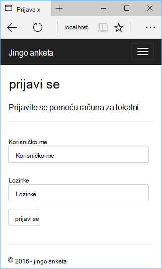
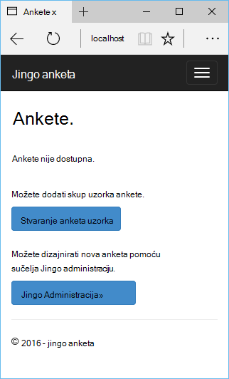
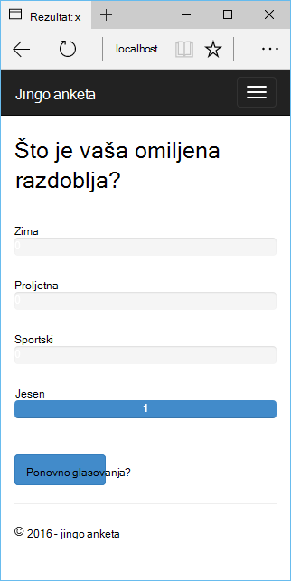
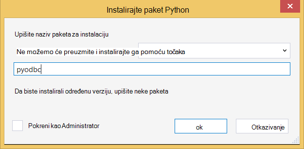
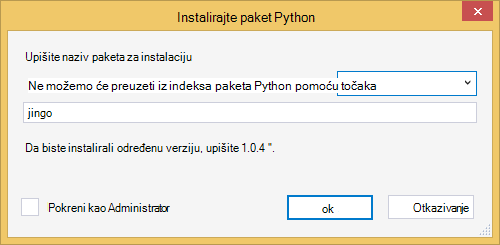
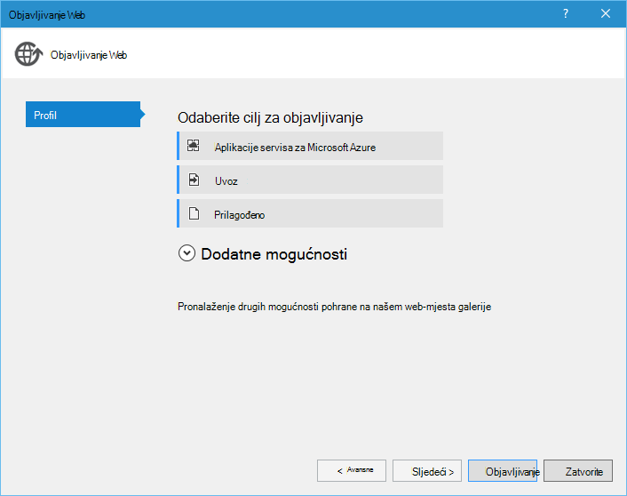
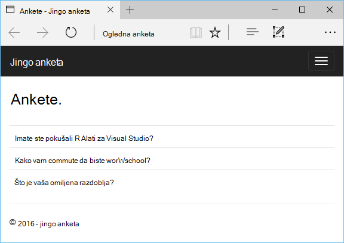

<properties 
    pageTitle="Django i baze podataka SQL Azure pomoću alata za Python 2.2 za Visual Studio" 
    description="Saznajte kako koristiti Python alate za Visual Studio stvaranje Django web-aplikacije koje se sprema podatke u instancu komponente SQL baze podataka i implementirati na Azure aplikacije servisa web-aplikacije." 
    services="app-service\web" 
    tags="python"
    documentationCenter="python" 
    authors="huguesv" 
    manager="wpickett" 
    editor=""/>

<tags 
    ms.service="app-service-web" 
    ms.workload="web" 
    ms.tgt_pltfrm="na" 
    ms.devlang="python" 
    ms.topic="article" 
    ms.date="07/07/2016"
    ms.author="huguesv"/>

# Django i baze podataka SQL Azure pomoću alata za Python 2.2 za Visual Studio 

U ovom ćete praktičnom vodiču ćemo pomoću [Python alate za Visual Studio] Stvaranje jednostavne ankete web-aplikacijama pomoću jednog od PTVS Ogledni predlošci. Pomoću ovog praktičnog vodiča i nije dostupan kao [videozapisa](https://www.youtube.com/watch?v=ZwcoGcIeHF4).

Ne možemo ćete saznati kako koristiti hostirane na Azure SQL baze podataka, kako konfigurirati web-aplikaciju za korištenje baze podataka SQL i kako objaviti web-aplikaciju na [Azure aplikacije servisa web-aplikacije](http://go.microsoft.com/fwlink/?LinkId=529714).

Potražite [Python Razvojni centar] za dodatnih članaka koji pokrivaju razvoja Azure aplikacije servisa web-aplikacije s PTVS web okviri boce, Flask i Django pomoću servisa Azure tablice i prostor za pohranu, MySQL SQL baze podataka. Dok je u ovom članku fokus je na aplikacije servisa, koraci su slične prilikom razvoja [Azure servise u Oblaku].

## Preduvjeti

 - Visual Studio 2015.
 - [Python 2.7 32-bitne]
 - [Python 2.2 Tools za Visual Studio]
 - [Python 2.2 Tools za Visual Studio uzoraka VSIX]
 - [Alati za Azure SDK za dodavanje veze za VANJSKIH 2015.]
 - Django 1.9 ili noviji

[AZURE.INCLUDE [create-account-and-websites-note](../../includes/create-account-and-websites-note.md)]

>[AZURE.NOTE] Ako želite započeti s aplikacije servisa za Azure prije registracije za račun za Azure, idite na [Pokušajte aplikacije servisa](http://go.microsoft.com/fwlink/?LinkId=523751), gdje možete odmah stvoriti web-aplikacijama short-lived starter u aplikacije servisa. Nema kreditne kartice potrebna; Nema preuzete obveze.

## Stvaranje projekta

U ovom ćete odjeljku smo stvorit ćete Visual Studio projektu pomoću predloška uzorka. Ne možemo ćete stvoriti okruženje virtualne i instalirajte potrebne paketa. Ne možemo ćete stvoriti lokalnu bazu podataka pomoću sqlite. Zatim ćemo pokrenut ćete web-aplikaciji lokalno.

1.  U Visual Studio, odaberite **datoteku**, **Novi projekt**.

1.  Predlošci projekta iz [Python 2.2 Alati za Visual Studio uzoraka VSIX] su odjeljcima **Python**, **uzorka**. Odaberite **Ankete Django Web projekta** , a zatim kliknite u redu da biste stvorili projekta.

    

1.  Zatražit će se za instaliranje vanjskih paketa. Odaberite **Instalacija u okruženje virtualne**.

    

1.  Odaberite **Python 2.7** kao osnovni tumačenja.

    

1.  U **Pregledniku rješenja**, desnom tipkom miša kliknite čvor projekta i odaberite **Python**pa odaberite **Django migrirati**.  Zatim odaberite **Stvori superkorisnik Django**.

1.  To će se otvorite konzolu za upravljanje Django i stvaranje sqlite baze podataka u mapu projekta. Slijedite upute za stvaranje korisnika.

1.  Provjerite funkcionira li se aplikacija pritiskom na tipku <kbd>F5</kbd>.

1.  Kliknite **prijavite se** na navigacijskoj traci na vrhu.

    

1.  Unesite vjerodajnice za korisnika koji ste stvorili kada sinkronizirati bazu podataka.

    

1.  Kliknite **Stvaranje anketa uzorka**.

    

1.  Kliknite ankete i glasovati.

    

## Stvaranje baze podataka SQL

Za bazu podataka, ne možemo stvorit ćete baze podataka Azure SQL.

Bazu podataka možete stvoriti tako da slijedite korake u nastavku.

1.  Prijava na [Portal za Azure].

1.  Pri dnu navigacijskog okna, kliknite **NOVO**. , kliknite **podataka + prostor za pohranu** > **SQL baze podataka**.

1.  Konfiguriranje nove baze podataka SQL tako da stvorite novu grupu resursa, a zatim odaberite odgovarajuće mjesto za njega.

1.  Nakon stvaranja SQL baze podataka, kliknite **Otvori u Visual Studio** plohu baze podataka.
2.  Kliknite **Konfiguriraj vatrozida**.
3.  U plohu **Postavke vatrozida** dodajte pravilo vatrozid **IP početak** i **Kraj IP** postavljena na javnu IP adresu računalu razvoj. Kliknite **Spremi**.

    S računala razvoj to će omogućiti veze s poslužiteljem baze podataka.

4.  Vratite se u plohu baze podataka kliknite **Svojstva**, a zatim kliknite **Pokaži nizu za povezivanje baze podataka**. 

2.  Pomoću gumba Kopiraj vratite vrijednost **ADO.NET** u međuspremnik.

## Konfiguriranje projekta

U ovom ćete odjeljku smo ćete konfigurirati naša aplikacija za web, korištenje baze podataka SQL smo upravo stvorili. Ne možemo ćete instalirati dodatne Python paketa obvezni za korištenje baze podataka SQL s Django. Zatim ćemo pokrenut ćete web-aplikaciji lokalno.

1.  U Visual Studio, otvorite **settings.py**iz mape *nazivprojekta* . Privremeno zalijepite niz za povezivanje u uređivaču. Niz za povezivanje je u ovom obliku:

        Server=<ServerName>,<ServerPort>;Database=<DatabaseName>;User ID=<UserName>;Password={your_password_here};Encrypt=True;TrustServerCertificate=False;Connection Timeout=30;

Uređivanje definicije `DATABASES` da biste koristili gornje vrijednosti.

        DATABASES = {
            'default': {
                'ENGINE': 'sql_server.pyodbc',
                'NAME': '<DatabaseName>',
                'USER': '<UserName>',
                'PASSWORD': '{your_password_here}',
                'HOST': '<ServerName>',
                'PORT': '<ServerPort>',
                'OPTIONS': {
                    'driver': 'SQL Server Native Client 11.0',
                    'MARS_Connection': 'True',
                }
            }
        }

1.  U pregledniku rješenja, u odjeljku **Python okruženja**, desnom tipkom miša kliknite okruženje virtualne i odaberite **Instalirali paket Python**.

1.  Instalirajte paket `pyodbc` pomoću **točaka**.

    

1.  Instalirajte paket `django-pyodbc-azure` pomoću **točaka**.

    

1.  U **Pregledniku rješenja**, desnom tipkom miša kliknite čvor projekta i odaberite **Python**pa odaberite **Django migrirati**.  Zatim odaberite **Stvori superkorisnik Django**.

    To će stvoriti tablice za SQL bazu podataka koju smo stvorili u prethodnom odjeljku. Slijedite upute za stvaranje korisnika koji ne odgovaraju korisnika u sqlite baze podataka stvorene u odjeljku prvi.

1.  Pokrenite aplikaciju s `F5`. Ankete koje su stvorene pomoću **Stvaranje ankete uzorak** i podataka poslao glasovanje će se serijalizirati u SQL baze podataka.

## Objavljivanje web-aplikaciju u aplikacije servisa za Azure

Azure .NET SDK omogućuje jednostavnu za implementaciju web-aplikaciju programa web na Azure aplikacije servisa web-aplikacije.

1.  U **Pregledniku rješenja**, desnom tipkom miša kliknite čvor projekta i odaberite **Objavi**.

    

1.  Kliknite **web-aplikacije Microsoft Azure**.

1.  Kliknite **Novo** da biste stvorili novu web-aplikaciju.

1.  Popunite sljedeća polja pa kliknite **Stvori**.
    -   **Naziv aplikacije na web-mjesta**
    -   **Aplikacije servisa za planiranje**
    -   **Grupa resursa**
    -   **Regija**
    -   Ostavite **poslužitelj baze podataka** **nijedna baza podataka**

1.  Prihvati sve druge zadane vrijednosti, a zatim kliknite **Objavi**.

1.  Web-pregledniku otvorit će automatski objavljenu web-aplikaciji. Web-aplikaciji funkcionira u skladu s očekivanjima, trebali biste vidjeti pomoću hostirane na Azure **SQL** baze podataka.

    Čestitamo!

    

## Daljnji koraci

Slijedite ove veze da biste saznali više o alatima Python za Visual Studio, Django i SQL baze podataka.

- [Alati za Python dokumentacije Visual Studio]
  - [Projekti web]
  - [Oblak servisa projekata]
  - [Daljinsko uklanjanje programskih pogrešaka na Microsoft Azure]
- [Dokumentacija Django]
- [SQL baze podataka]

## Što se promijenilo
* Vodič za promjenu iz aplikacije servisa za web-mjestima potražite u članku: [aplikacije servisa za Azure i Its utjecaj na postojećim Azure servisima](http://go.microsoft.com/fwlink/?LinkId=529714)

<!--Link references-->
[Razvojni centar za Python]: /develop/python/
[Servisi u Oblaku za Azure]: ../cloud-services-python-ptvs.md

<!--External Link references-->
[Portal za Azure]: https://portal.azure.com
[Python alate za Visual Studio]: http://aka.ms/ptvs
[Python 2.2 Tools za Visual Studio]: http://go.microsoft.com/fwlink/?LinkID=624025
[Python 2.2 Tools za Visual Studio uzoraka VSIX]: http://go.microsoft.com/fwlink/?LinkID=624025
[Alati za Azure SDK za dodavanje veze za VANJSKIH 2015.]: http://go.microsoft.com/fwlink/?LinkId=518003
[Python 2.7 32-bitne]: http://go.microsoft.com/fwlink/?LinkId=517190 
[Alati za Python dokumentacije Visual Studio]: http://aka.ms/ptvsdocs
[Daljinsko uklanjanje programskih pogrešaka na Microsoft Azure]: http://go.microsoft.com/fwlink/?LinkId=624026
[Projekti web]: http://go.microsoft.com/fwlink/?LinkId=624027
[Oblak servisa projekata]: http://go.microsoft.com/fwlink/?LinkId=624028
[Dokumentacija Django]: https://www.djangoproject.com/
[SQL baze podataka]: /documentation/services/sql-database/
