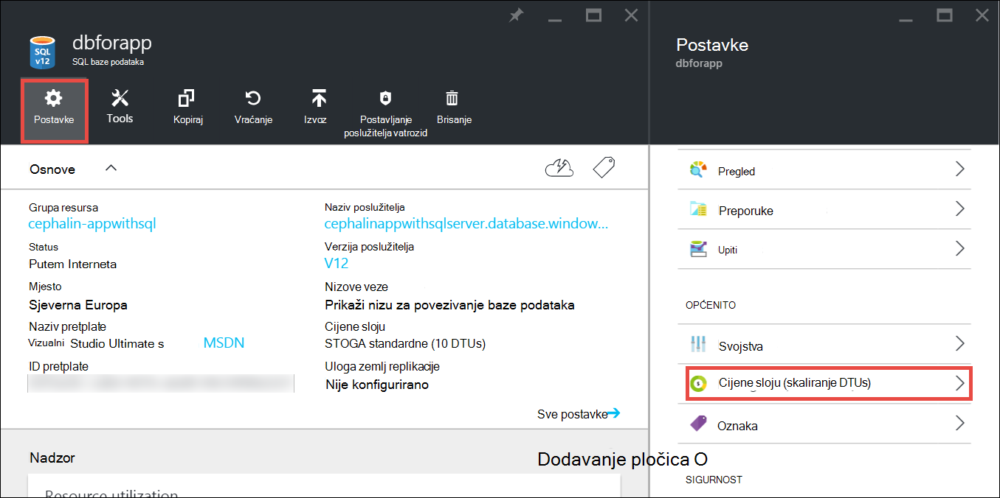

<properties
    pageTitle="Proširenja aplikacije u Azure | Microsoft Azure"
    description="Saznajte kako skaliranja aplikaciju u aplikacije servisa za Azure da biste dodali kapacitetu i značajke."
    services="app-service"
    documentationCenter=""
    authors="cephalin"
    manager="wpickett"
    editor="mollybos"/>

<tags
    ms.service="app-service"
    ms.workload="na"
    ms.tgt_pltfrm="na"
    ms.devlang="na"
    ms.topic="article"
    ms.date="07/05/2016"
    ms.author="cephalin"/>

# Promjena veličine gore aplikacije u Azure #

U ovom se članku objašnjava skaliranje aplikaciju u aplikacije servisa za Azure. Postoje dvije tijekova rada za skaliranja, skala prema gore i skaliranje odgovor, a u ovom se članku objašnjava skale gore tijeka rada.

- [Promjena veličine](https://en.wikipedia.org/wiki/Scalability#Horizontal_and_vertical_scaling): dobiti više procesora, memorije, prostora na disku i dodatne značajke kao što su namjenski virtualnih računala (VMs), prilagođene domene i certifikata, pripremna slobodnih, autoscaling i više. Skaliranje promjenom cijene sloj aplikacije servisa za plan koji pripada aplikacije.
- [Skaliranje odgovor](https://en.wikipedia.org/wiki/Scalability#Horizontal_and_vertical_scaling): povećati broj instanci VM koji se izvode aplikacije.
Odgovor na koliko god 20 instance možete se skaliranje ovisno o vašem cijene sloju. [Aplikacije servisa okruženja](../app-service/app-service-app-service-environments-readme.md) u sloju **Premium** dodatno povećava vaš skaliranje iz broj u 50 instance. Dodatne informacije o skaliranje odgovor potražite u članku [skalirali broj instanci automatski ili ručno](../monitoring-and-diagnostics/insights-how-to-scale.md). Dva će Saznajte kako koristiti autoscaling, koji je da biste skalirali broj instanci automatski na temelju unaprijed definiranih pravila i rasporede.

Postavke mjerila poduzeti samo nekoliko sekundi primjenjuju i utječu na sve aplikacije u [aplikacije servisa za planiranje](../app-service/azure-web-sites-web-hosting-plans-in-depth-overview.md).
Oni nije potrebno da biste promijenili kod ili ponovno implementirate aplikacije.

Informacije o cijene i značajke za pojedinačne aplikacije servisa za tarife potražite u članku [Cijene detalje servisa za aplikacije](/pricing/details/web-sites/).  

> [AZURE.NOTE] Prije nego što počnete tarifu aplikacije servisa iz sloju **slobodno** , najprije morate ukloniti [trošite ograničenja](/pricing/spending-limits/) na mjestu Azure pretplatu. Da biste pogledali ili promijenili mogućnosti za pretplatu na Microsoft Azure aplikacije servisa, potražite u članku [Microsoft Azure pretplate][azuresubscriptions].

## Promjena veličine prema gore na cijene sloju

1. U pregledniku otvorite [portal za Azure][portal].

2. U plohu pokrenite aplikaciju, kliknite **sve postavke**, a zatim **Skaliranje prema gore**.

    ![Pronađite skaliranja Azure aplikacije.][ChooseWHP]

4. Odaberite vaše sloju, a zatim kliknite **Odaberi**.

    Na kartici **obavijesti** će flash zeleni **USPJEH** nakon dovršetka postupka.

## Promjena veličine povezani resursi
Ako aplikaciju ovisi o drugih servisa, kao što su baze podataka SQL Azure ili Azure prostor za pohranu, možete je i proširenja tih resursa koji se temelji na vašim potrebama. Ove resurse nisu umjerene s tarifom aplikacije servisa i morate skalirana zasebno.

1. **Osnove**, kliknite vezu za **grupu resursa** .

    

2. U dijelu **Sažetak** plohu **grupa resursa** , kliknite resursa koji želite za promjenu veličine. Sljedeće snimka zaslona prikazuje SQL baze podataka resursa i programa resursa za pohranu Azure.

    

3. SQL baze podataka resursa, kliknite **Postavke** > sloju**određivanje cijena sloju** skaliranje cijene.

    

    Možete uključiti [zemlj replikacije](../sql-database/sql-database-geo-replication-overview.md) za instancu sustava SQL baze podataka.

    Resursa za pohranu Azure, kliknite **Postavke** > **Konfiguracija** skaliranja mogućnosti prostora za pohranu.

    

## Informirajte se o značajkama za razvojne inženjere
Ovisno o cijenama sloju dostupne su sljedeće značajke za razvojne inženjere usmjerena:

### Bitness ###

- **Osnovni** **standardne**i **Premium** razine podržava 64-bitni i 32-bitne programe.
- **Slobodno** i **zajednički se koristi** plan razine podržava samo 32-bitne aplikacije.

### Podrška za ispravljanje pogrešaka ###

- Podrška za ispravljanje pogrešaka dostupna je za **slobodno**, **zajedničko korištenje**i **Osnovni** načini na jednom vezom po aplikacije servisa za planiranje.
- Podrška za ispravljanje pogrešaka dostupna je za načini **standardnih** ili **Premium** na pet Istodobni po aplikacije servisa za planiranje.

## Saznajte više o ostalim značajkama

- Detaljne informacije o sve preostale značajki na popisu tarife aplikacije servisa, uključujući cijene i značajkama koje vas zanimaju svim korisnicima (uključujući razvojni inženjeri) potražite u članku [Cijene detalje servisa za aplikacije](/pricing/details/web-sites/).

>[AZURE.NOTE] Ako želite započeti s aplikacije servisa za Azure prije registracije za račun za Azure, idite na [Aplikacije servisa za pokušajte](http://go.microsoft.com/fwlink/?LinkId=523751) gdje možete odmah stvoriti web-aplikacijama short-lived starter u aplikacije servisa. Potrebni su bez kreditne kartice, a postoje bez preuzete obveze.

## Daljnji koraci

- Početak rada s Azure, potražite u članku [Besplatnu probnu verziju u programu Microsoft Azure](/pricing/free-trial/).
- Informacije o cijenama, podrška i SLA potražite na sljedećim vezama.

    [Informacije o cijenama za prenosi podatke](/pricing/details/data-transfers/)

    [Microsoft Azure podršku tarife](/support/plans/)

    [Ugovore o razini usluge](/support/legal/sla/)

    [Cijene Detalji baze podataka za SQL](/pricing/details/sql-database/)

    [Virtualnog računala i oblaka veličine usluge za Microsoft Azure][vmsizes]

    [Aplikacije servisa za cijene pojedinosti](/pricing/details/app-service/)

    [Aplikacije servisa za cijene pojedinosti - SSL veze](/pricing/details/web-sites/#ssl-connections)

- Informacije o servisu Azure aplikacije najbolje prakse, uključujući gradnje arhitekturu skalabilni i prebacuju potražite u članku [najbolje prakse: Azure servisa Web aplikacija](http://blogs.msdn.com/b/windowsazure/archive/2014/02/10/best-practices-windows-azure-websites-waws.aspx).

- Videozapisi o skaliranje aplikacije servisa za aplikacije, potražite u sljedećim resursima:

    - [Kada za promjenu veličine Azure web-mjesta – s isto Schackow](/documentation/videos/azure-web-sites-free-vs-standard-scaling/)
    - [Automatsko skaliranje Azure web-mjesta, procesora ili zakazano - s isto Schackow](/documentation/videos/auto-scaling-azure-web-sites/)
    - [Kako Azure skaliranje web-mjesta – s isto Schackow](/documentation/videos/how-azure-web-sites-scale/)

<!-- LINKS -->
[vmsizes]:/pricing/details/app-service/
[SQLaccountsbilling]:http://go.microsoft.com/fwlink/?LinkId=234930
[azuresubscriptions]:http://go.microsoft.com/fwlink/?LinkID=235288
[portal]: https://portal.azure.com/

<!-- IMAGES -->
[ChooseWHP]: ./media/web-sites-scale/scale1ChooseWHP.png
[ChooseBasicInstances]: ./media/web-sites-scale/scale2InstancesBasic.png
[SaveButton]: ./media/web-sites-scale/05SaveButton.png
[BasicComplete]: ./media/web-sites-scale/06BasicComplete.png
[ScaleStandard]: ./media/web-sites-scale/scale3InstancesStandard.png
[Autoscale]: ./media/web-sites-scale/scale4AutoScale.png
[SetTargetMetrics]: ./media/web-sites-scale/scale5AutoScaleTargetMetrics.png
[SetFirstRule]: ./media/web-sites-scale/scale6AutoScaleFirstRule.png
[SetSecondRule]: ./media/web-sites-scale/scale7AutoScaleSecondRule.png
[SetThirdRule]: ./media/web-sites-scale/scale8AutoScaleThirdRule.png
[SetRulesFinal]: ./media/web-sites-scale/scale9AutoScaleFinal.png
[ResourceGroup]: ./media/web-sites-scale/scale10ResourceGroup.png
[ScaleDatabase]: ./media/web-sites-scale/scale11SQLScale.png
[GeoReplication]: ./media/web-sites-scale/scale12SQLGeoReplication.png
