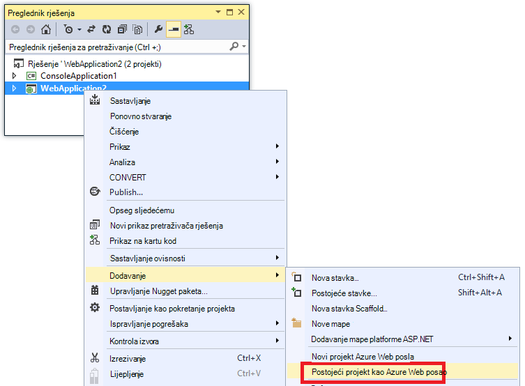

<properties 
    pageTitle="Implementacija WebJobs pomoću Visual Studio" 
    description="Saznajte kako implementirati Azure WebJobs na Azure aplikacije servisa web-aplikacije pomoću Visual Studio." 
    services="app-service" 
    documentationCenter="" 
    authors="tdykstra" 
    manager="wpickett" 
    editor="jimbe"/>

<tags 
    ms.service="app-service" 
    ms.devlang="dotnet" 
    ms.topic="article" 
    ms.tgt_pltfrm="na" 
    ms.workload="na" 
    ms.date="04/27/2016" 
    ms.author="tdykstra"/>

# Implementacija WebJobs pomoću Visual Studio

## Pregled

U ovoj se temi objašnjava kako pomoću programa Visual Studio za implementaciju aplikacije konzole za project web App [Aplikacije servisa za](http://go.microsoft.com/fwlink/?LinkId=529714) kao [Azure WebJob](http://go.microsoft.com/fwlink/?LinkId=390226). Informacije o kako implementirati WebJobs pomoću [Portala za Azure](https://portal.azure.com)potražite u članku [pokretanje pozadinske zadatke s WebJobs](web-sites-create-web-jobs.md).

Kada Visual Studio uvodi aplikacije konzole za WebJobs omogućeno projekta, izvodi dvije stvari:

* Kopija datoteke runtime odgovarajuću mapu u web-aplikaciji (*App_Data/poslove/neprekinuti* za neprekinuti WebJobs, *App_Data/poslove/koji se prikazuje* za zakazano i na zahtjev WebJobs).
* Postavlja [Azure raspored zadataka](#scheduler) za WebJobs koji su zakazani pokrenuti u određenom trenutku. (Ovo nije potreban za neprekinuti WebJobs.)

Projekt WebJobs omogućeno sastoji se od sljedećih stavki u njega dodali:

* Paket NuGet [Microsoft.Web.WebJobs.Publish](http://www.nuget.org/packages/Microsoft.Web.WebJobs.Publish/) .
* [Webjob – objavljivanje-settings.json](#publishsettings) datoteka koja sadrži postavke implementacije i raspored. 

Možete dodati stavke u postojeći projekt aplikacije konzole ili pomoću predloška za stvaranje novog projekta s omogućenim WebJobs aplikacije konzole. 

Implementacija projekta kao u WebJob samostalno ili veza s projektom web tako da se uvodi se automatski kad god implementacija web project. Da biste se povezali projektima, Visual Studio sadrži naziv projekta s omogućenim WebJobs [webjobs list.json](#webjobslist) datoteke u programu project web.

## Preduvjeti

WebJobs implementaciju značajke dostupne su u Visual Studio 2015 kada instalirate Azure SDK za .NET:

* [Azure SDK za .NET (Visual Studio 2015)](http://go.microsoft.com/fwlink/?linkid=518003).

## Omogućivanje uvođenje WebJobs za postojeći projekt aplikacije konzole

Imate dvije mogućnosti:

* [Omogućivanje automatskog implementaciju s programom project web](#convertlink).

    Postojeći projekt aplikacije konzole konfigurirati tako da ga automatski uvodi kao u WebJob ako pokrenete projekta web. Tu mogućnost koristite kada želite pokrenuti na WebJob u istoj web-aplikaciji pokrenuti povezanih web-aplikacije.

* [Omogućivanje implementacije bez projekta web](#convertnolink).

    Konfiguriranje postojeći projekt aplikacije konzole za implementaciju kao u WebJob i odvojeno, s veze nema web projekt. Tu mogućnost koristite kada želite da se pokreće na WebJob u web-aplikaciji i odvojeno, s web-aplikacija nije pokrenut u web-aplikaciji. Možda ćete to učiniti da biste mogli skaliranje resursa WebJob neovisno o web-resurse za aplikacije.

### Omogućivanje automatskog WebJobs implementaciju s programom project web
  
1. Desnom tipkom miša kliknite project web u **Pregledniku rješenja**, a zatim kliknite **Dodaj** > **Postojeći projekt kao Azure WebJob**.

    
    
    Pojavit će se dijaloški okvir [Dodavanje WebJob Azure](#configure) .

1. Na padajućem popisu **naziva projekta** odaberite mogućnost projekt aplikacije konzole da biste dodali kao u WebJob.

    

2. Ispunite dijaloški okvir [Dodavanje WebJob Azure](#configure) , a zatim kliknite **u redu**. 

### Omogućivanje WebJobs implementaciju bez web projekta
  
1. Desnom tipkom miša kliknite konzolu projekta u **Programu Explorer rješenja**, a zatim kliknite **Objavi kao Azure WebJob**. 

    
    
    Pojavit će se dijaloški okvir [Dodavanje WebJob Azure](#configure) i s programom project odabran u okviru **Naziv projekta** .

2.  Ispunite dijaloški okvir [Dodavanje WebJob Azure](#configure) , a zatim kliknite **u redu**.

    Pojavit će se čarobnjak za **Objavljivanje Web** -a.  Ako ne želite da biste objavili odmah, zatvorite čarobnjak. Postavke koje ste unijeli spremaju se za kada želite [uvesti projekt](#deploy).

## Stvaranje novog projekta WebJobs omogućeno

Da biste stvorili novi projekt WebJobs omogućena, možete koristiti predložak za aplikacije konzole za project i omogućivanje WebJobs implementacije kao što je opisano u [prethodnom odjeljku](#convert). Umjesto toga, možete koristiti predložak novi projekt WebJobs:

* [Korištenje predloška za novi projekt WebJobs za nezavisnu WebJob](#createnolink)

    Stvaranje projekta i konfigurirajte je za implementaciju sam kao WebJob, s veze nema web projekt. Tu mogućnost koristite kada želite da se pokreće na WebJob u web-aplikaciji i odvojeno, s web-aplikacija nije pokrenut u web-aplikaciji. Možda ćete to učiniti da biste mogli skaliranje resursa WebJob neovisno o web-resurse za aplikacije.

* [Korištenje predloška za novi projekt WebJobs za WebJob povezana s projektom web](#createlink)

    Stvaranje projekta koji je konfiguriran za implementaciju automatski kao u WebJob kada je implementiran web projekta u istom rješenju. Tu mogućnost koristite kada želite pokrenuti na WebJob u istoj web-aplikaciji pokrenuti povezanih web-aplikacije.

> [AZURE.NOTE] Predložak za novi projekt WebJobs automatski instalira NuGet paketa i sadrži kod u *Program.cs* [WebJobs SDK](http://www.asp.net/aspnet/overview/developing-apps-with-windows-azure/getting-started-with-windows-azure-webjobs). Ako ne želite koristiti WebJobs SDK ili želite koristiti zakazano umjesto neprekinuti WebJob, uklanjanje ili promjena na `host.RunAndBlock` naredbi u *Program.cs*.

### Korištenje predloška za novi projekt WebJobs za nezavisnu WebJob
  
1. Kliknite **datoteka** > **Novi projekt**, a zatim u dijaloškom okviru **Novi projekt** kliknite **oblaka** > **Microsoft Azure WebJob**.

    
    
2. Slijedite upute da [biste aplikaciju konzole projekta li projekt neovisan WebJobs](#convertnolink)ranije prikazane.

### Korištenje predloška za novi projekt WebJobs za WebJob povezana s projektom web

1. Desnom tipkom miša kliknite project web u **Pregledniku rješenja**, a zatim kliknite **Dodaj** > **Novi projekt WebJob Azure**.

    

    Pojavit će se dijaloški okvir [Dodavanje WebJob Azure](#configure) .

2. Ispunite dijaloški okvir [Dodavanje WebJob Azure](#configure) , a zatim kliknite **u redu**.

## Dijaloški okvir Dodavanje WebJob Azure

Dijaloški okvir **Dodavanje Azure WebJob** omogućuje vam da biste unijeli naziv WebJob i planiranje postavki za vaš WebJob. 

Polja u ovom dijaloškom okviru odgovaraju poljima u dijaloškom okviru **Novi zadatak** portala za Azure. Dodatne informacije potražite u članku [pokretanje pozadinske zadatke s WebJobs](web-sites-create-web-jobs.md).

Za zakazano WebJob (ne i za neprekinuti WebJobs) Visual Studio stvara zbirku zadatak programa [Azure raspored](/services/scheduler/) Ako još ne postoji i stvara zadatak u zbirci:

* Pod nazivom posao zbirke raspored *WebJobs-{regionname}* gdje *{regionname}* odnosi se na područje web app nalazi se u. Na primjer: WebJobs WestUS.
* Raspored posla zove *{webappname}-{webjobname}*. Na primjer: MyWebApp MyWebJob. 
 
>[AZURE.NOTE]
> 
>* Informacije o implementaciji naredbenog retka potražite u članku [Omogućavanje naredbenog retka ili neprekinuti isporuke od Azure WebJobs](/blog/2014/08/18/enabling-command-line-or-continuous-delivery-of-azure-webjobs/).
>* Ako konfiguriranje **Ponavljajući zadatak** , a učestalost ponavljanja postavite na određeni broj minuta, servis za Azure rasporeda nije besplatne. Drugi učestalost (sati, dana itd.) su besplatno.
>* Ako implementacija u WebJob, a zatim odredite želite li promijeniti vrstu WebJob i redeploy, morate izbrisati webjobs-objavljivanje-settings.json datoteku. To će postati Visual Studio pokazivati mogućnosti objavljivanja, da biste mogli promijeniti vrstu WebJob.
>* Ako implementacija u WebJob, a kasnije promijeniti načinu izvođenja iz neprekinuti koje nisu neprekinuti ili obrnuto, Visual Studio stvara novi WebJob u Azure kada ste implementirati. Ako mijenjate ostale postavke za planiranje rasporeda, ali ostavite pokrenuti način isti ili prebacivanje između zakazano i na zahtjev, Visual Studio ažurira postojeći posao umjesto stvorite novi.

## webjob – objavljivanje-settings.json

Kada konfigurirate aplikacije konzole za implementaciju WebJobs Visual Studio instalira paket NuGet [Microsoft.Web.WebJobs.Publish](http://www.nuget.org/packages/Microsoft.Web.WebJobs.Publish/) i pohranjuje zakazivanja informacije u *webjob-objavljivanje-settings.json* datoteke u mapu *Svojstva* projekta WebJobs projekta. Slijedi primjer datoteke:

        {
          "$schema": "http://schemastore.org/schemas/json/webjob-publish-settings.json",
          "webJobName": "WebJob1",
          "startTime": "2014-06-23T00:00:00-08:00",
          "endTime": "2014-06-27T00:00:00-08:00",
          "jobRecurrenceFrequency": "Minute",
          "interval": 5,
          "runMode": "Scheduled"
        }

Možete izravno uređivati datoteku, a Visual Studio nudi IntelliSense. Datoteke shema pohranjuju se na [http://schemastore.org](http://schemastore.org/schemas/json/webjob-publish-settings.json) i možete pogledati tamo.  

>[AZURE.NOTE]
>
>* Ako konfiguriranje **Ponavljajući zadatak** , a učestalost ponavljanja postavite na određeni broj minuta, servis za Azure rasporeda nije besplatne. Drugi učestalost (sati, dana itd.) su besplatno.

## webjobs list.json

Kada povežete projekta s omogućenim WebJobs web projekt, Visual Studio pohranjuje naziv projekta WebJobs u *webjobs list.json* datoteke u mapu *Svojstva* projekta web. Na popisu može sadržavati više projekata WebJobs, kao što je prikazano u sljedećem primjeru:

        {
          "$schema": "http://schemastore.org/schemas/json/webjobs-list.json",
          "WebJobs": [
            {
              "filePath": "../ConsoleApplication1/ConsoleApplication1.csproj"
            },
            {
              "filePath": "../WebJob1/WebJob1.csproj"
            }
          ]
        }

Možete izravno uređivati datoteku, a Visual Studio nudi IntelliSense. Datoteke shema pohranjuju se na [http://schemastore.org](http://schemastore.org/schemas/json/webjobs-list.json) i možete pogledati tamo.
  
## Implementacija WebJobs projekta

Project WebJobs koje ste povezali s projektom web automatski uvodi s programom project web. Informacije o implementaciji project web potražite u članku [Kako implementirati na web-aplikacije](web-sites-deploy.md).

Da biste implementirali WebJobs projekta i odvojeno, desnom tipkom miša kliknite projekt u **Pregledniku rješenja**, a zatim kliknite **Objavi kao Azure WebJob**. 

    
Za pojavit će se neovisno WebJob, istog čarobnjaka za **Objavljivanje Web** koji se koristi za projekte web, ali manje dostupna za promjenu postavki.

## Daljnji koraci

U ovom se članku je objašnjeno kako implementirati WebJobs pomoću Visual Studio. Dodatne informacije o implementaciji Azure WebJobs sustava potražite u članku [Azure WebJobs - preporučeno resursa - implementacije](http://www.asp.net/aspnet/overview/developing-apps-with-windows-azure/azure-webjobs-recommended-resources#deploying).
