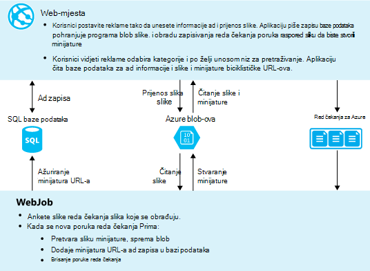
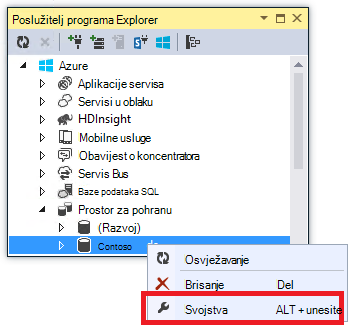

<properties
    pageTitle="Stvaranje .NET WebJob u aplikacije servisa za Azure | Microsoft Azure"
    description="Stvaranje više razina aplikacije pomoću ASP.NET MVC i Azure. Prednja pokreće završetka u web-aplikacijama u aplikacije servisa za Azure i pozadinski pokreće kao u WebJob. Aplikaciju koristi Framework entitet, baze podataka SQL i redova Azure prostora za pohranu i blob-ova."
    services="app-service"
    documentationCenter=".net"
    authors="tdykstra"
    manager="wpickett"
    editor="mollybos"/>

<tags
    ms.service="app-service"
    ms.workload="na"
    ms.tgt_pltfrm="na"
    ms.devlang="na"
    ms.topic="article"
    ms.date="10/28/2016"
    ms.author="tdykstra"/>

# Stvaranje .NET WebJob u aplikacije servisa za Azure

Pomoću ovog praktičnog vodiča pokazuje kako pisanje koda za jednostavne aplikaciju ASP.NET MVC 5 više razina koji koristi [WebJobs SDK](websites-dotnet-webjobs-sdk.md).

Svrha [WebJobs SDK](websites-webjobs-resources.md) je da biste pojednostavnili kod u pišete za uobičajene zadatke u WebJob možete izvršiti, kao što su obrada slike, red čekanja obrade, RSS zbrajanja, datoteka održavanja i slanje poruke e-pošte. WebJobs SDK ima ugrađene značajke za rad s Azure i prostor za pohranu servisa Bus, za zakazivanje zadataka i rukovanja pogreškama i mnoge druge uobičajeni scenariji. Osim toga, vam omogućuje da vas se extensible, a postoji programa [otvorite spremištu izvora za proširenja](https://github.com/Azure/azure-webjobs-sdk-extensions/wiki/Binding-Extensions-Overview).

Primjer aplikacije je programa oglašavanje oglasne ploče. Korisnicima možete prenijeti slike za reklame, a proces pozadinskog pretvara slika minijature. Na stranici popis ad prikazuje minijature, a na stranici pojedinosti ad prikazana na slici u punoj veličini. Evo snimke zaslona:

U ovom primjeru aplikacije funkcionira s [Azure redovima](http://www.asp.net/aspnet/overview/developing-apps-with-windows-azure/building-real-world-cloud-apps-with-windows-azure/queue-centric-work-pattern) i [Azure blob-ova](http://www.asp.net/aspnet/overview/developing-apps-with-windows-azure/building-real-world-cloud-apps-with-windows-azure/unstructured-blob-storage). Vodič prikazuje kako implementirati aplikaciju [Aplikacije servisa za Azure](http://go.microsoft.com/fwlink/?LinkId=529714) i [Baze podataka SQL Azure](http://msdn.microsoft.com/library/azure/ee336279).

## Preduvjeti

Vodič pretpostavlja da znate kako raditi s projektima [ASP.NET MVC 5](http://www.asp.net/mvc/tutorials/mvc-5/introduction/getting-started) u Visual Studio.

Vodič napisan za Visual Studio 2013. Ako već nemate Visual Studio, će se instalirati umjesto vas automatski kada instalirate Azure SDK za .NET.

Vodič mogla koristiti za Visual Studio 2015, ali prije nego što pokrenete aplikaciju lokalno ćete morati promijeniti u `Data Source` dio niz za povezivanje SQL Server LocalDB u Web.config i App.config datoteke iz `Data Source=(localdb)\v11.0` da biste `Data Source=(LocalDb)\MSSQLLocalDB`. 

> [AZURE.NOTE] Potreban vam je račun za Azure da biste dovršili ovaj Praktični vodič:
  >
  > + Možete je [besplatno otvorite račun za Azure](https://azure.microsoft.com/pricing/free-trial/?WT.mc_id=A261C142F): dohvaćanje kredita možete koristiti da biste isprobali plaćenu servisa Azure pa čak i kada se koriste najviše možete voditi računa i korištenje slobodno Azure servisa, kao što su web-mjesta. Vaša kreditna kartica nikad naplatiti, osim ako izričito Promjena postavki i od nje zatražite da se naplatiti.
  >
  > + Možete [aktivirati pogodnosti pretplatnika MSDN](https://azure.microsoft.com/pricing/member-offers/msdn-benefits-details/?WT.mc_id=A261C142F): MSDN vaša pretplata vam kredita svakog mjeseca, koje možete koristiti za plaćenu Azure servise.
  >
  >Ako želite započeti s aplikacije servisa za Azure prije registracije za račun za Azure, idite na [Pokušajte aplikacije servisa](http://go.microsoft.com/fwlink/?LinkId=523751), gdje možete odmah stvoriti web-aplikacijama short-lived starter u aplikacije servisa. Nema kreditne kartice potrebna; Nema preuzete obveze.

## Saznat ćete

Vodič prikazuje kako obaviti sljedeće zadatke:

* Omogućivanje računalu za Azure razvoj instalacijom Azure SDK.
* Stvaranje aplikacije konzole projekta koji automatski uvodi kao programa Azure WebJob kada uvesti projekt povezana web.
* Testirajte WebJobs SDK pozadinskog lokalno na računalu razvoj.
* Objavljivanje aplikacija s WebJobs pozadinskom web-aplikaciju u aplikacije servisa.
* Prijenos datoteka i sprema ih u servisu blobova platforme Azure.
* Korištenje Azure WebJobs SDK za rad s redovima Azure prostora za pohranu i blob-ova.

## Arhitektura aplikacije

Primjer aplikacije pomoću [Uzorak reda čekanja usmjereni na službeni](http://www.asp.net/aspnet/overview/developing-apps-with-windows-azure/building-real-world-cloud-apps-with-windows-azure/queue-centric-work-pattern) off-load rada procesora ćete morati usko minijature pozadinskog postupak stvaranja.

Aplikaciju pohranjuje reklame u SQL baze podataka, pomoću entitet Framework kod prvog za stvaranje tablice i pristup podacima. Za svaki ad baza podataka pohranjuje dva URL-ova: jedan za na slici u punoj veličini i jedan potražite minijaturu.

Kada korisnik prenese sliku, web-aplikaciji sprema sliku u programa [Azure bloba](http://www.asp.net/aspnet/overview/developing-apps-with-windows-azure/building-real-world-cloud-apps-with-windows-azure/unstructured-blob-storage)i informacije ad se pohranjuju u bazi podataka s URL Adresom koja upućuje na blob-om. U isto vrijeme pisanja poruke Azure red. U pozadinskog procesa koji se izvodi kao programa Azure WebJob, WebJobs SDK polls reda čekanja za nove poruke. Kada se pojavi novu poruku, na WebJob stvara minijature za tu sliku, a ažurira minijatura polje database URL-a za taj ad. Ovo je dijagram koji prikazuje način na koji rade dijelove aplikacija:

[AZURE.INCLUDE [install-sdk](../../includes/install-sdk-2015-2013.md)]

Upute za vodiča Primjena Azure SDK za .NET 2.7.1 ili noviji.

## Stvorite račun za pohranu za Azure

Račun za Azure prostora za pohranu nudi resursa za pohranu reda čekanja i blob podataka u oblaku. Ga i koristi WebJobs SDK za pohranu zapisivanje podataka za nadzornu ploču.

U aplikaciji stvarnog života, koje obično stvarate odvojene račune za aplikaciju podataka i zapisivanje podataka, i zasebno račune za testiranje podataka i podataka radnog. Za ovaj vodič koristit ćete samo jedan račun.

1. Otvorite prozor **Preglednika poslužitelja** u Visual Studio.

2. Desnom tipkom miša kliknite čvor **Azure** , a zatim pritisnite **Poveži s programom Microsoft Azure**.

3. Prijavite se pomoću vjerodajnica za Azure.

5. Desnom tipkom miša kliknite **prostora za pohranu** u odjeljku čvor Azure, a zatim kliknite **Stvori račun za pohranu**.

3. U dijaloškom okviru **Stvaranje računa za pohranu** unesite naziv računa za pohranu.

    Naziv mora biti mora biti jedinstvena (bez nekim drugim računom Azure prostora za pohranu mogu imati isti naziv). Ako unesete naziv već se koristi dobit ćete moći promijeniti.

    URL za izravan pristup računu za pohranu bit će *{name}*. core.windows.net.

5. Padajućeg popisa **regija ili grupe afinitet** regija postavljeno na na najbliži vama.

    Tom se postavkom određuje koje Azure podatkovnog centra će hostira vaš račun za pohranu. Za ovaj vodič izboru neće provjerite uočiti razlike. Međutim, za web-aplikacije za radni želite web-poslužitelj i račun za pohranu u istom području da biste minimizirali izlazne troškove Latencija i podatke. Web-aplikaciju (koje ćete stvarati kasnije) mora biti sljedeći blizu moguće preglednici pristupa web-aplikaciju da biste minimizirali Latencija podatkovnog centra.

6. Postavite **replikacijom** padajućeg popisa na **lokalno suvišne**.

    Kada zemlj replikacije je omogućen za račun za pohranu, pohranjeni sadržaj je replicirati na sekundarnom podatkovnog centra da biste omogućili prebacivanje na to mjesto u slučaju glavne Izrada u primarnom mjestu. Zemlj replikacije može uzrokovati dodatne troškove. Za testiranje i razvoj račune, obično ne želite li platiti zemlj replikacije. Dodatne informacije potražite u članku [Stvaranje, upravljanje, i brisanje računa za pohranu](../storage-create-storage-account/#replication-options).

5. Kliknite **Stvori**.

    

## Preuzimanje aplikacije

1. Preuzmite i raspakirajte [dovršiti rješenja](http://code.msdn.microsoft.com/Simple-Azure-Website-with-b4391eeb).

2. Pokrenuti Visual Studio.

3. Na izborniku **datoteka** odabrati **otvorite > projekta/rješenje**, dođite do koju ste preuzeli rješenja, a zatim otvorite datoteku rješenja.

4. Pritisnite CTRL + SHIFT + B da biste sastavili rješenja.

    Prema zadanim postavkama Visual Studio automatski vraća sadržaj NuGet paket koji nisu obuhvaćeni *.zip* datoteke. Ako ne vratite pakete, instalirajte ih ručno tako da dijaloški okvir **Upravljanje NuGet paketa rješenja** i klikom na gumb **Vrati** u gornjem desnom kutu.

5. U **Pregledniku rješenja**, provjerite je li **ContosoAdsWeb** kao projekt prilikom pokretanja.

## Konfiguriranje aplikacija za korištenje računa za pohranu

1. Otvorite datoteku *Web.config* aplikacije u programu project ContosoAdsWeb.

    Datoteka sadrži SQL niz za povezivanje i niz za povezivanje Azure prostora za pohranu za rad s blob-ova i redova.

    Pokazuje SQL niz za povezivanje s bazom podataka [Sustava SQL Server Express LocalDB](http://msdn.microsoft.com/library/hh510202.aspx) .

    Primjer koji sadrži rezervirana mjesta za pohranu naziv i pristup ključ računa je niz za povezivanje za pohranu. Time ćete zamijenite niza za povezivanje koji sadrži naziv i ključ računa za pohranu.  

    <pre class="prettyprint">&lt;connectionStrings&gt;
   &lt;dodajte naziv = connectionString "ContosoAdsContext" = "izvora podataka = \v11.0 (localdb); Početnog kataloga = ContosoAds; Integrirani sigurnost = True; MultipleActiveResultSets = True; "providerName="System.Data.SqlClient "/&gt;
   &lt;dodajte naziv = connectionString"AzureWebJobsStorage"=" DefaultEndpointsProtocol = https; AccountName =<mark>[accountname]</mark>; AccountKey =<mark>[accesskey]</mark>"/&gt; 
    &lt;/connectionStrings      &gt;</pre>

    Niz za povezivanje za pohranu pod nazivom AzureWebJobsStorage jer je naziv koji se koristi u SDK WebJobs prema zadanim postavkama. Isti naziv koristi se ovdje da biste imali da biste postavili samo jednu vrijednost niza veze u okruženje za Azure.

2. U programu **Explorer poslužitelj**, desnom tipkom miša kliknite svoj račun za pohranu u odjeljku čvor **prostora za pohranu** , a zatim **Svojstva**.

    

3. U prozoru **Svojstva** kliknite **Tipke račun za pohranu**, a zatim tri točke.

    

4. Kopirajte **niz za povezivanje**.

    

5. Niz za povezivanje za pohranu u datoteci *Web.config* zamijenite koju ste upravo kopirali niz za povezivanje. Provjerite jeste li odabrali sve unutar navodnika, ali ne uključujući navodnike prije lijepljenja.

6. Otvorite datoteku *App.config* u programu project ContosoAdsWebJob.

    Datoteka sadrži dva niza veze za pohranu, jedan za podataka aplikacije i za zapisivanje. Koristite odvojene prostora za pohranu račune za podataka aplikacije i zapisivanje, a možete koristiti [više prostora za pohranu računa za podatke](https://github.com/Azure/azure-webjobs-sdk/blob/master/test/Microsoft.Azure.WebJobs.Host.EndToEndTests/MultipleStorageAccountsEndToEndTests.cs). Za ovaj vodič koristit ćete prostor za pohranu za jedan račun. U nizu za povezivanje imati rezervirana mjesta za račun tipki za pohranu. 
    <pre class="prettyprint">&lt;Konfiguriranje&gt; 
    &lt;connectionStrings&gt;
   &lt;dodajte naziv = connectionString "AzureWebJobsDashboard" = "DefaultEndpointsProtocol = https; AccountName =<mark>[accountname]</mark>; AccountKey =<mark>[accesskey]</mark>"/&gt;
   &lt;dodajte naziv = connectionString"AzureWebJobsStorage"=" DefaultEndpointsProtocol = https; AccountName =<mark>[accountname]</mark>; AccountKey =<mark>[accesskey]</mark>"/&gt;
   &lt;dodajte naziv = connectionString"ContosoAdsContext"=" izvora podataka = \v11.0 (localdb); Početnog kataloga = ContosoAds; Integrirani sigurnost = True; MultipleActiveResultSets = True; " /&gt; 
    &lt;/connectionStrings&gt;
   &lt;pokretanje&gt;
   &lt;supportedRuntime verziju = sku "v4.0" = ". NETFramework, verzija = v4.5 "/&gt; 
    &lt;/startup&gt;
&lt;/configuration                             &gt;</pre>

    Prema zadanim postavkama WebJobs SDK traži nizu za povezivanje s nazivom AzureWebJobsStorage i AzureWebJobsDashboard. Umjesto toga, možete ga [spremište veza niza ipak želite i u izričito za prosljeđivanje na `JobHost` objekt](websites-dotnet-webjobs-sdk-storage-queues-how-to.md#config).

7. Zamijenite oba niza veze prostora za pohranu koji ste prethodno kopirali niz za povezivanje.

8. Spremite promjene.

## Pokrenite aplikaciju lokalno

1. Da biste započeli web sučelju aplikacije, pritisnite CTRL + F5.

    Zadani preglednik otvorit će se na početnu stranicu. (Web project pokreće jer ste unijeli prilikom pokretanja projekt).

    

2. Da biste započeli pozadinskog WebJob aplikacije, desnom tipkom miša kliknite ContosoAdsWebJob projekta u **Programu Explorer rješenja**, a zatim kliknite **ispravljanje pogrešaka** > **pokrenite novu instancu**.

    Prozor za aplikacije konzole otvara i prikazuje zapisivanje poruke koja označava WebJobs SDK JobHost objekt je počeo da biste pokrenuli.

    

3. U pregledniku, kliknite **Stvori u Ad**.

4. Unesite neki podaci test, odaberite sliku da biste prenijeli i kliknite **Stvori**.

    

    Aplikaciju prelazi na stranicu indeks, ali ne prikazuje minijatura za nove ad jer se taj obrada još nije došlo.

    U međuvremenu, nakon kratki čekanja zapisivanje poruka u prozoru aplikacije konzole pokazuje reda čekanja poruka primljena te obrađen.

    

5. Kada se prikaže poruka zapisivanje u prozoru aplikacije konzole, osvježite stranicu indeks da biste vidjeli minijaturu.

    

6. Kliknite **Detalji** za vaše ad da biste vidjeli na slici u punoj veličini.

    

Ste je pokretanje aplikacija na lokalnom računalu, a da se radi o SQL Server baze podataka koja se nalazi na vašem računalu, ali funkcionira sa redovima i blob-ova u oblak. U sljedećem odjeljku ćete pokrenuti aplikaciju u oblaku, pomoću oblaka bazu podataka kao i oblaka blob-ova i redova.  

## Pokrenite aplikaciju u oblaku

Slijedite sljedeće korake da biste pokrenuli aplikaciju u oblaku:

* Uvođenje na web-aplikacije. Visual Studio automatski stvara novu web-aplikaciju u aplikacije servisa i instancu komponente SQL baze podataka.
* Konfiguriranje web-aplikaciju za korištenje Azure SQL baze podataka i pohranu računa.

Nakon stvaranja neke reklame prilikom pokretanja u oblaku, ćete vidjeti nadzorne ploče WebJobs SDK da biste vidjeli obogaćeni nadzor značajke ima nudi.

### Uvođenje na web-aplikacije

1. Zatvorite preglednik i prozor konzole programa.

2. U **Pregledniku rješenja**, desnom tipkom miša kliknite ContosoAdsWeb projekta, a zatim **Objavi**.

3. U koraku čarobnjaka za **Objavljivanje Web** **profila** , kliknite **web-aplikacije Microsoft Azure**.

    

4. Prijavite se na Azure Ako još niste prijavljeni.

5. Kliknite **Novo**.

    Dijaloški okvir možda izgleda malo drugačije ovisno o tome koju verziju programa Azure SDK za .NET ste instalirali.

    

6. U dijaloškom okviru **Stvaranje web-aplikacijom na Microsoft Azure** unesite jedinstveni naziv u okvir **naziv aplikacije na web-mjesta** .

    Cijeli URL će se sastojati od što ovdje unesete plus. azurewebsites.net (kao što je prikazano pokraj tekstnog okvira **naziv aplikacije na web-mjesta** ). Ako, na primjer, ako je naziv web app ContosoAds, URL će biti ContosoAds.azurewebsites.net.

7. U padajućem popisu [aplikacije servisa za plan](../app-service/azure-web-sites-web-hosting-plans-in-depth-overview.md) odaberite **Stvaranje nove aplikacije servisa za tarife**. Unesite naziv za plan aplikacije servisa, kao što su ContosoAdsPlan.

8. U [grupi resursa](../azure-resource-manager/resource-group-overview.md) padajućeg popisa odaberite **Stvori novu grupu resursa**.

9. Unesite naziv za grupu resursa, kao što su ContosoAdsGroup.

10. U padajućem popisu **regija** odaberite istom području koje ste odabrali za vaš račun za pohranu.

    Tom se postavkom određuje koje Azure podatkovnog centra web-aplikaciju programa funkcionirat će u. Čuvanja web app i pohranu računa u istom podatkovnog centra minimizira troškove izlazne Latencija i podatke.

11. Na padajućem popisu **poslužitelj baze podataka** odaberite **Stvori novi poslužitelj**.

12. Unesite naziv poslužitelja baze podataka, kao što su contosoadsserver + broj ili naziv da bi se jedinstveni naziv poslužitelja. 

    Naziv poslužitelja mora biti jedinstvena. Mogu sadržavati mala slova, znamenke i spojnice. Ne smije sadržavati završne crtica. 

    Osim toga, ako vaša pretplata već ima poslužitelju, možete odabrati tom poslužitelju s padajućeg popisa.

12. Unesite administratora **baze podataka korisničko ime** i **lozinku baze podataka**.

    Ako ste odabrali **nove baze podataka SQL server** ne unesete na postojeće ime i lozinku ovdje, unosa novo ime i lozinku koju ste definiranje sada da biste kasnije koristili kada pristup bazi podataka. Ako ste odabrali poslužitelj koji ste prethodno stvorili, dobit ćete upit za lozinke administratora korisnički račun koji ste već stvorili.

13. Kliknite **Stvori**.

    

    Visual Studio stvara rješenje, web project, web-aplikaciju u Azure i instanci baze podataka SQL Azure.

14. U koraku čarobnjaka za **Objavljivanje Web** **veze** , kliknite **Dalje**.

    

15. U koraku **Postavke** poništite potvrdni okvir **koristi ovu niz za povezivanje prilikom izvođenja** , a zatim kliknite **Dalje**.

    

    Ne morate koristiti dijaloški okvir Objavi da biste postavili SQL niz za povezivanje jer će vam kasnije postaviti tu vrijednost u Azure okruženju.

    Upozorenja na ovoj stranici možete zanemariti.

    * Obično račun za pohranu koje koristite prilikom pokretanja u Azure bio bi razlikuje od onog koristite kada se izvodi lokalno, no za ovog praktičnog vodiča koristite isti onom u oba okruženja. Pa niz za povezivanje AzureWebJobsStorage ne moraju biti transformacije. Čak i ako niste koji želite koristiti račun za različite prostora za pohranu u oblaku, ne morate pretvorbu niz za povezivanje jer aplikaciju koristi se postavka Azure okruženje kada se pokrene u Azure. Primijetit ćete sljedeće kasnije u ovom praktičnom vodiču.

    * Za ovaj vodič ne namjeravate se promjene u podatkovni model koji se koristi za ContosoAdsContext bazu podataka, tako da nema potrebe da biste koristili entitet Framework kod prvog Migracija radi implementacije. Kod najprije automatski stvara novo vrijeme baze podataka prvi aplikacija pokušava pristupiti podacima SQL.

    Za ovaj vodič precizno su zadane vrijednosti od mogućnosti u odjeljku **Mogućnosti objavljivanja datoteke** .

16. U koraku **Pretpregled** kliknite **Pretpregled Start**.

    

    Upozorenje o nijedna baza podataka objavljuje možete zanemariti. Entitet Framework kod prvog stvara baze podataka. ne mora biti objavljivanja.

    Prozor pretpregleda prikazuje da binarne datoteke i konfiguracijske datoteke iz projekta WebJob kopirat će se u mapu *app_data\jobs\continuous* web-aplikacije.

    

17. Kliknite **Objavi**.

    Visual Studio uvodi aplikacije i otvara URL početnu stranicu u pregledniku.

    Nećete moći koristiti web-aplikaciji dok ne postavite nizove veze u okruženje za Azure u sljedećem odjeljku. Prikazat će se stranica s pogreškom ili početnoj stranici ovisno o web-aplikacije i baza podataka stvaranja mogućnosti koje ste prethodno odabrali.

### Konfiguriranje web-aplikaciju za korištenje Azure SQL baze podataka i pohranu računa.

Je najbolji način sigurnost da biste [izbjegli stavljanja povjerljive podatke kao što su nizovi veze u datotekama koje se pohranjuju u izvorni kod spremišta](http://www.asp.net/aspnet/overview/developing-apps-with-windows-azure/building-real-world-cloud-apps-with-windows-azure/source-control#secrets). Azure omogućuje da biste to učinili: možete postaviti niz veze i druge postavke vrijednosti u okruženje za Azure i API konfiguracije ASP.NET automatski obraditi te vrijednosti prilikom pokretanja aplikacije u Azure. Te vrijednosti možete postaviti u Azure pomoću **Poslužitelja Explorer**, portala za Azure, komponente Windows PowerShell ili sučelje naredbenog retka za različite platforme. Dodatne informacije potražite u članku [kako nizovi aplikacije i rad niza veze](/blog/2013/07/17/windows-azure-web-sites-how-application-strings-and-connection-strings-work/).

U ovom odjeljku da biste postavili vezu vrijednosti niza u Azure pomoću **Poslužitelja Explorer** .

7. U programu **Explorer poslužitelj**, desnom tipkom miša kliknite prikaza u odjeljku **Azure > aplikacije servisa > {grupu resursa}**, a zatim kliknite **Postavke prikaza**.

    Na kartici **konfiguracije** otvara se prozor za **Azure Web App** .

9. Promijenite naziv DefaultConnection niz za povezivanje u ContosoAdsContext.

    Prilikom stvaranja web-aplikacije s pridruženih baza podataka, tako da već ima vrijednost niza odgovarajuću mogućnost povezivanja Azure automatski stvara niz za povezivanje. Mijenjate samo s nazivom što je kod tražite.

9. Dodajte dva nova veza niza, pod nazivom AzureWebJobsStorage i AzureWebJobsDashboard. Postavljanje vrste Prilagođeno i postavite vrijednost niza veze jednaku vrijednost koju ste prethodno koristili za datoteke *Web.config* i *App.config* . (Provjerite uključiti u cijeli niz za povezivanje, ne samo tipkovni prečac, a ne i navodnike.)

    Ti veze nizovi koji se koristi WebJobs SDK jedan za podataka aplikacije i jedan za zapisivanje. Kao što je vidjeli ranije, jedan za podataka aplikacije i koristi kod sučelje web.

9. Kliknite **Spremi**.

    

10. U programu **Explorer poslužitelj**, desnom tipkom miša kliknite web-aplikaciju, a zatim **Zaustavi**.

12. Nakon prekida se web-aplikaciju, ponovno kliknite web-aplikaciji desnom tipkom miša, a zatim kliknite **Start**.

    Na WebJob automatski se pokreće prilikom objavljivanja, ali zaustavlja se pri upućivanju promijenili. Da biste ga ponovno pokrenite možete ponovno pokrenite aplikaciju za web ili ponovno pokrenite na WebJob [Azure Portal](http://go.microsoft.com/fwlink/?LinkId=529715). Općenito preporučuje se ponovno pokrenite aplikaciju web nakon promjene konfiguracije.

9. Osvježite prozor preglednika koji sadrži web app URL njegov adresnoj traci.

    Pojavit će se na početnu stranicu.

10. Stvoriti u ad niste kada ste pokrenuli aplikaciju lokalno.

    Na stranici indeks se prikazuje bez minijatura isprva.

11. Kada se pojavi nekoliko sekundi, a zatim minijaturu, osvježite stranicu.

    Ako se ne pojavi minijaturu, možda ćete morati pričekati nekoliko minuta ili da za WebJob da biste ponovno pokrenuli. Ako nakon na neko vrijeme i dalje ne vidite minijaturu kada osvježite stranicu, na WebJob možda nije pokrenut automatski. U tom slučaju prijeđite na karticu WebJobs na stranici [Klasični portal](https://manage.windowsazure.com) za web-aplikacije, a zatim **pokretanje**.

### Prikaz nadzorne ploče WebJobs SDK

1. [Klasični portala](https://manage.windowsazure.com)odaberite web-aplikaciju programa.

2. Kliknite karticu **WebJobs** .

3. Kliknite URL-a u stupcu zapisnika za vaše WebJob.

    

    Na novoj kartici preglednika otvorit će se WebJobs SDK nadzorne ploče. Na nadzornoj ploči prikazuje na WebJob pokrenut je, a prikazat će se popis funkcija u kodu WebJobs SDK pokrenut.

4. Kliknite jednu od funkcija da biste vidjeli detalje o njegova izvođenja.

    

    

    Gumb za **Funkciju Ponovi** na ovoj stranici uzrokuje framework WebJobs SDK za ponovno poziv funkcije, pružajući vam mogućnost da biste promijenili podatke proslijediti funkciji.

>[AZURE.NOTE] Kada ste gotovi testiranja, brisanje web-aplikacije i instancu sustava SQL baze podataka. Web-aplikaciji je besplatno, ali instanca baze podataka SQL i račun za pohranu ako skupi naknada (minimalnog zbog malu veličinu). Osim toga, ostavite na web-aplikaciji radi svakome tko pronalazi URL možete stvoriti i prikaz reklame. Na portalu klasični idite na karticu **nadzorne ploče** za web-aplikacije, a zatim gumb **Izbriši** pri dnu stranice. Zatim možete odabrati potvrdni okvir da biste izbrisali instancu sustava SQL baze podataka u isto vrijeme. Ako samo želite privremeno onemogućiti drugima pristup web-aplikaciju, kliknite **Zaustavi** . U tom slučaju troškove će i dalje ako skupi za račun SQL baze podataka i pohranu. Možete pratiti slične postupak da biste izbrisali SQL baze podataka i pohranu računa kada ih više nije potrebna.

## Stvaranje aplikacija iz početka

U ovom odjeljku ćete učiniti sljedeće zadatke:

* Stvaranje rješenja za Visual Studio s programom project web.
* Dodajte razrednom projektu biblioteke za sloj pristupa podacima koji se zajednički koriste sučelje i pozadinskog.
* Dodavanje aplikacije konzole za projekt radi pozadinski, s WebJobs implementaciju omogućeno.
* Dodajte NuGet paketa.
* Postavljanje reference projekta.
* Kopirajte kod i konfiguraciji datoteka aplikacije iz preuzeti aplikaciju koja radili u prethodnom odjeljku vodič.
* Pregledajte dijelove koda kojima se koriste Azure blob-ova i redovima i WebJobs SDK.

### Stvaranje rješenja za Visual Studio s web project i project Biblioteka klasa

1. U Visual Studio, odaberite **Novo** > **projekta** iz izbornika **datoteka** .

2. U dijaloškom okviru **Novi projekt** odaberite **Visual C#** > **Web** > **ASP.NET web-aplikacije**.

3. Naziv projekta ContosoAdsWeb, naziv rješenje ContosoAdsWebJobsSDK (Promjena naziva rješenja ako ste umetanja u istu mapu kao i preuzeti rješenja), a zatim kliknite **u redu**.

    

5. U dijaloškom okviru **Novi projekt ASP.NET** odaberite predložak MVC pa poništite potvrdni okvir **glavnog računala u oblaku** u odjeljku **Microsoft Azure**.

    Odabir **glavnog računala u oblaku** omogućuje Visual Studio da biste automatski stvorili novu aplikaciju Azure web i SQL baze podataka. Budući da ste već stvorili te neke starije verzije, ne morate odmah prilikom stvaranja projekta. Ako želite stvoriti novu, odaberite potvrdni okvir. Tada možete konfigurirati novu web-aplikaciju i SQL baze podataka na isti način kao i koje ste prethodno poduzeli kada implementirati aplikaciju.

5. Kliknite **Promjena provjere autentičnosti**.

    

7. U dijaloškom okviru **Promjena provjere autentičnosti** odaberite **Bez provjere autentičnosti**, a zatim **u redu**.

    

8. U dijaloškom okviru **Novi projekt ASP.NET** , kliknite **u redu**.

    Visual Studio stvara rješenje i web project.

9. U **Pregledniku rješenja**, desnom tipkom miša kliknite rješenje (ne projekt), a zatim odaberite **Dodaj** > **Novi projekt**.

11. U dijaloškom okviru **Dodavanje novog projekta** odaberite **Visual C#** > **Radnu površinu sustava Windows** > **Biblioteka klasa** predložak.  

10. Naziv projekta *ContosoAdsCommon*, a zatim kliknite **u redu**.

    Kontekst Framework entitet i podatkovni model koji će koristiti sučelje i pozadinskih sadržavat će taj projekt. Umjesto toga može definirati EF povezane klase u programu project web i referencirati tog projekta iz WebJob projekta. No WebJob projekta želite imati referenca web skupovi koji nisu potrebne.

### Dodavanje aplikacije konzole za projekt koji sadrži WebJobs implementaciju omogućeno

1. Desnom tipkom miša kliknite project web (ne rješenja ili razrednom projektu biblioteke), a zatim kliknite **Dodaj** > **Novi projekt WebJob Azure**.

    

2. U dijaloškom okviru **Dodavanje WebJob Azure** unesite ContosoAdsWebJob kao **Naziv projekta** i **WebJob naziv**. Ostavite **način izvođenja WebJob** postavite na **Pokreni neprekidno**.

3.  Kliknite **u redu**.

    Visual Studio stvara aplikacije konzole za koji je konfiguriran za implementaciju kao u WebJob kad god uvesti projekt web. Da biste to učinili, izvršiti sljedeće zadatke nakon stvaranja projekta:

    * Da biste dodali *webjob-objavljivanje-settings.json* datoteku u mapu svojstva WebJob projekta.
    * Da biste dodali *webjobs list.json* datoteku u mapu svojstva projekta web.
    * Da biste instalirali paket Microsoft.Web.WebJobs.Publish NuGet u programu project WebJob.

    Dodatne informacije o promjenama potražite u članku [Kako implementirati WebJobs pomoću Visual Studio](websites-dotnet-deploy-webjobs.md).

### Dodavanje NuGet paketa

Predložak novog projekta za projekt WebJob automatski se instalira paket WebJobs SDK NuGet [Microsoft.Azure.WebJobs](http://www.nuget.org/packages/Microsoft.Azure.WebJobs) i njezine ovisnosti.

Jedna od ovisnosti WebJobs SDK koji se instalira automatski u programu project WebJob je Azure prostora za pohranu klijenta biblioteke (SCL). Međutim, morate ga dodati u project web za rad s blob-ova i redova.

1. Otvorite dijaloški okvir **Upravljanje NuGet paketa** rješenja.

2. U lijevom oknu odaberite **paketi instalirani**.

3. Pronađite paketa *Azure prostora za pohranu* , a zatim kliknite **Upravljanje**.

4. U okviru **Odaberite projekata** potvrdite okvir **ContosoAdsWeb** , a zatim kliknite **u redu**.

    Sve tri projekte pomoću Framework entitet rad s podacima u SQL baze podataka.

5. U lijevom oknu odaberite **Online**.

6. Pronađite NuGet paket *EntityFramework* pa ga instalirati u svim projektima tri.

### Postavljanje reference projekta

Web i projektima WebJob rad s bazom podataka sustava SQL pa oba morate referenca ContosoAdsCommon projekta.

1. U programu project ContosoAdsWeb postavite referenca ContosoAdsCommon projekta. (Desnom tipkom miša kliknite ContosoAdsWeb projekta, a zatim kliknite **Dodaj** > **Referenca**. U dijaloškom okviru **Upravitelj referenca** odaberite **rješenje** > **projektima** > **ContosoAdsCommon**, a zatim kliknite **u redu**.)

1. U programu project ContosoAdsWebJob postavite referenca ContosAdsCommon projekta.

    WebJob projekt mora reference za rad sa slikama i za pristup nizove veze.

3. U programu project ContosoAdsWebJob postavite referencu na `System.Drawing` i `System.Configuration`.

### Dodavanje koda i konfiguraciji datoteka

Pomoću ovog praktičnog vodiča ne prikazuju kako [stvoriti MVC kontrolera i načina putem scaffolding](http://www.asp.net/mvc/tutorials/mvc-5/introduction/getting-started), [kod Framework entitet, koji funkcionira s bazama podataka SQL Server](http://www.asp.net/mvc/tutorials/getting-started-with-ef-using-mvc)ili [Osnove asinkronog programiranja u ASP.NET 4,5](http://www.asp.net/aspnet/overview/developing-apps-with-windows-azure/building-real-world-cloud-apps-with-windows-azure/web-development-best-practices#async). Pa sve što ostaje potrebno je kopiranje koda i konfiguraciji datoteka iz preuzete rješenja u novo rješenje. Nakon toga u sljedećim se odjeljcima prikaz i objašnjavaju glavne dijelove koda.

Da biste dodali datoteke u projekt ili mapu, desnom tipkom miša kliknite projekt ili mapu i kliknite **Dodaj** > **Postojeće stavke**. Odaberite datoteke koje želite i kliknite **Dodaj**. Ako se pojavi upit želite li zamijeniti postojeće datoteke, kliknite **da**.

1. U programu project ContosoAdsCommon izbrišite *Class1.cs* datoteku i dodajte umjesto nje sljedeće datoteke iz preuzete projekta.

    - *Ad.CS*
    - *ContosoAdscontext.cs*
    - *BlobInformation.cs*  

2. U programu project ContosoAdsWeb dodajte sljedeće datoteke iz preuzete projekta.

    - *Web.config*
    - *Global.asax.CS*  
    - U mapi *kontrolera* : *AdController.cs*
    - U mapi *Views\Shared* : *_Layout.cshtml* datoteka
    - U mapi *Views\Home* : *Index.cshtml*
    - U mapi *Views\Ad* (prvo stvorite mapu): pet *.cshtml* datoteka  

3. U programu project ContosoAdsWebJob dodajte sljedeće datoteke iz preuzete projekta.

    - *App.config* (Promjena filtar vrste datoteka za **Sve datoteke**)
    - *Program.CS*
    - *Functions.CS*

Možete odmah sastavljanje, pokrenuti i implementaciju aplikacija prema odredbama ranije u ovom praktičnom vodiču. Prije nego što to učinite, međutim, zaustavite WebJob koji se izvodi u prvom implementiran na web-aplikaciji. U suprotnom te WebJob obradit će reda čekanja poruke koje su stvorene lokalno ili aplikacije koji se izvodi u novu web-aplikaciju, budući da se svi su koji koriste isti račun za pohranu.

## Pregledajte kod aplikacije

U sljedećim odjeljcima objašnjavaju kod vezane uz rad s blob-ova WebJobs SDK i Azure prostora za pohranu i redova.

> [AZURE.NOTE] Specifične za WebJobs SDK kod potražite u odjeljcima [Program.cs i Functions.cs](#programcs) .

### ContosoAdsCommon - Ad.cs

Datoteka Ad.cs definira se redni broj za ad kategorije i klasu entitet POCO ad informacije.

        public enum Category
        {
            Cars,
            [Display(Name="Real Estate")]
            RealEstate,
            [Display(Name = "Free Stuff")]
            FreeStuff
        }

        public class Ad
        {
            public int AdId { get; set; }

            [StringLength(100)]
            public string Title { get; set; }

            public int Price { get; set; }

            [StringLength(1000)]
            [DataType(DataType.MultilineText)]
            public string Description { get; set; }

            [StringLength(1000)]
            [DisplayName("Full-size Image")]
            public string ImageURL { get; set; }

            [StringLength(1000)]
            [DisplayName("Thumbnail")]
            public string ThumbnailURL { get; set; }

            [DataType(DataType.Date)]
            [DisplayFormat(DataFormatString = "{0:yyyy-MM-dd}", ApplyFormatInEditMode = true)]
            public DateTime PostedDate { get; set; }

            public Category? Category { get; set; }
            [StringLength(12)]
            public string Phone { get; set; }
        }

### ContosoAdsCommon - ContosoAdsContext.cs

Klase ContosoAdsContext određuje klasu Ad koristi u zbirci DbSet koji pohranjuje Framework entitet u bazi podataka za SQL.

        public class ContosoAdsContext : DbContext
        {
            public ContosoAdsContext() : base("name=ContosoAdsContext")
            {
            }
            public ContosoAdsContext(string connString)
                : base(connString)
            {
            }
            public System.Data.Entity.DbSet<Ad> Ads { get; set; }
        }

Klasa ima dvije constructors. Prvi koristi web project i određuje naziv niza za povezivanje koji je spremljen u datoteci Web.config ili okruženje za izvođenje Azure. Drugi Graditelj omogućuje prosljeđivanje u nizu za povezivanje stvarni. Koje je potrebno prema projektu WebJob Budući da nema Web.config datoteke. Vidjeli ranije gdje je spremljena niz za povezivanje i prikazat će vam kasnije kako kod dohvaća podatke u nizu za povezivanje kada je instancira klase DbContext.

### ContosoAdsCommon - BlobInformation.cs

Na `BlobInformation` klasa se koristi za spremanje informacija o programa blob slike u redu čekanja poruke.

        public class BlobInformation
        {
            public Uri BlobUri { get; set; }

            public string BlobName
            {
                get
                {
                    return BlobUri.Segments[BlobUri.Segments.Length - 1];
                }
            }
            public string BlobNameWithoutExtension
            {
                get
                {
                    return Path.GetFileNameWithoutExtension(BlobName);
                }
            }
            public int AdId { get; set; }
        }

### ContosoAdsWeb - Global.asax.cs

Kod koji se naziva iz na `Application_Start` način stvara sustava spremnik blob *slike* i red čekanja za *slike* Ako još ne postoji. Time se osigurava da svaki put kada pokrenete pomoću novog računa za pohranu, potrebna blob kontejner i reda čekanja se stvaraju automatski.

Kod dobiti pristup računu za pohranu pomoću niza za povezivanje za pohranu iz *Web.config* datoteke ili Azure runtime okruženje.

        var storageAccount = CloudStorageAccount.Parse
            (ConfigurationManager.ConnectionStrings["AzureWebJobsStorage"].ToString());

A zatim ga dohvaća referenca blob spremnik *slike* , stvara spremnik Ako još ne postoji, a postavlja dozvole za pristup sustavu novi spremnik. Prema zadanim postavkama novog spremnika da bi samo klijenti s vjerodajnice za pohranu računa da biste pristupili blob-ova. Web-aplikaciji mora biti javno tako da možete prikazati slike pomoću URL-ovi koji vode do blob-Ova slika s blob-ova.

        var blobClient = storageAccount.CreateCloudBlobClient();
        var imagesBlobContainer = blobClient.GetContainerReference("images");
        if (imagesBlobContainer.CreateIfNotExists())
        {
            imagesBlobContainer.SetPermissions(
                new BlobContainerPermissions
                {
                    PublicAccess = BlobContainerPublicAccessType.Blob
                });
        }

Slično kao kod dobiva reference red *thumbnailrequest* i stvara novi red. U ovom slučaju potreban je isto kao i dozvole. 

        CloudQueueClient queueClient = storageAccount.CreateCloudQueueClient();
        var imagesQueue = queueClient.GetQueueReference("thumbnailrequest");
        imagesQueue.CreateIfNotExists();

### ContosoAdsWeb - _Layout.cshtml

Datoteka *_Layout.cshtml* postavlja naziv aplikacije u zaglavlje i podnožje i stvara stavku izbornika "Reklame".

### ContosoAdsWeb - Views\Home\Index.cshtml

Datoteka *Views\Home\Index.cshtml* prikazuje kategoriju veza na početnoj stranici. Veze proslijedite vrijednost cijelog broja u `Category` redni broj u varijablu querystring stranicu reklame indeksa.

        <li>@Html.ActionLink("Cars", "Index", "Ad", new { category = (int)Category.Cars }, null)</li>
        <li>@Html.ActionLink("Real estate", "Index", "Ad", new { category = (int)Category.RealEstate }, null)</li>
        <li>@Html.ActionLink("Free stuff", "Index", "Ad", new { category = (int)Category.FreeStuff }, null)</li>
        <li>@Html.ActionLink("All", "Index", "Ad", null, null)</li>

### ContosoAdsWeb - AdController.cs

U *AdController.cs* datoteke Graditelj pozive u `InitializeStorage` način da biste stvorili Azure prostora za pohranu klijenta biblioteke objekata koji sadrže API za rad s blob-ova i redova.

Zatim kod dohvaća referenca blob spremnik *slike* kao što se prikazivalo u *Global.asax.cs*. Uz to, postavlja na zadani [ponovite pravila](http://www.asp.net/aspnet/overview/developing-apps-with-windows-azure/building-real-world-cloud-apps-with-windows-azure/transient-fault-handling) prikladna za web-aplikacijama. Zadani pravilnik o pokušaj eksponencijalne backoff nije "smrzavanje" web-aplikaciji dulje od nekoliko minuta na koji se ponavljaju ponovne pokušaje za tranzitne kvara. Pravila Ponovi navedene u nastavku ne čeka tri sekunde nakon svakog pokušati do 3 pokušaja.

        var blobClient = storageAccount.CreateCloudBlobClient();
        blobClient.DefaultRequestOptions.RetryPolicy = new LinearRetry(TimeSpan.FromSeconds(3), 3);
        imagesBlobContainer = blobClient.GetContainerReference("images");

Slično kao kod dohvaća reference čekanja za *slike* .

        CloudQueueClient queueClient = storageAccount.CreateCloudQueueClient();
        queueClient.DefaultRequestOptions.RetryPolicy = new LinearRetry(TimeSpan.FromSeconds(3), 3);
        imagesQueue = queueClient.GetQueueReference("blobnamerequest");

Karakteristično za rad s je entitet Framework podatkovnog modela pomoću DbContext predmete je većinu kontroler koda. Iznimku je u HttpPost `Create` metodu koja prenosi datoteke i sprema u spremište blobova platforme. Model binder sadrži objekt [HttpPostedFileBase](http://msdn.microsoft.com/library/system.web.httppostedfilebase.aspx) način.

        [HttpPost]
        [ValidateAntiForgeryToken]
        public async Task<ActionResult> Create(
            [Bind(Include = "Title,Price,Description,Category,Phone")] Ad ad,
            HttpPostedFileBase imageFile)

Ako korisnik datoteke za prijenos, kod prenosite datoteke, sprema u blob i ažurira zapis Ad baze podataka s URL Adresom koja upućuje na blob-om.

        if (imageFile != null && imageFile.ContentLength != 0)
        {
            blob = await UploadAndSaveBlobAsync(imageFile);
            ad.ImageURL = blob.Uri.ToString();
        }

Kod koji se prijenos ne nalazi na `UploadAndSaveBlobAsync` način. Ga stvara naziv GUID blob-om, prenosi i spremanja datoteke i vraća referencu spremljenu blob-om.

        private async Task<CloudBlockBlob> UploadAndSaveBlobAsync(HttpPostedFileBase imageFile)
        {
            string blobName = Guid.NewGuid().ToString() + Path.GetExtension(imageFile.FileName);
            CloudBlockBlob imageBlob = imagesBlobContainer.GetBlockBlobReference(blobName);
            using (var fileStream = imageFile.InputStream)
            {
                await imageBlob.UploadFromStreamAsync(fileStream);
            }
            return imageBlob;
        }

Nakon što u HttpPost `Create` metodu prenosi blob i ažurira bazu podataka, stvara poruku reda čekanja obavještavate postupka pozadinsku sliku spreman za pretvorbu minijature.

        BlobInformation blobInfo = new BlobInformation() { AdId = ad.AdId, BlobUri = new Uri(ad.ImageURL) };
        var queueMessage = new CloudQueueMessage(JsonConvert.SerializeObject(blobInfo));
        await thumbnailRequestQueue.AddMessageAsync(queueMessage);

Kod za u HttpPost `Edit` način je slično osim ako korisnik odabere novi slikovne datoteke mora izbrisati sve blob-ova koje već postoje za ovaj ad.

        if (imageFile != null && imageFile.ContentLength != 0)
        {
            await DeleteAdBlobsAsync(ad);
            imageBlob = await UploadAndSaveBlobAsync(imageFile);
            ad.ImageURL = imageBlob.Uri.ToString();
        }

Evo kod kojim se briše blob polja nakon što izbrišete u ad:

        private async Task DeleteAdBlobsAsync(Ad ad)
        {
            if (!string.IsNullOrWhiteSpace(ad.ImageURL))
            {
                Uri blobUri = new Uri(ad.ImageURL);
                await DeleteAdBlobAsync(blobUri);
            }
            if (!string.IsNullOrWhiteSpace(ad.ThumbnailURL))
            {
                Uri blobUri = new Uri(ad.ThumbnailURL);
                await DeleteAdBlobAsync(blobUri);
            }
        }
        private static async Task DeleteAdBlobAsync(Uri blobUri)
        {
            string blobName = blobUri.Segments[blobUri.Segments.Length - 1];
            CloudBlockBlob blobToDelete = imagesBlobContainer.GetBlockBlobReference(blobName);
            await blobToDelete.DeleteAsync();
        }

### ContosoAdsWeb - Views\Ad\Index.cshtml i Details.cshtml

Datoteka *Index.cshtml* prikazuje minijature drugim podacima ad:

        

Datoteka *Details.cshtml* prikazuje punoj veličini sliku:

        

### ContosoAdsWeb - Views\Ad\Create.cshtml i Edit.cshtml

Datoteke *Create.cshtml* i *Edit.cshtml* odredite kodiranje obrasca koji omogućava kontroler da biste na `HttpPostedFileBase` objekt.

        @using (Html.BeginForm("Create", "Ad", FormMethod.Post, new { enctype = "multipart/form-data" }))

Na `<input>` element nalaže web-pregledniku možete unijeti dijaloški okvir za odabir datoteke.

        <input type="file" name="imageFile" accept="image/*" class="form-control fileupload" />

### ContosoAdsWebJob - Program.cs

Kada se pokrene u WebJob, `Main` način poziva WebJobs SDK `JobHost.RunAndBlock` način da biste započeli izvršavanje pokrene funkcije na trenutnoj niti.

        static void Main(string[] args)
        {
            JobHost host = new JobHost();
            host.RunAndBlock();
        }

### ContosoAdsWebJob - Functions.cs - GenerateThumbnail način

WebJobs SDK poziva ovu metodu primitku poruke red. Način stvara minijature i stavlja minijaturu URL-a u bazi podataka.

        public static void GenerateThumbnail(
        [QueueTrigger("thumbnailrequest")] BlobInformation blobInfo,
        [Blob("images/{BlobName}", FileAccess.Read)] Stream input,
        [Blob("images/{BlobNameWithoutExtension}_thumbnail.jpg")] CloudBlockBlob outputBlob)
        {
            using (Stream output = outputBlob.OpenWrite())
            {
                ConvertImageToThumbnailJPG(input, output);
                outputBlob.Properties.ContentType = "image/jpeg";
            }

            // Entity Framework context class is not thread-safe, so it must
            // be instantiated and disposed within the function.
            using (ContosoAdsContext db = new ContosoAdsContext())
            {
                var id = blobInfo.AdId;
                Ad ad = db.Ads.Find(id);
                if (ad == null)
                {
                    throw new Exception(String.Format("AdId {0} not found, can't create thumbnail", id.ToString()));
                }
                ad.ThumbnailURL = outputBlob.Uri.ToString();
                db.SaveChanges();
            }
        }

* Na `QueueTrigger` atribut usmjerava SDK WebJobs da biste nazvali ovu metodu se po primitku nove poruke u redu čekanja thumbnailrequest.

        [QueueTrigger("thumbnailrequest")] BlobInformation blobInfo,

    Na `BlobInformation` objekt u poruci reda čekanja je automatski deserialized u na `blobInfo` parametar. Kada metodu dovrši, u redu čekanja se poruka briše. Ako postupak neće uspjeti prije dovršetka, neće se izbrisati poruke reda čekanja; nakon isteka 10 minuta Zakup, poruka je objavio izdvojiti ponovno i obrađuju. Kombinacija ne mogu ponoviti beskonačno ako poruke uvijek uzrokuje iznimku. Nakon 5 neuspješnih pokušaja obraditi poruku, poruka se premješta u red pod nazivom {queuename}-poison. Maksimalan broj pokušaja je konfigurirati.

* Dva `Blob` atribute pružaju objekte koji su povezani s blob-ova: jedan blobova platforme za postojeće slike i će se novi minijatura blob koji stvara način.

        [Blob("images/{BlobName}", FileAccess.Read)] Stream input,
        [Blob("images/{BlobNameWithoutExtension}_thumbnail.jpg")] CloudBlockBlob outputBlob)

    Nazivi blob potjecati iz svojstava u `BlobInformation` objekt primljene u poruci reda čekanja (`BlobName` i `BlobNameWithoutExtension`). Da biste dobili punu funkcionalnost telefona biblioteke za pohranu klijenta možete koristiti u `CloudBlockBlob` klase za rad s blob-ova. Ako želite ponovno koristiti kod napisane za rad s `Stream` objekata, možete koristiti u `Stream` predmete.

Dodatne informacije o pisanju funkcije koje koriste WebJobs SDK atribute potražite u sljedećim resursima:

* [Kako koristiti za pohranu Azure reda čekanja s WebJobs SDK](websites-dotnet-webjobs-sdk-storage-queues-how-to.md)
* [Kako koristiti blobova platforme Azure s WebJobs SDK](websites-dotnet-webjobs-sdk-storage-blobs-how-to.md)
* [Kako koristiti spremište tablica platforme Azure s WebJobs SDK](websites-dotnet-webjobs-sdk-storage-tables-how-to.md)
* [Kako koristiti Bus servisa Azure s WebJobs SDK](websites-dotnet-webjobs-sdk-service-bus.md)

> [AZURE.NOTE]
>
> * Ako web-aplikaciju programa izvodi na više VMs, više WebJobs će imati istodobno, a u nekim slučajevima to može rezultirati s istim podacima obrađuju više puta. To nije problem ako koristite ugrađeni reda čekanja, blob i okidača Bus servisa. SDK osigurava da vaše funkcije obradit će se samo jednom za svaku poruku ili blob.
>
> * Informacije o implementaciji graceful zatvaranja potražite u članku [Graceful zatvaranja](websites-dotnet-webjobs-sdk-storage-queues-how-to.md#graceful).
>
> * Kod u na `ConvertImageToThumbnailJPG` način (koji nisu prikazani) koristi klase u na `System.Drawing` prostor naziva za jednostavnosti. Međutim, klase u imenski su namijenjen korištenju s obrascima sustava Windows. Nije podržana za korištenje u servisu Windows ili ASP.NET. Dodatne informacije o slika obrade mogućnosti potražite u članku [Dinamički generacije slike](http://www.hanselman.com/blog/BackToBasicsDynamicImageGenerationASPNETControllersRoutingIHttpHandlersAndRunAllManagedModulesForAllRequests.aspx) i [Precizno unutar promjenu veličine slike](http://www.hanselminutes.com/313/deep-inside-image-resizing-and-scaling-with-aspnet-and-iis-with-imageresizingnet-author-na).

## Daljnji koraci

U ovom ćete praktičnom vodiču ste vidjeti jednostavne više razina aplikacije koja koristi WebJobs SDK za obradu pozadinskog. U ovom se odjeljku nudi nekoliko prijedloga za učenje dodatne informacije o aplikacijama ASP.NET više razina i WebJobs.

### Nedostaju značajke

Aplikacija je omogućeno zadržane jednostavne za vodič za početak rada. U aplikaciji stvarnog života želite implementirati [ovisnost unos](http://www.asp.net/mvc/tutorials/hands-on-labs/aspnet-mvc-4-dependency-injection) i [spremište i jedinice rad uzoraka](http://www.asp.net/mvc/tutorials/getting-started-with-ef-using-mvc/advanced-entity-framework-scenarios-for-an-mvc-web-application#repo), koristite [sučelje za prijavu](http://www.asp.net/aspnet/overview/developing-apps-with-windows-azure/building-real-world-cloud-apps-with-windows-azure/monitoring-and-telemetry#log), omogućuju upravljanje podatkovnog modela promjene [EF kod prvog migracije](http://www.asp.net/mvc/tutorials/getting-started-with-ef-using-mvc/migrations-and-deployment-with-the-entity-framework-in-an-asp-net-mvc-application) i upravljanje pogreške tranzitne mreže pomoću [Otpornost EF veze](http://www.asp.net/mvc/tutorials/getting-started-with-ef-using-mvc/connection-resiliency-and-command-interception-with-the-entity-framework-in-an-asp-net-mvc-application) .

### Promjena veličine WebJobs

WebJobs pokrenete u kontekstu web-aplikacijama, a nisu skalabilni zasebno. Ako, na primjer, ako imate jednu instancu standardne web app, imate samo jednu instancu postupka pozadine u pokrenut, a neke resurse poslužitelja (CPU memorije, itd.) da u suprotnom će biti dostupan za sve svoje web-sadržaja koristi.

Promet razlikuje doba dana ili dan u tjednu i obrada pozadinskog ćete morati možete pričekati, nije moguće zakazati vaše WebJobs da biste pokrenuli niska promet vrijeme. Ako opterećenja i dalje je prevelika za to rješenje, možete pokrenuti pozadinski kao WebJob u zasebnom web-aplikacijama namjenski za tu svrhu. Web-aplikaciju programa pozadinskog možete zatim neovisno skaliranje iz web-aplikaciju programa sučelju.

Dodatne informacije potražite u članku [Promjena veličine WebJobs](websites-webjobs-resources.md#scale).

### Izbjegavanje web app vremenskog ograničenja isključi popise automatskog filtra

Provjerite je li vaša WebJobs su uvijek pokrenuti i izvodi na svim instancama web-aplikacije, morate omogućiti značajku [AlwaysOn](http://weblogs.asp.net/scottgu/archive/2014/01/16/windows-azure-staging-publishing-support-for-web-sites-monitoring-improvements-hyper-v-recovery-manager-ga-and-pci-compliance.aspx) .

### Pomoću SDK WebJobs izvan WebJobs

Program koji koristi WebJobs SDK ne morate pokrenuti u Azure u na WebJob. Možete pokrenuti lokalno, a možete i pokrenuti u drugim okruženja kao što su ulogu suradnika u Oblaku ili servis Windows. Međutim, WebJobs SDK nadzornu ploču možete samo pristupiti putem Azure web-aplikaciju programa. Da biste koristili na nadzornoj ploči imate povezivanje web-aplikacije s računom za pohranu koristite postavljanjem AzureWebJobsDashboard niz za povezivanje na kartici **Konfiguriraj** klasični portal. Zatim možete dobiti na nadzornu ploču pomoću sljedeći URL:

https://{webappname}.scm.azurewebsites.NET/azurejobs/#/Functions

Dodatne informacije potražite u članku [Početak nadzorne ploče za lokalni razvoj s WebJobs SDK](http://blogs.msdn.com/b/jmstall/archive/2014/01/27/getting-a-dashboard-for-local-development-with-the-webjobs-sdk.aspx), ali imajte na umu da prikazuje stari naziv niz veze.

### Dodatne WebJobs dokumentacija

Dodatne informacije potražite u članku [Azure WebJobs dokumentaciju resursi](http://go.microsoft.com/fwlink/?LinkId=390226).
