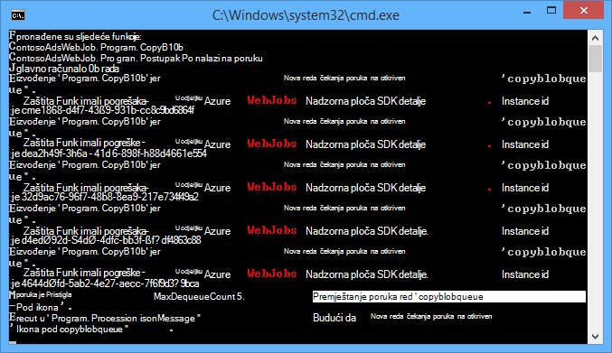
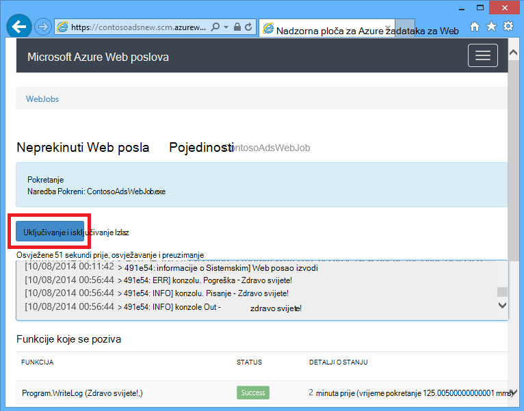
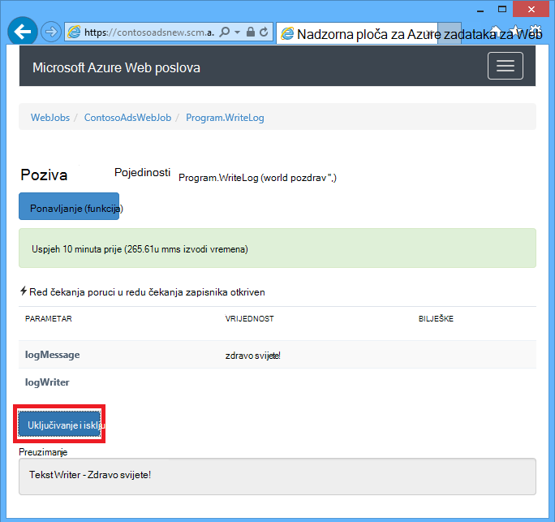
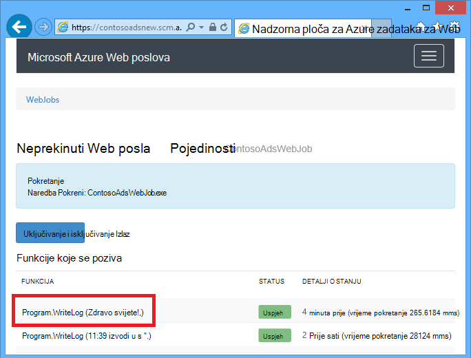
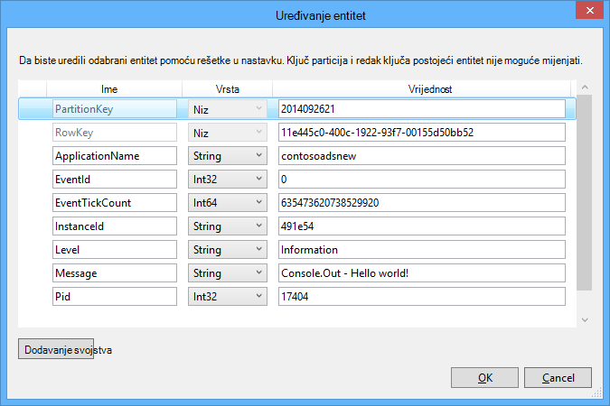
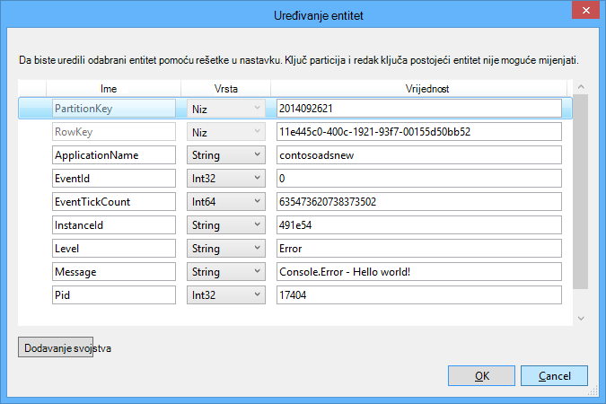

<properties 
    pageTitle="Kako koristiti za pohranu Azure reda čekanja s WebJobs SDK" 
    description="Saznajte kako koristiti za pohranu Azure reda čekanja s WebJobs SDK. Stvaranje i brisanje redova; Umetanje, nakratko, dobiti i brisanje reda čekanja poruke i drugo." 
    services="app-service\web, storage" 
    documentationCenter=".net" 
    authors="tdykstra" 
    manager="wpickett" 
    editor="jimbe"/>

<tags 
    ms.service="app-service-web" 
    ms.workload="web" 
    ms.tgt_pltfrm="na" 
    ms.devlang="dotnet" 
    ms.topic="article" 
    ms.date="06/01/2016" 
    ms.author="tdykstra"/>

# <a name="how-to-use-azure-queue-storage-with-the-webjobs-sdk"></a>Kako koristiti za pohranu Azure reda čekanja s WebJobs SDK

## <a name="overview"></a>Pregled

Ovaj vodič sadrži C# kod primjere koji pokazuju kako pomoću verzije Azure WebJobs SDK 1.x sa servisom Azure reda čekanja za pohranu.

Vodič pretpostavlja znati [kako stvoriti WebJob projekta u Visual Studio sa veze nizovi koji upućuju na račun servisa za pohranu](websites-dotnet-webjobs-sdk-get-started.md#configure-storage) ili s [većim brojem računa za pohranu](https://github.com/Azure/azure-webjobs-sdk/blob/master/test/Microsoft.Azure.WebJobs.Host.EndToEndTests/MultipleStorageAccountsEndToEndTests.cs).

Većina na koda Prikaži samo funkcije, a ne kod koji stvara u `JobHost` objekt kao u ovom primjeru:

        static void Main(string[] args)
        {
            JobHost host = new JobHost();
            host.RunAndBlock();
        }
        
Vodič obuhvaća sljedeće teme:

-   [Kako pokrenuti funkcije primitku poruke reda čekanja](#trigger)
    - Niz reda čekanja poruke
    - POCO reda čekanja poruke
    - Funkcija asinkrone
    - Vrste surađuje atribut QueueTrigger
    - Algoritam ankete
    - Više instanci
    - Paralelni izvođenja
    - Red čekanja ili reda čekanja poruka metapodataka
    - Graceful zatvaranja
-   [Kako stvoriti poruku reda čekanja tijekom obrade poruke reda čekanja](#createqueue)
    - Niz reda čekanja poruke
    - POCO reda čekanja poruke
    - Stvaranje više poruka ili u funkcijama asinkrone
    - Vrste surađuje atribut reda čekanja
    - Korištenje atributa WebJobs SDK u tijelu funkcija
-   [Način za čitanje i pisanje blob-ova tijekom obrade poruke reda čekanja](#blobs)
    - Niz reda čekanja poruke
    - POCO reda čekanja poruke
    - Vrste atribut Blob surađuje
-   [Kako rukovati poison porukama](#poison)
    - Rukovanje automatskog poison poruka
    - Rukovanje ručno poison porukama
-   [Kako postaviti mogućnosti konfiguracije](#config)
    - Postavite nizove SDK veze u kodu
    - Konfiguriranje postavki QueueTrigger
    - Postavljanje vrijednosti za WebJobs SDK Graditelj parametara u kodu
-   [Upute za ručno pokretanje funkcije](#manual)
-   [Kako napisati zapisnika](#logs) 
-   [Upute za obradu pogrešaka i konfiguriranje vremensko ograničenje](#errors)
-   [Daljnji koraci](#nextsteps)

## <a id="trigger"></a>Kako pokrenuti funkcije primitku poruke reda čekanja

Da biste napisali funkcija koja se poziva WebJobs SDK primitku poruke reda čekanja, koristite na `QueueTrigger` atribut. Atribut Graditelj vodi parametra niza koji određuje naziv čekanja za ankete. Možete i [postaviti naziv reda čekanja dinamički](#config).

### <a name="string-queue-messages"></a>Niz reda čekanja poruke

U sljedećem primjeru red sadrži niz poruku, pa `QueueTrigger` primjenjuje se na nizu parametar pod nazivom `logMessage` koja sadrži sadržaj poruke red. Na funkcija [piše poruka zapisnika na nadzornu ploču](#logs).
 

        public static void ProcessQueueMessage([QueueTrigger("logqueue")] string logMessage, TextWriter logger)
        {
            logger.WriteLine(logMessage);
        }

Osim toga `string`, parametar može biti raspon bajtova, na `CloudQueueMessage` objekt ili POCO koju ste definirali.

### <a name="poco-plain-old-clr-objecthttpenwikipediaorgwikiplainoldclrobject-queue-messages"></a>POCO [(običan stari objekt CLR](http://en.wikipedia.org/wiki/Plain_Old_CLR_Object)) red čekanja poruke

U sljedećem primjeru poruka red sadrži JSON za na `BlobInformation` objekt koji sadrži na `BlobName` svojstvo. SDK automatski deserializes objekt.

        public static void WriteLogPOCO([QueueTrigger("logqueue")] BlobInformation blobInfo, TextWriter logger)
        {
            logger.WriteLine("Queue message refers to blob: " + blobInfo.BlobName);
        }

SDK koristi [Newtonsoft.Json NuGet paketa](http://www.nuget.org/packages/Newtonsoft.Json) Serijalizacija i ukloniti serijski broj poruka. Ako stvorite red poruke u programu koji ne koristi WebJobs SDK, možete napisati kod kao u sljedećem primjeru da biste stvorili poruku POCO reda čekanja mogu raščlaniti SDK-a. 

        BlobInformation blobInfo = new BlobInformation() { BlobName = "log.txt" };
        var queueMessage = new CloudQueueMessage(JsonConvert.SerializeObject(blobInfo));
        logQueue.AddMessage(queueMessage);

### <a name="async-functions"></a>Funkcija asinkrone

Na sljedeći asinkrone funkcija [piše zapisnik nadzorne ploče](#logs).

        public async static Task ProcessQueueMessageAsync([QueueTrigger("logqueue")] string logMessage, TextWriter logger)
        {
            await logger.WriteLineAsync(logMessage);
        }

Funkcije asinkrone može potrajati [token otkazivanja](http://www.asp.net/mvc/overview/performance/using-asynchronous-methods-in-aspnet-mvc-4#CancelToken), kao što je prikazano u sljedećem primjeru koja se kopira blob. (Za objašnjenje u `queueTrigger` rezervirano mjesto, u odjeljku [blob-ova](#blobs) .)

        public async static Task ProcessQueueMessageAsyncCancellationToken(
            [QueueTrigger("blobcopyqueue")] string blobName, 
            [Blob("textblobs/{queueTrigger}",FileAccess.Read)] Stream blobInput,
            [Blob("textblobs/{queueTrigger}-new",FileAccess.Write)] Stream blobOutput,
            CancellationToken token)
        {
            await blobInput.CopyToAsync(blobOutput, 4096, token);
        }

### <a id="qtattributetypes"></a>Vrste surađuje atribut QueueTrigger

Možete koristiti `QueueTrigger` sa sljedećim vrstama:

* `string`
* Vrsta POCO serijalizirani kao JSON
* `byte[]`
* `CloudQueueMessage`

### <a id="polling"></a>Algoritam ankete

SDK primjenjuje na slučajni eksponencijalne natrag isključivanje algoritam da biste smanjili efekt neaktivno-reda čekanja provjere na troškovima transakcije prostora za pohranu.  Kada se pronađu poruke, SDK čeka dvije sekunde i provjerava drugu poruku; Kada se poruke ne pronađe čeka oko četiri sekundi prije ponovnog pokušaja. Nakon kasnije nije uspjelo pokušaji reda čekanja poruka, vrijeme čekanja i dalje da biste povećali sve dok ne postignete vrijeme Maksimalna čekanja koji će jedne minute. [Vrijeme čekanja Maksimalna je konfigurirati](#config).

### <a id="instances"></a>Više instanci

Ako web-aplikaciju programa izvodi na više instanci, neprekinuti WebJob pokreće na svakom računalu i svakom računalu će Pričekajte okidača i pokušate pokrenuti funkcije. Red čekanja okidača WebJobs SDK automatski onemogućuje funkcije obradu reda čekanja poruka više puta; funkcija ne morate staviti biti idempotent. Međutim, ako želite biti sigurni pojavljivanje samo jedan te funkcije pokreće čak i kad postoje više instanci glavno računalo web-aplikacije, možete koristiti u `Singleton` atribut. 

### <a id="parallel"></a>Paralelni izvođenja

Ako imate više funkcija slušanje na različitim redovi, SDK će nazovite ih paralelno kada istodobno primljene poruke. 

Isto vrijedi se po primitku više poruka na jedan red. Prema zadanim postavkama SDK dobiva skupine 16 reda čekanja poruka istodobno i izvršava funkcija koja se obrađuje ih paralelno. [Veličina grupe nije moguće konfigurirati](#config). Kada broj obrade dobije prema dolje do polovice veličinu serije, SDK dobiva drugu seriju i pokreće obradu tih poruka. Stoga maksimalni broj Istodobni poruke obrade po funkciji je jedan na pola vremena i obradu veličina. Ovo ograničenje zasebno primjenjuje na svaku funkciju koja ima na `QueueTrigger` atribut. 

Ako ne želite da se paralelno izvođenja za poruke koje ste primili na jednom redu čekanja, možete postaviti veličinu serije 1. Vidi također **veću kontrolu nad Obrada reda** [RTM Azure WebJobs SDK 1.1.0](/blog/azure-webjobs-sdk-1-1-0-rtm/).

### <a id="queuemetadata"></a>Red čekanja ili reda čekanja poruka metapodataka

Sljedeća svojstva poruke možete dobiti dodavanjem parametara u potpis metoda:

* `DateTimeOffset`expirationTime
* `DateTimeOffset`insertionTime
* `DateTimeOffset`nextVisibleTime
* `string`queueTrigger (sadrži tekst poruke)
* `string`ID-a
* `string`popReceipt
* `int`dequeueCount

Ako želite raditi izravno s Azure API-JA za pohranu, možete dodati na `CloudStorageAccount` parametar.

U sljedećem primjeru zapisuje sve ovo metapodataka zapisnik aplikacije informacije. U ovom primjeru sadrže sadržaj poruke reda čekanja logMessage i queueTrigger.

        public static void WriteLog([QueueTrigger("logqueue")] string logMessage,
            DateTimeOffset expirationTime,
            DateTimeOffset insertionTime,
            DateTimeOffset nextVisibleTime,
            string id,
            string popReceipt,
            int dequeueCount,
            string queueTrigger,
            CloudStorageAccount cloudStorageAccount,
            TextWriter logger)
        {
            logger.WriteLine(
                "logMessage={0}\n" +
            "expirationTime={1}\ninsertionTime={2}\n" +
                "nextVisibleTime={3}\n" +
                "id={4}\npopReceipt={5}\ndequeueCount={6}\n" +
                "queue endpoint={7} queueTrigger={8}",
                logMessage, expirationTime,
                insertionTime,
                nextVisibleTime, id,
                popReceipt, dequeueCount,
                cloudStorageAccount.QueueEndpoint,
                queueTrigger);
        }

Evo ogledne zapisnik napisao ogledni kod:

        logMessage=Hello world!
        expirationTime=10/14/2014 10:31:04 PM +00:00
        insertionTime=10/7/2014 10:31:04 PM +00:00
        nextVisibleTime=10/7/2014 10:41:23 PM +00:00
        id=262e49cd-26d3-4303-ae88-33baf8796d91
        popReceipt=AgAAAAMAAAAAAAAAfc9H0n/izwE=
        dequeueCount=1
        queue endpoint=https://contosoads.queue.core.windows.net/
        queueTrigger=Hello world!

### <a id="graceful"></a>Graceful zatvaranja

Funkcija koja se pokreće se u neprekinuti WebJob možete prihvatiti na `CancellationToken` parametar koji omogućuje operacijski sustav će obavijestiti funkciju kada se WebJob uskoro će se prekinuti. Koristite ovu obavijest da biste provjerili ne funkciju neočekivano prekinuti na način koji ostavlja podataka u kojima nisu dosljedno stanju.

Sljedeći primjer prikazuje način da biste provjerili skorom WebJob prekid u funkciji.

    public static void GracefulShutdownDemo(
                [QueueTrigger("inputqueue")] string inputText,
                TextWriter logger,
                CancellationToken token)
    {
        for (int i = 0; i < 100; i++)
        {
            if (token.IsCancellationRequested)
            {
                logger.WriteLine("Function was cancelled at iteration {0}", i);
                break;
            }
            Thread.Sleep(1000);
            logger.WriteLine("Normal processing for queue message={0}", inputText);
        }
    }

**Bilješke:** Na nadzornoj ploči možda neće pravilno prikazati stanje i rezultat funkcije koji imaju isključen.
 
Dodatne informacije potražite u članku [WebJobs Graceful zatvaranja](http://blog.amitapple.com/post/2014/05/webjobs-graceful-shutdown/#.VCt1GXl0wpR).   

## <a id="createqueue"></a>Kako stvoriti poruku reda čekanja tijekom obrade poruke reda čekanja

Da biste napisali funkcija koja se stvara novu poruku reda čekanja, koristite na `Queue` atribut. Kao što su `QueueTrigger`, proslijedite u nazivu reda čekanja kao niz znakova ili možete [postaviti naziv reda čekanja dinamički](#config).

### <a name="string-queue-messages"></a>Niz reda čekanja poruke

Sljedećim primjerom koda koji nisu asinkrone stvara novu poruku reda čekanja u redu čekanja pod nazivom "outputqueue" s istim sadržajem kao poruku reda čekanja primljene u redu čekanja pod nazivom "inputqueue". (Da biste postigli asinkrone koristite funkcije `IAsyncCollector<T>` kao što je prikazano kasnije u ovom odjeljku.)


        public static void CreateQueueMessage(
            [QueueTrigger("inputqueue")] string queueMessage,
            [Queue("outputqueue")] out string outputQueueMessage )
        {
            outputQueueMessage = queueMessage;
        }
  
### <a name="poco-plain-old-clr-objecthttpenwikipediaorgwikiplainoldclrobject-queue-messages"></a>POCO [(običan stari objekt CLR](http://en.wikipedia.org/wiki/Plain_Old_CLR_Object)) red čekanja poruke

Da biste stvorili reda čekanja poruku koja sadrži na POCO umjesto niza, prosljeđivanje vrstu POCO kao izlazni parametar da biste na `Queue` atribut Graditelj.
 
        public static void CreateQueueMessage(
            [QueueTrigger("inputqueue")] BlobInformation blobInfoInput,
            [Queue("outputqueue")] out BlobInformation blobInfoOutput )
        {
            blobInfoOutput = blobInfoInput;
        }

SDK automatski serializes objekt JSON. Red čekanja poruka uvijek stvoriti čak i ako je objekt null.

### <a name="create-multiple-messages-or-in-async-functions"></a>Stvaranje više poruka ili u funkcijama asinkrone

Da biste stvorili više poruka, provjerite vrsta parametra red izlaz `ICollector<T>` ili `IAsyncCollector<T>`, kao što je prikazano u sljedećem primjeru.

        public static void CreateQueueMessages(
            [QueueTrigger("inputqueue")] string queueMessage,
            [Queue("outputqueue")] ICollector<string> outputQueueMessage,
            TextWriter logger)
        {
            logger.WriteLine("Creating 2 messages in outputqueue");
            outputQueueMessage.Add(queueMessage + "1");
            outputQueueMessage.Add(queueMessage + "2");
        }

Svaku poruku reda čekanja stvara se odmah kada na `Add` zove se način.

### <a name="types-that-the-queue-attribute-works-with"></a>Vrste kojima radi atribut reda čekanja

Možete koristiti u `Queue` atribut na sljedećim vrstama parametar:

* `out string`(stvara reda čekanja poruku ako je vrijednost parametra koje nisu null kada istekne funkcija)
* `out byte[]`(način funkcioniranja `string`) 
* `out CloudQueueMessage`(način funkcioniranja `string`) 
* `out POCO`(vrstu serializable stvara poruku s objektom null ako je u parametru null kada istekne funkcija)
* `ICollector`
* `IAsyncCollector`
* `CloudQueue`(za stvaranje poruka ručno izravno pomoću Azure prostora za pohranu API-JA)

### <a id="ibinder"></a>Korištenje atributa WebJobs SDK u tijelu funkcija

Ako morate učiniti nekoliko nedovršenu funkcija prije korištenja WebJobs SDK atribut, kao što su `Queue`, `Blob`, ili `Table`, možete koristiti u `IBinder` sučelja.

U sljedećem primjeru otvara poruku red čekanja i stvara novu poruku s istim sadržajem u redu čekanja za izlaz. Naziv reda čekanja izlaz je postaviti tako da kod u tijelu funkciju.

        public static void CreateQueueMessage(
            [QueueTrigger("inputqueue")] string queueMessage,
            IBinder binder)
        {
            string outputQueueName = "outputqueue" + DateTime.Now.Month.ToString();
            QueueAttribute queueAttribute = new QueueAttribute(outputQueueName);
            CloudQueue outputQueue = binder.Bind<CloudQueue>(queueAttribute);
            outputQueue.AddMessage(new CloudQueueMessage(queueMessage));
        }

Na `IBinder` sučelja mogu se koristiti s na `Table` i `Blob` atribute.

## <a id="blobs"></a>Način za čitanje i pisanje blob-ova i tablice tijekom obrade poruke reda čekanja

Na `Blob` i `Table` atribute omogućuju vam čitanje i pisanje blob-ova i tablice. Uzorci u ovom odjeljku odnose se na blob-ova. Primjere koda koji pokazuju kako pokretanje procesa kada su blob-ova Stvori ili ažurira, potražite u člancima [Korištenje blobova platforme Azure s WebJobs SDK](websites-dotnet-webjobs-sdk-storage-blobs-how-to.md)te primjere koda koji za čitanje i pisanje tablice, potražite [u](websites-dotnet-webjobs-sdk-storage-tables-how-to.md)članku korištenje spremište tablica platforme Azure s WebJobs SDK.

### <a name="string-queue-messages-triggering-blob-operations"></a>Niz reda čekanja poruke pokretanje operacije blobova platforme

Red čekanja poruku koja sadrži niz, `queueTrigger` je rezervirano mjesto u možete koristiti u `Blob` atributa `blobPath` parametar koji sadrži sadržaj poruke. 

Sljedeći primjer koristi `Stream` objekte za čitanje i pisanje blob-ova. Red čekanja poruka da je naziv blob koja se nalazi u spremniku textblobs. Kopiju blob s "– novi" dodan naziv se stvara u istom kontejner. 

        public static void ProcessQueueMessage(
            [QueueTrigger("blobcopyqueue")] string blobName, 
            [Blob("textblobs/{queueTrigger}",FileAccess.Read)] Stream blobInput,
            [Blob("textblobs/{queueTrigger}-new",FileAccess.Write)] Stream blobOutput)
        {
            blobInput.CopyTo(blobOutput, 4096);
        }

Na `Blob` atributa traje Graditelj na `blobPath` parametar koji određuje naziv spremnik i blob. Dodatne informacije o ovom rezerviranom mjestu potražite u članku [upute za korištenje blobova platforme Azure s WebJobs SDK](websites-dotnet-webjobs-sdk-storage-blobs-how-to.md) 

Kada se atribut decorates na `Stream` objekta, drugi Graditelj parametar određuje na `FileAccess` način kao čitanje, pisanje ili čitanje/pisanje. 

Sljedeći primjer koristi u `CloudBlockBlob` objekt koji želite izbrisati blob. Red čekanja poruka da je naziv blob-om.

        public static void DeleteBlob(
            [QueueTrigger("deleteblobqueue")] string blobName,
            [Blob("textblobs/{queueTrigger}")] CloudBlockBlob blobToDelete)
        {
            blobToDelete.Delete();
        }

### <a id="pocoblobs"></a>POCO [(običan stari objekt CLR](http://en.wikipedia.org/wiki/Plain_Old_CLR_Object)) red čekanja poruke

POCO pohranjenih kao JSON u redu čekanja poruci, možete koristiti na rezerviranim mjestima za taj naziv svojstva objekta u na `Queue` atributa `blobPath` parametar. [Nazivi svojstava metapodataka reda čekanja](#queuemetadata) može poslužiti kao rezervirana mjesta. 

U sljedećem primjeru kopira blob novi blob s nastavkom. Red čekanja poruka u `BlobInformation` objekt koji sadrži `BlobName` i `BlobNameWithoutExtension` svojstva. Nazivi svojstava se koriste kao rezervirana mjesta na putu blobova platforme za na `Blob` atribute. 
 
        public static void CopyBlobPOCO(
            [QueueTrigger("copyblobqueue")] BlobInformation blobInfo,
            [Blob("textblobs/{BlobName}", FileAccess.Read)] Stream blobInput,
            [Blob("textblobs/{BlobNameWithoutExtension}.txt", FileAccess.Write)] Stream blobOutput)
        {
            blobInput.CopyTo(blobOutput, 4096);
        }

SDK koristi [Newtonsoft.Json NuGet paketa](http://www.nuget.org/packages/Newtonsoft.Json) Serijalizacija i ukloniti serijski broj poruka. Ako stvorite red poruke u programu koji ne koristi WebJobs SDK, možete napisati kod kao u sljedećem primjeru da biste stvorili poruku POCO reda čekanja mogu raščlaniti SDK-a.

        BlobInformation blobInfo = new BlobInformation() { BlobName = "boot.log", BlobNameWithoutExtension = "boot" };
        var queueMessage = new CloudQueueMessage(JsonConvert.SerializeObject(blobInfo));
        logQueue.AddMessage(queueMessage);

Ako trebate neke nedovršenu funkcija prije povezivanja blob objektu, poslužite se atribut u tijelu funkcija, [kao što je prikazano ranije za atribut reda čekanja](#ibinder).

### <a id="blobattributetypes"></a>Vrste možete koristiti Blob atribut s
 
Na `Blob` atribut može se koristiti sa sljedećim vrstama:

* `Stream`(čitanje ili pisanje naveden pomoću Graditelj parametar FileAccess)
* `TextReader`
* `TextWriter`
* `string`(za čitanje)
* `out string`(pisanje; stvara blob samo ako je parametar niza koje nisu null kada funkcija vraća)
* POCO (za čitanje)
* izvan POCO (pisanje; uvijek stvara blob, stvara kao objekt null ako je parametar POCO null kada funkcija vraća)
* `CloudBlobStream`(pisanje)
* `ICloudBlob`(čitanje ili pisanje)
* `CloudBlockBlob`(čitanje ili pisanje) 
* `CloudPageBlob`(čitanje ili pisanje) 

## <a id="poison"></a>Kako rukovati poison porukama

Poruke čiji je sadržaj uzrokuje funkcija uvoza nazivaju *poison poruke*. Ako funkcija ne uspije, poruke reda čekanja neće se izbrisati naposljetku je sakrije i ponovno uzrokuje ciklusa se ponavljaju. SDK možete automatski prekinuti ciklusu nakon ograničen broj ponavljanja ili to možete učiniti ručno.

### <a name="automatic-poison-message-handling"></a>Rukovanje automatskog poison poruka

SDK će funkcije do 5 puta pozovete da obradi reda čekanja poruke. Peti pokušajte ne uspije, poruke se premješta u poison red. [Maksimalan broj ponovne pokušaje je konfigurirati](#config). 

Red čekanja za poison pod nazivom *{originalqueuename}*-poison. Možete napisati potreban je funkcija proces poruke iz poison reda čekanja tako da ih zapisivanju ili slanja obavijesti te ručno pažnje. 

U sljedećem primjeru u `CopyBlob` funkcija otkazat će se kada reda čekanja poruka sadrži naziv blob koji ne postoji. Kada se to dogodi, poruke se premješta iz copyblobqueue reda čekanja za copyblobqueue poison. Na `ProcessPoisonMessage` zapisnike poison poruku.

        public static void CopyBlob(
            [QueueTrigger("copyblobqueue")] string blobName,
            [Blob("textblobs/{queueTrigger}", FileAccess.Read)] Stream blobInput,
            [Blob("textblobs/{queueTrigger}-new", FileAccess.Write)] Stream blobOutput)
        {
            blobInput.CopyTo(blobOutput, 4096);
        }
        
        public static void ProcessPoisonMessage(
            [QueueTrigger("copyblobqueue-poison")] string blobName, TextWriter logger)
        {
            logger.WriteLine("Failed to copy blob, name=" + blobName);
        }

Sljedeća ilustracija prikazuje konzole za izlaz iz ove funkcije kada poison poruke.



### <a name="manual-poison-message-handling"></a>Rukovanje ručno poison porukama

Koliko je puta poruke izdvojeni prema gore za obradu možete dobiti dodavanjem programa `int` parametar pod nazivom `dequeueCount` da biste funkcija. Zatim možete provjeriti broj dequeue na kod funkcije i izvođenje vlastite poison Rukovanje porukama kada broj premaši praga, kao što je prikazano u sljedećem primjeru.

        public static void CopyBlob(
            [QueueTrigger("copyblobqueue")] string blobName, int dequeueCount,
            [Blob("textblobs/{queueTrigger}", FileAccess.Read)] Stream blobInput,
            [Blob("textblobs/{queueTrigger}-new", FileAccess.Write)] Stream blobOutput,
            TextWriter logger)
        {
            if (dequeueCount > 3)
            {
                logger.WriteLine("Failed to copy blob, name=" + blobName);
            }
            else
            {
            blobInput.CopyTo(blobOutput, 4096);
            }
        }

## <a id="config"></a>Kako postaviti mogućnosti konfiguracije

Možete koristiti u `JobHostConfiguration` vrsta postaviti sljedeće mogućnosti konfiguracije:

* Postavite nizove veze SDK u kodu.
* Konfiguriranje `QueueTrigger` postavke kao što je najviše dequeue count.
* Red čekanja imena zatražite od konfiguracije.

### <a id="setconnstr"></a>Postavite nizove SDK veze u kodu

Postavljanje veze nizovi SDK u kodu omogućuje vam da biste koristili vlastite nazive niz veze u konfiguraciji datoteke ili varijable okruženja, kao što je prikazano u sljedećem primjeru.

        static void Main(string[] args)
        {
            var _storageConn = ConfigurationManager
                .ConnectionStrings["MyStorageConnection"].ConnectionString;
        
            var _dashboardConn = ConfigurationManager
                .ConnectionStrings["MyDashboardConnection"].ConnectionString;
        
            var _serviceBusConn = ConfigurationManager
                .ConnectionStrings["MyServiceBusConnection"].ConnectionString;
        
            JobHostConfiguration config = new JobHostConfiguration();
            config.StorageConnectionString = _storageConn;
            config.DashboardConnectionString = _dashboardConn;
            config.ServiceBusConnectionString = _serviceBusConn;
            JobHost host = new JobHost(config);
            host.RunAndBlock();
        }

### <a id="configqueue"></a>Konfiguriranje postavki QueueTrigger

Možete konfigurirati sljedeće postavke koje se odnose na obrade poruke reda čekanja:

- Maksimalni broj reda čekanja poruke koje se izdvajaju gore istodobno izvršavanje paralelno (Zadana vrijednost je 16).
- Maksimalni broj ponovne pokušaje prije slanja poruke reda čekanja za poison (Zadana vrijednost je 5).
- Maksimalno vrijeme prije provjere ponovno kada je prazan reda čekanja (Zadana vrijednost je 1 minute).

Sljedeći primjer pokazuje kako konfigurirati sljedeće postavke:

        static void Main(string[] args)
        {
            JobHostConfiguration config = new JobHostConfiguration();
            config.Queues.BatchSize = 8;
            config.Queues.MaxDequeueCount = 4;
            config.Queues.MaxPollingInterval = TimeSpan.FromSeconds(15);
            JobHost host = new JobHost(config);
            host.RunAndBlock();
        }

### <a id="setnamesincode"></a>Postavljanje vrijednosti za WebJobs SDK Graditelj parametara u kodu

Katkad je potrebno navesti naziv reda čekanja, naziv blob ili spremnik ili na naziv tablice u kod umjesto koda napravili ga. Na primjer, možda želite navesti naziv reda čekanja za `QueueTrigger` u konfiguraciji datoteku ili okruženje varijabli. 

To možete učiniti tako da Prenos u na `NameResolver` objekt da biste na `JobHostConfiguration` vrsta. Sadrže posebne rezervirana mjesta za koje vam okruženo znak postotka (%) u WebJobs SDK atribut Graditelj parametre i `NameResolver` kod određuje stvarnih vrijednosti koje će se koristiti umjesto te rezervirana mjesta.

Ako, na primjer, pretpostavimo da želite koristiti reda pod nazivom logqueuetest u okruženju probno i jedan imenovani logqueueprod u radni. Umjesto naziva programiranih reda čekanja želite navesti naziv unosa u na `appSettings` zbirke koju želite imati naziv stvarni red. Ako u `appSettings` ključ je logqueue, funkcija može izgledati kao u sljedećem primjeru.

        public static void WriteLog([QueueTrigger("%logqueue%")] string logMessage)
        {
            Console.WriteLine(logMessage);
        }

Vaše `NameResolver` klase nije moguće dobiti naziv reda čekanja iz `appSettings` kao što je prikazano u sljedećem primjeru:

        public class QueueNameResolver : INameResolver
        {
            public string Resolve(string name)
            {
                return ConfigurationManager.AppSettings[name].ToString();
            }
        }

Proslijedite na `NameResolver` klase u da biste na `JobHost` objekt kao što je prikazano u sljedećem primjeru.

        static void Main(string[] args)
        {
            JobHostConfiguration config = new JobHostConfiguration();
            config.NameResolver = new QueueNameResolver();
            JobHost host = new JobHost(config);
            host.RunAndBlock();
        }
 
**Bilješke:** Red čekanja, tablice i nazivi blob su razriješiti svaki put kada se naziva funkcije, ali blob spremnik imena su razriješena samo prilikom pokretanja aplikacije. Ne možete promijeniti naziv spremnika blob dok se izvodi posao. 

## <a id="manual"></a>Upute za ručno pokretanje funkcije

Da biste ručno pokrenuti funkciju koristite na `Call` ili `CallAsync` način na na `JobHost` objekta i `NoAutomaticTrigger` atributa funkcija, kao što je prikazano u sljedećem primjeru. 

        public class Program
        {
            static void Main(string[] args)
            {
                JobHost host = new JobHost();
                host.Call(typeof(Program).GetMethod("CreateQueueMessage"), new { value = "Hello world!" });
            }
        
            [NoAutomaticTrigger]
            public static void CreateQueueMessage(
                TextWriter logger, 
                string value, 
                [Queue("outputqueue")] out string message)
            {
                message = value;
                logger.WriteLine("Creating queue message: ", message);
            }
        }

## <a id="logs"></a>Kako napisati zapisnika

Na nadzornoj ploči zapisnici prikazuju se na dva mjesta: na stranicu za na WebJob i stranice za određeni WebJob poziva. 





Izlaz iz konzole metode koje mogu pozivati u funkciji ili u programu na `Main()` pojavit će se način u stranicu nadzorne ploče za u WebJob, a ne u stranicu za određeni način poziva. Izlaz iz ZapisivačTeksta objekta koji ste dobili od parametra u način potpis prikazuje se na stranicu nadzorne ploče za metodu poziva.

Izlaz konzole nije se moguće povezati na određeni način poziva jer konzolu jednom niti, pokrenutom mnoge funkcije posla može biti istodobno. Zbog SDK-a nudi svake funkcije poziva s vlastitom objektom writer jedinstveni zapisnika.

Da biste napisali [aplikacije praćenje zapisnike](web-sites-dotnet-troubleshoot-visual-studio.md#logsoverview), koristite `Console.Out` (stvara zapisnika označene kao informacije) i `Console.Error` (stvara zapisnika označena kao pogreška). Alternative jest korištenje [praćenja ili TraceSource](http://blogs.msdn.com/b/mcsuksoldev/archive/2014/09/04/adding-trace-to-azure-web-sites-and-web-jobs.aspx), koji omogućuje tekstni, upozorenja i kritično razine osim informacije i pogreške. Aplikacija praćenje zapisnika pojavi web app zapisničke datoteke, Azure tablice ili Azure blob-ova ovisno o tome kako konfigurirati Azure web-aplikaciju programa. Kao što su ispunjeni svi konzole izlaza, zapisnike zadnjih 100 aplikacije i prikazati u stranicu nadzorne ploče WebJob, a ne na stranici za funkciju poziva. 

Izlaz konzole pojavljuje se na nadzornoj ploči samo ako je program pokrenut u WebJob programa Azure ne ako program izvodi lokalno ili u nekim okruženju.

Onemogućivanje zapisivanja nadzorne ploče za scenarije visoke propusnost. Prema zadanim postavkama SDK piše zapisnika za pohranu i aktivnost nije slabije performanse prilikom su obrade velik broj poruka. Da biste onemogućili zapisivanje, postavite niz za povezivanje nadzorne ploče na null kao što je prikazano u sljedećem primjeru.

        JobHostConfiguration config = new JobHostConfiguration();       
        config.DashboardConnectionString = "";        
        JobHost host = new JobHost(config);
        host.RunAndBlock();

Sljedeći primjer prikazuje nekoliko načina pisanja zapisnika:

        public static void WriteLog(
            [QueueTrigger("logqueue")] string logMessage,
            TextWriter logger)
        {
            Console.WriteLine("Console.Write - " + logMessage);
            Console.Out.WriteLine("Console.Out - " + logMessage);
            Console.Error.WriteLine("Console.Error - " + logMessage);
            logger.WriteLine("TextWriter - " + logMessage);
        }

U WebJobs SDK nadzorne ploče, Izlaz iz na `TextWriter` objekt prikazuje se kada otvorite stranicu za određenom funkcija poziva i kliknite **Izlaz za uključivanje i isključivanje**:




Nadzornoj ploči SDK WebJobs, zadnjih 100 retke konzole za izlaz Prikaži gore kada otvorite stranicu za WebJob (ne i za pozivanje – opis funkcije) i kliknite **Izlaz uključivanja ili isključivanja**.
 


U neprekinuti WebJob, zapisnika aplikacije prikazivati u/podataka/poslove/neprekinuti /*{webjobname}*/job_log.txt u datotečnom sustavu web app.

        [09/26/2014 21:01:13 > 491e54: INFO] Console.Write - Hello world!
        [09/26/2014 21:01:13 > 491e54: ERR ] Console.Error - Hello world!
        [09/26/2014 21:01:13 > 491e54: INFO] Console.Out - Hello world!

U programa Azure bloba aplikacije zapisnika izgleda ovako: 2014.-09-26T21:01:13,Information,contosoadsnew,491e54,635473620738373502,0,17404,17,Console.Write - svijeta pozdrav!, 2014.-09-26T21:01:13,Error,contosoadsnew,491e54,635473620738373502,0,17404,19,Console.Error - svijeta pozdrav!, 2014.-09-26T21:01:13,Information,contosoadsnew,491e54,635473620738529920,0,17404,17,Console.Out - svijeta pozdrav!,

I u tablici programa Azure na `Console.Out` i `Console.Error` zapisnika izgledati ovako:





Ako želite priključiti vlastite zapisivaču, pročitajte članak [u ovom se primjeru](http://github.com/Azure/azure-webjobs-sdk-samples/blob/master/BasicSamples/MiscOperations/Program.cs).

## <a id="errors"></a>Upute za obradu pogrešaka i konfiguriranje vremensko ograničenje

WebJobs SDK obuhvaća i [vremenskog ograničenja](http://github.com/Azure/azure-webjobs-sdk-samples/blob/master/BasicSamples/MiscOperations/Functions.cs) atributa koje možete koristiti čega funkcija se otkazuje ako se ne dovrši unutar određenog vremena. A ako želite podići upozorenja kada previše pogrešaka započeti u određeno vrijeme, možete koristiti u `ErrorTrigger` atribut. Evo jednog [primjera ErrorTrigger](https://github.com/Azure/azure-webjobs-sdk-extensions/wiki/Error-Monitoring).

```
public static void ErrorMonitor(
[ErrorTrigger("00:01:00", 1)] TraceFilter filter, TextWriter log,
[SendGrid(
    To = "admin@emailaddress.com",
    Subject = "Error!")]
 SendGridMessage message)
{
    // log last 5 detailed errors to the Dashboard
   log.WriteLine(filter.GetDetailedMessage(5));
   message.Text = filter.GetDetailedMessage(1);
}
```

Možete i dinamički onemogućivanje i omogućivanje funkcije kontrolu hoće li se oni mogu se pokrenuti, pomoću prekidača konfiguracije koji se mogu postavka app ili naziv varijable okruženja. Ogledni kod potražite u članku na `Disable` atribut u [spremištu WebJobs SDK uzorka](https://github.com/Azure/azure-webjobs-sdk-samples/blob/master/BasicSamples/MiscOperations/Functions.cs).

## <a id="nextsteps"></a>Daljnji koraci

Ovaj vodič nudi primjere koda koji pokazuju kako rukovati uobičajeni scenariji za rad s Azure redova. Dodatne informacije o korištenju Azure WebJobs i WebJobs SDK potražite u članku [Azure WebJobs preporučuje resursi](http://go.microsoft.com/fwlink/?linkid=390226).
 
