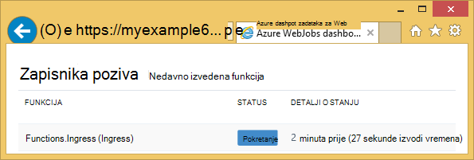
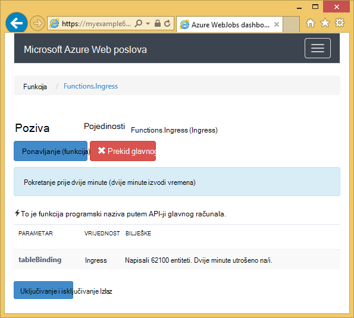
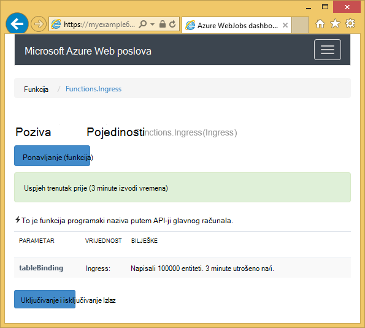

<properties 
    pageTitle="Kako koristiti spremište tablica platforme Azure s WebJobs SDK" 
    description="Saznajte kako koristiti spremište tablica platforme Azure s WebJobs SDK. Stvaranje tablice, dodate entiteti tablice i pročitajte postojeće tablice." 
    services="app-service\web, storage" 
    documentationCenter=".net" 
    authors="tdykstra" 
    manager="wpickett" 
    editor="jimbe"/>

<tags 
    ms.service="app-service-web" 
    ms.workload="web" 
    ms.tgt_pltfrm="na" 
    ms.devlang="dotnet" 
    ms.topic="article" 
    ms.date="06/01/2016" 
    ms.author="tdykstra"/>

# Kako koristiti spremište tablica platforme Azure s WebJobs SDK

## Pregled

Ovaj vodič sadrži C# kod primjere koji pokazuju kako za čitanje i pisanje Azure spremišta tablica pomoću [WebJobs SDK](websites-dotnet-webjobs-sdk.md) verzije 1.x.

Vodič pretpostavlja znati [kako stvoriti WebJob projekta u Visual Studio s nizovima veze koji upućuju na račun servisa za pohranu](websites-dotnet-webjobs-sdk-get-started.md) ili s [većim brojem računa za pohranu](https://github.com/Azure/azure-webjobs-sdk/blob/master/test/Microsoft.Azure.WebJobs.Host.EndToEndTests/MultipleStorageAccountsEndToEndTests.cs).
        
Neke od isječci Prikaži kod u `Table` atributa koji se koristi u funkcijama koje nisu [naziva ručno](websites-dotnet-webjobs-sdk-storage-queues-how-to.md#manual), odnosno pomoću neke od atribute okidača. 

## Kako dodati entiteti u tablicu

Da biste tablicu dodali entiteti, koristite na `Table` atribut s programa `ICollector<T>` ili `IAsyncCollector<T>` parametar gdje `T` određuje sheme entiteti koju želite dodati. Atribut Graditelj vodi parametra niza koji određuje naziv tablice. 

Sljedećim primjerom koda dodaje `Person` entiteti tablice pod nazivom *Ingress*.

        [NoAutomaticTrigger]
        public static void IngressDemo(
            [Table("Ingress")] ICollector<Person> tableBinding)
        {
            for (int i = 0; i < 100000; i++)
            {
                tableBinding.Add(
                    new Person() { 
                        PartitionKey = "Test", 
                        RowKey = i.ToString(), 
                        Name = "Name" }
                    );
            }
        }

Obično vrstu koristite s `ICollector` izvedena iz `TableEntity` ili implementira `ITableEntity`, ali ne mora. Bilo koji od sljedećih `Person` klasa iz registra rad s kôda prikazanog u prethodni `Ingress` način.

        public class Person : TableEntity
        {
            public string Name { get; set; }
        }

        public class Person
        {
            public string PartitionKey { get; set; }
            public string RowKey { get; set; }
            public string Name { get; set; }
        }

Ako želite raditi izravno s Azure API-JA za pohranu, možete dodati na `CloudStorageAccount` parametar potpis metode.

## Nadzor u stvarnom vremenu

Jer funkcije ingress podataka često obrada velike količine podataka, na nadzornoj ploči WebJobs SDK sadrži podatke u stvarnom vremenu nadzora. U odjeljku **Zapisnika poziva** obavijestit će vas ako i dalje instaliran funkciju.

Stranicu s **Detaljima poziva** izvješća tijeka funkcije (broj entiteti zapisan) dok se izvodi i da bi vam omogućuje da ga je prekinuti. 

Kada se dovrši funkciju, stranicu s **Detaljima poziva** izvješća broj redaka koji su zapisan.

## Kako čitati više entiteti iz tablice

Da biste pročitali tablice, koristite na `Table` atributa pomoću programa `IQueryable<T>` parametar gdje upišite `T` izvedena iz `TableEntity` ili implementira `ITableEntity`.

Sljedećim primjerom koda čita i zapisuje sve retke iz na `Ingress` tablice:
 
        public static void ReadTable(
            [Table("Ingress")] IQueryable<Person> tableBinding,
            TextWriter logger)
        {
            var query = from p in tableBinding select p;
            foreach (Person person in query)
            {
                logger.WriteLine("PK:{0}, RK:{1}, Name:{2}", 
                    person.PartitionKey, person.RowKey, person.Name);
            }
        }

### Kako čitati jedan entitet iz tablice

Postoji u `Table` Graditelj atribut s dvije dodatne parametre koje omogućuju vam navođenje particija ključ i ključ retka kada želite povezati s jednom tablicom entitet.

Sljedećim primjerom koda čita redak tablice za na `Person` entitet na temelju particija ključ i redak vrijednosti ključa primljene u poruci reda čekanja:  

        public static void ReadTableEntity(
            [QueueTrigger("inputqueue")] Person personInQueue,
            [Table("persontable","{PartitionKey}", "{RowKey}")] Person personInTable,
            TextWriter logger)
        {
            if (personInTable == null)
            {
                logger.WriteLine("Person not found: PK:{0}, RK:{1}",
                        personInQueue.PartitionKey, personInQueue.RowKey);
            }
            else
            {
                logger.WriteLine("Person found: PK:{0}, RK:{1}, Name:{2}",
                        personInTable.PartitionKey, personInTable.RowKey, personInTable.Name);
            }
        }

Na `Person` klase u ovom primjeru nema implementaciju `ITableEntity`.

## Kako koristiti za pohranu API .NET izravno za rad s tablicom

Možete koristiti u `Table` atribut s na `CloudTable` objekt radi dodatne fleksibilnosti pri radu s tablicom.

Sljedeći kod koristi Ogledna na `CloudTable` objekt da biste dodali jedan entitet *Ingress* tablicu. 
 
        public static void UseStorageAPI(
            [Table("Ingress")] CloudTable tableBinding,
            TextWriter logger)
        {
            var person = new Person()
                {
                    PartitionKey = "Test",
                    RowKey = "100",
                    Name = "Name"
                };
            TableOperation insertOperation = TableOperation.Insert(person);
            tableBinding.Execute(insertOperation);
        }

Dodatne informacije o tome kako koristiti u `CloudTable` objekta, pogledajte [upute za korištenje spremišta tablica iz .NET](../storage/storage-dotnet-how-to-use-tables.md). 

## Povezane teme prekriveni članak s uputama reda čekanja

Informacije o kako rukovati obrada tablica koji se prikazuje po redu čekanja poruci ili WebJobs SDK scenarije nisu specifične za tablici obrada, informirajte [se o korištenju Azure reda čekanja za pohranu s WebJobs SDK](websites-dotnet-webjobs-sdk-storage-queues-how-to.md). 

Teme u tom članku obuhvaćaju sljedeće:

* Funkcija asinkrone
* Više instanci
* Graceful zatvaranja
* Korištenje atributa WebJobs SDK u tijelu funkcija
* Postavljanje SDK nizu za povezivanje u kodu
* Postavljanje vrijednosti za WebJobs SDK Graditelj parametara u kodu
* Ručno pokretanje funkcije
* Pisanje zapisnika

## Daljnji koraci

Ovaj vodič nudi primjere koda koji pokazuju kako rukovati uobičajeni scenariji za rad s tablicama Azure. Dodatne informacije o korištenju Azure WebJobs i WebJobs SDK potražite u članku [Azure WebJobs preporučuje resursi](http://go.microsoft.com/fwlink/?linkid=390226).
 
