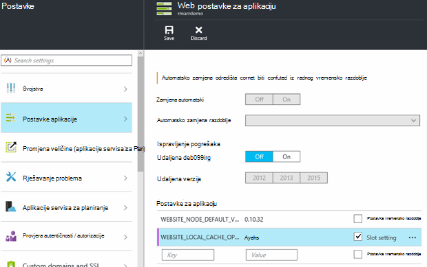

<properties
   pageTitle="Pregled Azure lokalne predmemorije aplikacije servisa | Microsoft Azure"
   description="U ovom se članku opisuje kako omogućiti, promjena veličine i status značajku Azure aplikacije servisa lokalne predmemorije upita"
   services="app-service"
   documentationCenter="app-service"
   authors="SyntaxC4"
   manager="yochayk"
   editor=""
   tags="optional"
   keywords=""/>

<tags
   ms.service="app-service"
   ms.devlang="multiple"
   ms.topic="article"
   ms.tgt_pltfrm="na"
   ms.workload="na"
   ms.date="03/04/2016"
   ms.author="cfowler"/>

# <a name="azure-app-service-local-cache-overview"></a>Pregled Azure lokalne predmemorije aplikacije servisa

Azure web-aplikacije sadržaj pohranjen na Azure prostora za pohranu i naredbama gore durable način kao sadržaja zajedničko korištenje. Ovaj dizajn namijenjen za rad s različitim aplikacije i sljedećim atributima:  

* Sadržaj je zajedničke više instanci virtualnog računala (VM) web-aplikacije.
* Sadržaj je durable i može se mijenjati tako da pokrenete web-aplikacije.
* Zapisničke datoteke i datoteke dijagnostičkih podataka dostupnih u odjeljku u istu mapu zajednički sadržaj.
* Objavljivanje izravno novi sadržaj ažurira sadržaja mape. Odmah možete pogledati isti sadržaj putem web-mjestu IO i pokrenuti web-aplikacije (obično neke tehnologije kao što su ASP.NET pokretanje web app ponovno pokretanje računala na neke promjene datoteke za pristup najnovijem sadržaju).

Dok je mnogo web-aplikacije koristiti jedan ili sve od tih značajki, neki web-aplikacije samo morate visokih performansi, samo za čitanje sadržaja spremište koje mogu pokrenuti iz visoke dostupnosti. Aplikacije su prednosti VM pojavljivanja određene lokalne predmemorije.

Značajka Azure aplikacije servisa lokalne predmemorije omogućuje prikaz uloga web sadržaja. Sadržaj je predmemoriju za pisanje, ali i Odbaci prostora za pohranu sadržaja koji je stvoren asinkrono pri pokretanju web-mjesta. Kada je spreman predmemoriju web-mjesto je promijenio da biste pokrenuli autentičnosti predmemorije sadržaja. Web-aplikacije koji se izvode na lokalnu predmemoriju imati sljedeće prednosti:

* To su immune za latencies koji se pojavljuju prilikom pristupa sadržaja na Azure prostora za pohranu.
* To su immune planiranog nadogradnji ili neplanirano downtimes i sve druge to izbjeglo s Azure prostora za pohranu koji se pojavljuju na poslužiteljima koji služe sadržaja zajedničko korištenje.
* Imaju manje ponovnog pokretanja aplikacije zbog promjena prostora za pohranu zajedničko korištenje.

## <a name="how-local-cache-changes-the-behavior-of-app-service"></a>Način na koji lokalne predmemorije mijenja ponašanje aplikacije servisa

* Lokalne predmemorije je kopija /site i /siteextensions mape web-aplikacije. Stvara se na lokalnu instancu VM pri pokretanju web app. Veličina lokalne predmemorije po web-aplikacije ograničeno je na 300 MB po zadanom, no možete povećati do 1 GB.
* Lokalne predmemorije je čitanja i pisanja. Međutim, sve izmjene odbacit će se kada web-aplikaciji premješta virtualnim strojevima ili se pokrene. Nemojte koristiti lokalne predmemorije za aplikacije pohranjujete zaštita njihove privatnosti ovise ključne podatke u trgovini sadržaja.
* Web-aplikacije možete nastaviti pisati zapisničke datoteke i dijagnostičkih podataka kao trenutno radite. Zapisničke datoteke i podatke, no se pohranjuju lokalno na na VM. Zatim se kopiraju putem povremeno u trgovini zajedničkog sadržaja. Kopiraj zajedničke sadržajem pohrana je najpovoljnijeg trud – pisanje stvara mogu biti izgubljeni dospijeća iznenadno pad VM instance.
* Nema promjena u struktura mapa za mape LogFiles i podataka za web-aplikacije koja koristi lokalni predmemoriju. Sada postoje podmape u prostor za pohranu mape LogFiles i podatke koji slijede obrazac imenovanja "Jedinstveni identifikator" + vremensku oznaku. Svaki podmape odgovara VM instancu koji se izvodi web-aplikaciji ili pokrenuta.  
* Objavljivanje promjene u web-aplikaciji putem bilo koji od objavljivanje mehanizme objaviti u trgovini zajedničkog sadržaja. To je namjerno jer želimo objavljeni sadržaj biti durable. Da biste osvježili lokalne predmemorije web-aplikacije, je potrebno je ponovno pokrenuti. To čini kao što su viškom korak? Da biste životnom ciklusu objedinjenog, pogledajte informacije u nastavku ovog članka.
* D:\Home će pokažite na lokalnu predmemoriju. D:\Local će i dalje koja pokazuje na privremene VM određene prostora za pohranu.
* Zadani prikaz sadržaja web-mjesta IO će i dalje biti koji zajednički sadržajem pohrana.

## <a name="enable-local-cache-in-app-service"></a>Omogućivanje lokalne predmemorije u servisu aplikacije

Konfiguriranje lokalne predmemorije pomoću kombinacija postavki rezervirane aplikacije. Postavke za aplikaciju možete konfigurirati na sljedeće načine:

* [Portal za Azure](#Configure-Local-Cache-Portal)
* [Azure Voditelj resursa](#Configure-Local-Cache-ARM)

### <a name="configure-local-cache-by-using-the-azure-portal"></a>Konfiguriranje lokalne predmemorije pomoću portala za Azure
<a name="Configure-Local-Cache-Portal"></a>

Omogućivanje lokalne predmemorije na temelju po – web-aplikacije pomoću ove postavke za aplikaciju:`WEBSITE_LOCAL_CACHE_OPTION` = `Always`  



### <a name="configure-local-cache-by-using-azure-resource-manager"></a>Konfiguriranje lokalne predmemorije pomoću upravitelja resursa za Azure
<a name="Configure-Local-Cache-ARM"></a>

```
...

{
    "apiVersion": "2015-08-01",
    "type": "config",
    "name": "appsettings",
    "dependsOn": [
        "[resourceId('Microsoft.Web/sites/', variables('siteName'))]"
    ],
    "properties": {
        "WEBSITE_LOCAL_CACHE_OPTION": "Always",
        "WEBSITE_LOCAL_CACHE_SIZEINMB": "300"
    }
}

...
```

## <a name="change-the-size-setting-in-local-cache"></a>Promijenite postavku veličina u lokalnu predmemoriju

Prema zadanim postavkama, veličina predmemorije lokalni je **300 MB**. To obuhvaća na /site i /siteextensions mape koje se kopiraju iz spremišta sadržaja, kao i sve lokalno stvoreni zapisnika i podataka iz mape. Da biste povećali to ograničenje, koristite postavke za aplikaciju `WEBSITE_LOCAL_CACHE_SIZEINMB`. Možete povećati veličinu do **1 GB** (1000 MB) po web-aplikacije.

## <a name="best-practices-for-using-app-service-local-cache"></a>Praktični savjeti za korištenje aplikacije servisa lokalne predmemorije

Preporučujemo da koristite lokalne predmemorije u kombinaciji sa značajkom [Pripremna okruženja](../app-service-web/web-sites-staged-publishing.md) .

* Dodavanje _Ljepljive_ postavka app `WEBSITE_LOCAL_CACHE_OPTION` vrijednošću `Always` za vaš **radni** vremensko razdoblje. Ako koristite `WEBSITE_LOCAL_CACHE_SIZEINMB`, i dodajte je kao ljepljive postavke za vaš radni vremensko razdoblje.
* Stvaranje vremensko razdoblje **pripremna** i objavite svoje pripremna vremensko razdoblje. Obično ne postavite vremensko razdoblje pripremna da biste koristili lokalne predmemorije da biste omogućili objedinjenog životni ciklus Sastavi-implementacija-test za pripremna ako se pojavi prednosti lokalne predmemorije za jedno područje radnog.
*   Testirajte web-mjesta na temelju vašeg pripremna vremensko razdoblje.  
*   Kada ste spremni, izdali [Zamijeni operacija](../app-service-web/web-sites-staged-publishing.md#to-swap-deployment-slots) između vaše slobodnih pripremna i radnih.  
*   Ljepljive postavke obuhvaćaju naziva i ljepljive da biste na vremensko razdoblje. Tako da kada vremensko razdoblje pripremna zamjenjuju dobiti u proizvodnje, ga će nasljeđuju postavke lokalne predmemorije aplikacije. Upravo zamijenjene razdoblje radnog pokrenut će protiv lokalne predmemorije nakon nekoliko minuta, te će se warmed kao dio warmup vremensko razdoblje nakon Zamijeni. Pa po završetku zamjena vremensko razdoblje vremensko razdoblje vašeg radnog će imati protiv lokalne predmemorije.

## <a name="frequently-asked-questions-faq"></a>Najčešća pitanja

### <a name="how-can-i-tell-if-local-cache-applies-to-my-web-app"></a>Kako znati je li lokalne predmemorije primjenjuje Moje web-aplikaciju?

Ako web-aplikaciju programa mora visokih performansi, pouzdanog sadržajem pohrana koristiti sadržajem pohrana za pisanje ključnih podataka prilikom izvođenja te je manji od 1 GB u ukupnu veličinu, zatim odgovor je "da"! Da biste dobili ukupnu veličinu mape /site i /siteextensions, možete koristiti web-mjesta proširenje "Azure Web Apps na disku korištenje".  

### <a name="how-can-i-tell-if-my-site-has-switched-to-using-local-cache"></a>Kako znati je li Moje web-mjesto je promijenio pomoću lokalne predmemorije?

Ako koristite značajku lokalne predmemorije s okruženjima pripremna zamjena operacija ne dovrši dok je lokalne predmemorije warmed prema gore. Da biste provjerili je li web-mjesto pokrenut protiv lokalne predmemorije, možete provjeriti varijablu okruženja radnih procesa `WEBSITE_LOCALCACHE_READY`. Poslužite se uputama na stranici [varijablu okruženja postupak radnih](https://github.com/projectkudu/kudu/wiki/Process-Threads-list-and-minidump-gcdump-diagsession#process-environment-variable) da biste pristupili varijablu okruženja postupak tempiranja na više instanci.  

### <a name="i-just-published-new-changes-but-my-web-app-does-not-seem-to-have-them-why"></a>Upravo objavili novih promjena, ali Moja web app čini se da ste ih. Zašto?

Ako web-aplikaciju programa koristi lokalne predmemorije, morate ponovno pokrenuti web-mjesta da biste dobili najnovije promjene. Ne želite da objavite promjene radnog web-mjesta? U odjeljku mogućnosti vremensko razdoblje u prethodnom odjeljku najbolje prakse.

### <a name="where-are-my-logs"></a>Gdje su zapisnike?

S lokalne predmemorije zapisnicima i mape podataka izgleda malo drugačije. Međutim, strukturu na podmape ostaje ista, osim što su podmape nestled u odjeljku podmapu pomoću oblika "jedinstveni VM identifikator" + vremensku oznaku.

### <a name="i-have-local-cache-enabled-but-my-web-app-still-gets-restarted-why-is-that-i-thought-local-cache-helped-with-frequent-app-restarts"></a>Imam lokalne predmemorije omogućena, ali Moja web app i dalje će ponovno pokrenuti. Zašto? Li mislili lokalne predmemorije pomaže s često korištenih aplikacije ponovnog pokretanja.

Lokalne predmemorije spriječiti ponovnog pokretanja vezane uz pohranu web app. Međutim, web-aplikaciju programa i dalje nije undergo ponovnog pokretanja tijekom nadogradnje planiranog infrastrukture u VM. Cjelokupan ponovnog pokretanja aplikacije koji se pojaviti s lokalne predmemorije omogućeno trebaju biti manje.
