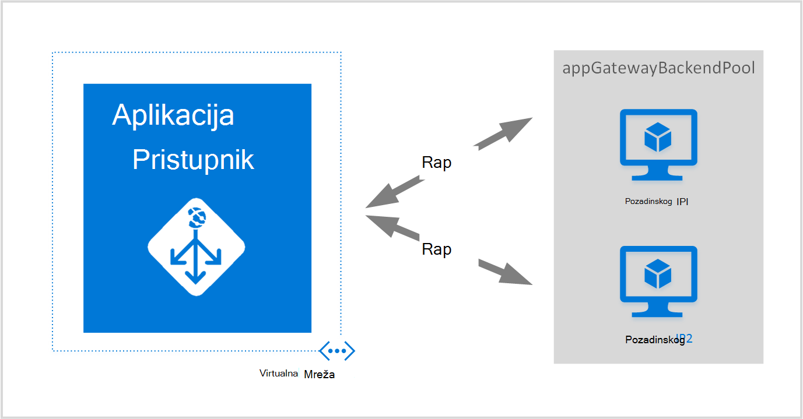
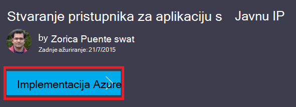
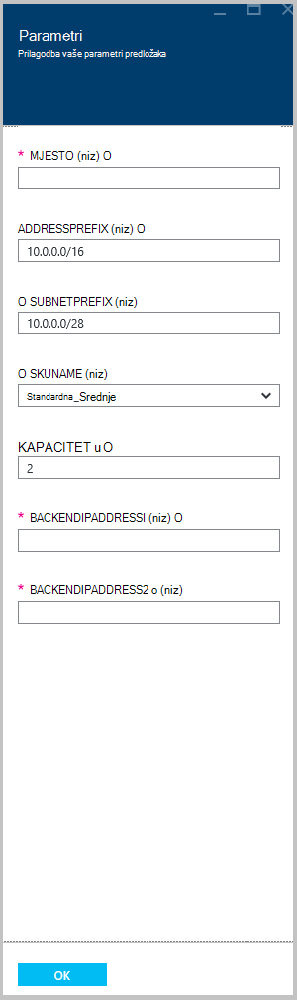

<properties
   pageTitle="Stvaranje pristupnika za aplikacije pomoću predložaka Voditelj resursa Azure | Microsoft Azure"
   description="Ova stranica sadrži upute da biste stvorili pristupnik za Azure računala pomoću predloška Azure Voditelj resursa"
   documentationCenter="na"
   services="application-gateway"
   authors="georgewallace"
   manager="carmonm"
   editor="tysonn"/>
<tags
   ms.service="application-gateway"
   ms.devlang="na"
   ms.topic="article"
   ms.tgt_pltfrm="na"
   ms.workload="infrastructure-services"
   ms.date="10/25/2016"
   ms.author="gwallace"/>

# Stvaranje pristupnika za računala pomoću predloška Azure Voditelj resursa

> [AZURE.SELECTOR]
- [Portal za Azure](application-gateway-create-gateway-portal.md)
- [Azure PowerShell Voditelj resursa](application-gateway-create-gateway-arm.md)
- [Azure klasični PowerShell](application-gateway-create-gateway.md)
- [Predloška Azure Voditelj resursa](application-gateway-create-gateway-arm-template.md)
- [Azure EŽA](application-gateway-create-gateway-cli.md)

Azure aplikacije pristupnik je sloj 7 opterećenja. Hoće li se nalaze na oblaku ili na lokalnim poslužiteljima, omogućuje prebacivanje, performanse usmjeravanje HTTP zahtjeva između različitih poslužitelja. Pristupnik za aplikacije sadrži brojne aplikacije isporuke kontroleru (ADC) značajke uključujući HTTP opterećenja afinitet utemeljen na kolačića sesije, offload Secure Sockets Layer (SSL), prilagođene stanja probes, podrška za više web-mjesta i mnoge druge. Da biste pronašli popis svih podržane značajke, posjetite [Aplikacije pristupnik za pregled](application-gateway-introduction.md)

Upute za preuzimanje i izmjena postojećeg predloška Azure Voditelj resursa iz GitHub i uvođenje predloška iz GitHub, PowerShell i EŽA Azure.

Ako su jednostavno uvođenje predloška Azure Voditelj resursa izravno iz GitHub bez ikakvih promjena, prijeđite na uvođenje predloška iz GitHub.

## Scenarij

U ovom ćete scenariju:

- Stvaranje pristupnika za aplikaciju s dvije instance.
- Stvaranje virtualne mreže pod nazivom VirtualNetwork1 s rezerviranim blok CIDR 10.0.0.0/16.
- Stvaranje podmreže naziva Appgatewaysubnet koji koristi 10.0.0.0/28 kao njegov CIDR blok.
- Postavite dva prethodno konfigurirali pozadinske IP-ovi za web-poslužiteljima koji želite učitati saldo promet. U ovom primjeru predložak u pozadinskoj IP-ovi su 10.0.1.10 i 10.0.1.11.

>[AZURE.NOTE] Te postavke su parametara za ovaj predložak. Da biste prilagodili predložak, možete promijeniti pravila te ga slušatelj SSL koji će se otvoriti u azuredeploy.json.

## Preuzimanje i razumijevanje predloška Azure Voditelj resursa

Možete preuzeti postojećeg predloška Azure Voditelj resursa da biste stvorili virtualne mreže i dva podmreže iz GitHub, unesite željene promjene možda, a zatim ga ponovno upotrijebiti. Da biste to učinili, poduzmite sljedeće korake:

1. Dođite do [Stvaranje pristupnika za aplikacije](https://github.com/Azure/azure-quickstart-templates/tree/master/101-application-gateway-create).
2. Kliknite **azuredeploy.json**, a zatim **RAW**.
3. Spremite datoteku u lokalnu mapu na vašem računalu.
4. Ako ste upoznati s predlošcima Azure Voditelj resursa, preskočite do koraka 7.
5. Otvorite datoteku koju ste spremili i pregled sadržaja u odjeljku **parametara** u retku 5. Parametri predložaka Azure resursima navedite rezervirano mjesto za vrijednosti koje je moguće ispuniti tijekom implementacije.

  	| Parametar | Opis |
  	|---|---|
  	| **mjesto** | Azure područje u kojem je stvorena aplikacija pristupnika |
  	| **VirtualNetwork1** | Naziv za novu virtualne mreže |
  	| **addressPrefix** | Adresa prostora za virtualne mreže u obliku CIDR |
  	| **ApplicationGatewaysubnet** | Naziv pristupnika podmreže aplikacije |
  	| **subnetPrefix** | CIDR Blok za pristupnik podmreže aplikacije |
  	| **skuname** | Veličina instancu SKU |
  	| **kapaciteta** | Broj instanci |
  	| **backendaddress1** | IP adrese prvi web-poslužitelj |
  	| **backendaddress2** | IP adresu na drugom web-poslužitelj |

    >[AZURE.IMPORTANT] Azure resursima predložaka zajamčena GitHub možete promijeniti tijekom vremena. Obavezno provjerite predložak prije korištenja.

6. Provjerite sadržaj pod **resurse** i Primijetit ćete sljedeće:

    - **Vrsta**. Vrsta resursa stvoren u predlošku. U ovom slučaju vrsta je **Microsoft.Network/applicationGateways**, što predstavlja pristupnik za aplikacije.
    - **naziv**. Naziv resursa. Obratite pozornost na korištenje **[parameters('applicationGatewayName')]**, što znači da naziv daju se unos vi ili datoteku parametar tijekom implementacije.
    - **Svojstva**. Popis svojstava za resurs. Ovaj predložak služi virtualne mreže i javnu IP adresu prilikom stvaranja aplikacije pristupnika.

7. Prijeđite natrag [https://github.com/Azure/azure-quickstart-templates/blob/master/101-application-gateway-create/](https://github.com/Azure/azure-quickstart-templates/blob/master/101-application-gateway-create).
8. Kliknite **azuredeploy paremeters.json**, a zatim **RAW**.
9. Spremite datoteku u lokalnu mapu na vašem računalu.
10. Otvorite datoteku koju ste spremili i uredite vrijednosti za parametre. Da biste implementirali pristupnika aplikacije opisane u našem scenariju, koristite sljedeće vrijednosti.

        {
        "$schema": "http://schema.management.azure.com/schemas/2015-01-01/deploymentParameters.json#",
        {
        "location" : {
        "value" : "West US"
        },
        "addressPrefix": {
        "value": "10.0.0.0/16"
        },
        "subnetPrefix": {
        "value": "10.0.0.0/24"
        },
        "skuName": {
        "value": "Standard_Small"
        },
        "capacity": {
        "value": 2
        },
        "backendIpAddress1": {
        "value": "10.0.1.10"
        },
        "backendIpAddress2": {
        "value": "10.0.1.11"
        }
        }

11. Spremite datoteku. Možete testirati JSON predložak i predložak za parametar pomoću online alata za provjeru valjanosti JSON kao što je [JSlint.com](http://www.jslint.com/).

## Uvođenje predloška Azure upravljanja resursima pomoću komponente PowerShell

Ako još niste koristili Azure PowerShell, Saznajte [kako instalirati i konfigurirati Azure PowerShell](../powershell-install-configure.md) i slijedite upute za Azure se prijavite, a zatim odaberite pretplatu.

### Korak 1

    Login-AzureRmAccount

### Korak 2

Provjerite pretplate za račun.

    Get-AzureRmSubscription

Se od vas zatraži provjeru s vjerodajnice.

### Korak 3

Odabir pretplate Azure da biste koristili.

    Select-AzureRmSubscription -Subscriptionid "GUID of subscription"

### Korak 4

Ako je potrebno, stvorite grupu resursa pomoću cmdleta **New-AzureResourceGroup** . U sljedećem primjeru, stvorite grupu resursa naziva AppgatewayRG mjestu Istočni SAD-a.

    New-AzureRmResourceGroup -Name AppgatewayRG -Location "East US"

Pokrenite cmdlet **Novo AzureRmResourceGroupDeployment** za implementaciju novi virtualne mreže pomoću prethodni slajd i parametar datoteka preuzeti i izmijeniti.

    New-AzureRmResourceGroupDeployment -Name TestAppgatewayDeployment -ResourceGroupName AppgatewayRG `
        -TemplateFile C:\ARM\azuredeploy.json -TemplateParameterFile C:\ARM\azuredeploy-parameters.json

## Uvođenje predloška Azure upravljanja resursima pomoću EŽA Azure

Da biste implementirali Voditelj resursa Azure predložak koji ste preuzeli pomoću EŽA Azure, slijedite ove korake:

### Korak 1

Ako još niste koristili Azure EŽA, pročitajte članak [instalirati i konfigurirati EŽA Azure](../xplat-cli-install.md) i slijedite upute do točke gdje odaberite račun za Azure i pretplate.

### Korak 2

Pokrenite naredbu **azure config način** da biste prešli u način Voditelj resursa, kao što je prikazano u nastavku.

    azure config mode arm

Evo očekivanog izlaza iznad naredbe:

    info:   New mode is arm

### Korak 3

Ako je potrebno, pokrenite naredbu **Stvaranje azure grupe** da biste stvorili novu grupu resursa, kao što je prikazano u nastavku. Obratite pozornost na rezultatu naredbe. Popis nakon izlaz objašnjava parametri korišteni. Dodatne informacije o grupama resursa, posjetite [Pregled Azure Voditelj resursa](../azure-resource-manager/resource-group-overview.md).

    azure group create -n appgatewayRG -l eastus

**-n (ili – naziv)**. Naziv za novu grupu resursa. Za naše scenarij je *appgatewayRG*.

**-l (ili – mjesto)**. Azure regija na kojem je stvorena nova grupa resursa. Za naše scenarij je *eastus*.

### Korak 4

Pokrenite cmdlet **Stvaranje implementacije azure grupe** za implementaciju novi virtualne mreže pomoću datoteke predloška i parametar preuzeti i izmijeniti iznad. Popis nakon izlaz objašnjava parametri korišteni.

    azure group deployment create -g appgatewayRG -n TestAppgatewayDeployment -f C:\ARM\azuredeploy.json -e C:\ARM\azuredeploy-parameters.json

## Uvođenje predloška Azure upravljanja resursima pomoću kliknite-na-implementacije

Kliknite-na-implementacija drugi je način da biste koristili Voditelj resursa Azure predloške. Je lako koristiti predloške s portala za Azure.

### Korak 1

Otvorite članak [Stvaranje pristupnika za aplikaciju s javnu IP](https://azure.microsoft.com/documentation/templates/101-application-gateway-public-ip/).

### Korak 2

Kliknite **Implementacija Azure**.

### Korak 3

Ispunite parametara za implementaciju predložak portala i kliknite **u redu**.

### Korak 4

Odaberite **uvjete za pravne** i kliknite **kupite**.

### Korak 5

Na implementaciju plohu Prilagođeno kliknite **Stvori**.

## Daljnji koraci

Ako želite konfigurirati rasterećivanje SSL, potražite u članku [Konfiguriranje pristupnik za aplikaciju za SSL offload](application-gateway-ssl.md).

Ako želite konfigurirati pristupnik programa aplikacija će se koristiti za interne opterećenja potražite u članku [Stvaranje pristupnika za aplikaciju s internim raspoređivača opterećenja (ILB)](application-gateway-ilb.md).

Ako želite dodatne informacije o učitavanje ujednačavanje mogućnosti Općenito, posjetite:

- [Azure opterećenja](https://azure.microsoft.com/documentation/services/load-balancer/)
- [Azure Upravitelj promet](https://azure.microsoft.com/documentation/services/traffic-manager/)
