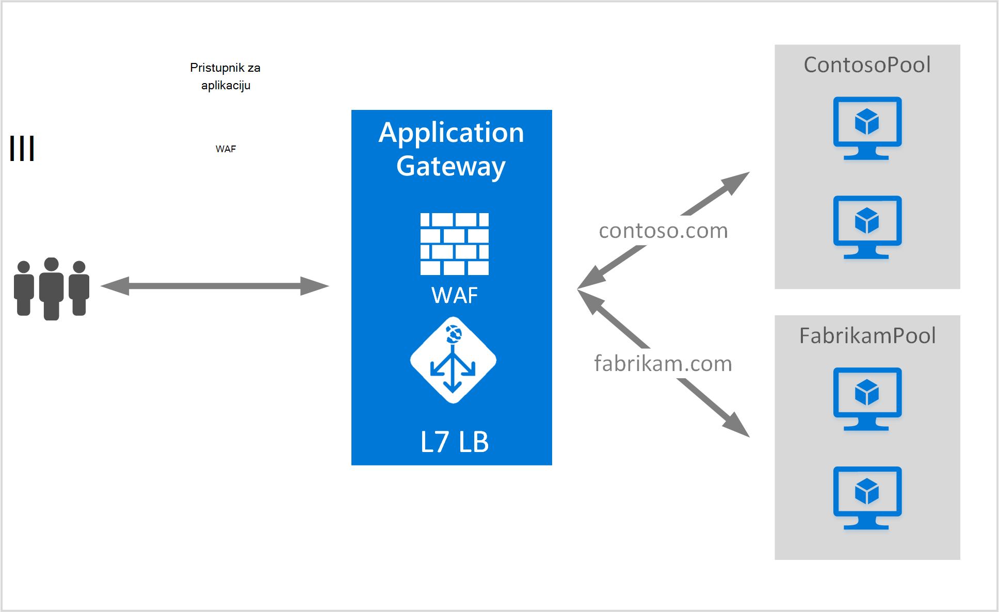

<properties
   pageTitle="Stvaranje pristupnika za aplikaciju za hostiranje više web-mjesta | Microsoft Azure"
   description="Ova stranica sadrži upute da biste stvorili, konfigurirati pristupnik za Azure aplikacije za hostiranje više web-aplikacija na istom Pristupniku."
   documentationCenter="na"
   services="application-gateway"
   authors="amsriva"
   manager="rossort"
   editor="amsriva"/>
<tags
   ms.service="application-gateway"
   ms.devlang="na"
   ms.topic="article"
   ms.tgt_pltfrm="na"
   ms.workload="infrastructure-services"
   ms.date="10/25/2016"
   ms.author="amsriva"/>

# Stvaranje pristupnika za aplikaciju za hostiranje više web-aplikacije

> [AZURE.SELECTOR]
- [Portal za Azure](application-gateway-create-multisite-portal.md)
- [Azure PowerShell Voditelj resursa](application-gateway-create-multisite-azureresourcemanager-powershell.md)

Više hostiranja web-mjesta omogućuje implementacija više web-aplikacija na istom Pristupniku aplikacije. To ovisi o prisutnosti zaglavlja glavnog računala na dolazni zahtjev HTTP da biste utvrdili koji ga slušatelj dobiti promet. Ga slušatelj usmjerava promet na odgovarajuće pozadinskog skup konfigurirani u definiciji pravila pristupnika. U SSL omogućen web-aplikacijama pristupnika aplikacije ovisi o proširenje oznaka poslužitelja naziva (SNI) da biste odabrali ispravnu ga slušatelj za promet za web. Često se koristi za hostiranje web-mjesta za više je da biste učitali zahtjeva za različite web domene na drugi poslužitelj pozadinske grupe. Na sličan način više poddomena isti korijensku domenu može se nalaziti na istom Pristupniku aplikacije.

## Scenarij

U sljedećem primjeru pristupnik za aplikaciju je posluživanje promet za contoso.com i fabrikam.com s dvije grupe pozadinskih poslužitelja: contoso resurse poslužitelja i resurse poslužitelja fabrikam. Postavljanje slične mogu se upotrijebiti za poddomene glavnog računala kao što su app.contoso.com i blog.contoso.com.

## Prije početka

1. Instalirajte najnoviju verziju programa Azure PowerShell cmdleti pomoću platforme Installer Web. Možete preuzeti i instalirati najnoviju verziju [preuzimanja stranice](https://azure.microsoft.com/downloads/)u odjeljku **Komponente Windows PowerShell** .
2. Mora postojati poslužitelje dodali pozadinsku resurse da biste koristili aplikaciju pristupnika ili njihovim krajnje točke stvoreni u virtualne mreže u zasebnom podmreže ili na javnu IP/VIP dodijeljena.

## Preduvjeti

- **Skup pozadinskih poslužitelja:** Popis IP adrese pozadinskih poslužitelja. IP adrese na popisu ili trebao bi se nalaziti podmreže virtualne mreže ili mora biti javnu IP/VIP. FQDN može se koristiti.
- **Skup postavke poslužitelja za pozadinsku:** Svaki skup ima postavke kao što su priključak, protokol i sustavom kolačića afinitet. Ove postavke je uz zajedničko područje, a primjenjuju se na svim poslužiteljima u na resurse.
- **Sučelja priključka:** U ovom priključak je javno priključak koja je otvorena na računala pristupnika. Promet dodirne priključak, a zatim prosljeđuje na neki od pozadinskih poslužitelja.
- **Ga slušatelj:** Ga slušatelj sadrži sučelja priključak protokol (Http ili Https, te su vrijednosti velika i mala slova), a naziv SSL certifikata (Ako je konfiguriranje SSL offload). Za pristupnika omogućeno aplikacije više web-mjesta, naziv glavnog računala i pokazatelje SNI dodaju.
- **Pravilo:** Povezuje ga slušatelj, skup pozadinskih poslužitelja i pravila definira grupe aplikacija pozadinskih poslužitelja promet treba usmjeriti na kada je dodirne određeni ga slušatelj.

## Stvaranje pristupnika za aplikaciju

Slijede korake potrebne za stvaranje pristupnika za aplikaciju:

1. Stvorite grupu resursa za Voditelj resursa.
2. Stvaranje virtualne mreže, podmreže i javnu IP za pristupnik za aplikacije.
3. Stvaranje objekta konfiguracije pristupnika za aplikacije.
4. Stvaranje resursa za pristupnik programa aplikacije.

## Stvaranje grupe resursa za Voditelj resursa

Provjerite koristite li najnoviju verziju programa Azure PowerShell. Dodatne informacije o dostupna je na [Pomoću komponente Windows PowerShell s Voditelj resursa](../powershell-azure-resource-manager.md).

### Korak 1

Prijavite se na Azure

    Login-AzureRmAccount

Se od vas zatraži provjeru s vjerodajnice.

### Korak 2

Provjerite pretplate za račun.

    Get-AzureRmSubscription

### Korak 3

Odabir pretplate Azure da biste koristili.

    Select-AzureRmSubscription -SubscriptionName "Name of subscription"

### Korak 4

Stvorite grupu resursa (preskoči ovaj korak ako koristite postojeću grupu resursa).

    New-AzureRmResourceGroup -Name appgw-RG -location "West US"

Umjesto toga možete stvoriti i oznake za grupu resursa za pristupnik za aplikaciju:

    $resourceGroup = New-AzureRmResourceGroup -Name appgw-RG -Location "West US" -Tags @{Name = "testtag"; Value = "Application Gateway multiple site"}

Azure Voditelj resursa zahtijeva da svih grupa resursa navedite mjesto. To mjesto koristi se kao zadano mjesto za resurse u toj grupi resursa. Pripazite da sve naredbe za stvaranje pristupnika za aplikaciju koristiti istu grupu resursa.

U gornjem primjeru koju smo stvorili grupu resursa pod nazivom "appgw-ru" s lokacijom "Zapad nas".

>[AZURE.NOTE] Ako morate konfigurirati prilagođene probni za pristupnik za aplikaciju, potražite u članku [Stvaranje pristupnika za aplikaciju s prilagođene probes pomoću komponente PowerShell](application-gateway-create-probe-ps.md). Posjetite [prilagođene probes i nadzor stanja](application-gateway-probe-overview.md) da biste saznali više.

## Stvaranje virtualne mreže i podmreže

Sljedeći primjer pokazuje kako stvoriti virtualne mreže pomoću upravitelja resursa. Dva podmreže stvaraju se u ovom ćete koraku. Prvi podmreže je za pristupnik za aplikaciju sam. Pristupnik za aplikacije potreban je vlastitu podmreži omogućili držite njegove instance. U tom podmreže može uvesti samo drugih računala pristupnika. Drugi podmreži koristi se za čuvanje poslužitelji pozadinska aplikacija.

### Korak 1

Raspon 10.0.0.0/24 adresa dodijeliti podmreže varijabla koja će se koristiti za pristupnik za aplikacije.

    $subnet = New-AzureRmVirtualNetworkSubnetConfig -Name appgatewaysubnet -AddressPrefix 10.0.0.0/24

### Korak 2

Raspon 10.0.1.0/24 adresa dodijeliti subnet2 varijabla koja će se koristiti za pozadinskog grupe.

    $subnet2 = New-AzureRmVirtualNetworkSubnetConfig -Name backendsubnet -AddressPrefix 10.0.1.0/24

### Korak 3

Stvaranje virtualne mreže pod nazivom "appgwvnet" u resursa grupe "appgw-ru" za područje Zapad SAD-a pomoću 10.0.0.0/16 prefiks 10.0.0.0/24 podmreže i 10.0.1.0/24.

    $vnet = New-AzureRmVirtualNetwork -Name appgwvnet -ResourceGroupName appgw-RG -Location "West US" -AddressPrefix 10.0.0.0/16 -Subnet $subnet,$subnet2

### Korak 4

Dodijelite podmreže varijabla za sljedeće korake, čime se pristupnik za aplikacije.

    $appgatewaysubnet = Get-AzureRmVirtualNetworkSubnetConfig -Name appgatewaysubnet -VirtualNetwork $vnet
    $backendsubnet = Get-AzureRmVirtualNetworkSubnetConfig -Name backendsubnet -VirtualNetwork $vnet

## Stvaranje javne IP adresa za konfiguraciju sučelja

Stvaranje javne IP resursa "publicIP01" u resursa grupe "appgw-ru" za područje Zapad SAD-a.

    $publicip = New-AzureRmPublicIpAddress -ResourceGroupName appgw-RG -name publicIP01 -location "West US" -AllocationMethod Dynamic

IP adresa je dodijeljen pristupnika aplikacije prilikom pokretanja servisa.

## Stvaranje konfiguracije pristupnika aplikacije

Sve stavke konfiguracije morate postaviti prije stvaranja aplikacije pristupnika. Sljedeći koraci stvorite konfiguracije stavke koje su vam potrebne pristupnika resursa aplikacije.

### Korak 1

Stvaranje konfiguracije aplikacije pristupnik IP pod nazivom "gatewayIP01". Prilikom pokretanja aplikacije pristupnika uzima IP adresu iz podmreže konfigurirati i mrežni promet usmjerili na IP adresa u skupna pozadinsku IP. Imajte na umu da svaku instancu traje jednu IP adresu.

    $gipconfig = New-AzureRmApplicationGatewayIPConfiguration -Name gatewayIP01 -Subnet $appgatewaysubnet

### Korak 2

Konfiguriranje skupna pozadinsku IP adresa pod nazivom "pool01" i "pool2" s IP adresama "10.0.1.100, 10.0.1.101,10.0.1.102" za "pool1" i "10.0.1.103, 10.0.1.104, 10.0.1.105" za "pool2".

    $pool1 = New-AzureRmApplicationGatewayBackendAddressPool -Name pool01 -BackendIPAddresses 10.0.1.100, 10.0.1.101, 10.0.1.102
    $pool2 = New-AzureRmApplicationGatewayBackendAddressPool -Name pool02 -BackendIPAddresses 10.0.1.103, 10.0.1.104, 10.0.1.105

U ovom primjeru postoje dva pozadinske grupe da biste usmjerili mrežni promet na temelju traženi web-mjesta. Jedan skup prima promet s web-mjesta "contoso.com" i ostale resurse prima promet iz web-mjesta "fabrikam.com". Morate zamijeniti prethodni IP adrese da biste dodali vlastite krajnje točke aplikacije IP adresa. Umjesto interne IP adresa nije moguće i koristiti javnu IP adrese, FQDN ili na VM NIC pozadinskog instanci. Korištenje "-BackendFQDNs" parametar u ljusci PowerShell da biste odredili certifikatom umjesto IP-ovi.

### Korak 3

Konfiguriranje postavke računala pristupnika "poolsetting01" i "poolsetting02" za mrežni promet uravnoteženja u pozadinskoj. U ovom primjeru konfiguriranje različite pozadinske skup postavki za pozadinsku grupe. Svaki skup pozadinske može imati vlastitu pozadinsku skup postavku.

    $poolSetting01 = New-AzureRmApplicationGatewayBackendHttpSettings -Name "besetting01" -Port 80 -Protocol Http -CookieBasedAffinity Disabled -RequestTimeout 120
    $poolSetting02 = New-AzureRmApplicationGatewayBackendHttpSettings -Name "besetting02" -Port 80 -Protocol Http -CookieBasedAffinity Enabled -RequestTimeout 240

### Korak 4

Konfigurirajte sučelja IP javnu IP krajnjoj točki.

    $fipconfig01 = New-AzureRmApplicationGatewayFrontendIPConfig -Name "frontend1" -PublicIPAddress $publicip

### Korak 5

Konfiguriranje sučelja priključka za pristupnik za aplikacije.

    $fp01 = New-AzureRmApplicationGatewayFrontendPort -Name "fep01" -Port 443

### Korak 6

Konfiguriranje dva SSL certifikata za dva web-mjesta ne možemo namjeravate podržava u ovom primjeru. Jedan certifikat je za contoso.com promet i drugi je za fabrikam.com promet. Ove potvrde mora biti ustanova za izdavanje certifikata na izdavanja potvrde web-mjesta. Samopotpisane potvrde su podržane, ali ne preporučuje se radni promet.

    $cert01 = New-AzureRmApplicationGatewaySslCertificate -Name contosocert -CertificateFile <file path> -Password <password>
    $cert02 = New-AzureRmApplicationGatewaySslCertificate -Name fabrikamcert -CertificateFile <file path> -Password <password>

### Korak 7

U ovom primjeru konfigurirati dva slušače za dva web-mjesta. Ovaj korak konfigurira slušače za javnu IP adresu, priključak i glavno računalo za primanje promet. Naziv glavnog računala parametar za podršku za više web-mjesta potreban je i mora biti postavljena na odgovarajuće web-mjesto za koje je primio promet. RequireServerNameIndication parametar mora biti postavljena na true za web-mjesta koje je potrebna podrška za SSL u scenariju s više glavnog računala. Ako je potreban je SSL podršku, morate navesti SSL certifikat koji se koristi za zaštitu promet za tu web-aplikaciju. Kombinacija FrontendIPConfiguration, FrontendPort i glavno računalo mora biti jedinstvena za na ga slušatelj. Svaki ga slušatelj podržavaju jedan certifikat.

    $listener01 = New-AzureRmApplicationGatewayHttpListener -Name "listener01" -Protocol Https -FrontendIPConfiguration $fipconfig01 -FrontendPort $fp01 -HostName "contoso11.com" -RequireServerNameIndication true  -SslCertificate $cert01
    $listener02 = New-AzureRmApplicationGatewayHttpListener -Name "listener02" -Protocol Https -FrontendIPConfiguration $fipconfig01 -FrontendPort $fp01 -HostName "fabrikam11.com" -RequireServerNameIndication true -SslCertificate $cert02

### Korak 8

U ovom primjeru stvoriti dvije postavke pravila za dva web-aplikacije. Pravilo ties zajedno slušače, pozadinskog grupe i http postavke. Ovaj korak konfigurira pristupnika aplikacije da biste koristili osnovni usmjeravanje pravilo, jedan za svaki web-mjesta. Promet na svaku web-mjesto je primio njegov konfigurirani ga slušatelj, a zatim usmjereni na njegov skup konfigurirani pozadinskog pomoću svojstava naveden u na BackendHttpSettings.

    $rule01 = New-AzureRmApplicationGatewayRequestRoutingRule -Name "rule01" -RuleType Basic -HttpListener $listener01 -BackendHttpSettings $poolSetting01 -BackendAddressPool $pool1
    $rule02 = New-AzureRmApplicationGatewayRequestRoutingRule -Name "rule02" -RuleType Basic -HttpListener $listener02 -BackendHttpSettings $poolSetting02 -BackendAddressPool $pool2

### Korak 9

Konfiguriranje broj instanci i veličinu za pristupnik za aplikacije.

    $sku = New-AzureRmApplicationGatewaySku -Name "Standard_Medium" -Tier Standard -Capacity 2

## Stvaranje pristupnika za aplikaciju

Stvaranje pristupnika za aplikacije sa svim objektima konfiguracije iz prethodne korake.

    $appgw = New-AzureRmApplicationGateway -Name appgwtest -ResourceGroupName appgw-RG -Location "West US" -BackendAddressPools $pool1,$pool2 -BackendHttpSettingsCollection $poolSetting01, $poolSetting02 -FrontendIpConfigurations $fipconfig01 -GatewayIpConfigurations $gipconfig -FrontendPorts $fp01 -HttpListeners $listener01, $listener02 -RequestRoutingRules $rule01, $rule02 -Sku $sku -SslCertificates $cert01, $cert02

>[AZURE.IMPORTANT] Dodjeljivanje pristupnika aplikacija je dugo izvodi operacije, a može potrajati neko vrijeme da biste dovršili.

## Dohvaćanje aplikacije pristupnika DNS naziva

Nakon stvaranja pristupnika, sljedeći je korak konfiguriranje sučelje za komunikaciju. Kada koristite javnoj IP pristupnik za aplikacije potreban je dinamički dodijeljeni DNS naziv koji nije neslužbeni. Da biste bili sigurni krajnji korisnici mogu pogoditi pristupnika aplikacije CNAME zapis mogu se pokažite na javno krajnjoj točki pristupnika aplikacije. [Konfiguriranje naziv prilagođene domene u Azure](../cloud-services/cloud-services-custom-domain-name-portal.md). Da biste to učinili, dohvaćanje detalja pristupnika aplikacije i nazivu IP-DNS povezane pomoću element PublicIPAddress priložiti pristupnik za aplikacije. Naziv pristupnika aplikacije DNS-a trebali biste mogu koristiti za stvaranje CNAME zapis koji pokazuje dvije web-aplikacije za DNS naziv. Korištenje A zapisa ne preporučuje se jer se VIP može se promijeniti ponovno pokretanje računala pristupnika.
    
    Get-AzureRmPublicIpAddress -ResourceGroupName appgw-RG -Name publicIP01
        
    Name                     : publicIP01
    ResourceGroupName        : appgw-RG
    Location                 : westus
    Id                       : /subscriptions/<subscription_id>/resourceGroups/appgw-RG/providers/Microsoft.Network/publicIPAddresses/publicIP01
    Etag                     : W/"00000d5b-54ed-4907-bae8-99bd5766d0e5"
    ResourceGuid             : 00000000-0000-0000-0000-000000000000
    ProvisioningState        : Succeeded
    Tags                     : 
    PublicIpAllocationMethod : Dynamic
    IpAddress                : xx.xx.xxx.xx
    PublicIpAddressVersion   : IPv4
    IdleTimeoutInMinutes     : 4
    IpConfiguration          : {
                                 "Id": "/subscriptions/<subscription_id>/resourceGroups/appgw-RG/providers/Microsoft.Network/applicationGateways/appgwtest/frontendIP
                               Configurations/frontend1"
                               }
    DnsSettings              : {
                                 "Fqdn": "00000000-0000-xxxx-xxxx-xxxxxxxxxxxx.cloudapp.net"
                               }

## Daljnji koraci

Saznajte kako se zaštititi web-mjesta s [Računala pristupnika - vatrozid aplikaciju za Web](application-gateway-webapplicationfirewall-overview.md)