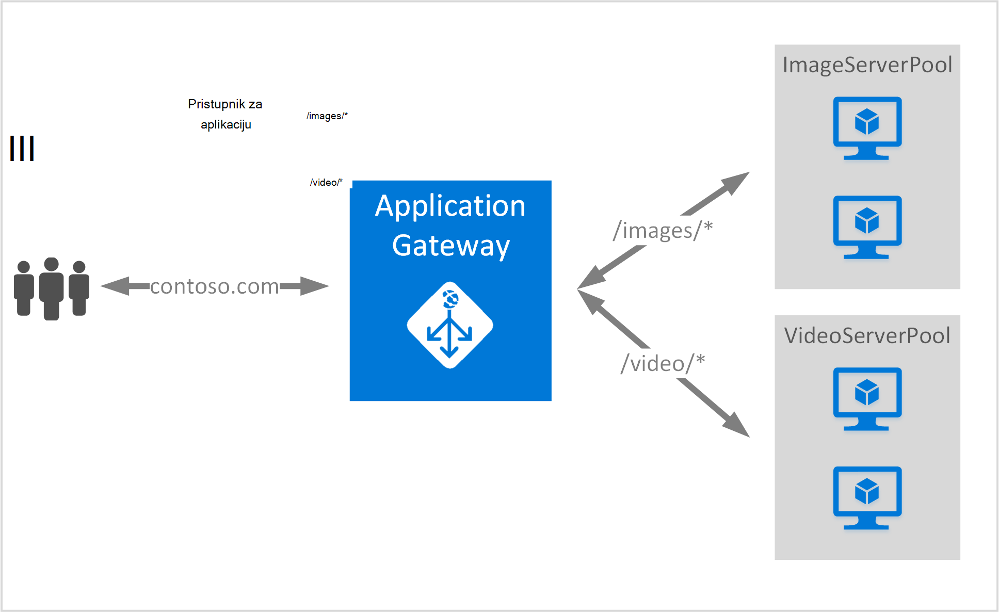

<properties
   pageTitle="Stvaranje pristupnika za aplikaciju pomoću pravila za usmjeravanje URL | Microsoft Azure"
   description="Ova stranica sadrži upute da biste stvorili, konfigurirati pristupnik za Azure aplikacije pomoću pravila za usmjeravanje URL-a"
   documentationCenter="na"
   services="application-gateway"
   authors="georgewallace"
   manager="jdial"
   editor="tysonn"/>
<tags
   ms.service="application-gateway"
   ms.devlang="na"
   ms.topic="article"
   ms.tgt_pltfrm="na"
   ms.workload="infrastructure-services"
   ms.date="10/25/2016"
   ms.author="gwallace"/>

# Stvaranje pristupnika za aplikaciju pomoću utemeljen na put usmjeravanja 

> [AZURE.SELECTOR]
- [Portal za Azure](application-gateway-create-url-route-portal.md)
- [Azure PowerShell Voditelj resursa](application-gateway-create-url-route-arm-ps.md)

URL-a koji se temelji na put do usmjeravanje omogućuje usmjerava na temelju put URL-a Http zahtjev za pridruživanje. Provjerava postoji li usmjeravanje pozadinske resurse konfiguriran za popise URL-a aplikacije pristupnika i slanje mrežni promet na definirani pozadinske resurse. Često se koristi za usmjeravanje utemeljen na URL je da biste učitali zahtjeva za različite vrste sadržaja za drugi poslužitelj pozadinske grupe.

Koji se temelji na URL usmjeravanje predstavlja nove vrste pravila za pristupnik za aplikacije. Pristupnik za aplikacije sadrži dvije vrste pravila: Osnovno i PathBasedRouting. Vrste osnovni pravila omogućuje kružnog uslugu za grupe pozadinske tijekom PathBasedRouting osim kružnog raspodjele, također uzima uzorak put URL-a zahtjev u obzir pri odabiru skup pozadinskog.

>[AZURE.IMPORTANT] PathPattern: Popis uzoraka put tako da odgovara. Svaki moraju započeti znakom / i samo stavi na "\*" je dopušteno je na kraju. Valjani Primjeri su /xyz, /xyz* ili /xyz/*. Niz koji se umeće matcher put sadržavati nikakav tekst nakon prve "?" ili "#", a te znakove nije dopušteno. 

## Scenarij
U sljedećem primjeru pristupnik za aplikaciju je posluživanje promet contoso.com s dvije grupe pozadinskih poslužitelja: skup videozapisa poslužitelja i resurse poslužitelja slike.

Zahtjevi za http://contoso.com/image* usmjeruje se u skup slika server (pool1), a http://contoso.com/video* usmjeruje resurse poslužitelja videozapisa (pool2). Zadani poslužitelj skup (pool1) je potvrđen Ako nijedan od uzoraka put ne odgovara.

## Prije početka

1. Instalirajte najnoviju verziju programa Azure PowerShell cmdleti pomoću platforme Installer Web. Možete preuzeti i instalirati najnoviju verziju [preuzimanja stranice](https://azure.microsoft.com/downloads/)u odjeljku **Komponente Windows PowerShell** .
2. Stvorite virtualne mreže i podmreže za pristupnik za aplikacije. Pripazite da virtualnim strojevima ni oblaka implementaciji koristite podmreži. Pristupnik za aplikaciju mora biti sam podmreži virtualne mreže.
3. Mora postojati poslužitelje dodali pozadinsku resurse da biste koristili aplikaciju pristupnika ili njihove krajnje točke stvoreni u virtualne mreže ili s na javnu IP/VIP dodijeljeni.

## Što je potrebno da biste stvorili pristupnik za aplikaciju?

- **Skup pozadinskih poslužitelja:** Popis IP adrese pozadinskih poslužitelja. IP adrese na popisu ili trebao bi se nalaziti podmreže virtualne mreže ili mora biti javnu IP/VIP.
- **Skup postavke poslužitelja za pozadinsku:** Svaki skup ima postavke kao što su priključak, protokol i sustavom kolačića afinitet. Ove postavke je uz zajedničko područje, a primjenjuju se na svim poslužiteljima u na resurse.
- **Sučelja priključka:** U ovom priključak je javno priključak koja je otvorena na računala pristupnika. Promet dodirne priključak, a zatim prosljeđuje na neki od pozadinskih poslužitelja.
- **Ga slušatelj:** Ga slušatelj sadrži sučelja priključak protokol (Http ili Https, to su velika i mala slova), a naziv SSL certifikata (Ako je konfiguriranje SSL offload).
- **Pravilo:** Povezuje ga slušatelj, skup pozadinskih poslužitelja i pravila definira grupe aplikacija pozadinskih poslužitelja promet treba usmjeriti na kada je dodirne određeni ga slušatelj.

## Stvaranje pristupnika za aplikaciju

Razlika između korištenja Azure klasične i upravljanja resursima Azure je redoslijed u kojem stvarate pristupnika aplikacije i stavke koje je potrebno je konfigurirati.

S Voditelj resursa, sve stavke koje se pristupnik za aplikaciju su pojedinačno konfigurirani i smjestite zajedno da biste stvorili resursa za pristupnik za aplikacije.

Evo nekoliko koraka koji su potrebni za stvaranje pristupnika za aplikaciju:

1. Stvorite grupu resursa za Voditelj resursa.
2. Stvaranje virtualne mreže, podmreže i javnu IP za pristupnik za aplikacije.
3. Stvaranje objekta konfiguracije pristupnika za aplikacije.
4. Stvaranje resursa za pristupnik programa aplikacije.

## Stvaranje grupe resursa za Voditelj resursa

Provjerite koristite li najnoviju verziju programa Azure PowerShell. Dodatne informacije o dostupna je na [Pomoću komponente Windows PowerShell s Voditelj resursa](../powershell-azure-resource-manager.md).

### Korak 1

Prijavite se na Azure

    Login-AzureRmAccount

Se od vas zatraži provjeru s vjerodajnice. 

### Korak 2

Provjerite pretplate za račun.

    Get-AzureRmSubscription

### Korak 3

Odabir pretplate Azure da biste koristili.  

    Select-AzureRmSubscription -Subscriptionid "GUID of subscription"

### Korak 4

Stvorite grupu resursa (preskoči ovaj korak ako koristite postojeću grupu resursa).

    New-AzureRmResourceGroup -Name appgw-RG -Location "West US"

Umjesto toga možete stvoriti i oznake za grupu resursa za pristupnik za aplikaciju:
    
    $resourceGroup = New-AzureRmResourceGroup -Name appgw-RG -Location "West US" -Tags @{Name = "testtag"; Value = "Application Gateway URL routing"} 

Azure Voditelj resursa zahtijeva da svih grupa resursa navedite mjesto. Koristi se kao zadano mjesto za resurse u toj grupi resursa. Pripazite da sve naredbe za stvaranje pristupnika za aplikaciju koristiti istu grupu resursa.

U gornjem primjeru koju smo stvorili grupu resursa pod nazivom "appgw ru" i mjesto "Zapad NAM".

>[AZURE.NOTE] Ako morate konfigurirati prilagođene probni za pristupnik za aplikaciju, potražite u članku [Stvaranje pristupnika za aplikaciju s prilagođene probes pomoću komponente PowerShell](application-gateway-create-probe-ps.md). Pogledajte [prilagođene probes i nadzor stanja](application-gateway-probe-overview.md) da biste saznali više.

## Stvaranje virtualne mreže i podmreže za pristupnik za aplikaciju

Sljedeći primjer pokazuje kako stvoriti virtualne mreže pomoću upravitelja resursa.

### Korak 1

Raspon 10.0.0.0/24 adresa dodijeliti podmreže varijabla koja će se koristiti za stvaranje virtualne mreže.

    $subnet = New-AzureRmVirtualNetworkSubnetConfig -Name subnet01 -AddressPrefix 10.0.0.0/24

### Korak 2

Stvaranje virtualne mreže pod nazivom "appgwvnet" u resursa grupe "appgw-ru" za područje Zapad SAD-a pomoću 10.0.0.0/16 prefiks 10.0.0.0/24 podmreže.

    $vnet = New-AzureRmVirtualNetwork -Name appgwvnet -ResourceGroupName appgw-RG -Location "West US" -AddressPrefix 10.0.0.0/16 -Subnet $subnet

### Korak 3

Dodijelite podmreže varijabla za sljedeće korake, čime se pristupnik za aplikacije.

    $subnet=$vnet.Subnets[0]

## Stvaranje javne IP adresa za konfiguraciju sučelja

Stvaranje javne IP resursa "publicIP01" u resursa grupe "appgw-ru" za područje Zapad SAD-a.

    $publicip = New-AzureRmPublicIpAddress -ResourceGroupName appgw-RG -name publicIP01 -location "West US" -AllocationMethod Dynamic

IP adresa je dodijeljen pristupnika aplikacije prilikom pokretanja servisa.

## Stvaranje konfiguracije pristupnika aplikacije

Sve stavke konfiguracije morate postaviti prije stvaranja aplikacije pristupnika. Sljedeći koraci stvorite konfiguracije stavke koje su vam potrebne pristupnika resursa aplikacije.

### Korak 1

Stvaranje konfiguracije aplikacije pristupnik IP pod nazivom "gatewayIP01". Prilikom pokretanja aplikacije pristupnika uzima IP adresu iz podmreže konfigurirati i mrežni promet usmjerili na IP adresa u skupna pozadinsku IP. Imajte na umu da svaku instancu traje jednu IP adresu.

    $gipconfig = New-AzureRmApplicationGatewayIPConfiguration -Name gatewayIP01 -Subnet $subnet

### Korak 2

Konfiguriranje skupna pozadinsku IP adresa pod nazivom "pool01" i "pool2" s IP adresama "134.170.185.46, 134.170.188.221,134.170.185.50" za "pool1" i "134.170.186.46, 134.170.189.221,134.170.186.50" za "pool2".

    $pool1 = New-AzureRmApplicationGatewayBackendAddressPool -Name pool01 -BackendIPAddresses 134.170.185.46, 134.170.188.221,134.170.185.50

    $pool2 = New-AzureRmApplicationGatewayBackendAddressPool -Name pool02 -BackendIPAddresses 134.170.186.46, 134.170.189.221,134.170.186.50

U ovom primjeru postoje dva pozadinske grupe da biste usmjerili mrežnog prometa koji se temelji na put URL-a. Jedan skup prima promet iz put URL-a "/ video" i ostale resurse promet primanje put "/ slike". Zamjena prethodni IP adrese da biste dodali vlastite krajnje točke aplikacije IP adresa. 

### Korak 3

Konfiguriranje postavke računala pristupnika "poolsetting01" i "poolsetting02" za mrežni promet uravnoteženja u pozadinskoj. U ovom primjeru konfiguriranje različite pozadinske skup postavki za pozadinsku grupe. Svaki skup pozadinske može imati vlastitu pozadinsku skup postavku.

    $poolSetting01 = New-AzureRmApplicationGatewayBackendHttpSettings -Name "besetting01" -Port 80 -Protocol Http -CookieBasedAffinity Disabled -RequestTimeout 120

    $poolSetting02 = New-AzureRmApplicationGatewayBackendHttpSettings -Name "besetting02" -Port 80 -Protocol Http -CookieBasedAffinity Enabled -RequestTimeout 240

### Korak 4

Konfigurirajte sučelja IP javnu IP krajnjoj točki.

    $fipconfig01 = New-AzureRmApplicationGatewayFrontendIPConfig -Name "frontend1" -PublicIPAddress $publicip

### Korak 5 

Konfiguriranje sučelja priključka za pristupnik za aplikacije.

    $fp01 = New-AzureRmApplicationGatewayFrontendPort -Name "fep01" -Port 80
### Korak 6

Konfiguriranje ga slušatelj. Ovaj korak konfigurira ga slušatelj za javnu IP adresa i priključka za primanje dolazne mrežni promet. 
 
    $listener = New-AzureRmApplicationGatewayHttpListener -Name "listener01" -Protocol Http -FrontendIPConfiguration $fipconfig01 -FrontendPort $fp01

### Korak 7 

Konfiguriranje URL pravilo putove za grupe pozadinske. Ovaj korak konfigurira relativni put aplikacije pristupnik koristi za definiranje mapiranja između put URL-a i koje skup pozadinske dodijeljene obrađuje dolazne promet.

U primjeru u nastavku stvara dva pravila: jedan za "/ Slika /" put usmjeravanje prometa pozadinskoj "pool1" i drugi radi "/ video /" put usmjeravanje prometa pozadinskoj "pool2".
    
    $imagePathRule = New-AzureRmApplicationGatewayPathRuleConfig -Name "pathrule1" -Paths "/image/*" -BackendAddressPool $pool1 -BackendHttpSettings $poolSetting01

    $videoPathRule = New-AzureRmApplicationGatewayPathRuleConfig -Name "pathrule2" -Paths "/video/*" -BackendAddressPool $pool2 -BackendHttpSettings $poolSetting02

Konfiguraciju karte pravilo put konfigurira skup za adresu pozadinske zadani ako put ne odgovaraju nijednom pravila unaprijed definiranih puta. 

    $urlPathMap = New-AzureRmApplicationGatewayUrlPathMapConfig -Name "urlpathmap" -PathRules $videoPathRule, $imagePathRule -DefaultBackendAddressPool $pool1 -DefaultBackendHttpSettings $poolSetting02

### Korak 8

Stvorite pravilo postavku. Ovaj korak konfigurira pristupnik za aplikaciju za korištenje URL-a koji se temelji na put do usmjeravanja.

    $rule01 = New-AzureRmApplicationGatewayRequestRoutingRule -Name "rule1" -RuleType PathBasedRouting -HttpListener $listener -UrlPathMap $urlPathMap

### Korak 9

Konfiguriranje broj instanci i veličinu za pristupnik za aplikacije.

    $sku = New-AzureRmApplicationGatewaySku -Name "Standard_Small" -Tier Standard -Capacity 2

## Stvaranje pristupnika za aplikaciju

Stvaranje pristupnika za aplikacije sa svim objektima konfiguracije iz prethodne korake.

    $appgw = New-AzureRmApplicationGateway -Name appgwtest -ResourceGroupName appgw-RG -Location "West US" -BackendAddressPools $pool1,$pool2 -BackendHttpSettingsCollection $poolSetting01, $poolSetting02 -FrontendIpConfigurations $fipconfig01 -GatewayIpConfigurations $gipconfig -FrontendPorts $fp01 -HttpListeners $listener -UrlPathMaps $urlPathMap -RequestRoutingRules $rule01 -Sku $sku

## Dohvaćanje aplikacije pristupnika DNS naziva

Nakon stvaranja pristupnika, sljedeći je korak konfiguriranje sučelje za komunikaciju. Kada koristite javnoj IP pristupnik za aplikacije potreban je dinamički dodijeljeni DNS naziv koji nije neslužbeni. Da biste bili sigurni krajnji korisnici mogu pogoditi pristupnika aplikacije CNAME zapis mogu se pokažite na javno krajnjoj točki pristupnika aplikacije. [Konfiguriranje naziv prilagođene domene u Azure](../cloud-services/cloud-services-custom-domain-name-portal.md). Da biste to učinili, dohvaćanje detalja pristupnika aplikacije i nazivu IP-DNS povezane pomoću element PublicIPAddress priložena pristupnik za aplikacije. Naziv pristupnika aplikacije DNS-a trebali biste mogu koristiti za stvaranje CNAME zapis koji pokazuje dvije web-aplikacije za DNS naziv. Korištenje A zapisa ne preporučuje se jer se VIP može se promijeniti ponovno pokretanje računala pristupnika.
    
    Get-AzureRmPublicIpAddress -ResourceGroupName appgw-RG -Name publicIP01
        
    Name                     : publicIP01
    ResourceGroupName        : appgw-RG
    Location                 : westus
    Id                       : /subscriptions/<subscription_id>/resourceGroups/appgw-RG/providers/Microsoft.Network/publicIPAddresses/publicIP01
    Etag                     : W/"00000d5b-54ed-4907-bae8-99bd5766d0e5"
    ResourceGuid             : 00000000-0000-0000-0000-000000000000
    ProvisioningState        : Succeeded
    Tags                     : 
    PublicIpAllocationMethod : Dynamic
    IpAddress                : xx.xx.xxx.xx
    PublicIpAddressVersion   : IPv4
    IdleTimeoutInMinutes     : 4
    IpConfiguration          : {
                                 "Id": "/subscriptions/<subscription_id>/resourceGroups/appgw-RG/providers/Microsoft.Network/applicationGateways/appgwtest/frontendIP
                               Configurations/frontend1"
                               }
    DnsSettings              : {
                                 "Fqdn": "00000000-0000-xxxx-xxxx-xxxxxxxxxxxx.cloudapp.net"
                               }

## Daljnji koraci

Ako želite saznati rasterećivanje Secure Sockets Layer (SSL) potražite u članku [Konfiguriranje pristupnik za aplikaciju za SSL offload](application-gateway-ssl-arm.md).