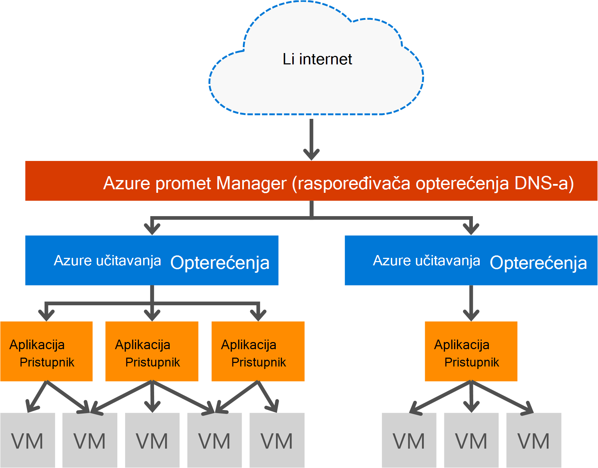

<properties
   pageTitle="Uvod u pristupnik za aplikaciju | Microsoft Azure"
   description="Ova stranica sadrži pregled pristupnika aplikacije servisa za sloj 7 opterećenja, uključujući pristupnika veličine, HTTP učitavanje ujednačavanje, kolačića afinitet sesije i SSL offload."
   documentationCenter="na"
   services="application-gateway"
   authors="georgewallace"
   manager="carmonm"
   editor="tysonn"/>
<tags
   ms.service="application-gateway"
   ms.devlang="na"
   ms.topic="hero-article"
   ms.tgt_pltfrm="na"
   ms.workload="infrastructure-services"
   ms.date="10/25/2016"
   ms.author="gwallace"/>

# Pregled aplikacija pristupnika

## Što je aplikacija pristupnika

Pristupnik za aplikaciju Microsoft Azure sadrži kontroler aplikacije isporuke (ADC) kao servis, koja nudi razne mogućnosti za svoju aplikaciju za ujednačavanje opterećenja sloja 7. Omogućuje klijentima za optimiziranje web farme produktivnost rasterećivanjem intenzivno SSL prekid procesora pristupnika aplikacije. Pruža i druge mogućnosti sloja 7 usmjeravanje uključujući kružnog raspodjele dolazne prometa, kolačić na temelju afinitet sesiju, usmjeravanje put temelji URL-a i mogućnost za hostiranje više web-mjesta iza jedan pristupnik aplikacije. Pristupnik za aplikaciju i ima web aplikacije vatrozid (WAF) koji štiti aplikacije protiv većinu na OWASP gornji 10 uobičajenih web slabe točke. Pristupnik za aplikaciju moguće je konfigurirati kao nasuprotne pristupnika internet, internog samo pristupnika ili kombinacijom tih dvaju načina. Pristupnik za aplikaciju je potpuno Azure upravljanja, skalabilni i vrlo dostupan. Nudi bogatog skupa zapisivanje mogućnosti i Dijagnostika za bolje mogućnost upravljanja. Pristupnik za aplikaciju funkcionira s virtualnim strojevima, servise u oblaku i interni ili vanjski dostupnog web-aplikacije.

Pristupnik za aplikaciju je namjenski virtualne potražite aplikacije i sastoji se od više instanci tempiranja skalabilnost i visoke dostupnosti. Kada stvarate pristupnik za aplikaciju, krajnje (javno VIP ili interne IP ILB) je povezana i koristiti za ingress mrežni promet. Ovaj VIP ili ILB IP je nudi Azure opterećenja rad na razini prijenosa (TCP/UDP), ali imate sve dolazne mrežnog prometa koji se rasporediti tempiranja instance pristupnika aplikacije opterećenje. Pristupnik za aplikaciju zatim usmjerava promet HTTP/HTTPS na temelju svoju konfiguraciju li virtualnog računala u oblaku servisa, interne i vanjske IP adrese. Za na SLA i cijene, uputite stranica [SLA](https://azure.microsoft.com/support/legal/sla/) i [određivanje cijena](https://azure.microsoft.com/pricing/details/application-gateway/) .

## Značajke

Pristupnik za aplikaciju trenutno podržava isporuka 7 aplikacija sloja sljedeće značajke:

- **[Vatrozid aplikaciju za web (pretpregled)](application-gateway-webapplicationfirewall-overview.md)** – vatrozid web aplikacije (WAF) u Azure aplikacije pristupnika štiti web-aplikacije od uobičajenih utemeljen na webu napada, kao što je unos SQL, web-mjesta skriptiranja i hijacks sesiju.
- **Za ujednačavanje opterećenja HTTP** - pristupnika aplikacije sadrži kružnog opterećenja. Opterećenja obavlja pri sloja 7 i koristi se za samo promet HTTP (S).
- **Afinitet utemeljen na kolačića sesije** - Ova značajka je korisna kad koje želite zadržati sesije korisnika na istom pozadinskih. Pomoću pristupnika upravlja kolačići pristupnik za aplikaciju je da biste usmjerili promet kasnije iz sesije korisnika u istu pozadinsku za obradu. Značajka je važno u slučajevima stanje sesije spremanje lokalno na poslužitelju pozadinske za sesiju korisnika.
- **[Secure Sockets Layer (SSL) offload](application-gateway-ssl-arm.md)** - Ova značajka otvara skup zadatak dešifriranja HTTPS promet izvan web-poslužiteljima. Prekidanje veze SSL pristupnika za aplikaciju i prosljeđivanje zahtjeva za poslužitelj nepotvrđen šifrirane, web-poslužitelj je unburdened tako da na dešifriranje.  Pristupnik za aplikaciju ponovno šifrira odgovor prije slanja natrag na klijentu. Ova značajka je korisna u slučajevima kada se pozadinske nalazi u istom zaštićenim virtualne mreže kao pristupnika aplikacije u Azure.
- **[Završi da biste završetka SSL](application-gateway-backend-ssl.md)** - pristupnika aplikacija podržava šifriranje end da biste završetka prometa. Pristupnik za aplikaciju to tako da prekidanje SSL veze pristupnika za aplikacije. Pristupnik zatim primjenjuje pravila za usmjeravanje promet, ponovno šifrira paket i prosljeđuje paketa u odgovarajuće pozadinski sustav na temelju pravila za usmjeravanje definirani. Bilo koji odgovor na web-poslužitelju prolazi kroz isti postupak natrag za krajnjeg korisnika.
- **[Koji se temelji na URL usmjeravanja sadržaja](application-gateway-url-route-overview.md)** - Ova značajka nudi mogućnost da biste koristili različite pozadinskih poslužitelja za različite promet. Promet za mapu na web-poslužitelju ili ustvari CDN nije moguće usmjeriti na različitim pozadinske, Smanjivanje nepotrebne opterećenje pozadinski sustav koji ne služi određenog sadržaja.
- **[Usmjeravanje više web-mjesta](application-gateway-multi-site-overview.md)** – aplikacije pristupnika omogućuje konsolidacija do 20 web-mjesta u jednoj aplikaciji pristupnika.
- **[Podržava Websocket](application-gateway-websocket.md)** - drugi sjajno značajku pristupnika za aplikaciju je ugrađena podrška za Websocket.
- **[Nadzor stanja](application-gateway-probe-overview.md)** – pristupnik za aplikaciju sadrži zadano stanje nadzor pozadinskog resursa i prilagođene probes konkretne scenarijima za praćenje.

## Prednosti

Pristupnik za aplikaciju je korisno za:

- Aplikacije koje je potrebno zahtjeve iz iste sesije korisnika/klijent dosegne istu pozadinsku virtualnog računala. Primjeri te aplikacije bi biti košarice košaricu aplikacije i web-poslužitelji za poštu.
- Aplikacije koje želite da biste oslobodili farme poslužitelja web iz indirektni prekid SSL.
- Aplikacija, kao što je mreže za isporuku sadržaja koji zahtijeva više HTTP zahtjeva na istom dugoročnih TCP veza moguće usmjeriti ili učitavanje raspoređen za različite pozadinskih poslužitelja.
- Aplikacije koje podržavaju websocket promet
- Kao što su web-aplikacije u zaštiti od uobičajenih napada koji se temelji na web SQL unos skriptiranja napada web-mjesta i hijacks sesiju.

Pristupnik za aplikaciju uravnoteženje opterećenja kao što je servis za Azure upravlja omogućuje dodjeljivanje sloja 7 opterećenja iza opterećenja Azure softvera. Upravitelj promet se može koristiti da biste dovršili scenarij kao što se vidi na sljedećoj slici. Gdje je upravitelj promet nudi preusmjeravanje i dostupnost, opterećenja omogućuje u regiji skalabilnost i dostupnost, a pristupnika aplikacije sadrži unakrsne regija opterećenja na retke sloja 7.

[AZURE.INCLUDE [load-balancer-compare-tm-ag-lb-include.md](../../includes/load-balancer-compare-tm-ag-lb-include.md)]

## Veličina pristupnika i instance

Pristupnik za aplikaciju trenutno nude na tri veličine: male i Srednje velika. Veličina Small instanci su namijenjene razvoja i testiranja scenarijima.

Trenutno postoje dvije SKU-ove za pristupnik za aplikaciju: WAF i standardno.

Možete stvoriti do 50 aplikacije pristupnika po pretplati, a svaku aplikaciju pristupnika možete imati do 10 instanci. Svaki pristupnika aplikacija može se sastojati od 20 slušače HTTP-a. Popis svih aplikacija pristupnika ograničenja potražite na stranici [Servisa ograničenja](../azure-subscription-service-limits.md#application-gateway) .

Sljedeća tablica prikazuje je prosječna performanse propusnost za svaku instancu pristupnika aplikacije:

| Stranica pozadinske odgovora | Small | Srednje | Veliki|
|---|---|---|---|
| 6K | 7.5 MB/s | MB/s 13 | 50 MB/s |
|100K | 35 MB/s | 100 MB/s| 200 MB/s |

>[AZURE.NOTE] Ove vrijednosti su djelomičnog vrijednosti za je propusnost pristupnika aplikacije. Stvarni propusnost ovisi o okruženju detalja, kao što su veličinu papira average, mjesto pozadinske slučajeve i obrada vremena da bi služio stranicu. Za brojeve točno performanse, pokrećite vlastite testira, vodič za planiranje kapaciteta samo namijenjeno te vrijednosti.

## Nadzor stanja

Azure pristupnika aplikacije automatski nadzire funkcioniranje instanci pozadinske kroz basic ili probes prilagođene stanja. Pomoću probes stanja na taj način samo dobar domaćini odgovoriti promet. Dodatne informacije potražite u članku [Pregled nadzora za stanje pristupnika aplikacije](application-gateway-probe-overview.md).

## Konfiguriranje i upravljanje njima

Za njezin krajnju točku aplikacije pristupnika možete javnu IP, privatni IP ili oboje kada vam je konfiguriran. Pristupnik za aplikaciju je konfiguriran unutar virtualne mreže u vlastitom podmreže. Podmreže stvorili niti koristio taj servis za pristupnik za aplikaciju ne smije sadržavati sve ostale vrste resursa, samo resursi dopušteni podmreži su druge aplikacije pristupnika. Sigurnost resurse pozadinskog pozadinski poslužitelji mogu nalaziti unutar drugoj podmreži u istom virtualne mreže kao pristupnik za aplikaciju. Ovo je nisu potrebni za aplikacije pozadinskog dok god aplikacije pristupnika možete doći do ip adresu podmreže dodatne aplikacije pristupnik je osigurati ADC mogućnosti za poslužitelje pozadinskog.

Možete stvoriti i upravljanje pristupnik za aplikaciju pomoću REST API-ji, cmdleta ljuske PowerShell, Azure EŽA ili [Azure portal](https://portal.azure.com/).

## Daljnji koraci

Nakon učenje o aplikaciji pristupnika možete [Stvaranje pristupnika za aplikaciju](application-gateway-create-gateway-portal.md) ili možete [Stvaranje pristupnika za aplikaciju SSL offload](application-gateway-ssl-arm.md) učitavanja saldo HTTPS veze.

Da biste saznali kako stvoriti pomoću URL-poštu usmjeravanja sadržaja pristupnik za aplikaciju, idite na [Stvaranje pristupnika za aplikaciju pomoću URL-poštu usmjeravanje](application-gateway-create-url-route-arm-ps.md) dodatne informacije.

