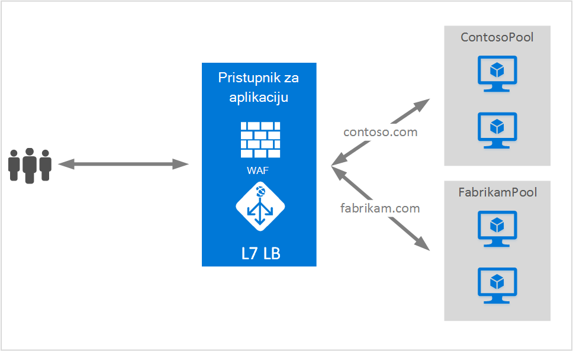

<properties
   pageTitle="Hostiranje više web-mjesta na aplikaciju pristupnika | Microsoft Azure"
   description="Ova stranica sadrži pregled podrške za više web-mjesta aplikacije pristupnika."
   documentationCenter="na"
   services="application-gateway"
   authors="amsriva"
   manager="rossort"
   editor="amsriva"/>
<tags
   ms.service="application-gateway"
   ms.devlang="na"
   ms.topic="hero-article"
   ms.tgt_pltfrm="na"
   ms.workload="infrastructure-services"
   ms.date="10/25/2016"
   ms.author="amsriva"/>

# Pristupnik za aplikaciju više hostiranja web-mjesta

Više hostiranja web-mjesta omogućuje vam da biste konfigurirali više web-aplikacije na istoj instanci pristupnika aplikacije. Ova značajka omogućuje konfiguriranje učinkovitiji topologije za vaše implementacije dodavanjem do 20 web-mjesta u jednu aplikaciju pristupnik. Svako web-mjesto možete upućivati na vlastiti skup pozadinskog. U sljedećem primjeru pristupnik za aplikaciju je posluživanje promet za contoso.com i fabrikam.com iz dva pozadinskih poslužitelja grupe pod nazivom ContosoServerPool i FabrikamServerPool.

Zahtjevi za http://contoso.com usmjeruje se u ContosoServerPool i http://fabrikam.com usmjeruje se u FabrikamServerPool.

Na sličan način dva poddomene istu domenu nadređenog mogu nalaziti u istoj implementaciji pristupnika aplikacije. Primjeri korištenja poddomene nije moguće uključiti http://blog.contoso.com i http://app.contoso.com hostirane na implementacije pristupnika jednoj aplikaciji.

## Zaglavlja glavnog računala i poslužitelja naziva oznaka (SNI)

Postoje tri uobičajene mehanizme za omogućivanje više web-mjesta nalaze na istom infrastrukture.

1. Glavno računalo više web-aplikacije svaki na jedinstvenu IP adresu.
2. Koristite naziv glavnog računala za hostiranje više web-aplikacije na istoj IP adresa.
3. Koristiti različite priključke za hostiranje više web-aplikacije na istoj IP adresa.

Trenutno pristupnik za aplikaciju dobiti jednu javna IP adresa na kojoj je prati promet. Stoga podrške više aplikacija, svaka s vlastitom IP adresa trenutno nije podržano. Pristupnik aplikacija podržava hosting više aplikacija svaki slušanje na različite priključke, ali ovaj scenarij je potrebna aplikacije da biste prihvatili promet na Nestandardna priključke i nije često željena konfiguracija. Pristupnik za aplikaciju ovisi o HTTP 1.1 zaglavlja glavno računalo za hostiranje više web-mjesta na istom javnu IP adresu i priključak. Web-mjesta hostirane na aplikaciju pristupnika možete vidjeti i podršku SSL rasterećivanje s nastavkom TLS oznaka poslužitelja naziva (SNI). Ovaj scenarij znači da klijent preglednik i pozadinskog web-farme mora podržavati HTTP/1.1 i nastavak TLS kako je definirano u RFC 6066.

## Element konfiguracije ga slušatelj

Postojeće element konfiguracije HTTPListener poboljšani za podršku glavno računalo ime i poslužitelj naziva oznaka elemenata, koja se koristi pristupnik za aplikaciju za usmjeravanje prometa odgovarajuće pozadinskog resurse. Sljedeći primjer koda je isječak HttpListeners element datoteku predloška.

    "httpListeners": [
                {
                    "name": "appGatewayHttpsListener1",
                    "properties": {
                        "FrontendIPConfiguration": {
                            "Id": "/subscriptions/<subid>/resourceGroups/<rgName>/providers/Microsoft.Network/applicationGateways/applicationGateway1/frontendIPConfigurations/DefaultFrontendPublicIP"
                        },
                        "FrontendPort": {
                            "Id": "/subscriptions/<subid>/resourceGroups/<rgName>/providers/Microsoft.Network/applicationGateways/applicationGateway1/frontendPorts/appGatewayFrontendPort443'"
                        },
                        "Protocol": "Https",
                        "SslCertificate": {
                            "Id": "/subscriptions/<subid>/resourceGroups/<rgName>/providers/Microsoft.Network/applicationGateways/applicationGateway1/sslCertificates/appGatewaySslCert1'"
                        },
                        "HostName": "contoso.com",
                        "RequireServerNameIndication": "true"
                    }
                },
                {
                    "name": "appGatewayHttpListener2",
                    "properties": {
                        "FrontendIPConfiguration": {
                            "Id": "/subscriptions/<subid>/resourceGroups/<rgName>/providers/Microsoft.Network/applicationGateways/applicationGateway1/frontendIPConfigurations/appGatewayFrontendIP'"
                        },
                        "FrontendPort": {
                            "Id": "/subscriptions/<subid>/resourceGroups/<rgName>/providers/Microsoft.Network/applicationGateways/applicationGateway1/frontendPorts/appGatewayFrontendPort80'"
                        },
                        "Protocol": "Http",
                        "HostName": "fabrikam.com",
                        "RequireServerNameIndication": "false"
                    }
                }
            ],

Možete posjetiti [predložak resursima pomoću web-mjesta više hostiranje](https://github.com/Azure/azure-quickstart-templates/blob/master/201-application-gateway-multihosting) do završetka na kraj utemeljen na predlošku implementacije.

## Usmjeravanje pravila

Postoji nije potrebna u pravilo za usmjeravanje promjena. Usmjeravanje pravilo 'Basic' nastaviti odabrati sve odgovarajuće web-mjesta ga slušatelj odgovarajuće skupna adresa pozadinskog.

    "requestRoutingRules": [
    {
        "name": "<ruleName1>",
        "properties": {
            "RuleType": "Basic",
            "httpListener": {
                "id": "/subscriptions/<subid>/resourceGroups/<rgName>/providers/Microsoft.Network/applicationGateways/applicationGateway1/httpListeners/appGatewayHttpsListener1')]"
            },
            "backendAddressPool": {
                "id": "/subscriptions/<subid>/resourceGroups/<rgName>/providers/Microsoft.Network/applicationGateways/applicationGateway1/backendAddressPools/ContosoServerPool')]"
            },
            "backendHttpSettings": {
                "id": "/subscriptions/<subid>/resourceGroups/<rgName>/providers/Microsoft.Network/applicationGateways/applicationGateway1/backendHttpSettingsCollection/appGatewayBackendHttpSettings')]"
            }
        }

    },
    {
        "name": "<ruleName2>",
        "properties": {
            "RuleType": "Basic",
            "httpListener": {
                "id": "/subscriptions/<subid>/resourceGroups/<rgName>/providers/Microsoft.Network/applicationGateways/applicationGateway1/httpListeners/appGatewayHttpListener2')]"
            },
            "backendAddressPool": {
                "id": "/subscriptions/<subid>/resourceGroups/<rgName>/providers/Microsoft.Network/applicationGateways/applicationGateway1/backendAddressPools/FabrikamServerPool')]"
            },
            "backendHttpSettings": {
                "id": "/subscriptions/<subid>/resourceGroups/<rgName>/providers/Microsoft.Network/applicationGateways/applicationGateway1/backendHttpSettingsCollection/appGatewayBackendHttpSettings')]"
            }
        }

    }
    ]

## Daljnji koraci

Nakon učenje o više hostiranja web-mjesta, idite na [Stvaranje pristupnika za aplikaciju pomoću više hostiranja web-mjesta](application-gateway-create-multisite-azureresourcemanager-powershell.md) da biste stvorili pristupnik za aplikaciju s mogućnošću podržava više od jednog web-aplikacije.
