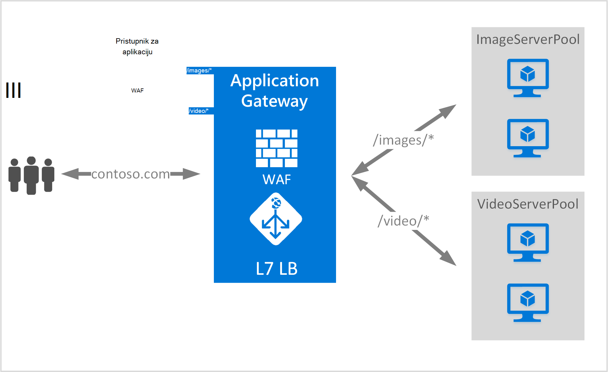

<properties
   pageTitle="Koji se temelji na URL usmjeravanje pregled sadržaja | Microsoft Azure"
   description="Ova stranica sadrži pregled utemeljen na URL pristupnika aplikacije usmjeravanja sadržaja, UrlPathMap konfiguraciju i PathBasedRouting pravilo."
   documentationCenter="na"
   services="application-gateway"
   authors="georgewallace"
   manager="carmonm"
   editor="tysonn"/>
<tags
   ms.service="application-gateway"
   ms.devlang="na"
   ms.topic="hero-article"
   ms.tgt_pltfrm="na"
   ms.workload="infrastructure-services"
   ms.date="10/25/2016"
   ms.author="gwallace"/>

# URL put temelji usmjeravanje pregled

URL put temelji usmjeravanje omogućuje usmjeravanje prometa grupe pozadinskih poslužitelja koji se temelji na URL putova zahtjeva. Jedna scenariji je usmjeravanje zahtjeva za različite vrste sadržaja za različite pozadinskog poslužitelja grupe.
U sljedećem primjeru pristupnik za aplikaciju je posluživanje promet contoso.com od tri pozadinskih poslužitelja grupe, primjerice: VideoServerPool, ImageServerPool i DefaultServerPool.

Zahtjevi za http://contoso.com/video* usmjeruje VideoServerPool, i http://contoso.com/images* usmjeruje se u ImageServerPool. Ako nijedan od uzoraka put ne odgovara odabran je DefaultServerPool.

## UrlPathMap konfiguracije element

UrlPathMap element se koristi za određivanje put uzorcima da mapiranja skup pozadinskih poslužitelja. Sljedeći primjer koda je isječak urlPathMap element datoteku predloška.

    "urlPathMaps": [
    {
    "name": "<urlPathMapName>",
    "id": "/subscriptions/<subscriptionId>/../microsoft.network/applicationGateways/<gatewayName>/ urlPathMaps/<urlPathMapName>",
    "properties": {
        "defaultBackendAddressPool": {
            "id": "/subscriptions/<subscriptionId>/../microsoft.network/applicationGateways/<gatewayName>/backendAddressPools/<poolName>"
        },
        "defaultBackendHttpSettings": {
            "id": "/subscriptions/<subscriptionId>/../microsoft.network/applicationGateways/<gatewayName>/backendHttpSettingsList/<settingsName>"
        },
        "pathRules": [
            {
                "paths": [
                    <pathPattern>
                ],
                "backendAddressPool": {
                    "id": "/subscriptions/<subscriptionId>/../microsoft.network/applicationGateways/<gatewayName>/backendAddressPools/<poolName2>"
                },
                "backendHttpsettings": {
                    "id": "/subscriptions/<subscriptionId>/../microsoft.network/applicationGateways/<gatewayName>/backendHttpsettingsList/<settingsName2>"
                },

            },

        ],

    }
    }
    

>[AZURE.NOTE] PathPattern: Ta je postavka popis uzoraka put tako da odgovara. Svaki moraju započeti znakom / i samo stavi na "*" je dopušteno nalazi se na kraj sljedeće na "/". Niz koji se umeće matcher put ne sadržavati nikakav tekst nakon prve? ili # i te znakove nije dopušteno ovdje. 

Preporučujemo da pročitate [predložak resursima pomoću URL-poštu usmjeravanje](https://azure.microsoft.com/documentation/templates/201-application-gateway-url-path-based-routing) dodatne informacije.

## PathBasedRouting pravila

RequestRoutingRule vrste PathBasedRouting se koristi za povezivanje s ga slušatelj na urlPathMap. Sve zahtjeve za primljene za ovaj ga slušatelj usmjeruje na temelju pravila naveden u urlPathMap.
Isječak PathBasedRouting pravila:

    "requestRoutingRules": [
    {

    "name": "<ruleName>",
    "id": "/subscriptions/<subscriptionId>/../microsoft.network/applicationGateways/<gatewayName>/requestRoutingRules/<ruleName>",
    "properties": {
        "ruleType": "PathBasedRouting",
        "httpListener": {
            "id": "/subscriptions/<subscriptionId>/../microsoft.network/applicationGateways/<gatewayName>/httpListeners/<listenerName>"
        },
        "urlPathMap": {
            "id": "/subscriptions/<subscriptionId>/../microsoft.network/applicationGateways/<gatewayName>/ urlPathMaps/<urlPathMapName>"
        },

    }
    
## Daljnji koraci

Nakon učenje usmjeravanje utemeljen na URL sadržaja, otvorite [Stvaranje pristupnika za aplikaciju pomoću URL-poštu usmjeravanje](application-gateway-create-url-route-portal.md) da biste stvorili pristupnik za aplikaciju s URL-a pravila za usmjeravanje.
