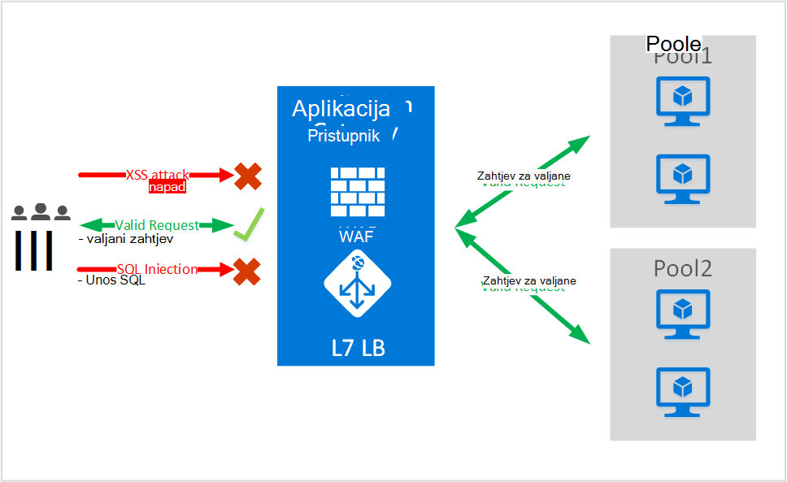
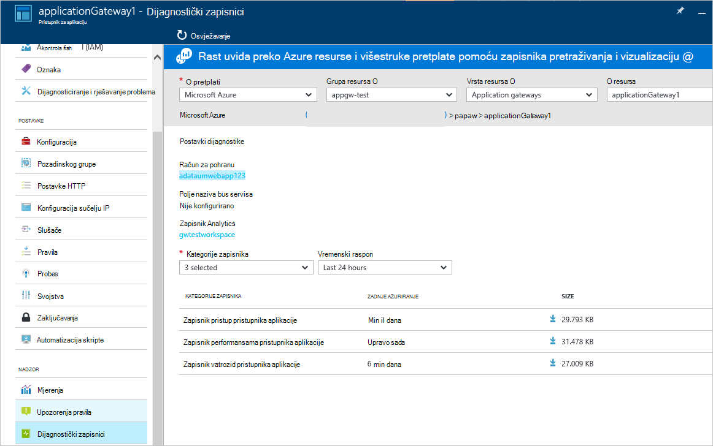

<properties
   pageTitle="Uvod u Vatrozid za aplikaciju Web (WAF) za pristupnik za aplikaciju | Microsoft Azure"
   description="Ova stranica sadrži pregled sustava Web aplikacije vatrozid (WAF) za pristupnik za aplikaciju "
   documentationCenter="na"
   services="application-gateway"
   authors="amsriva"
   manager="rossort"
   editor="amsriva"/>
<tags
   ms.service="application-gateway"
   ms.devlang="na"
   ms.topic="hero-article"
   ms.tgt_pltfrm="na"
   ms.workload="infrastructure-services"
   ms.date="10/25/2016"
   ms.author="amsriva"/>

# Aplikacija pristupnika Web aplikacije vatrozid (pretpregled)

Vatrozid aplikaciju za web (WAF) je značajka pristupnika azure aplikacije koja omogućuje zaštitu web-aplikacije pod utjecajem pristupnika aplikacije za standardne funkcije aplikacije isporuke kontrola (ADC). Vatrozid web aplikacije to tako da ih protiv većinu na OWASP gornji 10 uobičajenih web slabe točke zaštitu. Web-aplikacije su sve ciljnih web-mjesta zlonamjernog napada koji izrabljuje uobičajenih poznate slabe točke. Uobičajeni među ove opasnosti SQL unos napada, višestrukih web-mjesta skriptiranje napadima nekoliko. Sprječavanje takvo napada u kodu aplikacije mogu biti zahtjevne, a možda ćete morati stroge održavanja zakrpa te praćenje na više Slojevi Topologija aplikacije. Vatrozid za aplikaciju središnje web zaštiti od napada putem weba sigurnost upravljanje čini mnogo jednostavnijim te nudi bolje jamstvo aplikaciju od prijetnji upada. Rješenje WAF može brzo da biste brže prijetnju sigurnost po zakrpa poznate slabe na središnjem mjestu nasuprot zaštiti svih pojedinačnih web-aplikacije. Postojeće pristupnika aplikacije mogu pretvoriti u pristupnik za aplikaciju s vatrozidom aplikaciju za web jednostavno.

Pristupnik za aplikaciju pristajete programa kontroler isporuke aplikacije i nudi SSL prekid, afinitet utemeljen na kolačića sesije, opterećenja kružnog razdiobu, sadržaja koji se temelje usmjeravanje, mogućnost za hostiranje više poboljšanja web-mjesta i sigurnost. Poboljšanja sigurnosti računala pristupnika koje nudi obuhvaćaju SSL Upravljanje pravilima, end da biste završetka SSL podrška. Ne možemo su strengthening sigurnosne mogućnosti aplikacije servisa uvođenjem WAF (web aplikacije vatrozida) izravno integriranom ADC koja nudi. Pruža lako konfiguriranje središnje mjesto za upravljanje i zaštiti web-aplikacije od uobičajenih web slabe točke.

Konfiguriranje WAF pristupnika za aplikaciju pruža sljedeće prednosti vam:

- Web-aplikacije zaštititi od slabe točke web i napada bez izmjene pozadinskog kod.
- Zaštita više web-aplikacija u isto vrijeme iza pristupnik za aplikacije. Pristupnik aplikacija podržava hosting do 20 web-mjesta iza jedan pristupnik koji nije sve zaštićene protiv napada web.
- Praćenje web-aplikacije protiv napada pomoću u stvarnom vremenu izvješća generira aplikacije pristupnika WAF zapisnika.
- Određene kontrole za usklađenost zahtijevaju sve internet dostupnog krajnje točke za rješenje WAF zaštićen. Pomoću aplikacije pristupnika WAF omogućeno zadovoljavate te zahtjevima za usklađenosti.

## Pregled

Aplikacija pristupnika WAF je ponuđen u nove SKU-om (WAF SKU-om), a dolazi konfiguriranog ModSecurity i OWASP Core pravilo postavili koja nude osnovne zaštitu od najviše od na OWASP gornji 10 uobičajenih web slabe točke.

- Zaštita unos SQL
- Unakrsni skriptiranja zaštite web-mjesta
- Uobičajeni Web napadima zaštite kao što su naredbe unos, HTTP zahtjev smuggling HTTP odgovor podjele, i napada uvrštavanja udaljene datoteke
- Zaštita od kršenja HTTP protokola
- Zaštitu od HTTP protokol anomalies kao što su nedostaje hostira korisnički agent i prihvatiti zaglavlja
- HTTP DoS zaštiti uključujući HTTP flooding i sporo sprječavanje HTTP DoS
- Sprječavanje protiv robotima, radi indeksiranja i skenera
- Prepoznavanje uobičajenih aplikacije pogreške u konfiguraciji (odnosno Apache IIS, itd)

## Načini rada s WAF

Aplikacija pristupnika WAF moguće je konfigurirati da biste pokrenuli u sljedeća dva načina:

- **Način za otkrivanje** – kada je konfiguriran za pokretanje u načinu rada za otkrivanje, WAF pristupnika aplikacije nadzire i prijavljuje sva upozorenja prijetnju u datoteke zapisnika. Koje je potrebno provjeriti zapisivanje Dijagnostika za pristupnik za aplikaciju je li uključena korištenjem dijagnostike sekcije. Također ćete zapisnika WAF je li odabrana i uključeno.
- **Načinom rada za sprječavanje** – kada je konfiguriran za izvođenje u načinu rada za sprječavanje, aplikacija pristupnika aktivno blokira upada i napada otkrio njegovih pravila. Napadač prima 403 neovlašten pristup iznimku, a zatim prekida vezu. Da biste se prijavili kao što je napada zapisnike WAF nastavlja se načinom rada za sprječavanje.

## Aplikacija pristupnika WAF izvješća

Aplikacija pristupnika WAF sadrži detaljne izvješćivanje o pogreškama na svakom prijetnju otkrije. Zapisivanje integriran s Azure dijagnostičkog zapisnika i upozorenja snimaju u JSON osnovni oblik.

    {
        "resourceId": "/SUBSCRIPTIONS/<subscriptionId>/RESOURCEGROUPS/<resourceGroupName>/PROVIDERS/MICROSOFT.NETWORK/APPLICATIONGATEWAYS/<applicationGatewayName>",
        "operationName": "ApplicationGatewayFirewall",
        "time": "2016-09-20T00:40:04.9138513Z",
        "category": "ApplicationGatewayFirewallLog",
        "properties":     {
            "instanceId":"ApplicationGatewayRole_IN_0",
            "clientIp":"108.41.16.164",
            "clientPort":1815,
            "requestUri":"/wavsep/active/RXSS-Detection-Evaluation-POST/",
            "ruleId":"OWASP_973336",
            "message":"XSS Filter - Category 1: Script Tag Vector",
            "action":"Logged",
            "site":"Global",
            "message":"XSS Filter - Category 1: Script Tag Vector",
            "details":{"message":" Warning. Pattern match "(?i)(<script","file":"/owasp_crs/base_rules/modsecurity_crs_41_xss_attacks.conf","line":"14"}}
    }

## Cijene za aplikaciju pristupnika WAF SKU

Tijekom pretpregleda, postoje bez dodatnih naknade za korištenje aplikacije pristupnika WAF. Nastavite naplatiti pri postojećeg osnovni SKU naknade. Ne možemo će komunicirati naknada WAF SKU trenutku GA. Korisnici koji ste odabrali za implementaciju aplikacije pristupnika u WAF SKU želite pokrenuti accruing WAF SKU cijene tek nakon što GA objava.

## Daljnji koraci

Nakon dobivanje dodatnih informacija o mogućnostima WAF, posjetite [kako konfigurirati Web aplikacije vatrozid na računala pristupnika](application-gateway-web-application-firewall-portal.md).
