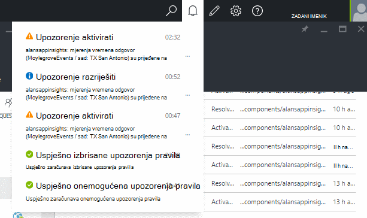

<properties 
    pageTitle="Postavljanje upozorenja u aplikaciji uvida | Microsoft Azure" 
    description="Primanje obavijesti o puta sporo odgovor, iznimke i druge performanse ili korištenje promjene u web-aplikaciji." 
    services="application-insights" 
    documentationCenter=""
    authors="alancameronwills" 
    manager="douge"/>

<tags 
    ms.service="application-insights" 
    ms.workload="tbd" 
    ms.tgt_pltfrm="ibiza" 
    ms.devlang="na" 
    ms.topic="article" 
    ms.date="10/14/2016" 
    ms.author="awills"/>
 
# Postavljanje upozorenja u aplikaciji uvida

[Uvid aplikacije za Visual Studio] [ start] mogu se upozorenje na promjene u metriku performanse ili korištenje u web-aplikaciji. 

Aplikacija uvida nadzire uživo aplikacije na [mnogo različitih platformi] [ platforms] da biste lakše dijagnosticiranje probleme s performansama i razumijevanje uzoraka korištenja.

Postoje tri vrste upozorenja:

* **Metričkim upozorenja** saznati kada sve metriku presjek vrijednosti praga u razdoblju – kao što su vrijeme odaziva, broji iznimku, procesora ili prikaza stranice. 
* [**Web-testira** ] [ availability] reći kada je web-mjesto nije dostupan na Internetu ili odgovara sporo. [Dodatne informacije][availability].
* [**Određene proaktivne Dijagnostika**](app-insights-proactive-diagnostics.md) konfigurirane automatski će obavijestiti o uzoraka neobično performanse.

Ćemo fokus mjerenja upozorenja u ovom članku.

## Postavi upozorenje na mjerenja

Otvorite plohu upozorenja pravila, a zatim pomoću gumba Dodaj. 

* Postavite resurs prije ostalih svojstava. **Odabir resursa "(komponente)"** želite li Postavljanje upozorenja na performanse i korištenje metriku.
* Naziv koji ste dali upozorenje mora biti jedinstven u grupi resursa (ne samo aplikacija).
* Pripazite da Imajte na umu jedinice u kojima se zatraži da unesete vrijednosti praga.
* Ako potvrdite okvir "E-pošte vlasnici...", upozorenja se šalju putem e-pošte svakome tko ima pristup ovu grupu resursa. Da biste proširili taj skup osobe, dodajte ih u [grupu resursa ili pretplate](app-insights-resources-roles-access-control.md) (ne resurs).
* Ako navedete "Dodatne poruke e-pošte" upozorenja poslat će se odgovarajućim pojedincima ili grupama (li koje ste potvrdili okvir "e-pošte vlasnici..."). 
* Ako ste postavili web-aplikacije koje odgovara upozorenja, postavite [webhook adresa](../monitoring-and-diagnostics/insights-webhooks-alerts.md) . Će se pozivati prilikom aktiviranja upozorenje (koju, pokreće) i kada je riješen. (Ali imajte na umu da trenutno, parametara upita nije su prošli kroz kao svojstva webhook.)
* Možete onemogućiti ili omogućiti Upozorenje: potražite gumbe na vrhu na plohu.

*Ne vidim gumb Dodaj upozorenje.* 

- Koristite račun tvrtke ili ustanove? Upozorenja možete postaviti ako ste vlasnik ili suradničke pristup ovaj resurs aplikacije. Pogledajte plohu za kontrolu pristupa. [Dodatne informacije o kontrola pristupa][roles].

> [AZURE.NOTE] Plohu upozorenja, vidjet ćete da već postoji upozorenja skup: [Određene proaktivne Dijagnostika](app-insights-proactive-failure-diagnostics.md). To je automatska upozorenja koji nadzire jednu određenu metrike, zahtjev brzina pogreške. Ako odlučite da biste onemogućili određene proaktivne upozorenja, ne morate postaviti vlastitu upozorenje na učestalost zahtjeva nije uspjelo. 

## U odjeljku upozorenja

Primite poruku e-pošte kada je stanje upozorenja promjene između neaktivno i aktivno. 

Trenutno stanje svaki upozorenje prikazuju se u plohu upozorenja pravila.

Prikazuje se sažetak nedavne aktivnosti u odjeljku upozorenja padajućeg popisa:

Povijest promjena stanja nalazi se u zapisnik aktivnosti:

## Kako funkcionira upozorenja

* Upozorenje koje ima tri stanja: "Nikad aktivirati", "Aktivirano" i "Razriješiti." Pri zadnje vrednovanja je true, aktivirani znači uvjeta koje ste naveli.

* Obavijest se generira promjenama upozorenja stanje. (Ako upozorenja uvjet istinit već stvaranja upozorenja, možda nećete dobiti obavijest dok uvjet dolazi false.)

* Svaki obavijesti stvara poruku e-pošte ako je potvrđen okvir poruke e-pošte ili navedene adrese e-pošte. Možete pogledati i obavijesti padajućeg popisa.

* Upozorenje vrednuje se svaki put kada stigne metrike, ali ne u neki drugi način.

* Analizu objedinjuje metriku prethodnom razdoblju i uspoređuje se s praga da biste odredili novi stanje.

* Razdoblje za koje odaberete određuje interval putem kojeg pridružuje su mjernih podataka. Ne utječe na koliko često procjenjuje Upozorenje: To ovisi o učestalosti kašnjenja metriku.

* Ako nema podataka o stigne poruka za određenu metriku neko vrijeme, razmak je različitih efekata na vrednovanje upozorenja i grafikona u metričkim explorer. U eksploreru za metričkim ako nema podataka o je vidjeti dulje od intervala uzorkovanja na grafikonu, grafikon prikazuje vrijednost 0. No upozorenje koje se temelji na istom metriku nije moguće ponovno provjeriti u odnosu, a po upozorenju stanje ostaje nepromijenjen. 

    Primitku podataka koju koristite, grafikon prelazi natrag na vrijednost različita od nule. Procjenjuje upozorenja utemeljenih na podacima koji su dostupni za razdoblje koje ste naveli. Ako je nova točka podataka samo jedan dostupan u razdoblju, zbrajanja temelji se samo na točku podataka.

* Upozorenje često možete titranje između stanja upozorenja i dokumenata, čak i ako ste postavili dugo. To se može dogoditi ako je vrijednost metričke zadržite oko praga. Postoji bez hysteresis praga: prijelaz na upozorenju odvija se na iste vrijednosti kao prijelaz na dobar.

## Što su dobar upozorenja da biste postavili?

Ovisi o aplikaciji. Započeti, najbolje je li postavljanje previše mjernih podataka. Potrošite neko vrijeme pogledate metričkim grafikone pokrenutom aplikacije, da biste dobili na dojam za njegovo ponašanje normalno. Tako ćete pronaći poboljšanje njegov performansi. Postavite upozorenja da biste odredili kada otvorite metriku izvan običan zone. 

Popularne upozorenja obuhvaćaju sljedeće:

* [Preglednik metriku][client], osobito preglednika **vremena učitavanja stranice**, dobro je za web-aplikacije. Ako se vaša stranica sadrži mnogo skripte, ćete htjeti pripazite za **preglednik iznimke**. Da bi se ove mjernih podataka i upozorenja, morate postaviti [web-stranicu nadzor][client].
* **Vrijeme odaziva poslužitelja** za web-aplikacije potražite na strani poslužitelja. Kao i postavite upozorenja, nadzirali na ovu metriku da biste vidjeli ako je ovisi o neproporcionalno stope visoko zahtjev: koji mogu upućivati aplikacije nema dovoljno resursa. 
* **Iznimke server** – da biste vidjeli, to morate učiniti neke [Dodatne postavke](app-insights-asp-net-exceptions.md).

Nemojte zaboraviti automatski [određene proaktivne neuspjeh stopa Dijagnostika](app-insights-proactive-failure-diagnostics.md) praćenje Brzina kojom aplikacijom odgovori zahtjeva za kodove pogreške. 

## Automatizacija

* [Korištenje ljuske PowerShell za automatiziranje Postavljanje upozorenja](app-insights-powershell-alerts.md)
* [Korištenje webhooks da biste automatizirali odgovaranje na upozorenja](../monitoring-and-diagnostics/insights-webhooks-alerts.md)

## Vidi također

* [Testira web dostupnosti](app-insights-monitor-web-app-availability.md)
* [Postavljanje upozorenja za automatizaciju](app-insights-powershell-alerts.md)
* [Određene proaktivne dijagnostiku](app-insights-proactive-diagnostics.md) 

<!--Link references-->

[availability]: app-insights-monitor-web-app-availability.md
[client]: app-insights-javascript.md
[platforms]: app-insights-platforms.md
[roles]: app-insights-resources-roles-access-control.md
[start]: app-insights-overview.md

 