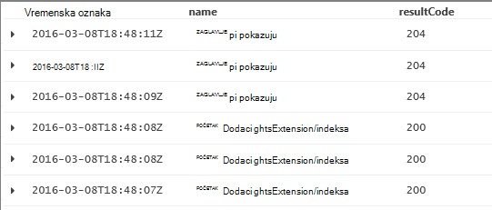
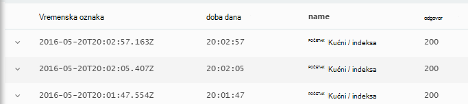

<properties 
    pageTitle="Vodič kroz analize u aplikaciji uvida | Microsoft Azure" 
    description="Kratki uzorci glavni upita u analize, alat za napredno pretraživanje uvida aplikacije." 
    services="application-insights" 
    documentationCenter=""
    authors="alancameronwills" 
    manager="douge"/>

<tags 
    ms.service="application-insights" 
    ms.workload="tbd" 
    ms.tgt_pltfrm="ibiza" 
    ms.devlang="na" 
    ms.topic="article" 
    ms.date="10/15/2016" 
    ms.author="awills"/>


 
# <a name="a-tour-of-analytics-in-application-insights"></a>Vodič kroz analize u aplikaciji uvida


[Analitički](app-insights-analytics.md) je napredna pretraživanja značajka [Uvida aplikacije](app-insights-overview.md). Ove stranice opišite upita lanquage analize.


* **[Pogledajte uvodni videozapis](https://applicationanalytics-media.azureedge.net/home_page_video.mp4)**.
* **[Probnu vožnju analize na našem Simulirani podataka](https://analytics.applicationinsights.io/demo)** ako aplikacija nije slanje podataka do uvida aplikacije još.


Pogledajmo vodič kroz nekoliko osnovnih upita za početak.

## <a name="connect-to-your-application-insights-data"></a>Povezivanje s vašim podacima uvida aplikacije

Otvaranje analize iz aplikacije programa [plohu pregled](app-insights-dashboards.md) u aplikaciji uvida:


    
## <a name="takeapp-insights-analytics-referencemdtake-operator-show-me-n-rows"></a>[Preuzimanje](app-insights-analytics-reference.md#take-operator): Pokaži n redaka

Točke podataka koje se prijave korisnika operacije (obično HTTP zahtjeva primio web-aplikaciju programa) spremaju se u tablici koja se naziva `requests`. Svaki redak je točku telemetrijskih podataka poslao SDK uvida aplikaciju u aplikacije.

Započnimo Provjera nekoliko oglednih redaka tablice:


> [AZURE.NOTE] Postavite kursor na negdje u naredbu prije kliknite Idi. Izjava o možete podijeliti na više od jednog retka, no Nemojte smještati praznih redaka u naredbi. Prazni reci su praktičan način da biste zadržali nekoliko odvojenih upita u prozoru.


Odabir stupaca, povucite ih Grupiranje prema stupcima, i filtra: 


Proširite bilo koju stavku da biste vidjeli detalje:
 


> [AZURE.NOTE] Kliknite zaglavlje stupca da biste ponovno naručiti rezultate koji su dostupni u web-pregledniku. No imajte na umu da za skup rezultata za veliki broj redaka koji se preuzimaju u pregledniku ograničen. Sortiranje na taj način ne uvijek pokazuju stvarni najviše ili najniže stavke. Da biste stavke sortirali pouzdano, poslužite se `top` ili `sort` operator. 

## <a name="topapp-insights-analytics-referencemdtop-operator-and-sortapp-insights-analytics-referencemdsort-operator"></a>[Vrh](app-insights-analytics-reference.md#top-operator) i [Sortiranje](app-insights-analytics-reference.md#sort-operator)

`take`koristan je da biste brzo uzorka rezultata, ali pojedinačnom redoslijedu prikazuje retke iz tablice. Da biste uređeni prikaz, koristite `top` (na primjer) ili `sort` (iznad cijelu tablicu).

Prikaz prvih n redaka, naručili prema određenom stupcu:

```AIQL

    requests | top 10 by timestamp desc 
```

* *Sintakse:* Većina operatori imati parametara ključne riječi kao što su `by`.
* `desc`= silaznim redoslijedom, `asc` = uzlazno.


`top...`je više performant način sljedeću `sort ... | take...`. Nije moguće zapisan:

```AIQL

    requests | sort by timestamp desc | take 10
```

Rezultat će biti iste, no funkcionirat će malo sporije. (Također možete napisati `order`, koji je pseudonima od `sort`.)

Zaglavlja stupaca u prikazu tablice može se koristiti i da biste sortirali rezultate na zaslonu. No Naravno, ako ste iskoristili `take` ili `top` dohvatiti samo dio tablice, koje ćete samo promjenu redoslijeda ste dohvaća zapise.


## <a name="projectapp-insights-analytics-referencemdproject-operator-select-rename-and-compute-columns"></a>[Projekt](app-insights-analytics-reference.md#project-operator): odaberite, preimenovati i izračunati stupci

Korištenje [`project`](app-insights-analytics-reference.md#project-operator) da biste odabrali više stupaca koje želite:

```AIQL

    requests | top 10 by timestamp desc
             | project timestamp, name, resultCode
```




Preimenujte stupce i definiranje nove:

```AIQL

    requests 
  	| top 10 by timestamp desc 
  	| project  
            name, 
            response = resultCode,
            timestamp, 
            ['time of day'] = floor(timestamp % 1d, 1s)
```



* [Nazivi stupaca](app-insights-analytics-reference.md#names) mogu sadržavati razmake ili simbole ako oni su zagradama ovako: `['...']` ili`["..."]`
* `%`je uobičajeni modulo operator. 
* `1d`(to je znamenki, a zatim na imali ') je vremenski raspon slovni što znači da jedan dan. Ovo su neke dodatne literala vremenski raspon: `12h`, `30m`, `10s`, `0.01s`.
* `floor`(pseudonim `bin`) zaokružuje vrijednost na najbliži višekratnik broja osnovnu vrijednost unesete. Stoga `floor(aTime, 1s)` zaokružuje jedan prema dolje do najbližeg sekundi.

[Izraze](app-insights-analytics-reference.md#scalars) mogu sadržavati uobičajene operatore (`+`, `-`,...), a raspon korisne funkcije.

    

## <a name="extendapp-insights-analytics-referencemdextend-operator-compute-columns"></a>[Proširi](app-insights-analytics-reference.md#extend-operator): izračunati stupci

Ako samo želite dodati stupce postojeće, koristite [`extend`](app-insights-analytics-reference.md#extend-operator):

```AIQL

    requests 
  	| top 10 by timestamp desc
  	| extend timeOfDay = floor(timestamp % 1d, 1s)
```

Korištenje [`extend`](app-insights-analytics-reference.md#extend-operator) je manje opširno od [`project`](app-insights-analytics-reference.md#project-operator) ako želite da ostanu postojećih stupaca.


## <a name="summarizeapp-insights-analytics-referencemdsummarize-operator-aggregate-groups-of-rows"></a>[Sažmi](app-insights-analytics-reference.md#summarize-operator): aggregate grupe redaka

`Summarize`primjenjuje navedena *funkcija zbrajanja* putem grupe redaka. 

Ako je, primjerice, vrijeme web-aplikaciju programa potrebno odgovoriti na zahtjev za prijavljene polje `duration`. Pogledajmo average reakcija sve zahtjeve za:


Ili ne možemo razdvojiti rezultat u zahtjeva za različite nazive učinite sljedeće:


`Summarize`prikuplja podatkovne točke u toka u grupe za koje na `by` uvjet jednako procjenjuje. Svaku vrijednost u na `by` izraz - svaki naziv operacije u primjeru iznad - rezultira retka u tablici rezultata. 

Ili ne možemo grupiranje rezultata prema doba dana:


Obratite pozornost na to kako ćemo koristite na `bin` funkcija (ili `floor`). Ako samo koristi `by timestamp`, svaki unos redak želite završiti u vlastitu grupu malo. Za sve neprekinuti skalar kao što su vrijeme ili brojeve, imamo prekinuti kontinuiranom rasponu u kojima se upravlja broj samostalni vrijednosti i `bin` -koji je zaista samo na poznatih zaokruživanja prema dolje `floor` funkcija - je Najlakši način da to učinite.

Ćemo istu tehniku možete koristiti da biste smanjili raspona nizova:


Obavijest o koje možete koristiti `name=` da biste postavili naziv stupca rezultat izrazi skupljanja ili na by uvjetu.

## <a name="counting-sampled-data"></a>Brojanje ogledne podatke

`sum(itemCount)`je preporučena zbrajanja za brojanje događaja. U mnogim slučajevima, BrojArtikala == 1, pa funkcija jednostavno broji broj redaka u grupi. No kada je [uzorkovanje](app-insights-sampling.md) u operaciji, samo razlomak izvorne događaji se zadržavaju kao podatkovne točke u uvide aplikacije tako da za svaku vidite točku podataka, postoje `itemCount` događaja. 

Na primjer, ako uzorkovanje odbacuje 75% od izvorne događaje, zatim BrojArtikala == 4 u zadržane zapisa – to jest, za svaki zapis zadržane postoje četiri izvornog zapisa. 

Prilagodljivo uzorkovanje uzrokuje BrojArtikala biti veća tijekom razdoblja kada aplikacija je koji se često koristi.

Stoga sažetak BrojArtikala omogućuje dobar procjenu izvorni broj događaja.


Postoji i u `count()` zbrajanja (i broj operacije), za slučaj da se mjesto koje zaista želite brojanje redaka u grupi.


Postoji raspon [funkcije zbrajanja](app-insights-analytics-reference.md#aggregations).


## <a name="charting-the-results"></a>Stvaranje grafikona rezultata


```AIQL

    exceptions 
       | summarize count()  
         by bin(timestamp, 1d)
```

Prema zadanim postavkama, rezultati prikazuju kao tablicu:


Možemo bolje nego prikaz tablice. Pogledajmo rezultate u prikazu grafikon s okomite trake mogućnost:


Primijetit ćete da Premda smo niste sortiranje rezultata prema vremenu (kao što vidite u prikazu tablice), prikaz grafikona uvijek prikazuje njih ispravnim redoslijedom.


## <a name="whereapp-insights-analytics-referencemdwhere-operator-filtering-on-a-condition"></a>[Gdje](app-insights-analytics-reference.md#where-operator): filtriranje na uvjeta

Ako ste postavili aplikacije uvida nadzor za [postupak klijentske](app-insights-javascript.md) i poslužiteljske strane aplikacije, neke od telemetriju u bazi podataka dolazi iz preglednika.

Pogledajmo samo iznimke prijavljenih iz preglednika:

```AIQL

    exceptions 
  	| where client_Type == "Browser" 
  	|  summarize count() 
       by client_Browser, outerMessage 
```


Na `where` operator vodi Booleov izraz. Evo nekoliko ključnih informacija o njima:

 * `and`, `or`: Logički operatori
 * `==`, `<>` : jednako i nije jednako
 * `=~`, `!=` : velika i mala slova niza jednako i nije jednako. Postoji mnogo više operatori usporedbe niz.

Saznajte sve o [skalarna izraza](app-insights-analytics-reference.md#scalars).

### <a name="filtering-events"></a>Filtriranje događaja

Pronalaženje zahtjeva nije uspjelo:

```AIQL

    requests 
  	| where isnotempty(resultCode) and toint(resultCode) >= 400
```

`responseCode`sadrži vrste niz pa ćemo mora [ga pretvoriti](app-insights-analytics-reference.md#casts) numeričke usporedbu.

Sažetak odgovora na drugu:

```AIQL

    requests
  	| where isnotempty(resultCode) and toint(resultCode) >= 400
  	| summarize count() 
      by resultCode
```

## <a name="timecharts"></a>Timecharts

Prikaži koliko se disciplina li se svakog dana:

```AIQL

    requests
      | summarize event_count=count()
        by bin(timestamp, 1d)
```

Odaberite željenu mogućnost prikaza grafikona:


## <a name="multiple-series"></a>Više nizova 

Više izraza u na `summarize` stvara više stupaca.

Više izraza u na `by` stvara više redaka, jedan za svaku kombinaciju vrijednosti.


```AIQL

    requests
  	| summarize count(), avg(duration) 
      by bin(timestamp, 1d), client_StateOrProvince, client_City 
  	| order by timestamp asc, client_StateOrProvince, client_City
```


### <a name="segment-a-chart-by-dimensions"></a>Fazi grafikona po dimenzijama

Ako grafikon tablicu koja sadrži stupac niza i numerički stupac, niz može koristiti podijeliti numeričke podatke u zasebnom niz točaka. Ako postoji više od jednog stupca u nizu, možete odabrati koji stupac koji želite koristiti kao u discriminator. 


### <a name="display-multiple-metrics"></a>Prikaz više mjerenja

Ako grafikon tablice te više od jednog stupca numerički, osim vremenske oznake, možete prikazati bilo koju kombinaciju ih.


Podjela ne morate odabrati prije no što odaberete više brojčanih stupaca ne možete podijeliti po stupcu niza u isto vrijeme kao prikaz više numerički stupac. 


## <a name="daily-average-cycle"></a>Dnevni average ciklusa

Kako korištenje ne razlikuju iznad prosjeka dan?

Count zahtjevi po vremenu modulo jedan dan binned u sate:

```AIQL

    requests
  	| extend hour = floor(timestamp % 1d , 1h) 
          + datetime("2016-01-01")
  	| summarize event_count=count() by hour
```


>[AZURE.NOTE] Obratite pozornost na to trenutno imamo da biste pretvorili vrijeme trajanja njih da bi se prikazati na grafikonu.


## <a name="compare-multiple-daily-series"></a>Usporedba više dnevnih nizova

Kako ne korištenje se razlikuju tijekom vremena dan u različite države?

```AIQL

 requests  | where tostring(operation_SyntheticSource)
     | extend hour= floor( timestamp % 1d , 1h)
           + datetime("2001-01-01")
     | summarize event_count=count() 
       by hour, client_CountryOrRegion 
     | render timechart
```


## <a name="plot-a-distribution"></a>Iscrtavanje distribucije

Koliko sesije postoje od različite duljine?

```AIQL

    requests 
  	| where isnotnull(session_Id) and isnotempty(session_Id) 
  	| summarize min(timestamp), max(timestamp) 
      by session_Id 
  	| extend sessionDuration = max_timestamp - min_timestamp 
  	| where sessionDuration > 1s and sessionDuration < 3m 
  	| summarize count() by floor(sessionDuration, 3s) 
  	| project d = sessionDuration + datetime("2016-01-01"), count_
```

Da biste pretvorili datetime potreban je zadnji redak. Trenutno x osi grafikona prikazuje se kao skalarnu samo ako je s datumom i vremenom.

Na `where` uvjet isključuje one-shot sesije (sessionDuration == 0), a postavlja duljinu osi x.


## <a name="percentilesapp-insights-analytics-referencemdpercentiles"></a>[Percentili](app-insights-analytics-reference.md#percentiles)

Što raspona trajanja pokrivaju različitih postotaka sesije?

Pomoću gore navedeni upit, ali zamijeniti posljednjeg retka:

```AIQL

    requests 
  	| where isnotnull(session_Id) and isnotempty(session_Id) 
  	| summarize min(timestamp), max(timestamp) 
      by session_Id 
  	| extend sesh = max_timestamp - min_timestamp 
  	| where sesh > 1s
  	| summarize count() by floor(sesh, 3s) 
  	| summarize percentiles(sesh, 5, 20, 50, 80, 95)
```

Ne možemo i ukloniti gornju granicu na mjestu gdje uvjet WHERE, da biste dobili točne slika uključujući sve sesije sa zahtjevom za više:


Odakle Vidimo koji:

* 5% sesije imaju trajanja manje od 3 minute 34s; 
* 50% sesije zadnji manje od 36 minnutes;
* 5% sesija zadnji više od sedam dana

Da biste dobili zasebna analitički za svaku državu smo samo su da bi se prikazala stupcu client_CountryOrRegion zasebno kroz oba sažetak operatora:

```AIQL

    requests 
  	| where isnotnull(session_Id) and isnotempty(session_Id) 
  	| summarize min(timestamp), max(timestamp) 
      by session_Id, client_CountryOrRegion
  	| extend sesh = max_timestamp - min_timestamp 
  	| where sesh > 1s
  	| summarize count() by floor(sesh, 3s), client_CountryOrRegion
  	| summarize percentiles(sesh, 5, 20, 50, 80, 95)
      by client_CountryOrRegion
```


## <a name="joinapp-insights-analytics-referencemdjoin"></a>[Uključivanje](app-insights-analytics-reference.md#join)

Imamo pristup više tablica, uključujući zahtjeve i iznimaka.

Da biste pronašli iznimke vezane uz zahtjev koji vraća pogrešku odgovor, ne možemo možete se uključiti tablice `session_Id`:

```AIQL

    requests 
  	| where toint(responseCode) >= 500 
  	| join (exceptions) on operation_Id 
  	| take 30
```


Dobro da biste koristili je `project` za odabir stupaca moramo prije izvođenja spoja.
U istoj rečenice smo preimenujte stupac vremenska oznaka.


## <a name="letapp-insights-analytics-referencemdlet-clause-assign-a-result-to-a-variable"></a>[Omogućivanje](app-insights-analytics-reference.md#let-clause): dodjeljivanje rezultat tjednog prikaza kalendara

Koristite [omogućuju](./app-insights-analytics-reference.md#let-statements) za razdvajanje dijelova prethodne izraza. Rezultati su nepromijenjen:

```AIQL

    let bad_requests = 
      requests
        | where  toint(resultCode) >= 500  ;
    bad_requests
  	| join (exceptions) on session_Id 
  	| take 30
```

> Savjet: U klijentu analize Nemojte smještati praznih redaka između dijelova ove. Provjerite je li za sve to izvršavanje.


## <a name="accessing-nested-objects"></a>Pristup ugniježđene objekata

Ugniježđene objekte možete jednostavno pristupiti. Ako, na primjer, u strujanje iznimke vidjet ćete strukturirane objekata kao što je ovaj:


Stopi ga tako da odaberete svojstva koja vas zanima:

```AIQL

    exceptions | take 10
  	| extend method1 = tostring(details[0].parsedStack[1].method)
```

Imajte na umu da morate koristiti [glumcima](app-insights-analytics-reference.md#casts) odgovarajuću vrstu.

## <a name="custom-properties-and-measurements"></a>Prilagođena svojstva i mjerenja

Ako aplikacija pridružuje [prilagođenu verziju (svojstava) i prilagođene mjere](app-insights-api-custom-events-metrics.md#properties) događaja, a zatim vidjet ćete ih u `customDimensions` i `customMeasurements` objekte.


Na primjer, ako sadrži aplikacije:

```C#

    var dimensions = new Dictionary<string, string> 
                     {{"p1", "v1"},{"p2", "v2"}};
    var measurements = new Dictionary<string, double>
                     {{"m1", 42.0}, {"m2", 43.2}};
    telemetryClient.TrackEvent("myEvent", dimensions, measurements);
```

Da biste izdvojili te vrijednosti u analize:

```AIQL

    customEvents
  	| extend p1 = customDimensions.p1, 
      m1 = todouble(customMeasurements.m1) // cast to expected type

``` 

## <a name="tables"></a>Tablica

Strujanje telemetrijskih primili iz aplikacije programa je dostupan putem nekoliko tablica. Shema svojstva dostupna za svaku tablicu vidljiv je na lijevoj strani prozora.

### <a name="requests-table"></a>Zahtjevi za tablice

Count HTTP zahtjevima za web-aplikacije i segmenta prema nazivu stranice:


Pronalaženje zahtjeva za koje ne prođu Većina:


### <a name="custom-events-table"></a>Prilagođene događaje tablice

Ako koristite [TrackEvent()](app-insights-api-custom-events-metrics.md#track-event) da biste poslali vlastite događaje, možete ih čitati iz ove tablice. 

Pogledajmo primjer u kojem kod aplikacije sadrži ove retke:

```C#

    telemetry.TrackEvent("Query", 
       new Dictionary<string,string> {{"query", sqlCmd}},
       new Dictionary<string,double> {
           {"retry", retryCount},
           {"querytime", totalTime}})
```

Prikaz učestalost ovih događaja:
 


Izdvajanje mjere i dimenzija sa događaja:


### <a name="custom-metrics-table"></a>Prilagođeni mjernih podataka tablice

Ako koristite [TrackMetric()](app-insights-api-custom-events-metrics.md#track-metric) da biste poslali metričkim vrijednosti, pronaći ćete rezultate u **customMetrics** toka. Ako, na primjer:  


> [AZURE.NOTE] [Explorer metriku](app-insights-metrics-explorer.md)sve prilagođene mjere priložiti bilo koju vrstu telemetrijskih pojavljuju zajedno u plohu metriku uz metriku poslana pomoću `TrackMetric()`. No u analize, prilagođene mjere su i dalje priložene bez obzira vrstu telemetrijskih oni su preneseni na - događaja ili zahtjeva za i tako dalje - tijekom mjerenja poslao TrackMetric pojavljuju se u vlastite strujanje.

### <a name="performance-counters-table"></a>Performanse mjerača tablice

[Mjerača performansi](app-insights-performance-counters.md) Prikaži metriku osnovni sustava za aplikaciju programa, kao što su procesora i memorije Upotreba mreže. Možete konfigurirati SDK da biste poslali dodatne mjerača, uključujući vlastite prilagođene mjerača.

Izlaže shemi **performanceCounters** na `category`, `counter` naziv i `instance` naziv svaki mjerača performansi. Brojač instance imena primjenjuju samo na nekim mjerača performansi i obično označava naziv postupka na koji se odnosi na broj. U telemetrijskih za svaku aplikaciju, vidjet ćete samo mjerača za tu aplikaciju. Na primjer, da biste vidjeli što mjerača dostupne su: 


Da biste dobili grafikon dostupnom memorijom putem nedavno razdoblje: 


Kao što su druge telemetrijskih **performanceCounters** ima i stupac `cloud_RoleInstance` koji upućuje na to identiteta glavno računalo na kojem se izvodi aplikacije. Na primjer, da biste usporedili performanse aplikacije na drugu računala: 


### <a name="exceptions-table"></a>Iznimke tablice

[Iznimke dojavi aplikacije](app-insights-asp-net-exceptions.md) dostupne su u ovoj tablici. 

Da biste pronašli HTTP zahtjev koji aplikacije je zadužen za kada je pokrenuto iznimku, uključiti operation_Id:


### <a name="browser-timings-table"></a>Preglednik tempiranja tablice

`browserTimings`prikazuje se stranica učitavanje podataka koji se prikupljaju u preglednicima vaših korisnika.

[Postavljanje aplikacije za telemetriju klijentsko](app-insights-javascript.md) da biste vidjeli ove metriku. 

Shema sadrži [metrike koji označava duljine različite faze učitavanje proces stranice](app-insights-javascript.md#page-load-performance). (Ne označavaju trajanja korisnicima pročitajte stranicu.)  

Prikaži popularities različite stranice i učitavanje vremena za svaku stranicu:


### <a name="availbility-results-table"></a>Tablica rezultata Availbility

`availabilityResults`prikazuje rezultate [testiranja za web](app-insights-monitor-web-app-availability.md). Svaki izvođenje testiranja s mjesta svaki test prijavljuje zasebno. 


### <a name="dependencies-table"></a>Zavisnosti tablice

Prikazuje rezultate poziva aplikacije unese baze podataka i REST API-ji te druge poziva TrackDependency().

### <a name="traces-table"></a>Kašnjenja tablice

Sadrži telemetrijskih poslao aplikacije pomoću TrackTrace() ili [druge okviri zapisivanje](app-insights-asp-net-trace-logs.md).

## <a name="dashboards"></a>Nadzorne ploče

Rezultati na nadzornu ploču možete prikvačiti da bi objediniti sve najvažnije grafikone i tablice.

* [Azure zajedničke nadzorna ploča](app-insights-dashboards.md#share-dashboards): kliknite ikonu PIN-a. Prije nego što to učinite, morate imati zajedničke nadzorne ploče. Na portalu Azure otvaranje ili stvaranje nadzorne ploče, a zatim kliknite zajedničko korištenje.
* [Nadzorna ploča za Power BI](app-insights-export-power-bi.md): kliknite Izvoz, Power BI upit. Prednost ovaj zamjenski je koje možete prikazati upit duž na druge rezultate iz široku izvora.


## <a name="next-steps"></a>Daljnji koraci

* [Analitički jezična referenca](app-insights-analytics-reference.md)

[AZURE.INCLUDE [app-insights-analytics-footer](../../includes/app-insights-analytics-footer.md)]


