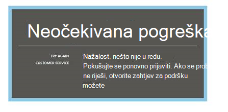
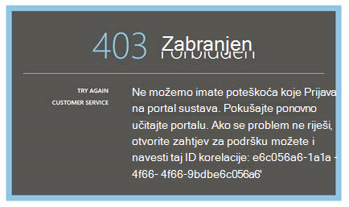
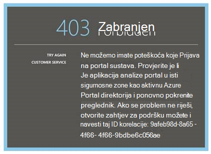
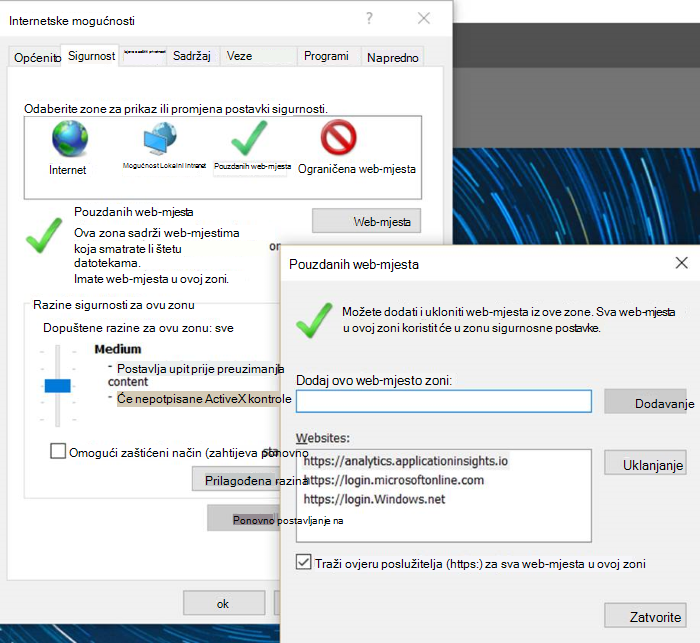
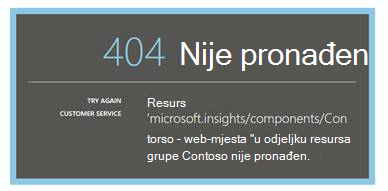
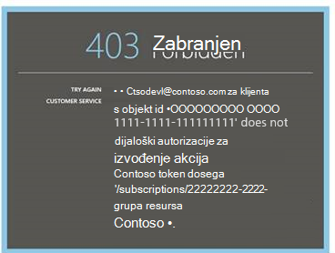
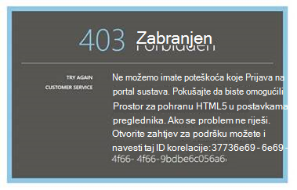
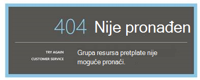
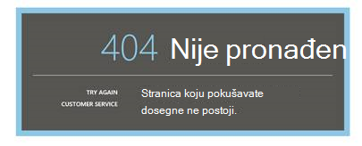

<properties 
    pageTitle="Otklanjanje poteškoća s Analytics – alat za napredno pretraživanje aplikacije uvida | Microsoft Azure" 
    description="Problemi s analize uvida aplikacije? Počnite ovdje. " 
    services="application-insights" 
    documentationCenter=""
    authors="alancameronwills" 
    manager="douge"/>

<tags 
    ms.service="application-insights" 
    ms.workload="tbd" 
    ms.tgt_pltfrm="ibiza" 
    ms.devlang="na" 
    ms.topic="article" 
    ms.date="07/11/2016" 
    ms.author="awills"/>

# Otklanjanje poteškoća prilikom analize u aplikaciji uvida

Problemi s [analize uvida aplikacije](app-insights-analytics.md)? Počnite ovdje. Analitički je alat za napredno pretraživanje uvida aplikacije za Visual Studio.

## Ograničenja

* Trenutno, rezultati upita ograničeni su na samo putem tjedan proteklih podataka.
* Preglednici ispitivanja na: najnovija izdanja Chrome, rub i Internet Explorer.

## Datotečne nastavke za poznate nekompatibilnog preglednika

* Ghostery

Onemogućite proširenja ili koristite neki drugi preglednik.

##"Neočekivana pogreška"

Tijekom izvođenja portala – neobrađenu iznimku pojavila se interna pogreška.

* Čišćenje predmemorije u pregledniku. 

## 403... Pokušajte ponovno učitajte

Za provjeru autentičnosti povezane (tijekom provjere autentičnosti ili tijekom pristup tokena generacije) pojavila se pogreška. Na portalu možda nije moguće oporaviti bez promjene postavki preglednika.

* Provjerite je li u web-pregledniku [su omogućeni kolačići treće strane](#cookies) . 

## 403... Provjerite sigurnosne zone

Za provjeru autentičnosti povezane (tijekom provjere autentičnosti ili tijekom pristup tokena generacije) pojavila se pogreška. Na portalu možda nije moguće oporaviti bez promjene postavki preglednika.

1. Provjerite je li u web-pregledniku [su omogućeni kolačići treće strane](#cookies) . 

2. Jeste li koristili favorite, knjižnu oznaku ili spremljenu vezu da biste otvorili portal analize? Su prijavljeni pomoću vjerodajnica za različite od koristi prilikom spremanja vezu?

2. Pokušajte koristiti u prozoru preglednika u-privatno/inkognito (nakon zatvaranja takve windows). Morat ćete unijeti vjerodajnice. 

2. Otvorite novi prozor (obična) preglednik i idite na [Azure](https://portal.azure.com). Odjavite se. Zatim otvorite vezu i prijavite se pomoću odgovarajuće vjerodajnice.

2. Korisnicima rub i Internet Explorer možete također se ova pogreška kad zonu pouzdanih postavke nisu podržane.

    Provjerite je li [portal analize](https://analytics.applicationinsights.io) i [Azure Active Directory portal](https://portal.azure.com) nalaze u istom sigurnosne zone:

 * U pregledniku Internet Explorer otvorite **Internetske mogućnosti**, **Sigurnost**, **Pouzdana mjesta**, **web-mjesta**:

    

    Na popisu web-mjesta ako su neki od sljedećih URL-ovi uključene, provjerite na druge jesu li uključene i:

    https://Analytics.applicationinsights.IO 
   https://login.microsoftonline.com 
   https://login.Windows.NET

## 404... Resurs nije pronađen

Aplikacija resursa izbrisan iz aplikacije uvida i više nije dostupna. To se može dogoditi ako ste spremili URL stranice analize.

## 403... Nema autorizacije

Nemate dozvolu za otvaranje ovu aplikaciju u analize.

* Je li se veza s nekom drugom? Zamolite ih da biste bili sigurni da se [čitatelji ili suradnika za ovu grupu resursa](app-insights-resources-roles-access-control.md).
* Jeste li spremiti veze pomoću vjerodajnica za različite? Otvorite [portal za Azure](https://portal.azure.com), odjavite, a zatim pokušajte ovu vezu ponovno pruža ispravne vjerodajnice.

## 403... Spremanje u obliku HTML5

Portal za naše koristi HTML5 localStorage i sessionStorage.

* Chrome: Postavke zaštite privatnosti, postavke sadržaja.
* Internet Explorer: Internetske mogućnosti, kartica Napredno, sigurnost, Omogući DOM pohranu

## 404... Pretplate nije pronađen

URL nije valjan. 

* Otvorite aplikaciju resurs portalu [Uvida aplikacije](https://portal.azure.com). Zatim pomoću gumba analize.

## 404... stranica ne postoji

URL nije valjan.

* Otvorite aplikaciju resurs portalu [Uvida aplikacije](https://portal.azure.com). Zatim pomoću gumba analize.

## Omogućivanje kolačiće trećih strana

  Saznajte [kako onemogućiti kolačiće trećih strana](http://www.digitalcitizen.life/how-disable-third-party-cookies-all-major-browsers), ali obratite pozornost na to ćemo morati **omogućiti** ih.

## Ako sve ostalo ne uspije    

[Obratite nam se](app-insights-get-dev-support.md).
 
[AZURE.INCLUDE [app-insights-analytics-footer](../../includes/app-insights-analytics-footer.md)]

