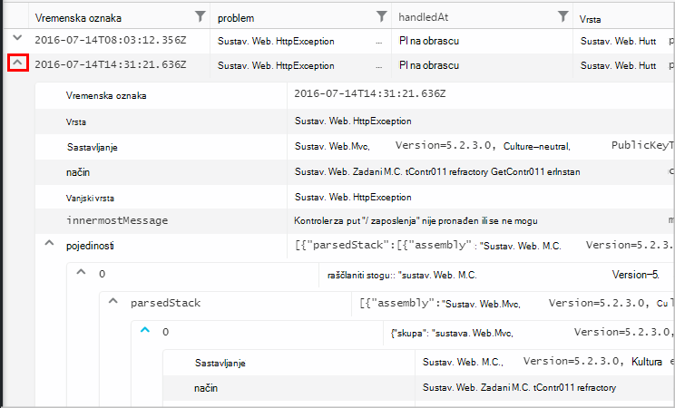
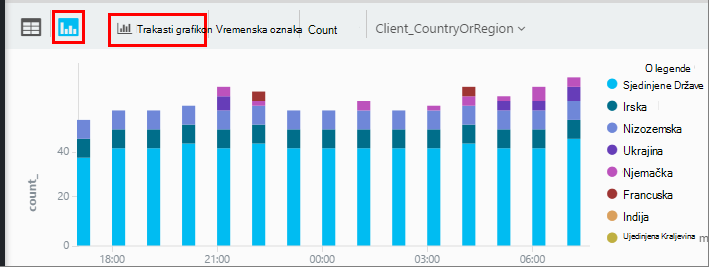

<properties 
    pageTitle="Pomoću analize – alat za napredno pretraživanje aplikacije uvida | Microsoft Azure" 
    description="Korištenje analize, alat za napredno pretraživanje dijagnostičkih uvida aplikacije. " 
    services="application-insights" 
    documentationCenter=""
    authors="danhadari" 
    manager="douge"/>

<tags 
    ms.service="application-insights" 
    ms.workload="tbd" 
    ms.tgt_pltfrm="ibiza" 
    ms.devlang="na" 
    ms.topic="article" 
    ms.date="10/21/2016" 
    ms.author="awills"/>

# Korištenje analize u aplikaciji uvida

[Analitički](app-insights-analytics.md) je napredna pretraživanja značajka [Uvida aplikacije](app-insights-overview.md). Ove stranice opišite analize jezika za upite.

* **[Pogledajte uvodni videozapis](https://applicationanalytics-media.azureedge.net/home_page_video.mp4)**.
* **[Probnu vožnju analize na našem Simulirani podataka](https://analytics.applicationinsights.io/demo)** ako aplikacija nije slanje podataka do uvida aplikacije još.

## Otvaranje Analytics

Iz aplikacije programa kućne resursa u aplikaciji uvida kliknite Analitika.

Praktični vodič izravno daje nekoliko savjeta o tome kako.

Nema [više proširenom vodiča ovdje](app-insights-analytics-tour.md).

## Vaše telemetrijskih za upite

### Pisanje upita

Započnite s nazivima bilo kojeg od tablice navedene na lijevoj strani (ili operatora [raspona](app-insights-analytics-reference.md#range-operator) ili [unije](app-insights-analytics-reference.md#union-operator) ). Korištenje `|` da biste stvorili kanal [operatora](app-insights-analytics-reference.md#queries-and-operators). IntelliSense vas operatore i neke elemente izraza koje možete koristiti.

Potražite u članku [Pregled analize jezika](app-insights-analytics-tour.md) i [jezika referenca](app-insights-analytics-reference.md).

### Izvođenje upita

1. U upitu možete koristiti i prijelome jedan redak.
2. Postavite pokazivač unutar ili na kraju upit koji želite pokrenuti.
3. Kliknite Idi da biste pokrenuli upit.
4. Nemojte smještati praznih redaka u upitu. Nekoliko zarezom upita možete držati u jednu karticu upit tako da ih s praznih redaka. Pokreće se samo jedan s pokazivačem.

### Spremanje upita

1. Spremanje trenutne datoteke upita.
2. Otvorite spremljeni upit datoteku.
3. Stvaranje nove datoteke upita.

## Prikaz detalja

Proširite bilo koji redak u rezultata da biste vidjeli cijeli popis svojstava. Dodatno možete proširiti neko svojstvo koje je strukturirane vrijednost – na primjer, prilagođenu verziju ili stog stavku iznimku.

 

## Rasporedi rezultata

Možete sortirati, filtrirati, paginate i grupiranje rezultata koji je vratio upit.

> [AZURE.NOTE] Sortiranje, grupiranje i filtriranje u pregledniku ne ponovno pokrenite upit. Samo ih razmjestiti rezultate koji su vratio zadnjeg upita. 
> 
> Da biste izveli sljedeće zadatke na poslužitelju prije nego što se vraćaju rezultate, pisanje upita pomoću operatora [sortiranja](app-insights-analytics-reference.md#sort-operator), [Sažimanje](app-insights-analytics-reference.md#summarize-operator) i [gdje](app-insights-analytics-reference.md#where-operator) .

Odaberite stupce želite potražite u članku, povucite zaglavlja stupaca da biste ih razmjestiti i promjena veličine stupaca tako da povučete njihove obrube.

### Sortiranje i filtriranje stavki

Da biste sortirali rezultate tako da kliknete zaglavlje stupca. Ponovno kliknite da biste sortirali željeni način, a zatim kliknite nekog drugog vremena da biste vratili izvorne redoslijed vratio upit.

Pomoću ikone filtra za sužavanje pretraživanja.

### Grupiraj stavke

Da biste sortirali po više stupaca, slijedite grupiranja. Najprije omogućiti, a zatim povucite zaglavlja stupaca u prostora iznad tablice.

### Nedostaje neki rezultati?

Postoji ograničenje oko 10 k redaka na stranici rezultata vratio portalu. Upozorenje prikazuje prijeđete preko ograničenje. Ako se to dogodi, sortiranja rezultata u tablici neće uvijek prikazuje vam sve stvarni prve ili zadnje rezultate. 

Dobro da biste izbjegli odlazak ograničenje je. Korištenje operatora kao što su:

* [gdje vremenska oznaka > ago(3d)](app-insights-analytics-reference.md#where-operator)
* [100 najvećih prema vremenskom oznakom](app-insights-analytics-reference.md#top-operator) 
* [iskoristite 100](app-insights-analytics-reference.md#take-operator)
* [Sažimanje](app-insights-analytics-reference.md#summarize-operator) 

## Dijagrami

Odaberite vrstu dijagrama želite:

Ako imate nekoliko stupaca vrste desno, možete odabrati x i y osi i stupca dimenzija Podjela rezultata prema.

Prema zadanim postavkama, rezultati prethodno prikazuju se kao tablicu, a ručno označite dijagram. No možete koristiti [Prikaz uputa](app-insights-analytics-reference.md#render-directive) na kraju upita da biste odabrali dijagram.

## Prikvači na nadzornoj ploči

Možete prikvačiti dijagram ili tablice u jednu od vaše [zajedničke nadzornih ploča](app-insights-dashboards.md) – samo kliknite PIN-a. (Možda trebate za [nadogradnju aplikacije je cijene paketa](app-insights-pricing.md) uključite tu značajku.) 

To znači da, kada ste sastavili nadzorne ploče koje praćenje performansi ili korištenje web-servisi omogućuju, možete uključiti prilično složene analize uz druge mjernih podataka. 

Tablica na nadzornu ploču možete prikvačiti ako sadrži četiri ili manje stupaca. Prikazuju se samo prvih sedam redaka.

#### Osvježavanje nadzorne ploče

Grafikon prikvačiti na nadzornoj ploči osvježiti automatski tako da ponovno pokrenete upit otprilike svakih pola sata.

#### Automatsko Pojednostavljenja

U nekim slučajevima određene Pojednostavljenja primjenjuju se na grafikon kada prikvačite na nadzornu ploču.

Kada pin grafikon koji prikazuje mnogo samostalni intervale (obično na trakastom grafikonu), manje popunjena intervale automatski grupiraju se u jedan intervala "drugima". Na primjer, ovaj upit:

    requests | summarize count_search = count() by client_CountryOrRegion

u analize izgleda ovako:

No kada vežete na nadzornu ploču, izgleda ovako:

## Izvoz u Excel

Nakon što ste pokrenuli upit, možete preuzeti .csv datoteke. Kliknite **Izvezi u Excel**.

## Izvoz u Power BI

Postavite pokazivač u upitu, a zatim odaberite **Izvoz u Power BI**.

Izvođenje upita u dodatku Power BI. Možete postaviti da se za osvježavanje na raspored.

Power BI omogućuje stvaranje nadzornih ploča koje objediniti podatke iz raznih izvora.

[Dodatne informacije o izvoza u dodatku Power BI](app-insights-export-power-bi.md)

[AZURE.INCLUDE [app-insights-analytics-footer](../../includes/app-insights-analytics-footer.md)]

